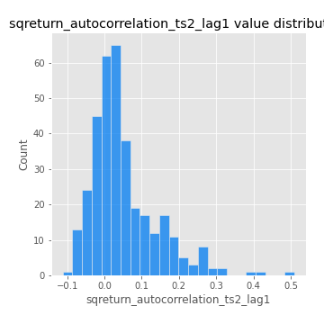

# Exploratory Data Analysis

[<< Go back](../README.md)
## Feature : target
- **Feature type** : categorical
- **Missing** : 0.0%
- **Unique** : 2
- **Count** :347
- **Unique** :2
- **Top** :real
- **Freq** :175

## Feature : return_mean1
- **Feature type** : continous
- **Missing** : 0.0%
- **Unique** : 347
- **Count** :347.0
- **Mean** :0.04908958145400302
- **Std** :0.07673582629713019
- **Min** :-0.22632637961920957
- **25%th Percentile** : 0.0041423459339339375
- **50%th Percentile** : 0.05022405572124724
- **75%th Percentile** : 0.08987959818057312
- **Max** :0.3612366374600757

## Feature : return_mean2
- **Feature type** : continous
- **Missing** : 0.0%
- **Unique** : 347
- **Count** :347.0
- **Mean** :0.05674994649708343
- **Std** :0.08891662300405145
- **Min** :-0.2626446118048269
- **25%th Percentile** : 0.014413758469241412
- **50%th Percentile** : 0.06079791453820509
- **75%th Percentile** : 0.10376553834359777
- **Max** :0.397683928513667

## Feature : return_sd1
- **Feature type** : continous
- **Missing** : 0.0%
- **Unique** : 347
- **Count** :347.0
- **Mean** :1.7640267689130242
- **Std** :0.7100935154014437
- **Min** :0.7620831696941981
- **25%th Percentile** : 1.545854411165438
- **50%th Percentile** : 1.6011991828203347
- **75%th Percentile** : 1.7092530179714605
- **Max** :9.236766377527575

## Feature : return_sd2
- **Feature type** : continous
- **Missing** : 0.0%
- **Unique** : 347
- **Count** :347.0
- **Mean** :1.7564953100759524
- **Std** :0.6833567020990137
- **Min** :0.8967691504919791
- **25%th Percentile** : 1.5173428568166705
- **50%th Percentile** : 1.5970114443223224
- **75%th Percentile** : 1.6746417017374104
- **Max** :5.872800253666788

## Feature : return_skew1
- **Feature type** : continous
- **Missing** : 0.0%
- **Unique** : 347
- **Count** :347.0
- **Mean** :-0.10913174514358649
- **Std** :0.5903685113624534
- **Min** :-3.530116233761814
- **25%th Percentile** : -0.19795879220014645
- **50%th Percentile** : -0.046358290911718565
- **75%th Percentile** : 0.08823654175919145
- **Max** :1.989411030028313

## Feature : return_skew2
- **Feature type** : continous
- **Missing** : 0.0%
- **Unique** : 347
- **Count** :347.0
- **Mean** :-0.1429498495684109
- **Std** :0.7995502002256629
- **Min** :-8.801502855292393
- **25%th Percentile** : -0.23204672254394254
- **50%th Percentile** : -0.032873965127060284
- **75%th Percentile** : 0.11013142439382148
- **Max** :2.2606839051517187

## Feature : return_kurtosis1
- **Feature type** : continous
- **Missing** : 0.0%
- **Unique** : 347
- **Count** :347.0
- **Mean** :3.1885798663863882
- **Std** :6.0328244295889615
- **Min** :-0.478679618945713
- **25%th Percentile** : -0.031021303255663213
- **50%th Percentile** : 0.6819093157517129
- **75%th Percentile** : 3.691025264972352
- **Max** :46.07507808162177

## Feature : return_kurtosis2
- **Feature type** : continous
- **Missing** : 0.0%
- **Unique** : 347
- **Count** :347.0
- **Mean** :3.852503810536969
- **Std** :10.03657470207341
- **Min** :-0.4618470797981522
- **25%th Percentile** : 0.001003052577024821
- **50%th Percentile** : 0.5936617182652233
- **75%th Percentile** : 4.087838595779396
- **Max** :143.10871011533666

## Feature : return_autocorrelation_1_lag1
- **Feature type** : continous
- **Missing** : 0.0%
- **Unique** : 347
- **Count** :347.0
- **Mean** :-0.01164382944792002
- **Std** :0.05474143001783803
- **Min** :-0.20673896439036124
- **25%th Percentile** : -0.04339301721567962
- **50%th Percentile** : -0.004799298360894114
- **75%th Percentile** : 0.023320849012775556
- **Max** :0.12810656890648087

## Feature : return_autocorrelation_1_lag2
- **Feature type** : continous
- **Missing** : 0.0%
- **Unique** : 347
- **Count** :347.0
- **Mean** :-0.002458847514296768
- **Std** :0.04955724756673503
- **Min** :-0.13309283796645122
- **25%th Percentile** : -0.03377602380614195
- **50%th Percentile** : -0.001692338786825923
- **75%th Percentile** : 0.028967004853421446
- **Max** :0.1561488228015672

## Feature : return_autocorrelation_1_lag3
- **Feature type** : continous
- **Missing** : 0.0%
- **Unique** : 347
- **Count** :347.0
- **Mean** :-0.0018807686375844524
- **Std** :0.05031633428972161
- **Min** :-0.15806635192103805
- **25%th Percentile** : -0.032586426133559415
- **50%th Percentile** : -0.0031684174976995
- **75%th Percentile** : 0.033428056881941406
- **Max** :0.17805869530681923

## Feature : return_autocorrelation_2_lag1
- **Feature type** : continous
- **Missing** : 0.0%
- **Unique** : 347
- **Count** :347.0
- **Mean** :-0.007653414104704589
- **Std** :0.05857650865066792
- **Min** :-0.25075531010123286
- **25%th Percentile** : -0.03983163825441843
- **50%th Percentile** : -0.005203239601871359
- **75%th Percentile** : 0.03214985914753657
- **Max** :0.12697062263649106

## Feature : return_autocorrelation_2_lag2
- **Feature type** : continous
- **Missing** : 0.0%
- **Unique** : 347
- **Count** :347.0
- **Mean** :-0.0015400693755161555
- **Std** :0.04941002632774458
- **Min** :-0.15323211089747296
- **25%th Percentile** : -0.035652744557130994
- **50%th Percentile** : -0.0031301622656402027
- **75%th Percentile** : 0.03057746001109372
- **Max** :0.14734721826682337

## Feature : return_autocorrelation_2_lag3
- **Feature type** : continous
- **Missing** : 0.0%
- **Unique** : 347
- **Count** :347.0
- **Mean** :-0.0034649461261095213
- **Std** :0.0503877308741473
- **Min** :-0.14200107169559698
- **25%th Percentile** : -0.03948701359179689
- **50%th Percentile** : -0.001992969453947655
- **75%th Percentile** : 0.034258945447321554
- **Max** :0.15059192833677293

## Feature : return_correlation_ts1_lag_0
- **Feature type** : continous
- **Missing** : 0.0%
- **Unique** : 347
- **Count** :347.0
- **Mean** :0.3211901287995628
- **Std** :0.10561040018750821
- **Min** :-0.027089510445801036
- **25%th Percentile** : 0.266909800806543
- **50%th Percentile** : 0.3240720873308323
- **75%th Percentile** : 0.367598394520566
- **Max** :0.7041861626832071

## Feature : return_correlation_ts1_lag_1
- **Feature type** : continous
- **Missing** : 0.0%
- **Unique** : 347
- **Count** :347.0
- **Mean** :-0.0062728323936613005
- **Std** :0.052425212954755315
- **Min** :-0.15776193292681923
- **25%th Percentile** : -0.04149885762019008
- **50%th Percentile** : -0.0025970796580512935
- **75%th Percentile** : 0.028911727981449715
- **Max** :0.15499424718508623

## Feature : return_correlation_ts1_lag_2
- **Feature type** : continous
- **Missing** : 0.0%
- **Unique** : 347
- **Count** :347.0
- **Mean** :0.002038789961232498
- **Std** :0.04730713531046176
- **Min** :-0.12864410180561703
- **25%th Percentile** : -0.029535004096161478
- **50%th Percentile** : 0.0007035238366975462
- **75%th Percentile** : 0.03773963612999533
- **Max** :0.13402947302295556

## Feature : return_correlation_ts1_lag_3
- **Feature type** : continous
- **Missing** : 0.0%
- **Unique** : 347
- **Count** :347.0
- **Mean** :0.001284481197058579
- **Std** :0.05099209691594156
- **Min** :-0.1387112389621208
- **25%th Percentile** : -0.02912636746417029
- **50%th Percentile** : 0.000844159890827059
- **75%th Percentile** : 0.03337132794119521
- **Max** :0.1636773216468148

## Feature : return_correlation_ts2_lag_1
- **Feature type** : continous
- **Missing** : 0.0%
- **Unique** : 347
- **Count** :347.0
- **Mean** :-0.0057199777778143305
- **Std** :0.054854324626313955
- **Min** :-0.2081139431093261
- **25%th Percentile** : -0.035618836595989245
- **50%th Percentile** : -0.006491799686296998
- **75%th Percentile** : 0.03164996259393818
- **Max** :0.17208763791364762

## Feature : return_correlation_ts2_lag_2
- **Feature type** : continous
- **Missing** : 0.0%
- **Unique** : 347
- **Count** :347.0
- **Mean** :0.0023304040961597554
- **Std** :0.04791155194533072
- **Min** :-0.15299951737180204
- **25%th Percentile** : -0.028993840744705675
- **50%th Percentile** : -6.430254566090361e-05
- **75%th Percentile** : 0.03193855863836516
- **Max** :0.20772887392904255

## Feature : return_correlation_ts2_lag_3
- **Feature type** : continous
- **Missing** : 0.0%
- **Unique** : 347
- **Count** :347.0
- **Mean** :-0.0017321134394442277
- **Std** :0.05087729212657784
- **Min** :-0.17564076057312866
- **25%th Percentile** : -0.030698968802299935
- **50%th Percentile** : -0.000508512632100566
- **75%th Percentile** : 0.03564993552382858
- **Max** :0.13128380114518473

## Feature : sqreturn_autocorrelation_ts1_lag1
- **Feature type** : continous
- **Missing** : 0.0%
- **Unique** : 347
- **Count** :347.0
- **Mean** :0.051775391721724205
- **Std** :0.09583867923544273
- **Min** :-0.11020982745674947
- **25%th Percentile** : -0.011495542327585151
- **50%th Percentile** : 0.027557062906508074
- **75%th Percentile** : 0.08476889035149268
- **Max** :0.49414293176447355

## Feature : sqreturn_autocorrelation_ts1_lag2
- **Feature type** : continous
- **Missing** : 0.0%
- **Unique** : 347
- **Count** :347.0
- **Mean** :0.044226296656843814
- **Std** :0.08751574775186992
- **Min** :-0.11086239269975784
- **25%th Percentile** : -0.009118889782062652
- **50%th Percentile** : 0.022372924789686933
- **75%th Percentile** : 0.07212133531030507
- **Max** :0.4522162366773919

## Feature : sqreturn_autocorrelation_ts1_lag3
- **Feature type** : continous
- **Missing** : 0.0%
- **Unique** : 347
- **Count** :347.0
- **Mean** :0.03042619761941508
- **Std** :0.07830621556786072
- **Min** :-0.09275721501353938
- **25%th Percentile** : -0.018581265540336702
- **50%th Percentile** : 0.01105841830109952
- **75%th Percentile** : 0.05720372512139932
- **Max** :0.41030914918857014

## Feature : sqreturn_autocorrelation_ts2_lag1
- **Feature type** : continous
- **Missing** : 0.0%
- **Unique** : 347
- **Count** :347.0
- **Mean** :0.049643947425122674
- **Std** :0.0887657470678452
- **Min** :-0.11230801560744504
- **25%th Percentile** : -0.00754947211249884
- **50%th Percentile** : 0.02968326968413354
- **75%th Percentile** : 0.08432500946327709
- **Max** :0.510085647437958

## Feature : sqreturn_autocorrelation_ts2_lag2
- **Feature type** : continous
- **Missing** : 0.0%
- **Unique** : 347
- **Count** :347.0
- **Mean** :0.03720845913113363
- **Std** :0.08463907838944237
- **Min** :-0.10026299101098021
- **25%th Percentile** : -0.013822549302815616
- **50%th Percentile** : 0.017783740767332964
- **75%th Percentile** : 0.056630874229091854
- **Max** :0.45676817892778204

## Feature : sqreturn_autocorrelation_ts2_lag3
- **Feature type** : continous
- **Missing** : 0.0%
- **Unique** : 347
- **Count** :347.0
- **Mean** :0.026518867635818556
- **Std** :0.06906814627967933
- **Min** :-0.11834614040834723
- **25%th Percentile** : -0.016462182249995846
- **50%th Percentile** : 0.012047049281430727
- **75%th Percentile** : 0.05513412908134757
- **Max** :0.31225727797735664

## Feature : sqreturn_correlation_ts1_lag_0
- **Feature type** : continous
- **Missing** : 0.0%
- **Unique** : 347
- **Count** :347.0
- **Mean** :0.3211901287995628
- **Std** :0.10561040018750821
- **Min** :-0.027089510445801036
- **25%th Percentile** : 0.266909800806543
- **50%th Percentile** : 0.3240720873308323
- **75%th Percentile** : 0.367598394520566
- **Max** :0.7041861626832071

## Feature : sqreturn_correlation_ts1_lag_1
- **Feature type** : continous
- **Missing** : 0.0%
- **Unique** : 347
- **Count** :347.0
- **Mean** :-0.0062728323936613005
- **Std** :0.052425212954755315
- **Min** :-0.15776193292681923
- **25%th Percentile** : -0.04149885762019008
- **50%th Percentile** : -0.0025970796580512935
- **75%th Percentile** : 0.028911727981449715
- **Max** :0.15499424718508623

## Feature : sqreturn_correlation_ts1_lag_2
- **Feature type** : continous
- **Missing** : 0.0%
- **Unique** : 347
- **Count** :347.0
- **Mean** :0.002038789961232498
- **Std** :0.04730713531046176
- **Min** :-0.12864410180561703
- **25%th Percentile** : -0.029535004096161478
- **50%th Percentile** : 0.0007035238366975462
- **75%th Percentile** : 0.03773963612999533
- **Max** :0.13402947302295556

## Feature : sqreturn_correlation_ts1_lag_3
- **Feature type** : continous
- **Missing** : 0.0%
- **Unique** : 347
- **Count** :347.0
- **Mean** :0.001284481197058579
- **Std** :0.05099209691594156
- **Min** :-0.1387112389621208
- **25%th Percentile** : -0.02912636746417029
- **50%th Percentile** : 0.000844159890827059
- **75%th Percentile** : 0.03337132794119521
- **Max** :0.1636773216468148

## Feature : sqreturn_correlation_ts2_lag_1
- **Feature type** : continous
- **Missing** : 0.0%
- **Unique** : 347
- **Count** :347.0
- **Mean** :-0.0057199777778143305
- **Std** :0.054854324626313955
- **Min** :-0.2081139431093261
- **25%th Percentile** : -0.035618836595989245
- **50%th Percentile** : -0.006491799686296998
- **75%th Percentile** : 0.03164996259393818
- **Max** :0.17208763791364762

## Feature : sqreturn_correlation_ts2_lag_2
- **Feature type** : continous
- **Missing** : 0.0%
- **Unique** : 347
- **Count** :347.0
- **Mean** :0.0023304040961597554
- **Std** :0.04791155194533072
- **Min** :-0.15299951737180204
- **25%th Percentile** : -0.028993840744705675
- **50%th Percentile** : -6.430254566090361e-05
- **75%th Percentile** : 0.03193855863836516
- **Max** :0.20772887392904255

## Feature : sqreturn_correlation_ts2_lag_3
- **Feature type** : continous
- **Missing** : 0.0%
- **Unique** : 347
- **Count** :347.0
- **Mean** :-0.0017321134394442277
- **Std** :0.05087729212657784
- **Min** :-0.17564076057312866
- **25%th Percentile** : -0.030698968802299935
- **50%th Percentile** : -0.000508512632100566
- **75%th Percentile** : 0.03564993552382858
- **Max** :0.13128380114518473

## Feature : price2_granger_cause_price1
- **Feature type** : continous
- **Missing** : 0.0%
- **Unique** : 347
- **Count** :347.0
- **Mean** :0.29708323366142214
- **Std** :0.283364828729282
- **Min** :1.754451168725191e-05
- **25%th Percentile** : 0.05288766451596582
- **50%th Percentile** : 0.19746341048318203
- **75%th Percentile** : 0.49288916197351035
- **Max** :0.9885712803689185

## Feature : price1_granger_cause_price2
- **Feature type** : continous
- **Missing** : 0.0%
- **Unique** : 347
- **Count** :347.0
- **Mean** :0.2936935160043068
- **Std** :0.2846786520247278
- **Min** :1.897466666076798e-07
- **25%th Percentile** : 0.03623481075369257
- **50%th Percentile** : 0.22433366089041326
- **75%th Percentile** : 0.5029854359723541
- **Max** :0.9951398266867577

[<< Go back](../README.md)
