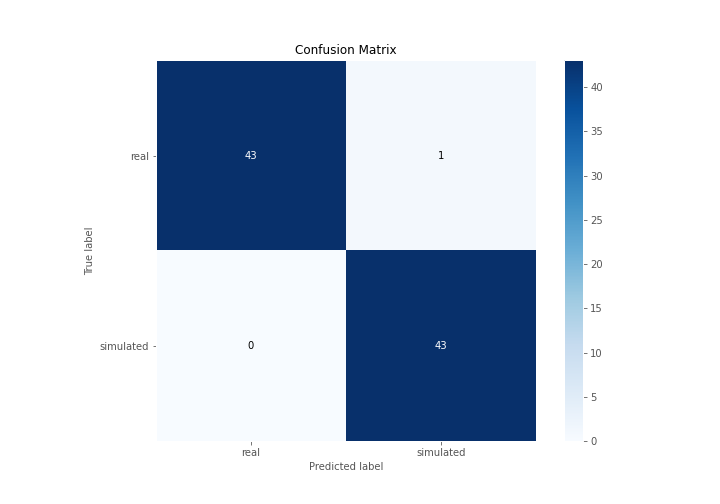
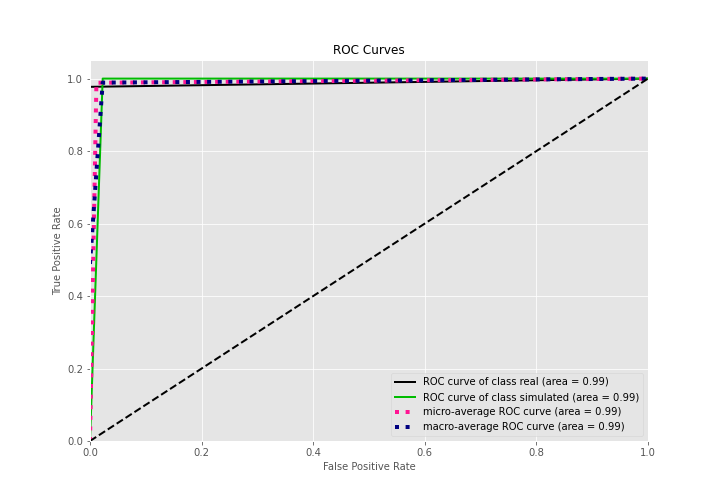
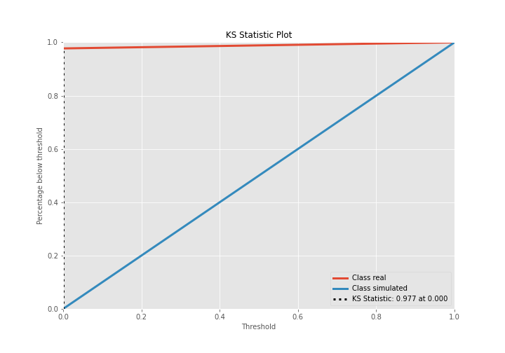
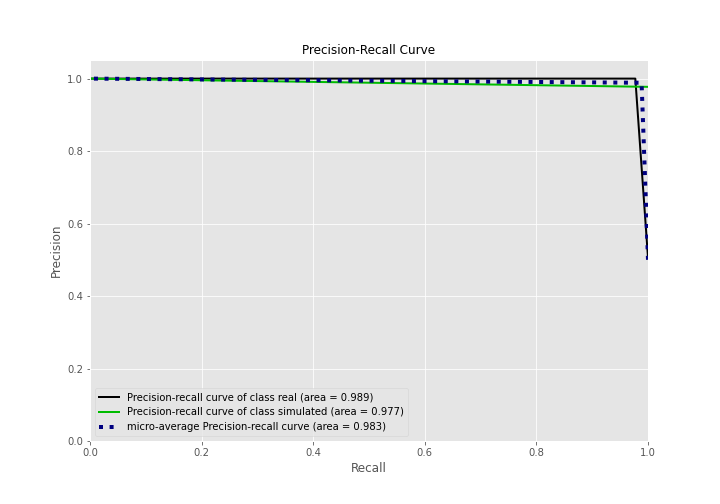
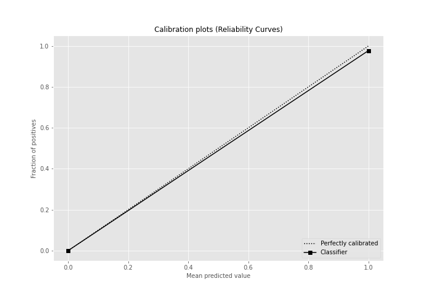
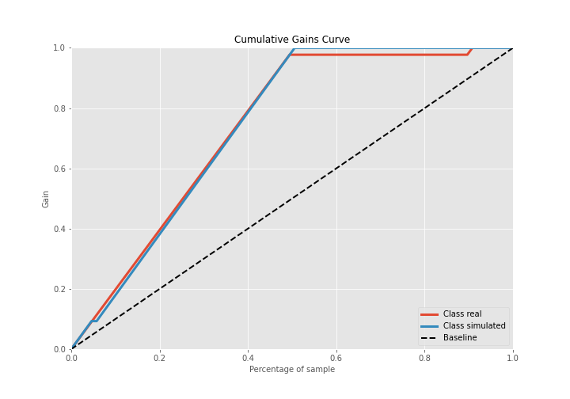
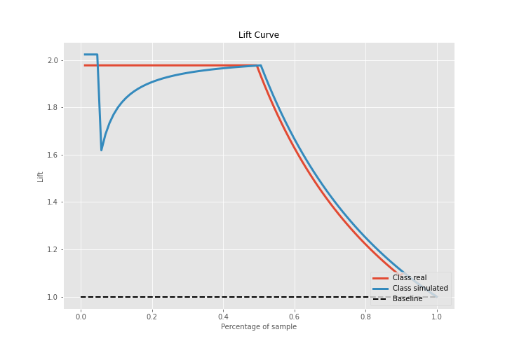

# Summary of Ensemble

[<< Go back](../README.md)

## Ensemble structure
| Model          |   Weight |
|:---------------|---------:|
| 2_DecisionTree |        1 |

## Metric details
|           |    score |   threshold |
|:----------|---------:|------------:|
| logloss   | 0.1588   |         nan |
| auc       | 0.988636 |         nan |
| f1        | 0.988506 |           0 |
| accuracy  | 0.988506 |           0 |
| precision | 0.977273 |           0 |
| recall    | 1        |           0 |
| mcc       | 0.977273 |           0 |

## Confusion matrix (at threshold=0.0)
|                      |   Predicted as real |   Predicted as simulated |
|:---------------------|--------------------:|-------------------------:|
| Labeled as real      |                  43 |                        1 |
| Labeled as simulated |                   0 |                       43 |

## Learning curves

## Confusion Matrix

## Normalized Confusion Matrix

## ROC Curve

## Kolmogorov-Smirnov Statistic

## Precision-Recall Curve

## Calibration Curve

## Cumulative Gains Curve

## Lift Curve

[<< Go back](../README.md)
