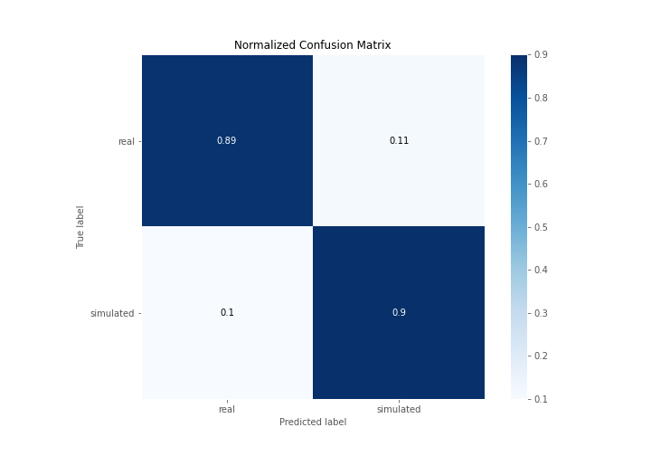
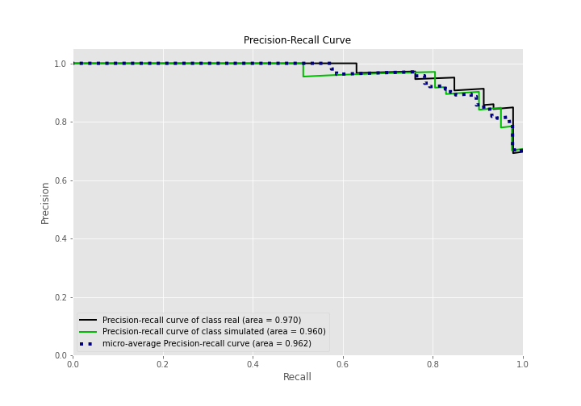

# Summary of 3_Linear

[<< Go back](../README.md)

## Logistic Regression (Linear)
- **n_jobs**: -1
- **explain_level**: 2

## Validation
 - **validation_type**: split
 - **train_ratio**: 0.75
 - **shuffle**: True
 - **stratify**: True

## Optimized metric
accuracy

## Training time

2.9 seconds

## Metric details
|           |    score |     threshold |
|:----------|---------:|--------------:|
| logloss   | 0.289539 | nan           |
| auc       | 0.963415 | nan           |
| f1        | 0.891566 |   0.560472    |
| accuracy  | 0.896552 |   0.560472    |
| precision | 1        |   0.821031    |
| recall    | 1        |   2.93325e-10 |
| mcc       | 0.792903 |   0.560472    |

## Confusion matrix (at threshold=0.560472)
|                      |   Predicted as real |   Predicted as simulated |
|:---------------------|--------------------:|-------------------------:|
| Labeled as real      |                  41 |                        5 |
| Labeled as simulated |                   4 |                       37 |

## Learning curves

## Coefficients
| feature                           |   Learner_1 |
|:----------------------------------|------------:|
| sqreturn_autocorrelation_ts2_lag3 |   2.09239   |
| sqreturn_autocorrelation_ts2_lag2 |   1.28178   |
| return_mean1                      |   1.25577   |
| sqreturn_autocorrelation_ts2_lag1 |   1.15776   |
| return_mean2                      |   1.07044   |
| return_autocorrelation_2_lag1     |   0.938283  |
| return_autocorrelation_1_lag1     |   0.684144  |
| sqreturn_correlation_ts1_lag_1    |   0.672763  |
| return_correlation_ts1_lag_1      |   0.672763  |
| sqreturn_autocorrelation_ts1_lag3 |   0.661006  |
| return_sd1                        |   0.602506  |
| sqreturn_correlation_ts1_lag_0    |   0.453907  |
| return_correlation_ts1_lag_0      |   0.453907  |
| return_correlation_ts1_lag_3      |   0.421134  |
| sqreturn_correlation_ts1_lag_3    |   0.421134  |
| sqreturn_correlation_ts2_lag_1    |   0.396173  |
| return_correlation_ts2_lag_1      |   0.396173  |
| return_autocorrelation_2_lag3     |   0.355718  |
| sqreturn_autocorrelation_ts1_lag1 |   0.317845  |
| sqreturn_autocorrelation_ts1_lag2 |   0.317103  |
| return_autocorrelation_2_lag2     |   0.150616  |
| return_autocorrelation_1_lag3     |   0.123299  |
| sqreturn_correlation_ts2_lag_3    |   0.0526715 |
| return_correlation_ts2_lag_3      |   0.0526715 |
| return_correlation_ts2_lag_2      |   0.0472617 |
| sqreturn_correlation_ts2_lag_2    |   0.0472617 |
| return_autocorrelation_1_lag2     |  -0.0205948 |
| return_correlation_ts1_lag_2      |  -0.136816  |
| sqreturn_correlation_ts1_lag_2    |  -0.136816  |
| return_sd2                        |  -0.190276  |
| price1_granger_cause_price2       |  -0.355422  |
| return_kurtosis2                  |  -1.13081   |
| return_skew1                      |  -1.35162   |
| price2_granger_cause_price1       |  -1.43054   |
| return_skew2                      |  -1.48302   |
| intercept                         |  -2.46299   |
| return_kurtosis1                  |  -3.66291   |

## Permutation-based Importance

## Confusion Matrix

## Normalized Confusion Matrix

## ROC Curve

## Kolmogorov-Smirnov Statistic

## Precision-Recall Curve

## Calibration Curve

## Cumulative Gains Curve

## Lift Curve

## SHAP Importance

## SHAP Dependence plots

### Dependence (Fold 1)

## SHAP Decision plots

### Top-10 Worst decisions for class 0 (Fold 1)

### Top-10 Best decisions for class 0 (Fold 1)

### Top-10 Worst decisions for class 1 (Fold 1)

### Top-10 Best decisions for class 1 (Fold 1)

[<< Go back](../README.md)
