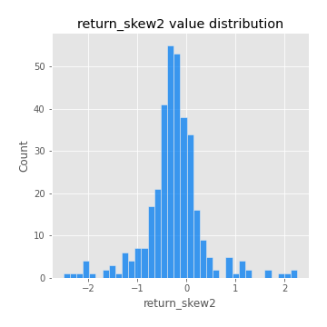

# Exploratory Data Analysis

[<< Go back](../README.md)
## Feature : target
- **Feature type** : categorical
- **Missing** : 0.0%
- **Unique** : 2
- **Count** :347
- **Unique** :2
- **Top** :real
- **Freq** :183

## Feature : return_mean1
- **Feature type** : continous
- **Missing** : 0.0%
- **Unique** : 347
- **Count** :347.0
- **Mean** :0.08548684488325259
- **Std** :0.08323951540015949
- **Min** :-0.22632637961920957
- **25%th Percentile** : 0.03250903500246879
- **50%th Percentile** : 0.08200890046287351
- **75%th Percentile** : 0.12858912130299693
- **Max** :0.37175100008111034

## Feature : return_mean2
- **Feature type** : continous
- **Missing** : 0.0%
- **Unique** : 347
- **Count** :347.0
- **Mean** :0.06605028878835816
- **Std** :0.11499639462181976
- **Min** :-0.4545086465549605
- **25%th Percentile** : 0.012020900148366397
- **50%th Percentile** : 0.07269512368201045
- **75%th Percentile** : 0.13580405183059352
- **Max** :0.37616608147096464

## Feature : return_sd1
- **Feature type** : continous
- **Missing** : 0.0%
- **Unique** : 347
- **Count** :347.0
- **Mean** :2.032031667245028
- **Std** :0.8065811353224831
- **Min** :0.7470080772831957
- **25%th Percentile** : 1.534477305141047
- **50%th Percentile** : 1.957607458641844
- **75%th Percentile** : 2.4130057151356974
- **Max** :9.236766377527575

## Feature : return_sd2
- **Feature type** : continous
- **Missing** : 0.0%
- **Unique** : 347
- **Count** :347.0
- **Mean** :1.9954821255511432
- **Std** :0.9615201913974719
- **Min** :0.3855790148253378
- **25%th Percentile** : 1.3210250622101558
- **50%th Percentile** : 1.7670283693688271
- **75%th Percentile** : 2.4479682541875767
- **Max** :6.737618636746393

## Feature : return_skew1
- **Feature type** : continous
- **Missing** : 0.0%
- **Unique** : 347
- **Count** :347.0
- **Mean** :-0.19055484030978023
- **Std** :0.5762955136924701
- **Min** :-3.530116233761814
- **25%th Percentile** : -0.3690206560880982
- **50%th Percentile** : -0.15537182293042057
- **75%th Percentile** : 0.024658548003513865
- **Max** :2.224942816365292

## Feature : return_skew2
- **Feature type** : continous
- **Missing** : 0.0%
- **Unique** : 347
- **Count** :347.0
- **Mean** :-0.256464745208682
- **Std** :0.6084073079266399
- **Min** :-2.5169062744473636
- **25%th Percentile** : -0.4901453682831015
- **50%th Percentile** : -0.2593487757180425
- **75%th Percentile** : -0.011060907610213118
- **Max** :2.2606839051517187

## Feature : return_kurtosis1
- **Feature type** : continous
- **Missing** : 0.0%
- **Unique** : 347
- **Count** :347.0
- **Mean** :3.913143910887421
- **Std** :5.728674714318668
- **Min** :-0.03597263529845485
- **25%th Percentile** : 1.1250470486154698
- **50%th Percentile** : 1.848153554110842
- **75%th Percentile** : 3.9930614339876844
- **Max** :36.91113889081053

## Feature : return_kurtosis2
- **Feature type** : continous
- **Missing** : 0.0%
- **Unique** : 347
- **Count** :347.0
- **Mean** :4.945759464097405
- **Std** :5.332751882718617
- **Min** :0.15044486626750198
- **25%th Percentile** : 1.7843220129219612
- **50%th Percentile** : 3.1957500963209244
- **75%th Percentile** : 5.394812433543441
- **Max** :36.023880269969645

## Feature : return_autocorrelation_1_lag1
- **Feature type** : continous
- **Missing** : 0.0%
- **Unique** : 347
- **Count** :347.0
- **Mean** :-0.009386343871223937
- **Std** :0.06118324553663476
- **Min** :-0.20673896439036124
- **25%th Percentile** : -0.049779839073923915
- **50%th Percentile** : -0.004452624207810848
- **75%th Percentile** : 0.030338118984040263
- **Max** :0.1601053314791667

## Feature : return_autocorrelation_1_lag2
- **Feature type** : continous
- **Missing** : 0.0%
- **Unique** : 347
- **Count** :347.0
- **Mean** :-0.008739733595206156
- **Std** :0.057662847096528094
- **Min** :-0.16644711953772184
- **25%th Percentile** : -0.04824615293514616
- **50%th Percentile** : -0.009233265124969066
- **75%th Percentile** : 0.02878747172136209
- **Max** :0.16274707502833008

## Feature : return_autocorrelation_1_lag3
- **Feature type** : continous
- **Missing** : 0.0%
- **Unique** : 347
- **Count** :347.0
- **Mean** :-0.007311784564849887
- **Std** :0.05618921174725606
- **Min** :-0.1940836867390813
- **25%th Percentile** : -0.043383198049249554
- **50%th Percentile** : -0.005230672627303844
- **75%th Percentile** : 0.03283234604128971
- **Max** :0.12763089735780578

## Feature : return_autocorrelation_2_lag1
- **Feature type** : continous
- **Missing** : 0.0%
- **Unique** : 347
- **Count** :347.0
- **Mean** :-0.011699356680397779
- **Std** :0.06561989794213466
- **Min** :-0.25075531010123286
- **25%th Percentile** : -0.04959703646272169
- **50%th Percentile** : -0.013501011884741789
- **75%th Percentile** : 0.032441102250954174
- **Max** :0.18080794012065202

## Feature : return_autocorrelation_2_lag2
- **Feature type** : continous
- **Missing** : 0.0%
- **Unique** : 347
- **Count** :347.0
- **Mean** :-0.003107797051558682
- **Std** :0.05696434339342911
- **Min** :-0.16167475386240848
- **25%th Percentile** : -0.03997540606775668
- **50%th Percentile** : -0.005581521595017937
- **75%th Percentile** : 0.03297676807119276
- **Max** :0.19562521668047425

## Feature : return_autocorrelation_2_lag3
- **Feature type** : continous
- **Missing** : 0.0%
- **Unique** : 347
- **Count** :347.0
- **Mean** :-0.00466918938170807
- **Std** :0.056829358982392955
- **Min** :-0.1869368334131152
- **25%th Percentile** : -0.043215284737543935
- **50%th Percentile** : -0.003534976437756111
- **75%th Percentile** : 0.0319026857558532
- **Max** :0.1962708362479175

## Feature : return_correlation_ts1_lag_0
- **Feature type** : continous
- **Missing** : 0.0%
- **Unique** : 347
- **Count** :347.0
- **Mean** :0.3523993427056308
- **Std** :0.1487052058988357
- **Min** :-0.29011664151635247
- **25%th Percentile** : 0.2613815031267917
- **50%th Percentile** : 0.3859143866103728
- **75%th Percentile** : 0.4517523218714957
- **Max** :0.6949986865664105

## Feature : return_correlation_ts1_lag_1
- **Feature type** : continous
- **Missing** : 0.0%
- **Unique** : 347
- **Count** :347.0
- **Mean** :-0.0020191480250945832
- **Std** :0.05446370726254998
- **Min** :-0.15776193292681923
- **25%th Percentile** : -0.03849595035993712
- **50%th Percentile** : 0.0008555593415918072
- **75%th Percentile** : 0.03676200215753195
- **Max** :0.15499424718508623

## Feature : return_correlation_ts1_lag_2
- **Feature type** : continous
- **Missing** : 0.0%
- **Unique** : 347
- **Count** :347.0
- **Mean** :-0.004006502670444748
- **Std** :0.053139319941344354
- **Min** :-0.15918026595672133
- **25%th Percentile** : -0.041524133905437105
- **50%th Percentile** : -0.005084584010345165
- **75%th Percentile** : 0.0318071491891498
- **Max** :0.153541395678112

## Feature : return_correlation_ts1_lag_3
- **Feature type** : continous
- **Missing** : 0.0%
- **Unique** : 347
- **Count** :347.0
- **Mean** :-0.00446088792450377
- **Std** :0.0542042856477624
- **Min** :-0.15226097038103184
- **25%th Percentile** : -0.03887479320630684
- **50%th Percentile** : -0.0075209744170555036
- **75%th Percentile** : 0.030668100777736948
- **Max** :0.1636773216468148

## Feature : return_correlation_ts2_lag_1
- **Feature type** : continous
- **Missing** : 0.0%
- **Unique** : 347
- **Count** :347.0
- **Mean** :-0.004207735862404922
- **Std** :0.05472406029498866
- **Min** :-0.2081139431093261
- **25%th Percentile** : -0.03638892367351651
- **50%th Percentile** : -0.0031858225227619657
- **75%th Percentile** : 0.029164887435530935
- **Max** :0.17208763791364762

## Feature : return_correlation_ts2_lag_2
- **Feature type** : continous
- **Missing** : 0.0%
- **Unique** : 347
- **Count** :347.0
- **Mean** :8.92918581356125e-05
- **Std** :0.052930394444839254
- **Min** :-0.23751835475804678
- **25%th Percentile** : -0.035204040319244234
- **50%th Percentile** : 0.00017685560311833616
- **75%th Percentile** : 0.028910836236772448
- **Max** :0.1635610666898208

## Feature : return_correlation_ts2_lag_3
- **Feature type** : continous
- **Missing** : 0.0%
- **Unique** : 347
- **Count** :347.0
- **Mean** :-0.004363317466403997
- **Std** :0.053488713591273
- **Min** :-0.16212823605110202
- **25%th Percentile** : -0.03638813475148792
- **50%th Percentile** : -0.005131171745703576
- **75%th Percentile** : 0.03566929471185666
- **Max** :0.13322487094919103

## Feature : sqreturn_autocorrelation_ts1_lag1
- **Feature type** : continous
- **Missing** : 0.0%
- **Unique** : 347
- **Count** :347.0
- **Mean** :0.11078994980403416
- **Std** :0.08505281470561138
- **Min** :-0.06532118872798363
- **25%th Percentile** : 0.04867070120648678
- **50%th Percentile** : 0.09800974274157252
- **75%th Percentile** : 0.1589293059721335
- **Max** :0.49414293176447355

## Feature : sqreturn_autocorrelation_ts1_lag2
- **Feature type** : continous
- **Missing** : 0.0%
- **Unique** : 347
- **Count** :347.0
- **Mean** :0.11063994597398964
- **Std** :0.09004059773026227
- **Min** :-0.036488613749476824
- **25%th Percentile** : 0.037803004532887534
- **50%th Percentile** : 0.09701980385653904
- **75%th Percentile** : 0.16519826297110002
- **Max** :0.540735851444759

## Feature : sqreturn_autocorrelation_ts1_lag3
- **Feature type** : continous
- **Missing** : 0.0%
- **Unique** : 347
- **Count** :347.0
- **Mean** :0.09643811860488734
- **Std** :0.08674034362338041
- **Min** :-0.06486026764840777
- **25%th Percentile** : 0.03257117285305183
- **50%th Percentile** : 0.08216974324931174
- **75%th Percentile** : 0.14741910004972114
- **Max** :0.44755937369538146

## Feature : sqreturn_autocorrelation_ts2_lag1
- **Feature type** : continous
- **Missing** : 0.0%
- **Unique** : 347
- **Count** :347.0
- **Mean** :0.1363079424743023
- **Std** :0.10287604260129994
- **Min** :-0.08520586663750691
- **25%th Percentile** : 0.05251676913815924
- **50%th Percentile** : 0.12639510181575386
- **75%th Percentile** : 0.20138479086027786
- **Max** :0.5627648005829863

## Feature : sqreturn_autocorrelation_ts2_lag2
- **Feature type** : continous
- **Missing** : 0.0%
- **Unique** : 347
- **Count** :347.0
- **Mean** :0.1274401782931417
- **Std** :0.10862208487443786
- **Min** :-0.051523884196217395
- **25%th Percentile** : 0.032169931044099126
- **50%th Percentile** : 0.11304312961083483
- **75%th Percentile** : 0.19651642535205965
- **Max** :0.5373432415582473

## Feature : sqreturn_autocorrelation_ts2_lag3
- **Feature type** : continous
- **Missing** : 0.0%
- **Unique** : 347
- **Count** :347.0
- **Mean** :0.11209601331252692
- **Std** :0.10205897454888962
- **Min** :-0.06082766359524085
- **25%th Percentile** : 0.02540516688011514
- **50%th Percentile** : 0.09499736018801413
- **75%th Percentile** : 0.18246312999126618
- **Max** :0.43634116148132224

## Feature : sqreturn_correlation_ts1_lag_0
- **Feature type** : continous
- **Missing** : 0.0%
- **Unique** : 347
- **Count** :347.0
- **Mean** :0.3523993427056308
- **Std** :0.1487052058988357
- **Min** :-0.29011664151635247
- **25%th Percentile** : 0.2613815031267917
- **50%th Percentile** : 0.3859143866103728
- **75%th Percentile** : 0.4517523218714957
- **Max** :0.6949986865664105

## Feature : sqreturn_correlation_ts1_lag_1
- **Feature type** : continous
- **Missing** : 0.0%
- **Unique** : 347
- **Count** :347.0
- **Mean** :-0.0020191480250945832
- **Std** :0.05446370726254998
- **Min** :-0.15776193292681923
- **25%th Percentile** : -0.03849595035993712
- **50%th Percentile** : 0.0008555593415918072
- **75%th Percentile** : 0.03676200215753195
- **Max** :0.15499424718508623

## Feature : sqreturn_correlation_ts1_lag_2
- **Feature type** : continous
- **Missing** : 0.0%
- **Unique** : 347
- **Count** :347.0
- **Mean** :-0.004006502670444748
- **Std** :0.053139319941344354
- **Min** :-0.15918026595672133
- **25%th Percentile** : -0.041524133905437105
- **50%th Percentile** : -0.005084584010345165
- **75%th Percentile** : 0.0318071491891498
- **Max** :0.153541395678112

## Feature : sqreturn_correlation_ts1_lag_3
- **Feature type** : continous
- **Missing** : 0.0%
- **Unique** : 347
- **Count** :347.0
- **Mean** :-0.00446088792450377
- **Std** :0.0542042856477624
- **Min** :-0.15226097038103184
- **25%th Percentile** : -0.03887479320630684
- **50%th Percentile** : -0.0075209744170555036
- **75%th Percentile** : 0.030668100777736948
- **Max** :0.1636773216468148

## Feature : sqreturn_correlation_ts2_lag_1
- **Feature type** : continous
- **Missing** : 0.0%
- **Unique** : 347
- **Count** :347.0
- **Mean** :-0.004207735862404922
- **Std** :0.05472406029498866
- **Min** :-0.2081139431093261
- **25%th Percentile** : -0.03638892367351651
- **50%th Percentile** : -0.0031858225227619657
- **75%th Percentile** : 0.029164887435530935
- **Max** :0.17208763791364762

## Feature : sqreturn_correlation_ts2_lag_2
- **Feature type** : continous
- **Missing** : 0.0%
- **Unique** : 347
- **Count** :347.0
- **Mean** :8.92918581356125e-05
- **Std** :0.052930394444839254
- **Min** :-0.23751835475804678
- **25%th Percentile** : -0.035204040319244234
- **50%th Percentile** : 0.00017685560311833616
- **75%th Percentile** : 0.028910836236772448
- **Max** :0.1635610666898208

## Feature : sqreturn_correlation_ts2_lag_3
- **Feature type** : continous
- **Missing** : 0.0%
- **Unique** : 347
- **Count** :347.0
- **Mean** :-0.004363317466403997
- **Std** :0.053488713591273
- **Min** :-0.16212823605110202
- **25%th Percentile** : -0.03638813475148792
- **50%th Percentile** : -0.005131171745703576
- **75%th Percentile** : 0.03566929471185666
- **Max** :0.13322487094919103

## Feature : price2_granger_cause_price1
- **Feature type** : continous
- **Missing** : 0.0%
- **Unique** : 347
- **Count** :347.0
- **Mean** :0.29325060732903213
- **Std** :0.2959957739771622
- **Min** :3.916300473926503e-08
- **25%th Percentile** : 0.0300458728911373
- **50%th Percentile** : 0.18634240177835631
- **75%th Percentile** : 0.5067344269246494
- **Max** :0.9885712803689185

## Feature : price1_granger_cause_price2
- **Feature type** : continous
- **Missing** : 0.0%
- **Unique** : 347
- **Count** :347.0
- **Mean** :0.2790592604641752
- **Std** :0.27674967437493714
- **Min** :3.3409384035515197e-07
- **25%th Percentile** : 0.02791354497088771
- **50%th Percentile** : 0.20481960760991594
- **75%th Percentile** : 0.4818903756059878
- **Max** :0.9951398266867577

[<< Go back](../README.md)
