# Exploratory Data Analysis

[<< Go back](../README.md)
## Feature : target
- **Feature type** : categorical
- **Missing** : 0.0%
- **Unique** : 2
- **Count** :347
- **Unique** :2
- **Top** :simulated
- **Freq** :178

## Feature : return_mean1
- **Feature type** : continous
- **Missing** : 0.0%
- **Unique** : 347
- **Count** :347.0
- **Mean** :0.009515745332509522
- **Std** :0.12116232729820405
- **Min** :-0.4054179067473157
- **25%th Percentile** : -0.07249185997495698
- **50%th Percentile** : 0.015893431932282282
- **75%th Percentile** : 0.1079305639180917
- **Max** :0.3602793017097547

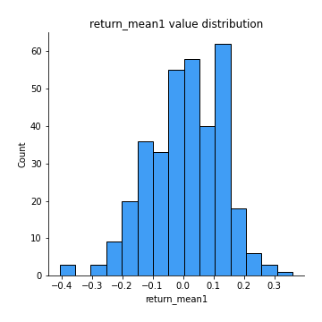
## Feature : return_mean2
- **Feature type** : continous
- **Missing** : 0.0%
- **Unique** : 347
- **Count** :347.0
- **Mean** :-0.020851141813045263
- **Std** :0.1352096028905712
- **Min** :-0.40684799756395623
- **25%th Percentile** : -0.10870717425318505
- **50%th Percentile** : -0.010211057245300454
- **75%th Percentile** : 0.07348483832517458
- **Max** :0.6801605239983173

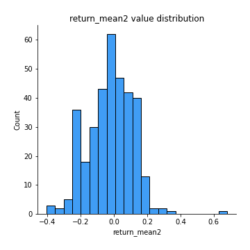
## Feature : return_sd1
- **Feature type** : continous
- **Missing** : 0.0%
- **Unique** : 347
- **Count** :347.0
- **Mean** :1.6267243678830263
- **Std** :0.3492892228454911
- **Min** :0.8102430347636637
- **25%th Percentile** : 1.498872665223588
- **50%th Percentile** : 1.5962976543410785
- **75%th Percentile** : 1.7127343301240585
- **Max** :3.332494027875222

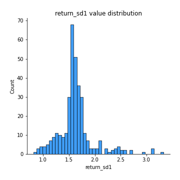
## Feature : return_sd2
- **Feature type** : continous
- **Missing** : 0.0%
- **Unique** : 347
- **Count** :347.0
- **Mean** :1.660164989962319
- **Std** :0.3989148147861155
- **Min** :0.9060171249911689
- **25%th Percentile** : 1.5155464240444838
- **50%th Percentile** : 1.6153855997262927
- **75%th Percentile** : 1.7071585398955
- **Max** :4.59233049161685

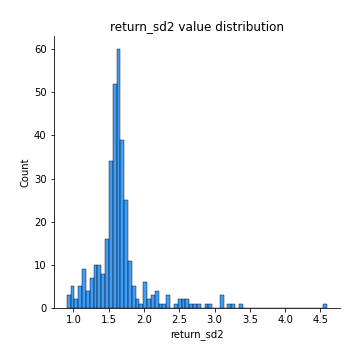
## Feature : return_skew1
- **Feature type** : continous
- **Missing** : 0.0%
- **Unique** : 347
- **Count** :347.0
- **Mean** :-0.16149925117510458
- **Std** :0.7219603065202238
- **Min** :-4.239645236578449
- **25%th Percentile** : -0.29753503610502047
- **50%th Percentile** : -0.06764036190052353
- **75%th Percentile** : 0.10101779975195027
- **Max** :2.351757728252051

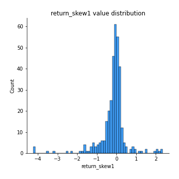
## Feature : return_skew2
- **Feature type** : continous
- **Missing** : 0.0%
- **Unique** : 347
- **Count** :347.0
- **Mean** :-0.2899174251268192
- **Std** :1.0662946730361316
- **Min** :-7.3762354994385335
- **25%th Percentile** : -0.3685067445448649
- **50%th Percentile** : -0.07036584725688608
- **75%th Percentile** : 0.08845747125435657
- **Max** :4.1920266082732045

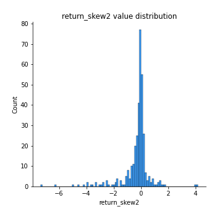
## Feature : return_kurtosis1
- **Feature type** : continous
- **Missing** : 0.0%
- **Unique** : 347
- **Count** :347.0
- **Mean** :2.5865141410529575
- **Std** :5.636273755933086
- **Min** :-0.621825272746674
- **25%th Percentile** : -0.07707974003839224
- **50%th Percentile** : 0.5407310755689534
- **75%th Percentile** : 2.373444226909248
- **Max** :40.485294874464934

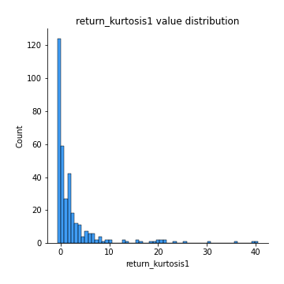
## Feature : return_kurtosis2
- **Feature type** : continous
- **Missing** : 0.0%
- **Unique** : 347
- **Count** :347.0
- **Mean** :4.351405081321979
- **Std** :10.042533619539787
- **Min** :-0.7296016346893648
- **25%th Percentile** : -0.07592393148710963
- **50%th Percentile** : 0.5826760481930346
- **75%th Percentile** : 3.8586921564822534
- **Max** :94.01659180149953

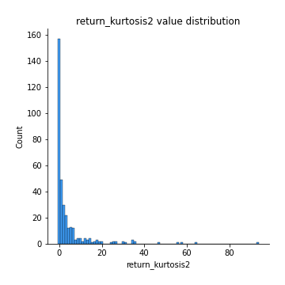
## Feature : return_autocorrelation_1_lag1
- **Feature type** : continous
- **Missing** : 0.0%
- **Unique** : 347
- **Count** :347.0
- **Mean** :0.003946499940641132
- **Std** :0.06874276447832203
- **Min** :-0.2110198016529991
- **25%th Percentile** : -0.04380018856888828
- **50%th Percentile** : 0.005498420456186117
- **75%th Percentile** : 0.04993093572871403
- **Max** :0.20132571463207988

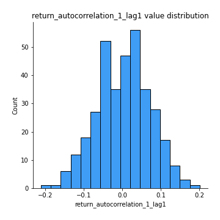
## Feature : return_autocorrelation_1_lag2
- **Feature type** : continous
- **Missing** : 0.0%
- **Unique** : 347
- **Count** :347.0
- **Mean** :0.010389298514983445
- **Std** :0.06894445937933959
- **Min** :-0.18815240041143846
- **25%th Percentile** : -0.039342014218820894
- **50%th Percentile** : 0.015092243350837392
- **75%th Percentile** : 0.05732587845721534
- **Max** :0.21123611097039302

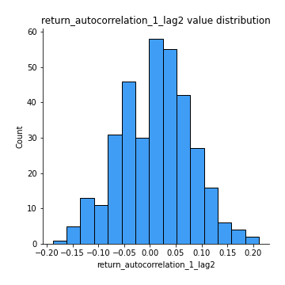
## Feature : return_autocorrelation_1_lag3
- **Feature type** : continous
- **Missing** : 0.0%
- **Unique** : 347
- **Count** :347.0
- **Mean** :0.02208916577331522
- **Std** :0.06388335996715555
- **Min** :-0.1817944619132489
- **25%th Percentile** : -0.01709423382794574
- **50%th Percentile** : 0.023588479843301913
- **75%th Percentile** : 0.06372882011674294
- **Max** :0.18772737973515863

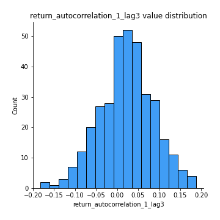
## Feature : return_autocorrelation_2_lag1
- **Feature type** : continous
- **Missing** : 0.0%
- **Unique** : 347
- **Count** :347.0
- **Mean** :0.028516690261257922
- **Std** :0.07321160266345975
- **Min** :-0.1725094589864579
- **25%th Percentile** : -0.024036851383433942
- **50%th Percentile** : 0.029613892520037613
- **75%th Percentile** : 0.0813690976557833
- **Max** :0.24498588898625462

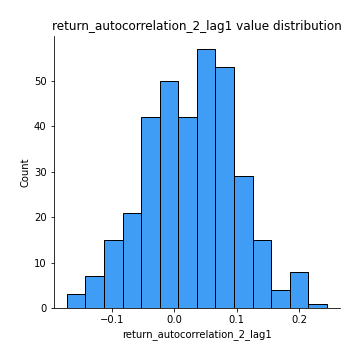
## Feature : return_autocorrelation_2_lag2
- **Feature type** : continous
- **Missing** : 0.0%
- **Unique** : 347
- **Count** :347.0
- **Mean** :0.019102490205503496
- **Std** :0.07709564127777588
- **Min** :-0.1758721664122366
- **25%th Percentile** : -0.03262168508053341
- **50%th Percentile** : 0.020625333978068414
- **75%th Percentile** : 0.07589220039008829
- **Max** :0.21331860860335894

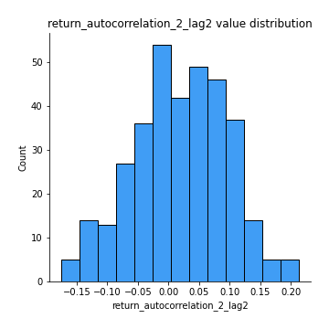
## Feature : return_autocorrelation_2_lag3
- **Feature type** : continous
- **Missing** : 0.0%
- **Unique** : 347
- **Count** :347.0
- **Mean** :0.03279484176203224
- **Std** :0.06345974327656966
- **Min** :-0.11294440903319043
- **25%th Percentile** : -0.012361730767940737
- **50%th Percentile** : 0.0373160676495313
- **75%th Percentile** : 0.07635014611702562
- **Max** :0.20205753622966244

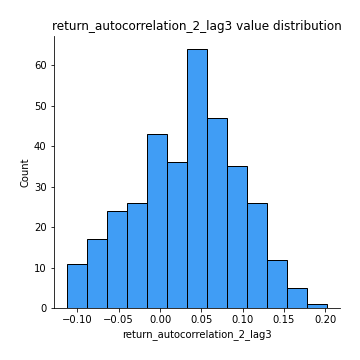
## Feature : return_correlation_ts1_lag_0
- **Feature type** : continous
- **Missing** : 0.0%
- **Unique** : 347
- **Count** :347.0
- **Mean** :0.3656171999685735
- **Std** :0.13957596049737536
- **Min** :-0.10256711281206837
- **25%th Percentile** : 0.31365122879961427
- **50%th Percentile** : 0.38187859781249517
- **75%th Percentile** : 0.4463042306671425
- **Max** :0.9937227277077512

## Feature : return_correlation_ts1_lag_1
- **Feature type** : continous
- **Missing** : 0.0%
- **Unique** : 347
- **Count** :347.0
- **Mean** :0.020507425574851443
- **Std** :0.06802572774530416
- **Min** :-0.18856827637524448
- **25%th Percentile** : -0.024809415993199274
- **50%th Percentile** : 0.020375490265437245
- **75%th Percentile** : 0.0671510067937931
- **Max** :0.24853583400816542

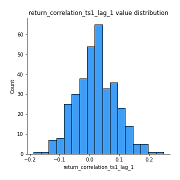
## Feature : return_correlation_ts1_lag_2
- **Feature type** : continous
- **Missing** : 0.0%
- **Unique** : 347
- **Count** :347.0
- **Mean** :0.018166366963165786
- **Std** :0.0683595565067959
- **Min** :-0.14326176299733834
- **25%th Percentile** : -0.027159381287984785
- **50%th Percentile** : 0.016757650974303276
- **75%th Percentile** : 0.06108337611472829
- **Max** :0.24662493340268027

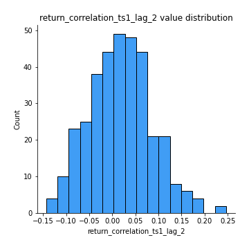
## Feature : return_correlation_ts1_lag_3
- **Feature type** : continous
- **Missing** : 0.0%
- **Unique** : 347
- **Count** :347.0
- **Mean** :0.026499835431844913
- **Std** :0.06974068031864049
- **Min** :-0.21147540839842804
- **25%th Percentile** : -0.01805552315093746
- **50%th Percentile** : 0.030978816189872534
- **75%th Percentile** : 0.0670312965889963
- **Max** :0.23808054096877584

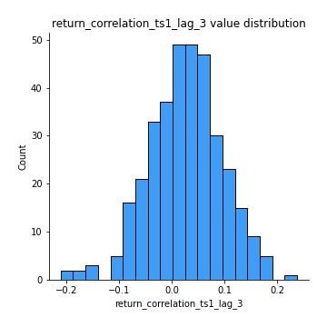
## Feature : return_correlation_ts2_lag_1
- **Feature type** : continous
- **Missing** : 0.0%
- **Unique** : 347
- **Count** :347.0
- **Mean** :0.024343512254185764
- **Std** :0.0703131110600412
- **Min** :-0.1363859619205903
- **25%th Percentile** : -0.021212794822865248
- **50%th Percentile** : 0.023325199027142585
- **75%th Percentile** : 0.074695193837269
- **Max** :0.3425036902091001

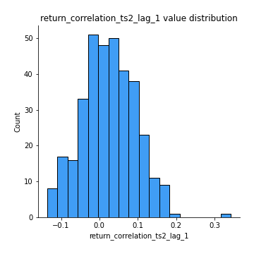
## Feature : return_correlation_ts2_lag_2
- **Feature type** : continous
- **Missing** : 0.0%
- **Unique** : 347
- **Count** :347.0
- **Mean** :0.014236573041485798
- **Std** :0.06873357918064527
- **Min** :-0.18381967289455395
- **25%th Percentile** : -0.02943456371731796
- **50%th Percentile** : 0.013171908697262296
- **75%th Percentile** : 0.06305173277036177
- **Max** :0.18420666717022235

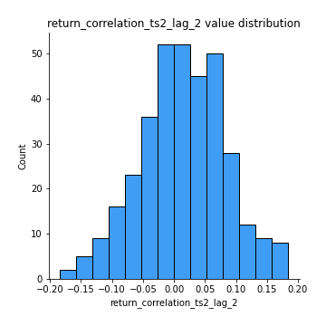
## Feature : return_correlation_ts2_lag_3
- **Feature type** : continous
- **Missing** : 0.0%
- **Unique** : 347
- **Count** :347.0
- **Mean** :0.028133283832358722
- **Std** :0.060729136241932054
- **Min** :-0.14829417896817343
- **25%th Percentile** : -0.010575862327663565
- **50%th Percentile** : 0.03388930677177767
- **75%th Percentile** : 0.06789360498937391
- **Max** :0.19142625874682098

## Feature : sqreturn_autocorrelation_ts1_lag1
- **Feature type** : continous
- **Missing** : 0.0%
- **Unique** : 347
- **Count** :347.0
- **Mean** :0.03345705938817876
- **Std** :0.08344181489207586
- **Min** :-0.1526017607452083
- **25%th Percentile** : -0.017505460869236225
- **50%th Percentile** : 0.017846705355337167
- **75%th Percentile** : 0.07714795325159879
- **Max** :0.4170324090514868

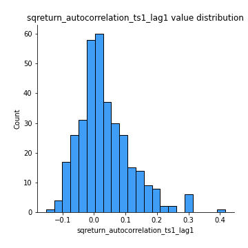
## Feature : sqreturn_autocorrelation_ts1_lag2
- **Feature type** : continous
- **Missing** : 0.0%
- **Unique** : 347
- **Count** :347.0
- **Mean** :0.02035421665855103
- **Std** :0.0727883753345855
- **Min** :-0.13609715439388645
- **25%th Percentile** : -0.029448510545193856
- **50%th Percentile** : 0.006527571743635394
- **75%th Percentile** : 0.05981771801992987
- **Max** :0.32836952056190194

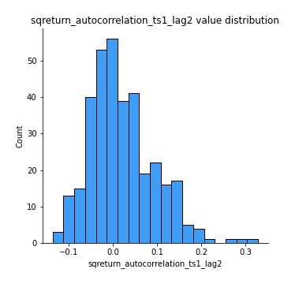
## Feature : sqreturn_autocorrelation_ts1_lag3
- **Feature type** : continous
- **Missing** : 0.0%
- **Unique** : 347
- **Count** :347.0
- **Mean** :0.012102093756739563
- **Std** :0.0643780417744987
- **Min** :-0.14260262711479021
- **25%th Percentile** : -0.03108529330450188
- **50%th Percentile** : 0.006986880195986891
- **75%th Percentile** : 0.04488261874937041
- **Max** :0.23856108238097126

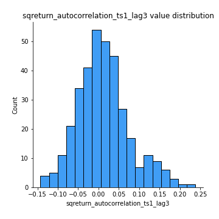
## Feature : sqreturn_autocorrelation_ts2_lag1
- **Feature type** : continous
- **Missing** : 0.0%
- **Unique** : 347
- **Count** :347.0
- **Mean** :0.025072132640507075
- **Std** :0.0774236000902731
- **Min** :-0.1646663454979093
- **25%th Percentile** : -0.02035983389385644
- **50%th Percentile** : 0.009984586535766104
- **75%th Percentile** : 0.06315181927800523
- **Max** :0.36991568023038357

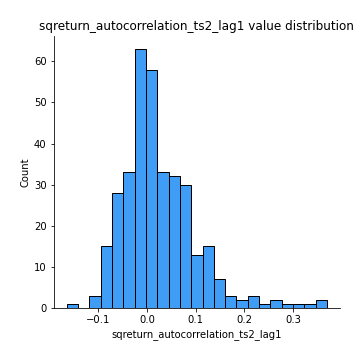
## Feature : sqreturn_autocorrelation_ts2_lag2
- **Feature type** : continous
- **Missing** : 0.0%
- **Unique** : 347
- **Count** :347.0
- **Mean** :0.01218495337836278
- **Std** :0.062312863873460515
- **Min** :-0.1655831376293271
- **25%th Percentile** : -0.024642229188310785
- **50%th Percentile** : 0.0030983799041858487
- **75%th Percentile** : 0.043806905354827785
- **Max** :0.28672056150180414

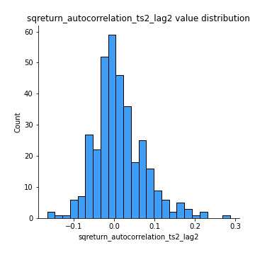
## Feature : sqreturn_autocorrelation_ts2_lag3
- **Feature type** : continous
- **Missing** : 0.0%
- **Unique** : 347
- **Count** :347.0
- **Mean** :0.006563547432857941
- **Std** :0.05962407741882845
- **Min** :-0.1307969942422863
- **25%th Percentile** : -0.029452555608320326
- **50%th Percentile** : -0.0012876717818051026
- **75%th Percentile** : 0.03976216288777078
- **Max** :0.231605349758384

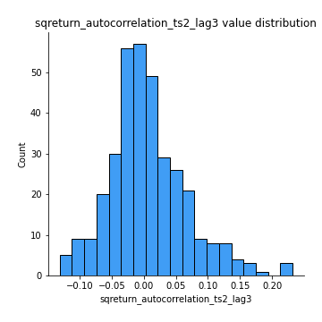
## Feature : sqreturn_correlation_ts1_lag_0
- **Feature type** : continous
- **Missing** : 0.0%
- **Unique** : 347
- **Count** :347.0
- **Mean** :0.3656171999685735
- **Std** :0.13957596049737536
- **Min** :-0.10256711281206837
- **25%th Percentile** : 0.31365122879961427
- **50%th Percentile** : 0.38187859781249517
- **75%th Percentile** : 0.4463042306671425
- **Max** :0.9937227277077512

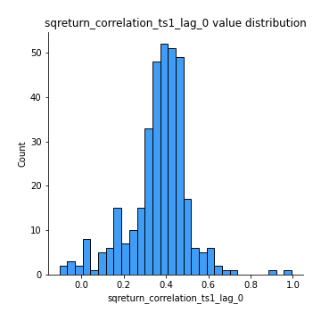
## Feature : sqreturn_correlation_ts1_lag_1
- **Feature type** : continous
- **Missing** : 0.0%
- **Unique** : 347
- **Count** :347.0
- **Mean** :0.020507425574851443
- **Std** :0.06802572774530416
- **Min** :-0.18856827637524448
- **25%th Percentile** : -0.024809415993199274
- **50%th Percentile** : 0.020375490265437245
- **75%th Percentile** : 0.0671510067937931
- **Max** :0.24853583400816542

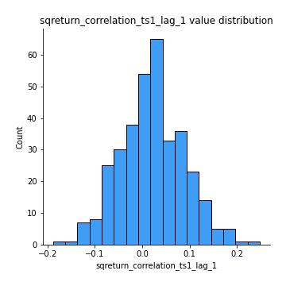
## Feature : sqreturn_correlation_ts1_lag_2
- **Feature type** : continous
- **Missing** : 0.0%
- **Unique** : 347
- **Count** :347.0
- **Mean** :0.018166366963165786
- **Std** :0.0683595565067959
- **Min** :-0.14326176299733834
- **25%th Percentile** : -0.027159381287984785
- **50%th Percentile** : 0.016757650974303276
- **75%th Percentile** : 0.06108337611472829
- **Max** :0.24662493340268027

## Feature : sqreturn_correlation_ts1_lag_3
- **Feature type** : continous
- **Missing** : 0.0%
- **Unique** : 347
- **Count** :347.0
- **Mean** :0.026499835431844913
- **Std** :0.06974068031864049
- **Min** :-0.21147540839842804
- **25%th Percentile** : -0.01805552315093746
- **50%th Percentile** : 0.030978816189872534
- **75%th Percentile** : 0.0670312965889963
- **Max** :0.23808054096877584

## Feature : sqreturn_correlation_ts2_lag_1
- **Feature type** : continous
- **Missing** : 0.0%
- **Unique** : 347
- **Count** :347.0
- **Mean** :0.024343512254185764
- **Std** :0.0703131110600412
- **Min** :-0.1363859619205903
- **25%th Percentile** : -0.021212794822865248
- **50%th Percentile** : 0.023325199027142585
- **75%th Percentile** : 0.074695193837269
- **Max** :0.3425036902091001

## Feature : sqreturn_correlation_ts2_lag_2
- **Feature type** : continous
- **Missing** : 0.0%
- **Unique** : 347
- **Count** :347.0
- **Mean** :0.014236573041485798
- **Std** :0.06873357918064527
- **Min** :-0.18381967289455395
- **25%th Percentile** : -0.02943456371731796
- **50%th Percentile** : 0.013171908697262296
- **75%th Percentile** : 0.06305173277036177
- **Max** :0.18420666717022235

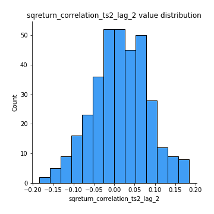
## Feature : sqreturn_correlation_ts2_lag_3
- **Feature type** : continous
- **Missing** : 0.0%
- **Unique** : 347
- **Count** :347.0
- **Mean** :0.028133283832358722
- **Std** :0.060729136241932054
- **Min** :-0.14829417896817343
- **25%th Percentile** : -0.010575862327663565
- **50%th Percentile** : 0.03388930677177767
- **75%th Percentile** : 0.06789360498937391
- **Max** :0.19142625874682098

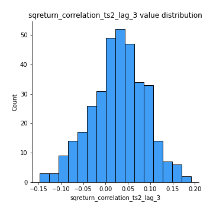
## Feature : price2_granger_cause_price1
- **Feature type** : continous
- **Missing** : 0.0%
- **Unique** : 347
- **Count** :347.0
- **Mean** :0.2293980894339513
- **Std** :0.27982678584258824
- **Min** :2.7137478688127782e-11
- **25%th Percentile** : 0.009858411608438566
- **50%th Percentile** : 0.10095618274262413
- **75%th Percentile** : 0.3603743158695203
- **Max** :0.9979528420543975

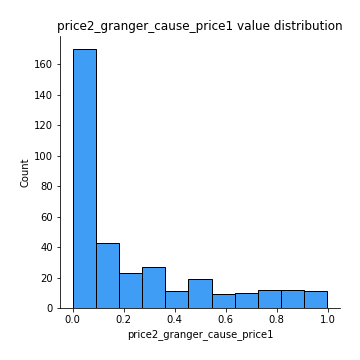
## Feature : price1_granger_cause_price2
- **Feature type** : continous
- **Missing** : 0.0%
- **Unique** : 347
- **Count** :347.0
- **Mean** :0.21650727651370358
- **Std** :0.27393368980248467
- **Min** :2.8209662589620122e-14
- **25%th Percentile** : 0.011566506052399948
- **50%th Percentile** : 0.08436851192304747
- **75%th Percentile** : 0.3242237490960812
- **Max** :0.9988116342587178

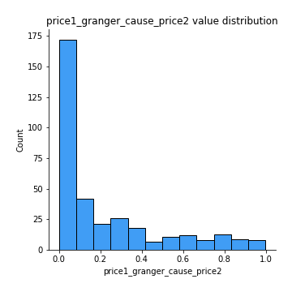

[<< Go back](../README.md)
