# Summary of 2_DecisionTree

[<< Go back](../README.md)

## Decision Tree
- **n_jobs**: -1
- **criterion**: gini
- **max_depth**: 3
- **explain_level**: 2

## Validation
 - **validation_type**: split
 - **train_ratio**: 0.75
 - **shuffle**: True
 - **stratify**: True

## Optimized metric
accuracy

## Training time

10.4 seconds

## Metric details
|           |    score |   threshold |
|:----------|---------:|------------:|
| logloss   | 0.729561 |  nan        |
| auc       | 0.881481 |  nan        |
| f1        | 0.909091 |    0.504164 |
| accuracy  | 0.908046 |    0.504164 |
| precision | 0.930233 |    0.504164 |
| recall    | 0.977778 |    0        |
| mcc       | 0.817028 |    0.504164 |

## Confusion matrix (at threshold=0.504164)
|                      |   Predicted as real |   Predicted as simulated |
|:---------------------|--------------------:|-------------------------:|
| Labeled as real      |                  39 |                        3 |
| Labeled as simulated |                   5 |                       40 |

## Learning curves
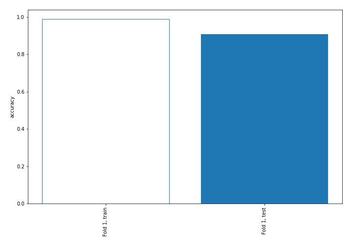

## Decision Tree 

### Tree #1
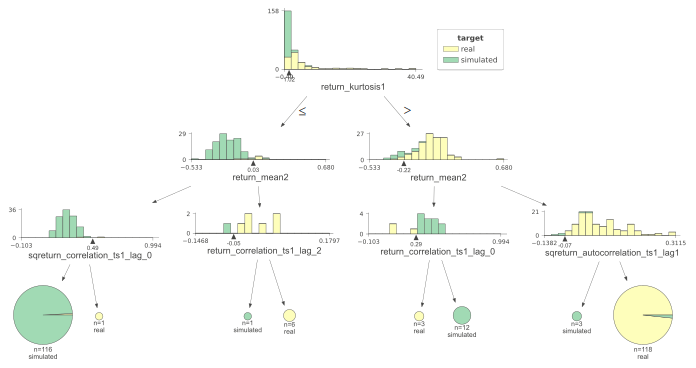

### Rules

if (return_kurtosis1 > 1.02) and (return_mean2 > -0.222) and (sqreturn_autocorrelation_ts1_lag1 > -0.068) then class: real (proba: 98.31%) | based on 118 samples

if (return_kurtosis1 <= 1.02) and (return_mean2 <= 0.025) and (sqreturn_correlation_ts1_lag_0 <= 0.492) then class: simulated (proba: 99.14%) | based on 116 samples

if (return_kurtosis1 > 1.02) and (return_mean2 <= -0.222) and (return_correlation_ts1_lag_0 > 0.291) then class: simulated (proba: 100.0%) | based on 12 samples

if (return_kurtosis1 <= 1.02) and (return_mean2 > 0.025) and (return_correlation_ts1_lag_2 > -0.054) then class: real (proba: 100.0%) | based on 6 samples

if (return_kurtosis1 > 1.02) and (return_mean2 > -0.222) and (sqreturn_autocorrelation_ts1_lag1 <= -0.068) then class: simulated (proba: 100.0%) | based on 3 samples

if (return_kurtosis1 > 1.02) and (return_mean2 <= -0.222) and (return_correlation_ts1_lag_0 <= 0.291) then class: real (proba: 100.0%) | based on 3 samples

if (return_kurtosis1 <= 1.02) and (return_mean2 > 0.025) and (return_correlation_ts1_lag_2 <= -0.054) then class: simulated (proba: 100.0%) | based on 1 samples

if (return_kurtosis1 <= 1.02) and (return_mean2 <= 0.025) and (sqreturn_correlation_ts1_lag_0 > 0.492) then class: real (proba: 100.0%) | based on 1 samples

## Permutation-based Importance
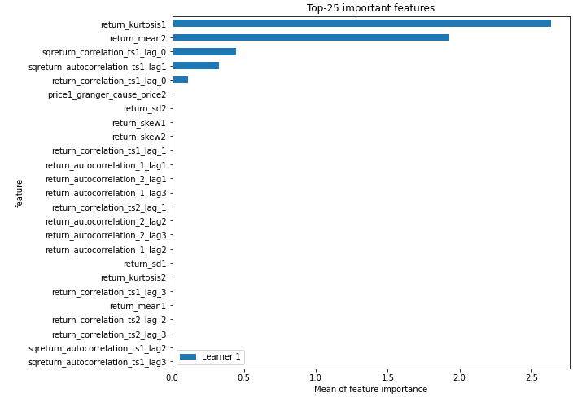
## Confusion Matrix

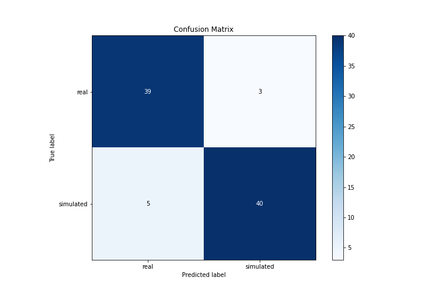

## Normalized Confusion Matrix

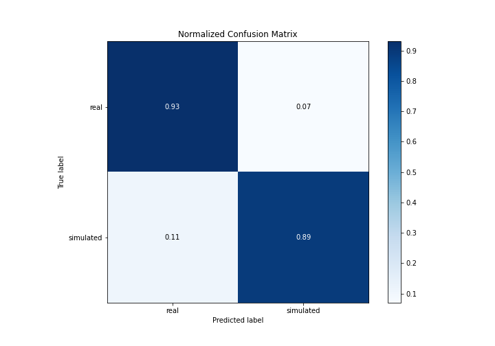

## ROC Curve

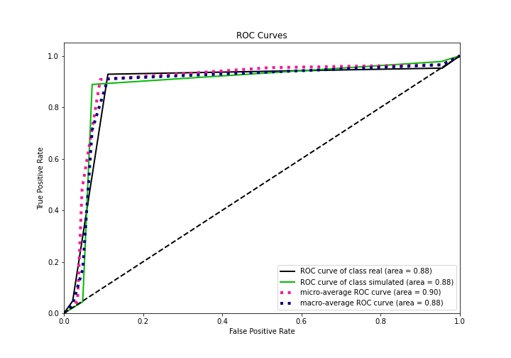

## Kolmogorov-Smirnov Statistic

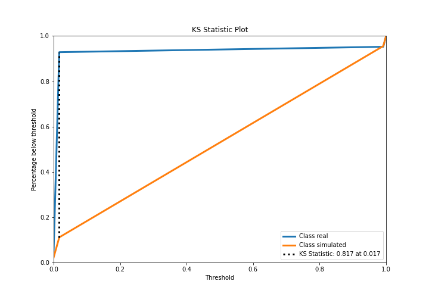

## Precision-Recall Curve

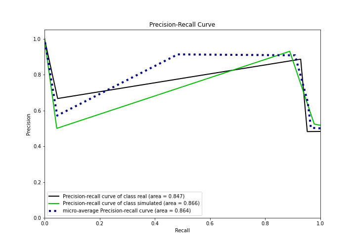

## Calibration Curve

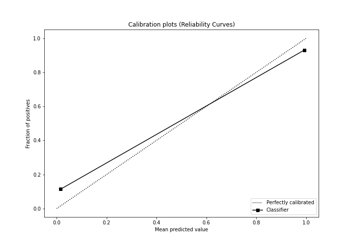

## Cumulative Gains Curve

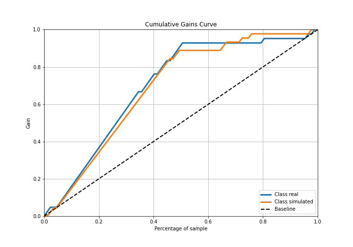

## Lift Curve

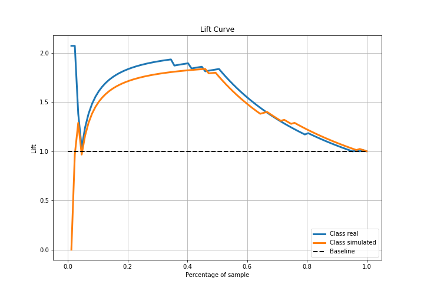

## SHAP Importance
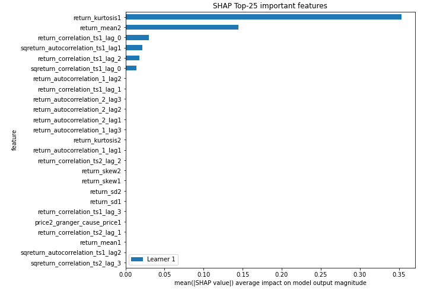

## SHAP Dependence plots

### Dependence (Fold 1)
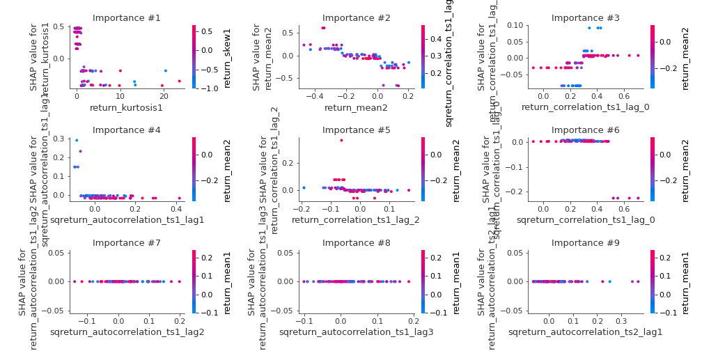

## SHAP Decision plots

### Top-10 Worst decisions for class 0 (Fold 1)
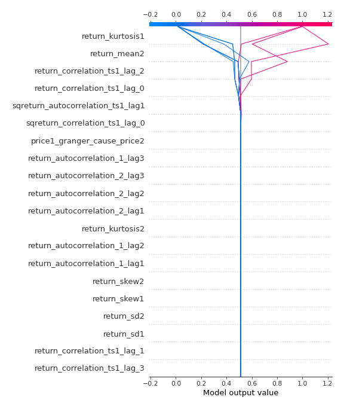
### Top-10 Best decisions for class 0 (Fold 1)
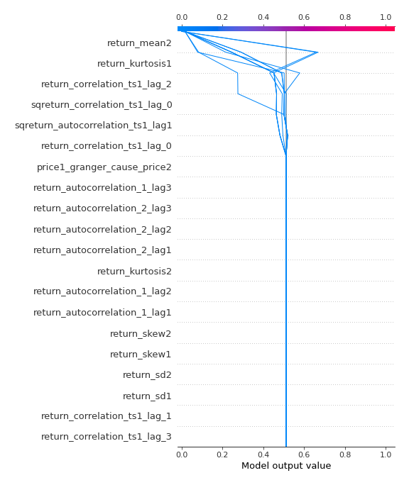
### Top-10 Worst decisions for class 1 (Fold 1)
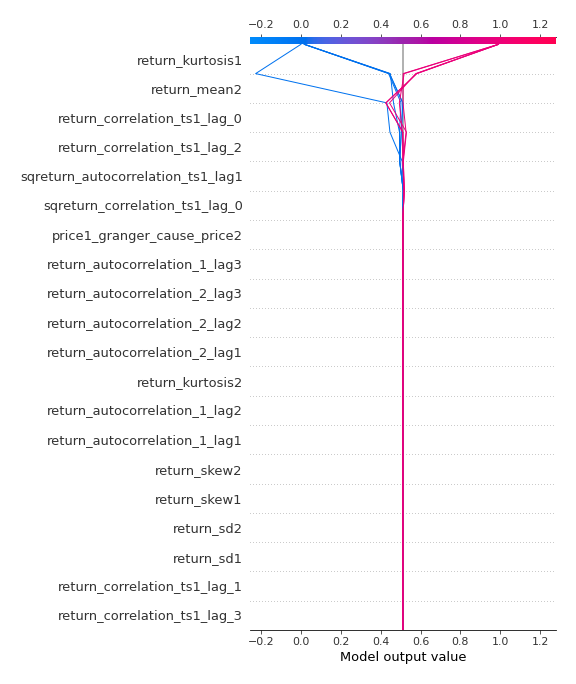
### Top-10 Best decisions for class 1 (Fold 1)
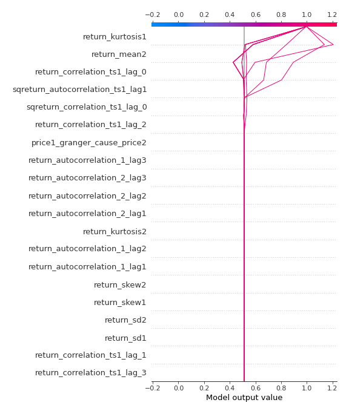

[<< Go back](../README.md)
