# Summary of 3_Linear

[<< Go back](../README.md)

## Logistic Regression (Linear)
- **n_jobs**: -1
- **explain_level**: 2

## Validation
 - **validation_type**: split
 - **train_ratio**: 0.75
 - **shuffle**: True
 - **stratify**: True

## Optimized metric
accuracy

## Training time

2.9 seconds

## Metric details
|           |    score |     threshold |
|:----------|---------:|--------------:|
| logloss   | 0.208963 | nan           |
| auc       | 0.99418  | nan           |
| f1        | 0.967742 |   0.371867    |
| accuracy  | 0.965517 |   0.388333    |
| precision | 1        |   0.897997    |
| recall    | 1        |   1.48346e-06 |
| mcc       | 0.933025 |   0.371867    |

## Confusion matrix (at threshold=0.388333)
|                      |   Predicted as real |   Predicted as simulated |
|:---------------------|--------------------:|-------------------------:|
| Labeled as real      |                  40 |                        2 |
| Labeled as simulated |                   1 |                       44 |

## Learning curves
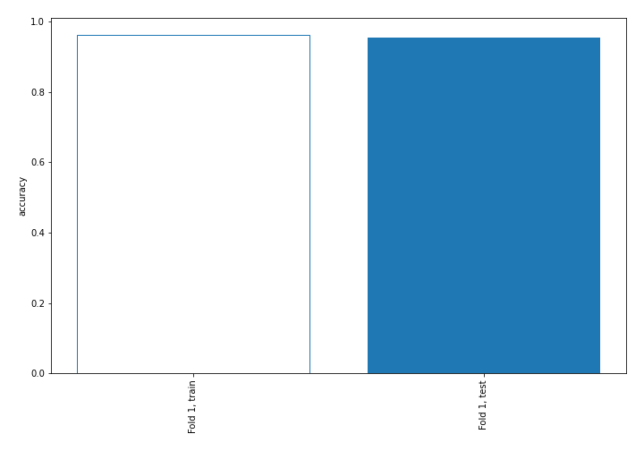

## Coefficients
| feature                           |   Learner_1 |
|:----------------------------------|------------:|
| return_mean1                      |   1.47799   |
| return_sd1                        |   0.699408  |
| price1_granger_cause_price2       |   0.691503  |
| return_autocorrelation_2_lag2     |   0.635704  |
| return_skew1                      |   0.418794  |
| price2_granger_cause_price1       |   0.395398  |
| return_autocorrelation_2_lag1     |   0.385378  |
| return_autocorrelation_1_lag1     |   0.318909  |
| return_autocorrelation_2_lag3     |   0.243808  |
| return_correlation_ts1_lag_1      |   0.193249  |
| sqreturn_correlation_ts1_lag_1    |   0.193249  |
| return_correlation_ts1_lag_2      |   0.162334  |
| sqreturn_correlation_ts1_lag_2    |   0.162334  |
| return_skew2                      |   0.149575  |
| return_correlation_ts2_lag_1      |   0.143162  |
| sqreturn_correlation_ts2_lag_1    |   0.143162  |
| sqreturn_correlation_ts2_lag_2    |  -0.0158397 |
| return_correlation_ts2_lag_2      |  -0.0158397 |
| return_kurtosis2                  |  -0.0986482 |
| return_sd2                        |  -0.101331  |
| return_autocorrelation_1_lag2     |  -0.110126  |
| return_correlation_ts2_lag_3      |  -0.217378  |
| sqreturn_correlation_ts2_lag_3    |  -0.217378  |
| return_autocorrelation_1_lag3     |  -0.226672  |
| sqreturn_correlation_ts1_lag_3    |  -0.295811  |
| return_correlation_ts1_lag_3      |  -0.295811  |
| sqreturn_autocorrelation_ts2_lag2 |  -0.366189  |
| sqreturn_correlation_ts1_lag_0    |  -0.425881  |
| return_correlation_ts1_lag_0      |  -0.425881  |
| sqreturn_autocorrelation_ts2_lag3 |  -0.560266  |
| sqreturn_autocorrelation_ts1_lag3 |  -0.644494  |
| sqreturn_autocorrelation_ts2_lag1 |  -0.775807  |
| intercept                         |  -1.04927   |
| sqreturn_autocorrelation_ts1_lag2 |  -1.19559   |
| sqreturn_autocorrelation_ts1_lag1 |  -1.47106   |
| return_kurtosis1                  |  -3.46247   |
| return_mean2                      |  -4.20684   |

## Permutation-based Importance
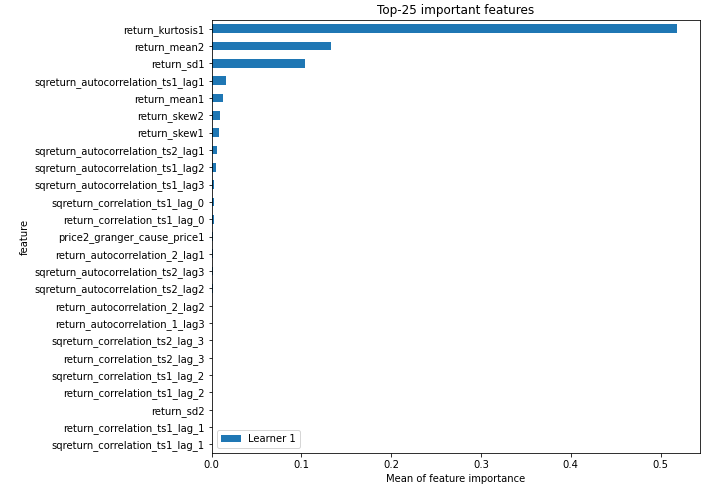
## Confusion Matrix

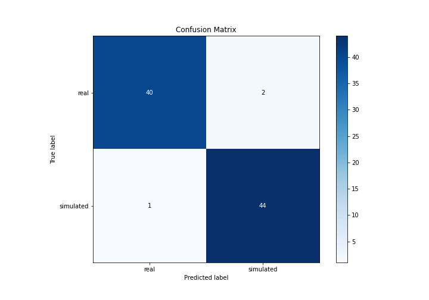

## Normalized Confusion Matrix

## ROC Curve

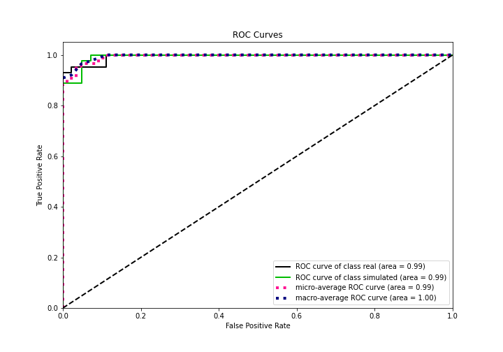

## Kolmogorov-Smirnov Statistic

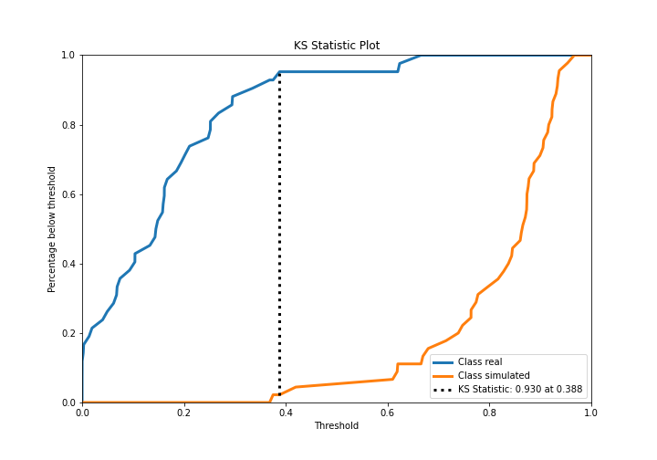

## Precision-Recall Curve

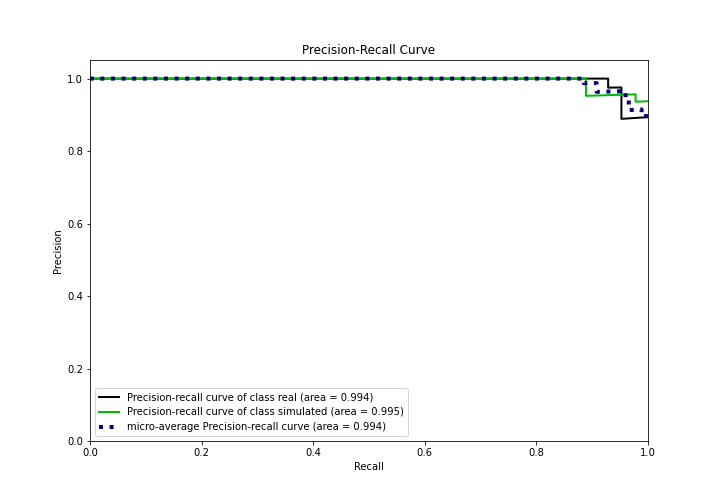

## Calibration Curve

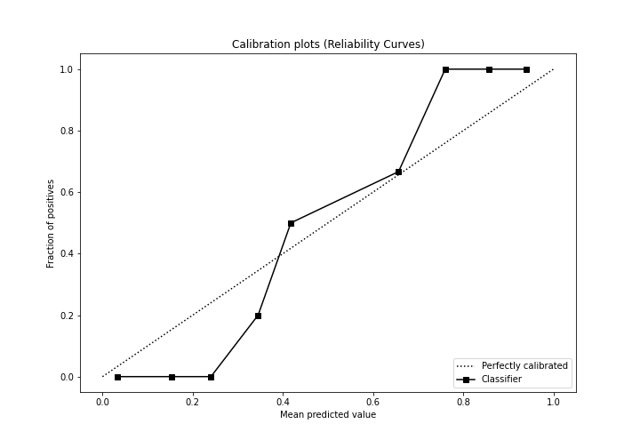

## Cumulative Gains Curve

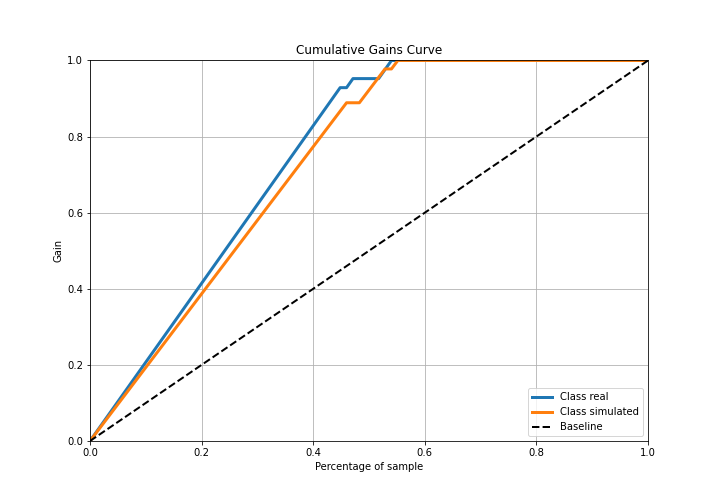

## Lift Curve

## SHAP Importance
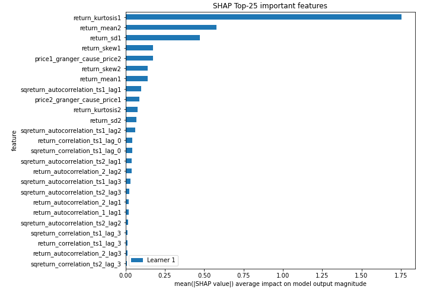

## SHAP Dependence plots

### Dependence (Fold 1)
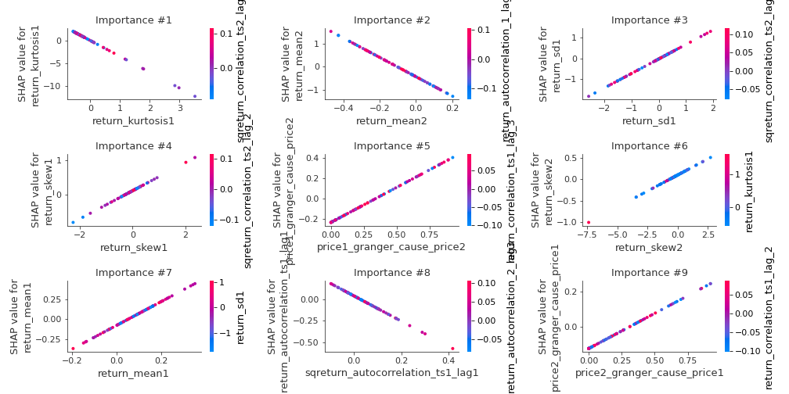

## SHAP Decision plots

### Top-10 Worst decisions for class 0 (Fold 1)
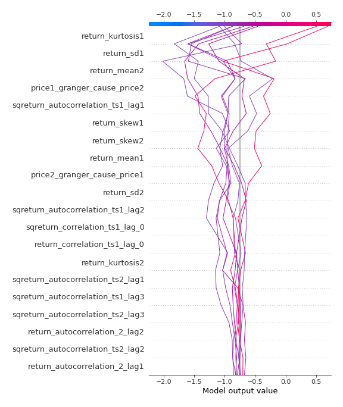
### Top-10 Best decisions for class 0 (Fold 1)
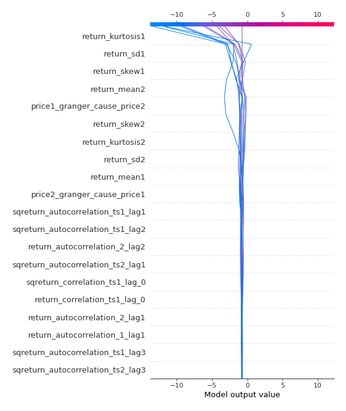
### Top-10 Worst decisions for class 1 (Fold 1)

### Top-10 Best decisions for class 1 (Fold 1)
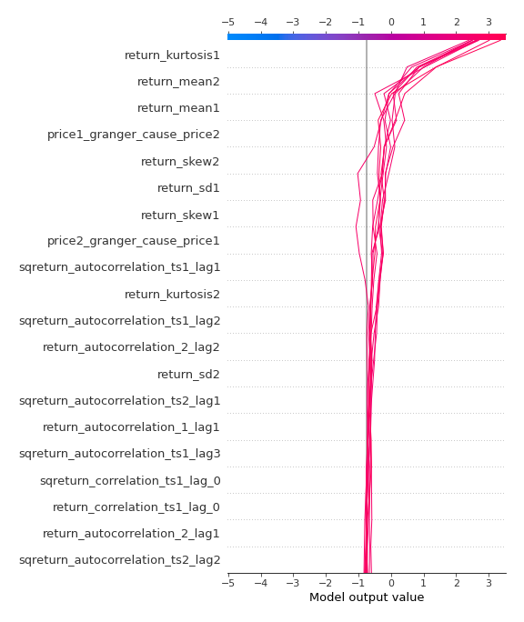

[<< Go back](../README.md)
