# Exploratory Data Analysis

[<< Go back](../README.md)
## Feature : target
- **Feature type** : categorical
- **Missing** : 0.0%
- **Unique** : 2
- **Count** :347
- **Unique** :2
- **Top** :simulated
- **Freq** :178

## Feature : return_mean1
- **Feature type** : continous
- **Missing** : 0.0%
- **Unique** : 347
- **Count** :347.0
- **Mean** :0.07478198600460453
- **Std** :0.12040453799538171
- **Min** :-0.23482450846197694
- **25%th Percentile** : 0.001326319555723834
- **50%th Percentile** : 0.08926685128355592
- **75%th Percentile** : 0.14997697347333486
- **Max** :0.3602793017097547

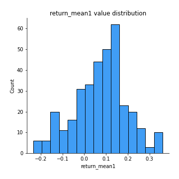
## Feature : return_mean2
- **Feature type** : continous
- **Missing** : 0.0%
- **Unique** : 347
- **Count** :347.0
- **Mean** :-0.09697740810990428
- **Std** :0.16585461905680113
- **Min** :-0.5331553112922757
- **25%th Percentile** : -0.23349638831904684
- **50%th Percentile** : -0.09744748038421491
- **75%th Percentile** : 0.02719124200732865
- **Max** :0.6801605239983173

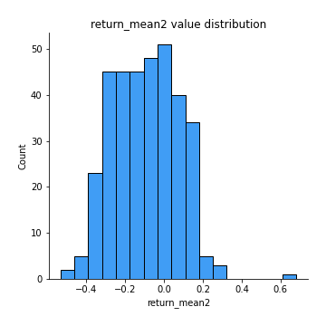
## Feature : return_sd1
- **Feature type** : continous
- **Missing** : 0.0%
- **Unique** : 347
- **Count** :347.0
- **Mean** :1.7768018452894576
- **Std** :0.3739474269699449
- **Min** :0.8102430347636637
- **25%th Percentile** : 1.5501179401540695
- **50%th Percentile** : 1.8391520636916234
- **75%th Percentile** : 1.9612082082087552
- **Max** :3.332494027875222

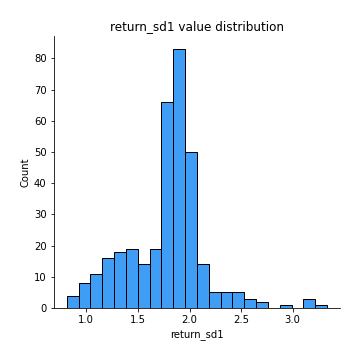
## Feature : return_sd2
- **Feature type** : continous
- **Missing** : 0.0%
- **Unique** : 347
- **Count** :347.0
- **Mean** :1.691865074018685
- **Std** :0.4178439734510436
- **Min** :0.9060171249911689
- **25%th Percentile** : 1.4846704596523257
- **50%th Percentile** : 1.635265867675676
- **75%th Percentile** : 1.8109205121096383
- **Max** :4.59233049161685

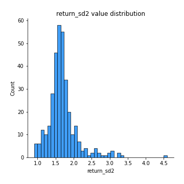
## Feature : return_skew1
- **Feature type** : continous
- **Missing** : 0.0%
- **Unique** : 347
- **Count** :347.0
- **Mean** :-0.1790923542648706
- **Std** :0.7323454758526905
- **Min** :-4.239645236578449
- **25%th Percentile** : -0.35927750326243313
- **50%th Percentile** : -0.083398020072847
- **75%th Percentile** : 0.09347405390688812
- **Max** :2.351757728252051

## Feature : return_skew2
- **Feature type** : continous
- **Missing** : 0.0%
- **Unique** : 347
- **Count** :347.0
- **Mean** :-0.31148260949999823
- **Std** :1.2853668599322805
- **Min** :-7.3762354994385335
- **25%th Percentile** : -0.6250466594723523
- **50%th Percentile** : -0.16066264161869848
- **75%th Percentile** : 0.25336360134404756
- **Max** :4.1920266082732045

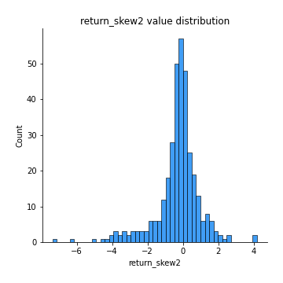
## Feature : return_kurtosis1
- **Feature type** : continous
- **Missing** : 0.0%
- **Unique** : 347
- **Count** :347.0
- **Mean** :2.8248307569009135
- **Std** :5.568467123294619
- **Min** :-0.4932946310500341
- **25%th Percentile** : 0.18861847643025964
- **50%th Percentile** : 1.0762203402336818
- **75%th Percentile** : 2.678812472527533
- **Max** :40.485294874464934

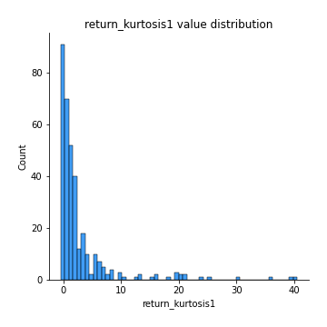
## Feature : return_kurtosis2
- **Feature type** : continous
- **Missing** : 0.0%
- **Unique** : 347
- **Count** :347.0
- **Mean** :7.232395648856386
- **Std** :10.33989795721847
- **Min** :0.2823316146469459
- **25%th Percentile** : 1.8680650878575435
- **50%th Percentile** : 3.3669237251805426
- **75%th Percentile** : 7.711504505741956
- **Max** :94.01659180149953

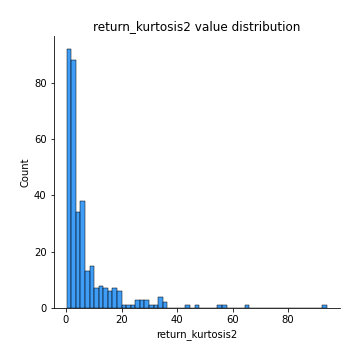
## Feature : return_autocorrelation_1_lag1
- **Feature type** : continous
- **Missing** : 0.0%
- **Unique** : 347
- **Count** :347.0
- **Mean** :-0.007932304235894026
- **Std** :0.06745662365651584
- **Min** :-0.21878398176391914
- **25%th Percentile** : -0.05193205812179308
- **50%th Percentile** : -0.008964989677899677
- **75%th Percentile** : 0.040514933377973794
- **Max** :0.20132571463207988

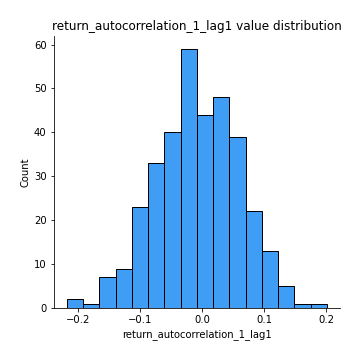
## Feature : return_autocorrelation_1_lag2
- **Feature type** : continous
- **Missing** : 0.0%
- **Unique** : 347
- **Count** :347.0
- **Mean** :-0.010230782220010955
- **Std** :0.06777682624832368
- **Min** :-0.18923017867837363
- **25%th Percentile** : -0.0542933190466159
- **50%th Percentile** : -0.015884808959095293
- **75%th Percentile** : 0.04208180863590577
- **Max** :0.2193019329481927

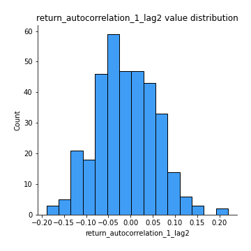
## Feature : return_autocorrelation_1_lag3
- **Feature type** : continous
- **Missing** : 0.0%
- **Unique** : 347
- **Count** :347.0
- **Mean** :0.0034133161189757854
- **Std** :0.06299625834088632
- **Min** :-0.1817944619132489
- **25%th Percentile** : -0.0353139495079093
- **50%th Percentile** : 0.006134155591203472
- **75%th Percentile** : 0.044345748847633405
- **Max** :0.17514033413395239

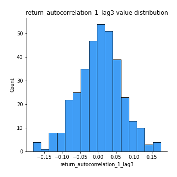
## Feature : return_autocorrelation_2_lag1
- **Feature type** : continous
- **Missing** : 0.0%
- **Unique** : 347
- **Count** :347.0
- **Mean** :0.008797848593214506
- **Std** :0.06497085323461504
- **Min** :-0.17063397189692434
- **25%th Percentile** : -0.037358112334069396
- **50%th Percentile** : 0.01318358468535092
- **75%th Percentile** : 0.05707370367231367
- **Max** :0.2024676054184499

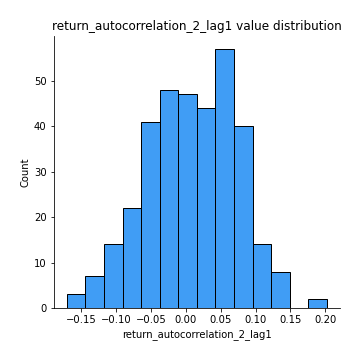
## Feature : return_autocorrelation_2_lag2
- **Feature type** : continous
- **Missing** : 0.0%
- **Unique** : 347
- **Count** :347.0
- **Mean** :-8.285294351892475e-05
- **Std** :0.06683149435784959
- **Min** :-0.1758721664122366
- **25%th Percentile** : -0.04367961982875738
- **50%th Percentile** : -0.0005142621145154361
- **75%th Percentile** : 0.044414576033283804
- **Max** :0.16665863056838787

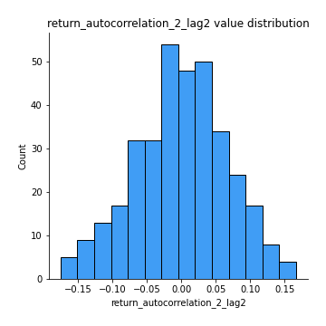
## Feature : return_autocorrelation_2_lag3
- **Feature type** : continous
- **Missing** : 0.0%
- **Unique** : 347
- **Count** :347.0
- **Mean** :0.015574973863742507
- **Std** :0.060621152402209756
- **Min** :-0.13558563939903107
- **25%th Percentile** : -0.022267150435655664
- **50%th Percentile** : 0.013487570450242252
- **75%th Percentile** : 0.05615459118081803
- **Max** :0.2503875965851727

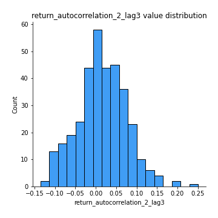
## Feature : return_correlation_ts1_lag_0
- **Feature type** : continous
- **Missing** : 0.0%
- **Unique** : 347
- **Count** :347.0
- **Mean** :0.30528544188550455
- **Std** :0.13972537497698595
- **Min** :-0.10256711281206837
- **25%th Percentile** : 0.2216027647044264
- **50%th Percentile** : 0.30134962730037207
- **75%th Percentile** : 0.37831574065540907
- **Max** :0.9937227277077512

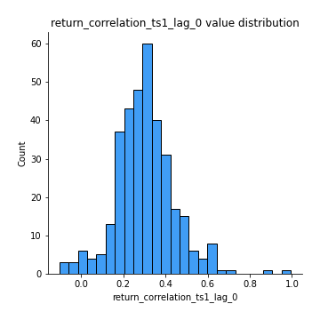
## Feature : return_correlation_ts1_lag_1
- **Feature type** : continous
- **Missing** : 0.0%
- **Unique** : 347
- **Count** :347.0
- **Mean** :-0.00018442910697842935
- **Std** :0.06104952139708268
- **Min** :-0.18856827637524448
- **25%th Percentile** : -0.04547274266631396
- **50%th Percentile** : 0.002643106823289453
- **75%th Percentile** : 0.0421387301886615
- **Max** :0.15692977190008

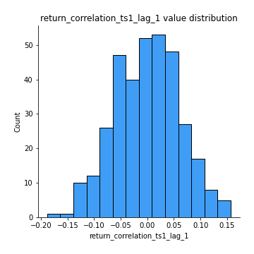
## Feature : return_correlation_ts1_lag_2
- **Feature type** : continous
- **Missing** : 0.0%
- **Unique** : 347
- **Count** :347.0
- **Mean** :-0.004136057893089218
- **Std** :0.06550024473322232
- **Min** :-0.1925735731596522
- **25%th Percentile** : -0.05013519228781255
- **50%th Percentile** : -0.007178610732419342
- **75%th Percentile** : 0.03841596502116444
- **Max** :0.17974071501626168

## Feature : return_correlation_ts1_lag_3
- **Feature type** : continous
- **Missing** : 0.0%
- **Unique** : 347
- **Count** :347.0
- **Mean** :0.007110941992683376
- **Std** :0.06419473933148272
- **Min** :-0.21147540839842804
- **25%th Percentile** : -0.03209005049659913
- **50%th Percentile** : 0.010033510013754004
- **75%th Percentile** : 0.050482392442143156
- **Max** :0.23808054096877584

## Feature : return_correlation_ts2_lag_1
- **Feature type** : continous
- **Missing** : 0.0%
- **Unique** : 347
- **Count** :347.0
- **Mean** :0.0019129763532272975
- **Std** :0.06386165341754012
- **Min** :-0.1363859619205903
- **25%th Percentile** : -0.038702939943891214
- **50%th Percentile** : -0.0017668387076470538
- **75%th Percentile** : 0.0416027107706643
- **Max** :0.3425036902091001

## Feature : return_correlation_ts2_lag_2
- **Feature type** : continous
- **Missing** : 0.0%
- **Unique** : 347
- **Count** :347.0
- **Mean** :-0.0036225708987223815
- **Std** :0.06525799900166082
- **Min** :-0.18381967289455395
- **25%th Percentile** : -0.042953798185540154
- **50%th Percentile** : -0.0008907718847468655
- **75%th Percentile** : 0.038968963825541894
- **Max** :0.1668209648754713

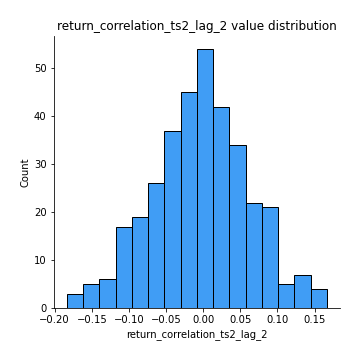
## Feature : return_correlation_ts2_lag_3
- **Feature type** : continous
- **Missing** : 0.0%
- **Unique** : 347
- **Count** :347.0
- **Mean** :0.008660712654833513
- **Std** :0.06106053480052897
- **Min** :-0.15443421578810443
- **25%th Percentile** : -0.03364956521933013
- **50%th Percentile** : 0.006547614993516044
- **75%th Percentile** : 0.05115977295572756
- **Max** :0.19750419128054372

## Feature : sqreturn_autocorrelation_ts1_lag1
- **Feature type** : continous
- **Missing** : 0.0%
- **Unique** : 347
- **Count** :347.0
- **Mean** :0.03127367299048719
- **Std** :0.08175485610108206
- **Min** :-0.13823530655551505
- **25%th Percentile** : -0.023156446439329632
- **50%th Percentile** : 0.01469708880167895
- **75%th Percentile** : 0.07439019676307981
- **Max** :0.4170324090514868

## Feature : sqreturn_autocorrelation_ts1_lag2
- **Feature type** : continous
- **Missing** : 0.0%
- **Unique** : 347
- **Count** :347.0
- **Mean** :0.02481427490200782
- **Std** :0.07262017999608937
- **Min** :-0.15663701480918815
- **25%th Percentile** : -0.021535648480655315
- **50%th Percentile** : 0.012389759789977276
- **75%th Percentile** : 0.0643337465034722
- **Max** :0.32836952056190194

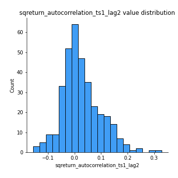
## Feature : sqreturn_autocorrelation_ts1_lag3
- **Feature type** : continous
- **Missing** : 0.0%
- **Unique** : 347
- **Count** :347.0
- **Mean** :0.010476701140864545
- **Std** :0.05951472175516057
- **Min** :-0.1088410846489741
- **25%th Percentile** : -0.030206986349526982
- **50%th Percentile** : 0.0032304897496262595
- **75%th Percentile** : 0.04358172023925112
- **Max** :0.23856108238097126

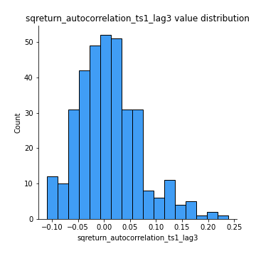
## Feature : sqreturn_autocorrelation_ts2_lag1
- **Feature type** : continous
- **Missing** : 0.0%
- **Unique** : 347
- **Count** :347.0
- **Mean** :0.02553227374502803
- **Std** :0.07411360279735721
- **Min** :-0.12423764603855178
- **25%th Percentile** : -0.02169922368906379
- **50%th Percentile** : 0.007615397807411632
- **75%th Percentile** : 0.05476943337643578
- **Max** :0.36991568023038357

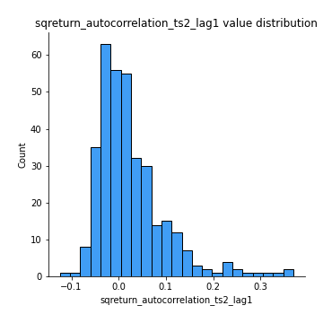
## Feature : sqreturn_autocorrelation_ts2_lag2
- **Feature type** : continous
- **Missing** : 0.0%
- **Unique** : 347
- **Count** :347.0
- **Mean** :0.009986714532402963
- **Std** :0.055332170952552315
- **Min** :-0.10245774787352878
- **25%th Percentile** : -0.0225539269255872
- **50%th Percentile** : -0.004009657684515282
- **75%th Percentile** : 0.034883214607514104
- **Max** :0.28672056150180414

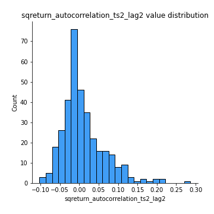
## Feature : sqreturn_autocorrelation_ts2_lag3
- **Feature type** : continous
- **Missing** : 0.0%
- **Unique** : 347
- **Count** :347.0
- **Mean** :0.002352791721396521
- **Std** :0.053760211493508625
- **Min** :-0.10313288200908279
- **25%th Percentile** : -0.031061285416900414
- **50%th Percentile** : -0.011739520947253775
- **75%th Percentile** : 0.02085977003566671
- **Max** :0.23563585207316115

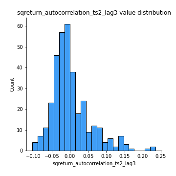
## Feature : sqreturn_correlation_ts1_lag_0
- **Feature type** : continous
- **Missing** : 0.0%
- **Unique** : 347
- **Count** :347.0
- **Mean** :0.30528544188550455
- **Std** :0.13972537497698595
- **Min** :-0.10256711281206837
- **25%th Percentile** : 0.2216027647044264
- **50%th Percentile** : 0.30134962730037207
- **75%th Percentile** : 0.37831574065540907
- **Max** :0.9937227277077512

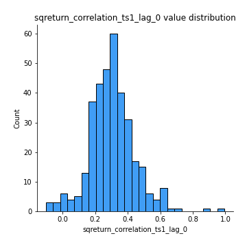
## Feature : sqreturn_correlation_ts1_lag_1
- **Feature type** : continous
- **Missing** : 0.0%
- **Unique** : 347
- **Count** :347.0
- **Mean** :-0.00018442910697842935
- **Std** :0.06104952139708268
- **Min** :-0.18856827637524448
- **25%th Percentile** : -0.04547274266631396
- **50%th Percentile** : 0.002643106823289453
- **75%th Percentile** : 0.0421387301886615
- **Max** :0.15692977190008

## Feature : sqreturn_correlation_ts1_lag_2
- **Feature type** : continous
- **Missing** : 0.0%
- **Unique** : 347
- **Count** :347.0
- **Mean** :-0.004136057893089218
- **Std** :0.06550024473322232
- **Min** :-0.1925735731596522
- **25%th Percentile** : -0.05013519228781255
- **50%th Percentile** : -0.007178610732419342
- **75%th Percentile** : 0.03841596502116444
- **Max** :0.17974071501626168

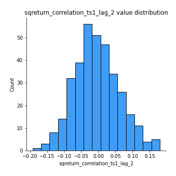
## Feature : sqreturn_correlation_ts1_lag_3
- **Feature type** : continous
- **Missing** : 0.0%
- **Unique** : 347
- **Count** :347.0
- **Mean** :0.007110941992683376
- **Std** :0.06419473933148272
- **Min** :-0.21147540839842804
- **25%th Percentile** : -0.03209005049659913
- **50%th Percentile** : 0.010033510013754004
- **75%th Percentile** : 0.050482392442143156
- **Max** :0.23808054096877584

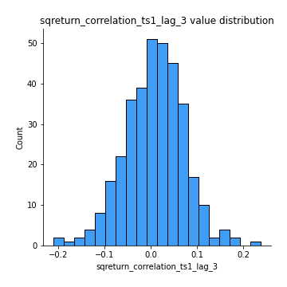
## Feature : sqreturn_correlation_ts2_lag_1
- **Feature type** : continous
- **Missing** : 0.0%
- **Unique** : 347
- **Count** :347.0
- **Mean** :0.0019129763532272975
- **Std** :0.06386165341754012
- **Min** :-0.1363859619205903
- **25%th Percentile** : -0.038702939943891214
- **50%th Percentile** : -0.0017668387076470538
- **75%th Percentile** : 0.0416027107706643
- **Max** :0.3425036902091001

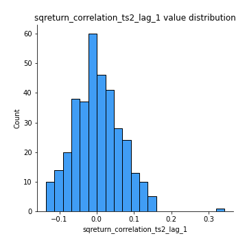
## Feature : sqreturn_correlation_ts2_lag_2
- **Feature type** : continous
- **Missing** : 0.0%
- **Unique** : 347
- **Count** :347.0
- **Mean** :-0.0036225708987223815
- **Std** :0.06525799900166082
- **Min** :-0.18381967289455395
- **25%th Percentile** : -0.042953798185540154
- **50%th Percentile** : -0.0008907718847468655
- **75%th Percentile** : 0.038968963825541894
- **Max** :0.1668209648754713

## Feature : sqreturn_correlation_ts2_lag_3
- **Feature type** : continous
- **Missing** : 0.0%
- **Unique** : 347
- **Count** :347.0
- **Mean** :0.008660712654833513
- **Std** :0.06106053480052897
- **Min** :-0.15443421578810443
- **25%th Percentile** : -0.03364956521933013
- **50%th Percentile** : 0.006547614993516044
- **75%th Percentile** : 0.05115977295572756
- **Max** :0.19750419128054372

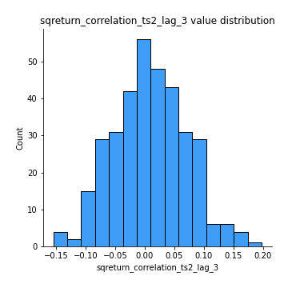
## Feature : price2_granger_cause_price1
- **Feature type** : continous
- **Missing** : 0.0%
- **Unique** : 347
- **Count** :347.0
- **Mean** :0.28854109352937124
- **Std** :0.2812948125526593
- **Min** :2.4312048970873696e-09
- **25%th Percentile** : 0.04416274896244684
- **50%th Percentile** : 0.1934499809147916
- **75%th Percentile** : 0.46375857371212204
- **Max** :0.9898380228448623

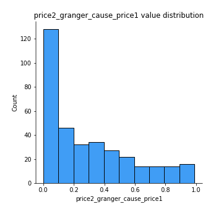
## Feature : price1_granger_cause_price2
- **Feature type** : continous
- **Missing** : 0.0%
- **Unique** : 347
- **Count** :347.0
- **Mean** :0.32842921720133583
- **Std** :0.2952464880306748
- **Min** :1.2012269232170316e-11
- **25%th Percentile** : 0.06423794389160314
- **50%th Percentile** : 0.2414695479632225
- **75%th Percentile** : 0.5755973267396269
- **Max** :0.9871292066441198

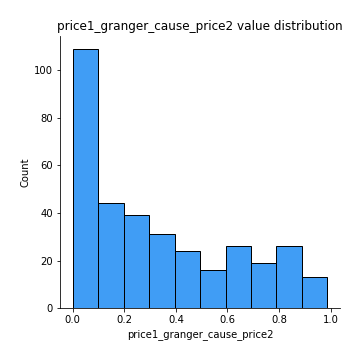

[<< Go back](../README.md)
