# Summary of 3_Linear

[<< Go back](../README.md)

## Logistic Regression (Linear)
- **n_jobs**: -1
- **explain_level**: 2

## Validation
 - **validation_type**: split
 - **train_ratio**: 0.75
 - **shuffle**: True
 - **stratify**: True

## Optimized metric
accuracy

## Training time

2.8 seconds

## Metric details
|           |    score |    threshold |
|:----------|---------:|-------------:|
| logloss   | 0.201433 | nan          |
| auc       | 0.960359 | nan          |
| f1        | 0.965517 |   0.559417   |
| accuracy  | 0.965517 |   0.559417   |
| precision | 1        |   0.98864    |
| recall    | 1        |   3.4794e-07 |
| mcc       | 0.93129  |   0.559417   |

## Confusion matrix (at threshold=0.559417)
|                      |   Predicted as real |   Predicted as simulated |
|:---------------------|--------------------:|-------------------------:|
| Labeled as real      |                  42 |                        2 |
| Labeled as simulated |                   1 |                       42 |

## Learning curves
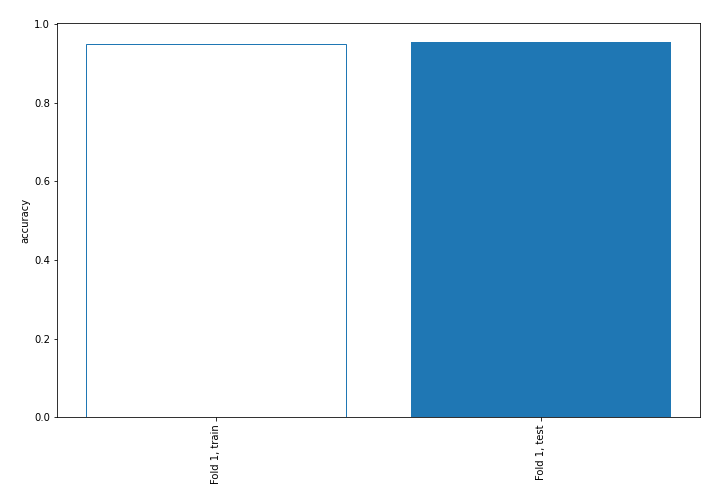

## Coefficients
| feature                           |    Learner_1 |
|:----------------------------------|-------------:|
| return_mean1                      |  1.35744     |
| return_skew1                      |  1.2753      |
| return_sd1                        |  1.01114     |
| price1_granger_cause_price2       |  0.551304    |
| return_autocorrelation_2_lag2     |  0.509854    |
| return_kurtosis2                  |  0.423236    |
| return_skew2                      |  0.366874    |
| return_autocorrelation_2_lag1     |  0.31821     |
| sqreturn_correlation_ts1_lag_2    |  0.318037    |
| return_correlation_ts1_lag_2      |  0.318037    |
| sqreturn_correlation_ts2_lag_2    |  0.201386    |
| return_correlation_ts2_lag_2      |  0.201386    |
| price2_granger_cause_price1       |  0.193679    |
| return_autocorrelation_1_lag2     |  0.111953    |
| sqreturn_correlation_ts2_lag_1    |  0.100709    |
| return_correlation_ts2_lag_1      |  0.100709    |
| return_autocorrelation_2_lag3     |  0.0903028   |
| sqreturn_correlation_ts1_lag_3    |  0.0256916   |
| return_correlation_ts1_lag_3      |  0.0256916   |
| return_correlation_ts1_lag_1      |  0.000266889 |
| sqreturn_correlation_ts1_lag_1    |  0.000266889 |
| return_autocorrelation_1_lag1     | -0.0412269   |
| return_autocorrelation_1_lag3     | -0.122024    |
| return_correlation_ts2_lag_3      | -0.13261     |
| sqreturn_correlation_ts2_lag_3    | -0.13261     |
| sqreturn_autocorrelation_ts2_lag3 | -0.197716    |
| return_sd2                        | -0.294032    |
| return_correlation_ts1_lag_0      | -0.45817     |
| sqreturn_correlation_ts1_lag_0    | -0.45817     |
| sqreturn_autocorrelation_ts1_lag3 | -0.693331    |
| sqreturn_autocorrelation_ts2_lag2 | -0.759761    |
| intercept                         | -0.807968    |
| sqreturn_autocorrelation_ts2_lag1 | -0.83444     |
| sqreturn_autocorrelation_ts1_lag2 | -0.964549    |
| sqreturn_autocorrelation_ts1_lag1 | -1.17764     |
| return_kurtosis1                  | -3.3114      |
| return_mean2                      | -3.96136     |

## Permutation-based Importance
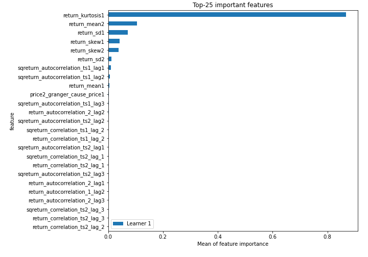
## Confusion Matrix

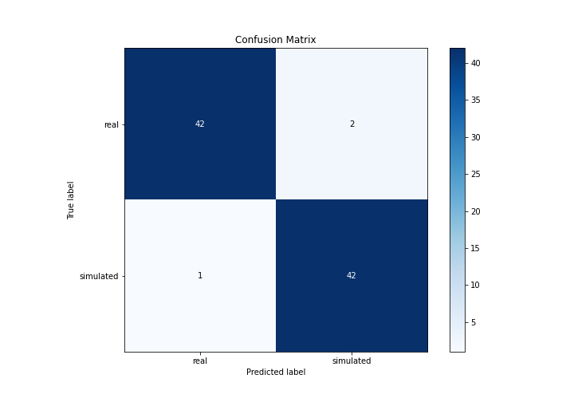

## Normalized Confusion Matrix

## ROC Curve

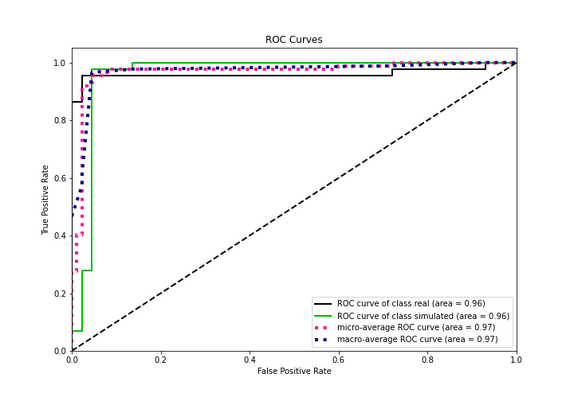

## Kolmogorov-Smirnov Statistic

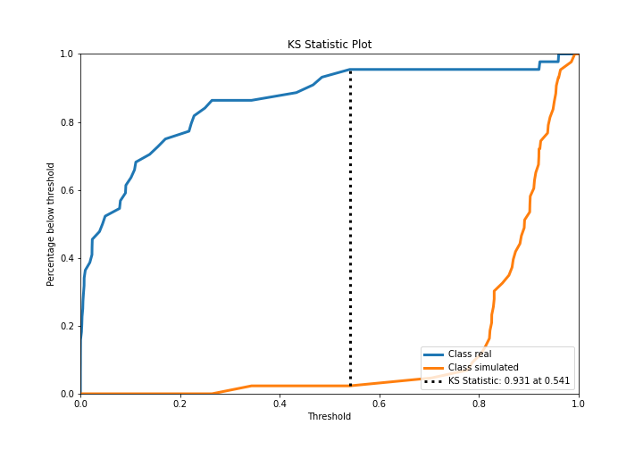

## Precision-Recall Curve

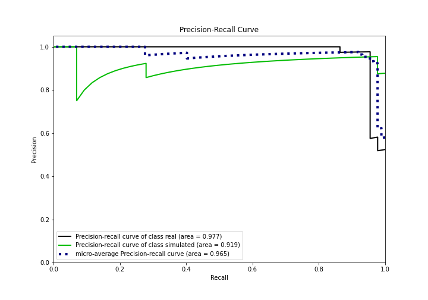

## Calibration Curve

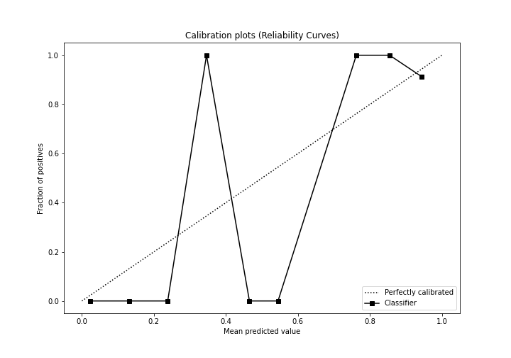

## Cumulative Gains Curve

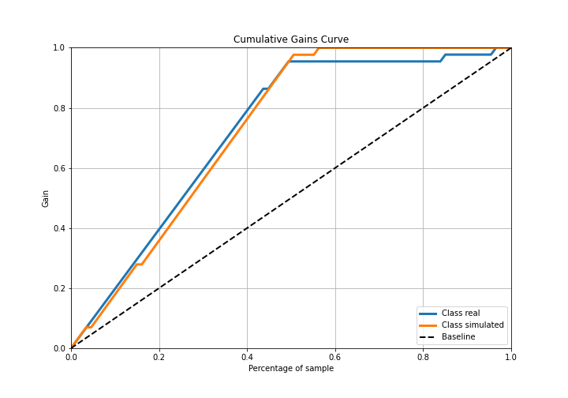

## Lift Curve

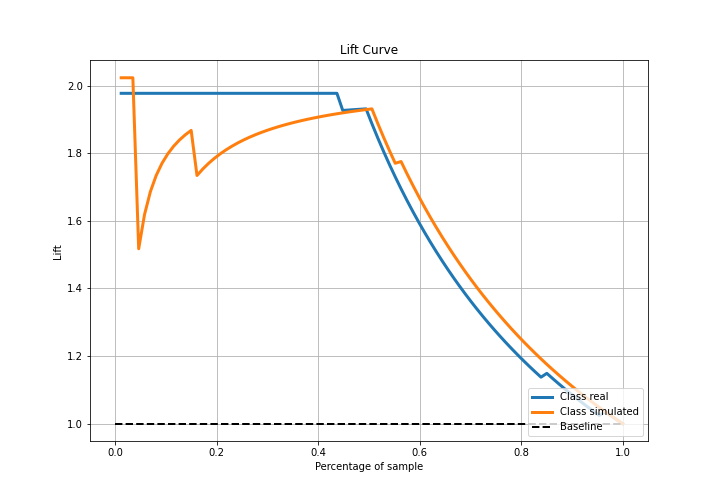

## SHAP Importance
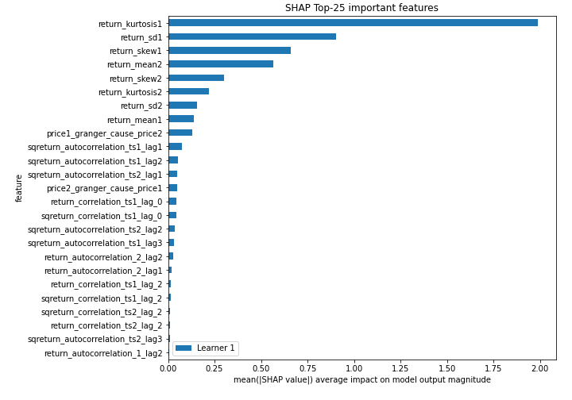

## SHAP Dependence plots

### Dependence (Fold 1)
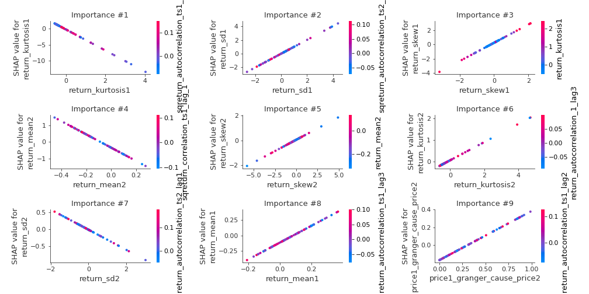

## SHAP Decision plots

### Top-10 Worst decisions for class 0 (Fold 1)
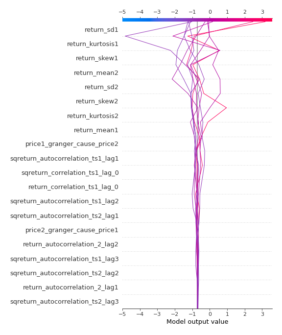
### Top-10 Best decisions for class 0 (Fold 1)
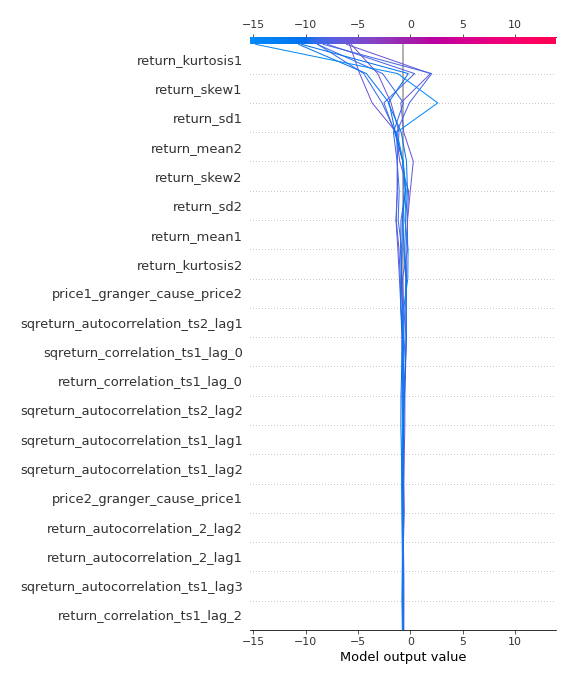
### Top-10 Worst decisions for class 1 (Fold 1)
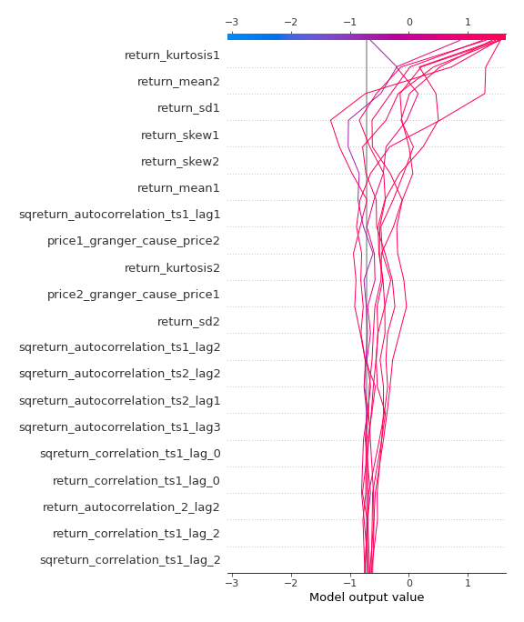
### Top-10 Best decisions for class 1 (Fold 1)
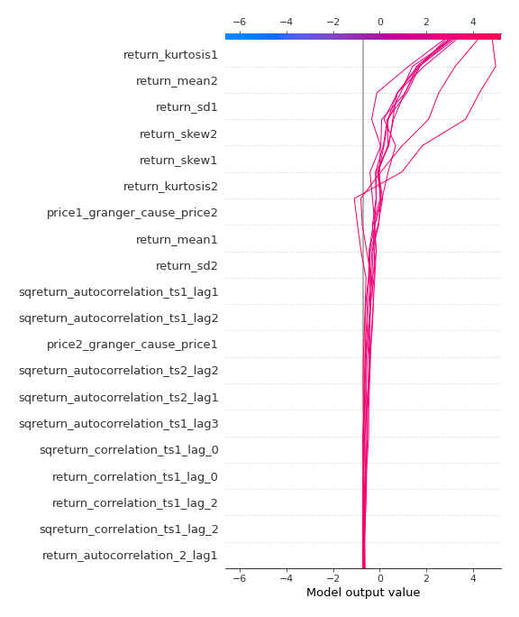

[<< Go back](../README.md)
