# Exploratory Data Analysis

[<< Go back](../README.md)
## Feature : target
- **Feature type** : categorical
- **Missing** : 0.0%
- **Unique** : 2
- **Count** :347
- **Unique** :2
- **Top** :real
- **Freq** :175

## Feature : return_mean1
- **Feature type** : continous
- **Missing** : 0.0%
- **Unique** : 347
- **Count** :347.0
- **Mean** :0.061475486552390594
- **Std** :0.1186966215848584
- **Min** :-0.297638839829253
- **25%th Percentile** : -0.018290349579979506
- **50%th Percentile** : 0.0665635937680653
- **75%th Percentile** : 0.1380502689444381
- **Max** :0.36814250960524914

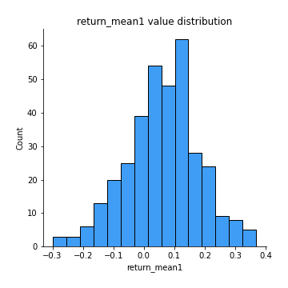
## Feature : return_mean2
- **Feature type** : continous
- **Missing** : 0.0%
- **Unique** : 347
- **Count** :347.0
- **Mean** :-0.09927328967458858
- **Std** :0.16750298187428608
- **Min** :-0.501214120119829
- **25%th Percentile** : -0.22713324608586172
- **50%th Percentile** : -0.108197716998617
- **75%th Percentile** : 0.027709762644840694
- **Max** :0.6801605239983173

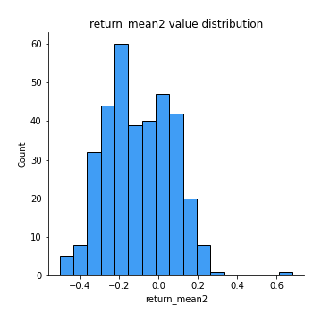
## Feature : return_sd1
- **Feature type** : continous
- **Missing** : 0.0%
- **Unique** : 347
- **Count** :347.0
- **Mean** :1.780722930010477
- **Std** :0.38552101702689917
- **Min** :0.8102430347636637
- **25%th Percentile** : 1.5487259710406727
- **50%th Percentile** : 1.8604876412613758
- **75%th Percentile** : 1.9700045327158
- **Max** :3.332494027875222

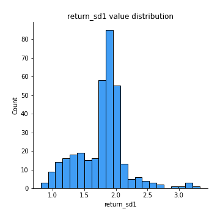
## Feature : return_sd2
- **Feature type** : continous
- **Missing** : 0.0%
- **Unique** : 347
- **Count** :347.0
- **Mean** :1.7039393787424952
- **Std** :0.42663578575565225
- **Min** :0.8198779632289204
- **25%th Percentile** : 1.5016298492231752
- **50%th Percentile** : 1.6428046910675678
- **75%th Percentile** : 1.8094726024404166
- **Max** :4.59233049161685

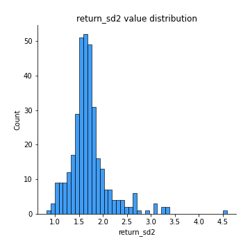
## Feature : return_skew1
- **Feature type** : continous
- **Missing** : 0.0%
- **Unique** : 347
- **Count** :347.0
- **Mean** :-0.1849663594233868
- **Std** :0.7368297120823116
- **Min** :-4.239645236578449
- **25%th Percentile** : -0.38446033385308587
- **50%th Percentile** : -0.11625746439269066
- **75%th Percentile** : 0.11830909678439311
- **Max** :2.3044235031125564

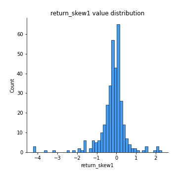
## Feature : return_skew2
- **Feature type** : continous
- **Missing** : 0.0%
- **Unique** : 347
- **Count** :347.0
- **Mean** :-0.261389512015397
- **Std** :1.2395718548970913
- **Min** :-7.3762354994385335
- **25%th Percentile** : -0.6307569986543438
- **50%th Percentile** : -0.1281483022099407
- **75%th Percentile** : 0.3184980669062283
- **Max** :4.911141746236893

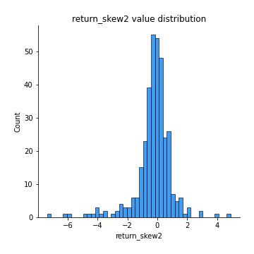
## Feature : return_kurtosis1
- **Feature type** : continous
- **Missing** : 0.0%
- **Unique** : 347
- **Count** :347.0
- **Mean** :2.9150280504879547
- **Std** :5.532396079420267
- **Min** :-0.632681139296924
- **25%th Percentile** : 0.1844256901702921
- **50%th Percentile** : 1.124234135015803
- **75%th Percentile** : 2.9402887511698883
- **Max** :40.485294874464934

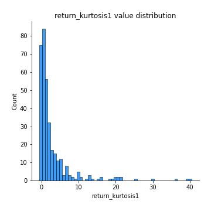
## Feature : return_kurtosis2
- **Feature type** : continous
- **Missing** : 0.0%
- **Unique** : 347
- **Count** :347.0
- **Mean** :6.450876246957035
- **Std** :10.280565634930554
- **Min** :-0.1693240760286967
- **25%th Percentile** : 1.6005246224412775
- **50%th Percentile** : 3.2476905629459636
- **75%th Percentile** : 6.23449423922033
- **Max** :94.01659180149953

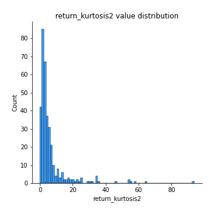
## Feature : return_autocorrelation_1_lag1
- **Feature type** : continous
- **Missing** : 0.0%
- **Unique** : 347
- **Count** :347.0
- **Mean** :-0.010996369121904674
- **Std** :0.06576561614702649
- **Min** :-0.2110198016529991
- **25%th Percentile** : -0.05626729230701
- **50%th Percentile** : -0.013517717114003593
- **75%th Percentile** : 0.03711616721116272
- **Max** :0.1612062752515845

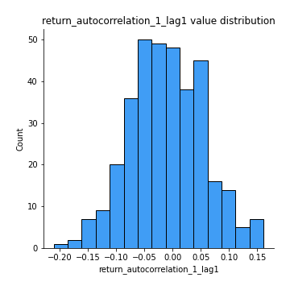
## Feature : return_autocorrelation_1_lag2
- **Feature type** : continous
- **Missing** : 0.0%
- **Unique** : 347
- **Count** :347.0
- **Mean** :-0.0100933317380685
- **Std** :0.06672869049802392
- **Min** :-0.18815240041143846
- **25%th Percentile** : -0.054780262668353966
- **50%th Percentile** : -0.012622850333547112
- **75%th Percentile** : 0.034045758560814
- **Max** :0.21123611097039302

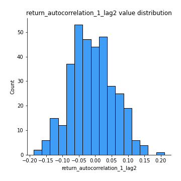
## Feature : return_autocorrelation_1_lag3
- **Feature type** : continous
- **Missing** : 0.0%
- **Unique** : 347
- **Count** :347.0
- **Mean** :0.007096304729592427
- **Std** :0.06211408706723522
- **Min** :-0.18703770587201912
- **25%th Percentile** : -0.033121770775699895
- **50%th Percentile** : 0.012048925685467497
- **75%th Percentile** : 0.04950017002162705
- **Max** :0.17514033413395239

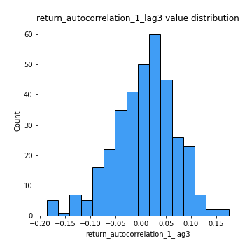
## Feature : return_autocorrelation_2_lag1
- **Feature type** : continous
- **Missing** : 0.0%
- **Unique** : 347
- **Count** :347.0
- **Mean** :0.005763773130838892
- **Std** :0.07144016012557272
- **Min** :-0.17778763204400128
- **25%th Percentile** : -0.043861291728937435
- **50%th Percentile** : 0.005549077619232359
- **75%th Percentile** : 0.056054275919627056
- **Max** :0.2045082986727094

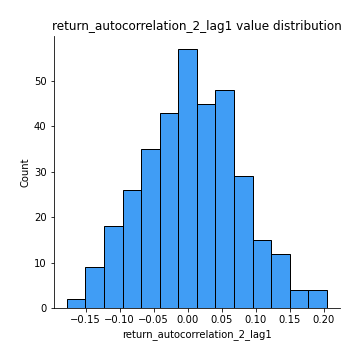
## Feature : return_autocorrelation_2_lag2
- **Feature type** : continous
- **Missing** : 0.0%
- **Unique** : 347
- **Count** :347.0
- **Mean** :0.0008973775279394368
- **Std** :0.06735795675598592
- **Min** :-0.1758721664122366
- **25%th Percentile** : -0.04478989771797326
- **50%th Percentile** : -0.0008191657903346153
- **75%th Percentile** : 0.04979011868347809
- **Max** :0.17414329300978307

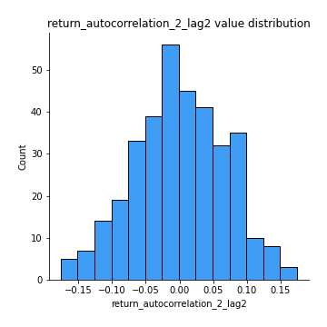
## Feature : return_autocorrelation_2_lag3
- **Feature type** : continous
- **Missing** : 0.0%
- **Unique** : 347
- **Count** :347.0
- **Mean** :0.012100002815236434
- **Std** :0.06353214704017945
- **Min** :-0.19351132239541102
- **25%th Percentile** : -0.0257727182094363
- **50%th Percentile** : 0.01302532642635855
- **75%th Percentile** : 0.05155650883754438
- **Max** :0.20205753622966244

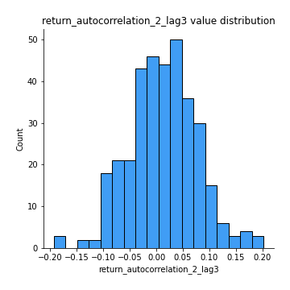
## Feature : return_correlation_ts1_lag_0
- **Feature type** : continous
- **Missing** : 0.0%
- **Unique** : 347
- **Count** :347.0
- **Mean** :0.30254735415448025
- **Std** :0.12980996362882946
- **Min** :-0.10256711281206837
- **25%th Percentile** : 0.22621731053482125
- **50%th Percentile** : 0.30440820177797184
- **75%th Percentile** : 0.3706691295448766
- **Max** :0.7227330027882508

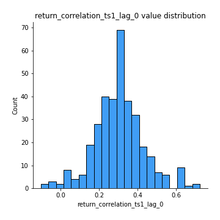
## Feature : return_correlation_ts1_lag_1
- **Feature type** : continous
- **Missing** : 0.0%
- **Unique** : 347
- **Count** :347.0
- **Mean** :0.0028247515251475517
- **Std** :0.06536932483967789
- **Min** :-0.2209529139557169
- **25%th Percentile** : -0.04304158870445691
- **50%th Percentile** : 0.0047416705350921086
- **75%th Percentile** : 0.04710851073572306
- **Max** :0.19188037286928575

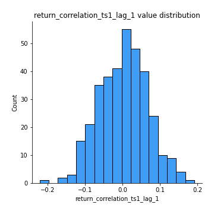
## Feature : return_correlation_ts1_lag_2
- **Feature type** : continous
- **Missing** : 0.0%
- **Unique** : 347
- **Count** :347.0
- **Mean** :0.0005848671317828606
- **Std** :0.06731164154806989
- **Min** :-0.172871336111873
- **25%th Percentile** : -0.046056437306904396
- **50%th Percentile** : -0.0015545108833271448
- **75%th Percentile** : 0.048909843737892256
- **Max** :0.20407970513531645

## Feature : return_correlation_ts1_lag_3
- **Feature type** : continous
- **Missing** : 0.0%
- **Unique** : 347
- **Count** :347.0
- **Mean** :0.006342482304594921
- **Std** :0.06534944259584254
- **Min** :-0.21147540839842804
- **25%th Percentile** : -0.03615404540680797
- **50%th Percentile** : 0.01059212867788554
- **75%th Percentile** : 0.048915184074770246
- **Max** :0.23808054096877584

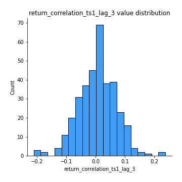
## Feature : return_correlation_ts2_lag_1
- **Feature type** : continous
- **Missing** : 0.0%
- **Unique** : 347
- **Count** :347.0
- **Mean** :0.005848746611785642
- **Std** :0.07194720119996721
- **Min** :-0.17665751184419612
- **25%th Percentile** : -0.04590018505411766
- **50%th Percentile** : 0.0049426310097987975
- **75%th Percentile** : 0.053283150833122045
- **Max** :0.3425036902091001

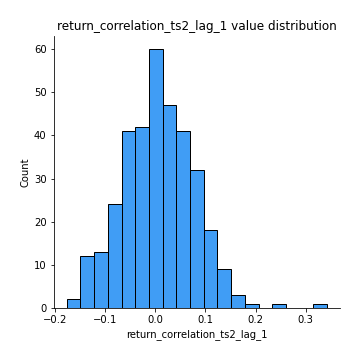
## Feature : return_correlation_ts2_lag_2
- **Feature type** : continous
- **Missing** : 0.0%
- **Unique** : 347
- **Count** :347.0
- **Mean** :-0.0013891704285971258
- **Std** :0.0654306195427444
- **Min** :-0.2757460186107768
- **25%th Percentile** : -0.038554034382859884
- **50%th Percentile** : 0.0007207434981489483
- **75%th Percentile** : 0.04021844041976416
- **Max** :0.1735922943461438

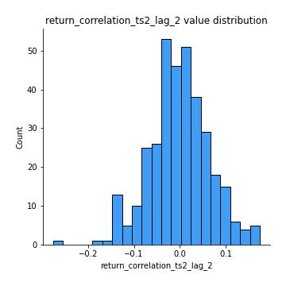
## Feature : return_correlation_ts2_lag_3
- **Feature type** : continous
- **Missing** : 0.0%
- **Unique** : 347
- **Count** :347.0
- **Mean** :0.01120199217789521
- **Std** :0.06006851498849532
- **Min** :-0.19812866738340987
- **25%th Percentile** : -0.027484109632361337
- **50%th Percentile** : 0.011707272120557851
- **75%th Percentile** : 0.05283579465325346
- **Max** :0.18227042221329348

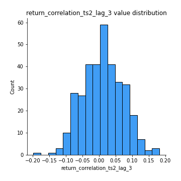
## Feature : sqreturn_autocorrelation_ts1_lag1
- **Feature type** : continous
- **Missing** : 0.0%
- **Unique** : 347
- **Count** :347.0
- **Mean** :0.03331113585402552
- **Std** :0.08328759016363911
- **Min** :-0.13221840376951163
- **25%th Percentile** : -0.024936729518710538
- **50%th Percentile** : 0.020280485929445646
- **75%th Percentile** : 0.07898180297134502
- **Max** :0.4170324090514868

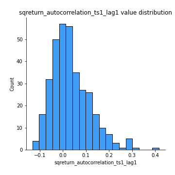
## Feature : sqreturn_autocorrelation_ts1_lag2
- **Feature type** : continous
- **Missing** : 0.0%
- **Unique** : 347
- **Count** :347.0
- **Mean** :0.020858471910122616
- **Std** :0.06895327844815993
- **Min** :-0.1423605096861521
- **25%th Percentile** : -0.025966431671245883
- **50%th Percentile** : 0.007626754961371376
- **75%th Percentile** : 0.05821360474664382
- **Max** :0.29415594530501293

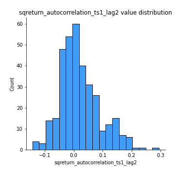
## Feature : sqreturn_autocorrelation_ts1_lag3
- **Feature type** : continous
- **Missing** : 0.0%
- **Unique** : 347
- **Count** :347.0
- **Mean** :0.008174212587059257
- **Std** :0.06479779845008223
- **Min** :-0.15398872409911302
- **25%th Percentile** : -0.03459979778282042
- **50%th Percentile** : -0.001324345468411288
- **75%th Percentile** : 0.03967743650510755
- **Max** :0.36579865351615615

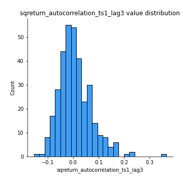
## Feature : sqreturn_autocorrelation_ts2_lag1
- **Feature type** : continous
- **Missing** : 0.0%
- **Unique** : 347
- **Count** :347.0
- **Mean** :0.025147612636584278
- **Std** :0.07002602221869494
- **Min** :-0.0798005356119544
- **25%th Percentile** : -0.022374523573908046
- **50%th Percentile** : 0.009105028593548666
- **75%th Percentile** : 0.05867150383129083
- **Max** :0.3533869018400006

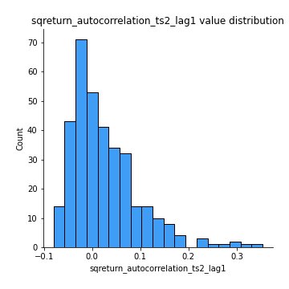
## Feature : sqreturn_autocorrelation_ts2_lag2
- **Feature type** : continous
- **Missing** : 0.0%
- **Unique** : 347
- **Count** :347.0
- **Mean** :0.006827929328541348
- **Std** :0.05643138401851885
- **Min** :-0.11641829413127801
- **25%th Percentile** : -0.030539979366431325
- **50%th Percentile** : -0.004293198509032675
- **75%th Percentile** : 0.03296215717618106
- **Max** :0.23959550345567882

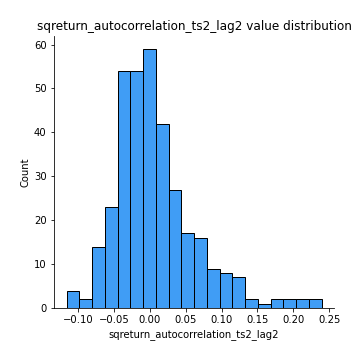
## Feature : sqreturn_autocorrelation_ts2_lag3
- **Feature type** : continous
- **Missing** : 0.0%
- **Unique** : 347
- **Count** :347.0
- **Mean** :0.007072928042535099
- **Std** :0.06188098410185922
- **Min** :-0.1071764593297586
- **25%th Percentile** : -0.031061285416900414
- **50%th Percentile** : -0.008838465058791522
- **75%th Percentile** : 0.03437925872321622
- **Max** :0.3463122340368414

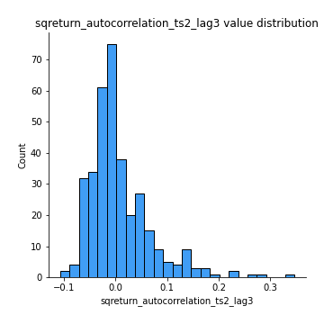
## Feature : sqreturn_correlation_ts1_lag_0
- **Feature type** : continous
- **Missing** : 0.0%
- **Unique** : 347
- **Count** :347.0
- **Mean** :0.30254735415448025
- **Std** :0.12980996362882946
- **Min** :-0.10256711281206837
- **25%th Percentile** : 0.22621731053482125
- **50%th Percentile** : 0.30440820177797184
- **75%th Percentile** : 0.3706691295448766
- **Max** :0.7227330027882508

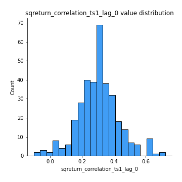
## Feature : sqreturn_correlation_ts1_lag_1
- **Feature type** : continous
- **Missing** : 0.0%
- **Unique** : 347
- **Count** :347.0
- **Mean** :0.0028247515251475517
- **Std** :0.06536932483967789
- **Min** :-0.2209529139557169
- **25%th Percentile** : -0.04304158870445691
- **50%th Percentile** : 0.0047416705350921086
- **75%th Percentile** : 0.04710851073572306
- **Max** :0.19188037286928575

## Feature : sqreturn_correlation_ts1_lag_2
- **Feature type** : continous
- **Missing** : 0.0%
- **Unique** : 347
- **Count** :347.0
- **Mean** :0.0005848671317828606
- **Std** :0.06731164154806989
- **Min** :-0.172871336111873
- **25%th Percentile** : -0.046056437306904396
- **50%th Percentile** : -0.0015545108833271448
- **75%th Percentile** : 0.048909843737892256
- **Max** :0.20407970513531645

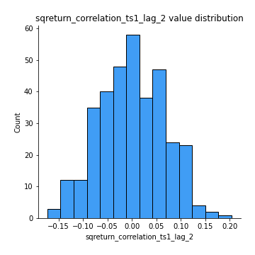
## Feature : sqreturn_correlation_ts1_lag_3
- **Feature type** : continous
- **Missing** : 0.0%
- **Unique** : 347
- **Count** :347.0
- **Mean** :0.006342482304594921
- **Std** :0.06534944259584254
- **Min** :-0.21147540839842804
- **25%th Percentile** : -0.03615404540680797
- **50%th Percentile** : 0.01059212867788554
- **75%th Percentile** : 0.048915184074770246
- **Max** :0.23808054096877584

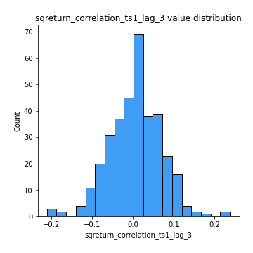
## Feature : sqreturn_correlation_ts2_lag_1
- **Feature type** : continous
- **Missing** : 0.0%
- **Unique** : 347
- **Count** :347.0
- **Mean** :0.005848746611785642
- **Std** :0.07194720119996721
- **Min** :-0.17665751184419612
- **25%th Percentile** : -0.04590018505411766
- **50%th Percentile** : 0.0049426310097987975
- **75%th Percentile** : 0.053283150833122045
- **Max** :0.3425036902091001

## Feature : sqreturn_correlation_ts2_lag_2
- **Feature type** : continous
- **Missing** : 0.0%
- **Unique** : 347
- **Count** :347.0
- **Mean** :-0.0013891704285971258
- **Std** :0.0654306195427444
- **Min** :-0.2757460186107768
- **25%th Percentile** : -0.038554034382859884
- **50%th Percentile** : 0.0007207434981489483
- **75%th Percentile** : 0.04021844041976416
- **Max** :0.1735922943461438

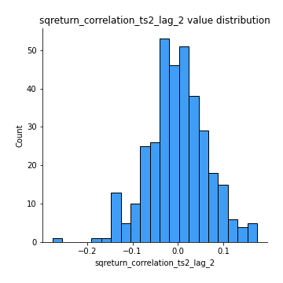
## Feature : sqreturn_correlation_ts2_lag_3
- **Feature type** : continous
- **Missing** : 0.0%
- **Unique** : 347
- **Count** :347.0
- **Mean** :0.01120199217789521
- **Std** :0.06006851498849532
- **Min** :-0.19812866738340987
- **25%th Percentile** : -0.027484109632361337
- **50%th Percentile** : 0.011707272120557851
- **75%th Percentile** : 0.05283579465325346
- **Max** :0.18227042221329348

## Feature : price2_granger_cause_price1
- **Feature type** : continous
- **Missing** : 0.0%
- **Unique** : 347
- **Count** :347.0
- **Mean** :0.3010544473346757
- **Std** :0.296682903467082
- **Min** :2.4312048970873696e-09
- **25%th Percentile** : 0.04526430724083657
- **50%th Percentile** : 0.19697552249555267
- **75%th Percentile** : 0.4845180685397047
- **Max** :0.9950415359768546

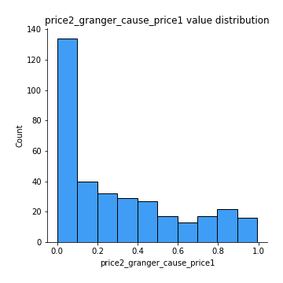
## Feature : price1_granger_cause_price2
- **Feature type** : continous
- **Missing** : 0.0%
- **Unique** : 347
- **Count** :347.0
- **Mean** :0.34361493456472036
- **Std** :0.30651048455554514
- **Min** :1.2012269232170316e-11
- **25%th Percentile** : 0.07181881736756743
- **50%th Percentile** : 0.2563574265655761
- **75%th Percentile** : 0.5799842630835126
- **Max** :0.9980829184750444

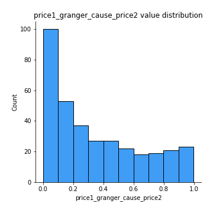

[<< Go back](../README.md)
