# Summary of 3_Linear

[<< Go back](../README.md)

## Logistic Regression (Linear)
- **n_jobs**: -1
- **explain_level**: 2

## Validation
 - **validation_type**: split
 - **train_ratio**: 0.75
 - **shuffle**: True
 - **stratify**: True

## Optimized metric
accuracy

## Training time

3.6 seconds

## Metric details
|           |    score |     threshold |
|:----------|---------:|--------------:|
| logloss   | 0.147378 | nan           |
| auc       | 0.99894  | nan           |
| f1        | 0.97619  |   0.474016    |
| accuracy  | 0.977011 |   0.665777    |
| precision | 1        |   0.901373    |
| recall    | 1        |   6.00422e-09 |
| mcc       | 0.955004 |   0.474016    |

## Confusion matrix (at threshold=0.665777)
|                      |   Predicted as real |   Predicted as simulated |
|:---------------------|--------------------:|-------------------------:|
| Labeled as real      |                  45 |                        1 |
| Labeled as simulated |                   1 |                       40 |

## Learning curves
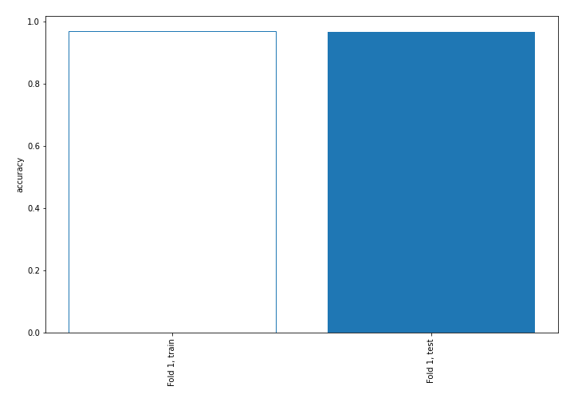

## Coefficients
| feature                           |   Learner_1 |
|:----------------------------------|------------:|
| return_skew1                      |  1.4062     |
| return_mean1                      |  1.23826    |
| return_sd1                        |  0.740535   |
| return_autocorrelation_1_lag2     |  0.346545   |
| return_correlation_ts1_lag_1      |  0.223467   |
| sqreturn_correlation_ts1_lag_1    |  0.223467   |
| return_autocorrelation_1_lag1     |  0.208387   |
| return_autocorrelation_2_lag1     |  0.205858   |
| return_autocorrelation_2_lag2     |  0.19737    |
| return_skew2                      |  0.193637   |
| sqreturn_correlation_ts2_lag_2    |  0.173428   |
| return_correlation_ts2_lag_2      |  0.173428   |
| sqreturn_correlation_ts1_lag_2    |  0.142714   |
| return_correlation_ts1_lag_2      |  0.142714   |
| return_kurtosis2                  |  0.117049   |
| price1_granger_cause_price2       |  0.00336316 |
| sqreturn_correlation_ts2_lag_1    | -0.117331   |
| return_correlation_ts2_lag_1      | -0.117331   |
| return_autocorrelation_2_lag3     | -0.117954   |
| return_autocorrelation_1_lag3     | -0.151927   |
| return_sd2                        | -0.167629   |
| sqreturn_correlation_ts1_lag_3    | -0.232226   |
| return_correlation_ts1_lag_3      | -0.232226   |
| price2_granger_cause_price1       | -0.321551   |
| sqreturn_autocorrelation_ts2_lag3 | -0.465086   |
| return_correlation_ts2_lag_3      | -0.485067   |
| sqreturn_correlation_ts2_lag_3    | -0.485067   |
| sqreturn_autocorrelation_ts1_lag3 | -0.501097   |
| sqreturn_autocorrelation_ts2_lag2 | -0.501902   |
| sqreturn_correlation_ts1_lag_0    | -0.618244   |
| return_correlation_ts1_lag_0      | -0.618244   |
| intercept                         | -0.812915   |
| sqreturn_autocorrelation_ts2_lag1 | -0.836333   |
| sqreturn_autocorrelation_ts1_lag2 | -0.972777   |
| sqreturn_autocorrelation_ts1_lag1 | -1.35011    |
| return_mean2                      | -3.6089     |
| return_kurtosis1                  | -4.02113    |

## Permutation-based Importance
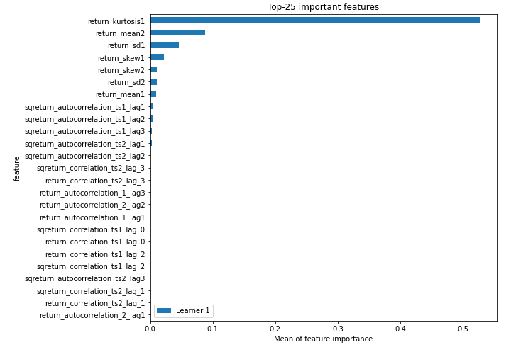
## Confusion Matrix

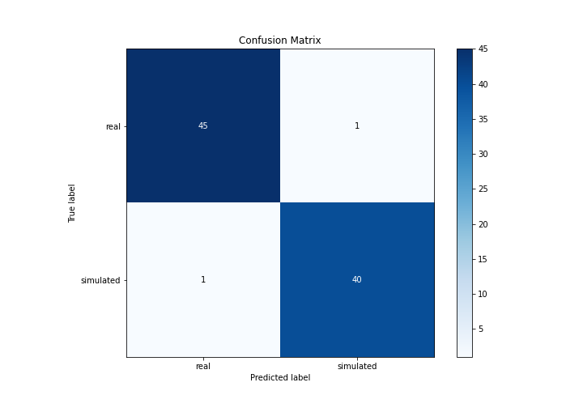

## Normalized Confusion Matrix

## ROC Curve

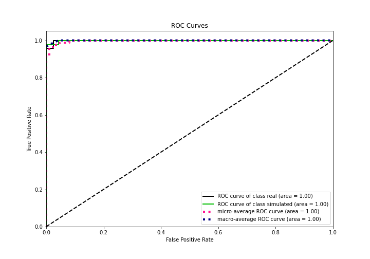

## Kolmogorov-Smirnov Statistic

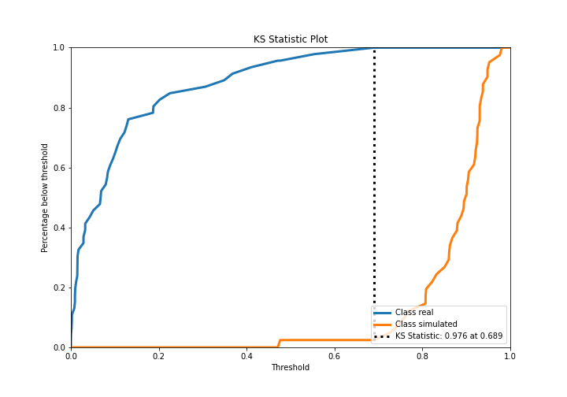

## Precision-Recall Curve

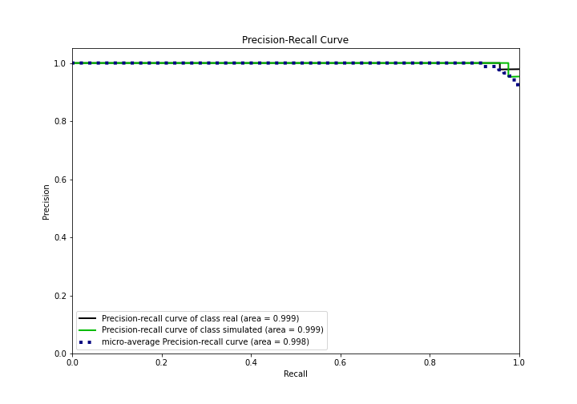

## Calibration Curve

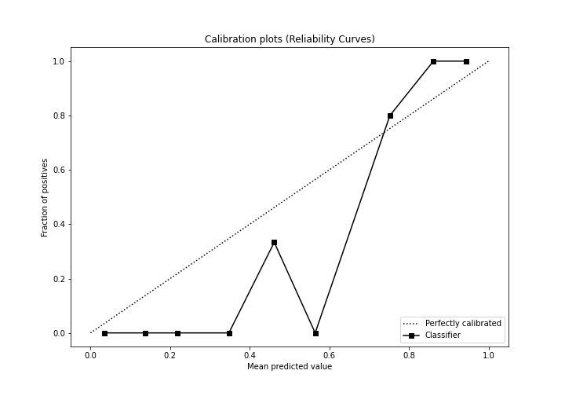

## Cumulative Gains Curve

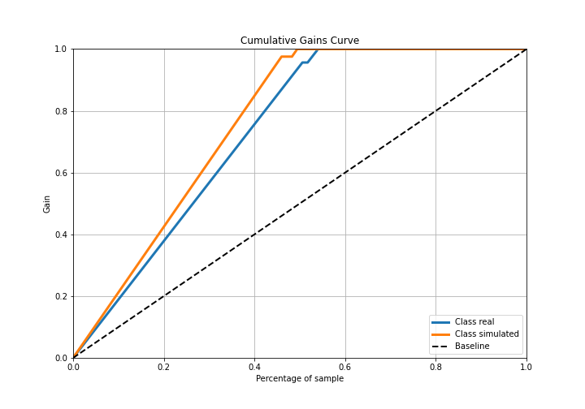

## Lift Curve

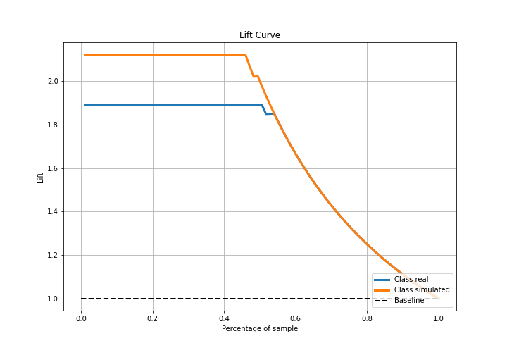

## SHAP Importance
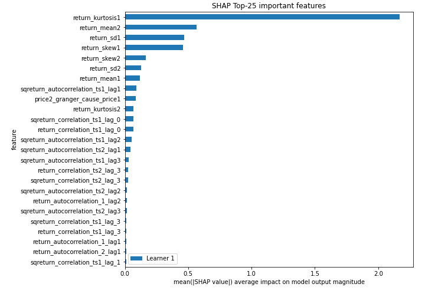

## SHAP Dependence plots

### Dependence (Fold 1)
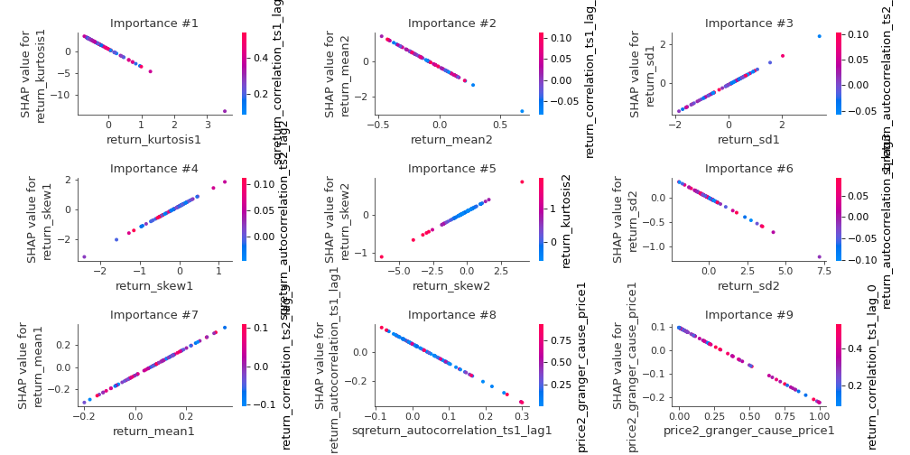

## SHAP Decision plots

### Top-10 Worst decisions for class 0 (Fold 1)
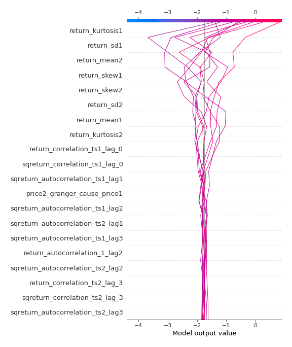
### Top-10 Best decisions for class 0 (Fold 1)
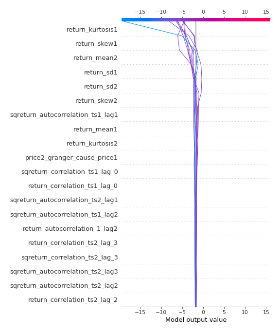
### Top-10 Worst decisions for class 1 (Fold 1)
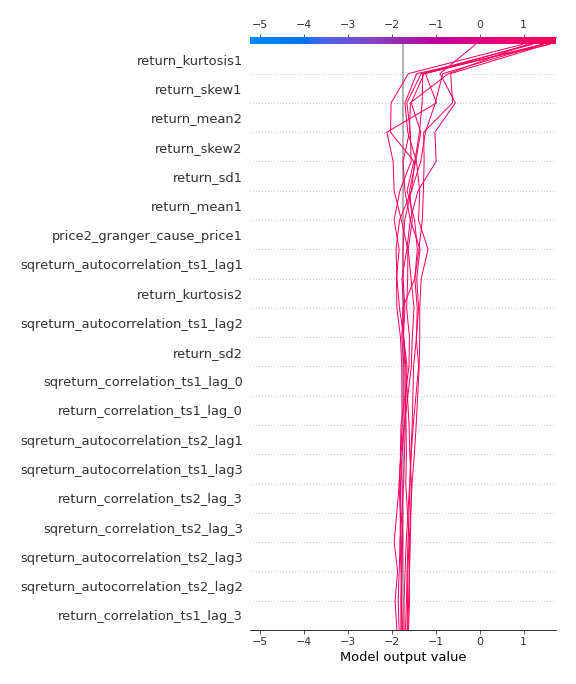
### Top-10 Best decisions for class 1 (Fold 1)
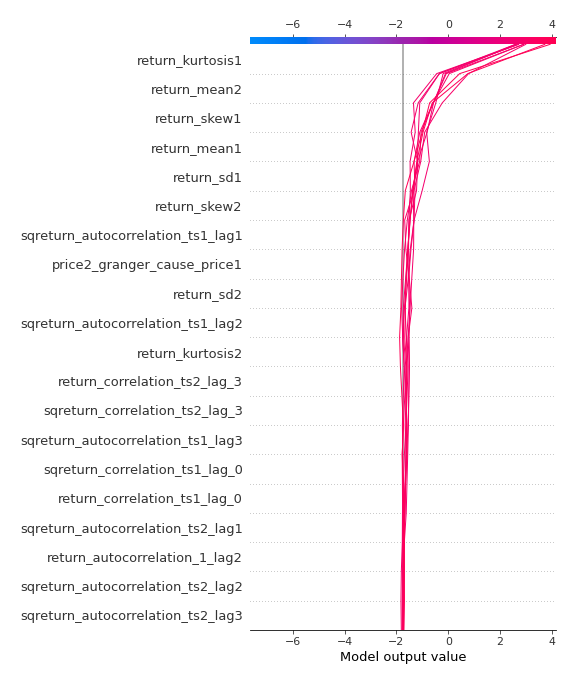

[<< Go back](../README.md)
