# Exploratory Data Analysis

[<< Go back](../README.md)
## Feature : target
- **Feature type** : categorical
- **Missing** : 0.0%
- **Unique** : 2
- **Count** :347
- **Unique** :2
- **Top** :real
- **Freq** :183

## Feature : return_mean1
- **Feature type** : continous
- **Missing** : 0.0%
- **Unique** : 347
- **Count** :347.0
- **Mean** :0.06381307625251288
- **Std** :0.11968763049524081
- **Min** :-0.297638839829253
- **25%th Percentile** : -0.016562145716997635
- **50%th Percentile** : 0.07733410888361263
- **75%th Percentile** : 0.14532796457381597
- **Max** :0.3602793017097547

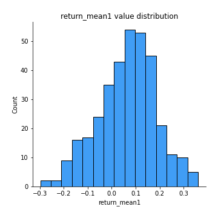
## Feature : return_mean2
- **Feature type** : continous
- **Missing** : 0.0%
- **Unique** : 347
- **Count** :347.0
- **Mean** :-0.09163991155726683
- **Std** :0.16698607452051126
- **Min** :-0.5131081058415234
- **25%th Percentile** : -0.21831914693352494
- **50%th Percentile** : -0.09605306847039644
- **75%th Percentile** : 0.03771107152339749
- **Max** :0.6801605239983173

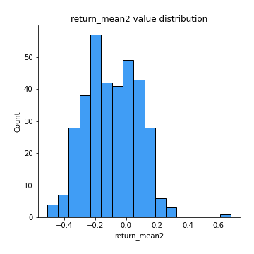
## Feature : return_sd1
- **Feature type** : continous
- **Missing** : 0.0%
- **Unique** : 347
- **Count** :347.0
- **Mean** :1.7598364768447392
- **Std** :0.3821988454745633
- **Min** :0.8733078831717243
- **25%th Percentile** : 1.5301426522861292
- **50%th Percentile** : 1.8198565457619074
- **75%th Percentile** : 1.9400013486987508
- **Max** :3.332494027875222

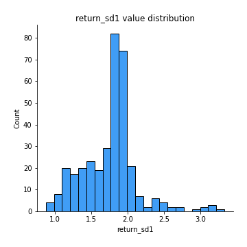
## Feature : return_sd2
- **Feature type** : continous
- **Missing** : 0.0%
- **Unique** : 347
- **Count** :347.0
- **Mean** :1.7023392285211238
- **Std** :0.44029635536037415
- **Min** :0.8198779632289204
- **25%th Percentile** : 1.4957831439120963
- **50%th Percentile** : 1.6330309566208974
- **75%th Percentile** : 1.8276430218913586
- **Max** :4.59233049161685

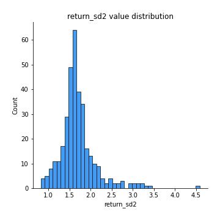
## Feature : return_skew1
- **Feature type** : continous
- **Missing** : 0.0%
- **Unique** : 347
- **Count** :347.0
- **Mean** :-0.12559550568374878
- **Std** :0.580060744558648
- **Min** :-2.5068500114696386
- **25%th Percentile** : -0.35927750326243313
- **50%th Percentile** : -0.06979018061824388
- **75%th Percentile** : 0.10440622546393613
- **Max** :2.351757728252051

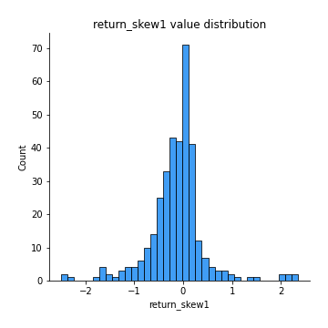
## Feature : return_skew2
- **Feature type** : continous
- **Missing** : 0.0%
- **Unique** : 347
- **Count** :347.0
- **Mean** :-0.31204193588881896
- **Std** :1.2526595213098806
- **Min** :-7.3762354994385335
- **25%th Percentile** : -0.6195113533122343
- **50%th Percentile** : -0.2030874156216513
- **75%th Percentile** : 0.28165441825785154
- **Max** :4.1920266082732045

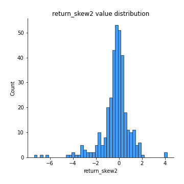
## Feature : return_kurtosis1
- **Feature type** : continous
- **Missing** : 0.0%
- **Unique** : 347
- **Count** :347.0
- **Mean** :2.416628820239473
- **Std** :4.008869931172737
- **Min** :-0.6116586240930881
- **25%th Percentile** : 0.1278691647374255
- **50%th Percentile** : 1.1401920137395845
- **75%th Percentile** : 2.678812472527533
- **Max** :23.612665658846073

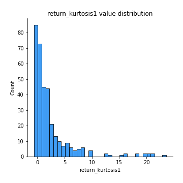
## Feature : return_kurtosis2
- **Feature type** : continous
- **Missing** : 0.0%
- **Unique** : 347
- **Count** :347.0
- **Mean** :6.801612639093828
- **Std** :10.216843842057239
- **Min** :-0.1693240760286967
- **25%th Percentile** : 1.6651949750793453
- **50%th Percentile** : 3.414038372961311
- **75%th Percentile** : 7.190990175736504
- **Max** :94.01659180149953

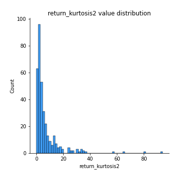
## Feature : return_autocorrelation_1_lag1
- **Feature type** : continous
- **Missing** : 0.0%
- **Unique** : 347
- **Count** :347.0
- **Mean** :-0.008600092978824725
- **Std** :0.06594300994731608
- **Min** :-0.2110198016529991
- **25%th Percentile** : -0.05332898823808066
- **50%th Percentile** : -0.013981042363745448
- **75%th Percentile** : 0.035863535913570846
- **Max** :0.20132571463207988

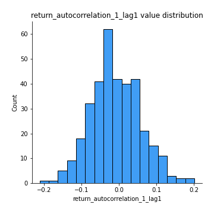
## Feature : return_autocorrelation_1_lag2
- **Feature type** : continous
- **Missing** : 0.0%
- **Unique** : 347
- **Count** :347.0
- **Mean** :-0.011583866430073298
- **Std** :0.06286291097822058
- **Min** :-0.18815240041143846
- **25%th Percentile** : -0.054012549691609346
- **50%th Percentile** : -0.017442544596430434
- **75%th Percentile** : 0.030728455407310583
- **Max** :0.21123611097039302

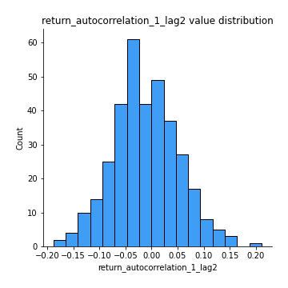
## Feature : return_autocorrelation_1_lag3
- **Feature type** : continous
- **Missing** : 0.0%
- **Unique** : 347
- **Count** :347.0
- **Mean** :0.003516348285998032
- **Std** :0.06259290284859112
- **Min** :-0.1817944619132489
- **25%th Percentile** : -0.041405431345799534
- **50%th Percentile** : 0.009107008171803233
- **75%th Percentile** : 0.04439597966188503
- **Max** :0.17514033413395239

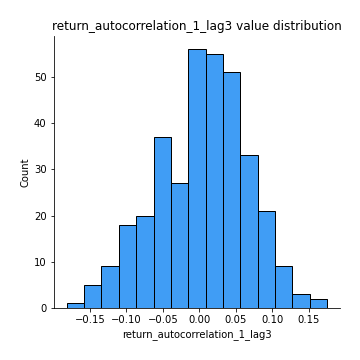
## Feature : return_autocorrelation_2_lag1
- **Feature type** : continous
- **Missing** : 0.0%
- **Unique** : 347
- **Count** :347.0
- **Mean** :0.007244542595661386
- **Std** :0.06484415462208068
- **Min** :-0.17778763204400128
- **25%th Percentile** : -0.03572939570116117
- **50%th Percentile** : 0.005151614185849059
- **75%th Percentile** : 0.05367795729926321
- **Max** :0.18949206442613103

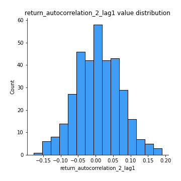
## Feature : return_autocorrelation_2_lag2
- **Feature type** : continous
- **Missing** : 0.0%
- **Unique** : 347
- **Count** :347.0
- **Mean** :-9.387886097333763e-05
- **Std** :0.06721539336342047
- **Min** :-0.16605020590117126
- **25%th Percentile** : -0.04367961982875738
- **50%th Percentile** : 0.0008260263761318355
- **75%th Percentile** : 0.04129881130701904
- **Max** :0.19312778762738517

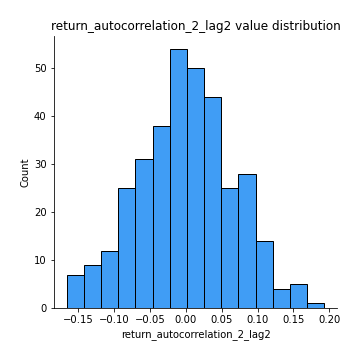
## Feature : return_autocorrelation_2_lag3
- **Feature type** : continous
- **Missing** : 0.0%
- **Unique** : 347
- **Count** :347.0
- **Mean** :0.012182149823375727
- **Std** :0.062336580862970274
- **Min** :-0.19047566508494632
- **25%th Percentile** : -0.02702072172886892
- **50%th Percentile** : 0.01578501982644527
- **75%th Percentile** : 0.05273729056042599
- **Max** :0.20205753622966244

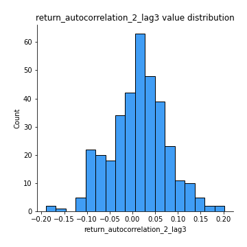
## Feature : return_correlation_ts1_lag_0
- **Feature type** : continous
- **Missing** : 0.0%
- **Unique** : 347
- **Count** :347.0
- **Mean** :0.3084296371019498
- **Std** :0.1362132224362648
- **Min** :-0.10256711281206837
- **25%th Percentile** : 0.23074549581020073
- **50%th Percentile** : 0.2978759141593998
- **75%th Percentile** : 0.3837908359403367
- **Max** :0.9937227277077512

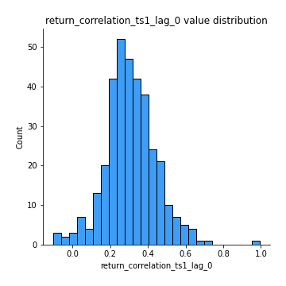
## Feature : return_correlation_ts1_lag_1
- **Feature type** : continous
- **Missing** : 0.0%
- **Unique** : 347
- **Count** :347.0
- **Mean** :0.0016413634346087427
- **Std** :0.06258717405636881
- **Min** :-0.23516753885177846
- **25%th Percentile** : -0.04121356167619353
- **50%th Percentile** : 0.00322509694373947
- **75%th Percentile** : 0.041381154648773955
- **Max** :0.19326383827382737

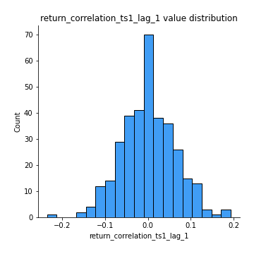
## Feature : return_correlation_ts1_lag_2
- **Feature type** : continous
- **Missing** : 0.0%
- **Unique** : 347
- **Count** :347.0
- **Mean** :-0.002002077373054929
- **Std** :0.06537506904559907
- **Min** :-0.17210085602287795
- **25%th Percentile** : -0.043785104134968375
- **50%th Percentile** : -0.005355765941193867
- **75%th Percentile** : 0.03805921406198384
- **Max** :0.20324159825394583

## Feature : return_correlation_ts1_lag_3
- **Feature type** : continous
- **Missing** : 0.0%
- **Unique** : 347
- **Count** :347.0
- **Mean** :0.006659530019250863
- **Std** :0.06535132078884033
- **Min** :-0.21147540839842804
- **25%th Percentile** : -0.042469364133120885
- **50%th Percentile** : 0.009731483215172027
- **75%th Percentile** : 0.05145844216525261
- **Max** :0.23808054096877584

## Feature : return_correlation_ts2_lag_1
- **Feature type** : continous
- **Missing** : 0.0%
- **Unique** : 347
- **Count** :347.0
- **Mean** :0.0014712405623158499
- **Std** :0.0637907380164993
- **Min** :-0.17665751184419612
- **25%th Percentile** : -0.04037151837495155
- **50%th Percentile** : 0.005284231082688947
- **75%th Percentile** : 0.04016516789868747
- **Max** :0.20723583209402832

## Feature : return_correlation_ts2_lag_2
- **Feature type** : continous
- **Missing** : 0.0%
- **Unique** : 347
- **Count** :347.0
- **Mean** :-0.0052223309429233495
- **Std** :0.06369729765108771
- **Min** :-0.2757460186107768
- **25%th Percentile** : -0.03921001536912658
- **50%th Percentile** : -0.004692840569759293
- **75%th Percentile** : 0.03189015021807096
- **Max** :0.19616378434373313

## Feature : return_correlation_ts2_lag_3
- **Feature type** : continous
- **Missing** : 0.0%
- **Unique** : 347
- **Count** :347.0
- **Mean** :0.005103023044933703
- **Std** :0.06546384310701697
- **Min** :-0.17697863431182184
- **25%th Percentile** : -0.0367162231340083
- **50%th Percentile** : 0.004028954690507291
- **75%th Percentile** : 0.05050323630013873
- **Max** :0.18227042221329348

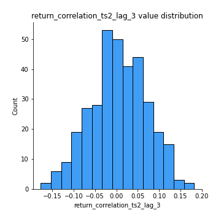
## Feature : sqreturn_autocorrelation_ts1_lag1
- **Feature type** : continous
- **Missing** : 0.0%
- **Unique** : 347
- **Count** :347.0
- **Mean** :0.03627511463235745
- **Std** :0.08511691216946318
- **Min** :-0.151004564528089
- **25%th Percentile** : -0.0220373123090949
- **50%th Percentile** : 0.01327887852149625
- **75%th Percentile** : 0.08266698886158728
- **Max** :0.4170324090514868

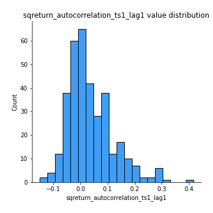
## Feature : sqreturn_autocorrelation_ts1_lag2
- **Feature type** : continous
- **Missing** : 0.0%
- **Unique** : 347
- **Count** :347.0
- **Mean** :0.01895054611327391
- **Std** :0.07088724272897691
- **Min** :-0.1690223430802184
- **25%th Percentile** : -0.027306157710933456
- **50%th Percentile** : 0.006363705846493107
- **75%th Percentile** : 0.058728678259682254
- **Max** :0.32836952056190194

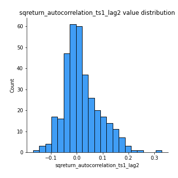
## Feature : sqreturn_autocorrelation_ts1_lag3
- **Feature type** : continous
- **Missing** : 0.0%
- **Unique** : 347
- **Count** :347.0
- **Mean** :0.010042519992158152
- **Std** :0.06716878820042725
- **Min** :-0.16144063558629737
- **25%th Percentile** : -0.03230793249914934
- **50%th Percentile** : 0.0018011702567621135
- **75%th Percentile** : 0.04736489011276265
- **Max** :0.23856108238097126

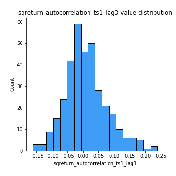
## Feature : sqreturn_autocorrelation_ts2_lag1
- **Feature type** : continous
- **Missing** : 0.0%
- **Unique** : 347
- **Count** :347.0
- **Mean** :0.023829698497529146
- **Std** :0.06558395031054169
- **Min** :-0.10084311347193196
- **25%th Percentile** : -0.019245960973654667
- **50%th Percentile** : 0.011476484843961179
- **75%th Percentile** : 0.05654509728575116
- **Max** :0.3459234668044924

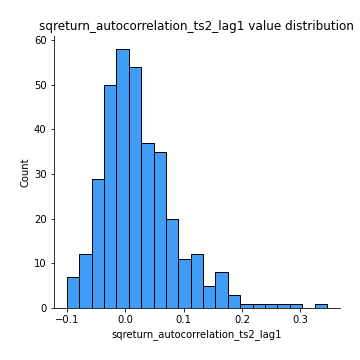
## Feature : sqreturn_autocorrelation_ts2_lag2
- **Feature type** : continous
- **Missing** : 0.0%
- **Unique** : 347
- **Count** :347.0
- **Mean** :0.012427204649905632
- **Std** :0.06389731025411868
- **Min** :-0.11335817655248547
- **25%th Percentile** : -0.02561213501429923
- **50%th Percentile** : -0.0020274300996249114
- **75%th Percentile** : 0.03510849533359846
- **Max** :0.46522427475412714

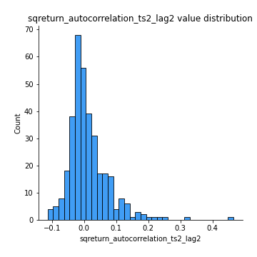
## Feature : sqreturn_autocorrelation_ts2_lag3
- **Feature type** : continous
- **Missing** : 0.0%
- **Unique** : 347
- **Count** :347.0
- **Mean** :0.007096377261058092
- **Std** :0.06146135398803402
- **Min** :-0.11978379927113683
- **25%th Percentile** : -0.02971354739725229
- **50%th Percentile** : -0.007999459636560997
- **75%th Percentile** : 0.026242559874431526
- **Max** :0.3463122340368414

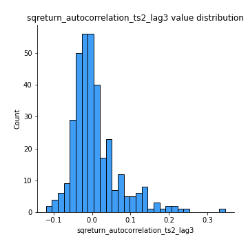
## Feature : sqreturn_correlation_ts1_lag_0
- **Feature type** : continous
- **Missing** : 0.0%
- **Unique** : 347
- **Count** :347.0
- **Mean** :0.3084296371019498
- **Std** :0.1362132224362648
- **Min** :-0.10256711281206837
- **25%th Percentile** : 0.23074549581020073
- **50%th Percentile** : 0.2978759141593998
- **75%th Percentile** : 0.3837908359403367
- **Max** :0.9937227277077512

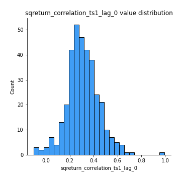
## Feature : sqreturn_correlation_ts1_lag_1
- **Feature type** : continous
- **Missing** : 0.0%
- **Unique** : 347
- **Count** :347.0
- **Mean** :0.0016413634346087427
- **Std** :0.06258717405636881
- **Min** :-0.23516753885177846
- **25%th Percentile** : -0.04121356167619353
- **50%th Percentile** : 0.00322509694373947
- **75%th Percentile** : 0.041381154648773955
- **Max** :0.19326383827382737

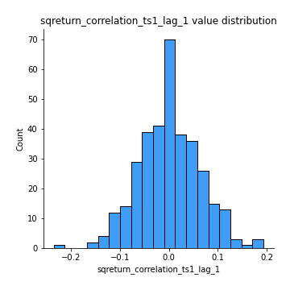
## Feature : sqreturn_correlation_ts1_lag_2
- **Feature type** : continous
- **Missing** : 0.0%
- **Unique** : 347
- **Count** :347.0
- **Mean** :-0.002002077373054929
- **Std** :0.06537506904559907
- **Min** :-0.17210085602287795
- **25%th Percentile** : -0.043785104134968375
- **50%th Percentile** : -0.005355765941193867
- **75%th Percentile** : 0.03805921406198384
- **Max** :0.20324159825394583

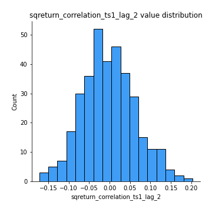
## Feature : sqreturn_correlation_ts1_lag_3
- **Feature type** : continous
- **Missing** : 0.0%
- **Unique** : 347
- **Count** :347.0
- **Mean** :0.006659530019250863
- **Std** :0.06535132078884033
- **Min** :-0.21147540839842804
- **25%th Percentile** : -0.042469364133120885
- **50%th Percentile** : 0.009731483215172027
- **75%th Percentile** : 0.05145844216525261
- **Max** :0.23808054096877584

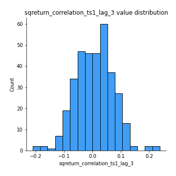
## Feature : sqreturn_correlation_ts2_lag_1
- **Feature type** : continous
- **Missing** : 0.0%
- **Unique** : 347
- **Count** :347.0
- **Mean** :0.0014712405623158499
- **Std** :0.0637907380164993
- **Min** :-0.17665751184419612
- **25%th Percentile** : -0.04037151837495155
- **50%th Percentile** : 0.005284231082688947
- **75%th Percentile** : 0.04016516789868747
- **Max** :0.20723583209402832

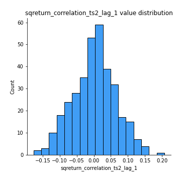
## Feature : sqreturn_correlation_ts2_lag_2
- **Feature type** : continous
- **Missing** : 0.0%
- **Unique** : 347
- **Count** :347.0
- **Mean** :-0.0052223309429233495
- **Std** :0.06369729765108771
- **Min** :-0.2757460186107768
- **25%th Percentile** : -0.03921001536912658
- **50%th Percentile** : -0.004692840569759293
- **75%th Percentile** : 0.03189015021807096
- **Max** :0.19616378434373313

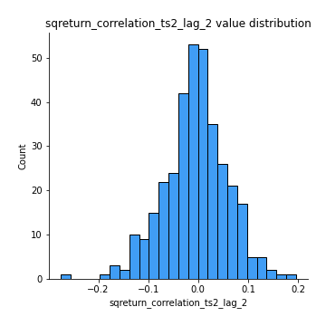
## Feature : sqreturn_correlation_ts2_lag_3
- **Feature type** : continous
- **Missing** : 0.0%
- **Unique** : 347
- **Count** :347.0
- **Mean** :0.005103023044933703
- **Std** :0.06546384310701697
- **Min** :-0.17697863431182184
- **25%th Percentile** : -0.0367162231340083
- **50%th Percentile** : 0.004028954690507291
- **75%th Percentile** : 0.05050323630013873
- **Max** :0.18227042221329348

## Feature : price2_granger_cause_price1
- **Feature type** : continous
- **Missing** : 0.0%
- **Unique** : 347
- **Count** :347.0
- **Mean** :0.27530158622014117
- **Std** :0.2929660878741146
- **Min** :0.00014130837113551724
- **25%th Percentile** : 0.0328288246318556
- **50%th Percentile** : 0.1558422908279174
- **75%th Percentile** : 0.44597128688468307
- **Max** :0.9963697557079193

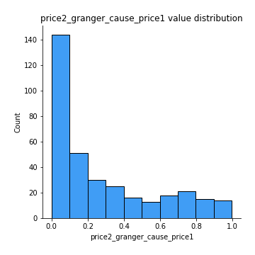
## Feature : price1_granger_cause_price2
- **Feature type** : continous
- **Missing** : 0.0%
- **Unique** : 347
- **Count** :347.0
- **Mean** :0.3198993553464296
- **Std** :0.29257011162091684
- **Min** :1.7840342825864538e-05
- **25%th Percentile** : 0.06364674679100683
- **50%th Percentile** : 0.2440002747073197
- **75%th Percentile** : 0.5432234214544834
- **Max** :0.999498089589359

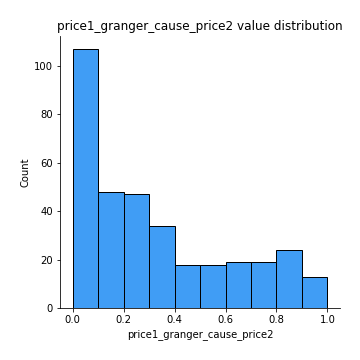

[<< Go back](../README.md)
