# Summary of 3_Linear

[<< Go back](../README.md)

## Logistic Regression (Linear)
- **n_jobs**: -1
- **explain_level**: 2

## Validation
 - **validation_type**: split
 - **train_ratio**: 0.75
 - **shuffle**: True
 - **stratify**: True

## Optimized metric
accuracy

## Training time

5.6 seconds

## Metric details
|           |    score |     threshold |
|:----------|---------:|--------------:|
| logloss   | 0.192772 | nan           |
| auc       | 0.985201 | nan           |
| f1        | 0.977273 |   0.622195    |
| accuracy  | 0.977011 |   0.622195    |
| precision | 1        |   0.811799    |
| recall    | 1        |   8.56214e-17 |
| mcc       | 0.954017 |   0.622195    |

## Confusion matrix (at threshold=0.622195)
|                      |   Predicted as real |   Predicted as simulated |
|:---------------------|--------------------:|-------------------------:|
| Labeled as real      |                  42 |                        1 |
| Labeled as simulated |                   1 |                       43 |

## Learning curves
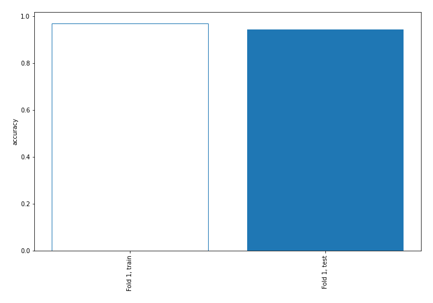

## Coefficients
| feature                           |   Learner_1 |
|:----------------------------------|------------:|
| return_skew1                      |  1.3381     |
| return_sd1                        |  0.863068   |
| return_mean1                      |  0.857246   |
| return_autocorrelation_2_lag2     |  0.661397   |
| return_autocorrelation_2_lag1     |  0.216596   |
| sqreturn_correlation_ts1_lag_1    |  0.207067   |
| return_correlation_ts1_lag_1      |  0.207067   |
| return_kurtosis2                  |  0.199054   |
| price1_granger_cause_price2       |  0.19887    |
| return_autocorrelation_1_lag1     |  0.197796   |
| return_autocorrelation_1_lag2     |  0.147164   |
| sqreturn_correlation_ts2_lag_2    |  0.129425   |
| return_correlation_ts2_lag_2      |  0.129425   |
| return_skew2                      |  0.12142    |
| return_autocorrelation_2_lag3     |  0.0762487  |
| sqreturn_correlation_ts1_lag_2    | -0.00471705 |
| return_correlation_ts1_lag_2      | -0.00471705 |
| sqreturn_correlation_ts2_lag_1    | -0.018375   |
| return_correlation_ts2_lag_1      | -0.018375   |
| return_sd2                        | -0.230605   |
| sqreturn_correlation_ts1_lag_3    | -0.272168   |
| return_correlation_ts1_lag_3      | -0.272168   |
| sqreturn_autocorrelation_ts2_lag3 | -0.27476    |
| return_autocorrelation_1_lag3     | -0.283776   |
| return_correlation_ts2_lag_3      | -0.306458   |
| sqreturn_correlation_ts2_lag_3    | -0.306458   |
| sqreturn_autocorrelation_ts1_lag3 | -0.346521   |
| price2_granger_cause_price1       | -0.41316    |
| sqreturn_autocorrelation_ts2_lag2 | -0.507428   |
| intercept                         | -0.606951   |
| sqreturn_correlation_ts1_lag_0    | -0.682061   |
| return_correlation_ts1_lag_0      | -0.682061   |
| sqreturn_autocorrelation_ts1_lag2 | -0.754846   |
| sqreturn_autocorrelation_ts2_lag1 | -0.760983   |
| sqreturn_autocorrelation_ts1_lag1 | -1.03531    |
| return_mean2                      | -3.71877    |
| return_kurtosis1                  | -4.24422    |

## Permutation-based Importance
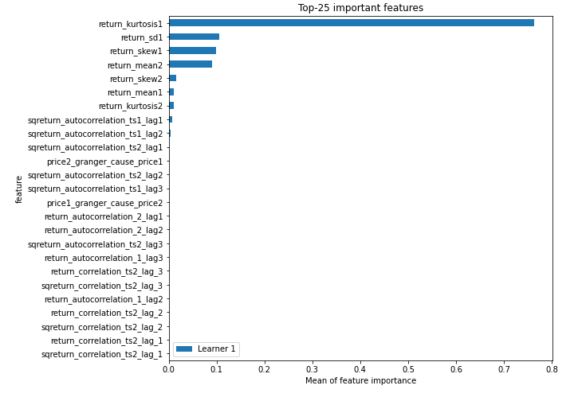
## Confusion Matrix

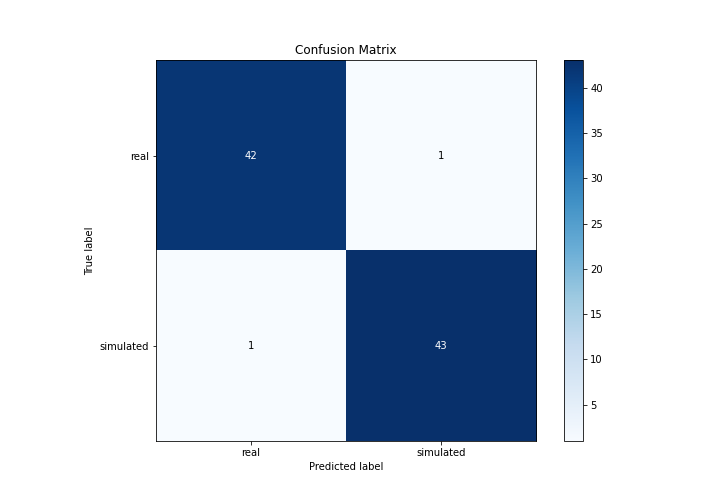

## Normalized Confusion Matrix

## ROC Curve

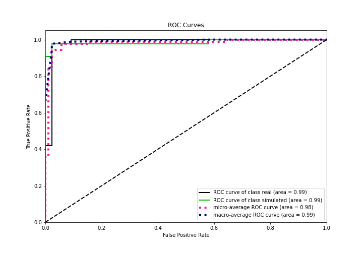

## Kolmogorov-Smirnov Statistic

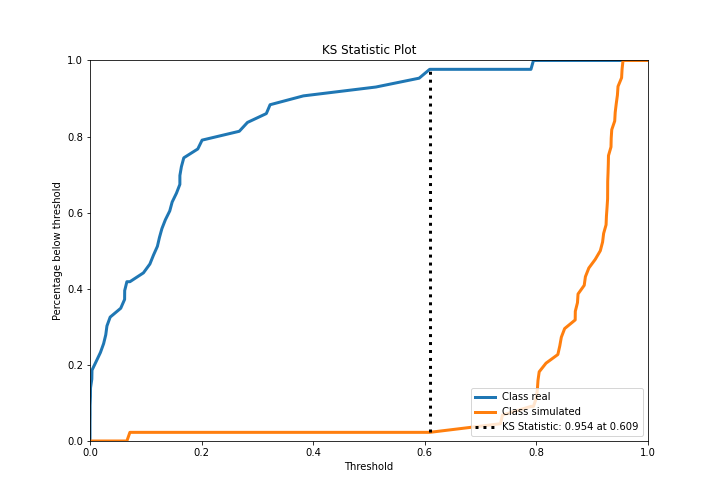

## Precision-Recall Curve

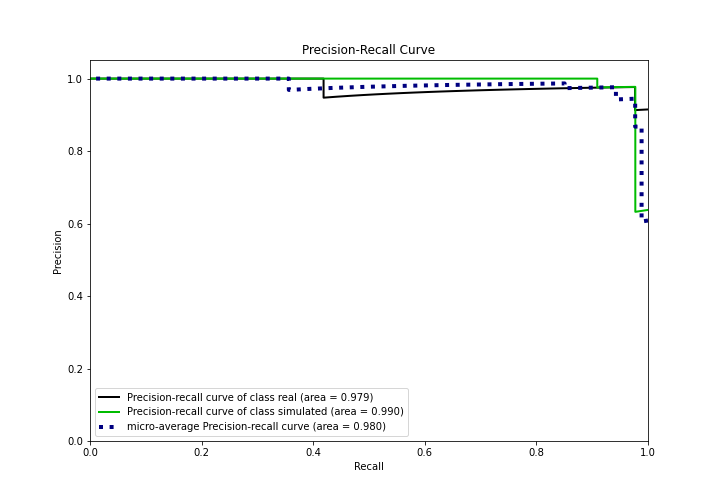

## Calibration Curve

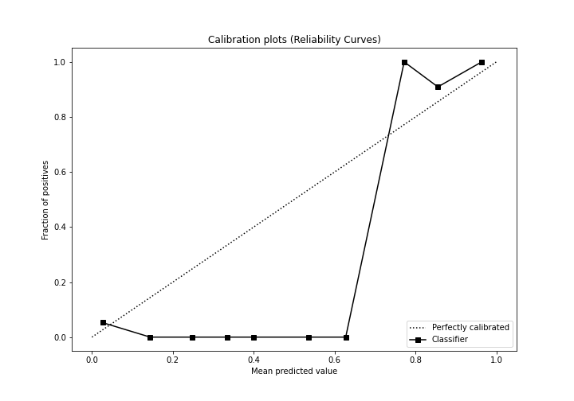

## Cumulative Gains Curve

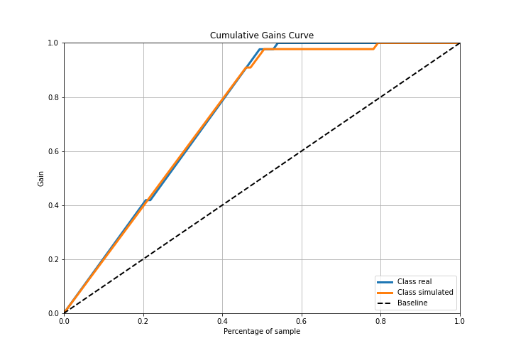

## Lift Curve

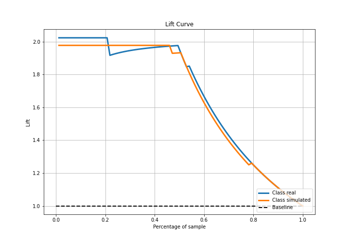

## SHAP Importance
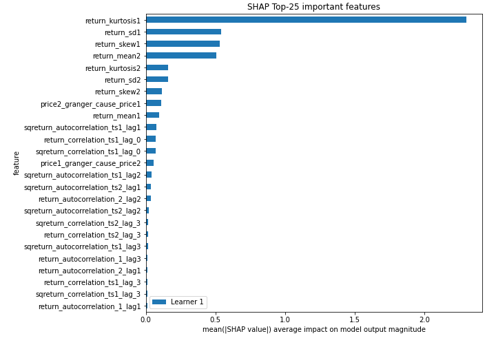

## SHAP Dependence plots

### Dependence (Fold 1)
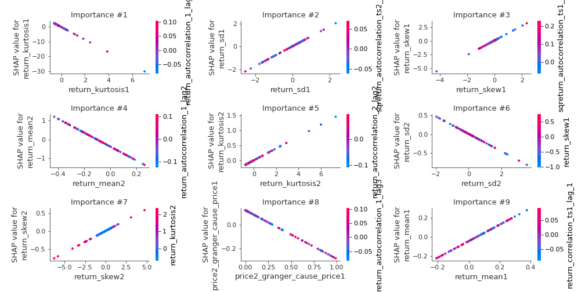

## SHAP Decision plots

### Top-10 Worst decisions for class 0 (Fold 1)
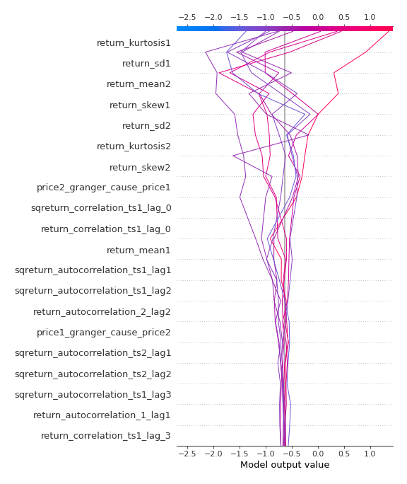
### Top-10 Best decisions for class 0 (Fold 1)
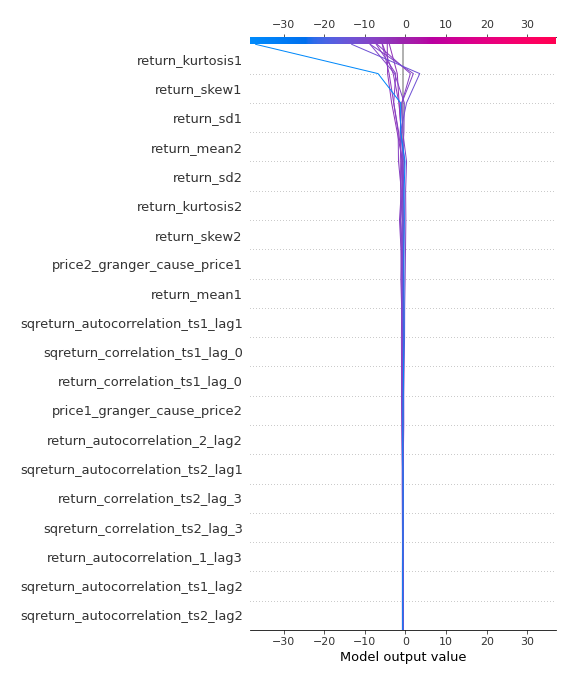
### Top-10 Worst decisions for class 1 (Fold 1)
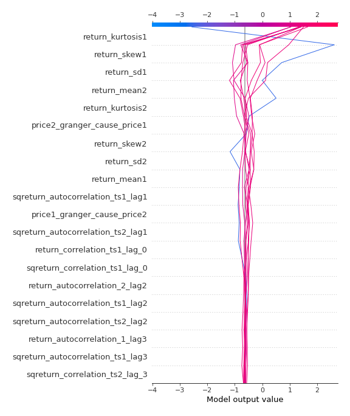
### Top-10 Best decisions for class 1 (Fold 1)
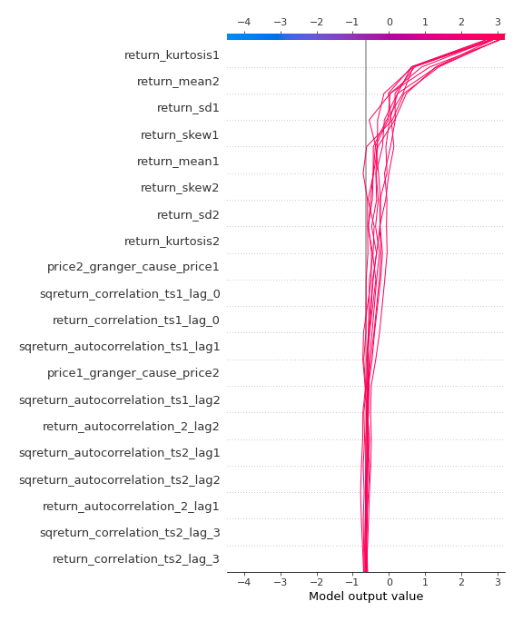

[<< Go back](../README.md)
