# Exploratory Data Analysis

[<< Go back](../README.md)
## Feature : target
- **Feature type** : categorical
- **Missing** : 0.0%
- **Unique** : 2
- **Count** :347
- **Unique** :2
- **Top** :simulated
- **Freq** :176

## Feature : return_mean1
- **Feature type** : continous
- **Missing** : 0.0%
- **Unique** : 347
- **Count** :347.0
- **Mean** :0.06563271816681572
- **Std** :0.12486028735114778
- **Min** :-0.26646485089353084
- **25%th Percentile** : -0.013294828906507891
- **50%th Percentile** : 0.06861185195001625
- **75%th Percentile** : 0.14805650477832177
- **Max** :0.45269113250004056

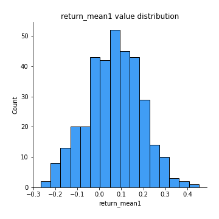
## Feature : return_mean2
- **Feature type** : continous
- **Missing** : 0.0%
- **Unique** : 347
- **Count** :347.0
- **Mean** :-0.10278687252843148
- **Std** :0.1723670323841838
- **Min** :-0.6798748003952276
- **25%th Percentile** : -0.22176043286635005
- **50%th Percentile** : -0.108197716998617
- **75%th Percentile** : 0.027313180112145514
- **Max** :0.6801605239983173

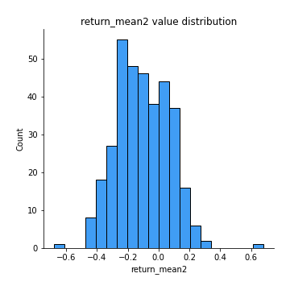
## Feature : return_sd1
- **Feature type** : continous
- **Missing** : 0.0%
- **Unique** : 347
- **Count** :347.0
- **Mean** :1.777526523647148
- **Std** :0.3714099823740261
- **Min** :0.8102430347636637
- **25%th Percentile** : 1.595582556302527
- **50%th Percentile** : 1.8388208827405215
- **75%th Percentile** : 1.9558087103717081
- **Max** :3.181425034216533

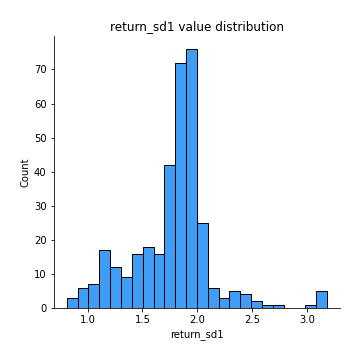
## Feature : return_sd2
- **Feature type** : continous
- **Missing** : 0.0%
- **Unique** : 347
- **Count** :347.0
- **Mean** :1.6885778876275948
- **Std** :0.39558435899420746
- **Min** :0.8198779632289204
- **25%th Percentile** : 1.5020410645847093
- **50%th Percentile** : 1.6415840789799863
- **75%th Percentile** : 1.8131440278158952
- **Max** :4.59233049161685

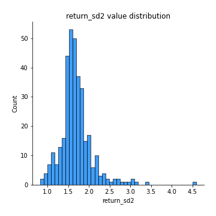
## Feature : return_skew1
- **Feature type** : continous
- **Missing** : 0.0%
- **Unique** : 347
- **Count** :347.0
- **Mean** :-0.19513359675657563
- **Std** :0.709153777862779
- **Min** :-4.239645236578449
- **25%th Percentile** : -0.36437580669842684
- **50%th Percentile** : -0.09595744024734339
- **75%th Percentile** : 0.088238036038293
- **Max** :2.351757728252051

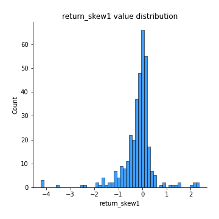
## Feature : return_skew2
- **Feature type** : continous
- **Missing** : 0.0%
- **Unique** : 347
- **Count** :347.0
- **Mean** :-0.22375038323805774
- **Std** :1.2424612328279867
- **Min** :-6.262899561987459
- **25%th Percentile** : -0.6030741291254387
- **50%th Percentile** : -0.15742011077964144
- **75%th Percentile** : 0.3517353350906618
- **Max** :4.750436868112849

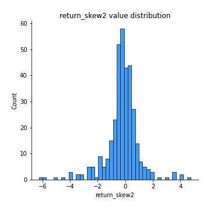
## Feature : return_kurtosis1
- **Feature type** : continous
- **Missing** : 0.0%
- **Unique** : 347
- **Count** :347.0
- **Mean** :2.751841553498053
- **Std** :5.4022897814756075
- **Min** :-0.5301853038833504
- **25%th Percentile** : 0.0961611895001484
- **50%th Percentile** : 0.94513435602309
- **75%th Percentile** : 2.8689848608081436
- **Max** :40.485294874464934

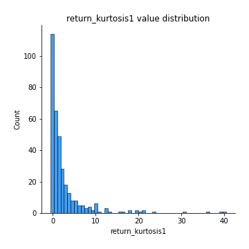
## Feature : return_kurtosis2
- **Feature type** : continous
- **Missing** : 0.0%
- **Unique** : 347
- **Count** :347.0
- **Mean** :6.739220985802068
- **Std** :8.956782769538828
- **Min** :-0.06267691183898672
- **25%th Percentile** : 1.760505458635024
- **50%th Percentile** : 3.492392590309478
- **75%th Percentile** : 7.5343449803484415
- **Max** :64.99818629655663

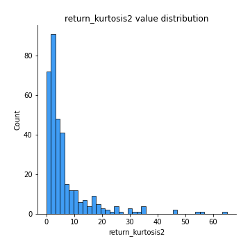
## Feature : return_autocorrelation_1_lag1
- **Feature type** : continous
- **Missing** : 0.0%
- **Unique** : 347
- **Count** :347.0
- **Mean** :-0.0075752245610378344
- **Std** :0.06750719137627109
- **Min** :-0.2110198016529991
- **25%th Percentile** : -0.056794320242977675
- **50%th Percentile** : -0.008441515074129255
- **75%th Percentile** : 0.03736568140387897
- **Max** :0.20132571463207988

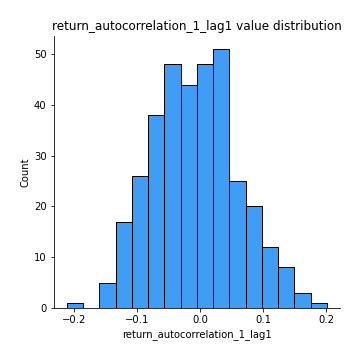
## Feature : return_autocorrelation_1_lag2
- **Feature type** : continous
- **Missing** : 0.0%
- **Unique** : 347
- **Count** :347.0
- **Mean** :-0.011689761191690332
- **Std** :0.06957877589972249
- **Min** :-0.19130112176935146
- **25%th Percentile** : -0.06166315205234503
- **50%th Percentile** : -0.01112406322658638
- **75%th Percentile** : 0.033455965793034094
- **Max** :0.21123611097039302

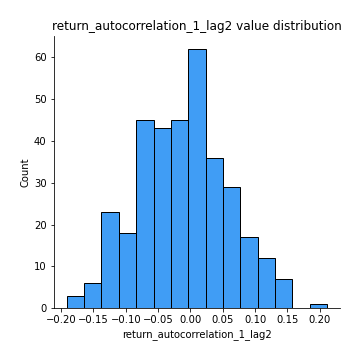
## Feature : return_autocorrelation_1_lag3
- **Feature type** : continous
- **Missing** : 0.0%
- **Unique** : 347
- **Count** :347.0
- **Mean** :0.006182123998487234
- **Std** :0.06347967887536113
- **Min** :-0.1654833157463618
- **25%th Percentile** : -0.04046348517209579
- **50%th Percentile** : 0.010978156454274284
- **75%th Percentile** : 0.04897277099985441
- **Max** :0.18993806979469166

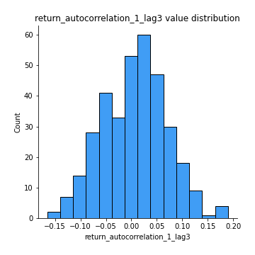
## Feature : return_autocorrelation_2_lag1
- **Feature type** : continous
- **Missing** : 0.0%
- **Unique** : 347
- **Count** :347.0
- **Mean** :0.002915005782658718
- **Std** :0.07149364006206403
- **Min** :-0.2364404317158175
- **25%th Percentile** : -0.04457254925529995
- **50%th Percentile** : 0.003547429931702038
- **75%th Percentile** : 0.054347316857681294
- **Max** :0.2119626652862963

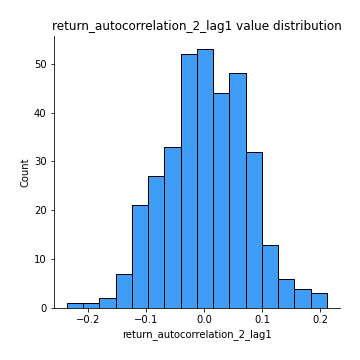
## Feature : return_autocorrelation_2_lag2
- **Feature type** : continous
- **Missing** : 0.0%
- **Unique** : 347
- **Count** :347.0
- **Mean** :0.0011447216273323868
- **Std** :0.06326756806933134
- **Min** :-0.1758721664122366
- **25%th Percentile** : -0.039502973295084565
- **50%th Percentile** : 0.001122355946790049
- **75%th Percentile** : 0.04293674396060043
- **Max** :0.1766844643279861

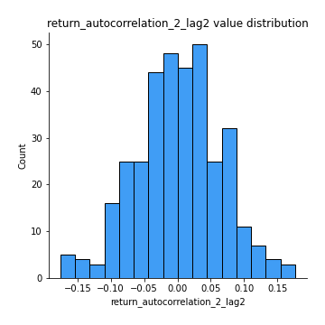
## Feature : return_autocorrelation_2_lag3
- **Feature type** : continous
- **Missing** : 0.0%
- **Unique** : 347
- **Count** :347.0
- **Mean** :0.012408851918610683
- **Std** :0.06559913054699036
- **Min** :-0.22601125543796563
- **25%th Percentile** : -0.025839847506780953
- **50%th Percentile** : 0.012750234031154857
- **75%th Percentile** : 0.05414628137425546
- **Max** :0.20205753622966244

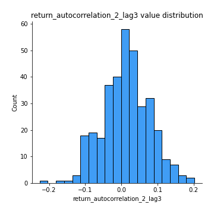
## Feature : return_correlation_ts1_lag_0
- **Feature type** : continous
- **Missing** : 0.0%
- **Unique** : 347
- **Count** :347.0
- **Mean** :0.29980692978727286
- **Std** :0.1362904859353904
- **Min** :-0.07366870340906873
- **25%th Percentile** : 0.22120574766210022
- **50%th Percentile** : 0.29604156858029923
- **75%th Percentile** : 0.36621896031745016
- **Max** :0.9937227277077512

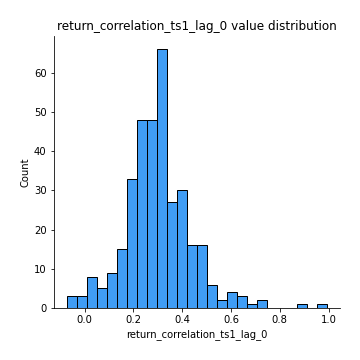
## Feature : return_correlation_ts1_lag_1
- **Feature type** : continous
- **Missing** : 0.0%
- **Unique** : 347
- **Count** :347.0
- **Mean** :0.000616181596519281
- **Std** :0.06174936273690851
- **Min** :-0.18856827637524448
- **25%th Percentile** : -0.04501578014795364
- **50%th Percentile** : 0.0021586202542078306
- **75%th Percentile** : 0.0401234922796848
- **Max** :0.159100778661096

## Feature : return_correlation_ts1_lag_2
- **Feature type** : continous
- **Missing** : 0.0%
- **Unique** : 347
- **Count** :347.0
- **Mean** :-0.003214469544081546
- **Std** :0.06356519566736125
- **Min** :-0.18253231436446118
- **25%th Percentile** : -0.044736863401576205
- **50%th Percentile** : -0.006909697032052656
- **75%th Percentile** : 0.04118712291871398
- **Max** :0.17974071501626168

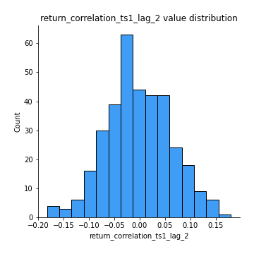
## Feature : return_correlation_ts1_lag_3
- **Feature type** : continous
- **Missing** : 0.0%
- **Unique** : 347
- **Count** :347.0
- **Mean** :0.006948061669916486
- **Std** :0.06658135085048196
- **Min** :-0.18059033867783728
- **25%th Percentile** : -0.03898459225842334
- **50%th Percentile** : 0.008739459411752826
- **75%th Percentile** : 0.05048699637087754
- **Max** :0.23808054096877584

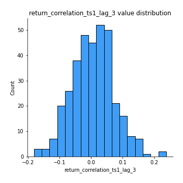
## Feature : return_correlation_ts2_lag_1
- **Feature type** : continous
- **Missing** : 0.0%
- **Unique** : 347
- **Count** :347.0
- **Mean** :0.0015346355222232437
- **Std** :0.06388138067205162
- **Min** :-0.17665751184419612
- **25%th Percentile** : -0.03635679801228338
- **50%th Percentile** : 0.00023235269029014955
- **75%th Percentile** : 0.03986307808379342
- **Max** :0.3425036902091001

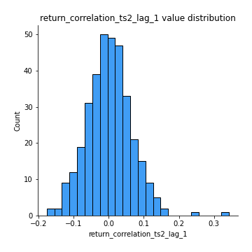
## Feature : return_correlation_ts2_lag_2
- **Feature type** : continous
- **Missing** : 0.0%
- **Unique** : 347
- **Count** :347.0
- **Mean** :-0.004279722327983631
- **Std** :0.06690350057837467
- **Min** :-0.18793480063267962
- **25%th Percentile** : -0.0510960390597789
- **50%th Percentile** : -0.004452812499661592
- **75%th Percentile** : 0.03871193745734202
- **Max** :0.19373129239100217

## Feature : return_correlation_ts2_lag_3
- **Feature type** : continous
- **Missing** : 0.0%
- **Unique** : 347
- **Count** :347.0
- **Mean** :0.009726941406229284
- **Std** :0.06357050172224331
- **Min** :-0.1775039587719991
- **25%th Percentile** : -0.030436482736678892
- **50%th Percentile** : 0.007134333009004017
- **75%th Percentile** : 0.057126091751646825
- **Max** :0.19621185265162586

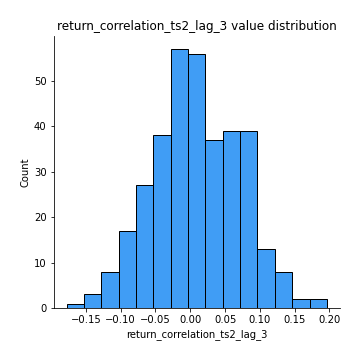
## Feature : sqreturn_autocorrelation_ts1_lag1
- **Feature type** : continous
- **Missing** : 0.0%
- **Unique** : 347
- **Count** :347.0
- **Mean** :0.03172220996735787
- **Std** :0.08289247291888656
- **Min** :-0.1535216352404307
- **25%th Percentile** : -0.0237736183357819
- **50%th Percentile** : 0.01740210469784178
- **75%th Percentile** : 0.07898180297134502
- **Max** :0.4170324090514868

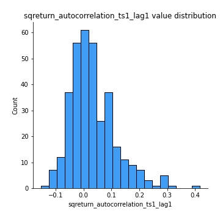
## Feature : sqreturn_autocorrelation_ts1_lag2
- **Feature type** : continous
- **Missing** : 0.0%
- **Unique** : 347
- **Count** :347.0
- **Mean** :0.015964720938589836
- **Std** :0.06601833650574868
- **Min** :-0.12839574690692312
- **25%th Percentile** : -0.027400425094713472
- **50%th Percentile** : 0.00488400668948932
- **75%th Percentile** : 0.047242434845850584
- **Max** :0.29415594530501293

## Feature : sqreturn_autocorrelation_ts1_lag3
- **Feature type** : continous
- **Missing** : 0.0%
- **Unique** : 347
- **Count** :347.0
- **Mean** :0.010544483442780167
- **Std** :0.061453439629537816
- **Min** :-0.1495772143394995
- **25%th Percentile** : -0.028792074245760947
- **50%th Percentile** : 0.0032304897496262595
- **75%th Percentile** : 0.0460584355633471
- **Max** :0.2699544787074275

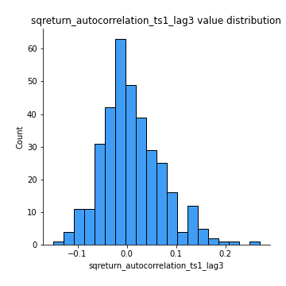
## Feature : sqreturn_autocorrelation_ts2_lag1
- **Feature type** : continous
- **Missing** : 0.0%
- **Unique** : 347
- **Count** :347.0
- **Mean** :0.02830916553483369
- **Std** :0.07289089531881351
- **Min** :-0.0993467061472659
- **25%th Percentile** : -0.017303017076618462
- **50%th Percentile** : 0.009984586535766104
- **75%th Percentile** : 0.0558230606600669
- **Max** :0.36991568023038357

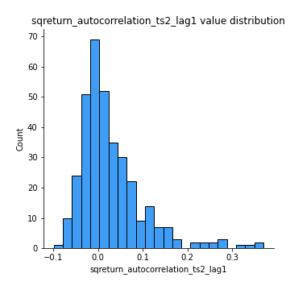
## Feature : sqreturn_autocorrelation_ts2_lag2
- **Feature type** : continous
- **Missing** : 0.0%
- **Unique** : 347
- **Count** :347.0
- **Mean** :0.008025717297133736
- **Std** :0.053802694771818996
- **Min** :-0.12285994884276667
- **25%th Percentile** : -0.02569722126797787
- **50%th Percentile** : -0.0024302648042469474
- **75%th Percentile** : 0.032109227441533814
- **Max** :0.28672056150180414

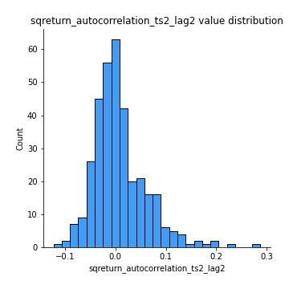
## Feature : sqreturn_autocorrelation_ts2_lag3
- **Feature type** : continous
- **Missing** : 0.0%
- **Unique** : 347
- **Count** :347.0
- **Mean** :0.007285729073359761
- **Std** :0.057307636792005866
- **Min** :-0.09756858950376449
- **25%th Percentile** : -0.028511228706386706
- **50%th Percentile** : -0.006052079941031898
- **75%th Percentile** : 0.027870404686726205
- **Max** :0.3463122340368414

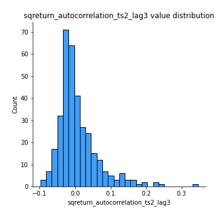
## Feature : sqreturn_correlation_ts1_lag_0
- **Feature type** : continous
- **Missing** : 0.0%
- **Unique** : 347
- **Count** :347.0
- **Mean** :0.29980692978727286
- **Std** :0.1362904859353904
- **Min** :-0.07366870340906873
- **25%th Percentile** : 0.22120574766210022
- **50%th Percentile** : 0.29604156858029923
- **75%th Percentile** : 0.36621896031745016
- **Max** :0.9937227277077512

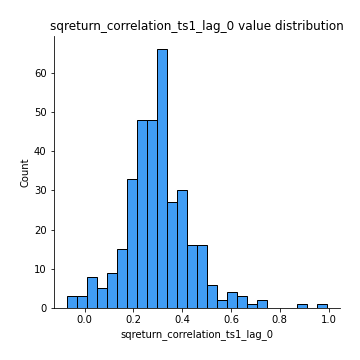
## Feature : sqreturn_correlation_ts1_lag_1
- **Feature type** : continous
- **Missing** : 0.0%
- **Unique** : 347
- **Count** :347.0
- **Mean** :0.000616181596519281
- **Std** :0.06174936273690851
- **Min** :-0.18856827637524448
- **25%th Percentile** : -0.04501578014795364
- **50%th Percentile** : 0.0021586202542078306
- **75%th Percentile** : 0.0401234922796848
- **Max** :0.159100778661096

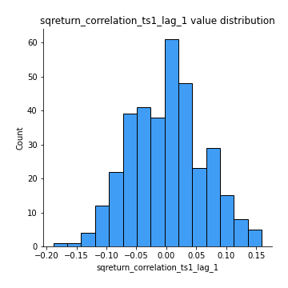
## Feature : sqreturn_correlation_ts1_lag_2
- **Feature type** : continous
- **Missing** : 0.0%
- **Unique** : 347
- **Count** :347.0
- **Mean** :-0.003214469544081546
- **Std** :0.06356519566736125
- **Min** :-0.18253231436446118
- **25%th Percentile** : -0.044736863401576205
- **50%th Percentile** : -0.006909697032052656
- **75%th Percentile** : 0.04118712291871398
- **Max** :0.17974071501626168

## Feature : sqreturn_correlation_ts1_lag_3
- **Feature type** : continous
- **Missing** : 0.0%
- **Unique** : 347
- **Count** :347.0
- **Mean** :0.006948061669916486
- **Std** :0.06658135085048196
- **Min** :-0.18059033867783728
- **25%th Percentile** : -0.03898459225842334
- **50%th Percentile** : 0.008739459411752826
- **75%th Percentile** : 0.05048699637087754
- **Max** :0.23808054096877584

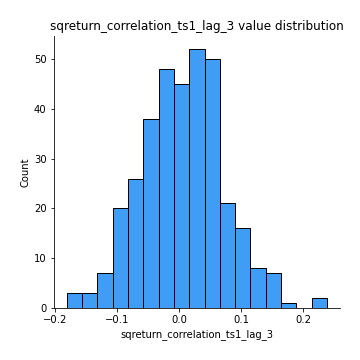
## Feature : sqreturn_correlation_ts2_lag_1
- **Feature type** : continous
- **Missing** : 0.0%
- **Unique** : 347
- **Count** :347.0
- **Mean** :0.0015346355222232437
- **Std** :0.06388138067205162
- **Min** :-0.17665751184419612
- **25%th Percentile** : -0.03635679801228338
- **50%th Percentile** : 0.00023235269029014955
- **75%th Percentile** : 0.03986307808379342
- **Max** :0.3425036902091001

## Feature : sqreturn_correlation_ts2_lag_2
- **Feature type** : continous
- **Missing** : 0.0%
- **Unique** : 347
- **Count** :347.0
- **Mean** :-0.004279722327983631
- **Std** :0.06690350057837467
- **Min** :-0.18793480063267962
- **25%th Percentile** : -0.0510960390597789
- **50%th Percentile** : -0.004452812499661592
- **75%th Percentile** : 0.03871193745734202
- **Max** :0.19373129239100217

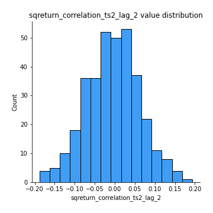
## Feature : sqreturn_correlation_ts2_lag_3
- **Feature type** : continous
- **Missing** : 0.0%
- **Unique** : 347
- **Count** :347.0
- **Mean** :0.009726941406229284
- **Std** :0.06357050172224331
- **Min** :-0.1775039587719991
- **25%th Percentile** : -0.030436482736678892
- **50%th Percentile** : 0.007134333009004017
- **75%th Percentile** : 0.057126091751646825
- **Max** :0.19621185265162586

## Feature : price2_granger_cause_price1
- **Feature type** : continous
- **Missing** : 0.0%
- **Unique** : 347
- **Count** :347.0
- **Mean** :0.28209733791464886
- **Std** :0.28653895225618164
- **Min** :2.4312048970873696e-09
- **25%th Percentile** : 0.04175250718869876
- **50%th Percentile** : 0.17287909580079178
- **75%th Percentile** : 0.4943314512282417
- **Max** :0.9898380228448623

## Feature : price1_granger_cause_price2
- **Feature type** : continous
- **Missing** : 0.0%
- **Unique** : 347
- **Count** :347.0
- **Mean** :0.3265382154412499
- **Std** :0.3030511038570371
- **Min** :1.2012269232170316e-11
- **25%th Percentile** : 0.06346556514875179
- **50%th Percentile** : 0.22110586197155074
- **75%th Percentile** : 0.5535954772726086
- **Max** :0.9960082060946296

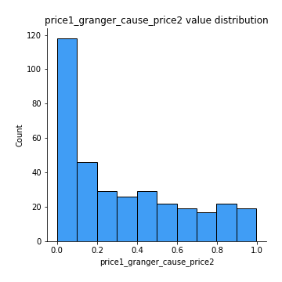

[<< Go back](../README.md)
