# Exploratory Data Analysis

[<< Go back](../README.md)
## Feature : target
- **Feature type** : categorical
- **Missing** : 0.0%
- **Unique** : 2
- **Count** :347
- **Unique** :2
- **Top** :real
- **Freq** :176

## Feature : return_mean1
- **Feature type** : continous
- **Missing** : 0.0%
- **Unique** : 347
- **Count** :347.0
- **Mean** :0.06847778818165666
- **Std** :0.1254585440476229
- **Min** :-0.3332853628820226
- **25%th Percentile** : -0.006112094899575888
- **50%th Percentile** : 0.07401763754479598
- **75%th Percentile** : 0.14979162662781215
- **Max** :0.5368060046460513

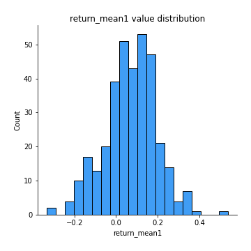
## Feature : return_mean2
- **Feature type** : continous
- **Missing** : 0.0%
- **Unique** : 347
- **Count** :347.0
- **Mean** :-0.09754335124525475
- **Std** :0.16952156156631204
- **Min** :-0.6326314720687075
- **25%th Percentile** : -0.2236634009349243
- **50%th Percentile** : -0.097916127620738
- **75%th Percentile** : 0.034408458739907416
- **Max** :0.6801605239983173

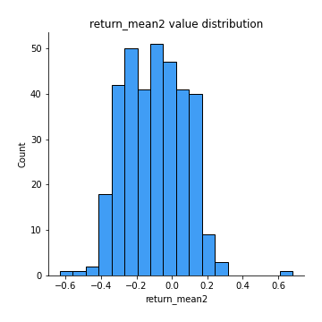
## Feature : return_sd1
- **Feature type** : continous
- **Missing** : 0.0%
- **Unique** : 347
- **Count** :347.0
- **Mean** :1.7937001701651023
- **Std** :0.38639954186020264
- **Min** :0.8733078831717243
- **25%th Percentile** : 1.5730907495958615
- **50%th Percentile** : 1.8540774657025234
- **75%th Percentile** : 1.9615623420484498
- **Max** :3.332494027875222

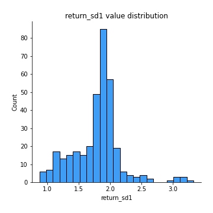
## Feature : return_sd2
- **Feature type** : continous
- **Missing** : 0.0%
- **Unique** : 347
- **Count** :347.0
- **Mean** :1.7273657251355645
- **Std** :0.428210879602581
- **Min** :0.8198779632289204
- **25%th Percentile** : 1.5062244865013632
- **50%th Percentile** : 1.6582618418655697
- **75%th Percentile** : 1.8630012411766304
- **Max** :4.59233049161685

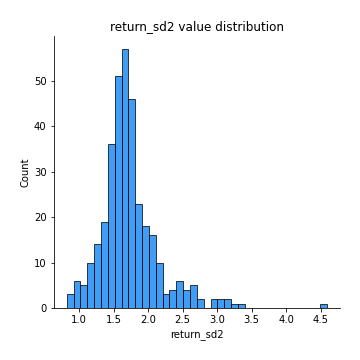
## Feature : return_skew1
- **Feature type** : continous
- **Missing** : 0.0%
- **Unique** : 347
- **Count** :347.0
- **Mean** :-0.1682089038575522
- **Std** :0.7134443136965304
- **Min** :-4.239645236578449
- **25%th Percentile** : -0.35927750326243313
- **50%th Percentile** : -0.096183178480937
- **75%th Percentile** : 0.10781715737171746
- **Max** :2.1285977762978217

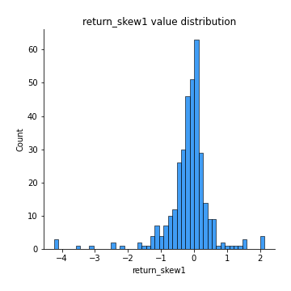
## Feature : return_skew2
- **Feature type** : continous
- **Missing** : 0.0%
- **Unique** : 347
- **Count** :347.0
- **Mean** :-0.24077527580811436
- **Std** :1.2658706796964454
- **Min** :-6.8126190703026195
- **25%th Percentile** : -0.5752813515418969
- **50%th Percentile** : -0.16366535910961688
- **75%th Percentile** : 0.3396662909399234
- **Max** :4.1832113339475585

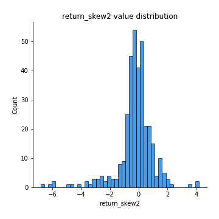
## Feature : return_kurtosis1
- **Feature type** : continous
- **Missing** : 0.0%
- **Unique** : 347
- **Count** :347.0
- **Mean** :2.703386259033288
- **Std** :5.273825088397638
- **Min** :-0.5686456863572484
- **25%th Percentile** : 0.2288899067738901
- **50%th Percentile** : 1.0734651463399394
- **75%th Percentile** : 2.8909858215319697
- **Max** :40.485294874464934

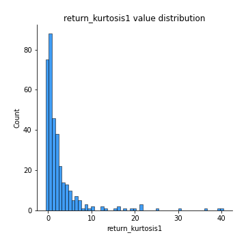
## Feature : return_kurtosis2
- **Feature type** : continous
- **Missing** : 0.0%
- **Unique** : 347
- **Count** :347.0
- **Mean** :7.077184535072441
- **Std** :10.18647213303689
- **Min** :-0.1693240760286967
- **25%th Percentile** : 1.8045762609552118
- **50%th Percentile** : 3.6388379153452135
- **75%th Percentile** : 7.386630816496544
- **Max** :82.8587306445432

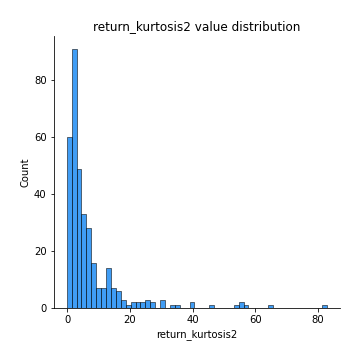
## Feature : return_autocorrelation_1_lag1
- **Feature type** : continous
- **Missing** : 0.0%
- **Unique** : 347
- **Count** :347.0
- **Mean** :-0.007724532483863149
- **Std** :0.06821278728755438
- **Min** :-0.21946649794634823
- **25%th Percentile** : -0.05755711791861835
- **50%th Percentile** : -0.006779137341250531
- **75%th Percentile** : 0.03818828420504028
- **Max** :0.1612062752515845

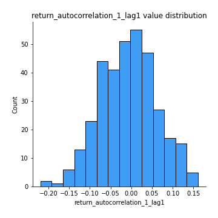
## Feature : return_autocorrelation_1_lag2
- **Feature type** : continous
- **Missing** : 0.0%
- **Unique** : 347
- **Count** :347.0
- **Mean** :-0.01249794465823418
- **Std** :0.06548426714252066
- **Min** :-0.21183213309041968
- **25%th Percentile** : -0.06043422915053767
- **50%th Percentile** : -0.014047236611911646
- **75%th Percentile** : 0.030971279404535465
- **Max** :0.21123611097039302

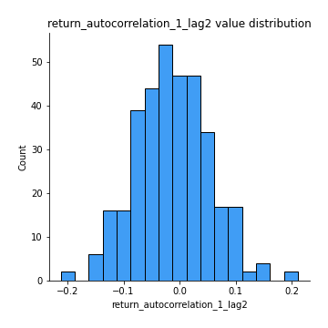
## Feature : return_autocorrelation_1_lag3
- **Feature type** : continous
- **Missing** : 0.0%
- **Unique** : 347
- **Count** :347.0
- **Mean** :0.01164084090858476
- **Std** :0.06213404530099173
- **Min** :-0.1654833157463618
- **25%th Percentile** : -0.030871263976865296
- **50%th Percentile** : 0.018030333117231727
- **75%th Percentile** : 0.054747353425090274
- **Max** :0.19356736970286614

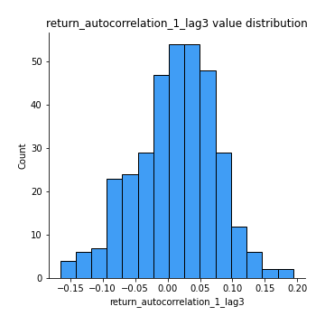
## Feature : return_autocorrelation_2_lag1
- **Feature type** : continous
- **Missing** : 0.0%
- **Unique** : 347
- **Count** :347.0
- **Mean** :0.0036386670373511525
- **Std** :0.06468181280395917
- **Min** :-0.17778763204400128
- **25%th Percentile** : -0.038515931900672755
- **50%th Percentile** : 0.0027338558700057956
- **75%th Percentile** : 0.04809540504070713
- **Max** :0.2024676054184499

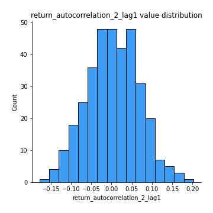
## Feature : return_autocorrelation_2_lag2
- **Feature type** : continous
- **Missing** : 0.0%
- **Unique** : 347
- **Count** :347.0
- **Mean** :-0.0015012514426408963
- **Std** :0.06762435266385537
- **Min** :-0.18439930577633348
- **25%th Percentile** : -0.04677685663035414
- **50%th Percentile** : 0.00036951644282418305
- **75%th Percentile** : 0.04499092100008068
- **Max** :0.23284619863740424

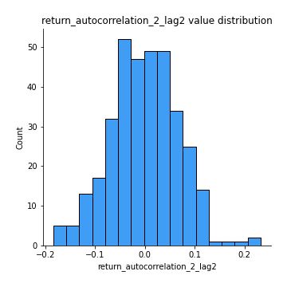
## Feature : return_autocorrelation_2_lag3
- **Feature type** : continous
- **Missing** : 0.0%
- **Unique** : 347
- **Count** :347.0
- **Mean** :0.009183172698878158
- **Std** :0.0627241568851436
- **Min** :-0.18437277443013364
- **25%th Percentile** : -0.02732555618870882
- **50%th Percentile** : 0.009988264195594928
- **75%th Percentile** : 0.054072823611832646
- **Max** :0.18829836826240134

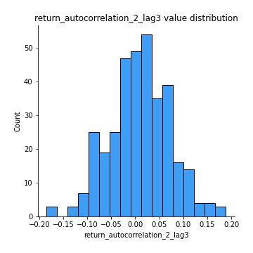
## Feature : return_correlation_ts1_lag_0
- **Feature type** : continous
- **Missing** : 0.0%
- **Unique** : 347
- **Count** :347.0
- **Mean** :0.3045190662599357
- **Std** :0.13688525338858534
- **Min** :-0.10256711281206837
- **25%th Percentile** : 0.22426331095728863
- **50%th Percentile** : 0.3015368220463343
- **75%th Percentile** : 0.3782878034003826
- **Max** :0.9937227277077512

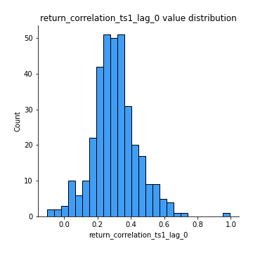
## Feature : return_correlation_ts1_lag_1
- **Feature type** : continous
- **Missing** : 0.0%
- **Unique** : 347
- **Count** :347.0
- **Mean** :0.00283636559858201
- **Std** :0.06356764654909079
- **Min** :-0.18856827637524448
- **25%th Percentile** : -0.04149612166874715
- **50%th Percentile** : 0.00370130214201527
- **75%th Percentile** : 0.04847538670294131
- **Max** :0.17058237783322017

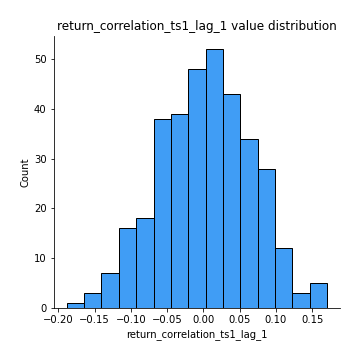
## Feature : return_correlation_ts1_lag_2
- **Feature type** : continous
- **Missing** : 0.0%
- **Unique** : 347
- **Count** :347.0
- **Mean** :0.000455606617341251
- **Std** :0.06493853710062815
- **Min** :-0.16038742223567365
- **25%th Percentile** : -0.04377710025846665
- **50%th Percentile** : 0.002453647987604593
- **75%th Percentile** : 0.04777518539678531
- **Max** :0.17974071501626168

## Feature : return_correlation_ts1_lag_3
- **Feature type** : continous
- **Missing** : 0.0%
- **Unique** : 347
- **Count** :347.0
- **Mean** :0.008210578184422244
- **Std** :0.06666859937857714
- **Min** :-0.21147540839842804
- **25%th Percentile** : -0.036098779220534186
- **50%th Percentile** : 0.009461086276177762
- **75%th Percentile** : 0.05243049058106602
- **Max** :0.23808054096877584

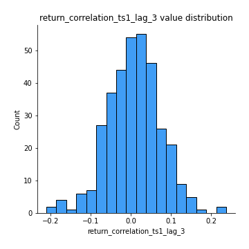
## Feature : return_correlation_ts2_lag_1
- **Feature type** : continous
- **Missing** : 0.0%
- **Unique** : 347
- **Count** :347.0
- **Mean** :0.0037173664527787777
- **Std** :0.07023005016804007
- **Min** :-0.22149838142392128
- **25%th Percentile** : -0.04709594213485904
- **50%th Percentile** : 0.0058175114240816995
- **75%th Percentile** : 0.053610611251038165
- **Max** :0.3425036902091001

## Feature : return_correlation_ts2_lag_2
- **Feature type** : continous
- **Missing** : 0.0%
- **Unique** : 347
- **Count** :347.0
- **Mean** :-0.005112270942968955
- **Std** :0.0647364294975481
- **Min** :-0.2757460186107768
- **25%th Percentile** : -0.04651815611180677
- **50%th Percentile** : -0.004602227106543136
- **75%th Percentile** : 0.03638100560967098
- **Max** :0.1668209648754713

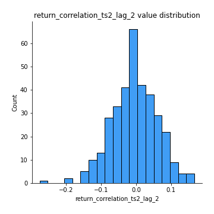
## Feature : return_correlation_ts2_lag_3
- **Feature type** : continous
- **Missing** : 0.0%
- **Unique** : 347
- **Count** :347.0
- **Mean** :0.011596315399450706
- **Std** :0.0633923636650126
- **Min** :-0.15510104688273624
- **25%th Percentile** : -0.030114680776876547
- **50%th Percentile** : 0.012279444405456417
- **75%th Percentile** : 0.05706713719932045
- **Max** :0.18227042221329348

## Feature : sqreturn_autocorrelation_ts1_lag1
- **Feature type** : continous
- **Missing** : 0.0%
- **Unique** : 347
- **Count** :347.0
- **Mean** :0.02891247800406114
- **Std** :0.08460113753006868
- **Min** :-0.13213067382109017
- **25%th Percentile** : -0.027867801652852277
- **50%th Percentile** : 0.009846516591876828
- **75%th Percentile** : 0.07217560410702738
- **Max** :0.4170324090514868

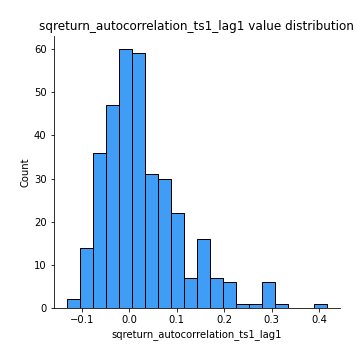
## Feature : sqreturn_autocorrelation_ts1_lag2
- **Feature type** : continous
- **Missing** : 0.0%
- **Unique** : 347
- **Count** :347.0
- **Mean** :0.020553764114566705
- **Std** :0.0719050273060629
- **Min** :-0.1339391759799061
- **25%th Percentile** : -0.029684912881922362
- **50%th Percentile** : 0.006527571743635394
- **75%th Percentile** : 0.06248067229401347
- **Max** :0.32836952056190194

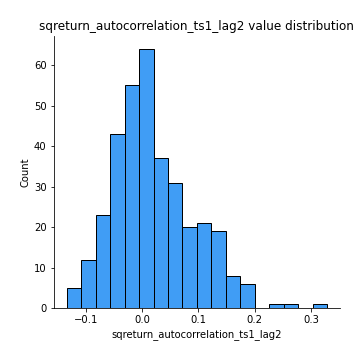
## Feature : sqreturn_autocorrelation_ts1_lag3
- **Feature type** : continous
- **Missing** : 0.0%
- **Unique** : 347
- **Count** :347.0
- **Mean** :0.011313555799635467
- **Std** :0.06394586733760786
- **Min** :-0.14689330450952304
- **25%th Percentile** : -0.03340419693628485
- **50%th Percentile** : 0.004515575850106304
- **75%th Percentile** : 0.04576728150264581
- **Max** :0.36579865351615615

## Feature : sqreturn_autocorrelation_ts2_lag1
- **Feature type** : continous
- **Missing** : 0.0%
- **Unique** : 347
- **Count** :347.0
- **Mean** :0.02315543630058228
- **Std** :0.07340650265800441
- **Min** :-0.10726600905236759
- **25%th Percentile** : -0.023767103408155077
- **50%th Percentile** : 0.002417225816683374
- **75%th Percentile** : 0.05690075964550581
- **Max** :0.36991568023038357

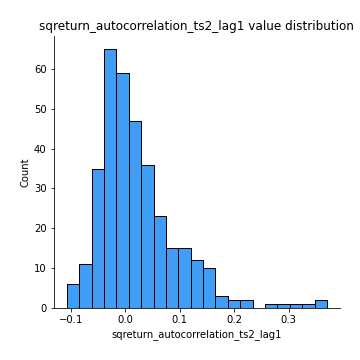
## Feature : sqreturn_autocorrelation_ts2_lag2
- **Feature type** : continous
- **Missing** : 0.0%
- **Unique** : 347
- **Count** :347.0
- **Mean** :0.016736652428806495
- **Std** :0.06458086046797612
- **Min** :-0.11652638011833547
- **25%th Percentile** : -0.02383684020208412
- **50%th Percentile** : -0.00041564880130934246
- **75%th Percentile** : 0.042366632436003776
- **Max** :0.31624975597469984

## Feature : sqreturn_autocorrelation_ts2_lag3
- **Feature type** : continous
- **Missing** : 0.0%
- **Unique** : 347
- **Count** :347.0
- **Mean** :0.009392516372100944
- **Std** :0.06567973083703345
- **Min** :-0.12679791295125745
- **25%th Percentile** : -0.02763216864759427
- **50%th Percentile** : -0.006663078070628759
- **75%th Percentile** : 0.027337506034558087
- **Max** :0.44321809070790563

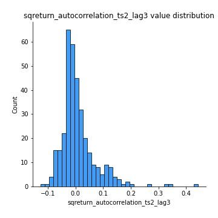
## Feature : sqreturn_correlation_ts1_lag_0
- **Feature type** : continous
- **Missing** : 0.0%
- **Unique** : 347
- **Count** :347.0
- **Mean** :0.3045190662599357
- **Std** :0.13688525338858534
- **Min** :-0.10256711281206837
- **25%th Percentile** : 0.22426331095728863
- **50%th Percentile** : 0.3015368220463343
- **75%th Percentile** : 0.3782878034003826
- **Max** :0.9937227277077512

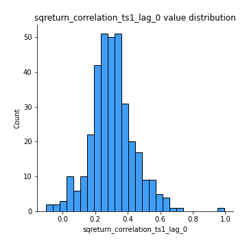
## Feature : sqreturn_correlation_ts1_lag_1
- **Feature type** : continous
- **Missing** : 0.0%
- **Unique** : 347
- **Count** :347.0
- **Mean** :0.00283636559858201
- **Std** :0.06356764654909079
- **Min** :-0.18856827637524448
- **25%th Percentile** : -0.04149612166874715
- **50%th Percentile** : 0.00370130214201527
- **75%th Percentile** : 0.04847538670294131
- **Max** :0.17058237783322017

## Feature : sqreturn_correlation_ts1_lag_2
- **Feature type** : continous
- **Missing** : 0.0%
- **Unique** : 347
- **Count** :347.0
- **Mean** :0.000455606617341251
- **Std** :0.06493853710062815
- **Min** :-0.16038742223567365
- **25%th Percentile** : -0.04377710025846665
- **50%th Percentile** : 0.002453647987604593
- **75%th Percentile** : 0.04777518539678531
- **Max** :0.17974071501626168

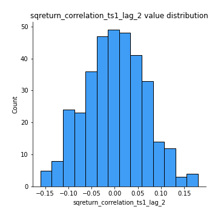
## Feature : sqreturn_correlation_ts1_lag_3
- **Feature type** : continous
- **Missing** : 0.0%
- **Unique** : 347
- **Count** :347.0
- **Mean** :0.008210578184422244
- **Std** :0.06666859937857714
- **Min** :-0.21147540839842804
- **25%th Percentile** : -0.036098779220534186
- **50%th Percentile** : 0.009461086276177762
- **75%th Percentile** : 0.05243049058106602
- **Max** :0.23808054096877584

## Feature : sqreturn_correlation_ts2_lag_1
- **Feature type** : continous
- **Missing** : 0.0%
- **Unique** : 347
- **Count** :347.0
- **Mean** :0.0037173664527787777
- **Std** :0.07023005016804007
- **Min** :-0.22149838142392128
- **25%th Percentile** : -0.04709594213485904
- **50%th Percentile** : 0.0058175114240816995
- **75%th Percentile** : 0.053610611251038165
- **Max** :0.3425036902091001

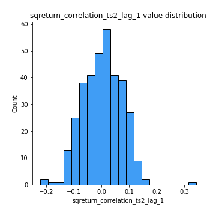
## Feature : sqreturn_correlation_ts2_lag_2
- **Feature type** : continous
- **Missing** : 0.0%
- **Unique** : 347
- **Count** :347.0
- **Mean** :-0.005112270942968955
- **Std** :0.0647364294975481
- **Min** :-0.2757460186107768
- **25%th Percentile** : -0.04651815611180677
- **50%th Percentile** : -0.004602227106543136
- **75%th Percentile** : 0.03638100560967098
- **Max** :0.1668209648754713

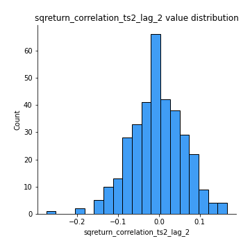
## Feature : sqreturn_correlation_ts2_lag_3
- **Feature type** : continous
- **Missing** : 0.0%
- **Unique** : 347
- **Count** :347.0
- **Mean** :0.011596315399450706
- **Std** :0.0633923636650126
- **Min** :-0.15510104688273624
- **25%th Percentile** : -0.030114680776876547
- **50%th Percentile** : 0.012279444405456417
- **75%th Percentile** : 0.05706713719932045
- **Max** :0.18227042221329348

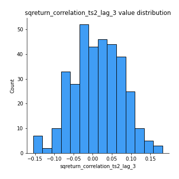
## Feature : price2_granger_cause_price1
- **Feature type** : continous
- **Missing** : 0.0%
- **Unique** : 347
- **Count** :347.0
- **Mean** :0.2959361103291688
- **Std** :0.29244680177548354
- **Min** :2.4312048970873696e-09
- **25%th Percentile** : 0.055114041041371555
- **50%th Percentile** : 0.18894320188890554
- **75%th Percentile** : 0.4875888743057972
- **Max** :0.9955787235191766

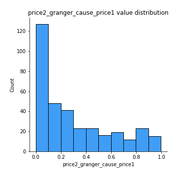
## Feature : price1_granger_cause_price2
- **Feature type** : continous
- **Missing** : 0.0%
- **Unique** : 347
- **Count** :347.0
- **Mean** :0.3654468236724342
- **Std** :0.31698539439212775
- **Min** :1.2012269232170316e-11
- **25%th Percentile** : 0.062296585723733006
- **50%th Percentile** : 0.29014290659786846
- **75%th Percentile** : 0.6678982600144814
- **Max** :0.9980023948567881

[<< Go back](../README.md)
