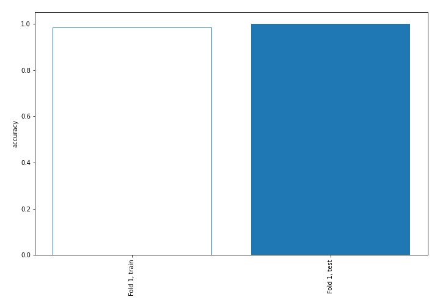
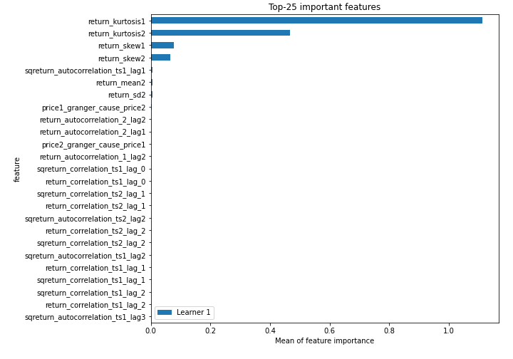
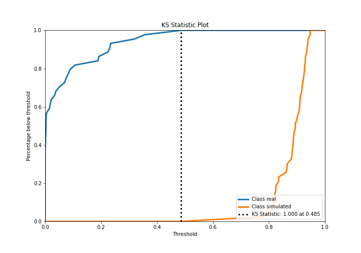
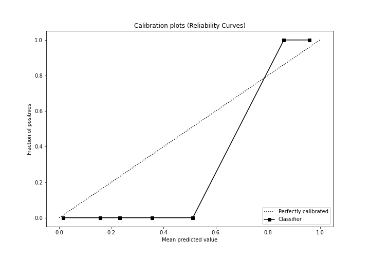
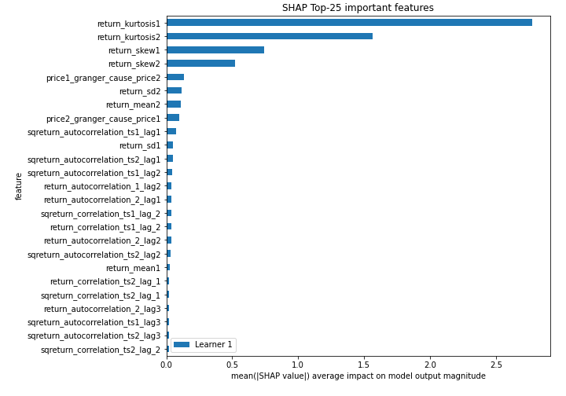
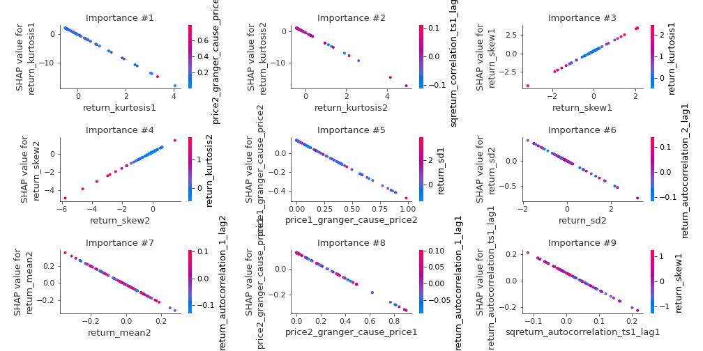
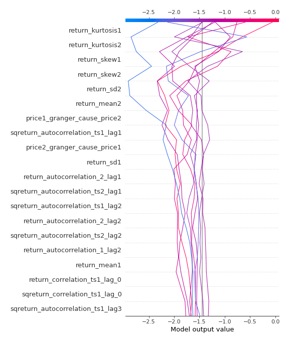
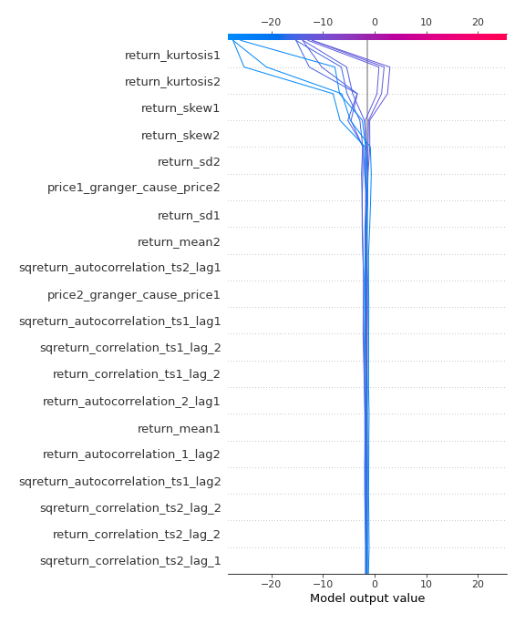
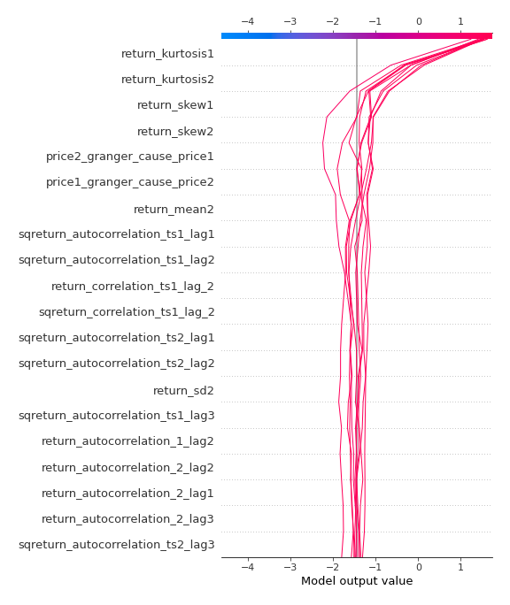
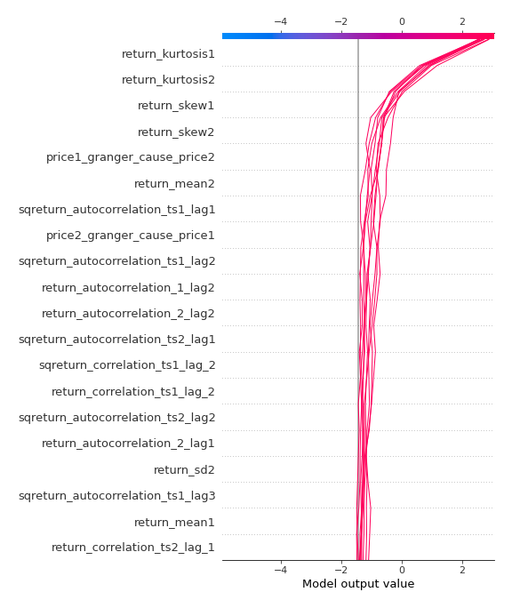

# Summary of 3_Linear

[<< Go back](../README.md)

## Logistic Regression (Linear)
- **n_jobs**: -1
- **explain_level**: 2

## Validation
 - **validation_type**: split
 - **train_ratio**: 0.75
 - **shuffle**: True
 - **stratify**: True

## Optimized metric
accuracy

## Training time

4.0 seconds

## Metric details
|           |     score |     threshold |
|:----------|----------:|--------------:|
| logloss   | 0.0982724 | nan           |
| auc       | 1         | nan           |
| f1        | 1         |   0.490882    |
| accuracy  | 1         |   0.490882    |
| precision | 1         |   0.913       |
| recall    | 1         |   1.09419e-12 |
| mcc       | 1         |   0.490882    |

## Confusion matrix (at threshold=0.490882)
|                      |   Predicted as real |   Predicted as simulated |
|:---------------------|--------------------:|-------------------------:|
| Labeled as real      |                  44 |                        0 |
| Labeled as simulated |                   0 |                       43 |

## Learning curves

## Coefficients
| feature                           |   Learner_1 |
|:----------------------------------|------------:|
| return_skew1                      |    1.48651  |
| return_skew2                      |    0.869802 |
| return_correlation_ts1_lag_2      |    0.702789 |
| sqreturn_correlation_ts1_lag_2    |    0.702789 |
| return_autocorrelation_2_lag1     |    0.6523   |
| return_autocorrelation_1_lag2     |    0.645964 |
| return_autocorrelation_2_lag2     |    0.634558 |
| return_autocorrelation_2_lag3     |    0.427667 |
| sqreturn_correlation_ts2_lag_1    |    0.393419 |
| return_correlation_ts2_lag_1      |    0.393419 |
| return_correlation_ts1_lag_1      |    0.391265 |
| sqreturn_correlation_ts1_lag_1    |    0.391265 |
| sqreturn_correlation_ts2_lag_2    |    0.340981 |
| return_correlation_ts2_lag_2      |    0.340981 |
| return_autocorrelation_1_lag1     |    0.325579 |
| sqreturn_correlation_ts2_lag_3    |    0.277511 |
| return_correlation_ts2_lag_3      |    0.277511 |
| sqreturn_correlation_ts1_lag_0    |    0.185053 |
| return_correlation_ts1_lag_0      |    0.185053 |
| sqreturn_correlation_ts1_lag_3    |    0.162121 |
| return_correlation_ts1_lag_3      |    0.162121 |
| return_autocorrelation_1_lag3     |    0.139436 |
| return_sd1                        |    0.062235 |
| return_sd2                        |   -0.231155 |
| return_mean1                      |   -0.3129   |
| sqreturn_autocorrelation_ts2_lag3 |   -0.395041 |
| price2_granger_cause_price1       |   -0.492456 |
| sqreturn_autocorrelation_ts1_lag3 |   -0.552776 |
| price1_granger_cause_price2       |   -0.6191   |
| sqreturn_autocorrelation_ts2_lag2 |   -0.674062 |
| sqreturn_autocorrelation_ts2_lag1 |   -0.84832  |
| sqreturn_autocorrelation_ts1_lag2 |   -0.874097 |
| return_mean2                      |   -1.08826  |
| sqreturn_autocorrelation_ts1_lag1 |   -1.30541  |
| intercept                         |   -1.47527  |
| return_kurtosis2                  |   -3.39083  |
| return_kurtosis1                  |   -4.4711   |

## Permutation-based Importance

## Confusion Matrix

## Normalized Confusion Matrix

## ROC Curve

## Kolmogorov-Smirnov Statistic

## Precision-Recall Curve

## Calibration Curve

## Cumulative Gains Curve

## Lift Curve

## SHAP Importance

## SHAP Dependence plots

### Dependence (Fold 1)

## SHAP Decision plots

### Top-10 Worst decisions for class 0 (Fold 1)

### Top-10 Best decisions for class 0 (Fold 1)

### Top-10 Worst decisions for class 1 (Fold 1)

### Top-10 Best decisions for class 1 (Fold 1)

[<< Go back](../README.md)
