# Exploratory Data Analysis

[<< Go back](../README.md)
## Feature : target
- **Feature type** : categorical
- **Missing** : 0.0%
- **Unique** : 2
- **Count** :347
- **Unique** :2
- **Top** :real
- **Freq** :175

## Feature : return_mean1
- **Feature type** : continous
- **Missing** : 0.0%
- **Unique** : 347
- **Count** :347.0
- **Mean** :0.018629207930649976
- **Std** :0.11433368985766022
- **Min** :-0.30774228294893496
- **25%th Percentile** : -0.05602533883782454
- **50%th Percentile** : 0.029096088549507827
- **75%th Percentile** : 0.1079305639180917
- **Max** :0.3602793017097547

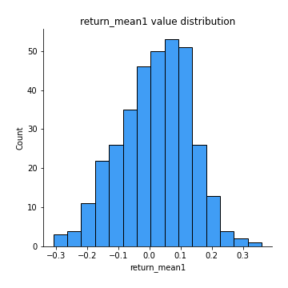
## Feature : return_mean2
- **Feature type** : continous
- **Missing** : 0.0%
- **Unique** : 347
- **Count** :347.0
- **Mean** :-0.020913259773939045
- **Std** :0.1372537442301397
- **Min** :-0.6078091094855004
- **25%th Percentile** : -0.10292841001354534
- **50%th Percentile** : -0.018727047061443614
- **75%th Percentile** : 0.06453234122591017
- **Max** :0.6801605239983173

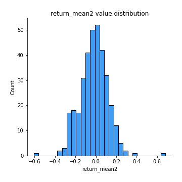
## Feature : return_sd1
- **Feature type** : continous
- **Missing** : 0.0%
- **Unique** : 347
- **Count** :347.0
- **Mean** :1.627609826012373
- **Std** :0.3588502286989644
- **Min** :0.8102430347636637
- **25%th Percentile** : 1.4901950492108331
- **50%th Percentile** : 1.6082624834483998
- **75%th Percentile** : 1.6952307732806147
- **Max** :3.332494027875222

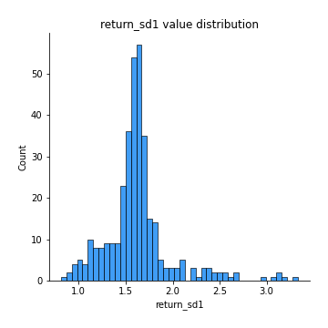
## Feature : return_sd2
- **Feature type** : continous
- **Missing** : 0.0%
- **Unique** : 347
- **Count** :347.0
- **Mean** :1.6752089535193617
- **Std** :0.414795384750895
- **Min** :0.8198779632289204
- **25%th Percentile** : 1.5157388033237589
- **50%th Percentile** : 1.6224894885284242
- **75%th Percentile** : 1.7249808840369392
- **Max** :4.59233049161685

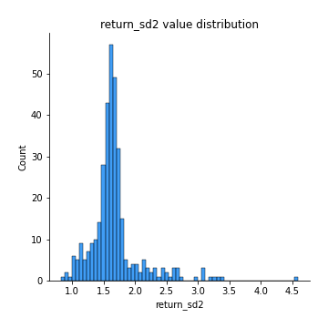
## Feature : return_skew1
- **Feature type** : continous
- **Missing** : 0.0%
- **Unique** : 347
- **Count** :347.0
- **Mean** :-0.19095259820029709
- **Std** :0.7234057538195259
- **Min** :-4.239645236578449
- **25%th Percentile** : -0.352816766880169
- **50%th Percentile** : -0.09498974995714267
- **75%th Percentile** : 0.08818291143135314
- **Max** :2.3044235031125564

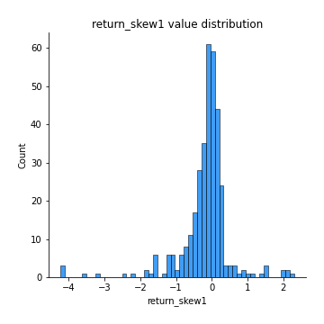
## Feature : return_skew2
- **Feature type** : continous
- **Missing** : 0.0%
- **Unique** : 347
- **Count** :347.0
- **Mean** :-0.3078227485103558
- **Std** :1.0536481014890704
- **Min** :-7.3762354994385335
- **25%th Percentile** : -0.3664005415594431
- **50%th Percentile** : -0.08261916224878264
- **75%th Percentile** : 0.0848013266494906
- **Max** :4.0310261345618

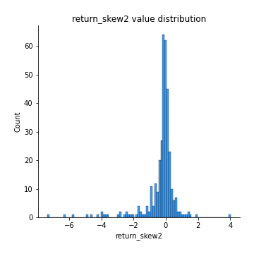
## Feature : return_kurtosis1
- **Feature type** : continous
- **Missing** : 0.0%
- **Unique** : 347
- **Count** :347.0
- **Mean** :2.675481606670408
- **Std** :5.603421985907022
- **Min** :-0.6274709892262647
- **25%th Percentile** : -0.05923056990387887
- **50%th Percentile** : 0.6141091541115098
- **75%th Percentile** : 2.627323675085121
- **Max** :40.485294874464934

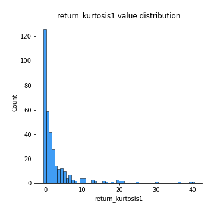
## Feature : return_kurtosis2
- **Feature type** : continous
- **Missing** : 0.0%
- **Unique** : 347
- **Count** :347.0
- **Mean** :4.0457116702553435
- **Std** :9.968033163555663
- **Min** :-0.5858704263276309
- **25%th Percentile** : -0.023011163194438966
- **50%th Percentile** : 0.7222163742898466
- **75%th Percentile** : 3.3434029241276617
- **Max** :94.01659180149953

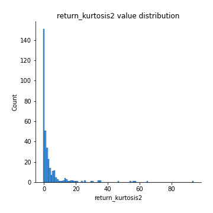
## Feature : return_autocorrelation_1_lag1
- **Feature type** : continous
- **Missing** : 0.0%
- **Unique** : 347
- **Count** :347.0
- **Mean** :0.005310605034851844
- **Std** :0.06672507333071913
- **Min** :-0.2110198016529991
- **25%th Percentile** : -0.04380018856888828
- **50%th Percentile** : 0.006369792626959657
- **75%th Percentile** : 0.05063712416603999
- **Max** :0.20405729644350115

## Feature : return_autocorrelation_1_lag2
- **Feature type** : continous
- **Missing** : 0.0%
- **Unique** : 347
- **Count** :347.0
- **Mean** :0.002883675992450757
- **Std** :0.07093541654057638
- **Min** :-0.18815240041143846
- **25%th Percentile** : -0.04600633920992596
- **50%th Percentile** : 0.0018011900375725584
- **75%th Percentile** : 0.054839827929363844
- **Max** :0.21123611097039302

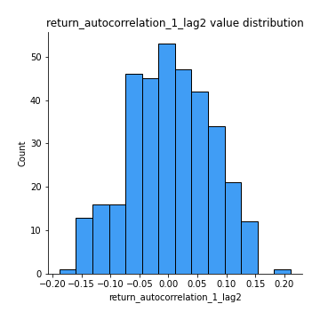
## Feature : return_autocorrelation_1_lag3
- **Feature type** : continous
- **Missing** : 0.0%
- **Unique** : 347
- **Count** :347.0
- **Mean** :0.01885608920274314
- **Std** :0.0621462446715267
- **Min** :-0.1817944619132489
- **25%th Percentile** : -0.019671289920466427
- **50%th Percentile** : 0.020127392480471594
- **75%th Percentile** : 0.06065975124256355
- **Max** :0.17514033413395239

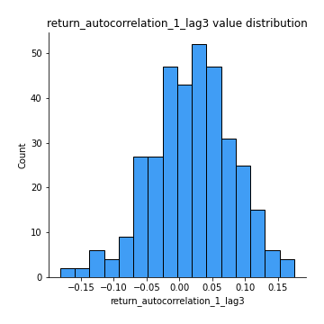
## Feature : return_autocorrelation_2_lag1
- **Feature type** : continous
- **Missing** : 0.0%
- **Unique** : 347
- **Count** :347.0
- **Mean** :0.02294006181447537
- **Std** :0.07155063304416628
- **Min** :-0.17778763204400128
- **25%th Percentile** : -0.020625200301039627
- **50%th Percentile** : 0.02152842603634329
- **75%th Percentile** : 0.06831672915656295
- **Max** :0.2555642697593065

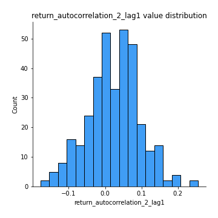
## Feature : return_autocorrelation_2_lag2
- **Feature type** : continous
- **Missing** : 0.0%
- **Unique** : 347
- **Count** :347.0
- **Mean** :0.016839625661290752
- **Std** :0.07207466308179554
- **Min** :-0.1758721664122366
- **25%th Percentile** : -0.030235492447144154
- **50%th Percentile** : 0.01896728543580521
- **75%th Percentile** : 0.0640887744301484
- **Max** :0.21689983834548407

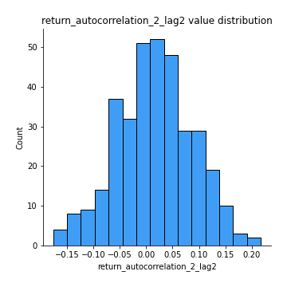
## Feature : return_autocorrelation_2_lag3
- **Feature type** : continous
- **Missing** : 0.0%
- **Unique** : 347
- **Count** :347.0
- **Mean** :0.03129391673764317
- **Std** :0.06627827333347097
- **Min** :-0.1798960840760737
- **25%th Percentile** : -0.013827755763026812
- **50%th Percentile** : 0.032247895274046104
- **75%th Percentile** : 0.07500508610499762
- **Max** :0.20205753622966244

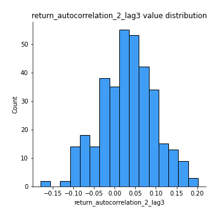
## Feature : return_correlation_ts1_lag_0
- **Feature type** : continous
- **Missing** : 0.0%
- **Unique** : 347
- **Count** :347.0
- **Mean** :0.360214727474339
- **Std** :0.1320583626993059
- **Min** :-0.10256711281206837
- **25%th Percentile** : 0.31404221525827813
- **50%th Percentile** : 0.3874310224725625
- **75%th Percentile** : 0.4360492385625926
- **Max** :0.7227330027882508

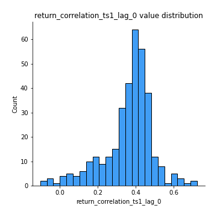
## Feature : return_correlation_ts1_lag_1
- **Feature type** : continous
- **Missing** : 0.0%
- **Unique** : 347
- **Count** :347.0
- **Mean** :0.016783928977330463
- **Std** :0.06592638127927078
- **Min** :-0.1724608565031132
- **25%th Percentile** : -0.0318104188033382
- **50%th Percentile** : 0.01898179798984352
- **75%th Percentile** : 0.06092780415943136
- **Max** :0.1790838298060095

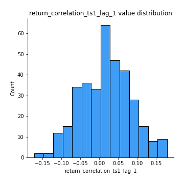
## Feature : return_correlation_ts1_lag_2
- **Feature type** : continous
- **Missing** : 0.0%
- **Unique** : 347
- **Count** :347.0
- **Mean** :0.013355393869705022
- **Std** :0.06727713143453416
- **Min** :-0.172871336111873
- **25%th Percentile** : -0.028354485262389047
- **50%th Percentile** : 0.013707752818826668
- **75%th Percentile** : 0.057659137498008585
- **Max** :0.20095602661305567

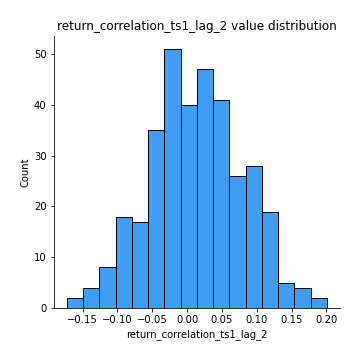
## Feature : return_correlation_ts1_lag_3
- **Feature type** : continous
- **Missing** : 0.0%
- **Unique** : 347
- **Count** :347.0
- **Mean** :0.01986800746123312
- **Std** :0.06668831643731427
- **Min** :-0.21147540839842804
- **25%th Percentile** : -0.02167251863829167
- **50%th Percentile** : 0.019607740511766173
- **75%th Percentile** : 0.06205006671895252
- **Max** :0.23808054096877584

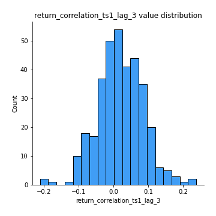
## Feature : return_correlation_ts2_lag_1
- **Feature type** : continous
- **Missing** : 0.0%
- **Unique** : 347
- **Count** :347.0
- **Mean** :0.022274366662161045
- **Std** :0.07250177146995392
- **Min** :-0.17665751184419612
- **25%th Percentile** : -0.022452327913848547
- **50%th Percentile** : 0.02325702112778539
- **75%th Percentile** : 0.07214565540099245
- **Max** :0.3425036902091001

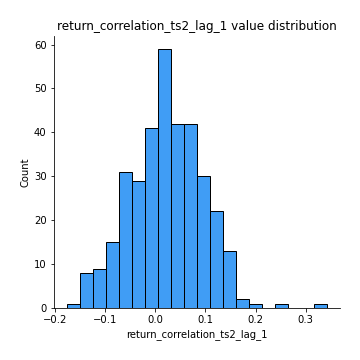
## Feature : return_correlation_ts2_lag_2
- **Feature type** : continous
- **Missing** : 0.0%
- **Unique** : 347
- **Count** :347.0
- **Mean** :0.014652134887474964
- **Std** :0.069261939860314
- **Min** :-0.2757460186107768
- **25%th Percentile** : -0.02958115285405127
- **50%th Percentile** : 0.012477516322535694
- **75%th Percentile** : 0.06512046765124695
- **Max** :0.1701476148490614

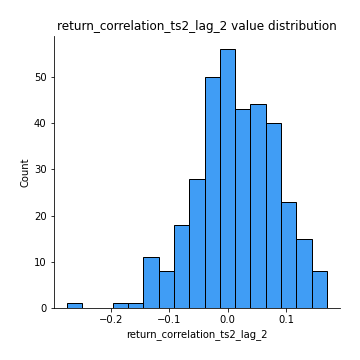
## Feature : return_correlation_ts2_lag_3
- **Feature type** : continous
- **Missing** : 0.0%
- **Unique** : 347
- **Count** :347.0
- **Mean** :0.0259585025610775
- **Std** :0.059927029377411234
- **Min** :-0.10370067350353492
- **25%th Percentile** : -0.01815340452779322
- **50%th Percentile** : 0.02385827084212189
- **75%th Percentile** : 0.06996436508978854
- **Max** :0.20536991855655237

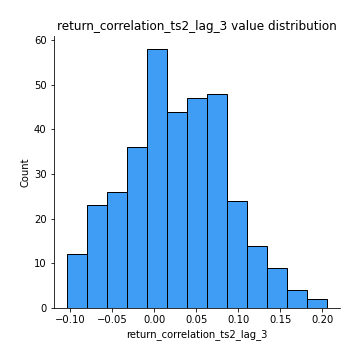
## Feature : sqreturn_autocorrelation_ts1_lag1
- **Feature type** : continous
- **Missing** : 0.0%
- **Unique** : 347
- **Count** :347.0
- **Mean** :0.03026513011382469
- **Std** :0.08176233787010653
- **Min** :-0.12461943059922934
- **25%th Percentile** : -0.02403677302332439
- **50%th Percentile** : 0.013870383746119963
- **75%th Percentile** : 0.07676447574482034
- **Max** :0.4170324090514868

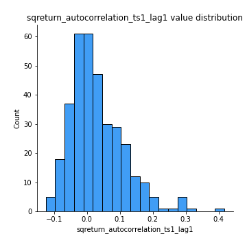
## Feature : sqreturn_autocorrelation_ts1_lag2
- **Feature type** : continous
- **Missing** : 0.0%
- **Unique** : 347
- **Count** :347.0
- **Mean** :0.020269073018713255
- **Std** :0.07041770550545837
- **Min** :-0.1301533202576969
- **25%th Percentile** : -0.027268352285127816
- **50%th Percentile** : 0.009132730083297756
- **75%th Percentile** : 0.058728678259682254
- **Max** :0.29415594530501293

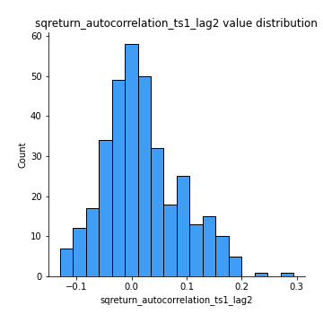
## Feature : sqreturn_autocorrelation_ts1_lag3
- **Feature type** : continous
- **Missing** : 0.0%
- **Unique** : 347
- **Count** :347.0
- **Mean** :0.0073923795245111786
- **Std** :0.0649480902865314
- **Min** :-0.14675425747725615
- **25%th Percentile** : -0.03875679455602539
- **50%th Percentile** : 0.0005228548064014982
- **75%th Percentile** : 0.03932281238259269
- **Max** :0.36579865351615615

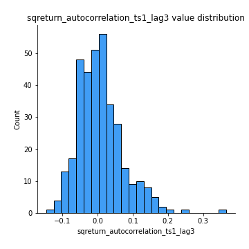
## Feature : sqreturn_autocorrelation_ts2_lag1
- **Feature type** : continous
- **Missing** : 0.0%
- **Unique** : 347
- **Count** :347.0
- **Mean** :0.029095577351002176
- **Std** :0.07480419524794
- **Min** :-0.14626942472307652
- **25%th Percentile** : -0.019894194141935613
- **50%th Percentile** : 0.01837790565286883
- **75%th Percentile** : 0.06521477760036254
- **Max** :0.3533869018400006

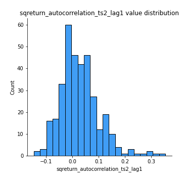
## Feature : sqreturn_autocorrelation_ts2_lag2
- **Feature type** : continous
- **Missing** : 0.0%
- **Unique** : 347
- **Count** :347.0
- **Mean** :0.01276474474474441
- **Std** :0.059755417060347385
- **Min** :-0.15909403632926203
- **25%th Percentile** : -0.0211103047910582
- **50%th Percentile** : 0.004598298149683561
- **75%th Percentile** : 0.049952520110701434
- **Max** :0.2357173664732939

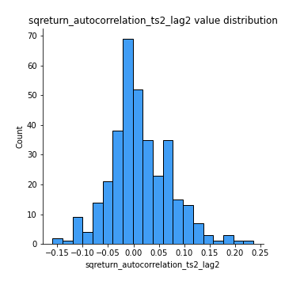
## Feature : sqreturn_autocorrelation_ts2_lag3
- **Feature type** : continous
- **Missing** : 0.0%
- **Unique** : 347
- **Count** :347.0
- **Mean** :0.011858464370293326
- **Std** :0.06404233056149868
- **Min** :-0.13425422968126885
- **25%th Percentile** : -0.031091964514325034
- **50%th Percentile** : -0.0012876717818051026
- **75%th Percentile** : 0.04581352154074927
- **Max** :0.3463122340368414

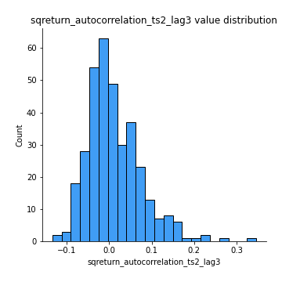
## Feature : sqreturn_correlation_ts1_lag_0
- **Feature type** : continous
- **Missing** : 0.0%
- **Unique** : 347
- **Count** :347.0
- **Mean** :0.360214727474339
- **Std** :0.1320583626993059
- **Min** :-0.10256711281206837
- **25%th Percentile** : 0.31404221525827813
- **50%th Percentile** : 0.3874310224725625
- **75%th Percentile** : 0.4360492385625926
- **Max** :0.7227330027882508

## Feature : sqreturn_correlation_ts1_lag_1
- **Feature type** : continous
- **Missing** : 0.0%
- **Unique** : 347
- **Count** :347.0
- **Mean** :0.016783928977330463
- **Std** :0.06592638127927078
- **Min** :-0.1724608565031132
- **25%th Percentile** : -0.0318104188033382
- **50%th Percentile** : 0.01898179798984352
- **75%th Percentile** : 0.06092780415943136
- **Max** :0.1790838298060095

## Feature : sqreturn_correlation_ts1_lag_2
- **Feature type** : continous
- **Missing** : 0.0%
- **Unique** : 347
- **Count** :347.0
- **Mean** :0.013355393869705022
- **Std** :0.06727713143453416
- **Min** :-0.172871336111873
- **25%th Percentile** : -0.028354485262389047
- **50%th Percentile** : 0.013707752818826668
- **75%th Percentile** : 0.057659137498008585
- **Max** :0.20095602661305567

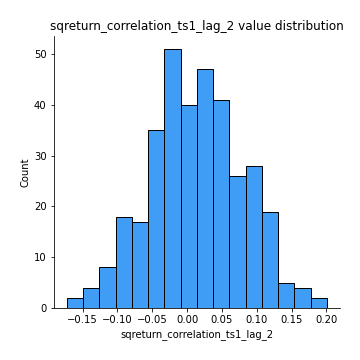
## Feature : sqreturn_correlation_ts1_lag_3
- **Feature type** : continous
- **Missing** : 0.0%
- **Unique** : 347
- **Count** :347.0
- **Mean** :0.01986800746123312
- **Std** :0.06668831643731427
- **Min** :-0.21147540839842804
- **25%th Percentile** : -0.02167251863829167
- **50%th Percentile** : 0.019607740511766173
- **75%th Percentile** : 0.06205006671895252
- **Max** :0.23808054096877584

## Feature : sqreturn_correlation_ts2_lag_1
- **Feature type** : continous
- **Missing** : 0.0%
- **Unique** : 347
- **Count** :347.0
- **Mean** :0.022274366662161045
- **Std** :0.07250177146995392
- **Min** :-0.17665751184419612
- **25%th Percentile** : -0.022452327913848547
- **50%th Percentile** : 0.02325702112778539
- **75%th Percentile** : 0.07214565540099245
- **Max** :0.3425036902091001

## Feature : sqreturn_correlation_ts2_lag_2
- **Feature type** : continous
- **Missing** : 0.0%
- **Unique** : 347
- **Count** :347.0
- **Mean** :0.014652134887474964
- **Std** :0.069261939860314
- **Min** :-0.2757460186107768
- **25%th Percentile** : -0.02958115285405127
- **50%th Percentile** : 0.012477516322535694
- **75%th Percentile** : 0.06512046765124695
- **Max** :0.1701476148490614

## Feature : sqreturn_correlation_ts2_lag_3
- **Feature type** : continous
- **Missing** : 0.0%
- **Unique** : 347
- **Count** :347.0
- **Mean** :0.0259585025610775
- **Std** :0.059927029377411234
- **Min** :-0.10370067350353492
- **25%th Percentile** : -0.01815340452779322
- **50%th Percentile** : 0.02385827084212189
- **75%th Percentile** : 0.06996436508978854
- **Max** :0.20536991855655237

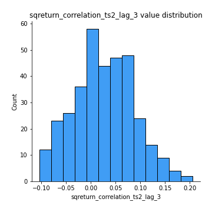
## Feature : price2_granger_cause_price1
- **Feature type** : continous
- **Missing** : 0.0%
- **Unique** : 347
- **Count** :347.0
- **Mean** :0.24188045437575412
- **Std** :0.28175283974331544
- **Min** :2.4312048970873696e-09
- **25%th Percentile** : 0.011359208644000883
- **50%th Percentile** : 0.11710843597237705
- **75%th Percentile** : 0.39500409591268215
- **Max** :0.990210150463267

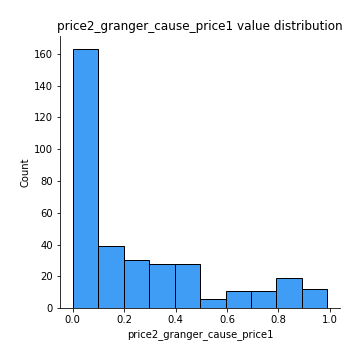
## Feature : price1_granger_cause_price2
- **Feature type** : continous
- **Missing** : 0.0%
- **Unique** : 347
- **Count** :347.0
- **Mean** :0.2288662976938502
- **Std** :0.27277585603181564
- **Min** :1.2012269232170316e-11
- **25%th Percentile** : 0.009662809445572209
- **50%th Percentile** : 0.10470340240092488
- **75%th Percentile** : 0.3769227660979916
- **Max** :0.9900903574940726

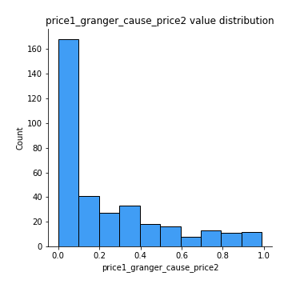

[<< Go back](../README.md)
