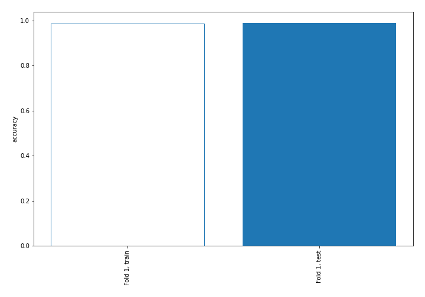
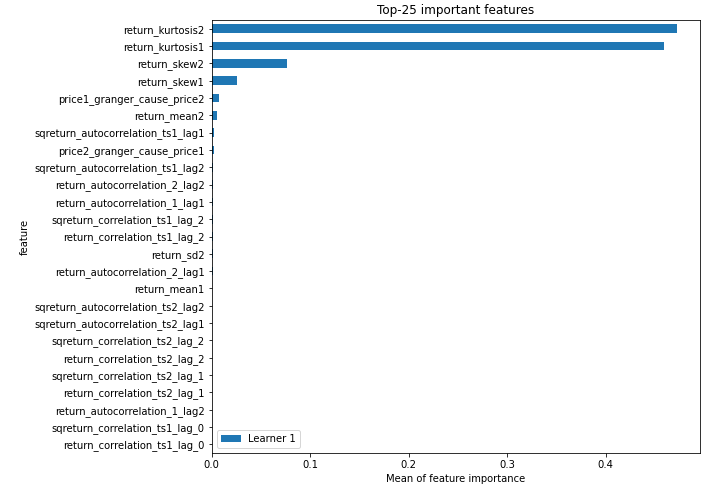
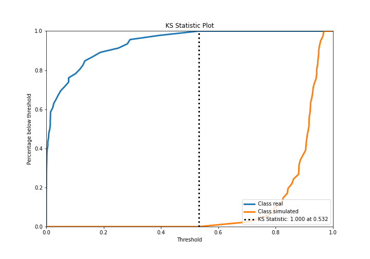
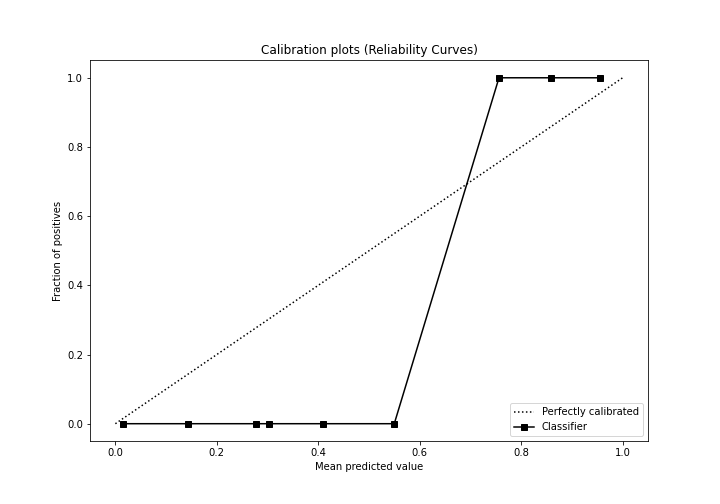
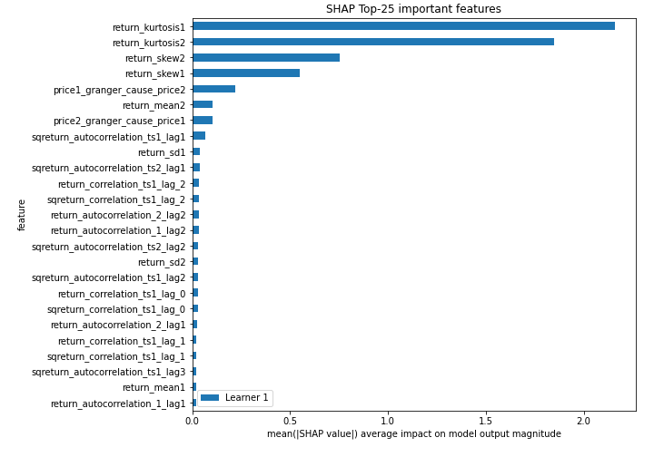
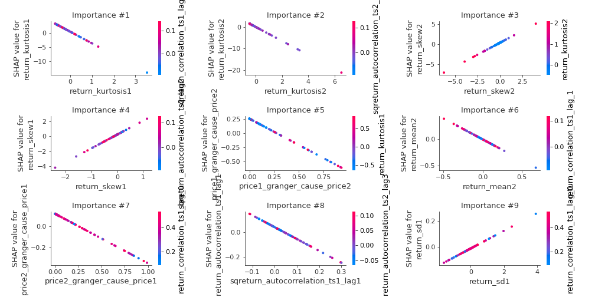
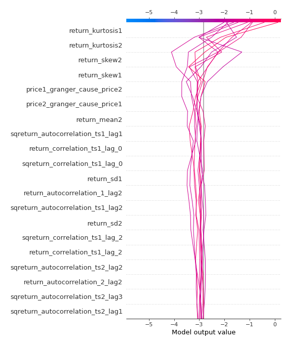
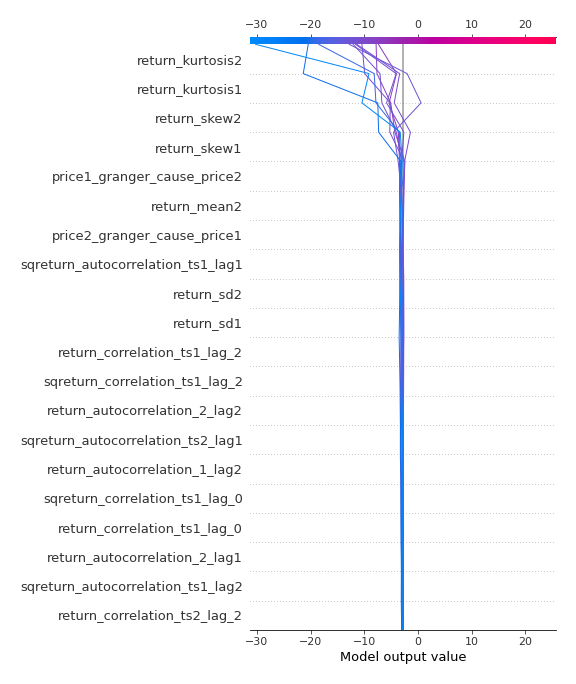
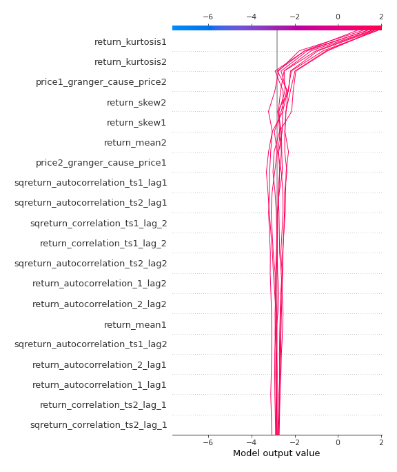
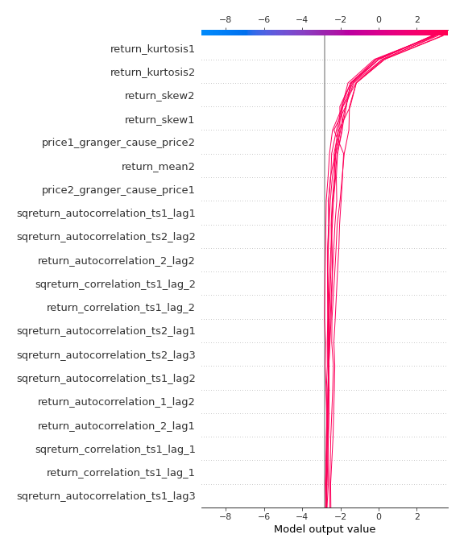

# Summary of 3_Linear

[<< Go back](../README.md)

## Logistic Regression (Linear)
- **n_jobs**: -1
- **explain_level**: 2

## Validation
 - **validation_type**: split
 - **train_ratio**: 0.75
 - **shuffle**: True
 - **stratify**: True

## Optimized metric
accuracy

## Training time

4.1 seconds

## Metric details
|           |     score |     threshold |
|:----------|----------:|--------------:|
| logloss   | 0.0944358 | nan           |
| auc       | 1         | nan           |
| f1        | 1         |   0.56815     |
| accuracy  | 1         |   0.56815     |
| precision | 1         |   0.709125    |
| recall    | 1         |   6.58868e-14 |
| mcc       | 1         |   0.56815     |

## Confusion matrix (at threshold=0.56815)
|                      |   Predicted as real |   Predicted as simulated |
|:---------------------|--------------------:|-------------------------:|
| Labeled as real      |                  46 |                        0 |
| Labeled as simulated |                   0 |                       41 |

## Learning curves

## Coefficients
| feature                           |   Learner_1 |
|:----------------------------------|------------:|
| return_skew1                      |   1.83271   |
| return_skew2                      |   1.19044   |
| return_autocorrelation_2_lag2     |   0.63634   |
| return_correlation_ts1_lag_2      |   0.626047  |
| sqreturn_correlation_ts1_lag_2    |   0.626047  |
| return_autocorrelation_1_lag2     |   0.607094  |
| return_correlation_ts1_lag_1      |   0.439918  |
| sqreturn_correlation_ts1_lag_1    |   0.439918  |
| return_autocorrelation_2_lag1     |   0.40166   |
| sqreturn_correlation_ts2_lag_2    |   0.367464  |
| return_correlation_ts2_lag_2      |   0.367464  |
| return_autocorrelation_1_lag1     |   0.357035  |
| return_autocorrelation_1_lag3     |   0.331661  |
| return_correlation_ts2_lag_1      |   0.303223  |
| sqreturn_correlation_ts2_lag_1    |   0.303223  |
| return_autocorrelation_2_lag3     |   0.296411  |
| sqreturn_correlation_ts1_lag_0    |   0.269325  |
| return_correlation_ts1_lag_0      |   0.269325  |
| return_correlation_ts1_lag_3      |   0.22841   |
| sqreturn_correlation_ts1_lag_3    |   0.22841   |
| sqreturn_correlation_ts2_lag_3    |   0.145614  |
| return_correlation_ts2_lag_3      |   0.145614  |
| return_sd1                        |   0.0678969 |
| return_sd2                        |  -0.0429578 |
| return_mean1                      |  -0.192888  |
| sqreturn_autocorrelation_ts1_lag3 |  -0.392525  |
| sqreturn_autocorrelation_ts2_lag3 |  -0.441144  |
| price2_granger_cause_price1       |  -0.463155  |
| sqreturn_autocorrelation_ts1_lag2 |  -0.520505  |
| sqreturn_autocorrelation_ts2_lag2 |  -0.619042  |
| sqreturn_autocorrelation_ts2_lag1 |  -0.63064   |
| return_mean2                      |  -0.786223  |
| price1_granger_cause_price2       |  -0.919013  |
| sqreturn_autocorrelation_ts1_lag1 |  -0.961447  |
| intercept                         |  -1.73928   |
| return_kurtosis2                  |  -3.22333   |
| return_kurtosis1                  |  -4.07412   |

## Permutation-based Importance

## Confusion Matrix

## Normalized Confusion Matrix

## ROC Curve

## Kolmogorov-Smirnov Statistic

## Precision-Recall Curve

## Calibration Curve

## Cumulative Gains Curve

## Lift Curve

## SHAP Importance

## SHAP Dependence plots

### Dependence (Fold 1)

## SHAP Decision plots

### Top-10 Worst decisions for class 0 (Fold 1)

### Top-10 Best decisions for class 0 (Fold 1)

### Top-10 Worst decisions for class 1 (Fold 1)

### Top-10 Best decisions for class 1 (Fold 1)

[<< Go back](../README.md)
