# Exploratory Data Analysis

[<< Go back](../README.md)
## Feature : target
- **Feature type** : categorical
- **Missing** : 0.0%
- **Unique** : 2
- **Count** :347
- **Unique** :2
- **Top** :real
- **Freq** :183

## Feature : return_mean1
- **Feature type** : continous
- **Missing** : 0.0%
- **Unique** : 347
- **Count** :347.0
- **Mean** :0.017721975530331092
- **Std** :0.12405807704542379
- **Min** :-0.45362669408163403
- **25%th Percentile** : -0.07229215900222015
- **50%th Percentile** : 0.030269106478718538
- **75%th Percentile** : 0.11606110197978037
- **Max** :0.3602793017097547

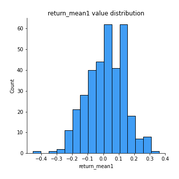
## Feature : return_mean2
- **Feature type** : continous
- **Missing** : 0.0%
- **Unique** : 347
- **Count** :347.0
- **Mean** :-0.015027575267505262
- **Std** :0.14433082414817897
- **Min** :-0.6219855467958758
- **25%th Percentile** : -0.10061365223956106
- **50%th Percentile** : -0.007724650121237642
- **75%th Percentile** : 0.08684790956314963
- **Max** :0.6801605239983173

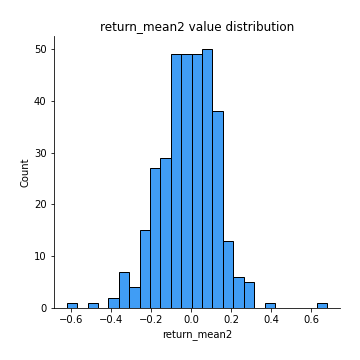
## Feature : return_sd1
- **Feature type** : continous
- **Missing** : 0.0%
- **Unique** : 347
- **Count** :347.0
- **Mean** :1.630148253278556
- **Std** :0.36040048365928223
- **Min** :0.8733078831717243
- **25%th Percentile** : 1.4942195452533604
- **50%th Percentile** : 1.6093564622215155
- **75%th Percentile** : 1.687820133344061
- **Max** :3.332494027875222

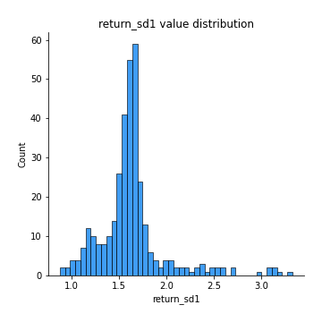
## Feature : return_sd2
- **Feature type** : continous
- **Missing** : 0.0%
- **Unique** : 347
- **Count** :347.0
- **Mean** :1.6792617958338407
- **Std** :0.4301776237429507
- **Min** :0.8198779632289204
- **25%th Percentile** : 1.506418554912485
- **50%th Percentile** : 1.6263139486409852
- **75%th Percentile** : 1.7336656800738433
- **Max** :4.59233049161685

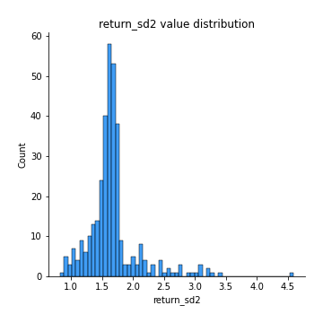
## Feature : return_skew1
- **Feature type** : continous
- **Missing** : 0.0%
- **Unique** : 347
- **Count** :347.0
- **Mean** :-0.11777334896741128
- **Std** :0.5737978686625379
- **Min** :-2.5068500114696386
- **25%th Percentile** : -0.32636362418518394
- **50%th Percentile** : -0.06756809353504063
- **75%th Percentile** : 0.09994382092125441
- **Max** :2.351757728252051

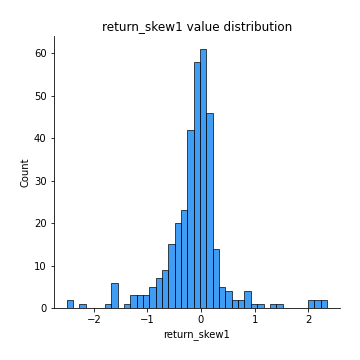
## Feature : return_skew2
- **Feature type** : continous
- **Missing** : 0.0%
- **Unique** : 347
- **Count** :347.0
- **Mean** :-0.2753588870723178
- **Std** :1.0275595794209378
- **Min** :-7.3762354994385335
- **25%th Percentile** : -0.39532210765236386
- **50%th Percentile** : -0.06679258946993746
- **75%th Percentile** : 0.08978150770893051
- **Max** :4.1920266082732045

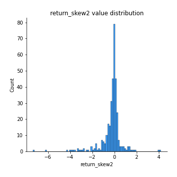
## Feature : return_kurtosis1
- **Feature type** : continous
- **Missing** : 0.0%
- **Unique** : 347
- **Count** :347.0
- **Mean** :2.290786538402298
- **Std** :4.06165971473195
- **Min** :-0.6532541645793417
- **25%th Percentile** : -0.011561184637868482
- **50%th Percentile** : 0.7727247604808016
- **75%th Percentile** : 2.624353558208778
- **Max** :23.612665658846073

## Feature : return_kurtosis2
- **Feature type** : continous
- **Missing** : 0.0%
- **Unique** : 347
- **Count** :347.0
- **Mean** :4.221728580182543
- **Std** :9.434579621533418
- **Min** :-0.5662451059591009
- **25%th Percentile** : -0.04422656675893033
- **50%th Percentile** : 0.9966328054964189
- **75%th Percentile** : 3.6557789302663313
- **Max** :94.01659180149953

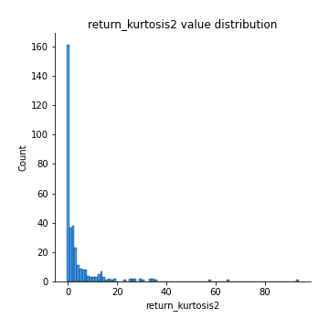
## Feature : return_autocorrelation_1_lag1
- **Feature type** : continous
- **Missing** : 0.0%
- **Unique** : 347
- **Count** :347.0
- **Mean** :0.001835122180403947
- **Std** :0.06833991479526473
- **Min** :-0.2110198016529991
- **25%th Percentile** : -0.049078540272619604
- **50%th Percentile** : -0.00021878741601358826
- **75%th Percentile** : 0.045957800210662036
- **Max** :0.20132571463207988

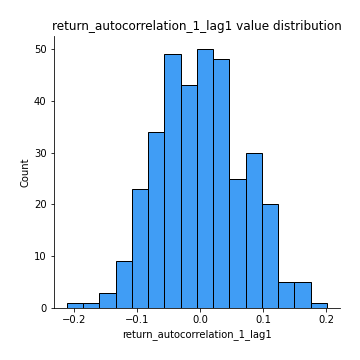
## Feature : return_autocorrelation_1_lag2
- **Feature type** : continous
- **Missing** : 0.0%
- **Unique** : 347
- **Count** :347.0
- **Mean** :0.005994528652722834
- **Std** :0.07037522993118162
- **Min** :-0.18815240041143846
- **25%th Percentile** : -0.04454075461858752
- **50%th Percentile** : 0.006418404159945965
- **75%th Percentile** : 0.05459601433801376
- **Max** :0.21710095092819143

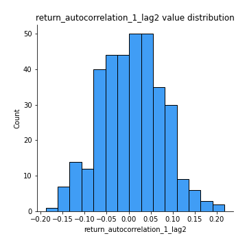
## Feature : return_autocorrelation_1_lag3
- **Feature type** : continous
- **Missing** : 0.0%
- **Unique** : 347
- **Count** :347.0
- **Mean** :0.021081404564056144
- **Std** :0.06419945415173912
- **Min** :-0.1817944619132489
- **25%th Percentile** : -0.015753567039243483
- **50%th Percentile** : 0.021433490961958294
- **75%th Percentile** : 0.06130875421628394
- **Max** :0.22258107254975115

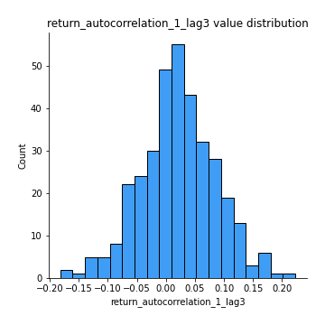
## Feature : return_autocorrelation_2_lag1
- **Feature type** : continous
- **Missing** : 0.0%
- **Unique** : 347
- **Count** :347.0
- **Mean** :0.025503237048501493
- **Std** :0.07296337293291448
- **Min** :-0.17778763204400128
- **25%th Percentile** : -0.018783079594587818
- **50%th Percentile** : 0.020655711595219572
- **75%th Percentile** : 0.07608839540226284
- **Max** :0.26373995452557614

## Feature : return_autocorrelation_2_lag2
- **Feature type** : continous
- **Missing** : 0.0%
- **Unique** : 347
- **Count** :347.0
- **Mean** :0.01707334416477335
- **Std** :0.07121208205064909
- **Min** :-0.16605020590117126
- **25%th Percentile** : -0.029770494183871312
- **50%th Percentile** : 0.01817211232170036
- **75%th Percentile** : 0.07092993475021901
- **Max** :0.19876193886119678

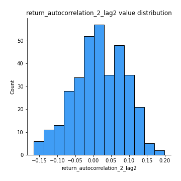
## Feature : return_autocorrelation_2_lag3
- **Feature type** : continous
- **Missing** : 0.0%
- **Unique** : 347
- **Count** :347.0
- **Mean** :0.030744424255208905
- **Std** :0.06629587202849409
- **Min** :-0.1794902936808312
- **25%th Percentile** : -0.013919858591201078
- **50%th Percentile** : 0.03051623167400474
- **75%th Percentile** : 0.07264493310519607
- **Max** :0.21544272032161468

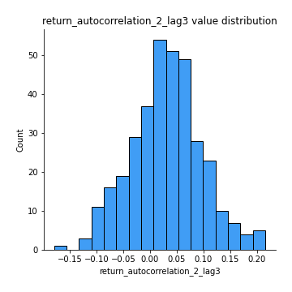
## Feature : return_correlation_ts1_lag_0
- **Feature type** : continous
- **Missing** : 0.0%
- **Unique** : 347
- **Count** :347.0
- **Mean** :0.3710093384214537
- **Std** :0.13786573744285452
- **Min** :-0.10256711281206837
- **25%th Percentile** : 0.32376709451005636
- **50%th Percentile** : 0.40172530877666884
- **75%th Percentile** : 0.4491542652697551
- **Max** :0.9937227277077512

## Feature : return_correlation_ts1_lag_1
- **Feature type** : continous
- **Missing** : 0.0%
- **Unique** : 347
- **Count** :347.0
- **Mean** :0.017063201186710425
- **Std** :0.06739007416688453
- **Min** :-0.16318172457356173
- **25%th Percentile** : -0.029670560077175733
- **50%th Percentile** : 0.015285034563633278
- **75%th Percentile** : 0.0629331467070289
- **Max** :0.1981109210656282

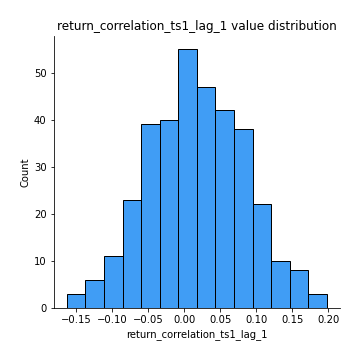
## Feature : return_correlation_ts1_lag_2
- **Feature type** : continous
- **Missing** : 0.0%
- **Unique** : 347
- **Count** :347.0
- **Mean** :0.017994598607165718
- **Std** :0.07201682530443154
- **Min** :-0.16038742223567365
- **25%th Percentile** : -0.031180664013991166
- **50%th Percentile** : 0.01702651286216904
- **75%th Percentile** : 0.07075567221002559
- **Max** :0.2688989662202269

## Feature : return_correlation_ts1_lag_3
- **Feature type** : continous
- **Missing** : 0.0%
- **Unique** : 347
- **Count** :347.0
- **Mean** :0.02732835041633651
- **Std** :0.07057748357668714
- **Min** :-0.21147540839842804
- **25%th Percentile** : -0.01845663085246458
- **50%th Percentile** : 0.02955763744948781
- **75%th Percentile** : 0.07249932218605132
- **Max** :0.23808054096877584

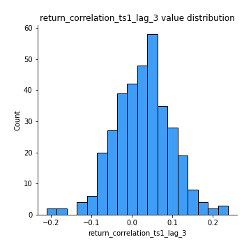
## Feature : return_correlation_ts2_lag_1
- **Feature type** : continous
- **Missing** : 0.0%
- **Unique** : 347
- **Count** :347.0
- **Mean** :0.019798981250165857
- **Std** :0.07041375176688974
- **Min** :-0.17665751184419612
- **25%th Percentile** : -0.022151419939463762
- **50%th Percentile** : 0.019975920464351645
- **75%th Percentile** : 0.06766819215877756
- **Max** :0.21930922927535215

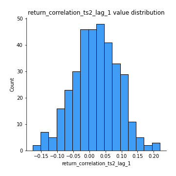
## Feature : return_correlation_ts2_lag_2
- **Feature type** : continous
- **Missing** : 0.0%
- **Unique** : 347
- **Count** :347.0
- **Mean** :0.011966404995340782
- **Std** :0.06767819787404938
- **Min** :-0.2757460186107768
- **25%th Percentile** : -0.02966732766074696
- **50%th Percentile** : 0.014970902527699028
- **75%th Percentile** : 0.05907556384879886
- **Max** :0.1914941371349083

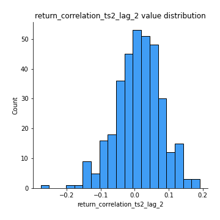
## Feature : return_correlation_ts2_lag_3
- **Feature type** : continous
- **Missing** : 0.0%
- **Unique** : 347
- **Count** :347.0
- **Mean** :0.026627904227571907
- **Std** :0.06417790046667991
- **Min** :-0.17697863431182184
- **25%th Percentile** : -0.0183272165489273
- **50%th Percentile** : 0.02740017128361602
- **75%th Percentile** : 0.07094857657034198
- **Max** :0.18227042221329348

## Feature : sqreturn_autocorrelation_ts1_lag1
- **Feature type** : continous
- **Missing** : 0.0%
- **Unique** : 347
- **Count** :347.0
- **Mean** :0.0407790308613981
- **Std** :0.0864759621530101
- **Min** :-0.1330791488880162
- **25%th Percentile** : -0.020662282910272913
- **50%th Percentile** : 0.02670949644250779
- **75%th Percentile** : 0.09109147772293903
- **Max** :0.4170324090514868

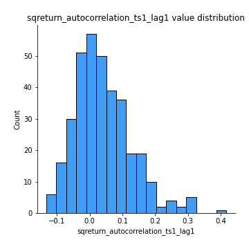
## Feature : sqreturn_autocorrelation_ts1_lag2
- **Feature type** : continous
- **Missing** : 0.0%
- **Unique** : 347
- **Count** :347.0
- **Mean** :0.022471004827937752
- **Std** :0.07119294489272687
- **Min** :-0.14037618025530046
- **25%th Percentile** : -0.02646773774155118
- **50%th Percentile** : 0.010600450158693838
- **75%th Percentile** : 0.06184305502785803
- **Max** :0.32836952056190194

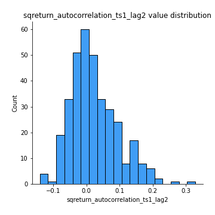
## Feature : sqreturn_autocorrelation_ts1_lag3
- **Feature type** : continous
- **Missing** : 0.0%
- **Unique** : 347
- **Count** :347.0
- **Mean** :0.014299577960703035
- **Std** :0.06314015964583168
- **Min** :-0.16049956468383889
- **25%th Percentile** : -0.027650425572976048
- **50%th Percentile** : 0.006124158241267529
- **75%th Percentile** : 0.04923757726537358
- **Max** :0.23856108238097126

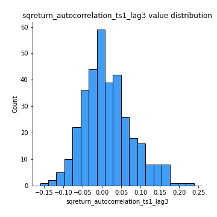
## Feature : sqreturn_autocorrelation_ts2_lag1
- **Feature type** : continous
- **Missing** : 0.0%
- **Unique** : 347
- **Count** :347.0
- **Mean** :0.031901536859702415
- **Std** :0.07055783954883167
- **Min** :-0.11469830004303326
- **25%th Percentile** : -0.01699623344841043
- **50%th Percentile** : 0.022455496851829595
- **75%th Percentile** : 0.07374818152772997
- **Max** :0.3459234668044924

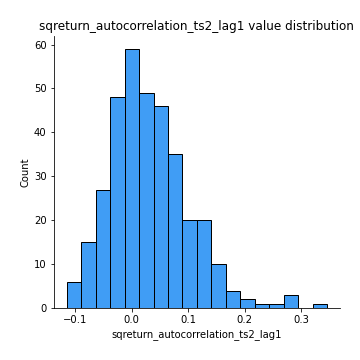
## Feature : sqreturn_autocorrelation_ts2_lag2
- **Feature type** : continous
- **Missing** : 0.0%
- **Unique** : 347
- **Count** :347.0
- **Mean** :0.011544292058042476
- **Std** :0.06303964998288418
- **Min** :-0.16048692070634882
- **25%th Percentile** : -0.027249585082281765
- **50%th Percentile** : 0.0005972973616548966
- **75%th Percentile** : 0.04402481831291791
- **Max** :0.25057436061622956

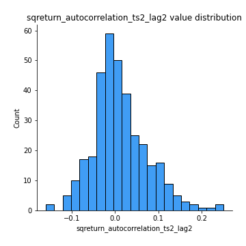
## Feature : sqreturn_autocorrelation_ts2_lag3
- **Feature type** : continous
- **Missing** : 0.0%
- **Unique** : 347
- **Count** :347.0
- **Mean** :0.010871788344389116
- **Std** :0.06362717946680296
- **Min** :-0.13939055039885376
- **25%th Percentile** : -0.02971354739725229
- **50%th Percentile** : -0.0020668752600599065
- **75%th Percentile** : 0.04278351490178925
- **Max** :0.3463122340368414

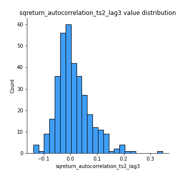
## Feature : sqreturn_correlation_ts1_lag_0
- **Feature type** : continous
- **Missing** : 0.0%
- **Unique** : 347
- **Count** :347.0
- **Mean** :0.3710093384214537
- **Std** :0.13786573744285452
- **Min** :-0.10256711281206837
- **25%th Percentile** : 0.32376709451005636
- **50%th Percentile** : 0.40172530877666884
- **75%th Percentile** : 0.4491542652697551
- **Max** :0.9937227277077512

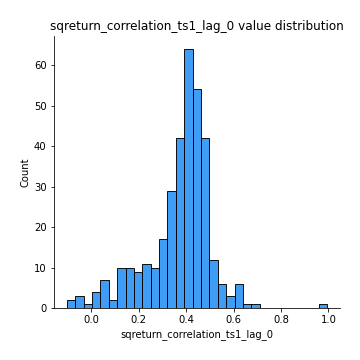
## Feature : sqreturn_correlation_ts1_lag_1
- **Feature type** : continous
- **Missing** : 0.0%
- **Unique** : 347
- **Count** :347.0
- **Mean** :0.017063201186710425
- **Std** :0.06739007416688453
- **Min** :-0.16318172457356173
- **25%th Percentile** : -0.029670560077175733
- **50%th Percentile** : 0.015285034563633278
- **75%th Percentile** : 0.0629331467070289
- **Max** :0.1981109210656282

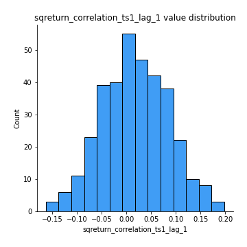
## Feature : sqreturn_correlation_ts1_lag_2
- **Feature type** : continous
- **Missing** : 0.0%
- **Unique** : 347
- **Count** :347.0
- **Mean** :0.017994598607165718
- **Std** :0.07201682530443154
- **Min** :-0.16038742223567365
- **25%th Percentile** : -0.031180664013991166
- **50%th Percentile** : 0.01702651286216904
- **75%th Percentile** : 0.07075567221002559
- **Max** :0.2688989662202269

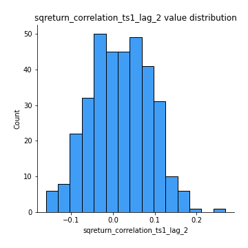
## Feature : sqreturn_correlation_ts1_lag_3
- **Feature type** : continous
- **Missing** : 0.0%
- **Unique** : 347
- **Count** :347.0
- **Mean** :0.02732835041633651
- **Std** :0.07057748357668714
- **Min** :-0.21147540839842804
- **25%th Percentile** : -0.01845663085246458
- **50%th Percentile** : 0.02955763744948781
- **75%th Percentile** : 0.07249932218605132
- **Max** :0.23808054096877584

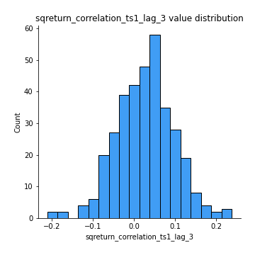
## Feature : sqreturn_correlation_ts2_lag_1
- **Feature type** : continous
- **Missing** : 0.0%
- **Unique** : 347
- **Count** :347.0
- **Mean** :0.019798981250165857
- **Std** :0.07041375176688974
- **Min** :-0.17665751184419612
- **25%th Percentile** : -0.022151419939463762
- **50%th Percentile** : 0.019975920464351645
- **75%th Percentile** : 0.06766819215877756
- **Max** :0.21930922927535215

## Feature : sqreturn_correlation_ts2_lag_2
- **Feature type** : continous
- **Missing** : 0.0%
- **Unique** : 347
- **Count** :347.0
- **Mean** :0.011966404995340782
- **Std** :0.06767819787404938
- **Min** :-0.2757460186107768
- **25%th Percentile** : -0.02966732766074696
- **50%th Percentile** : 0.014970902527699028
- **75%th Percentile** : 0.05907556384879886
- **Max** :0.1914941371349083

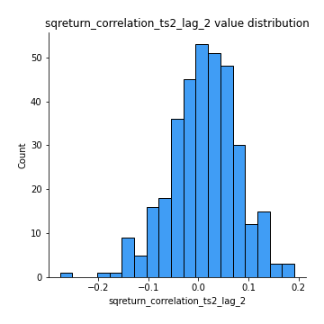
## Feature : sqreturn_correlation_ts2_lag_3
- **Feature type** : continous
- **Missing** : 0.0%
- **Unique** : 347
- **Count** :347.0
- **Mean** :0.026627904227571907
- **Std** :0.06417790046667991
- **Min** :-0.17697863431182184
- **25%th Percentile** : -0.0183272165489273
- **50%th Percentile** : 0.02740017128361602
- **75%th Percentile** : 0.07094857657034198
- **Max** :0.18227042221329348

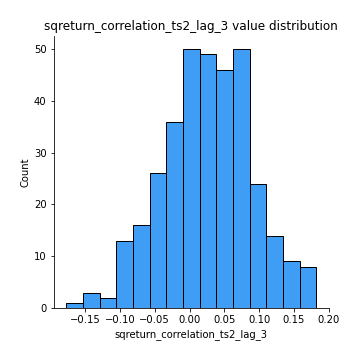
## Feature : price2_granger_cause_price1
- **Feature type** : continous
- **Missing** : 0.0%
- **Unique** : 347
- **Count** :347.0
- **Mean** :0.24361255998437886
- **Std** :0.2784280901606637
- **Min** :6.783013154816982e-08
- **25%th Percentile** : 0.02073716057018757
- **50%th Percentile** : 0.11675051772392708
- **75%th Percentile** : 0.38655088391292114
- **Max** :0.9898380228448623

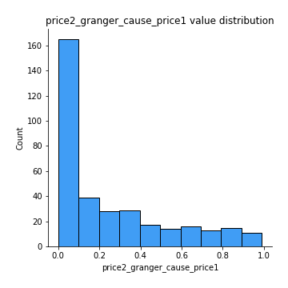
## Feature : price1_granger_cause_price2
- **Feature type** : continous
- **Missing** : 0.0%
- **Unique** : 347
- **Count** :347.0
- **Mean** :0.23581228320690378
- **Std** :0.2736674938784695
- **Min** :5.612994765452436e-10
- **25%th Percentile** : 0.012280022400078961
- **50%th Percentile** : 0.11377510477295179
- **75%th Percentile** : 0.3686227025460043
- **Max** :0.9544840419891578

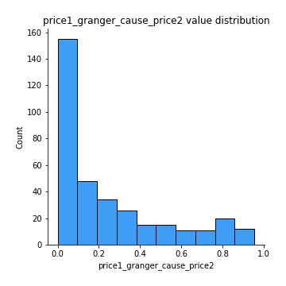

[<< Go back](../README.md)
