# Exploratory Data Analysis

[<< Go back](../README.md)
## Feature : target
- **Feature type** : categorical
- **Missing** : 0.0%
- **Unique** : 2
- **Count** :347
- **Unique** :2
- **Top** :simulated
- **Freq** :176

## Feature : return_mean1
- **Feature type** : continous
- **Missing** : 0.0%
- **Unique** : 347
- **Count** :347.0
- **Mean** :0.00944747665828658
- **Std** :0.12048755943250457
- **Min** :-0.5074740477176167
- **25%th Percentile** : -0.07551915195765337
- **50%th Percentile** : 0.01703083779822765
- **75%th Percentile** : 0.09705820714910063
- **Max** :0.3505544676935612

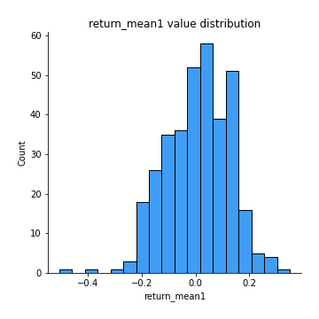
## Feature : return_mean2
- **Feature type** : continous
- **Missing** : 0.0%
- **Unique** : 347
- **Count** :347.0
- **Mean** :-0.02002929220588091
- **Std** :0.14224880828126174
- **Min** :-0.6114390117337362
- **25%th Percentile** : -0.11600000832170582
- **50%th Percentile** : -0.015952704451065728
- **75%th Percentile** : 0.07075388712629016
- **Max** :0.6801605239983173

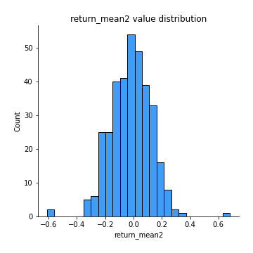
## Feature : return_sd1
- **Feature type** : continous
- **Missing** : 0.0%
- **Unique** : 347
- **Count** :347.0
- **Mean** :1.6380538991336688
- **Std** :0.34929931788301494
- **Min** :0.8102430347636637
- **25%th Percentile** : 1.5314373784016277
- **50%th Percentile** : 1.6098186389263354
- **75%th Percentile** : 1.715710974989418
- **Max** :3.181425034216533

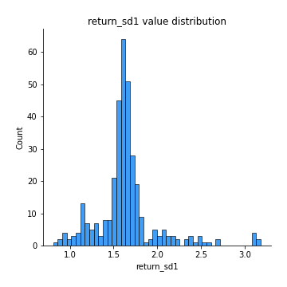
## Feature : return_sd2
- **Feature type** : continous
- **Missing** : 0.0%
- **Unique** : 347
- **Count** :347.0
- **Mean** :1.6581775766532707
- **Std** :0.3809753557270345
- **Min** :0.8198779632289204
- **25%th Percentile** : 1.5282443786120186
- **50%th Percentile** : 1.6199636774437385
- **75%th Percentile** : 1.7161562705247582
- **Max** :4.59233049161685

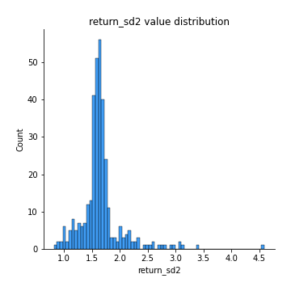
## Feature : return_skew1
- **Feature type** : continous
- **Missing** : 0.0%
- **Unique** : 347
- **Count** :347.0
- **Mean** :-0.1952012126581144
- **Std** :0.7019609715723691
- **Min** :-4.239645236578449
- **25%th Percentile** : -0.35927750326243313
- **50%th Percentile** : -0.083398020072847
- **75%th Percentile** : 0.08760556178462622
- **Max** :2.351757728252051

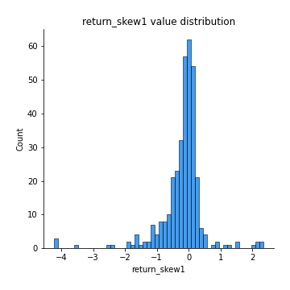
## Feature : return_skew2
- **Feature type** : continous
- **Missing** : 0.0%
- **Unique** : 347
- **Count** :347.0
- **Mean** :-0.22833210094194903
- **Std** :0.9815934151555323
- **Min** :-6.262899561987459
- **25%th Percentile** : -0.32342432251330744
- **50%th Percentile** : -0.05689113433138178
- **75%th Percentile** : 0.12153387122820475
- **Max** :4.1920266082732045

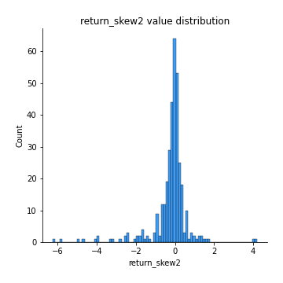
## Feature : return_kurtosis1
- **Feature type** : continous
- **Missing** : 0.0%
- **Unique** : 347
- **Count** :347.0
- **Mean** :2.5793849864036553
- **Std** :5.449325535649825
- **Min** :-0.5871806002003312
- **25%th Percentile** : -0.07195875278690966
- **50%th Percentile** : 0.563960498260367
- **75%th Percentile** : 2.6990337880253565
- **Max** :40.485294874464934

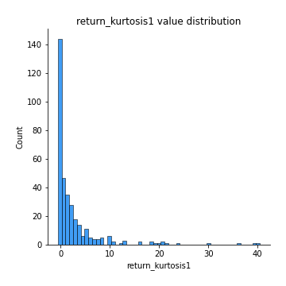
## Feature : return_kurtosis2
- **Feature type** : continous
- **Missing** : 0.0%
- **Unique** : 347
- **Count** :347.0
- **Mean** :3.731855633072535
- **Std** :8.299456178510866
- **Min** :-0.6778741632122443
- **25%th Percentile** : -0.09304195909052426
- **50%th Percentile** : 0.524851301566172
- **75%th Percentile** : 3.3451525378866567
- **Max** :64.99818629655663

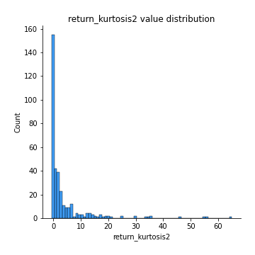
## Feature : return_autocorrelation_1_lag1
- **Feature type** : continous
- **Missing** : 0.0%
- **Unique** : 347
- **Count** :347.0
- **Mean** :0.007634236455667154
- **Std** :0.07006942348836549
- **Min** :-0.2110198016529991
- **25%th Percentile** : -0.042128338145989846
- **50%th Percentile** : 0.011268577686571236
- **75%th Percentile** : 0.05318791631986401
- **Max** :0.20132571463207988

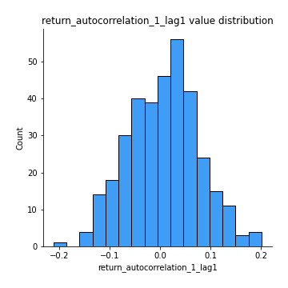
## Feature : return_autocorrelation_1_lag2
- **Feature type** : continous
- **Missing** : 0.0%
- **Unique** : 347
- **Count** :347.0
- **Mean** :0.003455865567624541
- **Std** :0.07122530417390086
- **Min** :-0.16774135553521288
- **25%th Percentile** : -0.04768410585959004
- **50%th Percentile** : 0.003991060251894484
- **75%th Percentile** : 0.05330808745913305
- **Max** :0.22400114872498383

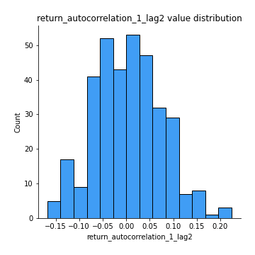
## Feature : return_autocorrelation_1_lag3
- **Feature type** : continous
- **Missing** : 0.0%
- **Unique** : 347
- **Count** :347.0
- **Mean** :0.02540489488876362
- **Std** :0.06508687527412486
- **Min** :-0.1654833157463618
- **25%th Percentile** : -0.015247547494190291
- **50%th Percentile** : 0.026696783904997138
- **75%th Percentile** : 0.06764552222764506
- **Max** :0.194010132970033

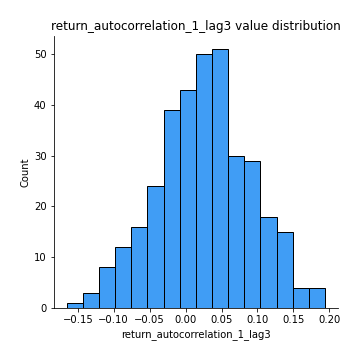
## Feature : return_autocorrelation_2_lag1
- **Feature type** : continous
- **Missing** : 0.0%
- **Unique** : 347
- **Count** :347.0
- **Mean** :0.02291855672885011
- **Std** :0.07666034092067035
- **Min** :-0.2364404317158175
- **25%th Percentile** : -0.027690049387435287
- **50%th Percentile** : 0.023460338020814417
- **75%th Percentile** : 0.0754711273025044
- **Max** :0.22971520779963656

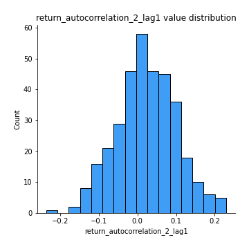
## Feature : return_autocorrelation_2_lag2
- **Feature type** : continous
- **Missing** : 0.0%
- **Unique** : 347
- **Count** :347.0
- **Mean** :0.018902820440108607
- **Std** :0.07549414880419525
- **Min** :-0.1758721664122366
- **25%th Percentile** : -0.031720098892742674
- **50%th Percentile** : 0.01736356162314545
- **75%th Percentile** : 0.07295237410059284
- **Max** :0.2735688969268867

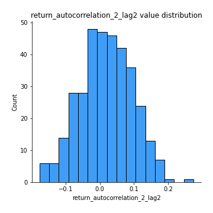
## Feature : return_autocorrelation_2_lag3
- **Feature type** : continous
- **Missing** : 0.0%
- **Unique** : 347
- **Count** :347.0
- **Mean** :0.03026815127361068
- **Std** :0.06506801502117804
- **Min** :-0.1794902936808312
- **25%th Percentile** : -0.012978341673668627
- **50%th Percentile** : 0.02919230895871785
- **75%th Percentile** : 0.07800410325331159
- **Max** :0.21517343012836593

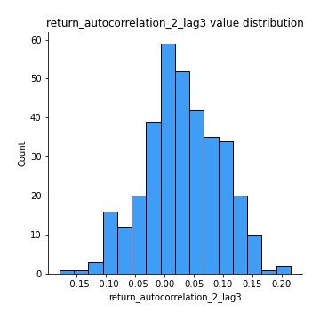
## Feature : return_correlation_ts1_lag_0
- **Feature type** : continous
- **Missing** : 0.0%
- **Unique** : 347
- **Count** :347.0
- **Mean** :0.36375725545451704
- **Std** :0.13890865106353598
- **Min** :-0.07366870340906873
- **25%th Percentile** : 0.3286665439455309
- **50%th Percentile** : 0.39073352604859996
- **75%th Percentile** : 0.4365236350912619
- **Max** :0.9937227277077512

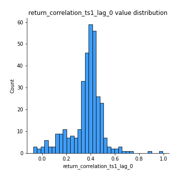
## Feature : return_correlation_ts1_lag_1
- **Feature type** : continous
- **Missing** : 0.0%
- **Unique** : 347
- **Count** :347.0
- **Mean** :0.018273623193268543
- **Std** :0.0703409372008463
- **Min** :-0.18856827637524448
- **25%th Percentile** : -0.028802073467120895
- **50%th Percentile** : 0.016566491312107728
- **75%th Percentile** : 0.06704793986240172
- **Max** :0.233639028343517

## Feature : return_correlation_ts1_lag_2
- **Feature type** : continous
- **Missing** : 0.0%
- **Unique** : 347
- **Count** :347.0
- **Mean** :0.014318290142779341
- **Std** :0.07014436265140282
- **Min** :-0.172871336111873
- **25%th Percentile** : -0.03339512445450854
- **50%th Percentile** : 0.012717053943966054
- **75%th Percentile** : 0.061799454303208025
- **Max** :0.2209905143400383

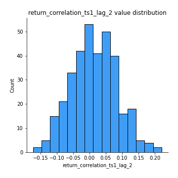
## Feature : return_correlation_ts1_lag_3
- **Feature type** : continous
- **Missing** : 0.0%
- **Unique** : 347
- **Count** :347.0
- **Mean** :0.024693698370289983
- **Std** :0.07014775362302601
- **Min** :-0.18059033867783728
- **25%th Percentile** : -0.021066759592937676
- **50%th Percentile** : 0.028193164904485007
- **75%th Percentile** : 0.06597537266175041
- **Max** :0.23808054096877584

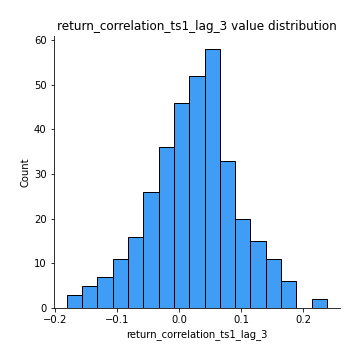
## Feature : return_correlation_ts2_lag_1
- **Feature type** : continous
- **Missing** : 0.0%
- **Unique** : 347
- **Count** :347.0
- **Mean** :0.02889080272581208
- **Std** :0.07019664305207182
- **Min** :-0.17665751184419612
- **25%th Percentile** : -0.012872900412597109
- **50%th Percentile** : 0.026611854639263233
- **75%th Percentile** : 0.07450292313205281
- **Max** :0.3425036902091001

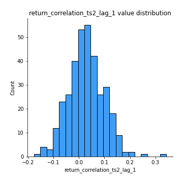
## Feature : return_correlation_ts2_lag_2
- **Feature type** : continous
- **Missing** : 0.0%
- **Unique** : 347
- **Count** :347.0
- **Mean** :0.01526173539815488
- **Std** :0.0695314732546258
- **Min** :-0.18793480063267962
- **25%th Percentile** : -0.030159358982027287
- **50%th Percentile** : 0.016834682067449033
- **75%th Percentile** : 0.06172154927176622
- **Max** :0.20859146484627333

## Feature : return_correlation_ts2_lag_3
- **Feature type** : continous
- **Missing** : 0.0%
- **Unique** : 347
- **Count** :347.0
- **Mean** :0.02433787332773003
- **Std** :0.06419331966725361
- **Min** :-0.13287767820660334
- **25%th Percentile** : -0.02240344890510907
- **50%th Percentile** : 0.02468774257440791
- **75%th Percentile** : 0.07306232747062162
- **Max** :0.18227042221329348

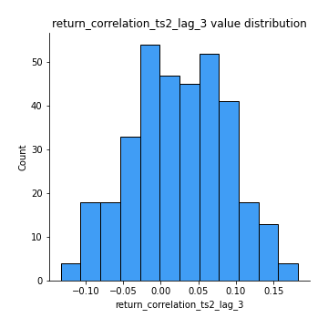
## Feature : sqreturn_autocorrelation_ts1_lag1
- **Feature type** : continous
- **Missing** : 0.0%
- **Unique** : 347
- **Count** :347.0
- **Mean** :0.03301669797164555
- **Std** :0.08387347155442658
- **Min** :-0.2007216667270912
- **25%th Percentile** : -0.023167590375048133
- **50%th Percentile** : 0.018597352607858345
- **75%th Percentile** : 0.07868857823936182
- **Max** :0.4170324090514868

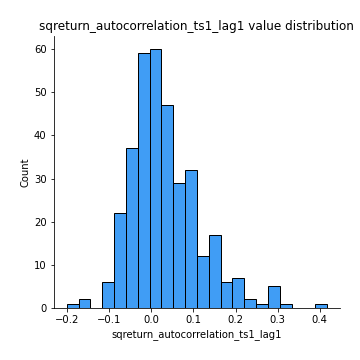
## Feature : sqreturn_autocorrelation_ts1_lag2
- **Feature type** : continous
- **Missing** : 0.0%
- **Unique** : 347
- **Count** :347.0
- **Mean** :0.01598556161425347
- **Std** :0.06994113151808097
- **Min** :-0.18946160733699374
- **25%th Percentile** : -0.027992442923598582
- **50%th Percentile** : 0.00721207236997169
- **75%th Percentile** : 0.05198320152608632
- **Max** :0.29415594530501293

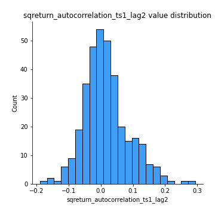
## Feature : sqreturn_autocorrelation_ts1_lag3
- **Feature type** : continous
- **Missing** : 0.0%
- **Unique** : 347
- **Count** :347.0
- **Mean** :0.014482464125707735
- **Std** :0.06120891948091707
- **Min** :-0.14576979842124888
- **25%th Percentile** : -0.022505079771887357
- **50%th Percentile** : 0.00804498931653213
- **75%th Percentile** : 0.04915090873513651
- **Max** :0.21054164854472524

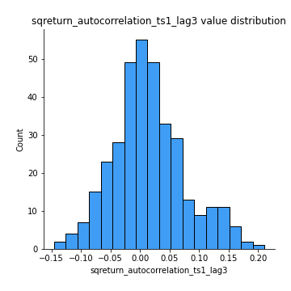
## Feature : sqreturn_autocorrelation_ts2_lag1
- **Feature type** : continous
- **Missing** : 0.0%
- **Unique** : 347
- **Count** :347.0
- **Mean** :0.02799951263753235
- **Std** :0.07837350885884786
- **Min** :-0.13106275392335384
- **25%th Percentile** : -0.02008009207099648
- **50%th Percentile** : 0.015488459753505305
- **75%th Percentile** : 0.06409333272809117
- **Max** :0.36991568023038357

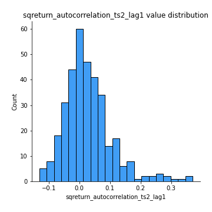
## Feature : sqreturn_autocorrelation_ts2_lag2
- **Feature type** : continous
- **Missing** : 0.0%
- **Unique** : 347
- **Count** :347.0
- **Mean** :0.011093518387684145
- **Std** :0.0633741580494563
- **Min** :-0.1443624130935378
- **25%th Percentile** : -0.027251002415973995
- **50%th Percentile** : 0.0014643953181021534
- **75%th Percentile** : 0.04251393406284011
- **Max** :0.28672056150180414

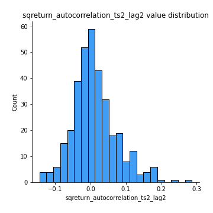
## Feature : sqreturn_autocorrelation_ts2_lag3
- **Feature type** : continous
- **Missing** : 0.0%
- **Unique** : 347
- **Count** :347.0
- **Mean** :0.01102867262272892
- **Std** :0.06405829915348871
- **Min** :-0.15302855032965054
- **25%th Percentile** : -0.027392566444056278
- **50%th Percentile** : -0.0012876717818051026
- **75%th Percentile** : 0.0413652238599813
- **Max** :0.3463122340368414

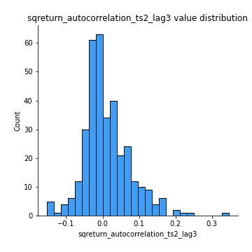
## Feature : sqreturn_correlation_ts1_lag_0
- **Feature type** : continous
- **Missing** : 0.0%
- **Unique** : 347
- **Count** :347.0
- **Mean** :0.36375725545451704
- **Std** :0.13890865106353598
- **Min** :-0.07366870340906873
- **25%th Percentile** : 0.3286665439455309
- **50%th Percentile** : 0.39073352604859996
- **75%th Percentile** : 0.4365236350912619
- **Max** :0.9937227277077512

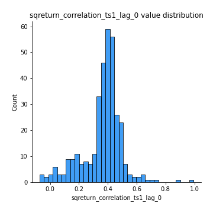
## Feature : sqreturn_correlation_ts1_lag_1
- **Feature type** : continous
- **Missing** : 0.0%
- **Unique** : 347
- **Count** :347.0
- **Mean** :0.018273623193268543
- **Std** :0.0703409372008463
- **Min** :-0.18856827637524448
- **25%th Percentile** : -0.028802073467120895
- **50%th Percentile** : 0.016566491312107728
- **75%th Percentile** : 0.06704793986240172
- **Max** :0.233639028343517

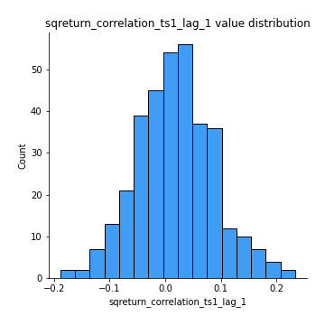
## Feature : sqreturn_correlation_ts1_lag_2
- **Feature type** : continous
- **Missing** : 0.0%
- **Unique** : 347
- **Count** :347.0
- **Mean** :0.014318290142779341
- **Std** :0.07014436265140282
- **Min** :-0.172871336111873
- **25%th Percentile** : -0.03339512445450854
- **50%th Percentile** : 0.012717053943966054
- **75%th Percentile** : 0.061799454303208025
- **Max** :0.2209905143400383

## Feature : sqreturn_correlation_ts1_lag_3
- **Feature type** : continous
- **Missing** : 0.0%
- **Unique** : 347
- **Count** :347.0
- **Mean** :0.024693698370289983
- **Std** :0.07014775362302601
- **Min** :-0.18059033867783728
- **25%th Percentile** : -0.021066759592937676
- **50%th Percentile** : 0.028193164904485007
- **75%th Percentile** : 0.06597537266175041
- **Max** :0.23808054096877584

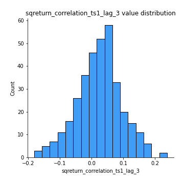
## Feature : sqreturn_correlation_ts2_lag_1
- **Feature type** : continous
- **Missing** : 0.0%
- **Unique** : 347
- **Count** :347.0
- **Mean** :0.02889080272581208
- **Std** :0.07019664305207182
- **Min** :-0.17665751184419612
- **25%th Percentile** : -0.012872900412597109
- **50%th Percentile** : 0.026611854639263233
- **75%th Percentile** : 0.07450292313205281
- **Max** :0.3425036902091001

## Feature : sqreturn_correlation_ts2_lag_2
- **Feature type** : continous
- **Missing** : 0.0%
- **Unique** : 347
- **Count** :347.0
- **Mean** :0.01526173539815488
- **Std** :0.0695314732546258
- **Min** :-0.18793480063267962
- **25%th Percentile** : -0.030159358982027287
- **50%th Percentile** : 0.016834682067449033
- **75%th Percentile** : 0.06172154927176622
- **Max** :0.20859146484627333

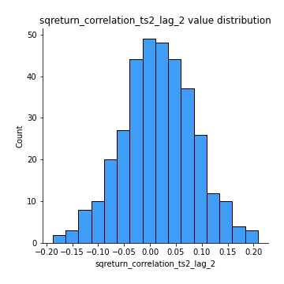
## Feature : sqreturn_correlation_ts2_lag_3
- **Feature type** : continous
- **Missing** : 0.0%
- **Unique** : 347
- **Count** :347.0
- **Mean** :0.02433787332773003
- **Std** :0.06419331966725361
- **Min** :-0.13287767820660334
- **25%th Percentile** : -0.02240344890510907
- **50%th Percentile** : 0.02468774257440791
- **75%th Percentile** : 0.07306232747062162
- **Max** :0.18227042221329348

## Feature : price2_granger_cause_price1
- **Feature type** : continous
- **Missing** : 0.0%
- **Unique** : 347
- **Count** :347.0
- **Mean** :0.23005103099874502
- **Std** :0.2771287525054142
- **Min** :2.4312048970873696e-09
- **25%th Percentile** : 0.011571111754259983
- **50%th Percentile** : 0.10589301754732396
- **75%th Percentile** : 0.37519573050728466
- **Max** :0.9898380228448623

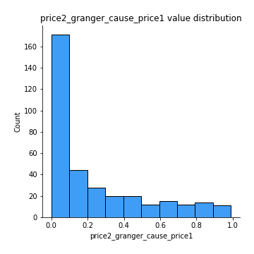
## Feature : price1_granger_cause_price2
- **Feature type** : continous
- **Missing** : 0.0%
- **Unique** : 347
- **Count** :347.0
- **Mean** :0.21713447593286186
- **Std** :0.2699427400175304
- **Min** :1.2012269232170316e-11
- **25%th Percentile** : 0.009405031947082058
- **50%th Percentile** : 0.08297032721066479
- **75%th Percentile** : 0.3490431048543698
- **Max** :0.9847100105755796

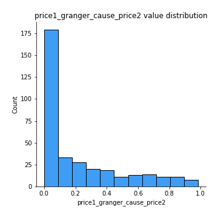

[<< Go back](../README.md)
