# Summary of 3_Linear

[<< Go back](../README.md)

## Logistic Regression (Linear)
- **n_jobs**: -1
- **explain_level**: 2

## Validation
 - **validation_type**: split
 - **train_ratio**: 0.75
 - **shuffle**: True
 - **stratify**: True

## Optimized metric
accuracy

## Training time

6.5 seconds

## Metric details
|           |    score |   threshold |
|:----------|---------:|------------:|
| logloss   | 0.134476 | nan         |
| auc       | 1        | nan         |
| f1        | 1        |   0.666389  |
| accuracy  | 1        |   0.666389  |
| precision | 1        |   0.666389  |
| recall    | 1        |   3.563e-15 |
| mcc       | 1        |   0.666389  |

## Confusion matrix (at threshold=0.666389)
|                      |   Predicted as real |   Predicted as simulated |
|:---------------------|--------------------:|-------------------------:|
| Labeled as real      |                  44 |                        0 |
| Labeled as simulated |                   0 |                       43 |

## Learning curves
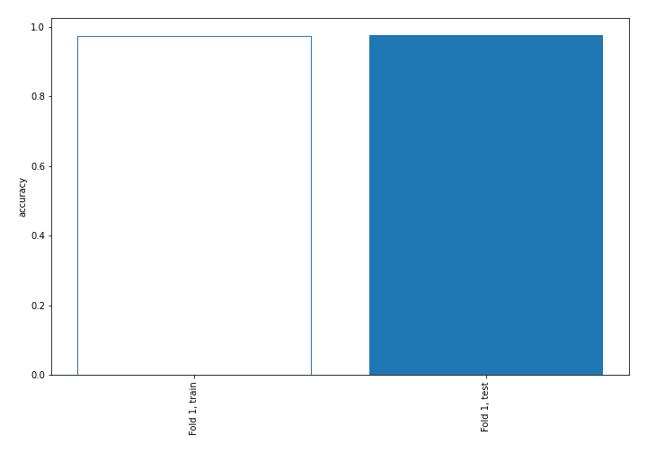

## Coefficients
| feature                           |   Learner_1 |
|:----------------------------------|------------:|
| return_skew1                      |   1.42763   |
| return_skew2                      |   0.965192  |
| return_autocorrelation_1_lag2     |   0.693846  |
| return_correlation_ts1_lag_2      |   0.616555  |
| sqreturn_correlation_ts1_lag_2    |   0.616555  |
| return_autocorrelation_2_lag2     |   0.567065  |
| return_autocorrelation_2_lag1     |   0.545271  |
| return_autocorrelation_1_lag1     |   0.543424  |
| sqreturn_correlation_ts2_lag_1    |   0.498836  |
| return_correlation_ts2_lag_1      |   0.498836  |
| sqreturn_correlation_ts1_lag_1    |   0.494202  |
| return_correlation_ts1_lag_1      |   0.494202  |
| return_correlation_ts2_lag_2      |   0.41726   |
| sqreturn_correlation_ts2_lag_2    |   0.41726   |
| return_autocorrelation_2_lag3     |   0.369073  |
| sqreturn_correlation_ts1_lag_0    |   0.3626    |
| return_correlation_ts1_lag_0      |   0.3626    |
| sqreturn_correlation_ts2_lag_3    |   0.22071   |
| return_correlation_ts2_lag_3      |   0.22071   |
| return_autocorrelation_1_lag3     |   0.138616  |
| sqreturn_correlation_ts1_lag_3    |   0.136396  |
| return_correlation_ts1_lag_3      |   0.136396  |
| return_sd1                        |   0.0295933 |
| return_sd2                        |  -0.0751824 |
| sqreturn_autocorrelation_ts1_lag3 |  -0.411902  |
| sqreturn_autocorrelation_ts2_lag3 |  -0.435846  |
| return_mean1                      |  -0.478809  |
| sqreturn_autocorrelation_ts1_lag2 |  -0.646895  |
| sqreturn_autocorrelation_ts2_lag2 |  -0.656377  |
| price2_granger_cause_price1       |  -0.700087  |
| price1_granger_cause_price2       |  -0.755469  |
| sqreturn_autocorrelation_ts2_lag1 |  -0.779965  |
| return_mean2                      |  -0.968677  |
| sqreturn_autocorrelation_ts1_lag1 |  -1.14677   |
| intercept                         |  -1.60696   |
| return_kurtosis2                  |  -3.32099   |
| return_kurtosis1                  |  -4.0105    |

## Permutation-based Importance
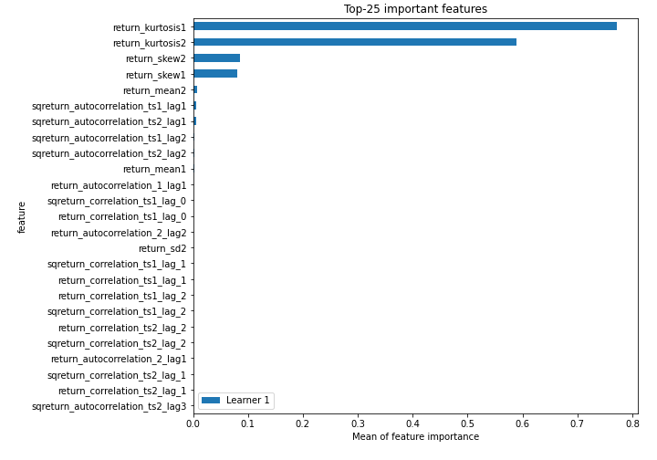
## Confusion Matrix

## Normalized Confusion Matrix

## ROC Curve

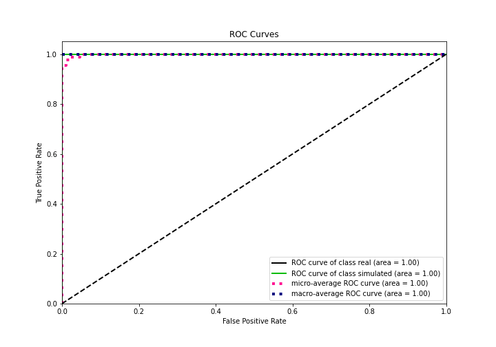

## Kolmogorov-Smirnov Statistic

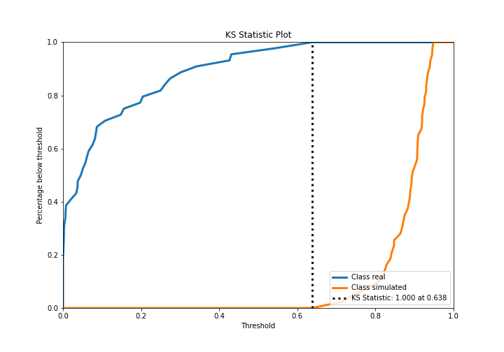

## Precision-Recall Curve

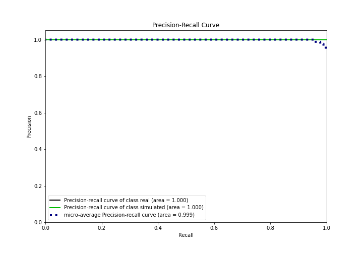

## Calibration Curve

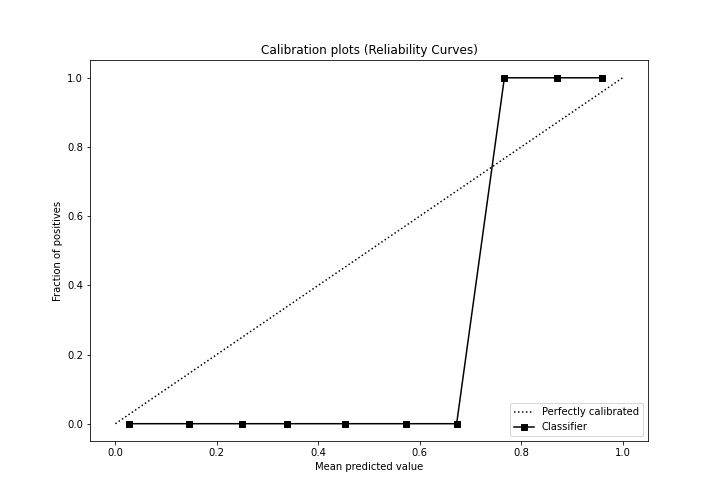

## Cumulative Gains Curve

## Lift Curve

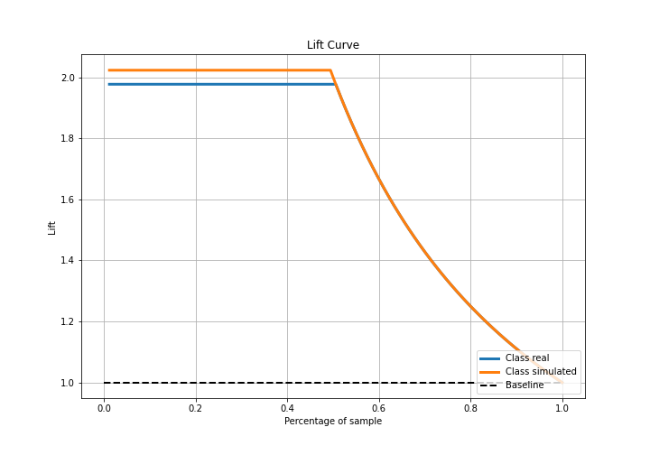

## SHAP Importance
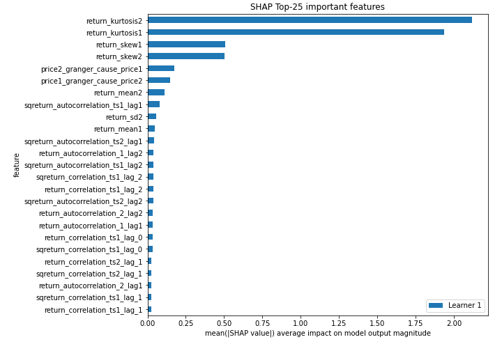

## SHAP Dependence plots

### Dependence (Fold 1)
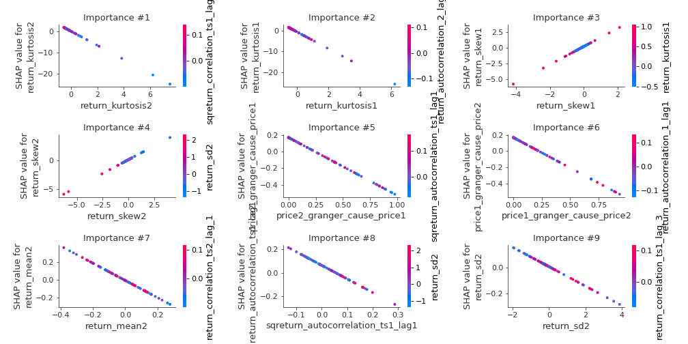

## SHAP Decision plots

### Top-10 Worst decisions for class 0 (Fold 1)
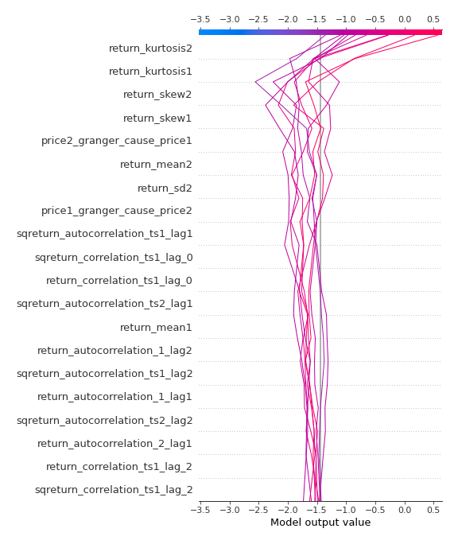
### Top-10 Best decisions for class 0 (Fold 1)

### Top-10 Worst decisions for class 1 (Fold 1)
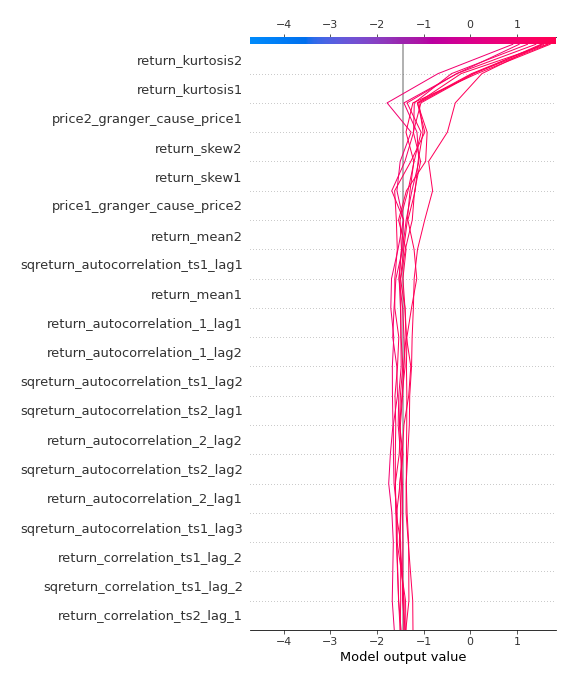
### Top-10 Best decisions for class 1 (Fold 1)
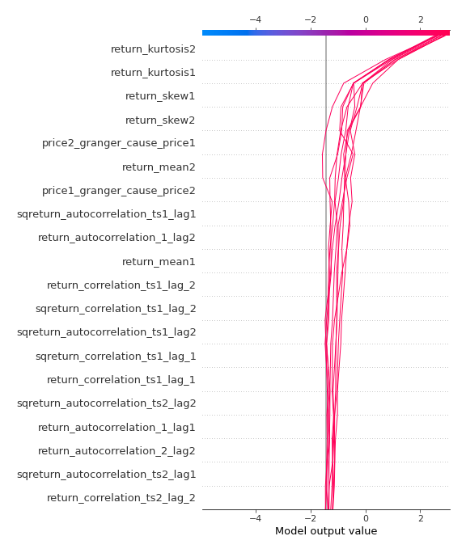

[<< Go back](../README.md)
