# Exploratory Data Analysis

[<< Go back](../README.md)
## Feature : target
- **Feature type** : categorical
- **Missing** : 0.0%
- **Unique** : 2
- **Count** :347
- **Unique** :2
- **Top** :real
- **Freq** :176

## Feature : return_mean1
- **Feature type** : continous
- **Missing** : 0.0%
- **Unique** : 347
- **Count** :347.0
- **Mean** :0.007248448548791295
- **Std** :0.1283568435201734
- **Min** :-0.50544698284431
- **25%th Percentile** : -0.08413509067354037
- **50%th Percentile** : 0.012869513509776151
- **75%th Percentile** : 0.10052308491163825
- **Max** :0.3602793017097547

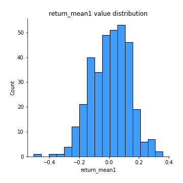
## Feature : return_mean2
- **Feature type** : continous
- **Missing** : 0.0%
- **Unique** : 347
- **Count** :347.0
- **Mean** :-0.02374024129114905
- **Std** :0.14699490835167325
- **Min** :-0.7170107351047165
- **25%th Percentile** : -0.10858735455020713
- **50%th Percentile** : -0.016249324946804766
- **75%th Percentile** : 0.07090223576642699
- **Max** :0.6801605239983173

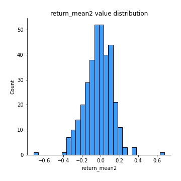
## Feature : return_sd1
- **Feature type** : continous
- **Missing** : 0.0%
- **Unique** : 347
- **Count** :347.0
- **Mean** :1.6467826287427734
- **Std** :0.3659667119060769
- **Min** :0.8733078831717243
- **25%th Percentile** : 1.514666548681487
- **50%th Percentile** : 1.6167975688007323
- **75%th Percentile** : 1.7198814595546652
- **Max** :3.332494027875222

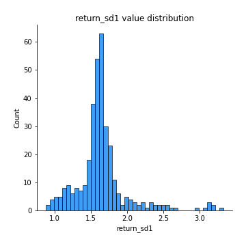
## Feature : return_sd2
- **Feature type** : continous
- **Missing** : 0.0%
- **Unique** : 347
- **Count** :347.0
- **Mean** :1.6852260010848352
- **Std** :0.4143423097890191
- **Min** :0.8198779632289204
- **25%th Percentile** : 1.517797656012057
- **50%th Percentile** : 1.6261331034455453
- **75%th Percentile** : 1.7288247750822485
- **Max** :4.59233049161685

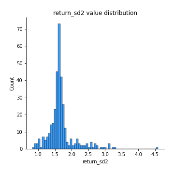
## Feature : return_skew1
- **Feature type** : continous
- **Missing** : 0.0%
- **Unique** : 347
- **Count** :347.0
- **Mean** :-0.16516219501788
- **Std** :0.69994536759756
- **Min** :-4.239645236578449
- **25%th Percentile** : -0.3267944109469416
- **50%th Percentile** : -0.05950313650690079
- **75%th Percentile** : 0.09524026684088413
- **Max** :2.1285977762978217

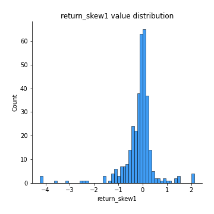
## Feature : return_skew2
- **Feature type** : continous
- **Missing** : 0.0%
- **Unique** : 347
- **Count** :347.0
- **Mean** :-0.23500170427273906
- **Std** :0.9653418672213011
- **Min** :-6.262899561987459
- **25%th Percentile** : -0.3020252990355238
- **50%th Percentile** : -0.057344755566436714
- **75%th Percentile** : 0.10949018891277021
- **Max** :4.0310261345618

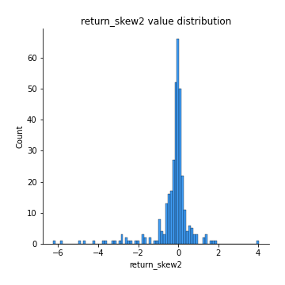
## Feature : return_kurtosis1
- **Feature type** : continous
- **Missing** : 0.0%
- **Unique** : 347
- **Count** :347.0
- **Mean** :2.4690809695637217
- **Std** :5.3402859088786006
- **Min** :-0.7092549698497903
- **25%th Percentile** : -0.07087523919314331
- **50%th Percentile** : 0.6692168504335823
- **75%th Percentile** : 2.678812472527533
- **Max** :40.485294874464934

## Feature : return_kurtosis2
- **Feature type** : continous
- **Missing** : 0.0%
- **Unique** : 347
- **Count** :347.0
- **Mean** :3.8888677928903457
- **Std** :8.704731488253495
- **Min** :-0.7046170545103494
- **25%th Percentile** : -0.016014240923327927
- **50%th Percentile** : 0.602729127159503
- **75%th Percentile** : 3.188619372175843
- **Max** :64.99818629655663

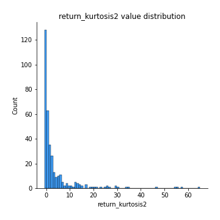
## Feature : return_autocorrelation_1_lag1
- **Feature type** : continous
- **Missing** : 0.0%
- **Unique** : 347
- **Count** :347.0
- **Mean** :0.006765917569094219
- **Std** :0.07271062205430041
- **Min** :-0.2110198016529991
- **25%th Percentile** : -0.03981762324033722
- **50%th Percentile** : 0.00787818155630926
- **75%th Percentile** : 0.055558843721445435
- **Max** :0.27166005539194

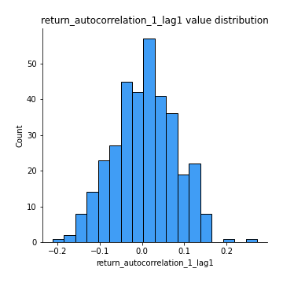
## Feature : return_autocorrelation_1_lag2
- **Feature type** : continous
- **Missing** : 0.0%
- **Unique** : 347
- **Count** :347.0
- **Mean** :0.004368998067947744
- **Std** :0.07094747212135917
- **Min** :-0.15455782934121354
- **25%th Percentile** : -0.043844215533130004
- **50%th Percentile** : 0.0016031748526676793
- **75%th Percentile** : 0.052019675095699366
- **Max** :0.21123611097039302

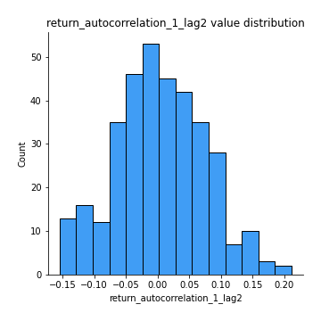
## Feature : return_autocorrelation_1_lag3
- **Feature type** : continous
- **Missing** : 0.0%
- **Unique** : 347
- **Count** :347.0
- **Mean** :0.021644946679026653
- **Std** :0.06507270206391413
- **Min** :-0.1654833157463618
- **25%th Percentile** : -0.014876568142532139
- **50%th Percentile** : 0.025284387202562316
- **75%th Percentile** : 0.06500817046757112
- **Max** :0.23487891855247797

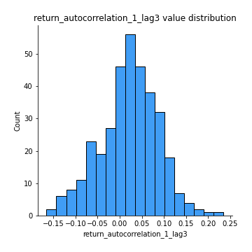
## Feature : return_autocorrelation_2_lag1
- **Feature type** : continous
- **Missing** : 0.0%
- **Unique** : 347
- **Count** :347.0
- **Mean** :0.020575500440471718
- **Std** :0.06973491711579734
- **Min** :-0.17778763204400128
- **25%th Percentile** : -0.028618857442209752
- **50%th Percentile** : 0.018286852033391327
- **75%th Percentile** : 0.06831672915656295
- **Max** :0.2024676054184499

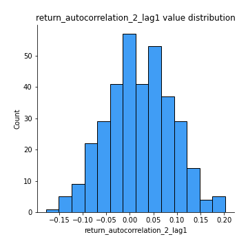
## Feature : return_autocorrelation_2_lag2
- **Feature type** : continous
- **Missing** : 0.0%
- **Unique** : 347
- **Count** :347.0
- **Mean** :0.015796563601868475
- **Std** :0.07325635682876912
- **Min** :-0.1758721664122366
- **25%th Percentile** : -0.033569659289543544
- **50%th Percentile** : 0.018195819392034247
- **75%th Percentile** : 0.06853989305154379
- **Max** :0.22049105657198567

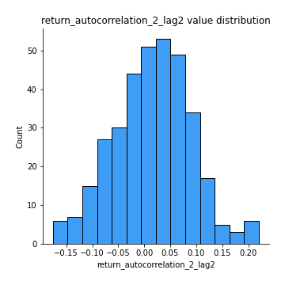
## Feature : return_autocorrelation_2_lag3
- **Feature type** : continous
- **Missing** : 0.0%
- **Unique** : 347
- **Count** :347.0
- **Mean** :0.029693042092849235
- **Std** :0.06548893866913841
- **Min** :-0.1798960840760737
- **25%th Percentile** : -0.011728321776040843
- **50%th Percentile** : 0.029806854205943624
- **75%th Percentile** : 0.07398506500369166
- **Max** :0.22644038811764022

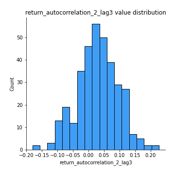
## Feature : return_correlation_ts1_lag_0
- **Feature type** : continous
- **Missing** : 0.0%
- **Unique** : 347
- **Count** :347.0
- **Mean** :0.368844825997508
- **Std** :0.13720861028787393
- **Min** :-0.10256711281206837
- **25%th Percentile** : 0.32088294008297513
- **50%th Percentile** : 0.3950833308692462
- **75%th Percentile** : 0.4448262225669616
- **Max** :0.9937227277077512

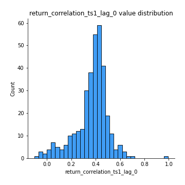
## Feature : return_correlation_ts1_lag_1
- **Feature type** : continous
- **Missing** : 0.0%
- **Unique** : 347
- **Count** :347.0
- **Mean** :0.015366207849168867
- **Std** :0.067028497137603
- **Min** :-0.18856827637524448
- **25%th Percentile** : -0.03234533626942045
- **50%th Percentile** : 0.012307627548743653
- **75%th Percentile** : 0.06642047906163688
- **Max** :0.2063830960309321

## Feature : return_correlation_ts1_lag_2
- **Feature type** : continous
- **Missing** : 0.0%
- **Unique** : 347
- **Count** :347.0
- **Mean** :0.014695204535725696
- **Std** :0.06843198453261008
- **Min** :-0.16038742223567365
- **25%th Percentile** : -0.03456093154625681
- **50%th Percentile** : 0.016757650974303276
- **75%th Percentile** : 0.05673550318832983
- **Max** :0.22885168499305478

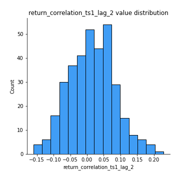
## Feature : return_correlation_ts1_lag_3
- **Feature type** : continous
- **Missing** : 0.0%
- **Unique** : 347
- **Count** :347.0
- **Mean** :0.024455990652868454
- **Std** :0.07058742872481219
- **Min** :-0.21147540839842804
- **25%th Percentile** : -0.024069445829592202
- **50%th Percentile** : 0.02104776743126302
- **75%th Percentile** : 0.07171892188420091
- **Max** :0.23808054096877584

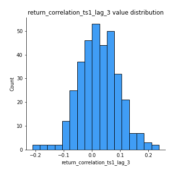
## Feature : return_correlation_ts2_lag_1
- **Feature type** : continous
- **Missing** : 0.0%
- **Unique** : 347
- **Count** :347.0
- **Mean** :0.022285856040568264
- **Std** :0.07127720691059196
- **Min** :-0.17665751184419612
- **25%th Percentile** : -0.024489672284002048
- **50%th Percentile** : 0.022031378081076206
- **75%th Percentile** : 0.07226429587725193
- **Max** :0.3425036902091001

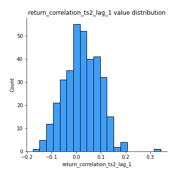
## Feature : return_correlation_ts2_lag_2
- **Feature type** : continous
- **Missing** : 0.0%
- **Unique** : 347
- **Count** :347.0
- **Mean** :0.011539553007431914
- **Std** :0.0704276201093286
- **Min** :-0.2757460186107768
- **25%th Percentile** : -0.034230493475259444
- **50%th Percentile** : 0.009754098640690087
- **75%th Percentile** : 0.06214514372423367
- **Max** :0.19682647493440525

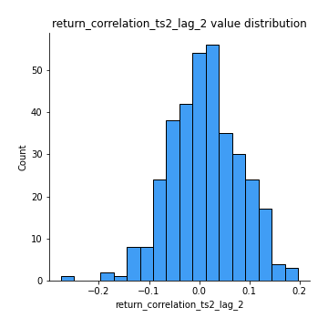
## Feature : return_correlation_ts2_lag_3
- **Feature type** : continous
- **Missing** : 0.0%
- **Unique** : 347
- **Count** :347.0
- **Mean** :0.02637325081854377
- **Std** :0.06524671075890517
- **Min** :-0.13344359675322365
- **25%th Percentile** : -0.021547344868022615
- **50%th Percentile** : 0.02701776236765343
- **75%th Percentile** : 0.07351171313015631
- **Max** :0.20308727444882477

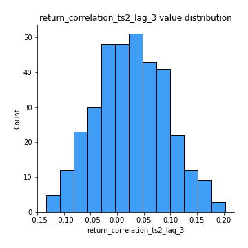
## Feature : sqreturn_autocorrelation_ts1_lag1
- **Feature type** : continous
- **Missing** : 0.0%
- **Unique** : 347
- **Count** :347.0
- **Mean** :0.031470040517376466
- **Std** :0.08466374872555944
- **Min** :-0.18716213053512762
- **25%th Percentile** : -0.024718788972047382
- **50%th Percentile** : 0.013175015743835696
- **75%th Percentile** : 0.07418521961577715
- **Max** :0.4170324090514868

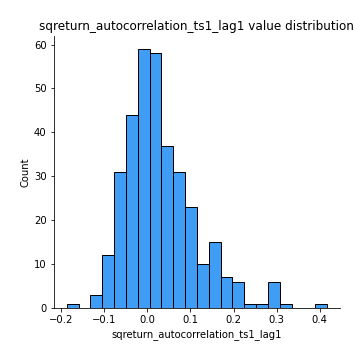
## Feature : sqreturn_autocorrelation_ts1_lag2
- **Feature type** : continous
- **Missing** : 0.0%
- **Unique** : 347
- **Count** :347.0
- **Mean** :0.02555206880145377
- **Std** :0.07350277739215852
- **Min** :-0.1516597741973487
- **25%th Percentile** : -0.026841121288205212
- **50%th Percentile** : 0.014205825392475904
- **75%th Percentile** : 0.06796033941892898
- **Max** :0.32836952056190194

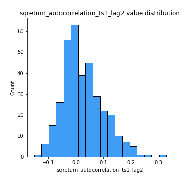
## Feature : sqreturn_autocorrelation_ts1_lag3
- **Feature type** : continous
- **Missing** : 0.0%
- **Unique** : 347
- **Count** :347.0
- **Mean** :0.012003626732050484
- **Std** :0.06566629311770147
- **Min** :-0.1639785402022888
- **25%th Percentile** : -0.02900319246019495
- **50%th Percentile** : 0.007583853288362363
- **75%th Percentile** : 0.04529296232266736
- **Max** :0.36579865351615615

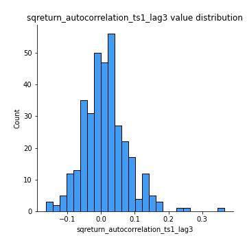
## Feature : sqreturn_autocorrelation_ts2_lag1
- **Feature type** : continous
- **Missing** : 0.0%
- **Unique** : 347
- **Count** :347.0
- **Mean** :0.025162547712146485
- **Std** :0.07688316901616019
- **Min** :-0.14463933261524092
- **25%th Percentile** : -0.02231705925704936
- **50%th Percentile** : 0.015258611058447941
- **75%th Percentile** : 0.06159521328275548
- **Max** :0.36991568023038357

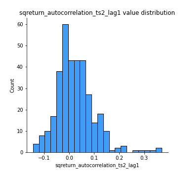
## Feature : sqreturn_autocorrelation_ts2_lag2
- **Feature type** : continous
- **Missing** : 0.0%
- **Unique** : 347
- **Count** :347.0
- **Mean** :0.014150156408742193
- **Std** :0.06658351890449611
- **Min** :-0.13916547027782702
- **25%th Percentile** : -0.027729529886477054
- **50%th Percentile** : 0.008158174956679263
- **75%th Percentile** : 0.04853963288314303
- **Max** :0.28672056150180414

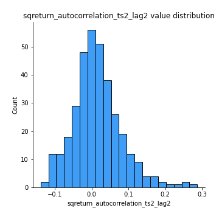
## Feature : sqreturn_autocorrelation_ts2_lag3
- **Feature type** : continous
- **Missing** : 0.0%
- **Unique** : 347
- **Count** :347.0
- **Mean** :0.010341725583585887
- **Std** :0.0655111221451646
- **Min** :-0.14388388889380815
- **25%th Percentile** : -0.02956051239733329
- **50%th Percentile** : -0.0028334009876987273
- **75%th Percentile** : 0.04414316433923324
- **Max** :0.3463122340368414

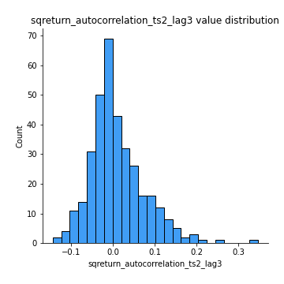
## Feature : sqreturn_correlation_ts1_lag_0
- **Feature type** : continous
- **Missing** : 0.0%
- **Unique** : 347
- **Count** :347.0
- **Mean** :0.368844825997508
- **Std** :0.13720861028787393
- **Min** :-0.10256711281206837
- **25%th Percentile** : 0.32088294008297513
- **50%th Percentile** : 0.3950833308692462
- **75%th Percentile** : 0.4448262225669616
- **Max** :0.9937227277077512

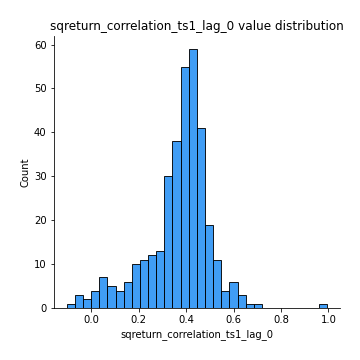
## Feature : sqreturn_correlation_ts1_lag_1
- **Feature type** : continous
- **Missing** : 0.0%
- **Unique** : 347
- **Count** :347.0
- **Mean** :0.015366207849168867
- **Std** :0.067028497137603
- **Min** :-0.18856827637524448
- **25%th Percentile** : -0.03234533626942045
- **50%th Percentile** : 0.012307627548743653
- **75%th Percentile** : 0.06642047906163688
- **Max** :0.2063830960309321

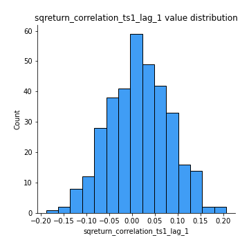
## Feature : sqreturn_correlation_ts1_lag_2
- **Feature type** : continous
- **Missing** : 0.0%
- **Unique** : 347
- **Count** :347.0
- **Mean** :0.014695204535725696
- **Std** :0.06843198453261008
- **Min** :-0.16038742223567365
- **25%th Percentile** : -0.03456093154625681
- **50%th Percentile** : 0.016757650974303276
- **75%th Percentile** : 0.05673550318832983
- **Max** :0.22885168499305478

## Feature : sqreturn_correlation_ts1_lag_3
- **Feature type** : continous
- **Missing** : 0.0%
- **Unique** : 347
- **Count** :347.0
- **Mean** :0.024455990652868454
- **Std** :0.07058742872481219
- **Min** :-0.21147540839842804
- **25%th Percentile** : -0.024069445829592202
- **50%th Percentile** : 0.02104776743126302
- **75%th Percentile** : 0.07171892188420091
- **Max** :0.23808054096877584

## Feature : sqreturn_correlation_ts2_lag_1
- **Feature type** : continous
- **Missing** : 0.0%
- **Unique** : 347
- **Count** :347.0
- **Mean** :0.022285856040568264
- **Std** :0.07127720691059196
- **Min** :-0.17665751184419612
- **25%th Percentile** : -0.024489672284002048
- **50%th Percentile** : 0.022031378081076206
- **75%th Percentile** : 0.07226429587725193
- **Max** :0.3425036902091001

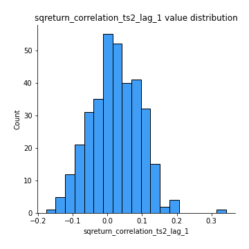
## Feature : sqreturn_correlation_ts2_lag_2
- **Feature type** : continous
- **Missing** : 0.0%
- **Unique** : 347
- **Count** :347.0
- **Mean** :0.011539553007431914
- **Std** :0.0704276201093286
- **Min** :-0.2757460186107768
- **25%th Percentile** : -0.034230493475259444
- **50%th Percentile** : 0.009754098640690087
- **75%th Percentile** : 0.06214514372423367
- **Max** :0.19682647493440525

## Feature : sqreturn_correlation_ts2_lag_3
- **Feature type** : continous
- **Missing** : 0.0%
- **Unique** : 347
- **Count** :347.0
- **Mean** :0.02637325081854377
- **Std** :0.06524671075890517
- **Min** :-0.13344359675322365
- **25%th Percentile** : -0.021547344868022615
- **50%th Percentile** : 0.02701776236765343
- **75%th Percentile** : 0.07351171313015631
- **Max** :0.20308727444882477

## Feature : price2_granger_cause_price1
- **Feature type** : continous
- **Missing** : 0.0%
- **Unique** : 347
- **Count** :347.0
- **Mean** :0.24823628118979327
- **Std** :0.277450651810535
- **Min** :2.4312048970873696e-09
- **25%th Percentile** : 0.01784400575416053
- **50%th Percentile** : 0.12922421372978485
- **75%th Percentile** : 0.42113268753407385
- **Max** :0.9898380228448623

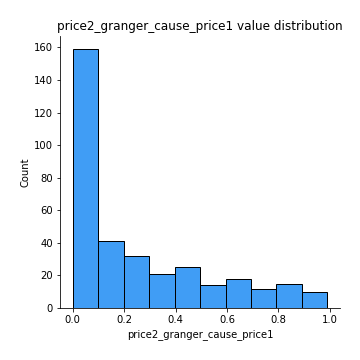
## Feature : price1_granger_cause_price2
- **Feature type** : continous
- **Missing** : 0.0%
- **Unique** : 347
- **Count** :347.0
- **Mean** :0.22552618884203277
- **Std** :0.2692647270200214
- **Min** :1.2012269232170316e-11
- **25%th Percentile** : 0.012280022400078961
- **50%th Percentile** : 0.10723997001692395
- **75%th Percentile** : 0.34560982001766183
- **Max** :0.9871292066441198

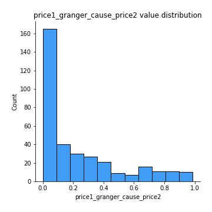

[<< Go back](../README.md)
