# Exploratory Data Analysis

[<< Go back](../README.md)
## Feature : target
- **Feature type** : categorical
- **Missing** : 0.0%
- **Unique** : 2
- **Count** :347
- **Unique** :2
- **Top** :simulated
- **Freq** :178

## Feature : return_mean1
- **Feature type** : continous
- **Missing** : 0.0%
- **Unique** : 347
- **Count** :347.0
- **Mean** :-0.14957809913074985
- **Std** :0.23024744725502738
- **Min** :-0.8377301456231564
- **25%th Percentile** : -0.32536449256849365
- **50%th Percentile** : -0.15164227826220028
- **75%th Percentile** : 0.059920816536121246
- **Max** :0.3602793017097547

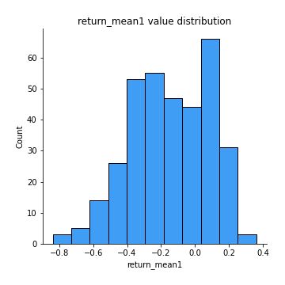
## Feature : return_mean2
- **Feature type** : continous
- **Missing** : 0.0%
- **Unique** : 347
- **Count** :347.0
- **Mean** :0.15932007700565254
- **Std** :0.16950853725111648
- **Min** :-0.3393917268522109
- **25%th Percentile** : 0.031190940928677073
- **50%th Percentile** : 0.16997361271372055
- **75%th Percentile** : 0.2892880685048169
- **Max** :0.6801605239983173

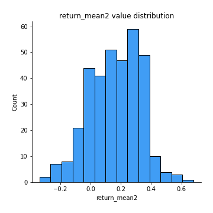
## Feature : return_sd1
- **Feature type** : continous
- **Missing** : 0.0%
- **Unique** : 347
- **Count** :347.0
- **Mean** :2.339676960994875
- **Std** :1.0471013709065704
- **Min** :0.8102430347636637
- **25%th Percentile** : 1.5039702951639091
- **50%th Percentile** : 2.075440208185543
- **75%th Percentile** : 2.964165468888943
- **Max** :6.213049189677184

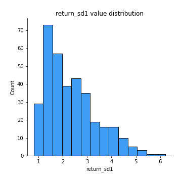
## Feature : return_sd2
- **Feature type** : continous
- **Missing** : 0.0%
- **Unique** : 347
- **Count** :347.0
- **Mean** :1.8301074913091133
- **Std** :0.6890073329985117
- **Min** :0.6874437766035968
- **25%th Percentile** : 1.3798779738985376
- **50%th Percentile** : 1.6638940376711142
- **75%th Percentile** : 2.128347845023521
- **Max** :4.627776176848633

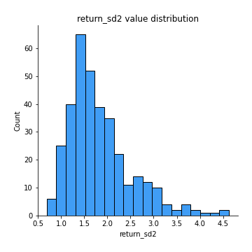
## Feature : return_skew1
- **Feature type** : continous
- **Missing** : 0.0%
- **Unique** : 347
- **Count** :347.0
- **Mean** :-0.30995044614018713
- **Std** :0.7576776127417844
- **Min** :-4.239645236578449
- **25%th Percentile** : -0.5531397427319804
- **50%th Percentile** : -0.28345473308491115
- **75%th Percentile** : 0.033180885323175126
- **Max** :2.351757728252051

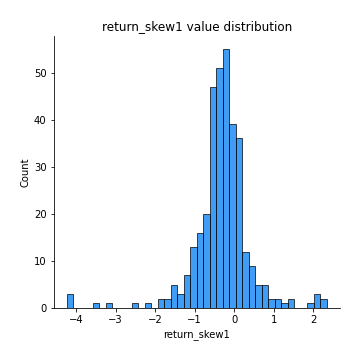
## Feature : return_skew2
- **Feature type** : continous
- **Missing** : 0.0%
- **Unique** : 347
- **Count** :347.0
- **Mean** :-0.440146803634963
- **Std** :1.0784973156102333
- **Min** :-7.3762354994385335
- **25%th Percentile** : -0.6821353302334936
- **50%th Percentile** : -0.3074025557329275
- **75%th Percentile** : 0.005917479804627035
- **Max** :4.1920266082732045

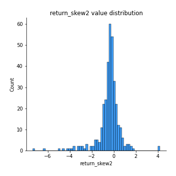
## Feature : return_kurtosis1
- **Feature type** : continous
- **Missing** : 0.0%
- **Unique** : 347
- **Count** :347.0
- **Mean** :4.046241324052593
- **Std** :5.305848038420876
- **Min** :0.13167949434187287
- **25%th Percentile** : 1.5584297883239544
- **50%th Percentile** : 2.336889103494937
- **75%th Percentile** : 4.167165705619172
- **Max** :40.485294874464934

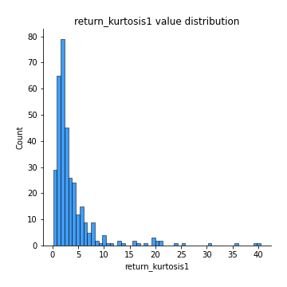
## Feature : return_kurtosis2
- **Feature type** : continous
- **Missing** : 0.0%
- **Unique** : 347
- **Count** :347.0
- **Mean** :6.055298586013465
- **Std** :9.539158752104852
- **Min** :0.30940620859925794
- **25%th Percentile** : 1.9720860031364114
- **50%th Percentile** : 3.307319298596536
- **75%th Percentile** : 5.368942515889825
- **Max** :94.01659180149953

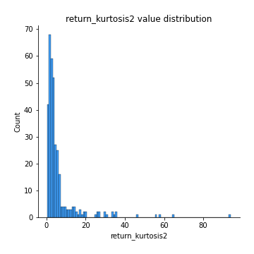
## Feature : return_autocorrelation_1_lag1
- **Feature type** : continous
- **Missing** : 0.0%
- **Unique** : 347
- **Count** :347.0
- **Mean** :-0.013371587074464663
- **Std** :0.07933372839229538
- **Min** :-0.22092703985254689
- **25%th Percentile** : -0.06580536866580061
- **50%th Percentile** : -0.018567471360587295
- **75%th Percentile** : 0.037529423989512645
- **Max** :0.2418178426857857

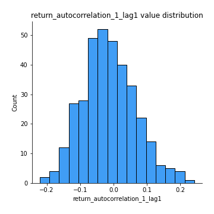
## Feature : return_autocorrelation_1_lag2
- **Feature type** : continous
- **Missing** : 0.0%
- **Unique** : 347
- **Count** :347.0
- **Mean** :-0.010137838674741167
- **Std** :0.07843199506801143
- **Min** :-0.2643144501590049
- **25%th Percentile** : -0.05688277144863779
- **50%th Percentile** : -0.012622850333547112
- **75%th Percentile** : 0.0440962057936949
- **Max** :0.25761603736089644

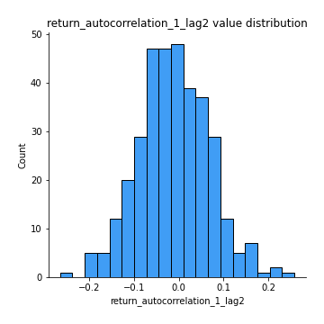
## Feature : return_autocorrelation_1_lag3
- **Feature type** : continous
- **Missing** : 0.0%
- **Unique** : 347
- **Count** :347.0
- **Mean** :0.002876989959350122
- **Std** :0.07015278932989778
- **Min** :-0.19849409783143923
- **25%th Percentile** : -0.04774481923180787
- **50%th Percentile** : 0.0101898590016799
- **75%th Percentile** : 0.04625471324158989
- **Max** :0.2068572569957377

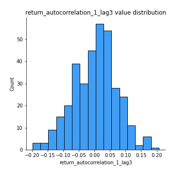
## Feature : return_autocorrelation_2_lag1
- **Feature type** : continous
- **Missing** : 0.0%
- **Unique** : 347
- **Count** :347.0
- **Mean** :-0.006796403308451327
- **Std** :0.075265713610359
- **Min** :-0.20705068365942722
- **25%th Percentile** : -0.05595967492264298
- **50%th Percentile** : -0.0052943545903202365
- **75%th Percentile** : 0.04581534115986734
- **Max** :0.2537705377487695

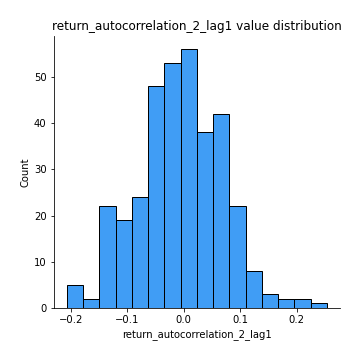
## Feature : return_autocorrelation_2_lag2
- **Feature type** : continous
- **Missing** : 0.0%
- **Unique** : 347
- **Count** :347.0
- **Mean** :-0.014210397502643078
- **Std** :0.08429350895814806
- **Min** :-0.2944455471433041
- **25%th Percentile** : -0.06545987731666547
- **50%th Percentile** : -0.016281515812269703
- **75%th Percentile** : 0.04077671907459214
- **Max** :0.30401493563947424

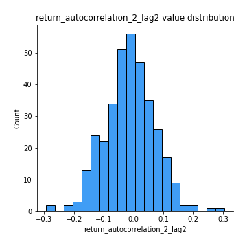
## Feature : return_autocorrelation_2_lag3
- **Feature type** : continous
- **Missing** : 0.0%
- **Unique** : 347
- **Count** :347.0
- **Mean** :0.0014400431724696015
- **Std** :0.08114925897348739
- **Min** :-0.2628532028536796
- **25%th Percentile** : -0.04781022311984602
- **50%th Percentile** : 0.0034350602115481004
- **75%th Percentile** : 0.05387288098932716
- **Max** :0.2635898385320143

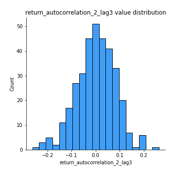
## Feature : return_correlation_ts1_lag_0
- **Feature type** : continous
- **Missing** : 0.0%
- **Unique** : 347
- **Count** :347.0
- **Mean** :0.4303745007848551
- **Std** :0.19493353602773564
- **Min** :-0.10256711281206837
- **25%th Percentile** : 0.3063480032410188
- **50%th Percentile** : 0.4715074377026294
- **75%th Percentile** : 0.5811844356880972
- **Max** :0.9937227277077512

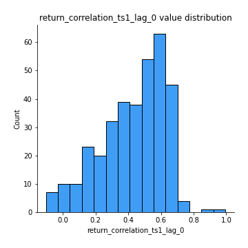
## Feature : return_correlation_ts1_lag_1
- **Feature type** : continous
- **Missing** : 0.0%
- **Unique** : 347
- **Count** :347.0
- **Mean** :-0.008835771112812552
- **Std** :0.0717917609310168
- **Min** :-0.2360855917342927
- **25%th Percentile** : -0.05670023277660864
- **50%th Percentile** : -0.002874490481587111
- **75%th Percentile** : 0.03914610091084329
- **Max** :0.20238609963687132

## Feature : return_correlation_ts1_lag_2
- **Feature type** : continous
- **Missing** : 0.0%
- **Unique** : 347
- **Count** :347.0
- **Mean** :-0.007664672970109687
- **Std** :0.07546485398794293
- **Min** :-0.24729613900224084
- **25%th Percentile** : -0.059643781022938214
- **50%th Percentile** : -0.011391081989023938
- **75%th Percentile** : 0.040384849756061575
- **Max** :0.22548286992268862

## Feature : return_correlation_ts1_lag_3
- **Feature type** : continous
- **Missing** : 0.0%
- **Unique** : 347
- **Count** :347.0
- **Mean** :0.001714772055021004
- **Std** :0.07635998467570214
- **Min** :-0.2904679559112546
- **25%th Percentile** : -0.050498643425969145
- **50%th Percentile** : 0.010992290482860753
- **75%th Percentile** : 0.05333400872086176
- **Max** :0.23808054096877584

## Feature : return_correlation_ts2_lag_1
- **Feature type** : continous
- **Missing** : 0.0%
- **Unique** : 347
- **Count** :347.0
- **Mean** :-0.0028729115568134123
- **Std** :0.07480122246497034
- **Min** :-0.1790039401045436
- **25%th Percentile** : -0.05511492467750948
- **50%th Percentile** : -0.00409768503356678
- **75%th Percentile** : 0.04206580443906875
- **Max** :0.3425036902091001

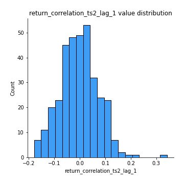
## Feature : return_correlation_ts2_lag_2
- **Feature type** : continous
- **Missing** : 0.0%
- **Unique** : 347
- **Count** :347.0
- **Mean** :-0.01022690176783948
- **Std** :0.07488432253348563
- **Min** :-0.2926154528673337
- **25%th Percentile** : -0.0602675450028281
- **50%th Percentile** : -0.00556168107826153
- **75%th Percentile** : 0.03702912331410227
- **Max** :0.21534483364984983

## Feature : return_correlation_ts2_lag_3
- **Feature type** : continous
- **Missing** : 0.0%
- **Unique** : 347
- **Count** :347.0
- **Mean** :0.006982853688231948
- **Std** :0.06940470709815477
- **Min** :-0.257724452398853
- **25%th Percentile** : -0.039265968362007006
- **50%th Percentile** : 0.00812506523010631
- **75%th Percentile** : 0.06193140869197241
- **Max** :0.16630483019985057

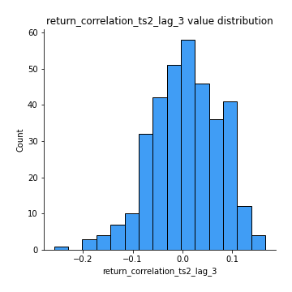
## Feature : sqreturn_autocorrelation_ts1_lag1
- **Feature type** : continous
- **Missing** : 0.0%
- **Unique** : 347
- **Count** :347.0
- **Mean** :0.12261567398457361
- **Std** :0.11110154453698187
- **Min** :-0.06641170505474243
- **25%th Percentile** : 0.03516583588552954
- **50%th Percentile** : 0.10191175779994939
- **75%th Percentile** : 0.1864459216779487
- **Max** :0.49917033944990924

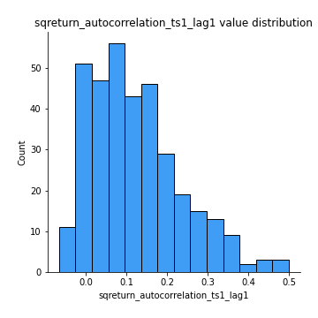
## Feature : sqreturn_autocorrelation_ts1_lag2
- **Feature type** : continous
- **Missing** : 0.0%
- **Unique** : 347
- **Count** :347.0
- **Mean** :0.1113169096319328
- **Std** :0.11201137970295279
- **Min** :-0.06594883862904495
- **25%th Percentile** : 0.016460243930219734
- **50%th Percentile** : 0.09774892550909192
- **75%th Percentile** : 0.17556891835621527
- **Max** :0.5504309904106107

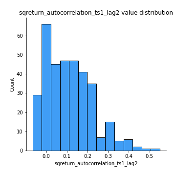
## Feature : sqreturn_autocorrelation_ts1_lag3
- **Feature type** : continous
- **Missing** : 0.0%
- **Unique** : 347
- **Count** :347.0
- **Mean** :0.09333280295176197
- **Std** :0.10503706505485358
- **Min** :-0.07624495748065484
- **25%th Percentile** : 0.015712285779702073
- **50%th Percentile** : 0.06807495514221924
- **75%th Percentile** : 0.14842847038376059
- **Max** :0.485544541184812

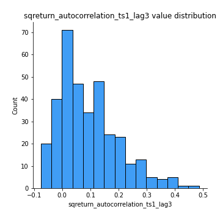
## Feature : sqreturn_autocorrelation_ts2_lag1
- **Feature type** : continous
- **Missing** : 0.0%
- **Unique** : 347
- **Count** :347.0
- **Mean** :0.12790828386756292
- **Std** :0.1189435271240231
- **Min** :-0.07808490782609163
- **25%th Percentile** : 0.03716382826608201
- **50%th Percentile** : 0.110671069681701
- **75%th Percentile** : 0.2099723307575858
- **Max** :0.5887050503105435

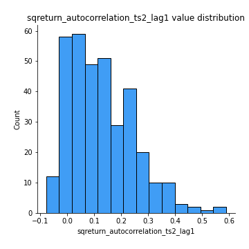
## Feature : sqreturn_autocorrelation_ts2_lag2
- **Feature type** : continous
- **Missing** : 0.0%
- **Unique** : 347
- **Count** :347.0
- **Mean** :0.10598773298061831
- **Std** :0.11644926659571304
- **Min** :-0.10054631197559977
- **25%th Percentile** : 0.006718729484755881
- **50%th Percentile** : 0.08267656315450092
- **75%th Percentile** : 0.1842473208881134
- **Max** :0.5709212182641914

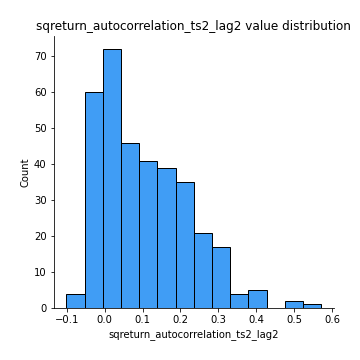
## Feature : sqreturn_autocorrelation_ts2_lag3
- **Feature type** : continous
- **Missing** : 0.0%
- **Unique** : 347
- **Count** :347.0
- **Mean** :0.10195935492041443
- **Std** :0.11826893756135745
- **Min** :-0.08011187436939253
- **25%th Percentile** : 0.003079169381884501
- **50%th Percentile** : 0.08014849367096494
- **75%th Percentile** : 0.1703558904746988
- **Max** :0.4688796482669367

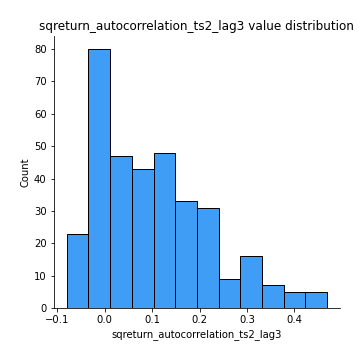
## Feature : sqreturn_correlation_ts1_lag_0
- **Feature type** : continous
- **Missing** : 0.0%
- **Unique** : 347
- **Count** :347.0
- **Mean** :0.4303745007848551
- **Std** :0.19493353602773564
- **Min** :-0.10256711281206837
- **25%th Percentile** : 0.3063480032410188
- **50%th Percentile** : 0.4715074377026294
- **75%th Percentile** : 0.5811844356880972
- **Max** :0.9937227277077512

## Feature : sqreturn_correlation_ts1_lag_1
- **Feature type** : continous
- **Missing** : 0.0%
- **Unique** : 347
- **Count** :347.0
- **Mean** :-0.008835771112812552
- **Std** :0.0717917609310168
- **Min** :-0.2360855917342927
- **25%th Percentile** : -0.05670023277660864
- **50%th Percentile** : -0.002874490481587111
- **75%th Percentile** : 0.03914610091084329
- **Max** :0.20238609963687132

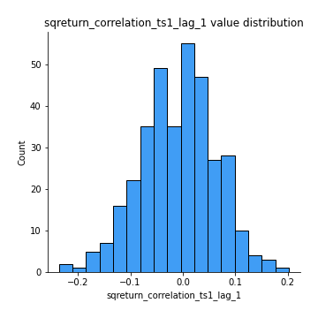
## Feature : sqreturn_correlation_ts1_lag_2
- **Feature type** : continous
- **Missing** : 0.0%
- **Unique** : 347
- **Count** :347.0
- **Mean** :-0.007664672970109687
- **Std** :0.07546485398794293
- **Min** :-0.24729613900224084
- **25%th Percentile** : -0.059643781022938214
- **50%th Percentile** : -0.011391081989023938
- **75%th Percentile** : 0.040384849756061575
- **Max** :0.22548286992268862

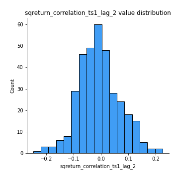
## Feature : sqreturn_correlation_ts1_lag_3
- **Feature type** : continous
- **Missing** : 0.0%
- **Unique** : 347
- **Count** :347.0
- **Mean** :0.001714772055021004
- **Std** :0.07635998467570214
- **Min** :-0.2904679559112546
- **25%th Percentile** : -0.050498643425969145
- **50%th Percentile** : 0.010992290482860753
- **75%th Percentile** : 0.05333400872086176
- **Max** :0.23808054096877584

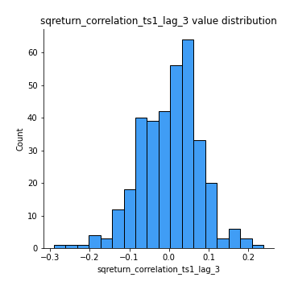
## Feature : sqreturn_correlation_ts2_lag_1
- **Feature type** : continous
- **Missing** : 0.0%
- **Unique** : 347
- **Count** :347.0
- **Mean** :-0.0028729115568134123
- **Std** :0.07480122246497034
- **Min** :-0.1790039401045436
- **25%th Percentile** : -0.05511492467750948
- **50%th Percentile** : -0.00409768503356678
- **75%th Percentile** : 0.04206580443906875
- **Max** :0.3425036902091001

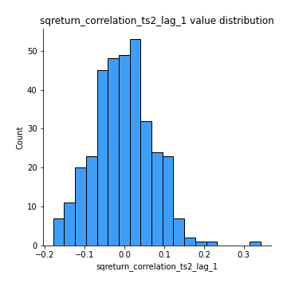
## Feature : sqreturn_correlation_ts2_lag_2
- **Feature type** : continous
- **Missing** : 0.0%
- **Unique** : 347
- **Count** :347.0
- **Mean** :-0.01022690176783948
- **Std** :0.07488432253348563
- **Min** :-0.2926154528673337
- **25%th Percentile** : -0.0602675450028281
- **50%th Percentile** : -0.00556168107826153
- **75%th Percentile** : 0.03702912331410227
- **Max** :0.21534483364984983

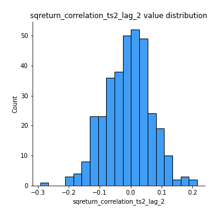
## Feature : sqreturn_correlation_ts2_lag_3
- **Feature type** : continous
- **Missing** : 0.0%
- **Unique** : 347
- **Count** :347.0
- **Mean** :0.006982853688231948
- **Std** :0.06940470709815477
- **Min** :-0.257724452398853
- **25%th Percentile** : -0.039265968362007006
- **50%th Percentile** : 0.00812506523010631
- **75%th Percentile** : 0.06193140869197241
- **Max** :0.16630483019985057

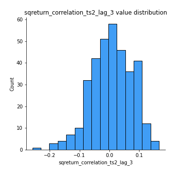
## Feature : price2_granger_cause_price1
- **Feature type** : continous
- **Missing** : 0.0%
- **Unique** : 347
- **Count** :347.0
- **Mean** :0.21339823333296132
- **Std** :0.2673250491293206
- **Min** :4.933484175593378e-14
- **25%th Percentile** : 0.009858411608438566
- **50%th Percentile** : 0.07996969105027094
- **75%th Percentile** : 0.3459730122019712
- **Max** :0.9898380228448623

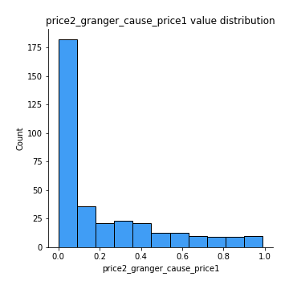
## Feature : price1_granger_cause_price2
- **Feature type** : continous
- **Missing** : 0.0%
- **Unique** : 347
- **Count** :347.0
- **Mean** :0.2085106194874911
- **Std** :0.2619161707977256
- **Min** :1.83928054727251e-12
- **25%th Percentile** : 0.01189164148722311
- **50%th Percentile** : 0.08436851192304747
- **75%th Percentile** : 0.3241713045871413
- **Max** :0.9871292066441198

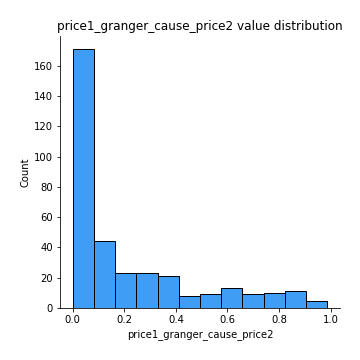

[<< Go back](../README.md)
