# Exploratory Data Analysis

[<< Go back](../README.md)
## Feature : target
- **Feature type** : categorical
- **Missing** : 0.0%
- **Unique** : 2
- **Count** :347
- **Unique** :2
- **Top** :real
- **Freq** :175

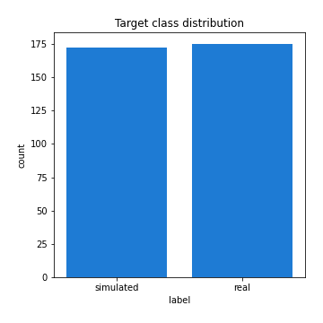
## Feature : return_mean1
- **Feature type** : continous
- **Missing** : 0.0%
- **Unique** : 347
- **Count** :347.0
- **Mean** :-0.13877199634515563
- **Std** :0.22327704397659853
- **Min** :-0.789920645147994
- **25%th Percentile** : -0.31807045247214977
- **50%th Percentile** : -0.13293450783960195
- **75%th Percentile** : 0.05440925885935104
- **Max** :0.3602793017097547

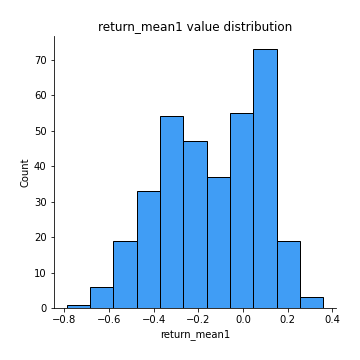
## Feature : return_mean2
- **Feature type** : continous
- **Missing** : 0.0%
- **Unique** : 347
- **Count** :347.0
- **Mean** :0.1517653458340974
- **Std** :0.1718905557945201
- **Min** :-0.3439835398279146
- **25%th Percentile** : 0.02380474827712021
- **50%th Percentile** : 0.16304471054935343
- **75%th Percentile** : 0.28404416380565467
- **Max** :0.6801605239983173

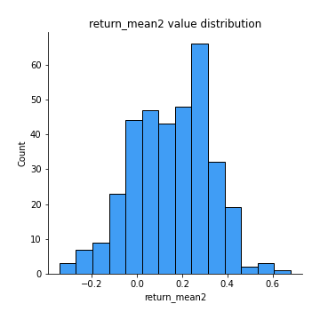
## Feature : return_sd1
- **Feature type** : continous
- **Missing** : 0.0%
- **Unique** : 347
- **Count** :347.0
- **Mean** :2.3861315632357947
- **Std** :1.1530903686878593
- **Min** :0.6693745743382534
- **25%th Percentile** : 1.512618421153316
- **50%th Percentile** : 2.0461631026809335
- **75%th Percentile** : 3.122134477592733
- **Max** :6.207346762465775

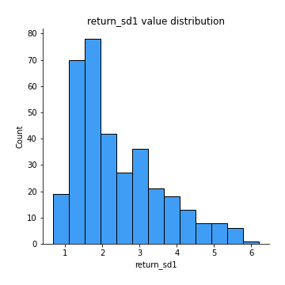
## Feature : return_sd2
- **Feature type** : continous
- **Missing** : 0.0%
- **Unique** : 347
- **Count** :347.0
- **Mean** :1.9330310717831818
- **Std** :0.7888636541380827
- **Min** :0.8198779632289204
- **25%th Percentile** : 1.3841438034845392
- **50%th Percentile** : 1.7101442332082009
- **75%th Percentile** : 2.3047535047879437
- **Max** :4.901892656799696

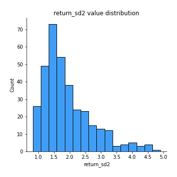
## Feature : return_skew1
- **Feature type** : continous
- **Missing** : 0.0%
- **Unique** : 347
- **Count** :347.0
- **Mean** :-0.3256650824276929
- **Std** :0.7611616591645585
- **Min** :-4.239645236578449
- **25%th Percentile** : -0.5587250241593356
- **50%th Percentile** : -0.29927422942386656
- **75%th Percentile** : 0.00570090130185063
- **Max** :2.3044235031125564

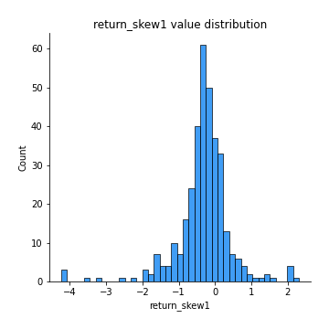
## Feature : return_skew2
- **Feature type** : continous
- **Missing** : 0.0%
- **Unique** : 347
- **Count** :347.0
- **Mean** :-0.43920800172101326
- **Std** :1.0518536257608007
- **Min** :-7.3762354994385335
- **25%th Percentile** : -0.6213364456707033
- **50%th Percentile** : -0.30532823056772407
- **75%th Percentile** : -0.000906322392115013
- **Max** :4.0310261345618

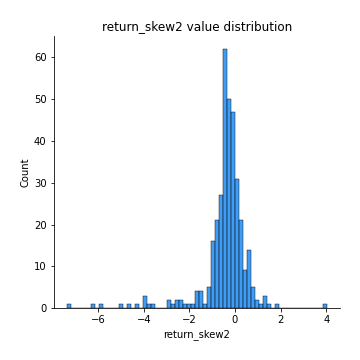
## Feature : return_kurtosis1
- **Feature type** : continous
- **Missing** : 0.0%
- **Unique** : 347
- **Count** :347.0
- **Mean** :4.14103758807914
- **Std** :5.312656213256562
- **Min** :-0.2749438153748569
- **25%th Percentile** : 1.4910165469395706
- **50%th Percentile** : 2.394223548299957
- **75%th Percentile** : 4.678662591304999
- **Max** :40.485294874464934

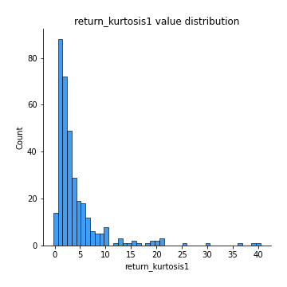
## Feature : return_kurtosis2
- **Feature type** : continous
- **Missing** : 0.0%
- **Unique** : 347
- **Count** :347.0
- **Mean** :5.599040862041411
- **Std** :9.55602099211147
- **Min** :-0.1693240760286967
- **25%th Percentile** : 1.6455616929342238
- **50%th Percentile** : 2.9408563077195926
- **75%th Percentile** : 5.3741447232390005
- **Max** :94.01659180149953

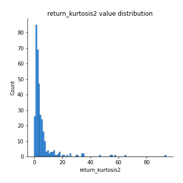
## Feature : return_autocorrelation_1_lag1
- **Feature type** : continous
- **Missing** : 0.0%
- **Unique** : 347
- **Count** :347.0
- **Mean** :-0.011758203028057017
- **Std** :0.07561680110576552
- **Min** :-0.21178011493369323
- **25%th Percentile** : -0.06496721000182719
- **50%th Percentile** : -0.011841111350130593
- **75%th Percentile** : 0.03745497150875372
- **Max** :0.25885915495016665

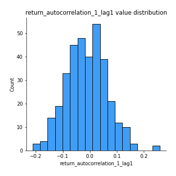
## Feature : return_autocorrelation_1_lag2
- **Feature type** : continous
- **Missing** : 0.0%
- **Unique** : 347
- **Count** :347.0
- **Mean** :-0.017318545673068522
- **Std** :0.07655155061708864
- **Min** :-0.35472027123513117
- **25%th Percentile** : -0.06587957829467911
- **50%th Percentile** : -0.018242894956185123
- **75%th Percentile** : 0.030077359881611896
- **Max** :0.21123611097039302

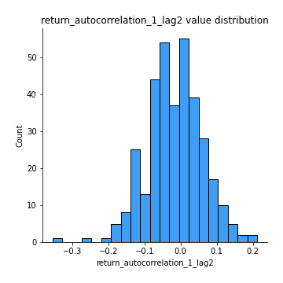
## Feature : return_autocorrelation_1_lag3
- **Feature type** : continous
- **Missing** : 0.0%
- **Unique** : 347
- **Count** :347.0
- **Mean** :0.0012702547828947822
- **Std** :0.07535967339507456
- **Min** :-0.27117539541843366
- **25%th Percentile** : -0.04013637007209257
- **50%th Percentile** : 0.00823625115740623
- **75%th Percentile** : 0.047823131648029295
- **Max** :0.2806541483771771

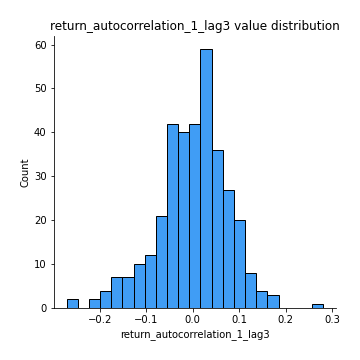
## Feature : return_autocorrelation_2_lag1
- **Feature type** : continous
- **Missing** : 0.0%
- **Unique** : 347
- **Count** :347.0
- **Mean** :-0.00458643850771576
- **Std** :0.07714215835553599
- **Min** :-0.18459651679588007
- **25%th Percentile** : -0.05595967492264298
- **50%th Percentile** : -0.006088846956202335
- **75%th Percentile** : 0.04974185148470629
- **Max** :0.22044402144192043

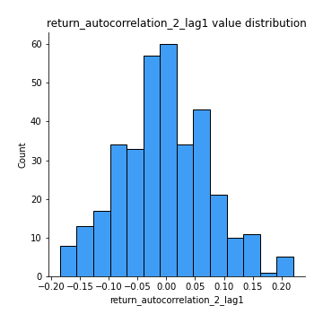
## Feature : return_autocorrelation_2_lag2
- **Feature type** : continous
- **Missing** : 0.0%
- **Unique** : 347
- **Count** :347.0
- **Mean** :-0.015249047700303942
- **Std** :0.07667992187372343
- **Min** :-0.22409986669909787
- **25%th Percentile** : -0.0654765409917891
- **50%th Percentile** : -0.015384034509447116
- **75%th Percentile** : 0.03489341144218422
- **Max** :0.2368502604426998

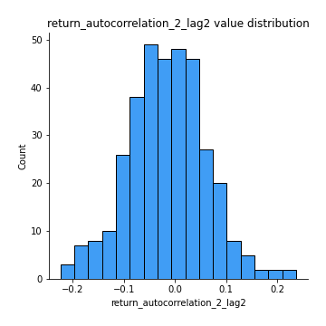
## Feature : return_autocorrelation_2_lag3
- **Feature type** : continous
- **Missing** : 0.0%
- **Unique** : 347
- **Count** :347.0
- **Mean** :0.003999039382536733
- **Std** :0.07367278250836573
- **Min** :-0.254525089986523
- **25%th Percentile** : -0.041135447818023994
- **50%th Percentile** : 0.008054458510966003
- **75%th Percentile** : 0.05323955252211522
- **Max** :0.20205753622966244

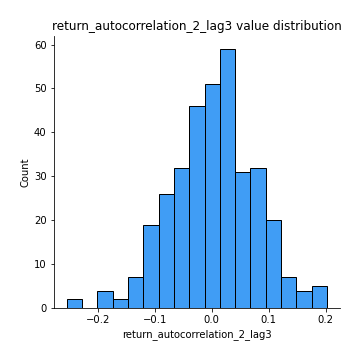
## Feature : return_correlation_ts1_lag_0
- **Feature type** : continous
- **Missing** : 0.0%
- **Unique** : 347
- **Count** :347.0
- **Mean** :0.42777837962837895
- **Std** :0.19289078168309995
- **Min** :-0.14959739933231847
- **25%th Percentile** : 0.2964812707898149
- **50%th Percentile** : 0.46757259378790783
- **75%th Percentile** : 0.5878185749304363
- **Max** :0.7410304391727223

## Feature : return_correlation_ts1_lag_1
- **Feature type** : continous
- **Missing** : 0.0%
- **Unique** : 347
- **Count** :347.0
- **Mean** :-0.0027394260179120318
- **Std** :0.07298916527998874
- **Min** :-0.24176771254029947
- **25%th Percentile** : -0.05149360561526972
- **50%th Percentile** : 0.0023288236400064405
- **75%th Percentile** : 0.043719186448588854
- **Max** :0.21599261663841215

## Feature : return_correlation_ts1_lag_2
- **Feature type** : continous
- **Missing** : 0.0%
- **Unique** : 347
- **Count** :347.0
- **Mean** :-0.01134550704496266
- **Std** :0.07053859779960378
- **Min** :-0.21940286200222403
- **25%th Percentile** : -0.05953287317470282
- **50%th Percentile** : -0.011787642425573182
- **75%th Percentile** : 0.03845360741231292
- **Max** :0.194183726461614

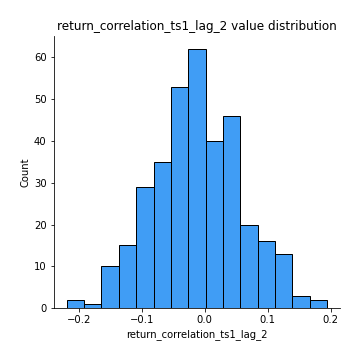
## Feature : return_correlation_ts1_lag_3
- **Feature type** : continous
- **Missing** : 0.0%
- **Unique** : 347
- **Count** :347.0
- **Mean** :-0.0020892608755954454
- **Std** :0.07629231776484134
- **Min** :-0.3008474124447224
- **25%th Percentile** : -0.0462232541870259
- **50%th Percentile** : -0.0017610186700292947
- **75%th Percentile** : 0.0454686230775173
- **Max** :0.24616224808961915

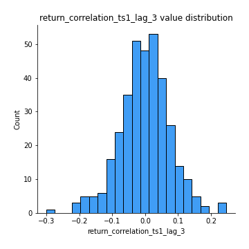
## Feature : return_correlation_ts2_lag_1
- **Feature type** : continous
- **Missing** : 0.0%
- **Unique** : 347
- **Count** :347.0
- **Mean** :-0.0025704244267232743
- **Std** :0.07794812784015673
- **Min** :-0.19077610134081202
- **25%th Percentile** : -0.057510777841802745
- **50%th Percentile** : -0.004501844187067588
- **75%th Percentile** : 0.04756341084713955
- **Max** :0.3425036902091001

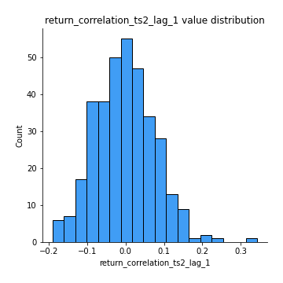
## Feature : return_correlation_ts2_lag_2
- **Feature type** : continous
- **Missing** : 0.0%
- **Unique** : 347
- **Count** :347.0
- **Mean** :-0.008118927625660728
- **Std** :0.07425475869065655
- **Min** :-0.2757460186107768
- **25%th Percentile** : -0.052999824830140374
- **50%th Percentile** : -0.004858799212834895
- **75%th Percentile** : 0.04194210965316083
- **Max** :0.19240024336705822

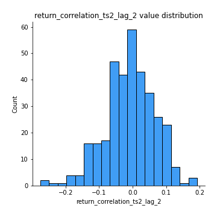
## Feature : return_correlation_ts2_lag_3
- **Feature type** : continous
- **Missing** : 0.0%
- **Unique** : 347
- **Count** :347.0
- **Mean** :0.009980479308128566
- **Std** :0.07028692894203763
- **Min** :-0.2303839186515268
- **25%th Percentile** : -0.03079466161426523
- **50%th Percentile** : 0.007815568191263807
- **75%th Percentile** : 0.054657730360321594
- **Max** :0.18930258790084695

## Feature : sqreturn_autocorrelation_ts1_lag1
- **Feature type** : continous
- **Missing** : 0.0%
- **Unique** : 347
- **Count** :347.0
- **Mean** :0.11304144691613649
- **Std** :0.10058901852906002
- **Min** :-0.06641170505474243
- **25%th Percentile** : 0.03331912017762827
- **50%th Percentile** : 0.09967633067088186
- **75%th Percentile** : 0.17448167886757787
- **Max** :0.4374750770863889

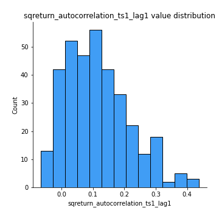
## Feature : sqreturn_autocorrelation_ts1_lag2
- **Feature type** : continous
- **Missing** : 0.0%
- **Unique** : 347
- **Count** :347.0
- **Mean** :0.09689058518923678
- **Std** :0.09642936431412394
- **Min** :-0.06594883862904495
- **25%th Percentile** : 0.016243903241423593
- **50%th Percentile** : 0.08369077745628623
- **75%th Percentile** : 0.15747725641058946
- **Max** :0.5055054247004069

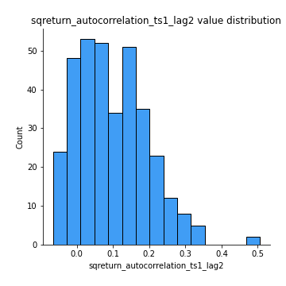
## Feature : sqreturn_autocorrelation_ts1_lag3
- **Feature type** : continous
- **Missing** : 0.0%
- **Unique** : 347
- **Count** :347.0
- **Mean** :0.08599215573120432
- **Std** :0.10250097199692185
- **Min** :-0.07624495748065484
- **25%th Percentile** : 0.00640834096206425
- **50%th Percentile** : 0.06487491015259411
- **75%th Percentile** : 0.1467851658539197
- **Max** :0.45417944274528316

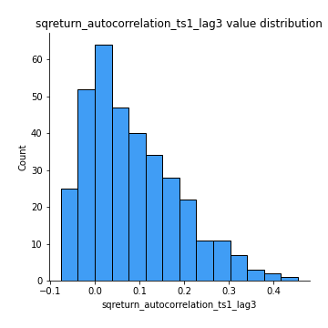
## Feature : sqreturn_autocorrelation_ts2_lag1
- **Feature type** : continous
- **Missing** : 0.0%
- **Unique** : 347
- **Count** :347.0
- **Mean** :0.12880988180569206
- **Std** :0.11702244641671294
- **Min** :-0.07808490782609163
- **25%th Percentile** : 0.03716382826608201
- **50%th Percentile** : 0.10871504905998833
- **75%th Percentile** : 0.21858938001547573
- **Max** :0.5617555592986861

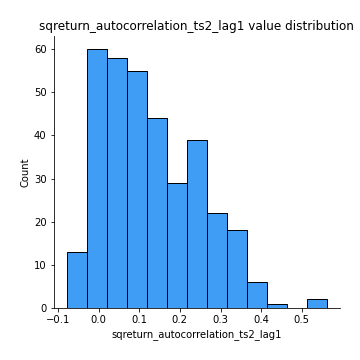
## Feature : sqreturn_autocorrelation_ts2_lag2
- **Feature type** : continous
- **Missing** : 0.0%
- **Unique** : 347
- **Count** :347.0
- **Mean** :0.10789256225122797
- **Std** :0.11767616418678442
- **Min** :-0.10054631197559977
- **25%th Percentile** : 0.007444786230794046
- **50%th Percentile** : 0.07856806589487582
- **75%th Percentile** : 0.18641239921115557
- **Max** :0.5209287793748739

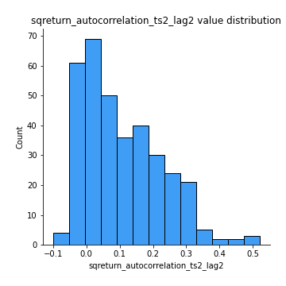
## Feature : sqreturn_autocorrelation_ts2_lag3
- **Feature type** : continous
- **Missing** : 0.0%
- **Unique** : 347
- **Count** :347.0
- **Mean** :0.09274106762540446
- **Std** :0.10999853466546791
- **Min** :-0.09756858950376449
- **25%th Percentile** : -0.0032574459753844705
- **50%th Percentile** : 0.06685207977237652
- **75%th Percentile** : 0.17811700740774575
- **Max** :0.4291505753795206

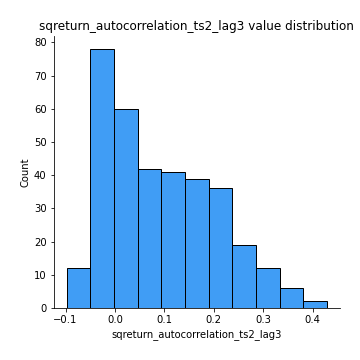
## Feature : sqreturn_correlation_ts1_lag_0
- **Feature type** : continous
- **Missing** : 0.0%
- **Unique** : 347
- **Count** :347.0
- **Mean** :0.42777837962837895
- **Std** :0.19289078168309995
- **Min** :-0.14959739933231847
- **25%th Percentile** : 0.2964812707898149
- **50%th Percentile** : 0.46757259378790783
- **75%th Percentile** : 0.5878185749304363
- **Max** :0.7410304391727223

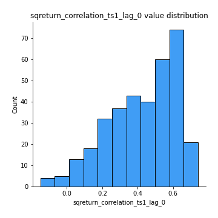
## Feature : sqreturn_correlation_ts1_lag_1
- **Feature type** : continous
- **Missing** : 0.0%
- **Unique** : 347
- **Count** :347.0
- **Mean** :-0.0027394260179120318
- **Std** :0.07298916527998874
- **Min** :-0.24176771254029947
- **25%th Percentile** : -0.05149360561526972
- **50%th Percentile** : 0.0023288236400064405
- **75%th Percentile** : 0.043719186448588854
- **Max** :0.21599261663841215

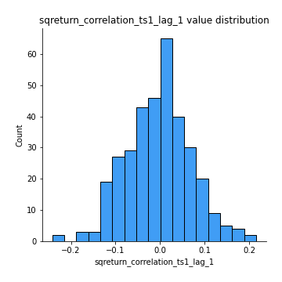
## Feature : sqreturn_correlation_ts1_lag_2
- **Feature type** : continous
- **Missing** : 0.0%
- **Unique** : 347
- **Count** :347.0
- **Mean** :-0.01134550704496266
- **Std** :0.07053859779960378
- **Min** :-0.21940286200222403
- **25%th Percentile** : -0.05953287317470282
- **50%th Percentile** : -0.011787642425573182
- **75%th Percentile** : 0.03845360741231292
- **Max** :0.194183726461614

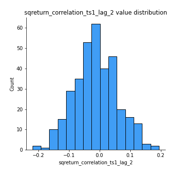
## Feature : sqreturn_correlation_ts1_lag_3
- **Feature type** : continous
- **Missing** : 0.0%
- **Unique** : 347
- **Count** :347.0
- **Mean** :-0.0020892608755954454
- **Std** :0.07629231776484134
- **Min** :-0.3008474124447224
- **25%th Percentile** : -0.0462232541870259
- **50%th Percentile** : -0.0017610186700292947
- **75%th Percentile** : 0.0454686230775173
- **Max** :0.24616224808961915

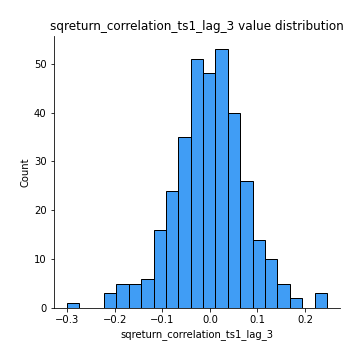
## Feature : sqreturn_correlation_ts2_lag_1
- **Feature type** : continous
- **Missing** : 0.0%
- **Unique** : 347
- **Count** :347.0
- **Mean** :-0.0025704244267232743
- **Std** :0.07794812784015673
- **Min** :-0.19077610134081202
- **25%th Percentile** : -0.057510777841802745
- **50%th Percentile** : -0.004501844187067588
- **75%th Percentile** : 0.04756341084713955
- **Max** :0.3425036902091001

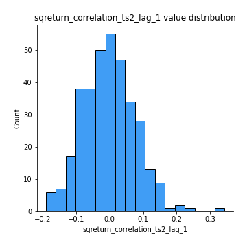
## Feature : sqreturn_correlation_ts2_lag_2
- **Feature type** : continous
- **Missing** : 0.0%
- **Unique** : 347
- **Count** :347.0
- **Mean** :-0.008118927625660728
- **Std** :0.07425475869065655
- **Min** :-0.2757460186107768
- **25%th Percentile** : -0.052999824830140374
- **50%th Percentile** : -0.004858799212834895
- **75%th Percentile** : 0.04194210965316083
- **Max** :0.19240024336705822

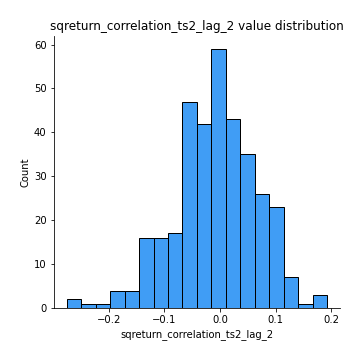
## Feature : sqreturn_correlation_ts2_lag_3
- **Feature type** : continous
- **Missing** : 0.0%
- **Unique** : 347
- **Count** :347.0
- **Mean** :0.009980479308128566
- **Std** :0.07028692894203763
- **Min** :-0.2303839186515268
- **25%th Percentile** : -0.03079466161426523
- **50%th Percentile** : 0.007815568191263807
- **75%th Percentile** : 0.054657730360321594
- **Max** :0.18930258790084695

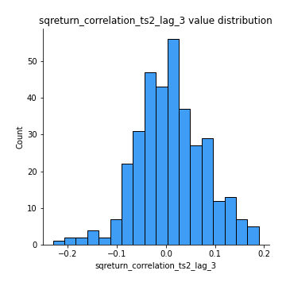
## Feature : price2_granger_cause_price1
- **Feature type** : continous
- **Missing** : 0.0%
- **Unique** : 347
- **Count** :347.0
- **Mean** :0.221750733721825
- **Std** :0.2867697938760403
- **Min** :2.4312048970873696e-09
- **25%th Percentile** : 0.008676234822712502
- **50%th Percentile** : 0.07587824748214399
- **75%th Percentile** : 0.34574501472272273
- **Max** :0.996111342020527

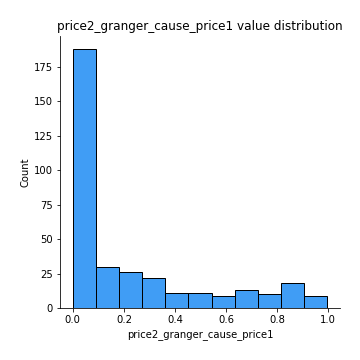
## Feature : price1_granger_cause_price2
- **Feature type** : continous
- **Missing** : 0.0%
- **Unique** : 347
- **Count** :347.0
- **Mean** :0.20988137337910232
- **Std** :0.2645119496138921
- **Min** :1.2012269232170316e-11
- **25%th Percentile** : 0.011235750239439568
- **50%th Percentile** : 0.08854426166996039
- **75%th Percentile** : 0.3189227976593193
- **Max** :0.9983986072791907

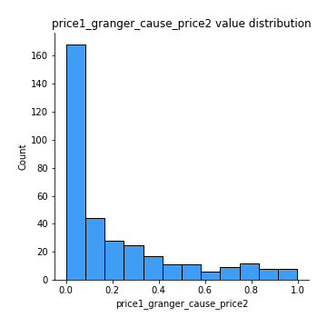

[<< Go back](../README.md)
