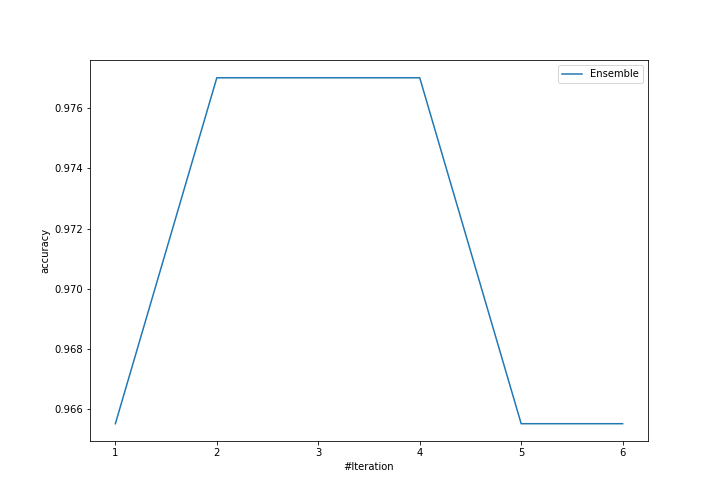
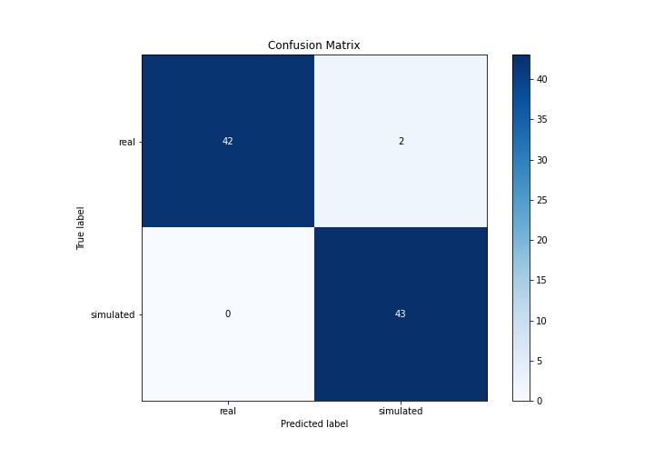
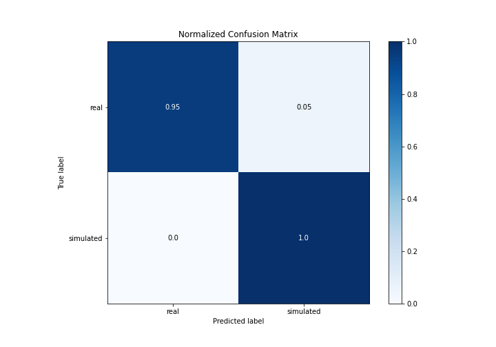
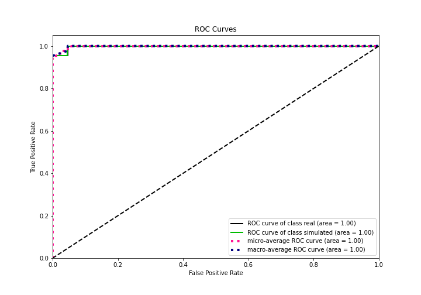
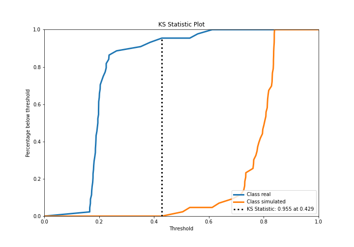
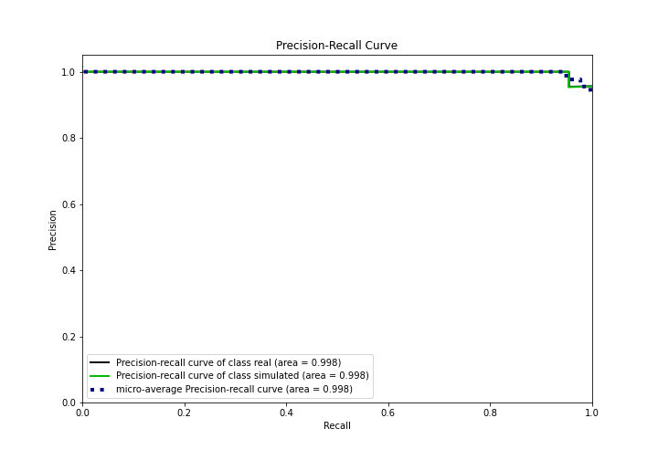
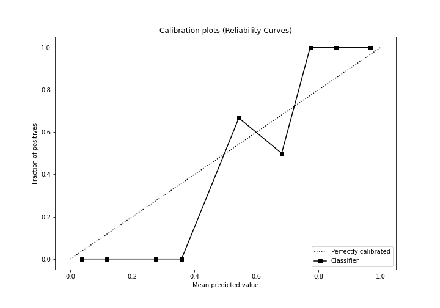
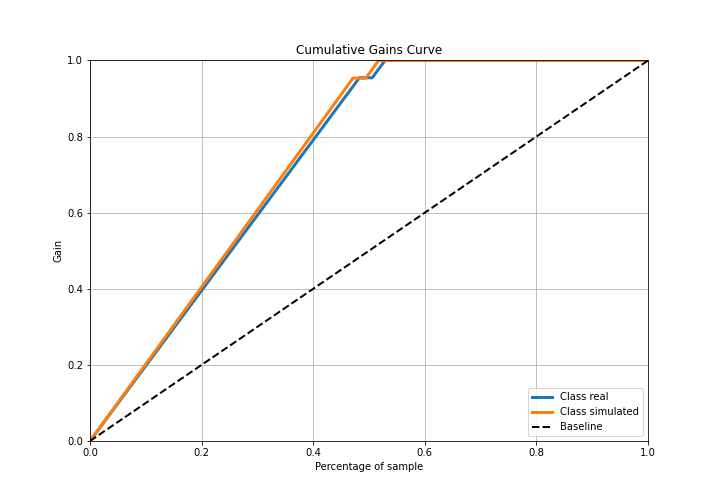
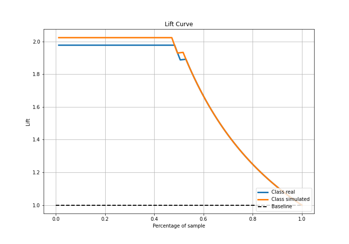

# Summary of Ensemble

[<< Go back](../README.md)

## Ensemble structure
| Model             |   Weight |
|:------------------|---------:|
| 3_Linear          |        1 |
| 4_Default_Xgboost |        1 |

## Metric details
|           |    score |   threshold |
|:----------|---------:|------------:|
| logloss   | 0.260723 |  nan        |
| auc       | 0.997886 |  nan        |
| f1        | 0.977273 |    0.504201 |
| accuracy  | 0.977011 |    0.504201 |
| precision | 1        |    0.807395 |
| recall    | 1        |    0.14911  |
| mcc       | 0.95505  |    0.504201 |

## Confusion matrix (at threshold=0.504201)
|                      |   Predicted as real |   Predicted as simulated |
|:---------------------|--------------------:|-------------------------:|
| Labeled as real      |                  42 |                        2 |
| Labeled as simulated |                   0 |                       43 |

## Learning curves

## Confusion Matrix

## Normalized Confusion Matrix

## ROC Curve

## Kolmogorov-Smirnov Statistic

## Precision-Recall Curve

## Calibration Curve

## Cumulative Gains Curve

## Lift Curve

[<< Go back](../README.md)
