# Exploratory Data Analysis

[<< Go back](../README.md)
## Feature : target
- **Feature type** : categorical
- **Missing** : 0.0%
- **Unique** : 2
- **Count** :347
- **Unique** :2
- **Top** :real
- **Freq** :183

## Feature : return_mean1
- **Feature type** : continous
- **Missing** : 0.0%
- **Unique** : 347
- **Count** :347.0
- **Mean** :-0.1378026357916016
- **Std** :0.24189075061906798
- **Min** :-0.8110147221651701
- **25%th Percentile** : -0.3252617480933352
- **50%th Percentile** : -0.10866337142591859
- **75%th Percentile** : 0.06621135022805902
- **Max** :0.41557380729163707

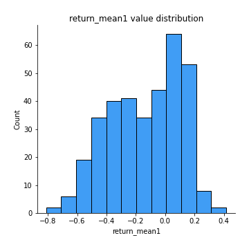
## Feature : return_mean2
- **Feature type** : continous
- **Missing** : 0.0%
- **Unique** : 347
- **Count** :347.0
- **Mean** :0.15016689807144207
- **Std** :0.17607656338326214
- **Min** :-0.3393917268522109
- **25%th Percentile** : 0.024996686073546256
- **50%th Percentile** : 0.14651459281167353
- **75%th Percentile** : 0.27557905247294645
- **Max** :0.8277880889265868

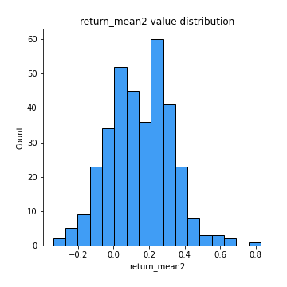
## Feature : return_sd1
- **Feature type** : continous
- **Missing** : 0.0%
- **Unique** : 347
- **Count** :347.0
- **Mean** :2.413701879445814
- **Std** :1.1878615046250152
- **Min** :0.8733078831717243
- **25%th Percentile** : 1.4921954246266005
- **50%th Percentile** : 2.001074994407898
- **75%th Percentile** : 3.174276793660792
- **Max** :7.290769114949334

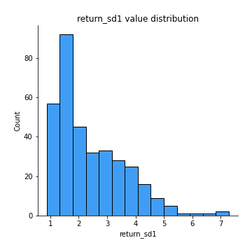
## Feature : return_sd2
- **Feature type** : continous
- **Missing** : 0.0%
- **Unique** : 347
- **Count** :347.0
- **Mean** :1.9427512756691365
- **Std** :0.7970084215577298
- **Min** :0.7972470779640086
- **25%th Percentile** : 1.3935025296500094
- **50%th Percentile** : 1.7096578911538476
- **75%th Percentile** : 2.3897860603732797
- **Max** :6.125657469108054

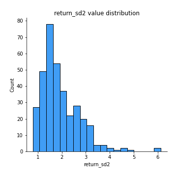
## Feature : return_skew1
- **Feature type** : continous
- **Missing** : 0.0%
- **Unique** : 347
- **Count** :347.0
- **Mean** :-0.24257482526635715
- **Std** :0.617173295296353
- **Min** :-2.5068500114696386
- **25%th Percentile** : -0.5085443340761036
- **50%th Percentile** : -0.26781894238561377
- **75%th Percentile** : 0.05211649184262217
- **Max** :2.351757728252051

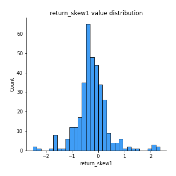
## Feature : return_skew2
- **Feature type** : continous
- **Missing** : 0.0%
- **Unique** : 347
- **Count** :347.0
- **Mean** :-0.4121869917340903
- **Std** :1.0458454266325097
- **Min** :-7.3762354994385335
- **25%th Percentile** : -0.6326942223018472
- **50%th Percentile** : -0.303619610691217
- **75%th Percentile** : 0.029796177763682
- **Max** :4.1920266082732045

## Feature : return_kurtosis1
- **Feature type** : continous
- **Missing** : 0.0%
- **Unique** : 347
- **Count** :347.0
- **Mean** :3.5420052956821175
- **Std** :3.8077462595235096
- **Min** :0.004829057731857933
- **25%th Percentile** : 1.3559634503056384
- **50%th Percentile** : 2.1615810982629053
- **75%th Percentile** : 4.320091171797124
- **Max** :23.612665658846073

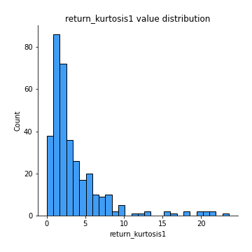
## Feature : return_kurtosis2
- **Feature type** : continous
- **Missing** : 0.0%
- **Unique** : 347
- **Count** :347.0
- **Mean** :5.747929497995507
- **Std** :9.027444154427993
- **Min** :-0.1693240760286967
- **25%th Percentile** : 1.6647454425063821
- **50%th Percentile** : 2.9346702930468713
- **75%th Percentile** : 5.94307264031208
- **Max** :94.01659180149953

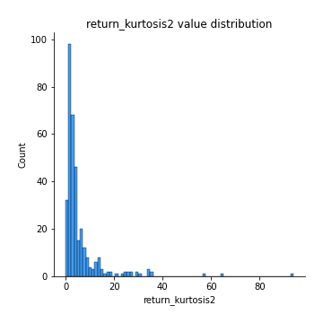
## Feature : return_autocorrelation_1_lag1
- **Feature type** : continous
- **Missing** : 0.0%
- **Unique** : 347
- **Count** :347.0
- **Mean** :-0.010277872813724971
- **Std** :0.0781703058146566
- **Min** :-0.3811779092428669
- **25%th Percentile** : -0.05940534767738613
- **50%th Percentile** : -0.012166842045999741
- **75%th Percentile** : 0.033293858342468785
- **Max** :0.23776485658894173

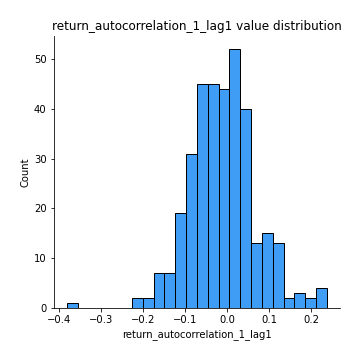
## Feature : return_autocorrelation_1_lag2
- **Feature type** : continous
- **Missing** : 0.0%
- **Unique** : 347
- **Count** :347.0
- **Mean** :-0.01318626523060869
- **Std** :0.07949818414209318
- **Min** :-0.268168545029228
- **25%th Percentile** : -0.05922612556964914
- **50%th Percentile** : -0.014305714810306212
- **75%th Percentile** : 0.038134741745484466
- **Max** :0.2828804892602676

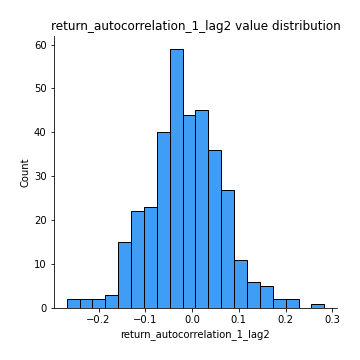
## Feature : return_autocorrelation_1_lag3
- **Feature type** : continous
- **Missing** : 0.0%
- **Unique** : 347
- **Count** :347.0
- **Mean** :-0.0021933608009845396
- **Std** :0.07216928791364524
- **Min** :-0.21488291946283697
- **25%th Percentile** : -0.04780993802353392
- **50%th Percentile** : 0.002024303026367454
- **75%th Percentile** : 0.04428935874141112
- **Max** :0.19698845344481586

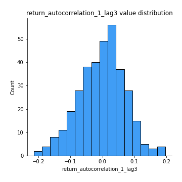
## Feature : return_autocorrelation_2_lag1
- **Feature type** : continous
- **Missing** : 0.0%
- **Unique** : 347
- **Count** :347.0
- **Mean** :-0.00692282525695146
- **Std** :0.0754659025907939
- **Min** :-0.18619871898052182
- **25%th Percentile** : -0.05763804965362895
- **50%th Percentile** : -0.00563982239545521
- **75%th Percentile** : 0.04733705775503456
- **Max** :0.22521286106798272

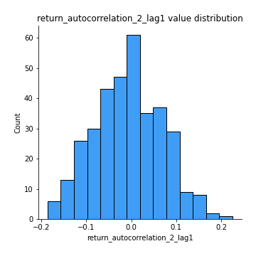
## Feature : return_autocorrelation_2_lag2
- **Feature type** : continous
- **Missing** : 0.0%
- **Unique** : 347
- **Count** :347.0
- **Mean** :-0.01053753198252886
- **Std** :0.08265903384465874
- **Min** :-0.24403028504505084
- **25%th Percentile** : -0.06714901420760161
- **50%th Percentile** : -0.00858978319023696
- **75%th Percentile** : 0.04077671907459214
- **Max** :0.313021110158109

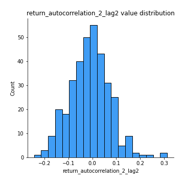
## Feature : return_autocorrelation_2_lag3
- **Feature type** : continous
- **Missing** : 0.0%
- **Unique** : 347
- **Count** :347.0
- **Mean** :0.006793739224909878
- **Std** :0.07613555334025965
- **Min** :-0.23401288670718143
- **25%th Percentile** : -0.04544541128832565
- **50%th Percentile** : 0.010323992074390291
- **75%th Percentile** : 0.059672400256771035
- **Max** :0.23512675606875416

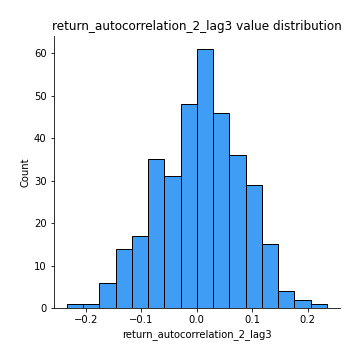
## Feature : return_correlation_ts1_lag_0
- **Feature type** : continous
- **Missing** : 0.0%
- **Unique** : 347
- **Count** :347.0
- **Mean** :0.4356578006169185
- **Std** :0.19281893908746078
- **Min** :-0.10256711281206837
- **25%th Percentile** : 0.31233480263225893
- **50%th Percentile** : 0.4715074377026294
- **75%th Percentile** : 0.5987471658557129
- **Max** :0.9937227277077512

## Feature : return_correlation_ts1_lag_1
- **Feature type** : continous
- **Missing** : 0.0%
- **Unique** : 347
- **Count** :347.0
- **Mean** :-0.010559492367139125
- **Std** :0.07357348495785919
- **Min** :-0.3551361957177156
- **25%th Percentile** : -0.054743422440067906
- **50%th Percentile** : -0.010709012303641617
- **75%th Percentile** : 0.03699242570872692
- **Max** :0.2339858450741509

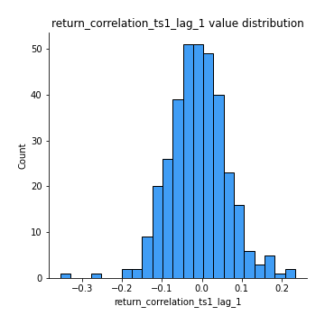
## Feature : return_correlation_ts1_lag_2
- **Feature type** : continous
- **Missing** : 0.0%
- **Unique** : 347
- **Count** :347.0
- **Mean** :-0.008187814211014353
- **Std** :0.07606120304695625
- **Min** :-0.2198719900700618
- **25%th Percentile** : -0.06001544229591781
- **50%th Percentile** : -0.01340884265665636
- **75%th Percentile** : 0.04254749597541302
- **Max** :0.2644364060205191

## Feature : return_correlation_ts1_lag_3
- **Feature type** : continous
- **Missing** : 0.0%
- **Unique** : 347
- **Count** :347.0
- **Mean** :0.0013584351344815993
- **Std** :0.07933810394344228
- **Min** :-0.23540122750676115
- **25%th Percentile** : -0.04583661880630345
- **50%th Percentile** : -0.0002007087054394625
- **75%th Percentile** : 0.051536099329005866
- **Max** :0.29594694366142116

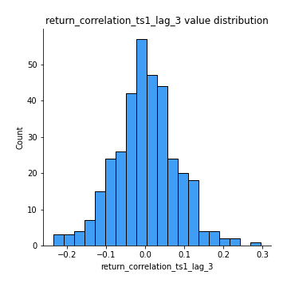
## Feature : return_correlation_ts2_lag_1
- **Feature type** : continous
- **Missing** : 0.0%
- **Unique** : 347
- **Count** :347.0
- **Mean** :-0.001610956050952549
- **Std** :0.07106252361368359
- **Min** :-0.2849948846568307
- **25%th Percentile** : -0.04955522404125812
- **50%th Percentile** : -0.0010940104775052453
- **75%th Percentile** : 0.04340627715334311
- **Max** :0.19063390731308485

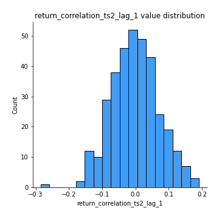
## Feature : return_correlation_ts2_lag_2
- **Feature type** : continous
- **Missing** : 0.0%
- **Unique** : 347
- **Count** :347.0
- **Mean** :-0.009679918985079783
- **Std** :0.07514336102790876
- **Min** :-0.2757460186107768
- **25%th Percentile** : -0.0580864604938192
- **50%th Percentile** : -0.008534174999016958
- **75%th Percentile** : 0.03736808363343008
- **Max** :0.31510459542023206

## Feature : return_correlation_ts2_lag_3
- **Feature type** : continous
- **Missing** : 0.0%
- **Unique** : 347
- **Count** :347.0
- **Mean** :0.005364558864083652
- **Std** :0.0732572464928766
- **Min** :-0.24870655072310713
- **25%th Percentile** : -0.04244364762069433
- **50%th Percentile** : 0.00810688811354917
- **75%th Percentile** : 0.0516740583590411
- **Max** :0.20649181070218037

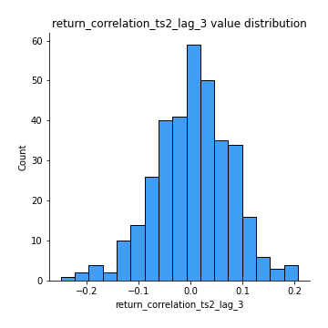
## Feature : sqreturn_autocorrelation_ts1_lag1
- **Feature type** : continous
- **Missing** : 0.0%
- **Unique** : 347
- **Count** :347.0
- **Mean** :0.11386034707634772
- **Std** :0.10579128607459917
- **Min** :-0.0641667707236835
- **25%th Percentile** : 0.033715484677490845
- **50%th Percentile** : 0.0984313016628965
- **75%th Percentile** : 0.1740326286514713
- **Max** :0.608926539348867

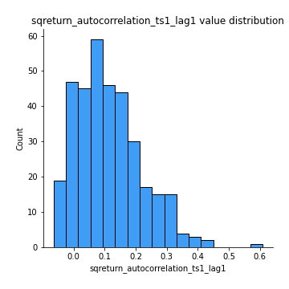
## Feature : sqreturn_autocorrelation_ts1_lag2
- **Feature type** : continous
- **Missing** : 0.0%
- **Unique** : 347
- **Count** :347.0
- **Mean** :0.09647197245954127
- **Std** :0.10134449831664916
- **Min** :-0.08684405202664229
- **25%th Percentile** : 0.016243903241423593
- **50%th Percentile** : 0.07485555024067224
- **75%th Percentile** : 0.16178332582176388
- **Max** :0.43064017359885864

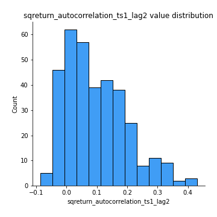
## Feature : sqreturn_autocorrelation_ts1_lag3
- **Feature type** : continous
- **Missing** : 0.0%
- **Unique** : 347
- **Count** :347.0
- **Mean** :0.08379392258287933
- **Std** :0.10115164160949451
- **Min** :-0.08711242405535644
- **25%th Percentile** : 0.014645181692576257
- **50%th Percentile** : 0.06203133554553423
- **75%th Percentile** : 0.13552508876463695
- **Max** :0.43765859386151956

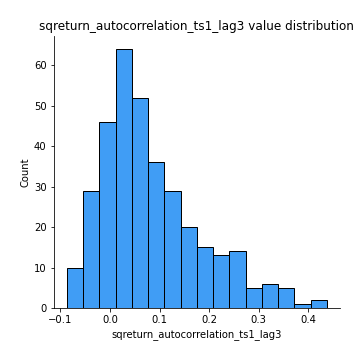
## Feature : sqreturn_autocorrelation_ts2_lag1
- **Feature type** : continous
- **Missing** : 0.0%
- **Unique** : 347
- **Count** :347.0
- **Mean** :0.12212149007121854
- **Std** :0.11804484202053932
- **Min** :-0.07808490782609163
- **25%th Percentile** : 0.028790502278937886
- **50%th Percentile** : 0.09489974880811093
- **75%th Percentile** : 0.1972257067076627
- **Max** :0.48411273479053485

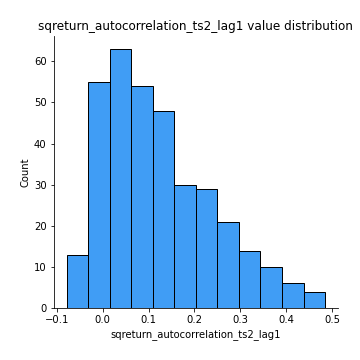
## Feature : sqreturn_autocorrelation_ts2_lag2
- **Feature type** : continous
- **Missing** : 0.0%
- **Unique** : 347
- **Count** :347.0
- **Mean** :0.10342064949201436
- **Std** :0.11605951097360764
- **Min** :-0.10054631197559977
- **25%th Percentile** : 0.00944945560689141
- **50%th Percentile** : 0.07856806589487582
- **75%th Percentile** : 0.16942830123912808
- **Max** :0.5037924793658711

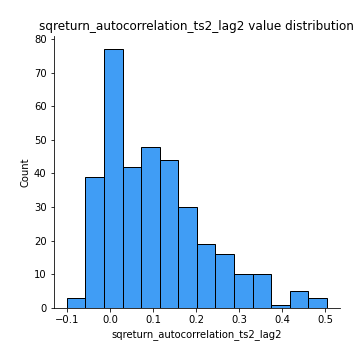
## Feature : sqreturn_autocorrelation_ts2_lag3
- **Feature type** : continous
- **Missing** : 0.0%
- **Unique** : 347
- **Count** :347.0
- **Mean** :0.08782596752204196
- **Std** :0.1078923325414062
- **Min** :-0.09756858950376449
- **25%th Percentile** : -0.0034676934105129092
- **50%th Percentile** : 0.06972386639652206
- **75%th Percentile** : 0.1563383968602603
- **Max** :0.5219263222733209

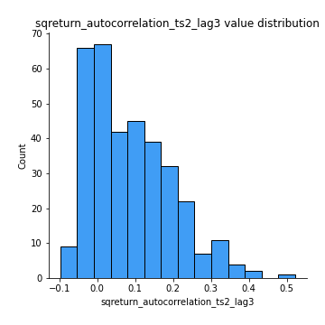
## Feature : sqreturn_correlation_ts1_lag_0
- **Feature type** : continous
- **Missing** : 0.0%
- **Unique** : 347
- **Count** :347.0
- **Mean** :0.4356578006169185
- **Std** :0.19281893908746078
- **Min** :-0.10256711281206837
- **25%th Percentile** : 0.31233480263225893
- **50%th Percentile** : 0.4715074377026294
- **75%th Percentile** : 0.5987471658557129
- **Max** :0.9937227277077512

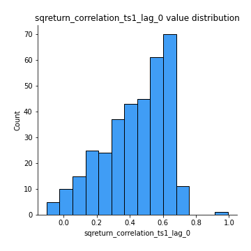
## Feature : sqreturn_correlation_ts1_lag_1
- **Feature type** : continous
- **Missing** : 0.0%
- **Unique** : 347
- **Count** :347.0
- **Mean** :-0.010559492367139125
- **Std** :0.07357348495785919
- **Min** :-0.3551361957177156
- **25%th Percentile** : -0.054743422440067906
- **50%th Percentile** : -0.010709012303641617
- **75%th Percentile** : 0.03699242570872692
- **Max** :0.2339858450741509

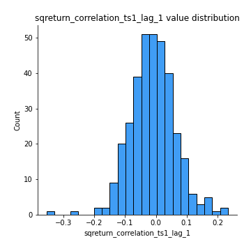
## Feature : sqreturn_correlation_ts1_lag_2
- **Feature type** : continous
- **Missing** : 0.0%
- **Unique** : 347
- **Count** :347.0
- **Mean** :-0.008187814211014353
- **Std** :0.07606120304695625
- **Min** :-0.2198719900700618
- **25%th Percentile** : -0.06001544229591781
- **50%th Percentile** : -0.01340884265665636
- **75%th Percentile** : 0.04254749597541302
- **Max** :0.2644364060205191

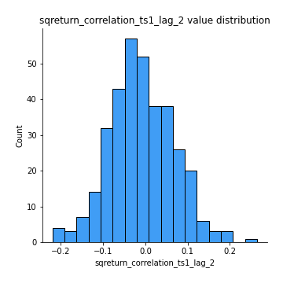
## Feature : sqreturn_correlation_ts1_lag_3
- **Feature type** : continous
- **Missing** : 0.0%
- **Unique** : 347
- **Count** :347.0
- **Mean** :0.0013584351344815993
- **Std** :0.07933810394344228
- **Min** :-0.23540122750676115
- **25%th Percentile** : -0.04583661880630345
- **50%th Percentile** : -0.0002007087054394625
- **75%th Percentile** : 0.051536099329005866
- **Max** :0.29594694366142116

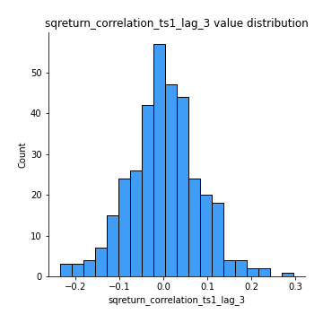
## Feature : sqreturn_correlation_ts2_lag_1
- **Feature type** : continous
- **Missing** : 0.0%
- **Unique** : 347
- **Count** :347.0
- **Mean** :-0.001610956050952549
- **Std** :0.07106252361368359
- **Min** :-0.2849948846568307
- **25%th Percentile** : -0.04955522404125812
- **50%th Percentile** : -0.0010940104775052453
- **75%th Percentile** : 0.04340627715334311
- **Max** :0.19063390731308485

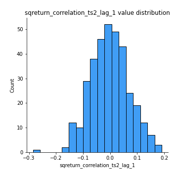
## Feature : sqreturn_correlation_ts2_lag_2
- **Feature type** : continous
- **Missing** : 0.0%
- **Unique** : 347
- **Count** :347.0
- **Mean** :-0.009679918985079783
- **Std** :0.07514336102790876
- **Min** :-0.2757460186107768
- **25%th Percentile** : -0.0580864604938192
- **50%th Percentile** : -0.008534174999016958
- **75%th Percentile** : 0.03736808363343008
- **Max** :0.31510459542023206

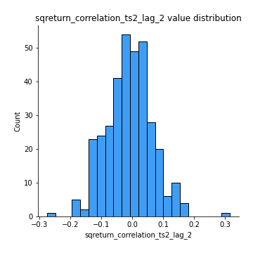
## Feature : sqreturn_correlation_ts2_lag_3
- **Feature type** : continous
- **Missing** : 0.0%
- **Unique** : 347
- **Count** :347.0
- **Mean** :0.005364558864083652
- **Std** :0.0732572464928766
- **Min** :-0.24870655072310713
- **25%th Percentile** : -0.04244364762069433
- **50%th Percentile** : 0.00810688811354917
- **75%th Percentile** : 0.0516740583590411
- **Max** :0.20649181070218037

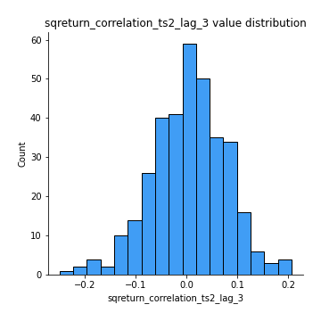
## Feature : price2_granger_cause_price1
- **Feature type** : continous
- **Missing** : 0.0%
- **Unique** : 347
- **Count** :347.0
- **Mean** :0.20637846364678233
- **Std** :0.2739884383062662
- **Min** :2.2383282792168502e-08
- **25%th Percentile** : 0.008416701185003872
- **50%th Percentile** : 0.0643027175069006
- **75%th Percentile** : 0.32572749594840233
- **Max** :0.9898380228448623

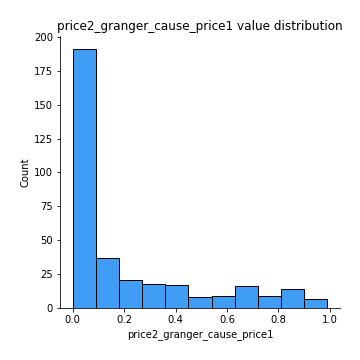
## Feature : price1_granger_cause_price2
- **Feature type** : continous
- **Missing** : 0.0%
- **Unique** : 347
- **Count** :347.0
- **Mean** :0.21717584456941244
- **Std** :0.2623998314781361
- **Min** :1.3347965187073967e-08
- **25%th Percentile** : 0.014030353940153058
- **50%th Percentile** : 0.1017213200623417
- **75%th Percentile** : 0.3176493605168277
- **Max** :0.9544840419891578

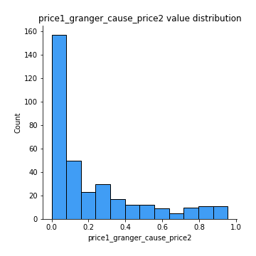

[<< Go back](../README.md)
