# Exploratory Data Analysis

[<< Go back](../README.md)
## Feature : target
- **Feature type** : categorical
- **Missing** : 0.0%
- **Unique** : 2
- **Count** :347
- **Unique** :2
- **Top** :simulated
- **Freq** :176

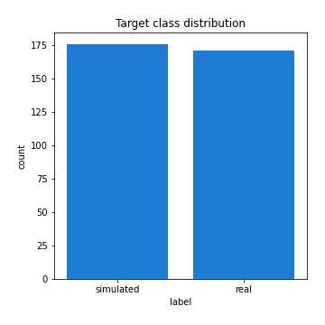
## Feature : return_mean1
- **Feature type** : continous
- **Missing** : 0.0%
- **Unique** : 347
- **Count** :347.0
- **Mean** :-0.14177512255453728
- **Std** :0.22399565914967945
- **Min** :-0.6736279799919828
- **25%th Percentile** : -0.32228986265346016
- **50%th Percentile** : -0.13030281892752507
- **75%th Percentile** : 0.05036457529199549
- **Max** :0.30438235661894036

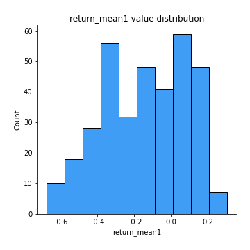
## Feature : return_mean2
- **Feature type** : continous
- **Missing** : 0.0%
- **Unique** : 347
- **Count** :347.0
- **Mean** :0.15982945494018835
- **Std** :0.1831602374848721
- **Min** :-0.3439835398279146
- **25%th Percentile** : 0.030765120703917924
- **50%th Percentile** : 0.1743131937204936
- **75%th Percentile** : 0.27655896700815286
- **Max** :0.8163079441916257

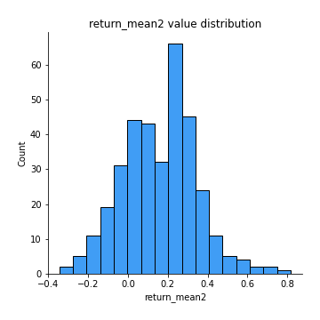
## Feature : return_sd1
- **Feature type** : continous
- **Missing** : 0.0%
- **Unique** : 347
- **Count** :347.0
- **Mean** :2.4987844009059756
- **Std** :1.23295662228429
- **Min** :0.8102430347636637
- **25%th Percentile** : 1.5390473065696149
- **50%th Percentile** : 2.103811940953894
- **75%th Percentile** : 3.220587735504374
- **Max** :6.556047511727308

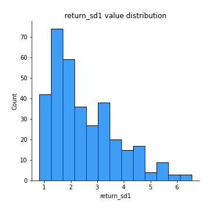
## Feature : return_sd2
- **Feature type** : continous
- **Missing** : 0.0%
- **Unique** : 347
- **Count** :347.0
- **Mean** :1.957319600261733
- **Std** :0.8702779985767154
- **Min** :0.6771234124901752
- **25%th Percentile** : 1.384553760562131
- **50%th Percentile** : 1.6996731175849737
- **75%th Percentile** : 2.309254289716227
- **Max** :5.150898700467118

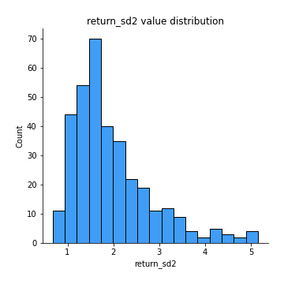
## Feature : return_skew1
- **Feature type** : continous
- **Missing** : 0.0%
- **Unique** : 347
- **Count** :347.0
- **Mean** :-0.31965864650219955
- **Std** :0.7217959268823396
- **Min** :-4.239645236578449
- **25%th Percentile** : -0.5686244909042657
- **50%th Percentile** : -0.2999983391940466
- **75%th Percentile** : -0.017398069061028323
- **Max** :2.351757728252051

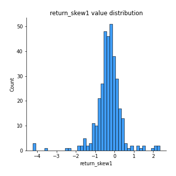
## Feature : return_skew2
- **Feature type** : continous
- **Missing** : 0.0%
- **Unique** : 347
- **Count** :347.0
- **Mean** :-0.3920111161564266
- **Std** :0.9970052320897244
- **Min** :-6.262899561987459
- **25%th Percentile** : -0.6365214348855026
- **50%th Percentile** : -0.30188575079529134
- **75%th Percentile** : 0.023360115749322306
- **Max** :4.1920266082732045

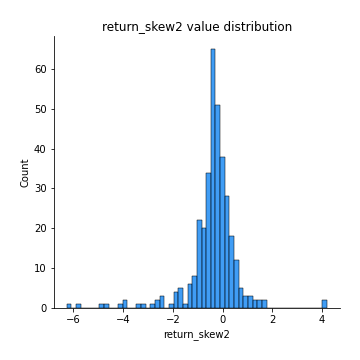
## Feature : return_kurtosis1
- **Feature type** : continous
- **Missing** : 0.0%
- **Unique** : 347
- **Count** :347.0
- **Mean** :3.996943663598179
- **Std** :5.116051946033748
- **Min** :0.2025518627963816
- **25%th Percentile** : 1.523619044087453
- **50%th Percentile** : 2.454543884840944
- **75%th Percentile** : 4.232952025680438
- **Max** :40.485294874464934

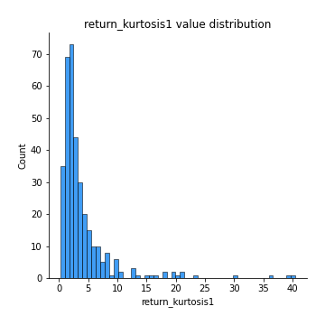
## Feature : return_kurtosis2
- **Feature type** : continous
- **Missing** : 0.0%
- **Unique** : 347
- **Count** :347.0
- **Mean** :5.514013747269959
- **Std** :7.82990808336195
- **Min** :-0.04536968669449282
- **25%th Percentile** : 1.8679738630657097
- **50%th Percentile** : 2.9990027241815302
- **75%th Percentile** : 5.711789036356581
- **Max** :64.99818629655663

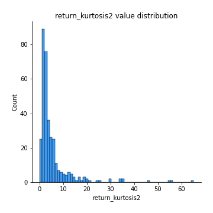
## Feature : return_autocorrelation_1_lag1
- **Feature type** : continous
- **Missing** : 0.0%
- **Unique** : 347
- **Count** :347.0
- **Mean** :-0.015502551095265028
- **Std** :0.07290892887056953
- **Min** :-0.2602100517985975
- **25%th Percentile** : -0.06315289860352805
- **50%th Percentile** : -0.018791898450252354
- **75%th Percentile** : 0.03128425772290873
- **Max** :0.21711955658955062

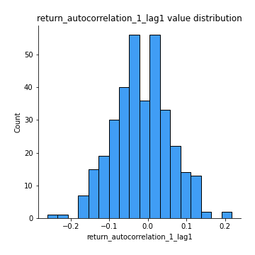
## Feature : return_autocorrelation_1_lag2
- **Feature type** : continous
- **Missing** : 0.0%
- **Unique** : 347
- **Count** :347.0
- **Mean** :-0.012596921105952782
- **Std** :0.07131637269733623
- **Min** :-0.1820620098677329
- **25%th Percentile** : -0.06458787356718984
- **50%th Percentile** : -0.016727906203027016
- **75%th Percentile** : 0.03822103546645013
- **Max** :0.23746706000731038

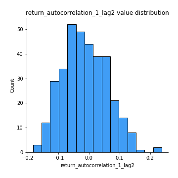
## Feature : return_autocorrelation_1_lag3
- **Feature type** : continous
- **Missing** : 0.0%
- **Unique** : 347
- **Count** :347.0
- **Mean** :0.012469482251354518
- **Std** :0.07778929674297123
- **Min** :-0.29237168129610336
- **25%th Percentile** : -0.0392376473072072
- **50%th Percentile** : 0.017358975149030818
- **75%th Percentile** : 0.06378434121814297
- **Max** :0.382587981623811

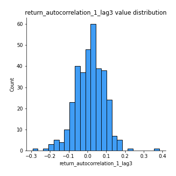
## Feature : return_autocorrelation_2_lag1
- **Feature type** : continous
- **Missing** : 0.0%
- **Unique** : 347
- **Count** :347.0
- **Mean** :-0.008599762423783294
- **Std** :0.08108768463077215
- **Min** :-0.27785272323355087
- **25%th Percentile** : -0.062408854353884866
- **50%th Percentile** : -0.007306929012243362
- **75%th Percentile** : 0.04514608058170168
- **Max** :0.23175340792848348

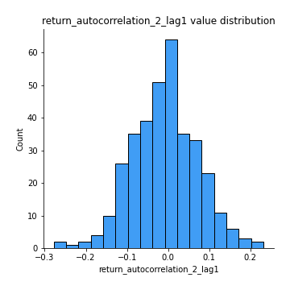
## Feature : return_autocorrelation_2_lag2
- **Feature type** : continous
- **Missing** : 0.0%
- **Unique** : 347
- **Count** :347.0
- **Mean** :-0.013042403127093597
- **Std** :0.08045264056846475
- **Min** :-0.2346440714977114
- **25%th Percentile** : -0.06606395123854988
- **50%th Percentile** : -0.016044900625000736
- **75%th Percentile** : 0.03867630037744227
- **Max** :0.29725822144676495

## Feature : return_autocorrelation_2_lag3
- **Feature type** : continous
- **Missing** : 0.0%
- **Unique** : 347
- **Count** :347.0
- **Mean** :0.001451404719803848
- **Std** :0.07881383204666775
- **Min** :-0.23424906345636076
- **25%th Percentile** : -0.04241068536152622
- **50%th Percentile** : 0.0020964684697427575
- **75%th Percentile** : 0.05323955252211522
- **Max** :0.34607863029956365

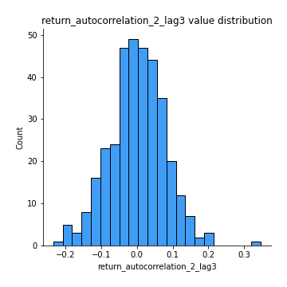
## Feature : return_correlation_ts1_lag_0
- **Feature type** : continous
- **Missing** : 0.0%
- **Unique** : 347
- **Count** :347.0
- **Mean** :0.43909585335679496
- **Std** :0.19953282344484471
- **Min** :-0.14605355575362514
- **25%th Percentile** : 0.3130683315419583
- **50%th Percentile** : 0.47296434568371915
- **75%th Percentile** : 0.6052859623068224
- **Max** :0.9937227277077512

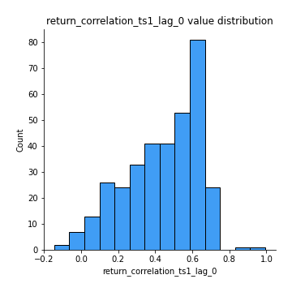
## Feature : return_correlation_ts1_lag_1
- **Feature type** : continous
- **Missing** : 0.0%
- **Unique** : 347
- **Count** :347.0
- **Mean** :-0.007566308729410275
- **Std** :0.07319084189680648
- **Min** :-0.2399590026854347
- **25%th Percentile** : -0.0542215575086696
- **50%th Percentile** : -0.006990846105859471
- **75%th Percentile** : 0.04179916315753916
- **Max** :0.291398723275956

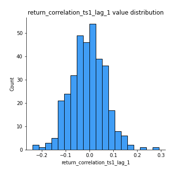
## Feature : return_correlation_ts1_lag_2
- **Feature type** : continous
- **Missing** : 0.0%
- **Unique** : 347
- **Count** :347.0
- **Mean** :-0.008481296807760885
- **Std** :0.07292883069936847
- **Min** :-0.21037978133660637
- **25%th Percentile** : -0.05767606319489582
- **50%th Percentile** : -0.01186500925628135
- **75%th Percentile** : 0.03950978161868575
- **Max** :0.28383046569388554

## Feature : return_correlation_ts1_lag_3
- **Feature type** : continous
- **Missing** : 0.0%
- **Unique** : 347
- **Count** :347.0
- **Mean** :0.004395909243929368
- **Std** :0.07943200226537658
- **Min** :-0.22542015527675863
- **25%th Percentile** : -0.04709380312200079
- **50%th Percentile** : 0.00495443625845696
- **75%th Percentile** : 0.05386644570247291
- **Max** :0.3192456457587933

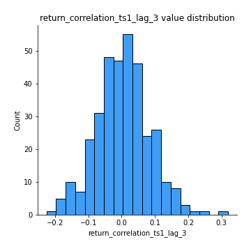
## Feature : return_correlation_ts2_lag_1
- **Feature type** : continous
- **Missing** : 0.0%
- **Unique** : 347
- **Count** :347.0
- **Mean** :-0.003986164517180295
- **Std** :0.07265664081274718
- **Min** :-0.22261223290795865
- **25%th Percentile** : -0.052642903719250164
- **50%th Percentile** : -0.0017179595173547817
- **75%th Percentile** : 0.03960388215430116
- **Max** :0.3425036902091001

## Feature : return_correlation_ts2_lag_2
- **Feature type** : continous
- **Missing** : 0.0%
- **Unique** : 347
- **Count** :347.0
- **Mean** :-0.008644903946548581
- **Std** :0.07298915773151049
- **Min** :-0.2881799171123352
- **25%th Percentile** : -0.05562155239276049
- **50%th Percentile** : -0.011789113089190182
- **75%th Percentile** : 0.03881661087336752
- **Max** :0.20594965876498877

## Feature : return_correlation_ts2_lag_3
- **Feature type** : continous
- **Missing** : 0.0%
- **Unique** : 347
- **Count** :347.0
- **Mean** :0.0067018210418134765
- **Std** :0.07657896293477473
- **Min** :-0.2772091537782573
- **25%th Percentile** : -0.03804435264145002
- **50%th Percentile** : 0.006547614993516044
- **75%th Percentile** : 0.054755284533939685
- **Max** :0.3436354298607823

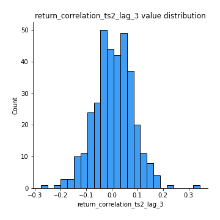
## Feature : sqreturn_autocorrelation_ts1_lag1
- **Feature type** : continous
- **Missing** : 0.0%
- **Unique** : 347
- **Count** :347.0
- **Mean** :0.11947376810353846
- **Std** :0.10866701272750458
- **Min** :-0.06641170505474243
- **25%th Percentile** : 0.029679698405527366
- **50%th Percentile** : 0.10077707222921171
- **75%th Percentile** : 0.18411531476006485
- **Max** :0.5632681155671597

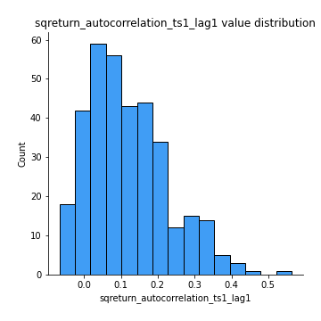
## Feature : sqreturn_autocorrelation_ts1_lag2
- **Feature type** : continous
- **Missing** : 0.0%
- **Unique** : 347
- **Count** :347.0
- **Mean** :0.09820906875803395
- **Std** :0.10114499639908071
- **Min** :-0.08684405202664229
- **25%th Percentile** : 0.01516155939530435
- **50%th Percentile** : 0.09105043909866985
- **75%th Percentile** : 0.15707020942221472
- **Max** :0.44659353858761325

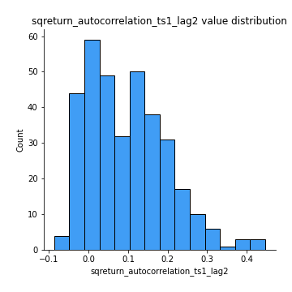
## Feature : sqreturn_autocorrelation_ts1_lag3
- **Feature type** : continous
- **Missing** : 0.0%
- **Unique** : 347
- **Count** :347.0
- **Mean** :0.09552421490531347
- **Std** :0.10805695547301916
- **Min** :-0.08904611924599068
- **25%th Percentile** : 0.008072815924362894
- **50%th Percentile** : 0.07294190375357038
- **75%th Percentile** : 0.16421794079250812
- **Max** :0.49375840970014867

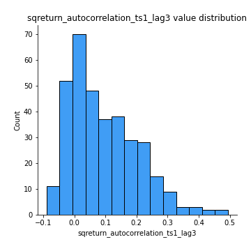
## Feature : sqreturn_autocorrelation_ts2_lag1
- **Feature type** : continous
- **Missing** : 0.0%
- **Unique** : 347
- **Count** :347.0
- **Mean** :0.13444727755958685
- **Std** :0.12190266261600875
- **Min** :-0.07808490782609163
- **25%th Percentile** : 0.034789841956804755
- **50%th Percentile** : 0.11220814673658656
- **75%th Percentile** : 0.22239639963561064
- **Max** :0.4676726364792276

## Feature : sqreturn_autocorrelation_ts2_lag2
- **Feature type** : continous
- **Missing** : 0.0%
- **Unique** : 347
- **Count** :347.0
- **Mean** :0.11023109911942268
- **Std** :0.12222992953261759
- **Min** :-0.10054631197559977
- **25%th Percentile** : 0.008136429390651314
- **50%th Percentile** : 0.08089806243139024
- **75%th Percentile** : 0.19259004985753142
- **Max** :0.49384321142572407

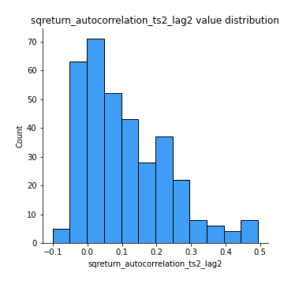
## Feature : sqreturn_autocorrelation_ts2_lag3
- **Feature type** : continous
- **Missing** : 0.0%
- **Unique** : 347
- **Count** :347.0
- **Mean** :0.10371388137783721
- **Std** :0.1215517633479699
- **Min** :-0.09756858950376449
- **25%th Percentile** : 0.0004222857638101389
- **50%th Percentile** : 0.07785596004862434
- **75%th Percentile** : 0.1815912660379643
- **Max** :0.5464780416096361

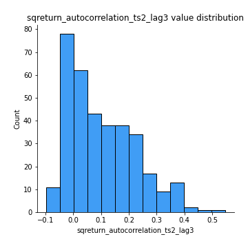
## Feature : sqreturn_correlation_ts1_lag_0
- **Feature type** : continous
- **Missing** : 0.0%
- **Unique** : 347
- **Count** :347.0
- **Mean** :0.43909585335679496
- **Std** :0.19953282344484471
- **Min** :-0.14605355575362514
- **25%th Percentile** : 0.3130683315419583
- **50%th Percentile** : 0.47296434568371915
- **75%th Percentile** : 0.6052859623068224
- **Max** :0.9937227277077512

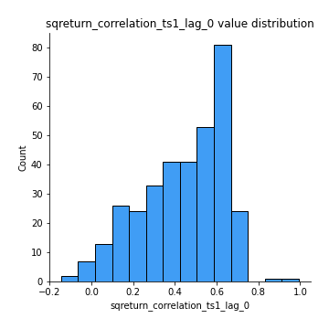
## Feature : sqreturn_correlation_ts1_lag_1
- **Feature type** : continous
- **Missing** : 0.0%
- **Unique** : 347
- **Count** :347.0
- **Mean** :-0.007566308729410275
- **Std** :0.07319084189680648
- **Min** :-0.2399590026854347
- **25%th Percentile** : -0.0542215575086696
- **50%th Percentile** : -0.006990846105859471
- **75%th Percentile** : 0.04179916315753916
- **Max** :0.291398723275956

## Feature : sqreturn_correlation_ts1_lag_2
- **Feature type** : continous
- **Missing** : 0.0%
- **Unique** : 347
- **Count** :347.0
- **Mean** :-0.008481296807760885
- **Std** :0.07292883069936847
- **Min** :-0.21037978133660637
- **25%th Percentile** : -0.05767606319489582
- **50%th Percentile** : -0.01186500925628135
- **75%th Percentile** : 0.03950978161868575
- **Max** :0.28383046569388554

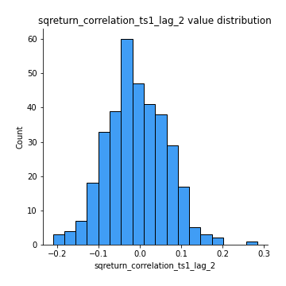
## Feature : sqreturn_correlation_ts1_lag_3
- **Feature type** : continous
- **Missing** : 0.0%
- **Unique** : 347
- **Count** :347.0
- **Mean** :0.004395909243929368
- **Std** :0.07943200226537658
- **Min** :-0.22542015527675863
- **25%th Percentile** : -0.04709380312200079
- **50%th Percentile** : 0.00495443625845696
- **75%th Percentile** : 0.05386644570247291
- **Max** :0.3192456457587933

## Feature : sqreturn_correlation_ts2_lag_1
- **Feature type** : continous
- **Missing** : 0.0%
- **Unique** : 347
- **Count** :347.0
- **Mean** :-0.003986164517180295
- **Std** :0.07265664081274718
- **Min** :-0.22261223290795865
- **25%th Percentile** : -0.052642903719250164
- **50%th Percentile** : -0.0017179595173547817
- **75%th Percentile** : 0.03960388215430116
- **Max** :0.3425036902091001

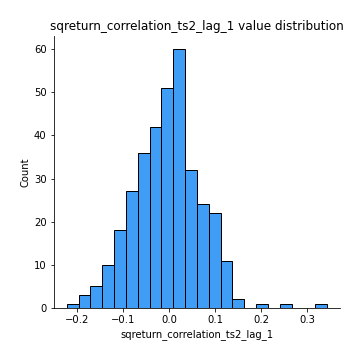
## Feature : sqreturn_correlation_ts2_lag_2
- **Feature type** : continous
- **Missing** : 0.0%
- **Unique** : 347
- **Count** :347.0
- **Mean** :-0.008644903946548581
- **Std** :0.07298915773151049
- **Min** :-0.2881799171123352
- **25%th Percentile** : -0.05562155239276049
- **50%th Percentile** : -0.011789113089190182
- **75%th Percentile** : 0.03881661087336752
- **Max** :0.20594965876498877

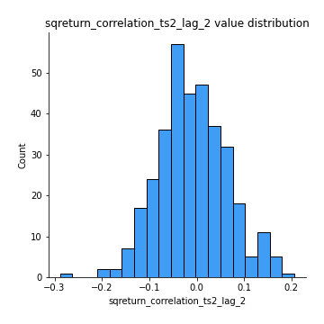
## Feature : sqreturn_correlation_ts2_lag_3
- **Feature type** : continous
- **Missing** : 0.0%
- **Unique** : 347
- **Count** :347.0
- **Mean** :0.0067018210418134765
- **Std** :0.07657896293477473
- **Min** :-0.2772091537782573
- **25%th Percentile** : -0.03804435264145002
- **50%th Percentile** : 0.006547614993516044
- **75%th Percentile** : 0.054755284533939685
- **Max** :0.3436354298607823

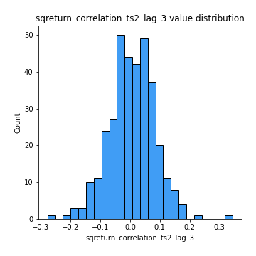
## Feature : price2_granger_cause_price1
- **Feature type** : continous
- **Missing** : 0.0%
- **Unique** : 347
- **Count** :347.0
- **Mean** :0.21277479649514788
- **Std** :0.2676726952962317
- **Min** :4.3094525617372023e-10
- **25%th Percentile** : 0.009706429075125433
- **50%th Percentile** : 0.08016221948129615
- **75%th Percentile** : 0.3459730122019712
- **Max** :0.9898380228448623

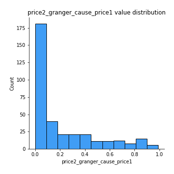
## Feature : price1_granger_cause_price2
- **Feature type** : continous
- **Missing** : 0.0%
- **Unique** : 347
- **Count** :347.0
- **Mean** :0.20118928942520642
- **Std** :0.2609274161085837
- **Min** :1.2012269232170316e-11
- **25%th Percentile** : 0.010566758348247787
- **50%th Percentile** : 0.08182390381547301
- **75%th Percentile** : 0.3135176212693138
- **Max** :0.9990931286557003

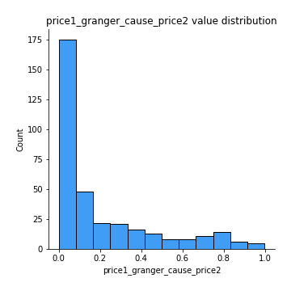

[<< Go back](../README.md)
