## Bivariate analysis of return_mean1 feature with target

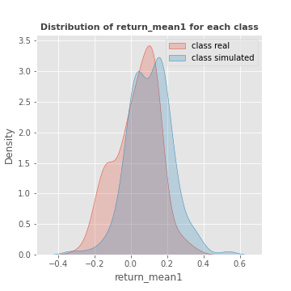

------------------------------------------------------
## Bivariate analysis of return_mean2 feature with target

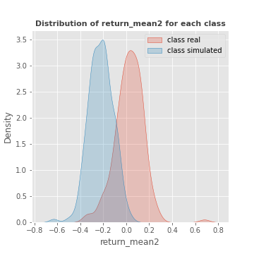

------------------------------------------------------
## Bivariate analysis of return_sd1 feature with target

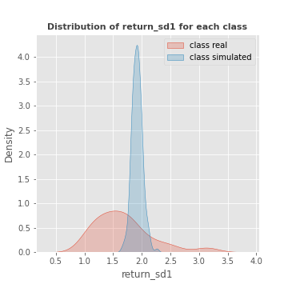

------------------------------------------------------
## Bivariate analysis of return_sd2 feature with target

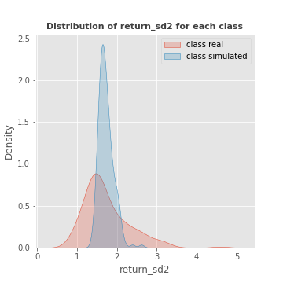

------------------------------------------------------
## Bivariate analysis of return_skew1 feature with target

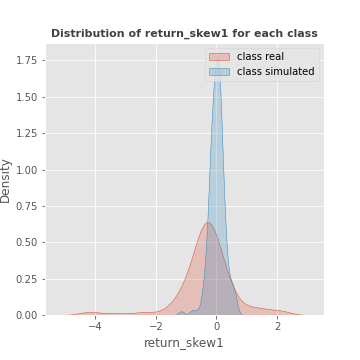

------------------------------------------------------
## Bivariate analysis of return_skew2 feature with target

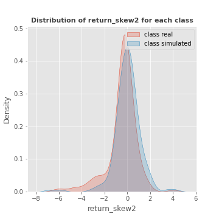

------------------------------------------------------
## Bivariate analysis of return_kurtosis1 feature with target

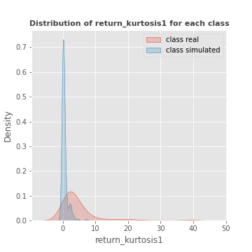

------------------------------------------------------
## Bivariate analysis of return_kurtosis2 feature with target

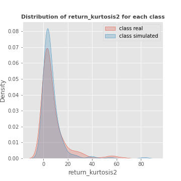

------------------------------------------------------
## Bivariate analysis of return_autocorrelation_1_lag1 feature with target

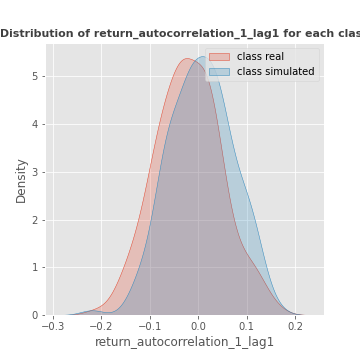

------------------------------------------------------
## Bivariate analysis of return_autocorrelation_1_lag2 feature with target

------------------------------------------------------
## Bivariate analysis of return_autocorrelation_1_lag3 feature with target

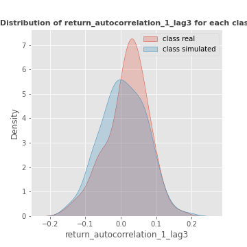

------------------------------------------------------
## Bivariate analysis of return_autocorrelation_2_lag1 feature with target

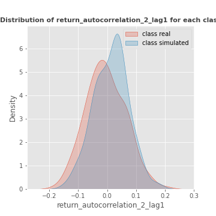

------------------------------------------------------
## Bivariate analysis of return_autocorrelation_2_lag2 feature with target

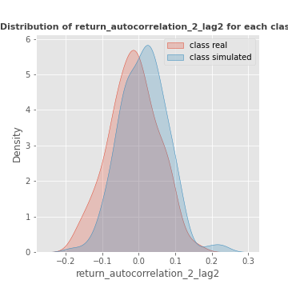

------------------------------------------------------
## Bivariate analysis of return_autocorrelation_2_lag3 feature with target

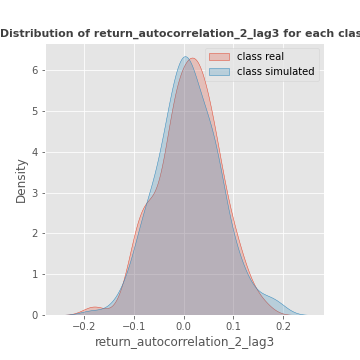

------------------------------------------------------
## Bivariate analysis of return_correlation_ts1_lag_0 feature with target

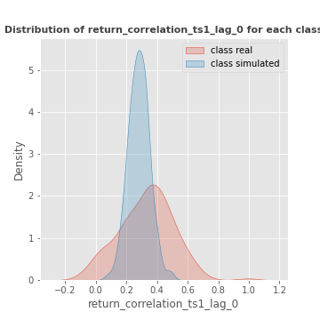

------------------------------------------------------
## Bivariate analysis of return_correlation_ts1_lag_1 feature with target

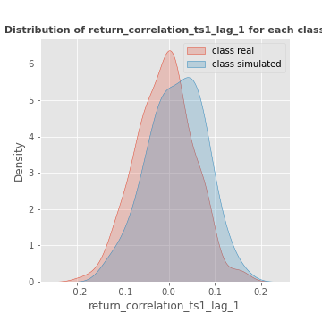

------------------------------------------------------
## Bivariate analysis of return_correlation_ts1_lag_2 feature with target

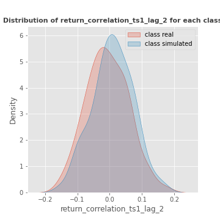

------------------------------------------------------
## Bivariate analysis of return_correlation_ts1_lag_3 feature with target

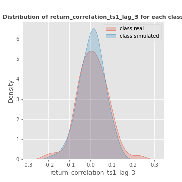

------------------------------------------------------
## Bivariate analysis of return_correlation_ts2_lag_1 feature with target

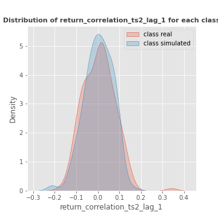

------------------------------------------------------
## Bivariate analysis of return_correlation_ts2_lag_2 feature with target

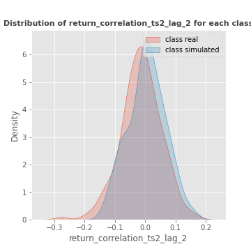

------------------------------------------------------
## Bivariate analysis of return_correlation_ts2_lag_3 feature with target

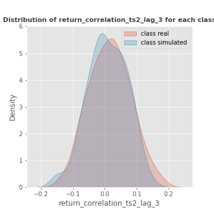

------------------------------------------------------
## Bivariate analysis of sqreturn_autocorrelation_ts1_lag1 feature with target

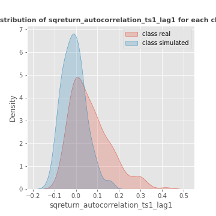

------------------------------------------------------
## Bivariate analysis of sqreturn_autocorrelation_ts1_lag2 feature with target

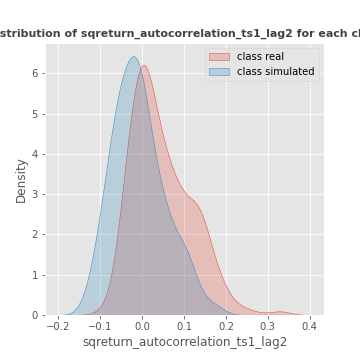

------------------------------------------------------
## Bivariate analysis of sqreturn_autocorrelation_ts1_lag3 feature with target

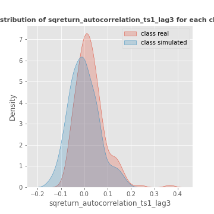

------------------------------------------------------
## Bivariate analysis of sqreturn_autocorrelation_ts2_lag1 feature with target

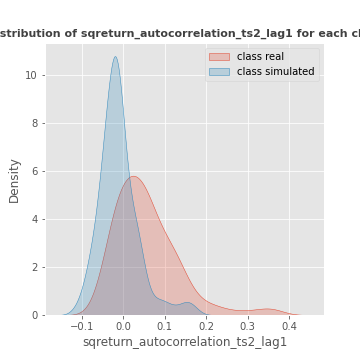

------------------------------------------------------
## Heatmap
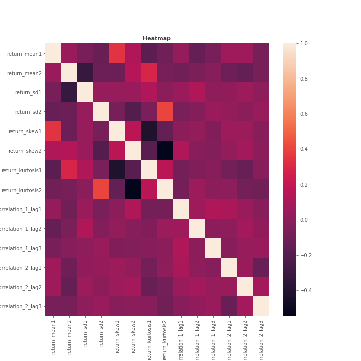

------------------------------------------------------
