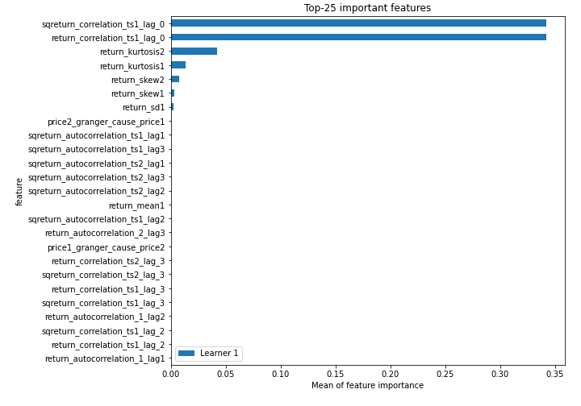
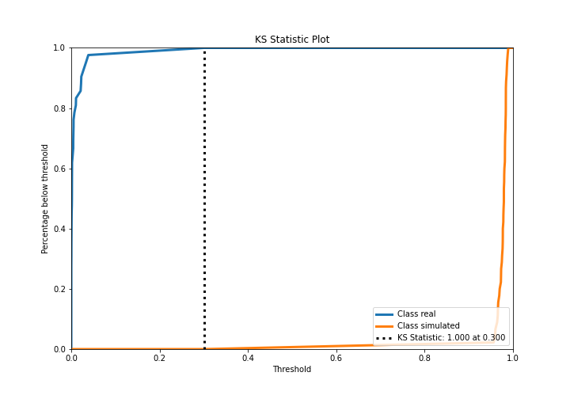
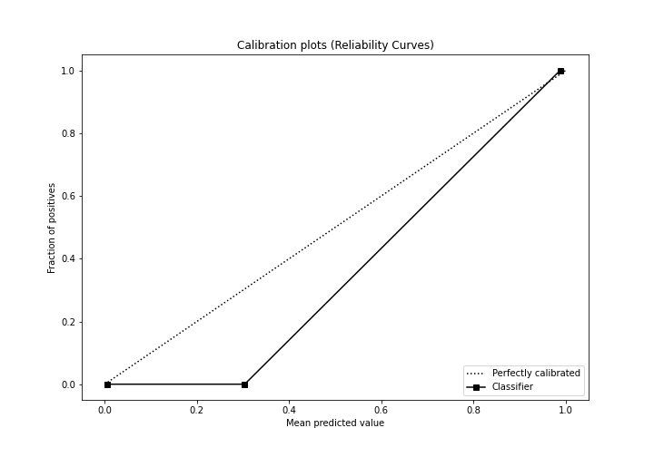
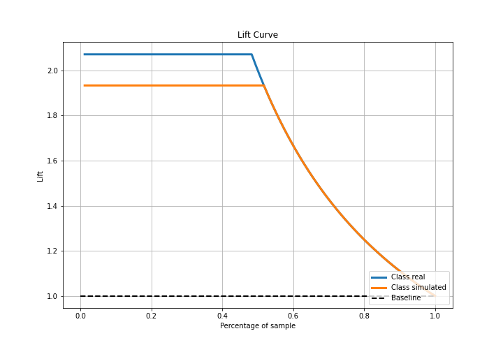
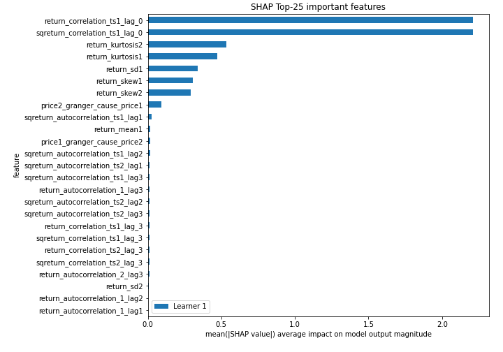
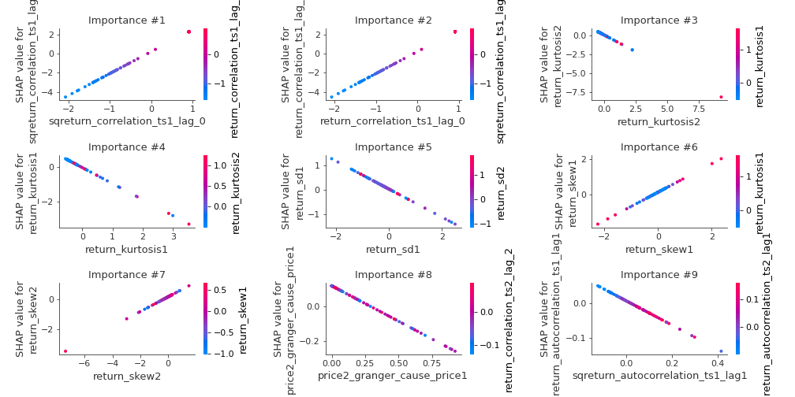
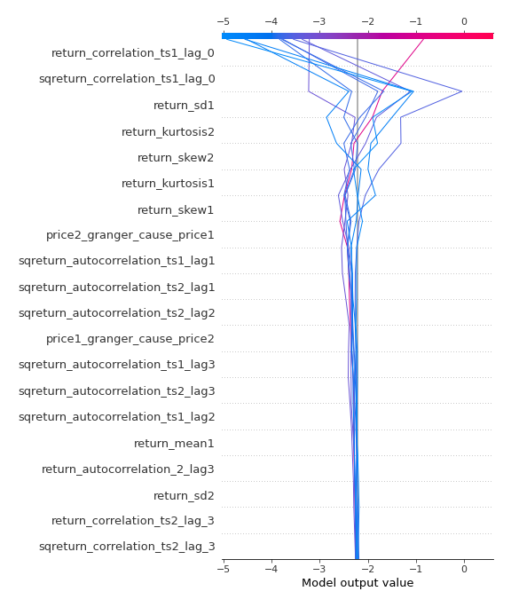
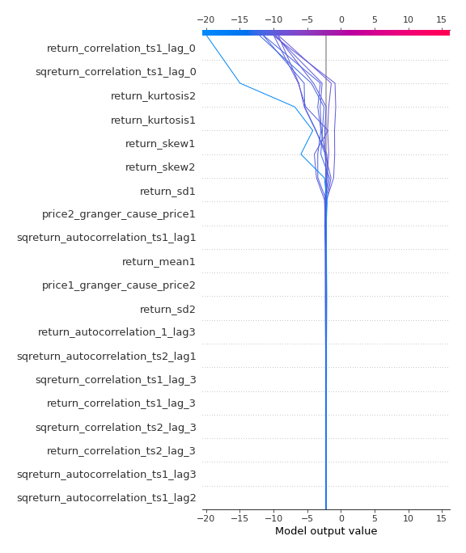
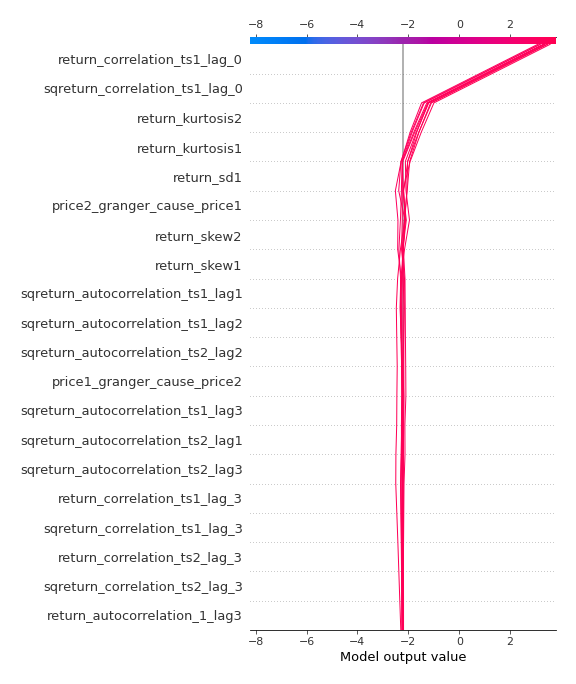
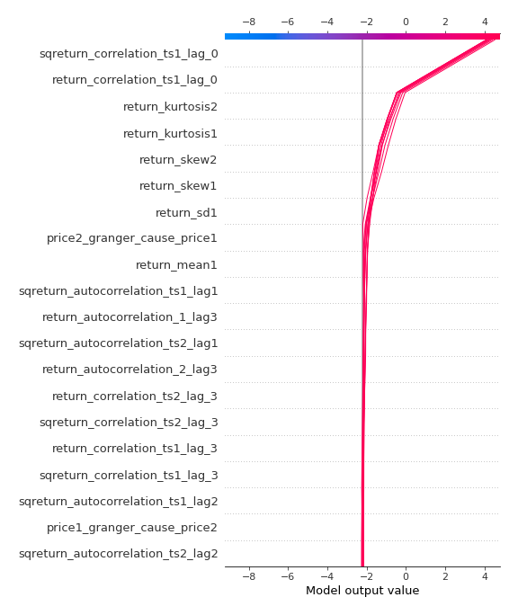

# Summary of 3_Linear

[<< Go back](../README.md)

## Logistic Regression (Linear)
- **n_jobs**: -1
- **explain_level**: 2

## Validation
 - **validation_type**: split
 - **train_ratio**: 0.75
 - **shuffle**: True
 - **stratify**: True

## Optimized metric
accuracy

## Training time

3.1 seconds

## Metric details
|           |     score |     threshold |
|:----------|----------:|--------------:|
| logloss   | 0.0187401 | nan           |
| auc       | 1         | nan           |
| f1        | 1         |   0.491979    |
| accuracy  | 1         |   0.491979    |
| precision | 1         |   0.983105    |
| recall    | 1         |   2.04087e-09 |
| mcc       | 1         |   0.491979    |

## Confusion matrix (at threshold=0.491979)
|                      |   Predicted as real |   Predicted as simulated |
|:---------------------|--------------------:|-------------------------:|
| Labeled as real      |                  42 |                        0 |
| Labeled as simulated |                   0 |                       45 |

## Learning curves

## Coefficients
| feature                           |   Learner_1 |
|:----------------------------------|------------:|
| sqreturn_correlation_ts1_lag_0    |  2.28632    |
| return_correlation_ts1_lag_0      |  2.28632    |
| return_skew1                      |  0.804518   |
| return_skew2                      |  0.499945   |
| return_autocorrelation_1_lag2     |  0.0569115  |
| sqreturn_correlation_ts2_lag_2    |  0.0477816  |
| return_correlation_ts2_lag_2      |  0.0477816  |
| return_autocorrelation_1_lag1     |  0.0466878  |
| return_correlation_ts1_lag_2      |  0.0428728  |
| sqreturn_correlation_ts1_lag_2    |  0.0428728  |
| return_autocorrelation_2_lag1     |  0.0198105  |
| return_sd2                        |  0.012732   |
| return_autocorrelation_2_lag2     |  0.0107238  |
| sqreturn_correlation_ts2_lag_1    | -0.00223625 |
| return_correlation_ts2_lag_1      | -0.00223625 |
| return_mean2                      | -0.0170095  |
| sqreturn_correlation_ts1_lag_1    | -0.0173916  |
| return_correlation_ts1_lag_1      | -0.0173916  |
| price1_granger_cause_price2       | -0.0657163  |
| return_mean1                      | -0.176552   |
| return_autocorrelation_2_lag3     | -0.182799   |
| return_correlation_ts2_lag_3      | -0.19766    |
| sqreturn_correlation_ts2_lag_3    | -0.19766    |
| sqreturn_correlation_ts1_lag_3    | -0.206223   |
| return_correlation_ts1_lag_3      | -0.206223   |
| sqreturn_autocorrelation_ts2_lag1 | -0.206462   |
| return_autocorrelation_1_lag3     | -0.213551   |
| sqreturn_autocorrelation_ts2_lag2 | -0.244703   |
| sqreturn_autocorrelation_ts2_lag3 | -0.249021   |
| sqreturn_autocorrelation_ts1_lag3 | -0.251909   |
| sqreturn_autocorrelation_ts1_lag2 | -0.292056   |
| sqreturn_autocorrelation_ts1_lag1 | -0.348705   |
| price2_granger_cause_price1       | -0.409671   |
| return_sd1                        | -0.576115   |
| return_kurtosis2                  | -0.881755   |
| return_kurtosis1                  | -0.932241   |
| intercept                         | -1.22004    |

## Permutation-based Importance

## Confusion Matrix

## Normalized Confusion Matrix

## ROC Curve

## Kolmogorov-Smirnov Statistic

## Precision-Recall Curve

## Calibration Curve

## Cumulative Gains Curve

## Lift Curve

## SHAP Importance

## SHAP Dependence plots

### Dependence (Fold 1)

## SHAP Decision plots

### Top-10 Worst decisions for class 0 (Fold 1)

### Top-10 Best decisions for class 0 (Fold 1)

### Top-10 Worst decisions for class 1 (Fold 1)

### Top-10 Best decisions for class 1 (Fold 1)

[<< Go back](../README.md)
