# Exploratory Data Analysis

[<< Go back](../README.md)
## Feature : target
- **Feature type** : categorical
- **Missing** : 0.0%
- **Unique** : 2
- **Count** :347
- **Unique** :2
- **Top** :simulated
- **Freq** :178

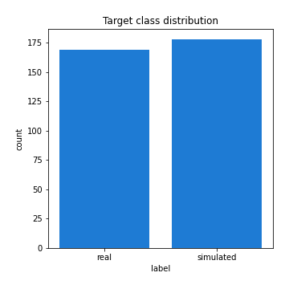
## Feature : return_mean1
- **Feature type** : continous
- **Missing** : 0.0%
- **Unique** : 347
- **Count** :347.0
- **Mean** :-0.009272068638712643
- **Std** :0.1201342407457115
- **Min** :-0.32732699879155386
- **25%th Percentile** : -0.1003482674029117
- **50%th Percentile** : -0.009335666259320164
- **75%th Percentile** : 0.08355294634434747
- **Max** :0.3602793017097547

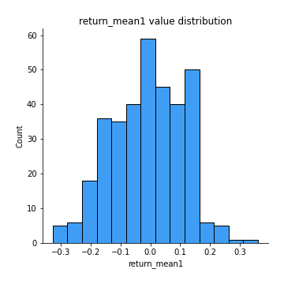
## Feature : return_mean2
- **Feature type** : continous
- **Missing** : 0.0%
- **Unique** : 347
- **Count** :347.0
- **Mean** :0.00546951600280717
- **Std** :0.1192071670536284
- **Min** :-0.3393917268522109
- **25%th Percentile** : -0.06878344732883108
- **50%th Percentile** : 0.014564557741122293
- **75%th Percentile** : 0.080539189051422
- **Max** :0.6801605239983173

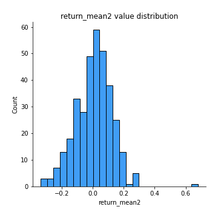
## Feature : return_sd1
- **Feature type** : continous
- **Missing** : 0.0%
- **Unique** : 347
- **Count** :347.0
- **Mean** :1.587969627518792
- **Std** :0.3524289845705496
- **Min** :0.8102430347636637
- **25%th Percentile** : 1.4525862082109646
- **50%th Percentile** : 1.5318276612249353
- **75%th Percentile** : 1.6349514125286708
- **Max** :3.332494027875222

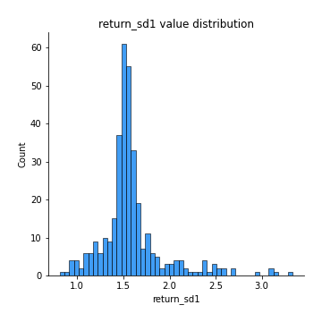
## Feature : return_sd2
- **Feature type** : continous
- **Missing** : 0.0%
- **Unique** : 347
- **Count** :347.0
- **Mean** :1.640113707454266
- **Std** :0.4006320035861015
- **Min** :0.9060171249911689
- **25%th Percentile** : 1.4943654696950281
- **50%th Percentile** : 1.5868627182253936
- **75%th Percentile** : 1.6769675104125596
- **Max** :4.59233049161685

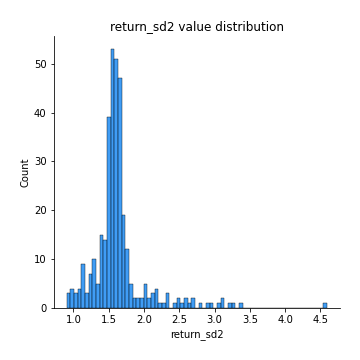
## Feature : return_skew1
- **Feature type** : continous
- **Missing** : 0.0%
- **Unique** : 347
- **Count** :347.0
- **Mean** :-0.1657145477524131
- **Std** :0.7232946946343245
- **Min** :-4.239645236578449
- **25%th Percentile** : -0.3322555112219646
- **50%th Percentile** : -0.07062087436265768
- **75%th Percentile** : 0.09422707065159688
- **Max** :2.351757728252051

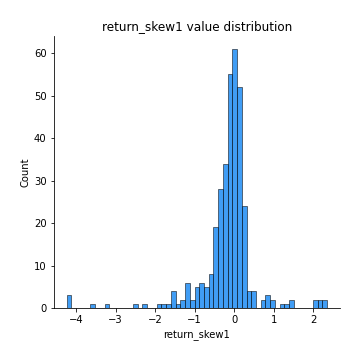
## Feature : return_skew2
- **Feature type** : continous
- **Missing** : 0.0%
- **Unique** : 347
- **Count** :347.0
- **Mean** :-0.2861835946428864
- **Std** :1.0687042811846141
- **Min** :-7.3762354994385335
- **25%th Percentile** : -0.36715115423583733
- **50%th Percentile** : -0.08002252350210938
- **75%th Percentile** : 0.11108337429408667
- **Max** :4.1920266082732045

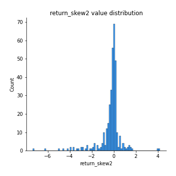
## Feature : return_kurtosis1
- **Feature type** : continous
- **Missing** : 0.0%
- **Unique** : 347
- **Count** :347.0
- **Mean** :2.6142035403663413
- **Std** :5.623788942331569
- **Min** :-0.602731490357685
- **25%th Percentile** : -0.030647357530124486
- **50%th Percentile** : 0.6287627905400925
- **75%th Percentile** : 2.373444226909248
- **Max** :40.485294874464934

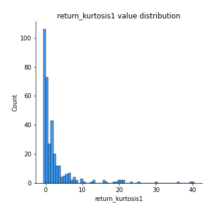
## Feature : return_kurtosis2
- **Feature type** : continous
- **Missing** : 0.0%
- **Unique** : 347
- **Count** :347.0
- **Mean** :4.365495139802814
- **Std** :10.036251526361095
- **Min** :-0.6048323164718745
- **25%th Percentile** : -0.03270267769558255
- **50%th Percentile** : 0.5880050275543174
- **75%th Percentile** : 3.8586921564822534
- **Max** :94.01659180149953

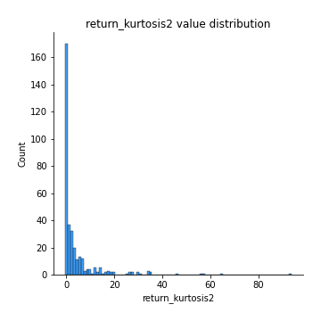
## Feature : return_autocorrelation_1_lag1
- **Feature type** : continous
- **Missing** : 0.0%
- **Unique** : 347
- **Count** :347.0
- **Mean** :-0.01126228423035902
- **Std** :0.06919127161551293
- **Min** :-0.2110198016529991
- **25%th Percentile** : -0.05211021909310411
- **50%th Percentile** : -0.01603738326742121
- **75%th Percentile** : 0.03512261314953888
- **Max** :0.20132571463207988

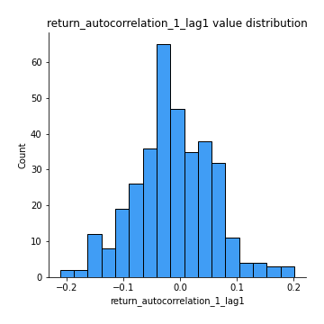
## Feature : return_autocorrelation_1_lag2
- **Feature type** : continous
- **Missing** : 0.0%
- **Unique** : 347
- **Count** :347.0
- **Mean** :-0.011093700457668986
- **Std** :0.06779335992256881
- **Min** :-0.18815240041143846
- **25%th Percentile** : -0.05356158890582134
- **50%th Percentile** : -0.01192951811897518
- **75%th Percentile** : 0.03609765522088565
- **Max** :0.21123611097039302

## Feature : return_autocorrelation_1_lag3
- **Feature type** : continous
- **Missing** : 0.0%
- **Unique** : 347
- **Count** :347.0
- **Mean** :0.0026765588723844528
- **Std** :0.06686174427021285
- **Min** :-0.1817944619132489
- **25%th Percentile** : -0.04164462674553766
- **50%th Percentile** : 0.009939942153355858
- **75%th Percentile** : 0.04349527182311129
- **Max** :0.23585543487635785

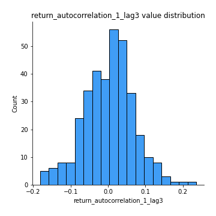
## Feature : return_autocorrelation_2_lag1
- **Feature type** : continous
- **Missing** : 0.0%
- **Unique** : 347
- **Count** :347.0
- **Mean** :-0.0034618507326975266
- **Std** :0.0667576063197197
- **Min** :-0.1922005896794914
- **25%th Percentile** : -0.043395691739681594
- **50%th Percentile** : -0.005050495788718727
- **75%th Percentile** : 0.04790898893525305
- **Max** :0.2024676054184499

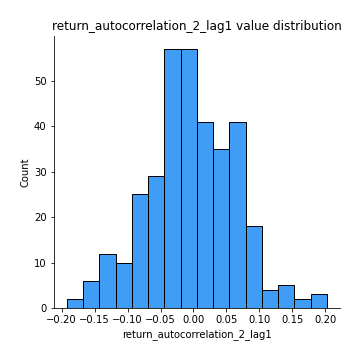
## Feature : return_autocorrelation_2_lag2
- **Feature type** : continous
- **Missing** : 0.0%
- **Unique** : 347
- **Count** :347.0
- **Mean** :-0.012878888874673818
- **Std** :0.06921704395115143
- **Min** :-0.18715951841342182
- **25%th Percentile** : -0.05593346622042718
- **50%th Percentile** : -0.01199327529671253
- **75%th Percentile** : 0.030923776832386424
- **Max** :0.19264615069556024

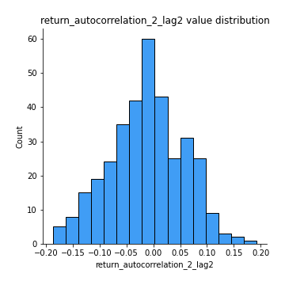
## Feature : return_autocorrelation_2_lag3
- **Feature type** : continous
- **Missing** : 0.0%
- **Unique** : 347
- **Count** :347.0
- **Mean** :0.0010890293833833568
- **Std** :0.06593481583295609
- **Min** :-0.1811311741481465
- **25%th Percentile** : -0.04249385744797892
- **50%th Percentile** : 0.005880215911346961
- **75%th Percentile** : 0.04492158360034028
- **Max** :0.2352050946484215

## Feature : return_correlation_ts1_lag_0
- **Feature type** : continous
- **Missing** : 0.0%
- **Unique** : 347
- **Count** :347.0
- **Mean** :0.6709234056306527
- **Std** :0.361371225241887
- **Min** :-0.10256711281206837
- **25%th Percentile** : 0.33593985726953524
- **50%th Percentile** : 0.9999692844181606
- **75%th Percentile** : 0.9999763067430854
- **Max** :0.9999826226795954

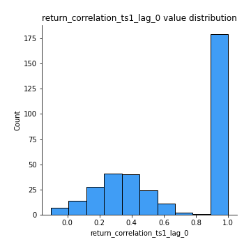
## Feature : return_correlation_ts1_lag_1
- **Feature type** : continous
- **Missing** : 0.0%
- **Unique** : 347
- **Count** :347.0
- **Mean** :-0.006340103607361622
- **Std** :0.0640187247917673
- **Min** :-0.19291693346861707
- **25%th Percentile** : -0.04701667054659847
- **50%th Percentile** : -0.005029618549431017
- **75%th Percentile** : 0.03701292969607682
- **Max** :0.18479546790158735

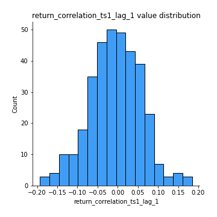
## Feature : return_correlation_ts1_lag_2
- **Feature type** : continous
- **Missing** : 0.0%
- **Unique** : 347
- **Count** :347.0
- **Mean** :-0.009259795932128475
- **Std** :0.06442029734890341
- **Min** :-0.18648530075637054
- **25%th Percentile** : -0.05152592159700614
- **50%th Percentile** : -0.011391081989023938
- **75%th Percentile** : 0.030730357218661304
- **Max** :0.1921048468978963

## Feature : return_correlation_ts1_lag_3
- **Feature type** : continous
- **Missing** : 0.0%
- **Unique** : 347
- **Count** :347.0
- **Mean** :-0.00019167315941368313
- **Std** :0.07035094718819472
- **Min** :-0.21147540839842804
- **25%th Percentile** : -0.043550801332069726
- **50%th Percentile** : 0.00537649469466002
- **75%th Percentile** : 0.04552973913807552
- **Max** :0.23808054096877584

## Feature : return_correlation_ts2_lag_1
- **Feature type** : continous
- **Missing** : 0.0%
- **Unique** : 347
- **Count** :347.0
- **Mean** :-0.0007276636513717914
- **Std** :0.06924439185905618
- **Min** :-0.1929600319258427
- **25%th Percentile** : -0.042634779849981506
- **50%th Percentile** : -0.0026276945796296107
- **75%th Percentile** : 0.04700697035348403
- **Max** :0.3425036902091001

## Feature : return_correlation_ts2_lag_2
- **Feature type** : continous
- **Missing** : 0.0%
- **Unique** : 347
- **Count** :347.0
- **Mean** :-0.008902147744976685
- **Std** :0.06711908536859948
- **Min** :-0.1868713514470836
- **25%th Percentile** : -0.05130146194918256
- **50%th Percentile** : -0.007408998987719144
- **75%th Percentile** : 0.03255054950306631
- **Max** :0.19316949684167842

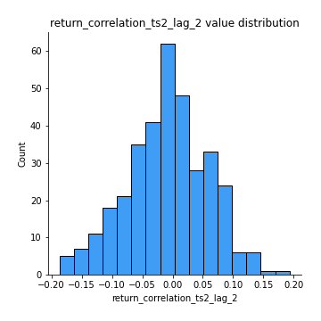
## Feature : return_correlation_ts2_lag_3
- **Feature type** : continous
- **Missing** : 0.0%
- **Unique** : 347
- **Count** :347.0
- **Mean** :0.003787515427525403
- **Std** :0.06563765920542584
- **Min** :-0.1810475353544679
- **25%th Percentile** : -0.04201526633338419
- **50%th Percentile** : 0.008947032196312847
- **75%th Percentile** : 0.04687361126412981
- **Max** :0.23613763151726025

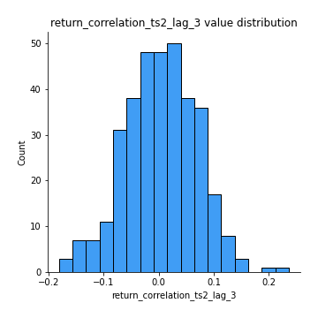
## Feature : sqreturn_autocorrelation_ts1_lag1
- **Feature type** : continous
- **Missing** : 0.0%
- **Unique** : 347
- **Count** :347.0
- **Mean** :0.029575548038784833
- **Std** :0.08625383900573773
- **Min** :-0.15303369989286877
- **25%th Percentile** : -0.02613998300357246
- **50%th Percentile** : 0.00977617362732165
- **75%th Percentile** : 0.07594623482114435
- **Max** :0.4170324090514868

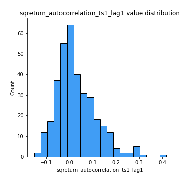
## Feature : sqreturn_autocorrelation_ts1_lag2
- **Feature type** : continous
- **Missing** : 0.0%
- **Unique** : 347
- **Count** :347.0
- **Mean** :0.02322084654915232
- **Std** :0.07190109389862663
- **Min** :-0.1559072100995947
- **25%th Percentile** : -0.02559779881156501
- **50%th Percentile** : 0.012179268753788861
- **75%th Percentile** : 0.06423512747870365
- **Max** :0.32836952056190194

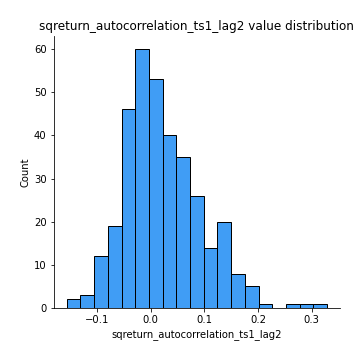
## Feature : sqreturn_autocorrelation_ts1_lag3
- **Feature type** : continous
- **Missing** : 0.0%
- **Unique** : 347
- **Count** :347.0
- **Mean** :0.013487741929109558
- **Std** :0.06190285270747232
- **Min** :-0.14405937607959732
- **25%th Percentile** : -0.024607423476083155
- **50%th Percentile** : 0.006986880195986891
- **75%th Percentile** : 0.045312800445266935
- **Max** :0.23856108238097126

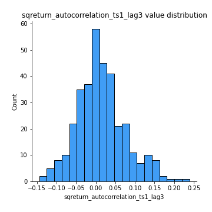
## Feature : sqreturn_autocorrelation_ts2_lag1
- **Feature type** : continous
- **Missing** : 0.0%
- **Unique** : 347
- **Count** :347.0
- **Mean** :0.02218244013330853
- **Std** :0.08084562704943865
- **Min** :-0.15139688414252253
- **25%th Percentile** : -0.02768494586517909
- **50%th Percentile** : 0.0075115896318929155
- **75%th Percentile** : 0.05965844962884167
- **Max** :0.36991568023038357

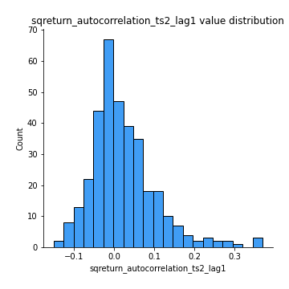
## Feature : sqreturn_autocorrelation_ts2_lag2
- **Feature type** : continous
- **Missing** : 0.0%
- **Unique** : 347
- **Count** :347.0
- **Mean** :0.010843819292873475
- **Std** :0.060081268040329615
- **Min** :-0.15507842317221573
- **25%th Percentile** : -0.023050937279212508
- **50%th Percentile** : 0.00124347066677871
- **75%th Percentile** : 0.04477672938705178
- **Max** :0.28672056150180414

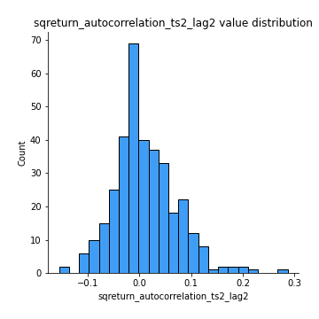
## Feature : sqreturn_autocorrelation_ts2_lag3
- **Feature type** : continous
- **Missing** : 0.0%
- **Unique** : 347
- **Count** :347.0
- **Mean** :0.007828717407583034
- **Std** :0.059613082561350714
- **Min** :-0.1452536284132502
- **25%th Percentile** : -0.029177146096773778
- **50%th Percentile** : -0.0020668752600599065
- **75%th Percentile** : 0.041437964986782164
- **Max** :0.231605349758384

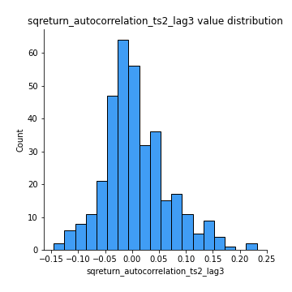
## Feature : sqreturn_correlation_ts1_lag_0
- **Feature type** : continous
- **Missing** : 0.0%
- **Unique** : 347
- **Count** :347.0
- **Mean** :0.6709234056306527
- **Std** :0.361371225241887
- **Min** :-0.10256711281206837
- **25%th Percentile** : 0.33593985726953524
- **50%th Percentile** : 0.9999692844181606
- **75%th Percentile** : 0.9999763067430854
- **Max** :0.9999826226795954

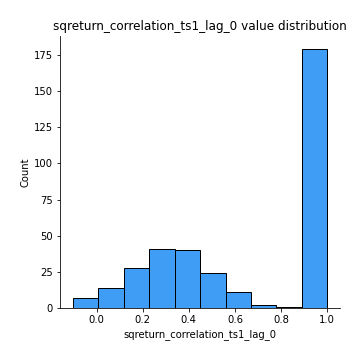
## Feature : sqreturn_correlation_ts1_lag_1
- **Feature type** : continous
- **Missing** : 0.0%
- **Unique** : 347
- **Count** :347.0
- **Mean** :-0.006340103607361622
- **Std** :0.0640187247917673
- **Min** :-0.19291693346861707
- **25%th Percentile** : -0.04701667054659847
- **50%th Percentile** : -0.005029618549431017
- **75%th Percentile** : 0.03701292969607682
- **Max** :0.18479546790158735

## Feature : sqreturn_correlation_ts1_lag_2
- **Feature type** : continous
- **Missing** : 0.0%
- **Unique** : 347
- **Count** :347.0
- **Mean** :-0.009259795932128475
- **Std** :0.06442029734890341
- **Min** :-0.18648530075637054
- **25%th Percentile** : -0.05152592159700614
- **50%th Percentile** : -0.011391081989023938
- **75%th Percentile** : 0.030730357218661304
- **Max** :0.1921048468978963

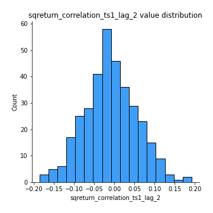
## Feature : sqreturn_correlation_ts1_lag_3
- **Feature type** : continous
- **Missing** : 0.0%
- **Unique** : 347
- **Count** :347.0
- **Mean** :-0.00019167315941368313
- **Std** :0.07035094718819472
- **Min** :-0.21147540839842804
- **25%th Percentile** : -0.043550801332069726
- **50%th Percentile** : 0.00537649469466002
- **75%th Percentile** : 0.04552973913807552
- **Max** :0.23808054096877584

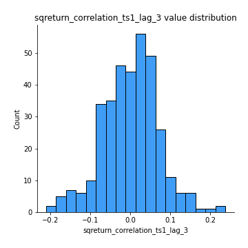
## Feature : sqreturn_correlation_ts2_lag_1
- **Feature type** : continous
- **Missing** : 0.0%
- **Unique** : 347
- **Count** :347.0
- **Mean** :-0.0007276636513717914
- **Std** :0.06924439185905618
- **Min** :-0.1929600319258427
- **25%th Percentile** : -0.042634779849981506
- **50%th Percentile** : -0.0026276945796296107
- **75%th Percentile** : 0.04700697035348403
- **Max** :0.3425036902091001

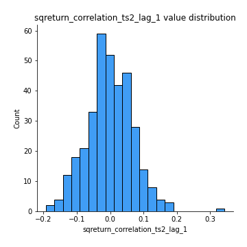
## Feature : sqreturn_correlation_ts2_lag_2
- **Feature type** : continous
- **Missing** : 0.0%
- **Unique** : 347
- **Count** :347.0
- **Mean** :-0.008902147744976685
- **Std** :0.06711908536859948
- **Min** :-0.1868713514470836
- **25%th Percentile** : -0.05130146194918256
- **50%th Percentile** : -0.007408998987719144
- **75%th Percentile** : 0.03255054950306631
- **Max** :0.19316949684167842

## Feature : sqreturn_correlation_ts2_lag_3
- **Feature type** : continous
- **Missing** : 0.0%
- **Unique** : 347
- **Count** :347.0
- **Mean** :0.003787515427525403
- **Std** :0.06563765920542584
- **Min** :-0.1810475353544679
- **25%th Percentile** : -0.04201526633338419
- **50%th Percentile** : 0.008947032196312847
- **75%th Percentile** : 0.04687361126412981
- **Max** :0.23613763151726025

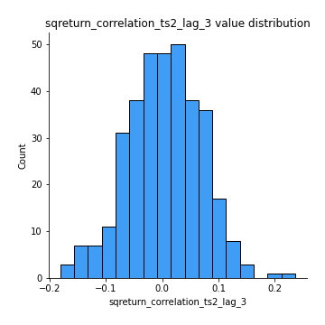
## Feature : price2_granger_cause_price1
- **Feature type** : continous
- **Missing** : 0.0%
- **Unique** : 347
- **Count** :347.0
- **Mean** :0.28423769668176313
- **Std** :0.28963514860834905
- **Min** :2.4312048970873696e-09
- **25%th Percentile** : 0.03129080362634047
- **50%th Percentile** : 0.18998130246117362
- **75%th Percentile** : 0.4552506605736943
- **Max** :0.9930893428273433

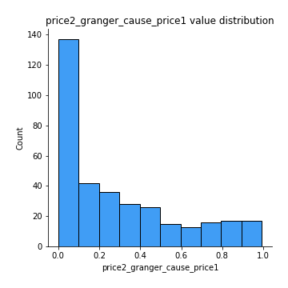
## Feature : price1_granger_cause_price2
- **Feature type** : continous
- **Missing** : 0.0%
- **Unique** : 347
- **Count** :347.0
- **Mean** :0.2758592776620841
- **Std** :0.2764228338075099
- **Min** :1.2012269232170316e-11
- **25%th Percentile** : 0.0412659037225888
- **50%th Percentile** : 0.17948796071918527
- **75%th Percentile** : 0.4328289354332928
- **Max** :0.9881690482297398

[<< Go back](../README.md)
