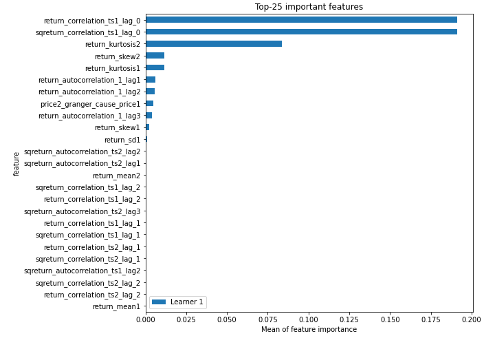
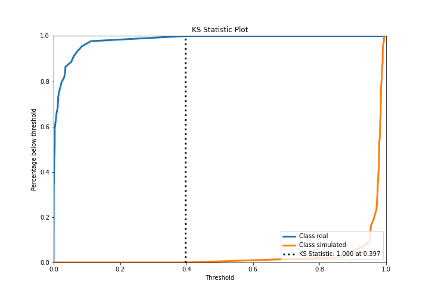
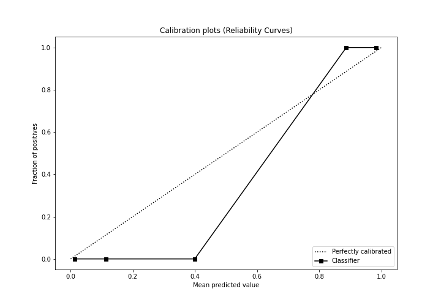
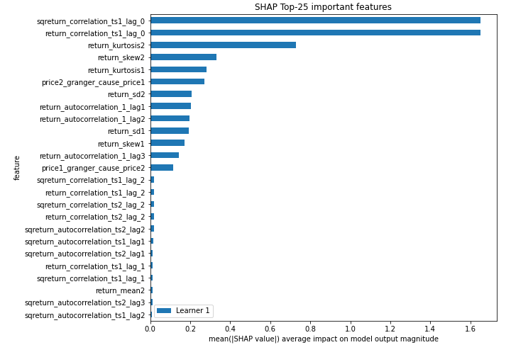
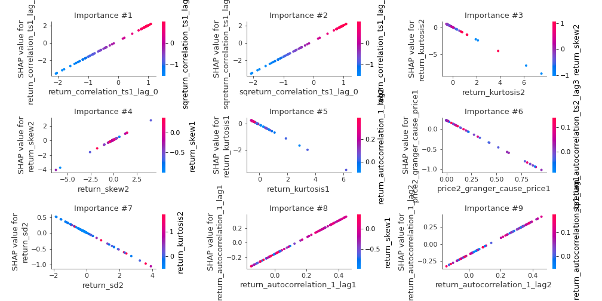
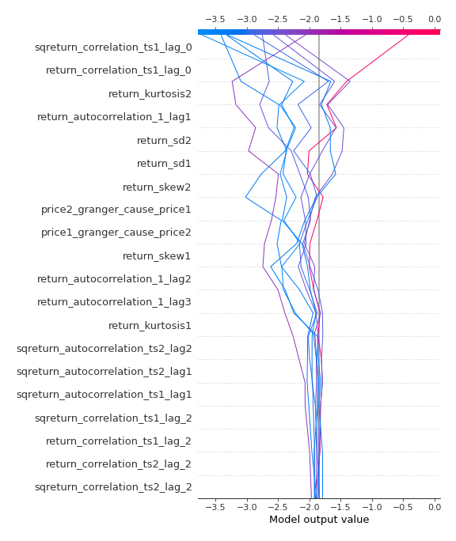
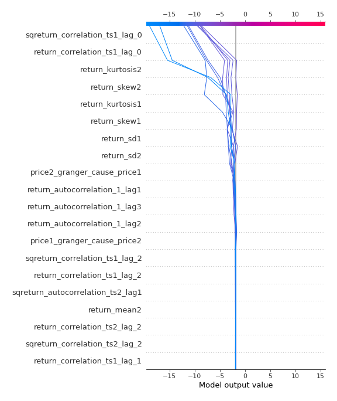
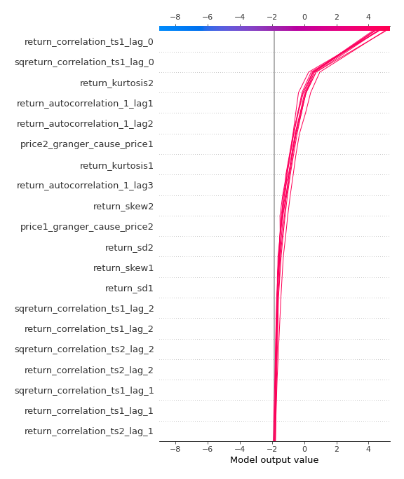

# Summary of 3_Linear

[<< Go back](../README.md)

## Logistic Regression (Linear)
- **n_jobs**: -1
- **explain_level**: 2

## Validation
 - **validation_type**: split
 - **train_ratio**: 0.75
 - **shuffle**: True
 - **stratify**: True

## Optimized metric
accuracy

## Training time

5.9 seconds

## Metric details
|           |     score |     threshold |
|:----------|----------:|--------------:|
| logloss   | 0.0271956 | nan           |
| auc       | 1         | nan           |
| f1        | 1         |   0.490802    |
| accuracy  | 1         |   0.490802    |
| precision | 1         |   0.490802    |
| recall    | 1         |   5.40146e-09 |
| mcc       | 1         |   0.490802    |

## Confusion matrix (at threshold=0.490802)
|                      |   Predicted as real |   Predicted as simulated |
|:---------------------|--------------------:|-------------------------:|
| Labeled as real      |                  44 |                        0 |
| Labeled as simulated |                   0 |                       43 |

## Learning curves

## Coefficients
| feature                           |   Learner_1 |
|:----------------------------------|------------:|
| return_correlation_ts1_lag_0      |  1.80803    |
| sqreturn_correlation_ts1_lag_0    |  1.80803    |
| return_autocorrelation_1_lag2     |  1.21994    |
| return_autocorrelation_1_lag1     |  1.13878    |
| return_autocorrelation_1_lag3     |  0.954699   |
| return_skew2                      |  0.656529   |
| return_skew1                      |  0.506946   |
| sqreturn_correlation_ts1_lag_2    |  0.311473   |
| return_correlation_ts1_lag_2      |  0.311473   |
| return_correlation_ts2_lag_2      |  0.284849   |
| sqreturn_correlation_ts2_lag_2    |  0.284849   |
| return_correlation_ts1_lag_1      |  0.214325   |
| sqreturn_correlation_ts1_lag_1    |  0.214325   |
| return_correlation_ts2_lag_1      |  0.126155   |
| sqreturn_correlation_ts2_lag_1    |  0.126155   |
| return_autocorrelation_2_lag2     |  0.0606639  |
| return_correlation_ts1_lag_3      |  0.0408804  |
| sqreturn_correlation_ts1_lag_3    |  0.0408804  |
| sqreturn_correlation_ts2_lag_3    |  0.00812917 |
| return_correlation_ts2_lag_3      |  0.00812917 |
| return_mean1                      | -0.0126935  |
| return_autocorrelation_2_lag1     | -0.0284206  |
| sqreturn_autocorrelation_ts1_lag3 | -0.0866451  |
| return_mean2                      | -0.111861   |
| return_autocorrelation_2_lag3     | -0.147957   |
| sqreturn_autocorrelation_ts1_lag2 | -0.187331   |
| sqreturn_autocorrelation_ts2_lag3 | -0.234361   |
| sqreturn_autocorrelation_ts1_lag1 | -0.242984   |
| sqreturn_autocorrelation_ts2_lag1 | -0.268763   |
| return_sd2                        | -0.274543   |
| return_sd1                        | -0.296615   |
| sqreturn_autocorrelation_ts2_lag2 | -0.349981   |
| return_kurtosis1                  | -0.561201   |
| price1_granger_cause_price2       | -0.569128   |
| return_kurtosis2                  | -1.147      |
| price2_granger_cause_price1       | -1.30214    |
| intercept                         | -1.35617    |

## Permutation-based Importance

## Confusion Matrix

## Normalized Confusion Matrix

## ROC Curve

## Kolmogorov-Smirnov Statistic

## Precision-Recall Curve

## Calibration Curve

## Cumulative Gains Curve

## Lift Curve

## SHAP Importance

## SHAP Dependence plots

### Dependence (Fold 1)

## SHAP Decision plots

### Top-10 Worst decisions for class 0 (Fold 1)

### Top-10 Best decisions for class 0 (Fold 1)

### Top-10 Worst decisions for class 1 (Fold 1)

### Top-10 Best decisions for class 1 (Fold 1)

[<< Go back](../README.md)
