# Exploratory Data Analysis

[<< Go back](../README.md)
## Feature : target
- **Feature type** : categorical
- **Missing** : 0.0%
- **Unique** : 2
- **Count** :347
- **Unique** :2
- **Top** :real
- **Freq** :176

## Feature : return_mean1
- **Feature type** : continous
- **Missing** : 0.0%
- **Unique** : 347
- **Count** :347.0
- **Mean** :0.05822960181019146
- **Std** :0.18828020749480828
- **Min** :-0.9683719439136165
- **25%th Percentile** : -0.0464689380511779
- **50%th Percentile** : 0.06499150902082884
- **75%th Percentile** : 0.15761773296669487
- **Max** :0.6913941538725221

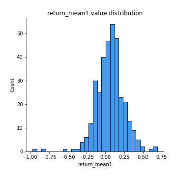
## Feature : return_mean2
- **Feature type** : continous
- **Missing** : 0.0%
- **Unique** : 347
- **Count** :347.0
- **Mean** :-0.004022475422889477
- **Std** :0.12340865747170429
- **Min** :-0.38821745337633223
- **25%th Percentile** : -0.07529728902672889
- **50%th Percentile** : 0.007073783002186218
- **75%th Percentile** : 0.07450911544733765
- **Max** :0.6801605239983173

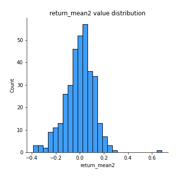
## Feature : return_sd1
- **Feature type** : continous
- **Missing** : 0.0%
- **Unique** : 347
- **Count** :347.0
- **Mean** :1.6373143873011935
- **Std** :0.3684766775630614
- **Min** :0.8733078831717243
- **25%th Percentile** : 1.4843433345603927
- **50%th Percentile** : 1.5959413141375522
- **75%th Percentile** : 1.7036920187652724
- **Max** :3.332494027875222

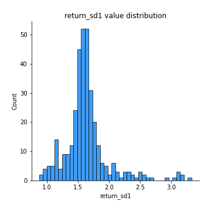
## Feature : return_sd2
- **Feature type** : continous
- **Missing** : 0.0%
- **Unique** : 347
- **Count** :347.0
- **Mean** :1.6526502974901585
- **Std** :0.4186739097252273
- **Min** :0.8198779632289204
- **25%th Percentile** : 1.4873479335731634
- **50%th Percentile** : 1.5705119524524207
- **75%th Percentile** : 1.6621537066758767
- **Max** :4.59233049161685

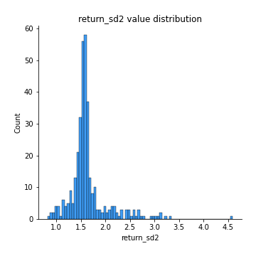
## Feature : return_skew1
- **Feature type** : continous
- **Missing** : 0.0%
- **Unique** : 347
- **Count** :347.0
- **Mean** :-0.20694258358265752
- **Std** :0.7010792326408806
- **Min** :-4.239645236578449
- **25%th Percentile** : -0.3680176362037978
- **50%th Percentile** : -0.13225638976467716
- **75%th Percentile** : 0.04147780325250641
- **Max** :2.1285977762978217

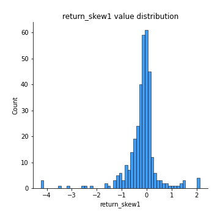
## Feature : return_skew2
- **Feature type** : continous
- **Missing** : 0.0%
- **Unique** : 347
- **Count** :347.0
- **Mean** :-0.23231492992692176
- **Std** :0.9647189179115281
- **Min** :-6.262899561987459
- **25%th Percentile** : -0.2931926826063751
- **50%th Percentile** : -0.055712255222500125
- **75%th Percentile** : 0.11425266648136852
- **Max** :4.0310261345618

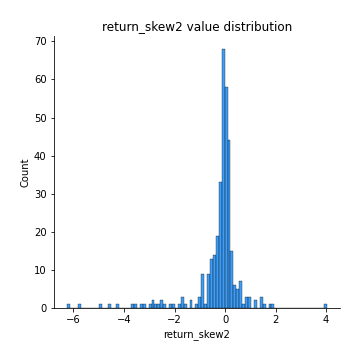
## Feature : return_kurtosis1
- **Feature type** : continous
- **Missing** : 0.0%
- **Unique** : 347
- **Count** :347.0
- **Mean** :2.5679821295896885
- **Std** :5.346254026496462
- **Min** :-0.6386083603722894
- **25%th Percentile** : -0.041514203716318976
- **50%th Percentile** : 0.8578041358107722
- **75%th Percentile** : 2.950686586525767
- **Max** :40.485294874464934

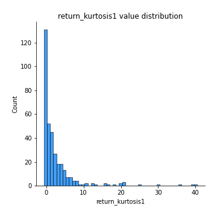
## Feature : return_kurtosis2
- **Feature type** : continous
- **Missing** : 0.0%
- **Unique** : 347
- **Count** :347.0
- **Mean** :3.870343796675494
- **Std** :8.71259008719164
- **Min** :-0.6213949152392746
- **25%th Percentile** : -0.02465788932991675
- **50%th Percentile** : 0.5422707008038814
- **75%th Percentile** : 3.188619372175843
- **Max** :64.99818629655663

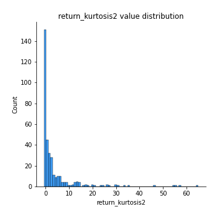
## Feature : return_autocorrelation_1_lag1
- **Feature type** : continous
- **Missing** : 0.0%
- **Unique** : 347
- **Count** :347.0
- **Mean** :0.1497206734828289
- **Std** :0.18641852652792684
- **Min** :-0.2110198016529991
- **25%th Percentile** : -0.025962464055177555
- **50%th Percentile** : 0.12588990927292523
- **75%th Percentile** : 0.32503940989321145
- **Max** :0.5529881112065376

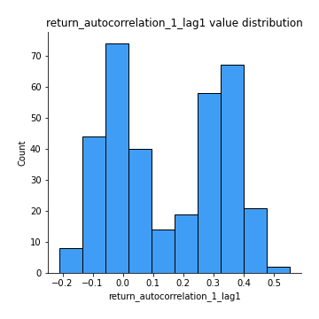
## Feature : return_autocorrelation_1_lag2
- **Feature type** : continous
- **Missing** : 0.0%
- **Unique** : 347
- **Count** :347.0
- **Mean** :0.1453563494365319
- **Std** :0.17936433337679034
- **Min** :-0.15455782934121354
- **25%th Percentile** : -0.021585684726238424
- **50%th Percentile** : 0.14888226947115749
- **75%th Percentile** : 0.31253873601644555
- **Max** :0.5153679883304496

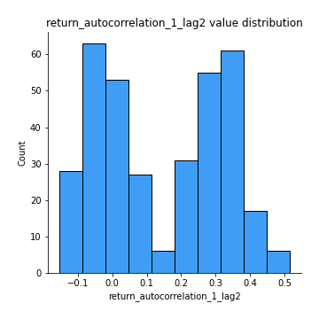
## Feature : return_autocorrelation_1_lag3
- **Feature type** : continous
- **Missing** : 0.0%
- **Unique** : 347
- **Count** :347.0
- **Mean** :0.16711777092735894
- **Std** :0.16628181303600267
- **Min** :-0.1654833157463618
- **25%th Percentile** : 0.02418140152072483
- **50%th Percentile** : 0.12379521314171975
- **75%th Percentile** : 0.3287645215664029
- **Max** :0.511479583435836

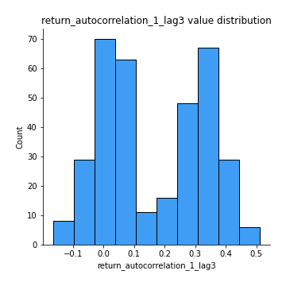
## Feature : return_autocorrelation_2_lag1
- **Feature type** : continous
- **Missing** : 0.0%
- **Unique** : 347
- **Count** :347.0
- **Mean** :0.008508362187084837
- **Std** :0.06989381357392259
- **Min** :-0.20215807744613493
- **25%th Percentile** : -0.03723971180010538
- **50%th Percentile** : 0.005151614185849059
- **75%th Percentile** : 0.057030292099967766
- **Max** :0.2024676054184499

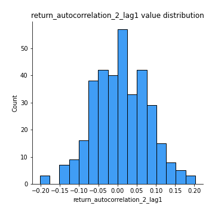
## Feature : return_autocorrelation_2_lag2
- **Feature type** : continous
- **Missing** : 0.0%
- **Unique** : 347
- **Count** :347.0
- **Mean** :-0.004264584109670755
- **Std** :0.06424117664344464
- **Min** :-0.17875819657255254
- **25%th Percentile** : -0.045319562693910305
- **50%th Percentile** : -0.0008191657903346153
- **75%th Percentile** : 0.040741464235906105
- **Max** :0.17440526018588987

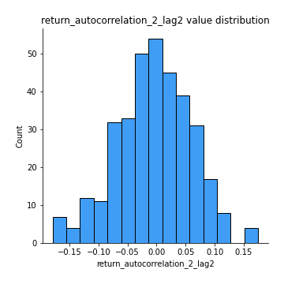
## Feature : return_autocorrelation_2_lag3
- **Feature type** : continous
- **Missing** : 0.0%
- **Unique** : 347
- **Count** :347.0
- **Mean** :0.014691346528266945
- **Std** :0.06424610240447057
- **Min** :-0.1798960840760737
- **25%th Percentile** : -0.023915690206983017
- **50%th Percentile** : 0.013820571758099658
- **75%th Percentile** : 0.056733552927429945
- **Max** :0.21638443099777932

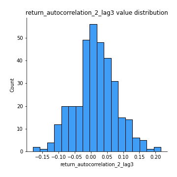
## Feature : return_correlation_ts1_lag_0
- **Feature type** : continous
- **Missing** : 0.0%
- **Unique** : 347
- **Count** :347.0
- **Mean** :0.5821403357409791
- **Std** :0.28754496996818973
- **Min** :-0.10256711281206837
- **25%th Percentile** : 0.3380361619663287
- **50%th Percentile** : 0.6705241772397523
- **75%th Percentile** : 0.8476272913246026
- **Max** :0.9937227277077512

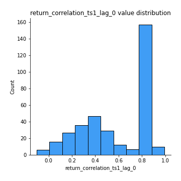
## Feature : return_correlation_ts1_lag_1
- **Feature type** : continous
- **Missing** : 0.0%
- **Unique** : 347
- **Count** :347.0
- **Mean** :0.03268939290624146
- **Std** :0.07928866364269148
- **Min** :-0.18856827637524448
- **25%th Percentile** : -0.020557242409939808
- **50%th Percentile** : 0.02626427120241315
- **75%th Percentile** : 0.08342830557599559
- **Max** :0.30409942691444614

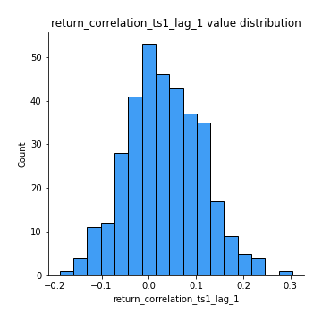
## Feature : return_correlation_ts1_lag_2
- **Feature type** : continous
- **Missing** : 0.0%
- **Unique** : 347
- **Count** :347.0
- **Mean** :0.0271364679604705
- **Std** :0.07307314882977241
- **Min** :-0.16038742223567365
- **25%th Percentile** : -0.025243838055448463
- **50%th Percentile** : 0.02645253680036375
- **75%th Percentile** : 0.07710140587240819
- **Max** :0.22406081438580122

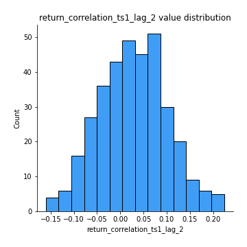
## Feature : return_correlation_ts1_lag_3
- **Feature type** : continous
- **Missing** : 0.0%
- **Unique** : 347
- **Count** :347.0
- **Mean** :0.04159941600997536
- **Std** :0.07735716814891837
- **Min** :-0.21147540839842804
- **25%th Percentile** : -0.011725684818119466
- **50%th Percentile** : 0.04485208622268771
- **75%th Percentile** : 0.09268895902769464
- **Max** :0.2916596754022016

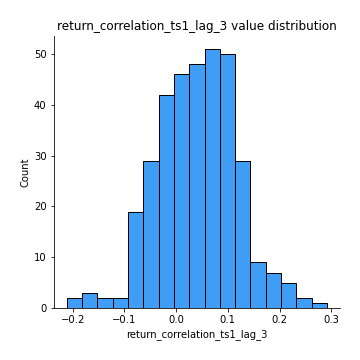
## Feature : return_correlation_ts2_lag_1
- **Feature type** : continous
- **Missing** : 0.0%
- **Unique** : 347
- **Count** :347.0
- **Mean** :0.04133637185447209
- **Std** :0.08058774673359674
- **Min** :-0.17665751184419612
- **25%th Percentile** : -0.010891215762357395
- **50%th Percentile** : 0.043381774124070384
- **75%th Percentile** : 0.0953828711976576
- **Max** :0.3425036902091001

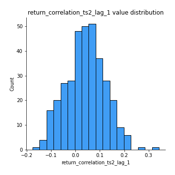
## Feature : return_correlation_ts2_lag_2
- **Feature type** : continous
- **Missing** : 0.0%
- **Unique** : 347
- **Count** :347.0
- **Mean** :0.02575568026575988
- **Std** :0.07649154932350294
- **Min** :-0.2757460186107768
- **25%th Percentile** : -0.02528214712033825
- **50%th Percentile** : 0.0257383216695305
- **75%th Percentile** : 0.07889073468891507
- **Max** :0.2490298081028965

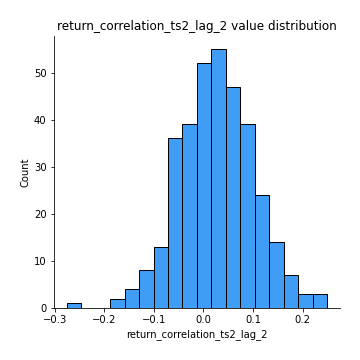
## Feature : return_correlation_ts2_lag_3
- **Feature type** : continous
- **Missing** : 0.0%
- **Unique** : 347
- **Count** :347.0
- **Mean** :0.04650185861434413
- **Std** :0.07465369279849332
- **Min** :-0.15400529526313217
- **25%th Percentile** : -0.007011566238475873
- **50%th Percentile** : 0.047695033951784094
- **75%th Percentile** : 0.09898182215140297
- **Max** :0.2893982211612069

## Feature : sqreturn_autocorrelation_ts1_lag1
- **Feature type** : continous
- **Missing** : 0.0%
- **Unique** : 347
- **Count** :347.0
- **Mean** :0.057842922312855975
- **Std** :0.08154649788761
- **Min** :-0.0671502325425274
- **25%th Percentile** : -0.004179653914568938
- **50%th Percentile** : 0.04185328063733121
- **75%th Percentile** : 0.10206444356515146
- **Max** :0.4170324090514868

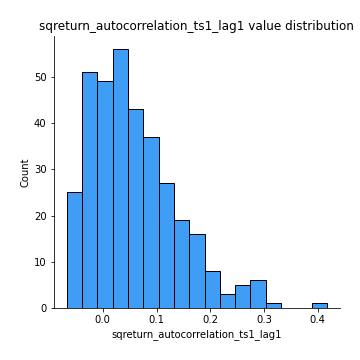
## Feature : sqreturn_autocorrelation_ts1_lag2
- **Feature type** : continous
- **Missing** : 0.0%
- **Unique** : 347
- **Count** :347.0
- **Mean** :0.04895678614275664
- **Std** :0.0718926949746059
- **Min** :-0.08684405202664229
- **25%th Percentile** : -0.0023344787215411333
- **50%th Percentile** : 0.03369227243715862
- **75%th Percentile** : 0.09421081563134498
- **Max** :0.36260365508169773

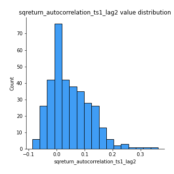
## Feature : sqreturn_autocorrelation_ts1_lag3
- **Feature type** : continous
- **Missing** : 0.0%
- **Unique** : 347
- **Count** :347.0
- **Mean** :0.03864067311336554
- **Std** :0.07401150353520144
- **Min** :-0.14710708232569922
- **25%th Percentile** : -0.010377285865974816
- **50%th Percentile** : 0.02740575974097355
- **75%th Percentile** : 0.07431210660716983
- **Max** :0.36579865351615615

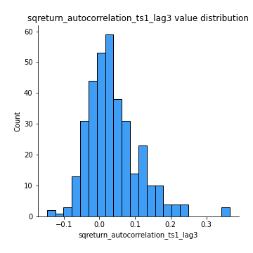
## Feature : sqreturn_autocorrelation_ts2_lag1
- **Feature type** : continous
- **Missing** : 0.0%
- **Unique** : 347
- **Count** :347.0
- **Mean** :0.028338430930209893
- **Std** :0.07259868085200892
- **Min** :-0.12722287060223733
- **25%th Percentile** : -0.020045337815439587
- **50%th Percentile** : 0.018800507013625446
- **75%th Percentile** : 0.06159521328275548
- **Max** :0.36991568023038357

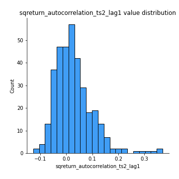
## Feature : sqreturn_autocorrelation_ts2_lag2
- **Feature type** : continous
- **Missing** : 0.0%
- **Unique** : 347
- **Count** :347.0
- **Mean** :0.014786291319433193
- **Std** :0.06714534798482305
- **Min** :-0.16990933396866012
- **25%th Percentile** : -0.025927381913922534
- **50%th Percentile** : 0.005438512894971881
- **75%th Percentile** : 0.04787687668693588
- **Max** :0.28672056150180414

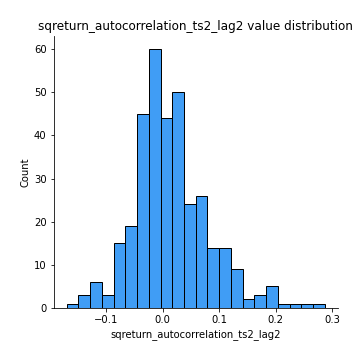
## Feature : sqreturn_autocorrelation_ts2_lag3
- **Feature type** : continous
- **Missing** : 0.0%
- **Unique** : 347
- **Count** :347.0
- **Mean** :0.01158385539729107
- **Std** :0.06453558471196115
- **Min** :-0.14155920059722732
- **25%th Percentile** : -0.028091558170881867
- **50%th Percentile** : -0.0020668752600599065
- **75%th Percentile** : 0.04491447349502449
- **Max** :0.3463122340368414

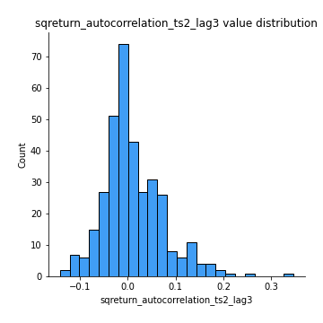
## Feature : sqreturn_correlation_ts1_lag_0
- **Feature type** : continous
- **Missing** : 0.0%
- **Unique** : 347
- **Count** :347.0
- **Mean** :0.5821403357409791
- **Std** :0.28754496996818973
- **Min** :-0.10256711281206837
- **25%th Percentile** : 0.3380361619663287
- **50%th Percentile** : 0.6705241772397523
- **75%th Percentile** : 0.8476272913246026
- **Max** :0.9937227277077512

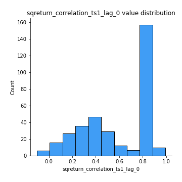
## Feature : sqreturn_correlation_ts1_lag_1
- **Feature type** : continous
- **Missing** : 0.0%
- **Unique** : 347
- **Count** :347.0
- **Mean** :0.03268939290624146
- **Std** :0.07928866364269148
- **Min** :-0.18856827637524448
- **25%th Percentile** : -0.020557242409939808
- **50%th Percentile** : 0.02626427120241315
- **75%th Percentile** : 0.08342830557599559
- **Max** :0.30409942691444614

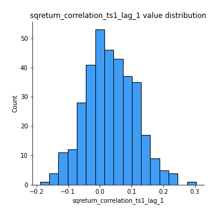
## Feature : sqreturn_correlation_ts1_lag_2
- **Feature type** : continous
- **Missing** : 0.0%
- **Unique** : 347
- **Count** :347.0
- **Mean** :0.0271364679604705
- **Std** :0.07307314882977241
- **Min** :-0.16038742223567365
- **25%th Percentile** : -0.025243838055448463
- **50%th Percentile** : 0.02645253680036375
- **75%th Percentile** : 0.07710140587240819
- **Max** :0.22406081438580122

## Feature : sqreturn_correlation_ts1_lag_3
- **Feature type** : continous
- **Missing** : 0.0%
- **Unique** : 347
- **Count** :347.0
- **Mean** :0.04159941600997536
- **Std** :0.07735716814891837
- **Min** :-0.21147540839842804
- **25%th Percentile** : -0.011725684818119466
- **50%th Percentile** : 0.04485208622268771
- **75%th Percentile** : 0.09268895902769464
- **Max** :0.2916596754022016

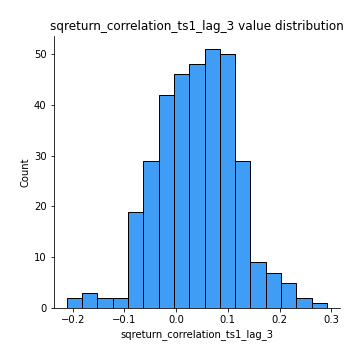
## Feature : sqreturn_correlation_ts2_lag_1
- **Feature type** : continous
- **Missing** : 0.0%
- **Unique** : 347
- **Count** :347.0
- **Mean** :0.04133637185447209
- **Std** :0.08058774673359674
- **Min** :-0.17665751184419612
- **25%th Percentile** : -0.010891215762357395
- **50%th Percentile** : 0.043381774124070384
- **75%th Percentile** : 0.0953828711976576
- **Max** :0.3425036902091001

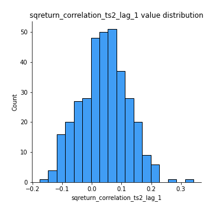
## Feature : sqreturn_correlation_ts2_lag_2
- **Feature type** : continous
- **Missing** : 0.0%
- **Unique** : 347
- **Count** :347.0
- **Mean** :0.02575568026575988
- **Std** :0.07649154932350294
- **Min** :-0.2757460186107768
- **25%th Percentile** : -0.02528214712033825
- **50%th Percentile** : 0.0257383216695305
- **75%th Percentile** : 0.07889073468891507
- **Max** :0.2490298081028965

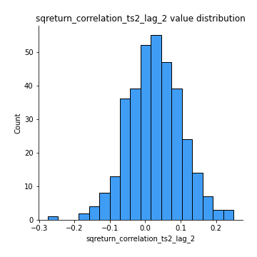
## Feature : sqreturn_correlation_ts2_lag_3
- **Feature type** : continous
- **Missing** : 0.0%
- **Unique** : 347
- **Count** :347.0
- **Mean** :0.04650185861434413
- **Std** :0.07465369279849332
- **Min** :-0.15400529526313217
- **25%th Percentile** : -0.007011566238475873
- **50%th Percentile** : 0.047695033951784094
- **75%th Percentile** : 0.09898182215140297
- **Max** :0.2893982211612069

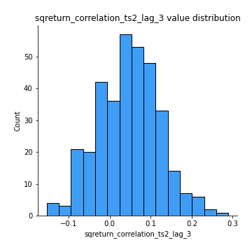
## Feature : price2_granger_cause_price1
- **Feature type** : continous
- **Missing** : 0.0%
- **Unique** : 347
- **Count** :347.0
- **Mean** :0.14775608590028744
- **Std** :0.25155731305212836
- **Min** :1.2761722433370853e-39
- **25%th Percentile** : 8.28031820692153e-05
- **50%th Percentile** : 0.005925686569736922
- **75%th Percentile** : 0.18693283962094231
- **Max** :0.9898380228448623

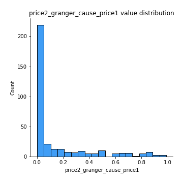
## Feature : price1_granger_cause_price2
- **Feature type** : continous
- **Missing** : 0.0%
- **Unique** : 347
- **Count** :347.0
- **Mean** :0.2282656686653471
- **Std** :0.26117632577352706
- **Min** :1.2012269232170316e-11
- **25%th Percentile** : 0.015547638342658501
- **50%th Percentile** : 0.11808247382409995
- **75%th Percentile** : 0.3820639487700467
- **Max** :0.9871292066441198

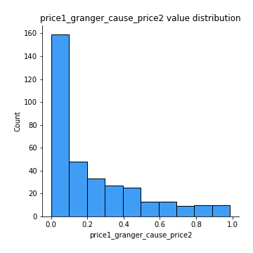

[<< Go back](../README.md)
