# Exploratory Data Analysis

[<< Go back](../README.md)
## Feature : target
- **Feature type** : categorical
- **Missing** : 0.0%
- **Unique** : 2
- **Count** :347
- **Unique** :2
- **Top** :simulated
- **Freq** :178

## Feature : return_mean1
- **Feature type** : continous
- **Missing** : 0.0%
- **Unique** : 347
- **Count** :347.0
- **Mean** :0.02463026632223758
- **Std** :0.10518740121396956
- **Min** :-0.2824480580106233
- **25%th Percentile** : -0.048424824890086704
- **50%th Percentile** : 0.03212461538050739
- **75%th Percentile** : 0.10644877563296173
- **Max** :0.3602793017097547

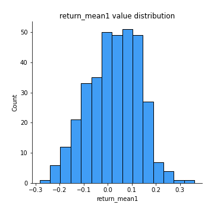
## Feature : return_mean2
- **Feature type** : continous
- **Missing** : 0.0%
- **Unique** : 347
- **Count** :347.0
- **Mean** :0.009945747778545075
- **Std** :0.11354542806745667
- **Min** :-0.3393917268522109
- **25%th Percentile** : -0.05719186774890984
- **50%th Percentile** : 0.011545411627814944
- **75%th Percentile** : 0.0894672475935614
- **Max** :0.6801605239983173

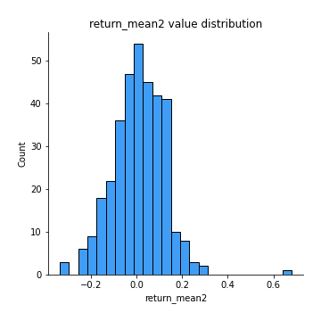
## Feature : return_sd1
- **Feature type** : continous
- **Missing** : 0.0%
- **Unique** : 347
- **Count** :347.0
- **Mean** :1.6206548168539827
- **Std** :0.34953319173017516
- **Min** :0.8102430347636637
- **25%th Percentile** : 1.4839020893541277
- **50%th Percentile** : 1.5869761291129352
- **75%th Percentile** : 1.688056657166127
- **Max** :3.332494027875222

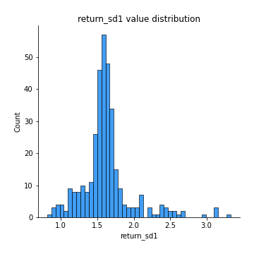
## Feature : return_sd2
- **Feature type** : continous
- **Missing** : 0.0%
- **Unique** : 347
- **Count** :347.0
- **Mean** :1.6988687192371834
- **Std** :0.3993963702822683
- **Min** :0.9060171249911689
- **25%th Percentile** : 1.5310929376816969
- **50%th Percentile** : 1.6864474160476564
- **75%th Percentile** : 1.7775409391100974
- **Max** :4.59233049161685

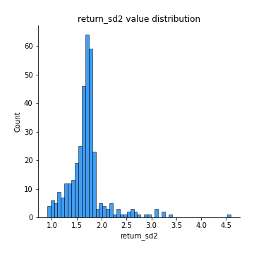
## Feature : return_skew1
- **Feature type** : continous
- **Missing** : 0.0%
- **Unique** : 347
- **Count** :347.0
- **Mean** :-0.17310103860878676
- **Std** :0.7220600259391995
- **Min** :-4.239645236578449
- **25%th Percentile** : -0.3267944109469416
- **50%th Percentile** : -0.08696371350772775
- **75%th Percentile** : 0.08718013861692797
- **Max** :2.351757728252051

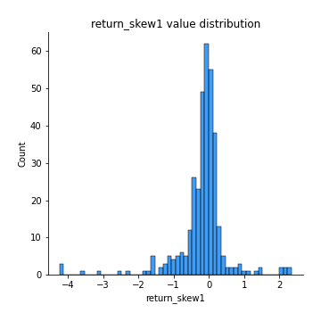
## Feature : return_skew2
- **Feature type** : continous
- **Missing** : 0.0%
- **Unique** : 347
- **Count** :347.0
- **Mean** :-0.2952241758270118
- **Std** :1.0666583359588806
- **Min** :-7.3762354994385335
- **25%th Percentile** : -0.38350498626244583
- **50%th Percentile** : -0.07695216022444783
- **75%th Percentile** : 0.0877920291408171
- **Max** :4.1920266082732045

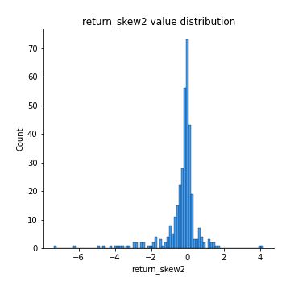
## Feature : return_kurtosis1
- **Feature type** : continous
- **Missing** : 0.0%
- **Unique** : 347
- **Count** :347.0
- **Mean** :2.639319395721503
- **Std** :5.617981990018313
- **Min** :-0.6162256256261878
- **25%th Percentile** : -0.03032423228600245
- **50%th Percentile** : 0.7561677666585798
- **75%th Percentile** : 2.4880315483080713
- **Max** :40.485294874464934

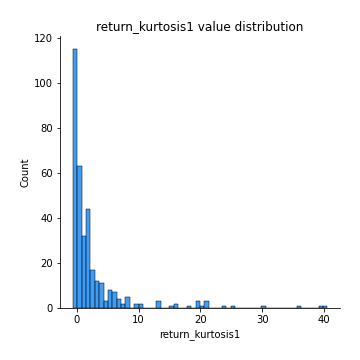
## Feature : return_kurtosis2
- **Feature type** : continous
- **Missing** : 0.0%
- **Unique** : 347
- **Count** :347.0
- **Mean** :4.396792213401182
- **Std** :10.027835919910057
- **Min** :-0.6062445106392671
- **25%th Percentile** : -0.017617966817933928
- **50%th Percentile** : 0.7222163742898466
- **75%th Percentile** : 3.8586921564822534
- **Max** :94.01659180149953

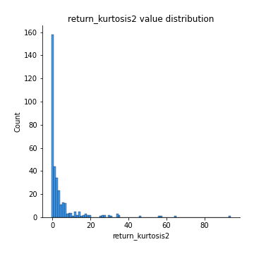
## Feature : return_autocorrelation_1_lag1
- **Feature type** : continous
- **Missing** : 0.0%
- **Unique** : 347
- **Count** :347.0
- **Mean** :-0.010163653122366048
- **Std** :0.0665576869734011
- **Min** :-0.21422765182150216
- **25%th Percentile** : -0.05203120161790522
- **50%th Percentile** : -0.004227506242333625
- **75%th Percentile** : 0.03381031687397121
- **Max** :0.20132571463207988

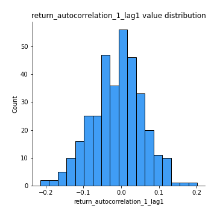
## Feature : return_autocorrelation_1_lag2
- **Feature type** : continous
- **Missing** : 0.0%
- **Unique** : 347
- **Count** :347.0
- **Mean** :-0.01199065734914367
- **Std** :0.06588289643892851
- **Min** :-0.19181134780031503
- **25%th Percentile** : -0.05814159990826201
- **50%th Percentile** : -0.01661247138095126
- **75%th Percentile** : 0.03379439692335812
- **Max** :0.24559412686583718

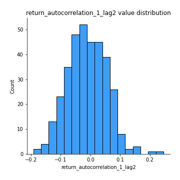
## Feature : return_autocorrelation_1_lag3
- **Feature type** : continous
- **Missing** : 0.0%
- **Unique** : 347
- **Count** :347.0
- **Mean** :0.0014820898936131945
- **Std** :0.06229499522186055
- **Min** :-0.1817944619132489
- **25%th Percentile** : -0.04088736980068699
- **50%th Percentile** : 0.003841662845110888
- **75%th Percentile** : 0.04146523745091397
- **Max** :0.19884018970189696

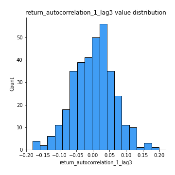
## Feature : return_autocorrelation_2_lag1
- **Feature type** : continous
- **Missing** : 0.0%
- **Unique** : 347
- **Count** :347.0
- **Mean** :-0.0022487910713004755
- **Std** :0.06419301059387779
- **Min** :-0.18130292588089342
- **25%th Percentile** : -0.04041977016433526
- **50%th Percentile** : -0.0010421291230248726
- **75%th Percentile** : 0.047028505255282654
- **Max** :0.2024676054184499

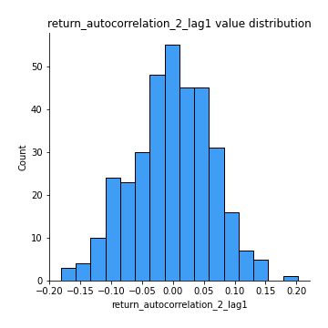
## Feature : return_autocorrelation_2_lag2
- **Feature type** : continous
- **Missing** : 0.0%
- **Unique** : 347
- **Count** :347.0
- **Mean** :-0.012610573972694678
- **Std** :0.06824398784647122
- **Min** :-0.18650941361104664
- **25%th Percentile** : -0.06084990413415504
- **50%th Percentile** : -0.011355527214736249
- **75%th Percentile** : 0.031074892416373533
- **Max** :0.23347314048076276

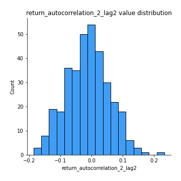
## Feature : return_autocorrelation_2_lag3
- **Feature type** : continous
- **Missing** : 0.0%
- **Unique** : 347
- **Count** :347.0
- **Mean** :0.000450957373813982
- **Std** :0.06096883530555122
- **Min** :-0.15312950866113098
- **25%th Percentile** : -0.04041915903725987
- **50%th Percentile** : -0.0005424491394565572
- **75%th Percentile** : 0.03845132103391386
- **Max** :0.20205753622966244

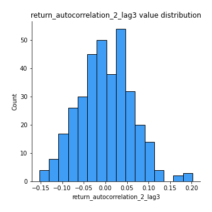
## Feature : return_correlation_ts1_lag_0
- **Feature type** : continous
- **Missing** : 0.0%
- **Unique** : 347
- **Count** :347.0
- **Mean** :0.6583491053718562
- **Std** :0.34992238314060403
- **Min** :-0.10256711281206837
- **25%th Percentile** : 0.33593985726953524
- **50%th Percentile** : 0.9688887812997559
- **75%th Percentile** : 0.9758710605797369
- **Max** :0.9937227277077512

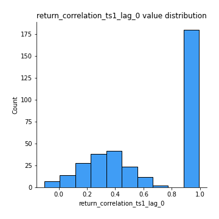
## Feature : return_correlation_ts1_lag_1
- **Feature type** : continous
- **Missing** : 0.0%
- **Unique** : 347
- **Count** :347.0
- **Mean** :-0.006010462246336488
- **Std** :0.06044572504737386
- **Min** :-0.2021832003778509
- **25%th Percentile** : -0.045825199536817914
- **50%th Percentile** : -0.0012448556443178664
- **75%th Percentile** : 0.034122736631052565
- **Max** :0.14868984778667463

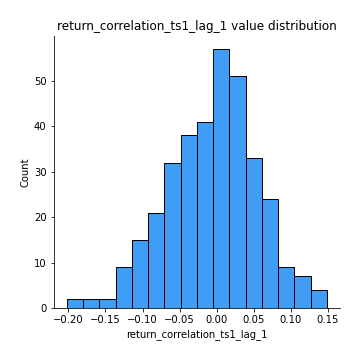
## Feature : return_correlation_ts1_lag_2
- **Feature type** : continous
- **Missing** : 0.0%
- **Unique** : 347
- **Count** :347.0
- **Mean** :-0.00986546875700473
- **Std** :0.06264233235452463
- **Min** :-0.170916673060235
- **25%th Percentile** : -0.05423642761931078
- **50%th Percentile** : -0.011787642425573182
- **75%th Percentile** : 0.03149545774241493
- **Max** :0.23305860549917595

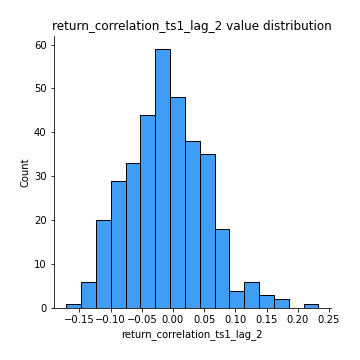
## Feature : return_correlation_ts1_lag_3
- **Feature type** : continous
- **Missing** : 0.0%
- **Unique** : 347
- **Count** :347.0
- **Mean** :-0.0013742570983929017
- **Std** :0.06580810596548892
- **Min** :-0.21147540839842804
- **25%th Percentile** : -0.039982008449532314
- **50%th Percentile** : -0.0002007087054394625
- **75%th Percentile** : 0.04106678314986678
- **Max** :0.23808054096877584

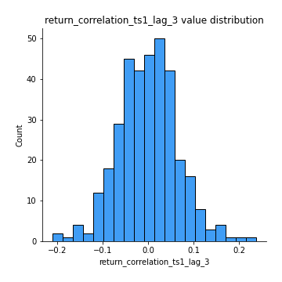
## Feature : return_correlation_ts2_lag_1
- **Feature type** : continous
- **Missing** : 0.0%
- **Unique** : 347
- **Count** :347.0
- **Mean** :0.0014304112165575058
- **Std** :0.06747112659539811
- **Min** :-0.1918366642487622
- **25%th Percentile** : -0.04025815989280278
- **50%th Percentile** : 0.0013326889407501727
- **75%th Percentile** : 0.04620020751479112
- **Max** :0.3425036902091001

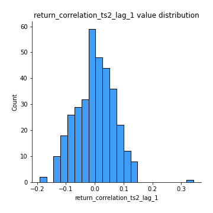
## Feature : return_correlation_ts2_lag_2
- **Feature type** : continous
- **Missing** : 0.0%
- **Unique** : 347
- **Count** :347.0
- **Mean** :-0.008810169193286975
- **Std** :0.0657205647508487
- **Min** :-0.2089010122341169
- **25%th Percentile** : -0.054927800691256745
- **50%th Percentile** : -0.01054753233997117
- **75%th Percentile** : 0.03335353024492811
- **Max** :0.24586285820416864

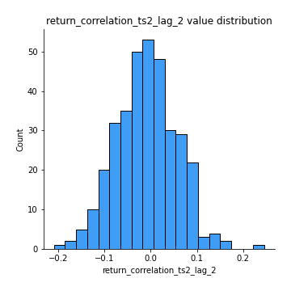
## Feature : return_correlation_ts2_lag_3
- **Feature type** : continous
- **Missing** : 0.0%
- **Unique** : 347
- **Count** :347.0
- **Mean** :0.003250896608369263
- **Std** :0.06078563714120282
- **Min** :-0.16555494403000742
- **25%th Percentile** : -0.04071894627935771
- **50%th Percentile** : 0.00446759395493272
- **75%th Percentile** : 0.04312446018223079
- **Max** :0.18303325867089734

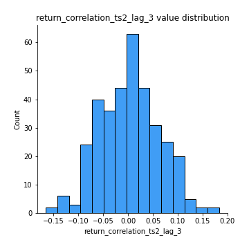
## Feature : sqreturn_autocorrelation_ts1_lag1
- **Feature type** : continous
- **Missing** : 0.0%
- **Unique** : 347
- **Count** :347.0
- **Mean** :0.03134982969881529
- **Std** :0.08338275412307396
- **Min** :-0.14005422845648835
- **25%th Percentile** : -0.025485340657065255
- **50%th Percentile** : 0.01623741042478917
- **75%th Percentile** : 0.07781403994538025
- **Max** :0.4170324090514868

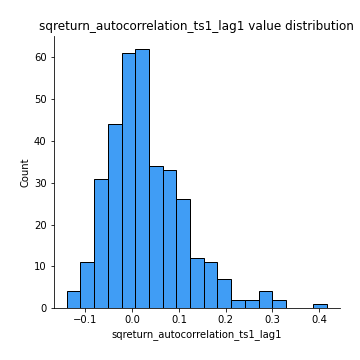
## Feature : sqreturn_autocorrelation_ts1_lag2
- **Feature type** : continous
- **Missing** : 0.0%
- **Unique** : 347
- **Count** :347.0
- **Mean** :0.0233225214744112
- **Std** :0.07230378260692281
- **Min** :-0.1753868274490498
- **25%th Percentile** : -0.025512360877947574
- **50%th Percentile** : 0.012143989376403482
- **75%th Percentile** : 0.06333849654441487
- **Max** :0.32836952056190194

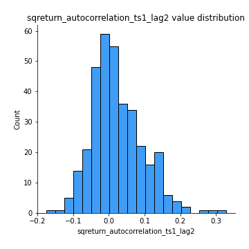
## Feature : sqreturn_autocorrelation_ts1_lag3
- **Feature type** : continous
- **Missing** : 0.0%
- **Unique** : 347
- **Count** :347.0
- **Mean** :0.01327550180047884
- **Std** :0.06001943331764249
- **Min** :-0.15429568047649153
- **25%th Percentile** : -0.029162783434550338
- **50%th Percentile** : 0.007685794394621021
- **75%th Percentile** : 0.045092876168993
- **Max** :0.23856108238097126

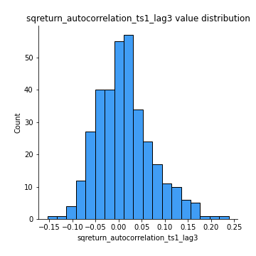
## Feature : sqreturn_autocorrelation_ts2_lag1
- **Feature type** : continous
- **Missing** : 0.0%
- **Unique** : 347
- **Count** :347.0
- **Mean** :0.02408745661066971
- **Std** :0.07769671250020083
- **Min** :-0.1347660256400758
- **25%th Percentile** : -0.02246148993199682
- **50%th Percentile** : 0.009984586535766104
- **75%th Percentile** : 0.05859917044053072
- **Max** :0.36991568023038357

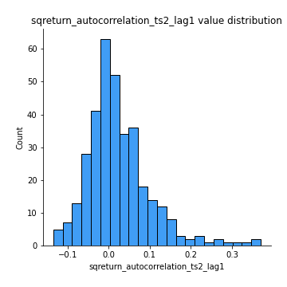
## Feature : sqreturn_autocorrelation_ts2_lag2
- **Feature type** : continous
- **Missing** : 0.0%
- **Unique** : 347
- **Count** :347.0
- **Mean** :0.012266803546775321
- **Std** :0.05978741047769988
- **Min** :-0.1503576196510284
- **25%th Percentile** : -0.022492286253859524
- **50%th Percentile** : 0.00124347066677871
- **75%th Percentile** : 0.04474720571835384
- **Max** :0.28672056150180414

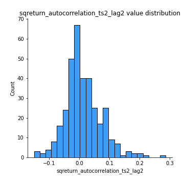
## Feature : sqreturn_autocorrelation_ts2_lag3
- **Feature type** : continous
- **Missing** : 0.0%
- **Unique** : 347
- **Count** :347.0
- **Mean** :0.009750376574496514
- **Std** :0.057782844329984706
- **Min** :-0.13384992393984071
- **25%th Percentile** : -0.02845851376974988
- **50%th Percentile** : 0.0010737963312066414
- **75%th Percentile** : 0.040390169738593606
- **Max** :0.231605349758384

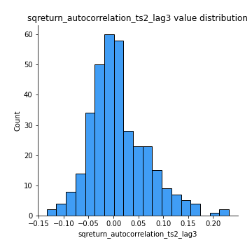
## Feature : sqreturn_correlation_ts1_lag_0
- **Feature type** : continous
- **Missing** : 0.0%
- **Unique** : 347
- **Count** :347.0
- **Mean** :0.6583491053718562
- **Std** :0.34992238314060403
- **Min** :-0.10256711281206837
- **25%th Percentile** : 0.33593985726953524
- **50%th Percentile** : 0.9688887812997559
- **75%th Percentile** : 0.9758710605797369
- **Max** :0.9937227277077512

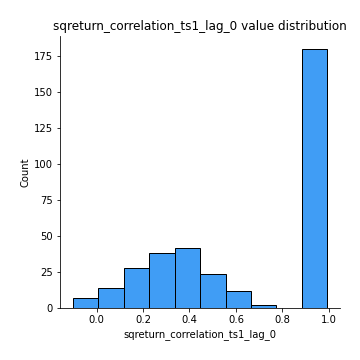
## Feature : sqreturn_correlation_ts1_lag_1
- **Feature type** : continous
- **Missing** : 0.0%
- **Unique** : 347
- **Count** :347.0
- **Mean** :-0.006010462246336488
- **Std** :0.06044572504737386
- **Min** :-0.2021832003778509
- **25%th Percentile** : -0.045825199536817914
- **50%th Percentile** : -0.0012448556443178664
- **75%th Percentile** : 0.034122736631052565
- **Max** :0.14868984778667463

## Feature : sqreturn_correlation_ts1_lag_2
- **Feature type** : continous
- **Missing** : 0.0%
- **Unique** : 347
- **Count** :347.0
- **Mean** :-0.00986546875700473
- **Std** :0.06264233235452463
- **Min** :-0.170916673060235
- **25%th Percentile** : -0.05423642761931078
- **50%th Percentile** : -0.011787642425573182
- **75%th Percentile** : 0.03149545774241493
- **Max** :0.23305860549917595

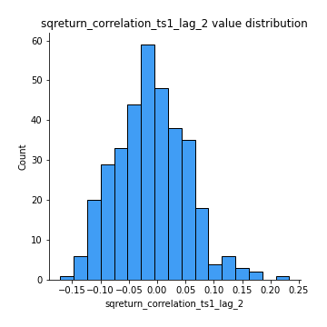
## Feature : sqreturn_correlation_ts1_lag_3
- **Feature type** : continous
- **Missing** : 0.0%
- **Unique** : 347
- **Count** :347.0
- **Mean** :-0.0013742570983929017
- **Std** :0.06580810596548892
- **Min** :-0.21147540839842804
- **25%th Percentile** : -0.039982008449532314
- **50%th Percentile** : -0.0002007087054394625
- **75%th Percentile** : 0.04106678314986678
- **Max** :0.23808054096877584

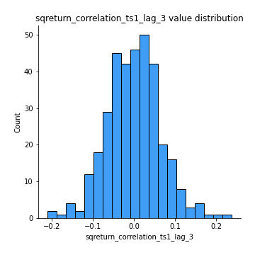
## Feature : sqreturn_correlation_ts2_lag_1
- **Feature type** : continous
- **Missing** : 0.0%
- **Unique** : 347
- **Count** :347.0
- **Mean** :0.0014304112165575058
- **Std** :0.06747112659539811
- **Min** :-0.1918366642487622
- **25%th Percentile** : -0.04025815989280278
- **50%th Percentile** : 0.0013326889407501727
- **75%th Percentile** : 0.04620020751479112
- **Max** :0.3425036902091001

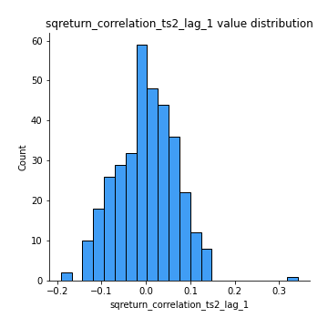
## Feature : sqreturn_correlation_ts2_lag_2
- **Feature type** : continous
- **Missing** : 0.0%
- **Unique** : 347
- **Count** :347.0
- **Mean** :-0.008810169193286975
- **Std** :0.0657205647508487
- **Min** :-0.2089010122341169
- **25%th Percentile** : -0.054927800691256745
- **50%th Percentile** : -0.01054753233997117
- **75%th Percentile** : 0.03335353024492811
- **Max** :0.24586285820416864

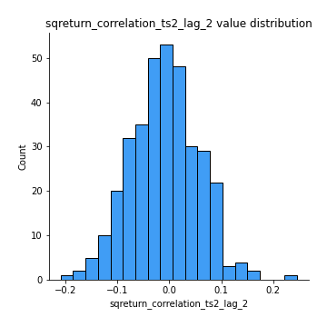
## Feature : sqreturn_correlation_ts2_lag_3
- **Feature type** : continous
- **Missing** : 0.0%
- **Unique** : 347
- **Count** :347.0
- **Mean** :0.003250896608369263
- **Std** :0.06078563714120282
- **Min** :-0.16555494403000742
- **25%th Percentile** : -0.04071894627935771
- **50%th Percentile** : 0.00446759395493272
- **75%th Percentile** : 0.04312446018223079
- **Max** :0.18303325867089734

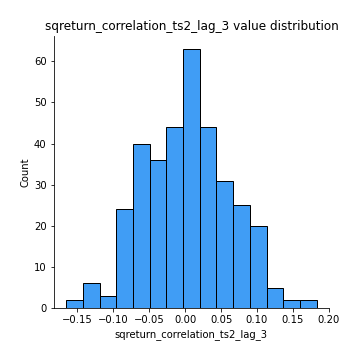
## Feature : price2_granger_cause_price1
- **Feature type** : continous
- **Missing** : 0.0%
- **Unique** : 347
- **Count** :347.0
- **Mean** :0.31295705770378274
- **Std** :0.2905205507234685
- **Min** :2.4312048970873696e-09
- **25%th Percentile** : 0.05646067957601529
- **50%th Percentile** : 0.22014218675402195
- **75%th Percentile** : 0.5195890568602431
- **Max** :0.9908126953230447

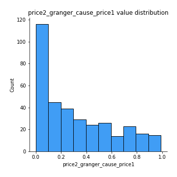
## Feature : price1_granger_cause_price2
- **Feature type** : continous
- **Missing** : 0.0%
- **Unique** : 347
- **Count** :347.0
- **Mean** :0.3260454041385549
- **Std** :0.29392207805245696
- **Min** :1.2012269232170316e-11
- **25%th Percentile** : 0.06107052478949582
- **50%th Percentile** : 0.2505889972517071
- **75%th Percentile** : 0.5586278742771948
- **Max** :0.9871292066441198

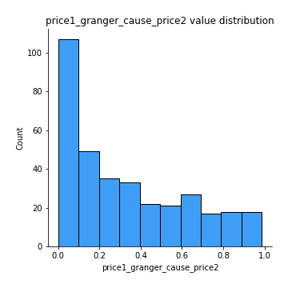

[<< Go back](../README.md)
