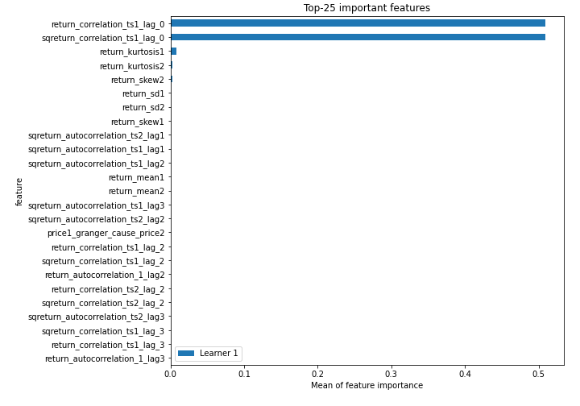
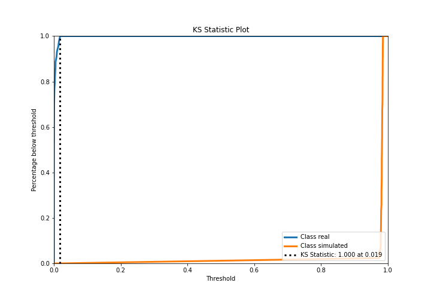
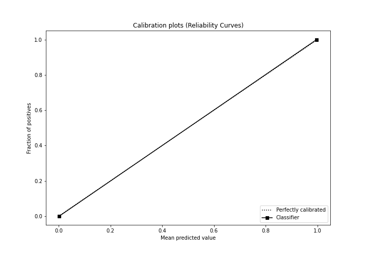
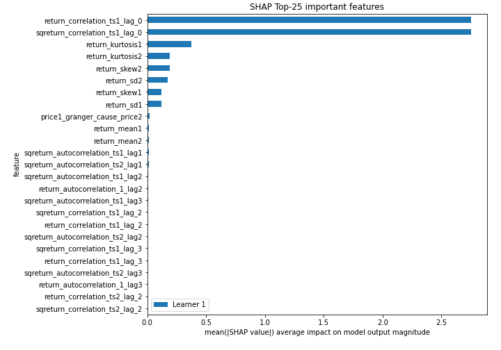
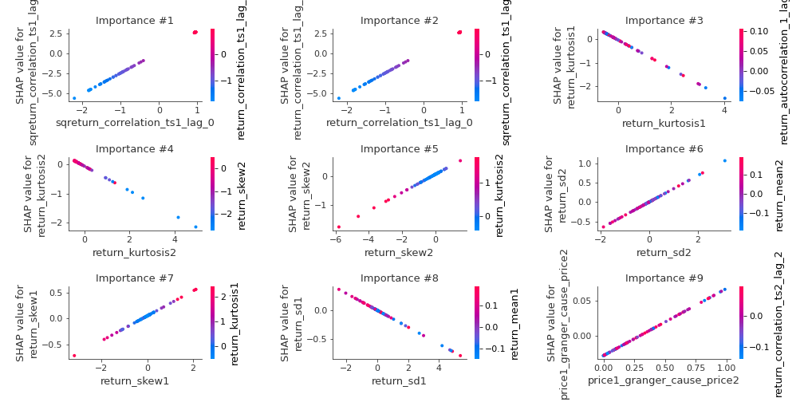
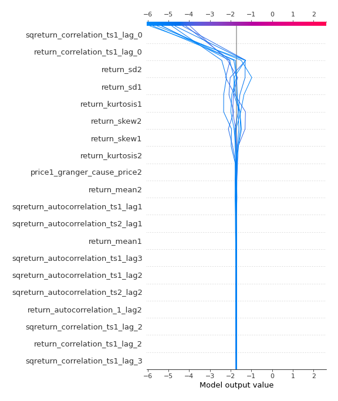
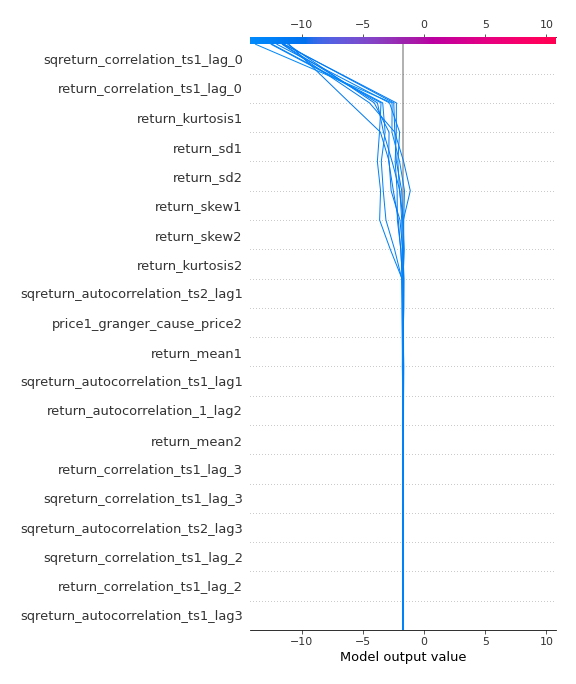
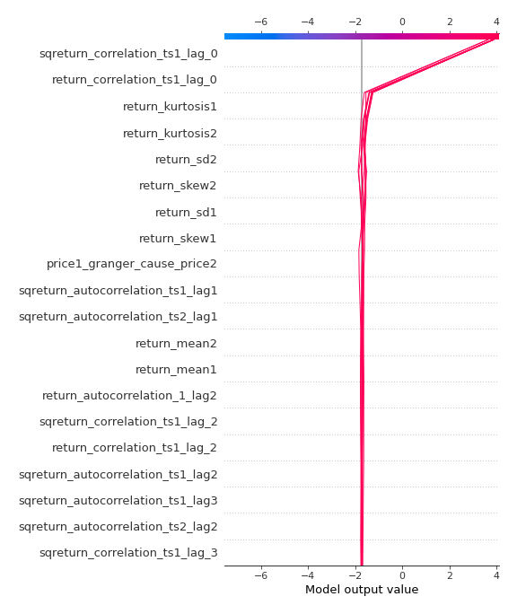
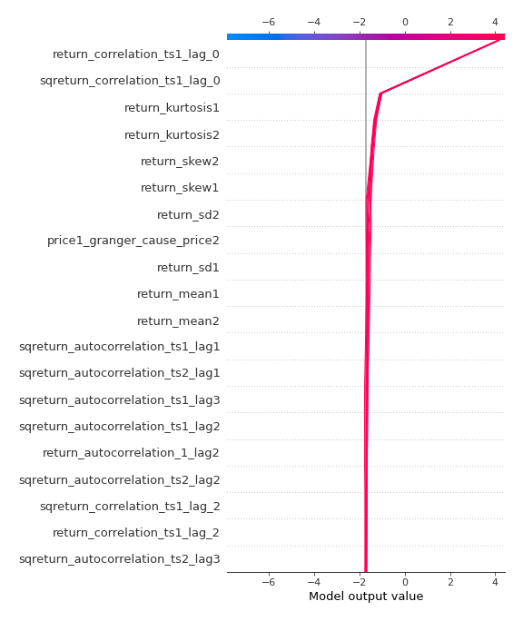

# Summary of 3_Linear

[<< Go back](../README.md)

## Logistic Regression (Linear)
- **n_jobs**: -1
- **explain_level**: 2

## Validation
 - **validation_type**: split
 - **train_ratio**: 0.75
 - **shuffle**: True
 - **stratify**: True

## Optimized metric
accuracy

## Training time

3.3 seconds

## Metric details
|           |     score |     threshold |
|:----------|----------:|--------------:|
| logloss   | 0.0101568 | nan           |
| auc       | 1         | nan           |
| f1        | 1         |   0.490813    |
| accuracy  | 1         |   0.490813    |
| precision | 1         |   0.490813    |
| recall    | 1         |   9.66622e-07 |
| mcc       | 1         |   0.490813    |

## Confusion matrix (at threshold=0.490813)
|                      |   Predicted as real |   Predicted as simulated |
|:---------------------|--------------------:|-------------------------:|
| Labeled as real      |                  44 |                        0 |
| Labeled as simulated |                   0 |                       43 |

## Learning curves

## Coefficients
| feature                           |   Learner_1 |
|:----------------------------------|------------:|
| sqreturn_correlation_ts1_lag_0    |  2.58866    |
| return_correlation_ts1_lag_0      |  2.58866    |
| return_sd2                        |  0.339732   |
| return_skew2                      |  0.312202   |
| return_skew1                      |  0.243003   |
| return_autocorrelation_1_lag2     |  0.104222   |
| sqreturn_correlation_ts1_lag_2    |  0.103786   |
| return_correlation_ts1_lag_2      |  0.103786   |
| price1_granger_cause_price2       |  0.094808   |
| return_autocorrelation_1_lag1     |  0.0485959  |
| sqreturn_correlation_ts2_lag_2    |  0.0451892  |
| return_correlation_ts2_lag_2      |  0.0451892  |
| return_autocorrelation_2_lag2     |  0.019258   |
| price2_granger_cause_price1       |  0.00952807 |
| return_correlation_ts1_lag_1      |  0.00467321 |
| sqreturn_correlation_ts1_lag_1    |  0.00467321 |
| return_autocorrelation_2_lag1     | -0.0266968  |
| sqreturn_correlation_ts2_lag_1    | -0.0272111  |
| return_correlation_ts2_lag_1      | -0.0272111  |
| return_autocorrelation_2_lag3     | -0.0421946  |
| sqreturn_correlation_ts2_lag_3    | -0.0501975  |
| return_correlation_ts2_lag_3      | -0.0501975  |
| return_autocorrelation_1_lag3     | -0.0533633  |
| sqreturn_autocorrelation_ts2_lag3 | -0.0719033  |
| sqreturn_correlation_ts1_lag_3    | -0.0888772  |
| return_correlation_ts1_lag_3      | -0.0888772  |
| sqreturn_autocorrelation_ts1_lag2 | -0.116385   |
| sqreturn_autocorrelation_ts2_lag2 | -0.116609   |
| sqreturn_autocorrelation_ts1_lag3 | -0.135167   |
| return_mean1                      | -0.145023   |
| return_mean2                      | -0.147003   |
| return_sd1                        | -0.149599   |
| sqreturn_autocorrelation_ts2_lag1 | -0.20327    |
| sqreturn_autocorrelation_ts1_lag1 | -0.21341    |
| return_kurtosis2                  | -0.421379   |
| return_kurtosis1                  | -0.612581   |
| intercept                         | -1.36837    |

## Permutation-based Importance

## Confusion Matrix

## Normalized Confusion Matrix

## ROC Curve

## Kolmogorov-Smirnov Statistic

## Precision-Recall Curve

## Calibration Curve

## Cumulative Gains Curve

## Lift Curve

## SHAP Importance

## SHAP Dependence plots

### Dependence (Fold 1)

## SHAP Decision plots

### Top-10 Worst decisions for class 0 (Fold 1)

### Top-10 Best decisions for class 0 (Fold 1)

### Top-10 Worst decisions for class 1 (Fold 1)

### Top-10 Best decisions for class 1 (Fold 1)

[<< Go back](../README.md)
