# Exploratory Data Analysis

[<< Go back](../README.md)
## Feature : target
- **Feature type** : categorical
- **Missing** : 0.0%
- **Unique** : 2
- **Count** :347
- **Unique** :2
- **Top** :real
- **Freq** :175

## Feature : return_mean1
- **Feature type** : continous
- **Missing** : 0.0%
- **Unique** : 347
- **Count** :347.0
- **Mean** :0.013941981112454394
- **Std** :0.10991631130880919
- **Min** :-0.33509654332305777
- **25%th Percentile** : -0.05684875095932886
- **50%th Percentile** : 0.01703083779822765
- **75%th Percentile** : 0.09691438481200956
- **Max** :0.3602793017097547

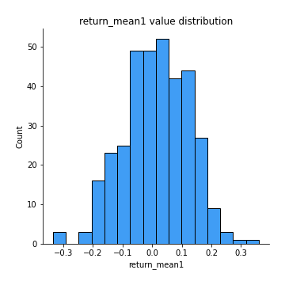
## Feature : return_mean2
- **Feature type** : continous
- **Missing** : 0.0%
- **Unique** : 347
- **Count** :347.0
- **Mean** :-0.0019520356177459635
- **Std** :0.11855178538679084
- **Min** :-0.3743187755133066
- **25%th Percentile** : -0.07848331907858416
- **50%th Percentile** : -0.003927576235059101
- **75%th Percentile** : 0.07000239296021002
- **Max** :0.6801605239983173

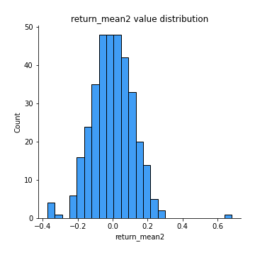
## Feature : return_sd1
- **Feature type** : continous
- **Missing** : 0.0%
- **Unique** : 347
- **Count** :347.0
- **Mean** :1.6273023204758366
- **Std** :0.35949836575319266
- **Min** :0.8102430347636637
- **25%th Percentile** : 1.4927698401267961
- **50%th Percentile** : 1.5988744279847977
- **75%th Percentile** : 1.7080769160093825
- **Max** :3.332494027875222

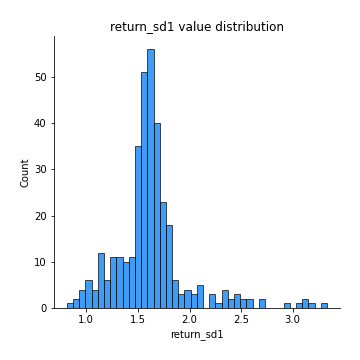
## Feature : return_sd2
- **Feature type** : continous
- **Missing** : 0.0%
- **Unique** : 347
- **Count** :347.0
- **Mean** :1.718982346559358
- **Std** :0.41337002328815353
- **Min** :0.8198779632289204
- **25%th Percentile** : 1.5447302923579969
- **50%th Percentile** : 1.6986145557971077
- **75%th Percentile** : 1.7935176252750065
- **Max** :4.59233049161685

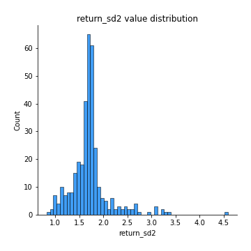
## Feature : return_skew1
- **Feature type** : continous
- **Missing** : 0.0%
- **Unique** : 347
- **Count** :347.0
- **Mean** :-0.1919493884460084
- **Std** :0.7276328112950511
- **Min** :-4.239645236578449
- **25%th Percentile** : -0.3562280767945572
- **50%th Percentile** : -0.08548313560370106
- **75%th Percentile** : 0.0923400855127137
- **Max** :2.3044235031125564

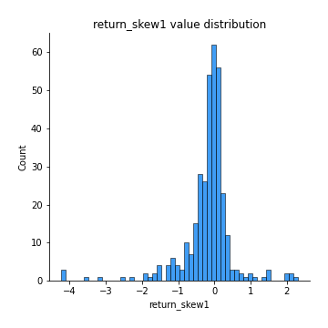
## Feature : return_skew2
- **Feature type** : continous
- **Missing** : 0.0%
- **Unique** : 347
- **Count** :347.0
- **Mean** :-0.3145893348012482
- **Std** :1.0556023057190913
- **Min** :-7.3762354994385335
- **25%th Percentile** : -0.37583108047593483
- **50%th Percentile** : -0.07914941665824066
- **75%th Percentile** : 0.08409862539685707
- **Max** :4.0310261345618

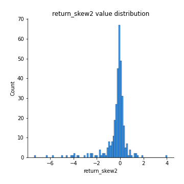
## Feature : return_kurtosis1
- **Feature type** : continous
- **Missing** : 0.0%
- **Unique** : 347
- **Count** :347.0
- **Mean** :2.7530033388280244
- **Std** :5.591638415363854
- **Min** :-0.6972372890515008
- **25%th Percentile** : 0.02374705214027939
- **50%th Percentile** : 0.7922008319617801
- **75%th Percentile** : 2.678812472527533
- **Max** :40.485294874464934

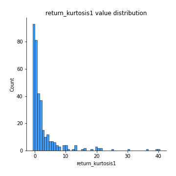
## Feature : return_kurtosis2
- **Feature type** : continous
- **Missing** : 0.0%
- **Unique** : 347
- **Count** :347.0
- **Mean** :4.115819640248866
- **Std** :9.958812712034295
- **Min** :-0.6737060220969977
- **25%th Percentile** : 0.034979800998353516
- **50%th Percentile** : 0.9192344156974395
- **75%th Percentile** : 3.412535743099394
- **Max** :94.01659180149953

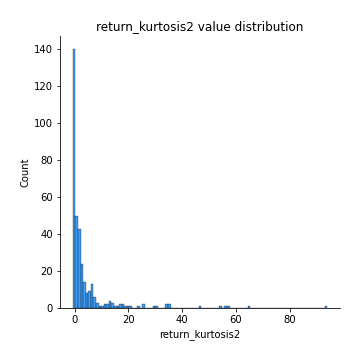
## Feature : return_autocorrelation_1_lag1
- **Feature type** : continous
- **Missing** : 0.0%
- **Unique** : 347
- **Count** :347.0
- **Mean** :-0.012809638917773966
- **Std** :0.06521886041391578
- **Min** :-0.2110198016529991
- **25%th Percentile** : -0.05805498307085198
- **50%th Percentile** : -0.01424863247972611
- **75%th Percentile** : 0.02836001249905577
- **Max** :0.19915236181667445

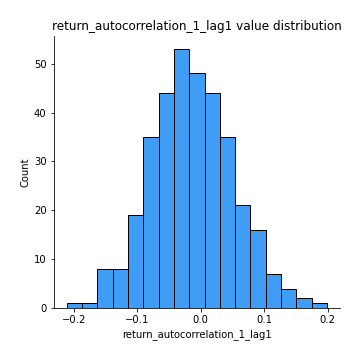
## Feature : return_autocorrelation_1_lag2
- **Feature type** : continous
- **Missing** : 0.0%
- **Unique** : 347
- **Count** :347.0
- **Mean** :-0.01166146536702903
- **Std** :0.06585815400036121
- **Min** :-0.18815240041143846
- **25%th Percentile** : -0.05812921634317662
- **50%th Percentile** : -0.01200012237938764
- **75%th Percentile** : 0.03663911389923666
- **Max** :0.21123611097039302

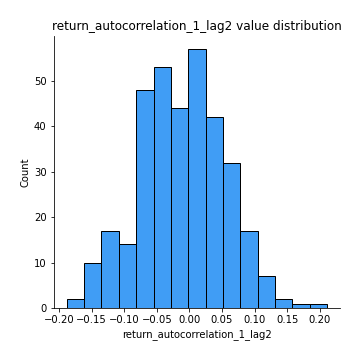
## Feature : return_autocorrelation_1_lag3
- **Feature type** : continous
- **Missing** : 0.0%
- **Unique** : 347
- **Count** :347.0
- **Mean** :0.005810809415008294
- **Std** :0.06148260106396584
- **Min** :-0.18755190652013176
- **25%th Percentile** : -0.03530719135502687
- **50%th Percentile** : 0.010474788706038967
- **75%th Percentile** : 0.04625471324158989
- **Max** :0.17514033413395239

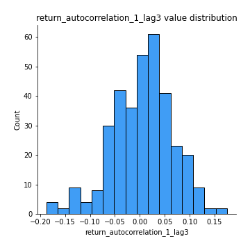
## Feature : return_autocorrelation_2_lag1
- **Feature type** : continous
- **Missing** : 0.0%
- **Unique** : 347
- **Count** :347.0
- **Mean** :-0.007751262195606034
- **Std** :0.06898772071620575
- **Min** :-0.17778763204400128
- **25%th Percentile** : -0.05641765895443503
- **50%th Percentile** : -0.008048966802515161
- **75%th Percentile** : 0.04479514475432943
- **Max** :0.21029890235682058

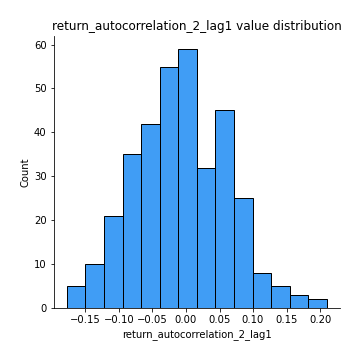
## Feature : return_autocorrelation_2_lag2
- **Feature type** : continous
- **Missing** : 0.0%
- **Unique** : 347
- **Count** :347.0
- **Mean** :-0.010257652351629037
- **Std** :0.06440294800389411
- **Min** :-0.1819970307582585
- **25%th Percentile** : -0.0532726956060747
- **50%th Percentile** : -0.009268954225254046
- **75%th Percentile** : 0.033422246317287185
- **Max** :0.1672134824577961

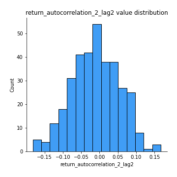
## Feature : return_autocorrelation_2_lag3
- **Feature type** : continous
- **Missing** : 0.0%
- **Unique** : 347
- **Count** :347.0
- **Mean** :0.0025768102522111726
- **Std** :0.0635304577086299
- **Min** :-0.1798960840760737
- **25%th Percentile** : -0.03545608745728042
- **50%th Percentile** : 0.003971785132774557
- **75%th Percentile** : 0.04325799851249533
- **Max** :0.20205753622966244

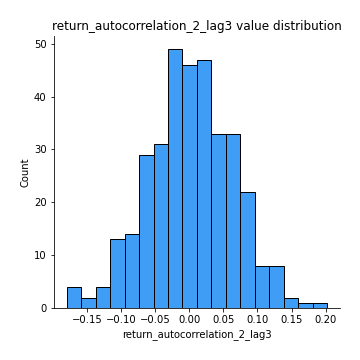
## Feature : return_correlation_ts1_lag_0
- **Feature type** : continous
- **Missing** : 0.0%
- **Unique** : 347
- **Count** :347.0
- **Mean** :0.6420379971188178
- **Std** :0.3519582861664902
- **Min** :-0.10256711281206837
- **25%th Percentile** : 0.32409496960217626
- **50%th Percentile** : 0.7082699009496575
- **75%th Percentile** : 0.9756859024483151
- **Max** :0.9825300478097198

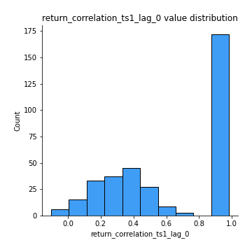
## Feature : return_correlation_ts1_lag_1
- **Feature type** : continous
- **Missing** : 0.0%
- **Unique** : 347
- **Count** :347.0
- **Mean** :-0.009131047305530951
- **Std** :0.06259244679696879
- **Min** :-0.15322812483224557
- **25%th Percentile** : -0.055254101860378324
- **50%th Percentile** : -0.003544207395722804
- **75%th Percentile** : 0.03211273148389144
- **Max** :0.20810360847194076

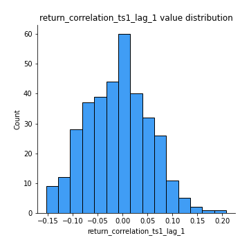
## Feature : return_correlation_ts1_lag_2
- **Feature type** : continous
- **Missing** : 0.0%
- **Unique** : 347
- **Count** :347.0
- **Mean** :-0.008842178962279252
- **Std** :0.06295041227262625
- **Min** :-0.172871336111873
- **25%th Percentile** : -0.05110582263198189
- **50%th Percentile** : -0.010603398998530154
- **75%th Percentile** : 0.03620312127011748
- **Max** :0.1835917471189421

## Feature : return_correlation_ts1_lag_3
- **Feature type** : continous
- **Missing** : 0.0%
- **Unique** : 347
- **Count** :347.0
- **Mean** :0.0014334618157749483
- **Std** :0.06513885579877081
- **Min** :-0.21147540839842804
- **25%th Percentile** : -0.037978405712139646
- **50%th Percentile** : 0.0031653594275632617
- **75%th Percentile** : 0.043407380583394134
- **Max** :0.23808054096877584

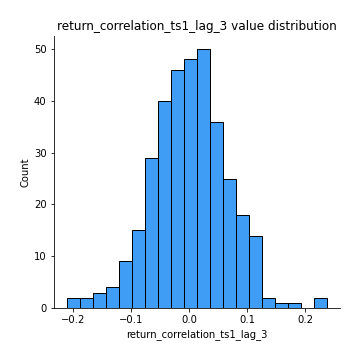
## Feature : return_correlation_ts2_lag_1
- **Feature type** : continous
- **Missing** : 0.0%
- **Unique** : 347
- **Count** :347.0
- **Mean** :-0.0028991204554049107
- **Std** :0.0713128865058776
- **Min** :-0.17665751184419612
- **25%th Percentile** : -0.05389796285697512
- **50%th Percentile** : -0.005115629176716094
- **75%th Percentile** : 0.04340446863876801
- **Max** :0.3425036902091001

## Feature : return_correlation_ts2_lag_2
- **Feature type** : continous
- **Missing** : 0.0%
- **Unique** : 347
- **Count** :347.0
- **Mean** :-0.005442626054598949
- **Std** :0.0661287076596873
- **Min** :-0.2757460186107768
- **25%th Percentile** : -0.048502685687084844
- **50%th Percentile** : -0.0027836989457013656
- **75%th Percentile** : 0.04021844041976416
- **Max** :0.1668209648754713

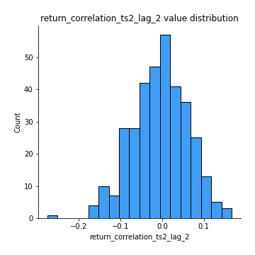
## Feature : return_correlation_ts2_lag_3
- **Feature type** : continous
- **Missing** : 0.0%
- **Unique** : 347
- **Count** :347.0
- **Mean** :0.0058423549238743756
- **Std** :0.06200490422040943
- **Min** :-0.1782856542170424
- **25%th Percentile** : -0.03615472958089416
- **50%th Percentile** : 0.006432224469415529
- **75%th Percentile** : 0.04851156529156421
- **Max** :0.18227042221329348

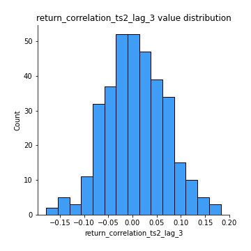
## Feature : sqreturn_autocorrelation_ts1_lag1
- **Feature type** : continous
- **Missing** : 0.0%
- **Unique** : 347
- **Count** :347.0
- **Mean** :0.034624822590420636
- **Std** :0.08286587513999523
- **Min** :-0.13599523097325303
- **25%th Percentile** : -0.019739361789311904
- **50%th Percentile** : 0.02373495074254076
- **75%th Percentile** : 0.07908766097627706
- **Max** :0.4170324090514868

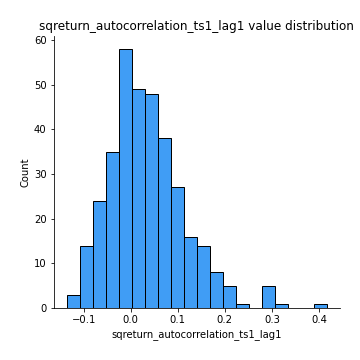
## Feature : sqreturn_autocorrelation_ts1_lag2
- **Feature type** : continous
- **Missing** : 0.0%
- **Unique** : 347
- **Count** :347.0
- **Mean** :0.01718059445581117
- **Std** :0.06912335219340987
- **Min** :-0.14442658157847946
- **25%th Percentile** : -0.02893250815260532
- **50%th Percentile** : 0.006527571743635394
- **75%th Percentile** : 0.05719828241729115
- **Max** :0.29415594530501293

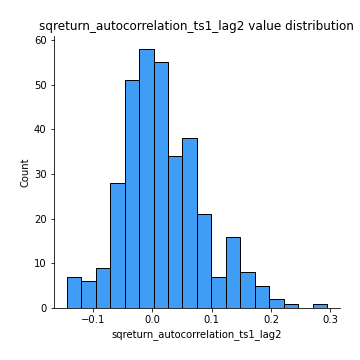
## Feature : sqreturn_autocorrelation_ts1_lag3
- **Feature type** : continous
- **Missing** : 0.0%
- **Unique** : 347
- **Count** :347.0
- **Mean** :0.00931625801509705
- **Std** :0.06516676794707565
- **Min** :-0.172248024242793
- **25%th Percentile** : -0.03401153216467394
- **50%th Percentile** : -4.081914678517813e-05
- **75%th Percentile** : 0.04039525814598505
- **Max** :0.36579865351615615

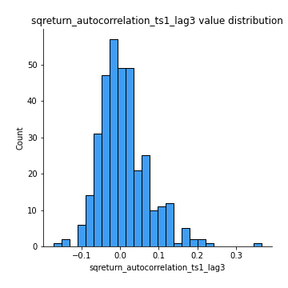
## Feature : sqreturn_autocorrelation_ts2_lag1
- **Feature type** : continous
- **Missing** : 0.0%
- **Unique** : 347
- **Count** :347.0
- **Mean** :0.025079569147589232
- **Std** :0.07748298317398492
- **Min** :-0.13433642763017753
- **25%th Percentile** : -0.024685767211993143
- **50%th Percentile** : 0.0177537915971994
- **75%th Percentile** : 0.06252223450059877
- **Max** :0.3533869018400006

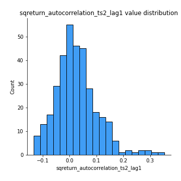
## Feature : sqreturn_autocorrelation_ts2_lag2
- **Feature type** : continous
- **Missing** : 0.0%
- **Unique** : 347
- **Count** :347.0
- **Mean** :0.009621017765177679
- **Std** :0.05968381260768999
- **Min** :-0.14946493442664188
- **25%th Percentile** : -0.022492286253859524
- **50%th Percentile** : 0.0023656530487693108
- **75%th Percentile** : 0.042215939187441494
- **Max** :0.2357173664732939

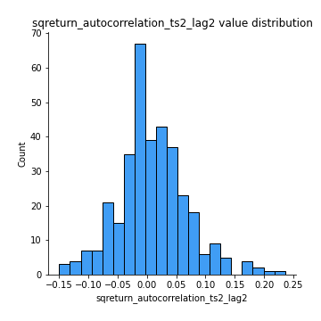
## Feature : sqreturn_autocorrelation_ts2_lag3
- **Feature type** : continous
- **Missing** : 0.0%
- **Unique** : 347
- **Count** :347.0
- **Mean** :0.0058347490765283325
- **Std** :0.06459659410593864
- **Min** :-0.12577079504152155
- **25%th Percentile** : -0.033824186259489575
- **50%th Percentile** : -0.007133499729945041
- **75%th Percentile** : 0.03718086667583105
- **Max** :0.3463122340368414

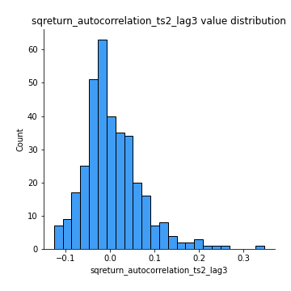
## Feature : sqreturn_correlation_ts1_lag_0
- **Feature type** : continous
- **Missing** : 0.0%
- **Unique** : 347
- **Count** :347.0
- **Mean** :0.6420379971188178
- **Std** :0.3519582861664902
- **Min** :-0.10256711281206837
- **25%th Percentile** : 0.32409496960217626
- **50%th Percentile** : 0.7082699009496575
- **75%th Percentile** : 0.9756859024483151
- **Max** :0.9825300478097198

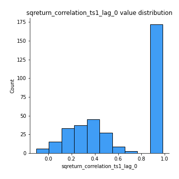
## Feature : sqreturn_correlation_ts1_lag_1
- **Feature type** : continous
- **Missing** : 0.0%
- **Unique** : 347
- **Count** :347.0
- **Mean** :-0.009131047305530951
- **Std** :0.06259244679696879
- **Min** :-0.15322812483224557
- **25%th Percentile** : -0.055254101860378324
- **50%th Percentile** : -0.003544207395722804
- **75%th Percentile** : 0.03211273148389144
- **Max** :0.20810360847194076

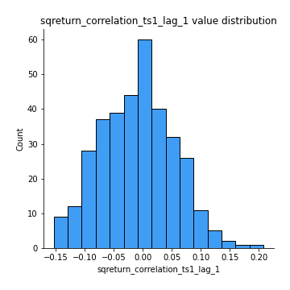
## Feature : sqreturn_correlation_ts1_lag_2
- **Feature type** : continous
- **Missing** : 0.0%
- **Unique** : 347
- **Count** :347.0
- **Mean** :-0.008842178962279252
- **Std** :0.06295041227262625
- **Min** :-0.172871336111873
- **25%th Percentile** : -0.05110582263198189
- **50%th Percentile** : -0.010603398998530154
- **75%th Percentile** : 0.03620312127011748
- **Max** :0.1835917471189421

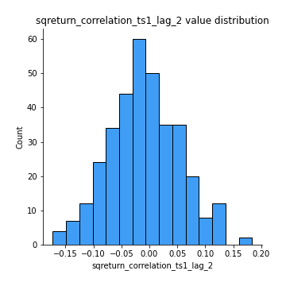
## Feature : sqreturn_correlation_ts1_lag_3
- **Feature type** : continous
- **Missing** : 0.0%
- **Unique** : 347
- **Count** :347.0
- **Mean** :0.0014334618157749483
- **Std** :0.06513885579877081
- **Min** :-0.21147540839842804
- **25%th Percentile** : -0.037978405712139646
- **50%th Percentile** : 0.0031653594275632617
- **75%th Percentile** : 0.043407380583394134
- **Max** :0.23808054096877584

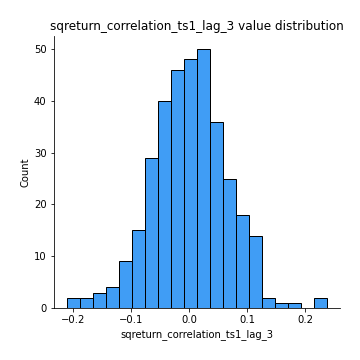
## Feature : sqreturn_correlation_ts2_lag_1
- **Feature type** : continous
- **Missing** : 0.0%
- **Unique** : 347
- **Count** :347.0
- **Mean** :-0.0028991204554049107
- **Std** :0.0713128865058776
- **Min** :-0.17665751184419612
- **25%th Percentile** : -0.05389796285697512
- **50%th Percentile** : -0.005115629176716094
- **75%th Percentile** : 0.04340446863876801
- **Max** :0.3425036902091001

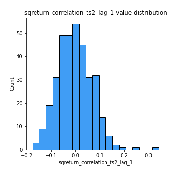
## Feature : sqreturn_correlation_ts2_lag_2
- **Feature type** : continous
- **Missing** : 0.0%
- **Unique** : 347
- **Count** :347.0
- **Mean** :-0.005442626054598949
- **Std** :0.0661287076596873
- **Min** :-0.2757460186107768
- **25%th Percentile** : -0.048502685687084844
- **50%th Percentile** : -0.0027836989457013656
- **75%th Percentile** : 0.04021844041976416
- **Max** :0.1668209648754713

## Feature : sqreturn_correlation_ts2_lag_3
- **Feature type** : continous
- **Missing** : 0.0%
- **Unique** : 347
- **Count** :347.0
- **Mean** :0.0058423549238743756
- **Std** :0.06200490422040943
- **Min** :-0.1782856542170424
- **25%th Percentile** : -0.03615472958089416
- **50%th Percentile** : 0.006432224469415529
- **75%th Percentile** : 0.04851156529156421
- **Max** :0.18227042221329348

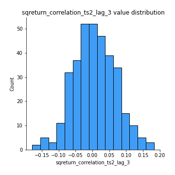
## Feature : price2_granger_cause_price1
- **Feature type** : continous
- **Missing** : 0.0%
- **Unique** : 347
- **Count** :347.0
- **Mean** :0.3173863304950722
- **Std** :0.29862892898619386
- **Min** :2.4312048970873696e-09
- **25%th Percentile** : 0.0396269868684112
- **50%th Percentile** : 0.21134176242884395
- **75%th Percentile** : 0.5332265781156588
- **Max** :0.9893258866780814

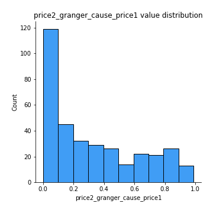
## Feature : price1_granger_cause_price2
- **Feature type** : continous
- **Missing** : 0.0%
- **Unique** : 347
- **Count** :347.0
- **Mean** :0.32457588019107353
- **Std** :0.30115108807546537
- **Min** :1.2012269232170316e-11
- **25%th Percentile** : 0.06502532435745481
- **50%th Percentile** : 0.23490932246451882
- **75%th Percentile** : 0.5406785014057587
- **Max** :0.9901596433344826

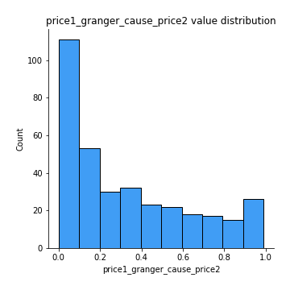

[<< Go back](../README.md)
