# Summary of 3_Linear

[<< Go back](../README.md)

## Logistic Regression (Linear)
- **n_jobs**: -1
- **explain_level**: 2

## Validation
 - **validation_type**: split
 - **train_ratio**: 0.75
 - **shuffle**: True
 - **stratify**: True

## Optimized metric
accuracy

## Training time

3.7 seconds

## Metric details
|           |    score |     threshold |
|:----------|---------:|--------------:|
| logloss   | 0.054696 | nan           |
| auc       | 0.99947  | nan           |
| f1        | 0.987952 |   0.490952    |
| accuracy  | 0.988506 |   0.490952    |
| precision | 1        |   0.984779    |
| recall    | 1        |   2.50824e-06 |
| mcc       | 0.977225 |   0.490952    |

## Confusion matrix (at threshold=0.490952)
|                      |   Predicted as real |   Predicted as simulated |
|:---------------------|--------------------:|-------------------------:|
| Labeled as real      |                  45 |                        1 |
| Labeled as simulated |                   0 |                       41 |

## Learning curves

## Coefficients
| feature                           |   Learner_1 |
|:----------------------------------|------------:|
| return_correlation_ts1_lag_0      |  2.42455    |
| sqreturn_correlation_ts1_lag_0    |  2.42455    |
| return_skew2                      |  0.440978   |
| return_skew1                      |  0.379543   |
| return_sd2                        |  0.299201   |
| return_autocorrelation_1_lag1     |  0.0608437  |
| return_autocorrelation_1_lag2     |  0.046749   |
| return_correlation_ts1_lag_2      |  0.0464921  |
| sqreturn_correlation_ts1_lag_2    |  0.0464921  |
| return_correlation_ts1_lag_1      |  0.0301348  |
| sqreturn_correlation_ts1_lag_1    |  0.0301348  |
| return_correlation_ts2_lag_2      |  0.0107962  |
| sqreturn_correlation_ts2_lag_2    |  0.0107962  |
| return_autocorrelation_2_lag2     |  0.00862218 |
| return_autocorrelation_2_lag1     | -0.0109136  |
| return_correlation_ts2_lag_1      | -0.0252034  |
| sqreturn_correlation_ts2_lag_1    | -0.0252034  |
| return_mean1                      | -0.0272135  |
| return_mean2                      | -0.027214   |
| price1_granger_cause_price2       | -0.0405146  |
| return_autocorrelation_2_lag3     | -0.0695794  |
| return_autocorrelation_1_lag3     | -0.076356   |
| sqreturn_correlation_ts1_lag_3    | -0.0857272  |
| return_correlation_ts1_lag_3      | -0.0857272  |
| price2_granger_cause_price1       | -0.0909703  |
| return_correlation_ts2_lag_3      | -0.0909839  |
| sqreturn_correlation_ts2_lag_3    | -0.0909839  |
| return_sd1                        | -0.0963149  |
| sqreturn_autocorrelation_ts2_lag3 | -0.106783   |
| sqreturn_autocorrelation_ts1_lag3 | -0.113568   |
| sqreturn_autocorrelation_ts1_lag2 | -0.117266   |
| sqreturn_autocorrelation_ts2_lag2 | -0.133319   |
| sqreturn_autocorrelation_ts2_lag1 | -0.17038    |
| sqreturn_autocorrelation_ts1_lag1 | -0.241218   |
| return_kurtosis2                  | -0.67671    |
| return_kurtosis1                  | -0.905831   |
| intercept                         | -1.50576    |

## Permutation-based Importance
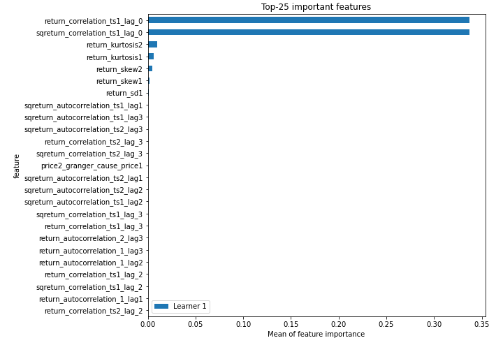
## Confusion Matrix

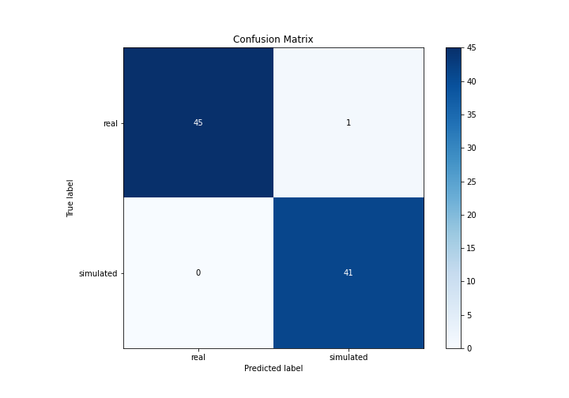

## Normalized Confusion Matrix

## ROC Curve

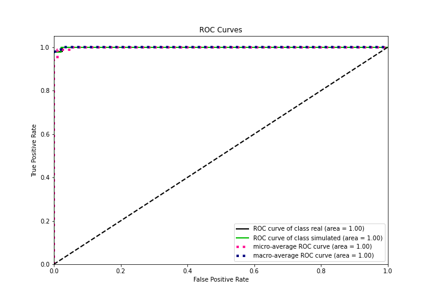

## Kolmogorov-Smirnov Statistic

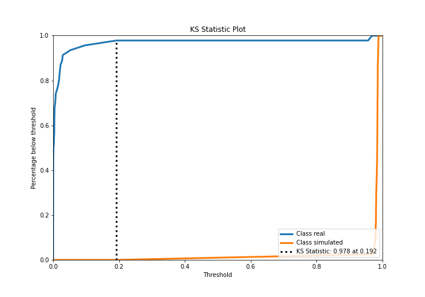

## Precision-Recall Curve

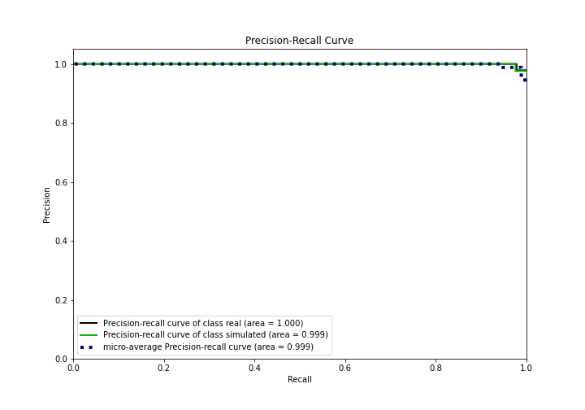

## Calibration Curve

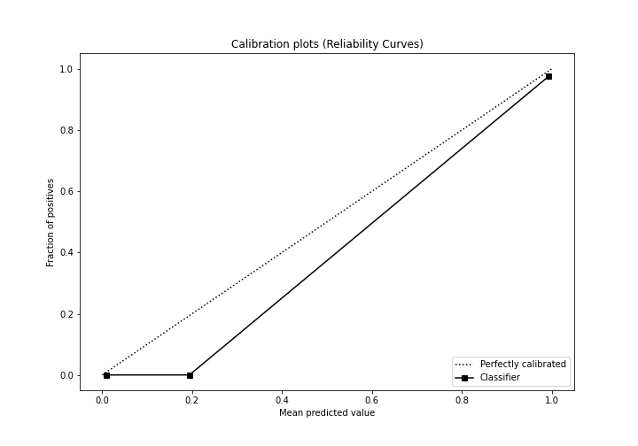

## Cumulative Gains Curve

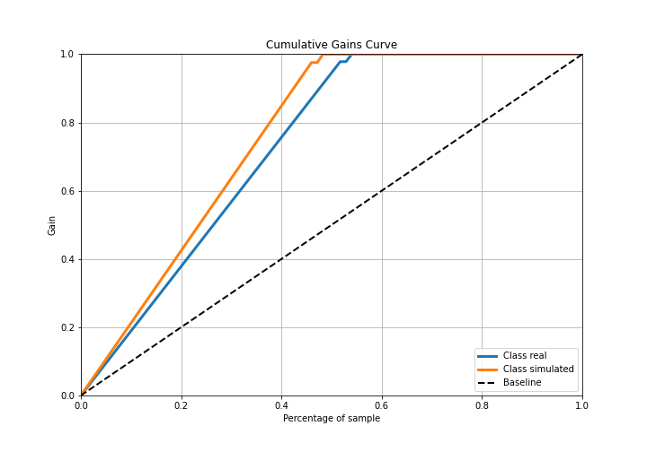

## Lift Curve

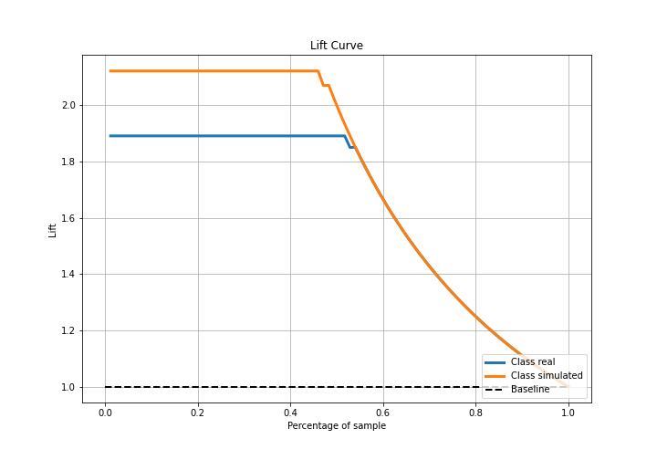

## SHAP Importance
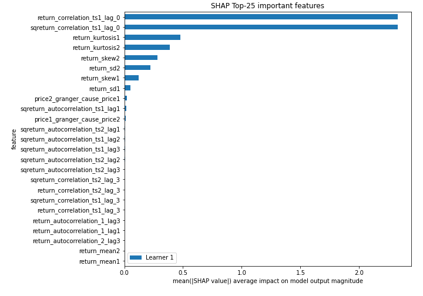

## SHAP Dependence plots

### Dependence (Fold 1)
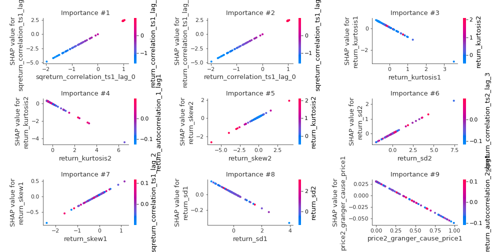

## SHAP Decision plots

### Top-10 Worst decisions for class 0 (Fold 1)
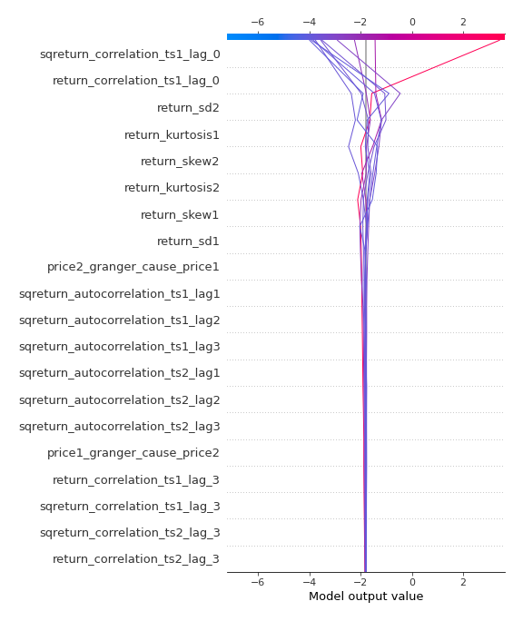
### Top-10 Best decisions for class 0 (Fold 1)

### Top-10 Worst decisions for class 1 (Fold 1)
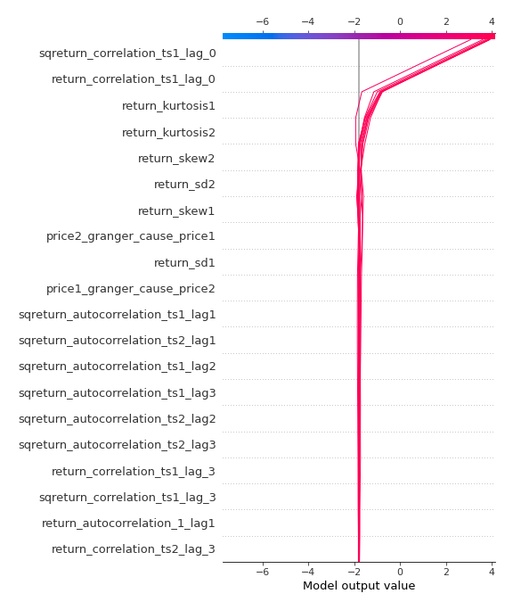
### Top-10 Best decisions for class 1 (Fold 1)
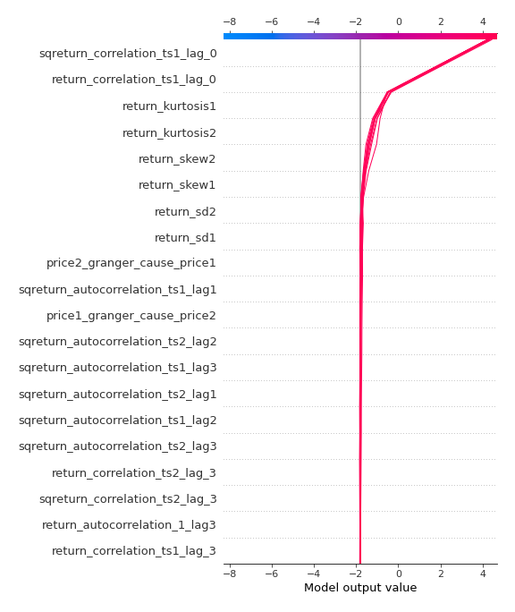

[<< Go back](../README.md)
