# Exploratory Data Analysis

[<< Go back](../README.md)
## Feature : target
- **Feature type** : categorical
- **Missing** : 0.0%
- **Unique** : 2
- **Count** :347
- **Unique** :2
- **Top** :real
- **Freq** :183

## Feature : return_mean1
- **Feature type** : continous
- **Missing** : 0.0%
- **Unique** : 347
- **Count** :347.0
- **Mean** :0.01938344054913336
- **Std** :0.11309865074736163
- **Min** :-0.297638839829253
- **25%th Percentile** : -0.06073175377034656
- **50%th Percentile** : 0.031819946357464345
- **75%th Percentile** : 0.10482354118323478
- **Max** :0.3602793017097547

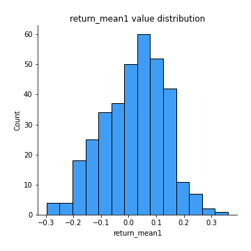
## Feature : return_mean2
- **Feature type** : continous
- **Missing** : 0.0%
- **Unique** : 347
- **Count** :347.0
- **Mean** :0.0002000402811245682
- **Std** :0.1215617034499344
- **Min** :-0.3393917268522109
- **25%th Percentile** : -0.07927572865403368
- **50%th Percentile** : 0.007157700456148593
- **75%th Percentile** : 0.09064023423245787
- **Max** :0.6801605239983173

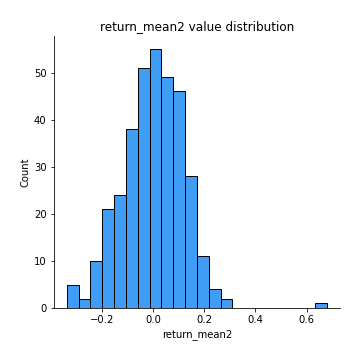
## Feature : return_sd1
- **Feature type** : continous
- **Missing** : 0.0%
- **Unique** : 347
- **Count** :347.0
- **Mean** :1.6200722824750102
- **Std** :0.36152755563156785
- **Min** :0.8733078831717243
- **25%th Percentile** : 1.4862867289651804
- **50%th Percentile** : 1.5801407235903646
- **75%th Percentile** : 1.683636559605164
- **Max** :3.332494027875222

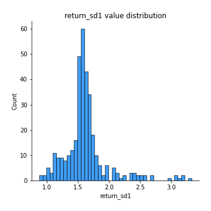
## Feature : return_sd2
- **Feature type** : continous
- **Missing** : 0.0%
- **Unique** : 347
- **Count** :347.0
- **Mean** :1.7089601871976103
- **Std** :0.42935591181186883
- **Min** :0.8198779632289204
- **25%th Percentile** : 1.5214540677212054
- **50%th Percentile** : 1.679866548916098
- **75%th Percentile** : 1.7830151351751058
- **Max** :4.59233049161685

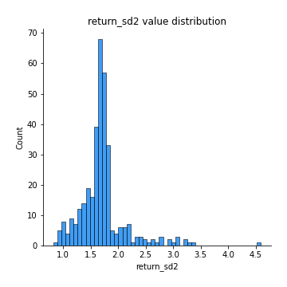
## Feature : return_skew1
- **Feature type** : continous
- **Missing** : 0.0%
- **Unique** : 347
- **Count** :347.0
- **Mean** :-0.11900917522024594
- **Std** :0.5755973549556297
- **Min** :-2.5068500114696386
- **25%th Percentile** : -0.3395470386365419
- **50%th Percentile** : -0.06467952281765509
- **75%th Percentile** : 0.10226743726734472
- **Max** :2.351757728252051

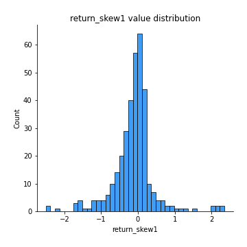
## Feature : return_skew2
- **Feature type** : continous
- **Missing** : 0.0%
- **Unique** : 347
- **Count** :347.0
- **Mean** :-0.2717730799788461
- **Std** :1.0305591984069202
- **Min** :-7.3762354994385335
- **25%th Percentile** : -0.4036589517364608
- **50%th Percentile** : -0.06757384882441098
- **75%th Percentile** : 0.09848764831571538
- **Max** :4.1920266082732045

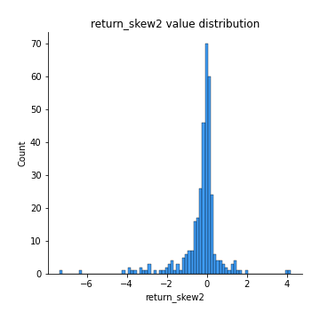
## Feature : return_kurtosis1
- **Feature type** : continous
- **Missing** : 0.0%
- **Unique** : 347
- **Count** :347.0
- **Mean** :2.3171860302177847
- **Std** :4.051404347717215
- **Min** :-0.7015387276601874
- **25%th Percentile** : 0.014656062504118772
- **50%th Percentile** : 0.9910776814597702
- **75%th Percentile** : 2.6594219944535236
- **Max** :23.612665658846073

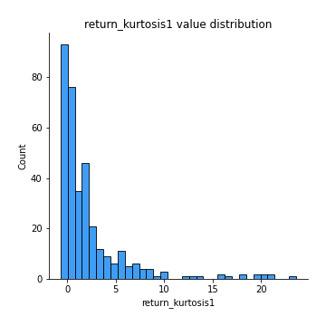
## Feature : return_kurtosis2
- **Feature type** : continous
- **Missing** : 0.0%
- **Unique** : 347
- **Count** :347.0
- **Mean** :4.2639763674230196
- **Std** :9.420302540535813
- **Min** :-0.5660801678689595
- **25%th Percentile** : 0.00012183075981830882
- **50%th Percentile** : 1.033360314034899
- **75%th Percentile** : 3.89717876258141
- **Max** :94.01659180149953

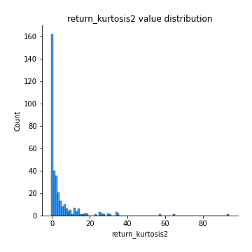
## Feature : return_autocorrelation_1_lag1
- **Feature type** : continous
- **Missing** : 0.0%
- **Unique** : 347
- **Count** :347.0
- **Mean** :-0.009539234512732787
- **Std** :0.06791622680695444
- **Min** :-0.2110198016529991
- **25%th Percentile** : -0.05637025575674107
- **50%th Percentile** : -0.013804048008243986
- **75%th Percentile** : 0.03391019409310067
- **Max** :0.20132571463207988

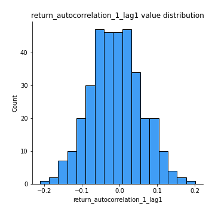
## Feature : return_autocorrelation_1_lag2
- **Feature type** : continous
- **Missing** : 0.0%
- **Unique** : 347
- **Count** :347.0
- **Mean** :-0.011337012231994348
- **Std** :0.06471143199770764
- **Min** :-0.245800151551597
- **25%th Percentile** : -0.056131005266667686
- **50%th Percentile** : -0.015758206141574613
- **75%th Percentile** : 0.035200140941545915
- **Max** :0.21123611097039302

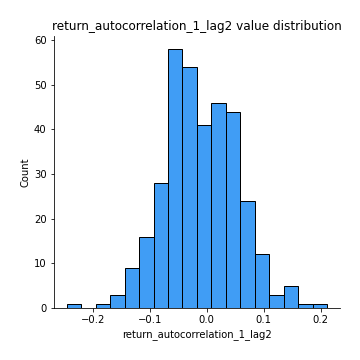
## Feature : return_autocorrelation_1_lag3
- **Feature type** : continous
- **Missing** : 0.0%
- **Unique** : 347
- **Count** :347.0
- **Mean** :0.0013428956755850909
- **Std** :0.062127042865988184
- **Min** :-0.1817944619132489
- **25%th Percentile** : -0.04517252442620754
- **50%th Percentile** : 0.008477228417898382
- **75%th Percentile** : 0.04428935874141112
- **Max** :0.17514033413395239

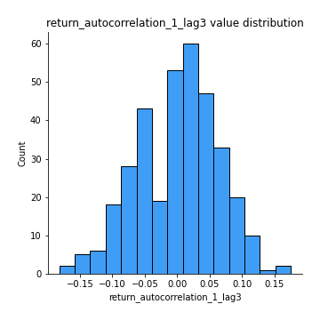
## Feature : return_autocorrelation_2_lag1
- **Feature type** : continous
- **Missing** : 0.0%
- **Unique** : 347
- **Count** :347.0
- **Mean** :-0.00021631692544132693
- **Std** :0.06801493564181889
- **Min** :-0.17778763204400128
- **25%th Percentile** : -0.04649673252821123
- **50%th Percentile** : -0.0011173276553667131
- **75%th Percentile** : 0.05024176166359978
- **Max** :0.15904859915650332

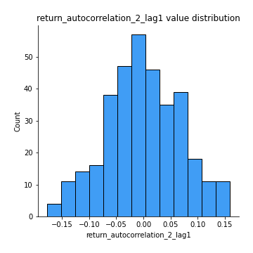
## Feature : return_autocorrelation_2_lag2
- **Feature type** : continous
- **Missing** : 0.0%
- **Unique** : 347
- **Count** :347.0
- **Mean** :-0.010274933441447219
- **Std** :0.06549362434136821
- **Min** :-0.23292461578318907
- **25%th Percentile** : -0.055269625176761636
- **50%th Percentile** : -0.011355527214736249
- **75%th Percentile** : 0.034222546632258745
- **Max** :0.1633768907277314

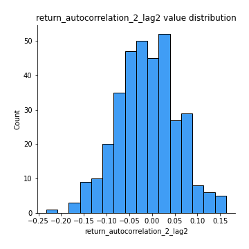
## Feature : return_autocorrelation_2_lag3
- **Feature type** : continous
- **Missing** : 0.0%
- **Unique** : 347
- **Count** :347.0
- **Mean** :0.0015452723598351355
- **Std** :0.06084816496767584
- **Min** :-0.1794902936808312
- **25%th Percentile** : -0.04101317971845711
- **50%th Percentile** : 0.007538082879271798
- **75%th Percentile** : 0.040057093837606625
- **Max** :0.20205753622966244

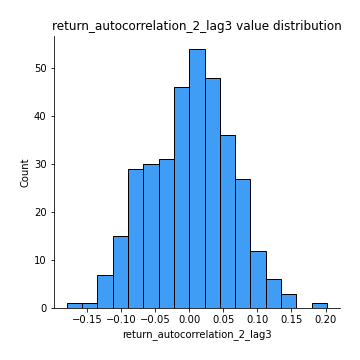
## Feature : return_correlation_ts1_lag_0
- **Feature type** : continous
- **Missing** : 0.0%
- **Unique** : 347
- **Count** :347.0
- **Mean** :0.6351266642126786
- **Std** :0.3463691337482431
- **Min** :-0.10256711281206837
- **25%th Percentile** : 0.3381206377935342
- **50%th Percentile** : 0.5977353242009235
- **75%th Percentile** : 0.975172251251976
- **Max** :0.9937227277077512

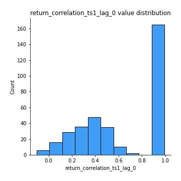
## Feature : return_correlation_ts1_lag_1
- **Feature type** : continous
- **Missing** : 0.0%
- **Unique** : 347
- **Count** :347.0
- **Mean** :-0.0029601149659831214
- **Std** :0.06353811233918025
- **Min** :-0.18305234470192638
- **25%th Percentile** : -0.049672154859544376
- **50%th Percentile** : -0.0003632625523718754
- **75%th Percentile** : 0.0401234922796848
- **Max** :0.159100778661096

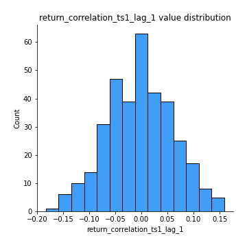
## Feature : return_correlation_ts1_lag_2
- **Feature type** : continous
- **Missing** : 0.0%
- **Unique** : 347
- **Count** :347.0
- **Mean** :-0.007200738096990932
- **Std** :0.06536816241819411
- **Min** :-0.2439125751758219
- **25%th Percentile** : -0.054716146651548433
- **50%th Percentile** : -0.01341860716481826
- **75%th Percentile** : 0.038926902361620566
- **Max** :0.17974071501626168

## Feature : return_correlation_ts1_lag_3
- **Feature type** : continous
- **Missing** : 0.0%
- **Unique** : 347
- **Count** :347.0
- **Mean** :-0.0013448137487194623
- **Std** :0.06647225516323238
- **Min** :-0.21147540839842804
- **25%th Percentile** : -0.04490682775992459
- **50%th Percentile** : 0.0009160344488448112
- **75%th Percentile** : 0.045695645532232515
- **Max** :0.23808054096877584

## Feature : return_correlation_ts2_lag_1
- **Feature type** : continous
- **Missing** : 0.0%
- **Unique** : 347
- **Count** :347.0
- **Mean** :0.0035620277597676136
- **Std** :0.06767164652233913
- **Min** :-0.17665751184419612
- **25%th Percentile** : -0.042732999537007675
- **50%th Percentile** : 0.0017413519827478422
- **75%th Percentile** : 0.04887440202257293
- **Max** :0.16808494625678747

## Feature : return_correlation_ts2_lag_2
- **Feature type** : continous
- **Missing** : 0.0%
- **Unique** : 347
- **Count** :347.0
- **Mean** :-0.009364081917904553
- **Std** :0.06492517775876672
- **Min** :-0.2757460186107768
- **25%th Percentile** : -0.04880778648139876
- **50%th Percentile** : -0.009935851525987513
- **75%th Percentile** : 0.030084148289639807
- **Max** :0.1668209648754713

## Feature : return_correlation_ts2_lag_3
- **Feature type** : continous
- **Missing** : 0.0%
- **Unique** : 347
- **Count** :347.0
- **Mean** :0.003927830447420013
- **Std** :0.06364486672654095
- **Min** :-0.17697863431182184
- **25%th Percentile** : -0.03977202469647946
- **50%th Percentile** : 0.007431753122021522
- **75%th Percentile** : 0.04738067791111353
- **Max** :0.18227042221329348

## Feature : sqreturn_autocorrelation_ts1_lag1
- **Feature type** : continous
- **Missing** : 0.0%
- **Unique** : 347
- **Count** :347.0
- **Mean** :0.0348837180465298
- **Std** :0.083604858558546
- **Min** :-0.12568541834924066
- **25%th Percentile** : -0.020605398737922217
- **50%th Percentile** : 0.015295358787679177
- **75%th Percentile** : 0.07963743707413598
- **Max** :0.4170324090514868

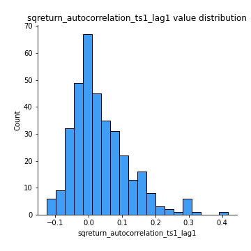
## Feature : sqreturn_autocorrelation_ts1_lag2
- **Feature type** : continous
- **Missing** : 0.0%
- **Unique** : 347
- **Count** :347.0
- **Mean** :0.020322587985153448
- **Std** :0.07151806303080366
- **Min** :-0.1380804105584104
- **25%th Percentile** : -0.029716949572492237
- **50%th Percentile** : 0.015465238670980831
- **75%th Percentile** : 0.058421954096957676
- **Max** :0.32836952056190194

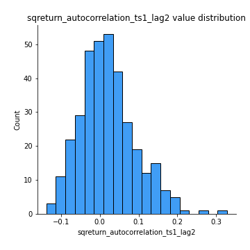
## Feature : sqreturn_autocorrelation_ts1_lag3
- **Feature type** : continous
- **Missing** : 0.0%
- **Unique** : 347
- **Count** :347.0
- **Mean** :0.010657043621052461
- **Std** :0.06345168428231222
- **Min** :-0.1343480186237971
- **25%th Percentile** : -0.03184688791765601
- **50%th Percentile** : 0.004048714494444186
- **75%th Percentile** : 0.045092876168993
- **Max** :0.23856108238097126

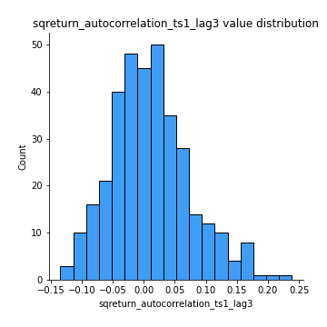
## Feature : sqreturn_autocorrelation_ts2_lag1
- **Feature type** : continous
- **Missing** : 0.0%
- **Unique** : 347
- **Count** :347.0
- **Mean** :0.02500179311333488
- **Std** :0.06792358148753788
- **Min** :-0.12398008857836523
- **25%th Percentile** : -0.020037420006965227
- **50%th Percentile** : 0.014663703394128586
- **75%th Percentile** : 0.05867150383129083
- **Max** :0.3459234668044924

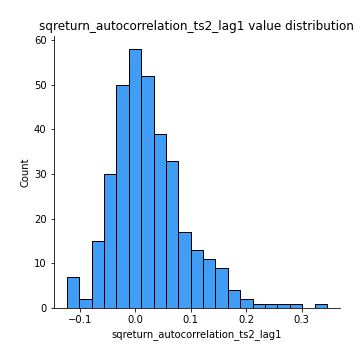
## Feature : sqreturn_autocorrelation_ts2_lag2
- **Feature type** : continous
- **Missing** : 0.0%
- **Unique** : 347
- **Count** :347.0
- **Mean** :0.01215248794879156
- **Std** :0.0629357393923549
- **Min** :-0.14810382348407486
- **25%th Percentile** : -0.02253819241830116
- **50%th Percentile** : 0.005438512894971881
- **75%th Percentile** : 0.04753853640090535
- **Max** :0.25057436061622956

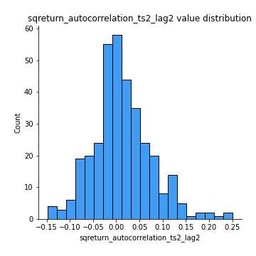
## Feature : sqreturn_autocorrelation_ts2_lag3
- **Feature type** : continous
- **Missing** : 0.0%
- **Unique** : 347
- **Count** :347.0
- **Mean** :0.0032742417368073398
- **Std** :0.06306476259753607
- **Min** :-0.14165017967080498
- **25%th Percentile** : -0.032908537950697744
- **50%th Percentile** : -0.007133499729945041
- **75%th Percentile** : 0.03497813130547723
- **Max** :0.3463122340368414

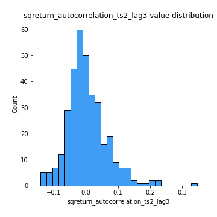
## Feature : sqreturn_correlation_ts1_lag_0
- **Feature type** : continous
- **Missing** : 0.0%
- **Unique** : 347
- **Count** :347.0
- **Mean** :0.6351266642126786
- **Std** :0.3463691337482431
- **Min** :-0.10256711281206837
- **25%th Percentile** : 0.3381206377935342
- **50%th Percentile** : 0.5977353242009235
- **75%th Percentile** : 0.975172251251976
- **Max** :0.9937227277077512

## Feature : sqreturn_correlation_ts1_lag_1
- **Feature type** : continous
- **Missing** : 0.0%
- **Unique** : 347
- **Count** :347.0
- **Mean** :-0.0029601149659831214
- **Std** :0.06353811233918025
- **Min** :-0.18305234470192638
- **25%th Percentile** : -0.049672154859544376
- **50%th Percentile** : -0.0003632625523718754
- **75%th Percentile** : 0.0401234922796848
- **Max** :0.159100778661096

## Feature : sqreturn_correlation_ts1_lag_2
- **Feature type** : continous
- **Missing** : 0.0%
- **Unique** : 347
- **Count** :347.0
- **Mean** :-0.007200738096990932
- **Std** :0.06536816241819411
- **Min** :-0.2439125751758219
- **25%th Percentile** : -0.054716146651548433
- **50%th Percentile** : -0.01341860716481826
- **75%th Percentile** : 0.038926902361620566
- **Max** :0.17974071501626168

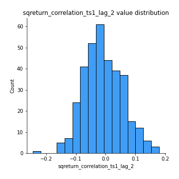
## Feature : sqreturn_correlation_ts1_lag_3
- **Feature type** : continous
- **Missing** : 0.0%
- **Unique** : 347
- **Count** :347.0
- **Mean** :-0.0013448137487194623
- **Std** :0.06647225516323238
- **Min** :-0.21147540839842804
- **25%th Percentile** : -0.04490682775992459
- **50%th Percentile** : 0.0009160344488448112
- **75%th Percentile** : 0.045695645532232515
- **Max** :0.23808054096877584

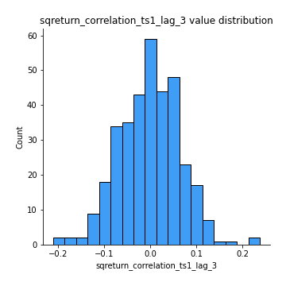
## Feature : sqreturn_correlation_ts2_lag_1
- **Feature type** : continous
- **Missing** : 0.0%
- **Unique** : 347
- **Count** :347.0
- **Mean** :0.0035620277597676136
- **Std** :0.06767164652233913
- **Min** :-0.17665751184419612
- **25%th Percentile** : -0.042732999537007675
- **50%th Percentile** : 0.0017413519827478422
- **75%th Percentile** : 0.04887440202257293
- **Max** :0.16808494625678747

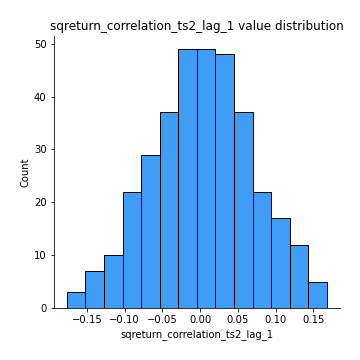
## Feature : sqreturn_correlation_ts2_lag_2
- **Feature type** : continous
- **Missing** : 0.0%
- **Unique** : 347
- **Count** :347.0
- **Mean** :-0.009364081917904553
- **Std** :0.06492517775876672
- **Min** :-0.2757460186107768
- **25%th Percentile** : -0.04880778648139876
- **50%th Percentile** : -0.009935851525987513
- **75%th Percentile** : 0.030084148289639807
- **Max** :0.1668209648754713

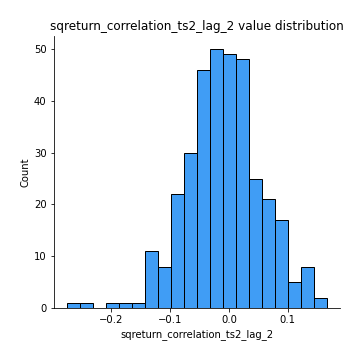
## Feature : sqreturn_correlation_ts2_lag_3
- **Feature type** : continous
- **Missing** : 0.0%
- **Unique** : 347
- **Count** :347.0
- **Mean** :0.003927830447420013
- **Std** :0.06364486672654095
- **Min** :-0.17697863431182184
- **25%th Percentile** : -0.03977202469647946
- **50%th Percentile** : 0.007431753122021522
- **75%th Percentile** : 0.04738067791111353
- **Max** :0.18227042221329348

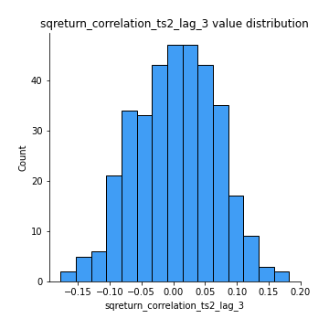
## Feature : price2_granger_cause_price1
- **Feature type** : continous
- **Missing** : 0.0%
- **Unique** : 347
- **Count** :347.0
- **Mean** :0.3148443981335871
- **Std** :0.30063046720405223
- **Min** :8.717393067527265e-05
- **25%th Percentile** : 0.04291743103929638
- **50%th Percentile** : 0.20870120568558026
- **75%th Percentile** : 0.5405790731388009
- **Max** :0.9911730635659054

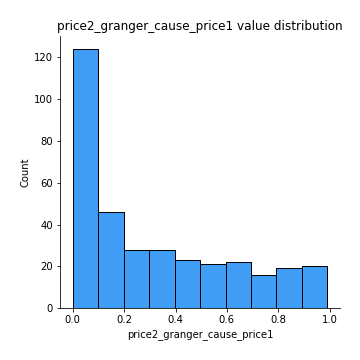
## Feature : price1_granger_cause_price2
- **Feature type** : continous
- **Missing** : 0.0%
- **Unique** : 347
- **Count** :347.0
- **Mean** :0.30660953015670306
- **Std** :0.2884192484026616
- **Min** :1.7840342825864538e-05
- **25%th Percentile** : 0.05141991752715286
- **50%th Percentile** : 0.23434269343511338
- **75%th Percentile** : 0.5117004985201024
- **Max** :0.9933210158406889

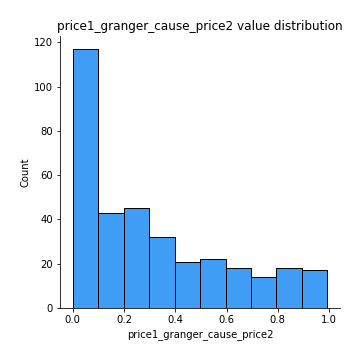

[<< Go back](../README.md)
