# Exploratory Data Analysis

[<< Go back](../README.md)
## Feature : target
- **Feature type** : categorical
- **Missing** : 0.0%
- **Unique** : 2
- **Count** :347
- **Unique** :2
- **Top** :simulated
- **Freq** :176

## Feature : return_mean1
- **Feature type** : continous
- **Missing** : 0.0%
- **Unique** : 347
- **Count** :347.0
- **Mean** :0.018807175311973665
- **Std** :0.11050559372571017
- **Min** :-0.29086902018717176
- **25%th Percentile** : -0.06449026234517348
- **50%th Percentile** : 0.02721926193882289
- **75%th Percentile** : 0.10019830175025905
- **Max** :0.28879014362424366

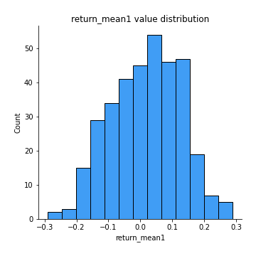
## Feature : return_mean2
- **Feature type** : continous
- **Missing** : 0.0%
- **Unique** : 347
- **Count** :347.0
- **Mean** :0.005817019978607869
- **Std** :0.12324062657907282
- **Min** :-0.3439835398279146
- **25%th Percentile** : -0.07892368198480948
- **50%th Percentile** : 0.00821836488310345
- **75%th Percentile** : 0.09302321629728719
- **Max** :0.6801605239983173

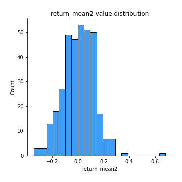
## Feature : return_sd1
- **Feature type** : continous
- **Missing** : 0.0%
- **Unique** : 347
- **Count** :347.0
- **Mean** :1.623810514569712
- **Std** :0.3503244720026875
- **Min** :0.8102430347636637
- **25%th Percentile** : 1.5063689768502195
- **50%th Percentile** : 1.5949462521536273
- **75%th Percentile** : 1.6729907888363367
- **Max** :3.181425034216533

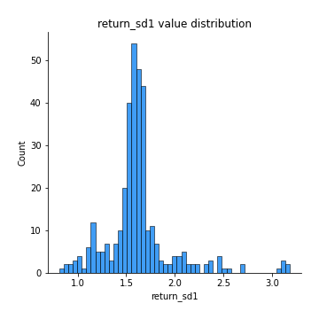
## Feature : return_sd2
- **Feature type** : continous
- **Missing** : 0.0%
- **Unique** : 347
- **Count** :347.0
- **Mean** :1.6948612895278454
- **Std** :0.3805622909908058
- **Min** :0.8198779632289204
- **25%th Percentile** : 1.5492369414283864
- **50%th Percentile** : 1.6960574061214762
- **75%th Percentile** : 1.7688482729364607
- **Max** :4.59233049161685

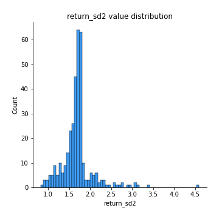
## Feature : return_skew1
- **Feature type** : continous
- **Missing** : 0.0%
- **Unique** : 347
- **Count** :347.0
- **Mean** :-0.19563365981948044
- **Std** :0.7006608753035378
- **Min** :-4.239645236578449
- **25%th Percentile** : -0.35109307106319926
- **50%th Percentile** : -0.07855965142103004
- **75%th Percentile** : 0.07861125820386716
- **Max** :2.351757728252051

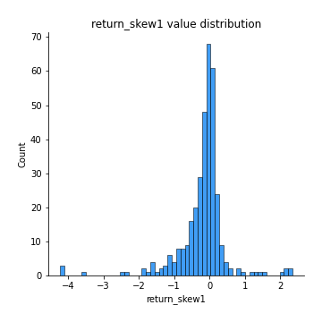
## Feature : return_skew2
- **Feature type** : continous
- **Missing** : 0.0%
- **Unique** : 347
- **Count** :347.0
- **Mean** :-0.2375270531977088
- **Std** :0.9774131710275283
- **Min** :-6.262899561987459
- **25%th Percentile** : -0.3020252990355238
- **50%th Percentile** : -0.06757384882441098
- **75%th Percentile** : 0.0866397330467182
- **Max** :4.1920266082732045

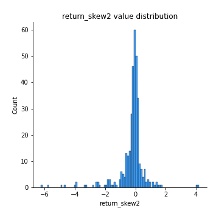
## Feature : return_kurtosis1
- **Feature type** : continous
- **Missing** : 0.0%
- **Unique** : 347
- **Count** :347.0
- **Mean** :2.615391611750099
- **Std** :5.434516806312363
- **Min** :-0.5128838398340569
- **25%th Percentile** : -0.006181154855007254
- **50%th Percentile** : 0.6777846372659289
- **75%th Percentile** : 2.6990337880253565
- **Max** :40.485294874464934

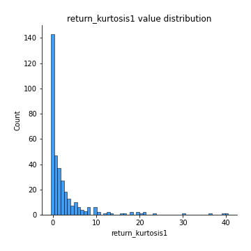
## Feature : return_kurtosis2
- **Feature type** : continous
- **Missing** : 0.0%
- **Unique** : 347
- **Count** :347.0
- **Mean** :3.768835081298226
- **Std** :8.284036615319812
- **Min** :-0.5862412087841258
- **25%th Percentile** : -0.017235646907142854
- **50%th Percentile** : 0.5976057081732753
- **75%th Percentile** : 3.3451525378866567
- **Max** :64.99818629655663

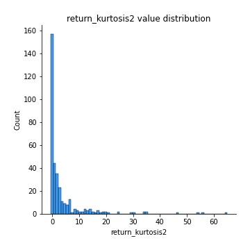
## Feature : return_autocorrelation_1_lag1
- **Feature type** : continous
- **Missing** : 0.0%
- **Unique** : 347
- **Count** :347.0
- **Mean** :-0.009814901504638233
- **Std** :0.06785646313688315
- **Min** :-0.2110198016529991
- **25%th Percentile** : -0.05826324877699555
- **50%th Percentile** : -0.011913246224172997
- **75%th Percentile** : 0.03967087288412465
- **Max** :0.20132571463207988

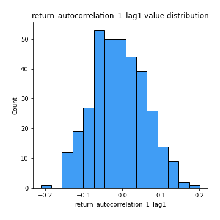
## Feature : return_autocorrelation_1_lag2
- **Feature type** : continous
- **Missing** : 0.0%
- **Unique** : 347
- **Count** :347.0
- **Mean** :-0.012805397688154212
- **Std** :0.06886533919743448
- **Min** :-0.1817755782836674
- **25%th Percentile** : -0.06127638142738069
- **50%th Percentile** : -0.013386213277767407
- **75%th Percentile** : 0.03259914412935175
- **Max** :0.21123611097039302

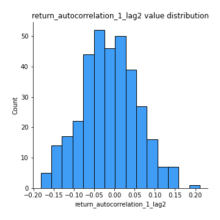
## Feature : return_autocorrelation_1_lag3
- **Feature type** : continous
- **Missing** : 0.0%
- **Unique** : 347
- **Count** :347.0
- **Mean** :0.003912394446328869
- **Std** :0.06245628755211303
- **Min** :-0.1654833157463618
- **25%th Percentile** : -0.03666575418468531
- **50%th Percentile** : 0.003631721717432191
- **75%th Percentile** : 0.04438244615111195
- **Max** :0.21121065182478835

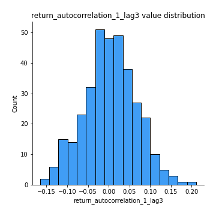
## Feature : return_autocorrelation_2_lag1
- **Feature type** : continous
- **Missing** : 0.0%
- **Unique** : 347
- **Count** :347.0
- **Mean** :-0.006507286847368564
- **Std** :0.07018390324926767
- **Min** :-0.2364404317158175
- **25%th Percentile** : -0.05780538650828578
- **50%th Percentile** : -0.0013326114725824892
- **75%th Percentile** : 0.04089259915282624
- **Max** :0.2024676054184499

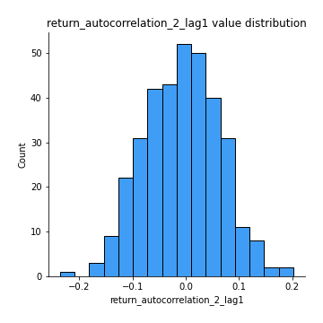
## Feature : return_autocorrelation_2_lag2
- **Feature type** : continous
- **Missing** : 0.0%
- **Unique** : 347
- **Count** :347.0
- **Mean** :-0.012696339655730218
- **Std** :0.06813777656059954
- **Min** :-0.188729688734876
- **25%th Percentile** : -0.05430653015549142
- **50%th Percentile** : -0.012481596693324626
- **75%th Percentile** : 0.03363531891008938
- **Max** :0.1662702538475827

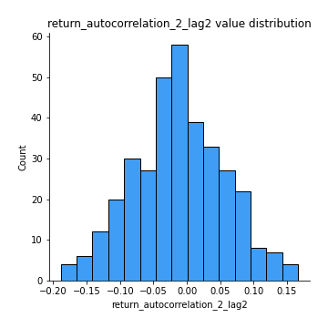
## Feature : return_autocorrelation_2_lag3
- **Feature type** : continous
- **Missing** : 0.0%
- **Unique** : 347
- **Count** :347.0
- **Mean** :0.002858392203550975
- **Std** :0.062342906538809875
- **Min** :-0.1794902936808312
- **25%th Percentile** : -0.03513558569735714
- **50%th Percentile** : 0.003971785132774557
- **75%th Percentile** : 0.037800713156372026
- **Max** :0.21539837795525707

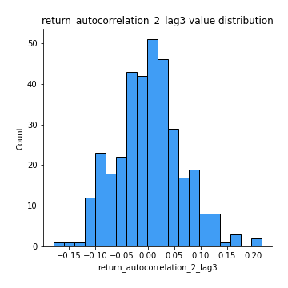
## Feature : return_correlation_ts1_lag_0
- **Feature type** : continous
- **Missing** : 0.0%
- **Unique** : 347
- **Count** :347.0
- **Mean** :0.652082799134736
- **Std** :0.352282534760316
- **Min** :-0.07366870340906873
- **25%th Percentile** : 0.3380361619663287
- **50%th Percentile** : 0.9676070074185337
- **75%th Percentile** : 0.9754933684752707
- **Max** :0.9937227277077512

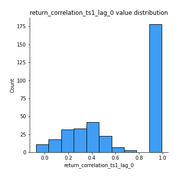
## Feature : return_correlation_ts1_lag_1
- **Feature type** : continous
- **Missing** : 0.0%
- **Unique** : 347
- **Count** :347.0
- **Mean** :-0.005699872861716172
- **Std** :0.06539095170822068
- **Min** :-0.18856827637524448
- **25%th Percentile** : -0.05431400561189152
- **50%th Percentile** : -0.001851237660659176
- **75%th Percentile** : 0.04132227315954545
- **Max** :0.159100778661096

## Feature : return_correlation_ts1_lag_2
- **Feature type** : continous
- **Missing** : 0.0%
- **Unique** : 347
- **Count** :347.0
- **Mean** :-0.008050359057062625
- **Std** :0.0666705107280449
- **Min** :-0.18669264196203625
- **25%th Percentile** : -0.050790049771790406
- **50%th Percentile** : -0.009935983731115584
- **75%th Percentile** : 0.03801812803787922
- **Max** :0.17974071501626168

## Feature : return_correlation_ts1_lag_3
- **Feature type** : continous
- **Missing** : 0.0%
- **Unique** : 347
- **Count** :347.0
- **Mean** :0.00018723721078882607
- **Std** :0.06849369098441677
- **Min** :-0.18059033867783728
- **25%th Percentile** : -0.04067186088060506
- **50%th Percentile** : -0.003934343391606413
- **75%th Percentile** : 0.042595753263481057
- **Max** :0.23808054096877584

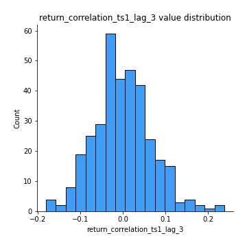
## Feature : return_correlation_ts2_lag_1
- **Feature type** : continous
- **Missing** : 0.0%
- **Unique** : 347
- **Count** :347.0
- **Mean** :0.0016476013828809661
- **Std** :0.06840702725038086
- **Min** :-0.17665751184419612
- **25%th Percentile** : -0.048069683887197165
- **50%th Percentile** : 0.0035720525893754083
- **75%th Percentile** : 0.043627265404894665
- **Max** :0.3425036902091001

## Feature : return_correlation_ts2_lag_2
- **Feature type** : continous
- **Missing** : 0.0%
- **Unique** : 347
- **Count** :347.0
- **Mean** :-0.011633105521745112
- **Std** :0.06783179374134381
- **Min** :-0.18793480063267962
- **25%th Percentile** : -0.0574683700074127
- **50%th Percentile** : -0.011076403497011167
- **75%th Percentile** : 0.033331025555352334
- **Max** :0.1668209648754713

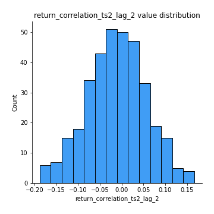
## Feature : return_correlation_ts2_lag_3
- **Feature type** : continous
- **Missing** : 0.0%
- **Unique** : 347
- **Count** :347.0
- **Mean** :0.005625162048394605
- **Std** :0.06383919075468339
- **Min** :-0.1440162374561895
- **25%th Percentile** : -0.03400768906748128
- **50%th Percentile** : 0.003926316165225525
- **75%th Percentile** : 0.05007826928853305
- **Max** :0.21444227559164541

## Feature : sqreturn_autocorrelation_ts1_lag1
- **Feature type** : continous
- **Missing** : 0.0%
- **Unique** : 347
- **Count** :347.0
- **Mean** :0.03010565073231232
- **Std** :0.08347988066921022
- **Min** :-0.14569208718191878
- **25%th Percentile** : -0.02363782953423089
- **50%th Percentile** : 0.018300288756824885
- **75%th Percentile** : 0.07439019676307981
- **Max** :0.4170324090514868

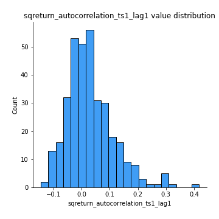
## Feature : sqreturn_autocorrelation_ts1_lag2
- **Feature type** : continous
- **Missing** : 0.0%
- **Unique** : 347
- **Count** :347.0
- **Mean** :0.018478055172194432
- **Std** :0.06770542485732362
- **Min** :-0.14948650208413183
- **25%th Percentile** : -0.025284340995346814
- **50%th Percentile** : 0.012175282451121292
- **75%th Percentile** : 0.05199479407906432
- **Max** :0.29415594530501293

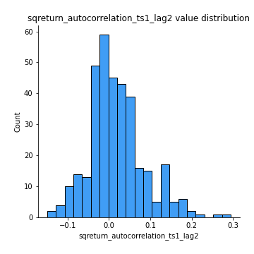
## Feature : sqreturn_autocorrelation_ts1_lag3
- **Feature type** : continous
- **Missing** : 0.0%
- **Unique** : 347
- **Count** :347.0
- **Mean** :0.008784880195680264
- **Std** :0.0625790822745212
- **Min** :-0.14750818502453036
- **25%th Percentile** : -0.030293833176337256
- **50%th Percentile** : 0.0010523710382402897
- **75%th Percentile** : 0.04366269598246602
- **Max** :0.21827746502232412

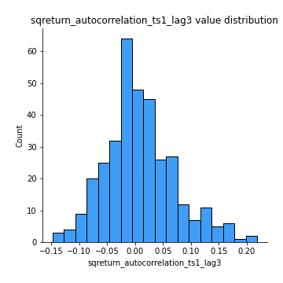
## Feature : sqreturn_autocorrelation_ts2_lag1
- **Feature type** : continous
- **Missing** : 0.0%
- **Unique** : 347
- **Count** :347.0
- **Mean** :0.02597473543183771
- **Std** :0.07861577056335323
- **Min** :-0.1321092830382032
- **25%th Percentile** : -0.0239991976254361
- **50%th Percentile** : 0.015488459753505305
- **75%th Percentile** : 0.05994950166696797
- **Max** :0.36991568023038357

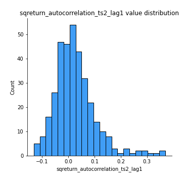
## Feature : sqreturn_autocorrelation_ts2_lag2
- **Feature type** : continous
- **Missing** : 0.0%
- **Unique** : 347
- **Count** :347.0
- **Mean** :0.010106946092791771
- **Std** :0.058917663315797085
- **Min** :-0.13249515295412798
- **25%th Percentile** : -0.0225539269255872
- **50%th Percentile** : 0.0025979176156972726
- **75%th Percentile** : 0.03837898113518941
- **Max** :0.28672056150180414

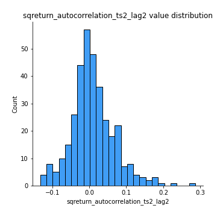
## Feature : sqreturn_autocorrelation_ts2_lag3
- **Feature type** : continous
- **Missing** : 0.0%
- **Unique** : 347
- **Count** :347.0
- **Mean** :0.00645981788423156
- **Std** :0.06714373999435945
- **Min** :-0.12702012914189503
- **25%th Percentile** : -0.033639868770453045
- **50%th Percentile** : -0.0031041915992300576
- **75%th Percentile** : 0.03563462397019833
- **Max** :0.3463122340368414

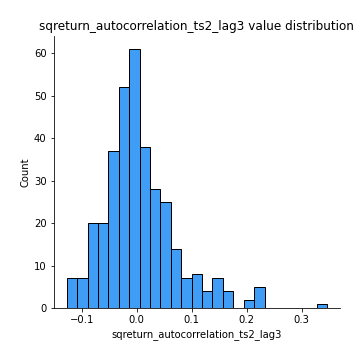
## Feature : sqreturn_correlation_ts1_lag_0
- **Feature type** : continous
- **Missing** : 0.0%
- **Unique** : 347
- **Count** :347.0
- **Mean** :0.652082799134736
- **Std** :0.352282534760316
- **Min** :-0.07366870340906873
- **25%th Percentile** : 0.3380361619663287
- **50%th Percentile** : 0.9676070074185337
- **75%th Percentile** : 0.9754933684752707
- **Max** :0.9937227277077512

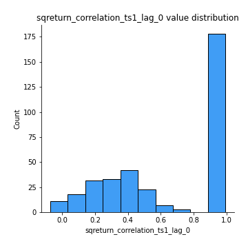
## Feature : sqreturn_correlation_ts1_lag_1
- **Feature type** : continous
- **Missing** : 0.0%
- **Unique** : 347
- **Count** :347.0
- **Mean** :-0.005699872861716172
- **Std** :0.06539095170822068
- **Min** :-0.18856827637524448
- **25%th Percentile** : -0.05431400561189152
- **50%th Percentile** : -0.001851237660659176
- **75%th Percentile** : 0.04132227315954545
- **Max** :0.159100778661096

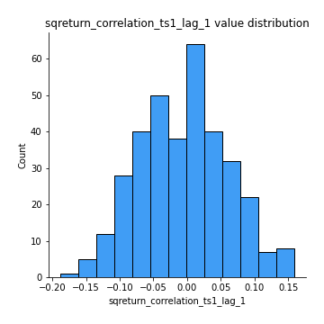
## Feature : sqreturn_correlation_ts1_lag_2
- **Feature type** : continous
- **Missing** : 0.0%
- **Unique** : 347
- **Count** :347.0
- **Mean** :-0.008050359057062625
- **Std** :0.0666705107280449
- **Min** :-0.18669264196203625
- **25%th Percentile** : -0.050790049771790406
- **50%th Percentile** : -0.009935983731115584
- **75%th Percentile** : 0.03801812803787922
- **Max** :0.17974071501626168

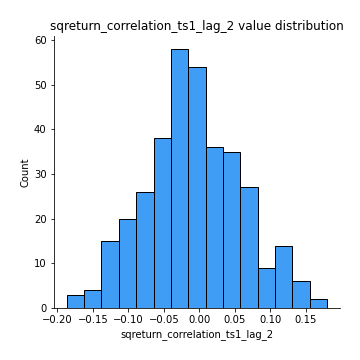
## Feature : sqreturn_correlation_ts1_lag_3
- **Feature type** : continous
- **Missing** : 0.0%
- **Unique** : 347
- **Count** :347.0
- **Mean** :0.00018723721078882607
- **Std** :0.06849369098441677
- **Min** :-0.18059033867783728
- **25%th Percentile** : -0.04067186088060506
- **50%th Percentile** : -0.003934343391606413
- **75%th Percentile** : 0.042595753263481057
- **Max** :0.23808054096877584

## Feature : sqreturn_correlation_ts2_lag_1
- **Feature type** : continous
- **Missing** : 0.0%
- **Unique** : 347
- **Count** :347.0
- **Mean** :0.0016476013828809661
- **Std** :0.06840702725038086
- **Min** :-0.17665751184419612
- **25%th Percentile** : -0.048069683887197165
- **50%th Percentile** : 0.0035720525893754083
- **75%th Percentile** : 0.043627265404894665
- **Max** :0.3425036902091001

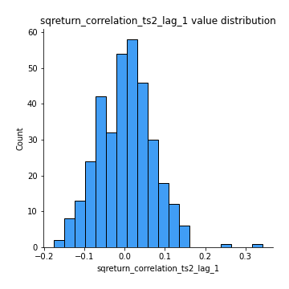
## Feature : sqreturn_correlation_ts2_lag_2
- **Feature type** : continous
- **Missing** : 0.0%
- **Unique** : 347
- **Count** :347.0
- **Mean** :-0.011633105521745112
- **Std** :0.06783179374134381
- **Min** :-0.18793480063267962
- **25%th Percentile** : -0.0574683700074127
- **50%th Percentile** : -0.011076403497011167
- **75%th Percentile** : 0.033331025555352334
- **Max** :0.1668209648754713

## Feature : sqreturn_correlation_ts2_lag_3
- **Feature type** : continous
- **Missing** : 0.0%
- **Unique** : 347
- **Count** :347.0
- **Mean** :0.005625162048394605
- **Std** :0.06383919075468339
- **Min** :-0.1440162374561895
- **25%th Percentile** : -0.03400768906748128
- **50%th Percentile** : 0.003926316165225525
- **75%th Percentile** : 0.05007826928853305
- **Max** :0.21444227559164541

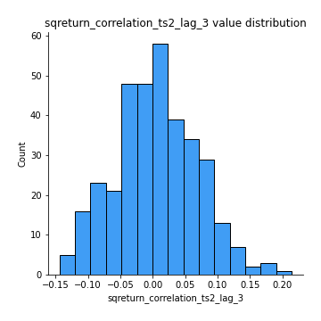
## Feature : price2_granger_cause_price1
- **Feature type** : continous
- **Missing** : 0.0%
- **Unique** : 347
- **Count** :347.0
- **Mean** :0.33146231205468646
- **Std** :0.3061084762835356
- **Min** :2.4312048970873696e-09
- **25%th Percentile** : 0.05057097367938579
- **50%th Percentile** : 0.22387582230989997
- **75%th Percentile** : 0.5623003648221143
- **Max** :0.9995844184199933

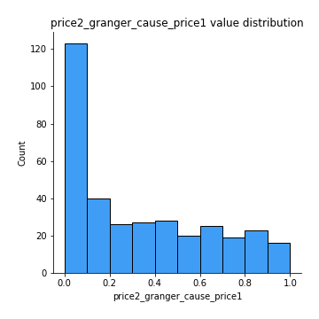
## Feature : price1_granger_cause_price2
- **Feature type** : continous
- **Missing** : 0.0%
- **Unique** : 347
- **Count** :347.0
- **Mean** :0.31434980491944775
- **Std** :0.29096205443018813
- **Min** :1.2012269232170316e-11
- **25%th Percentile** : 0.05725606457686058
- **50%th Percentile** : 0.22290370423838607
- **75%th Percentile** : 0.5389721885808687
- **Max** :0.9910496184892763

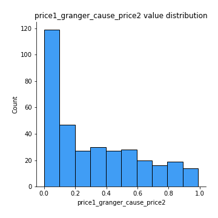

[<< Go back](../README.md)
