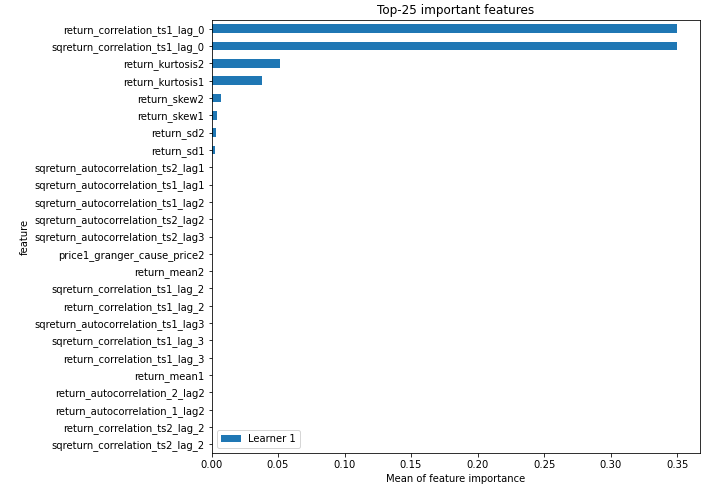
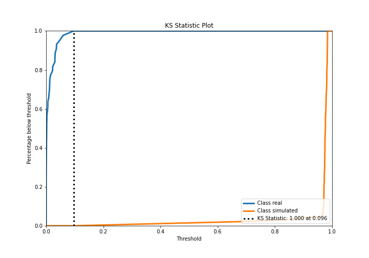
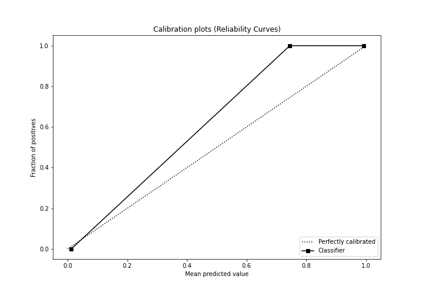
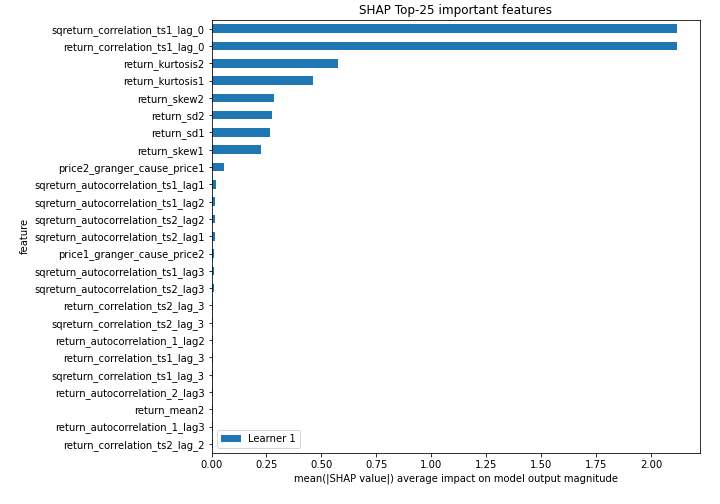
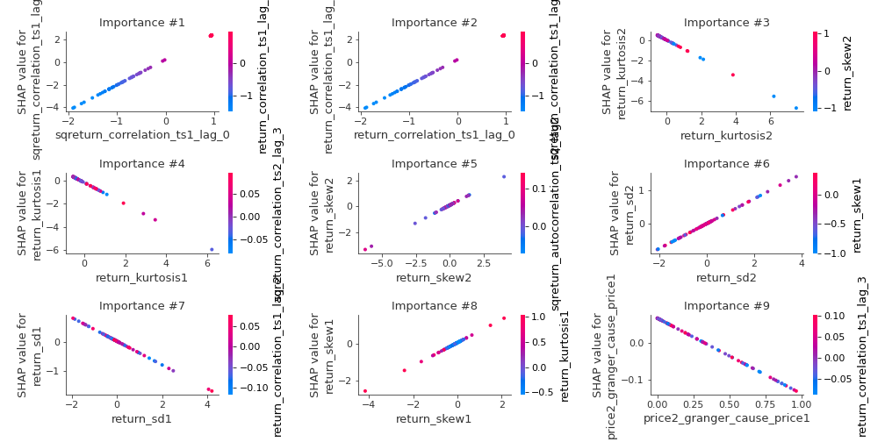
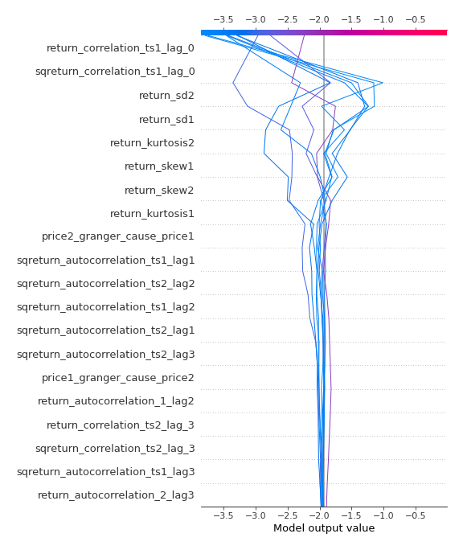
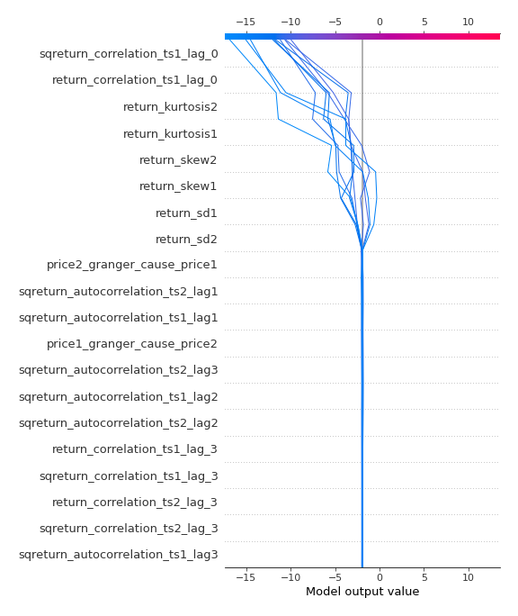
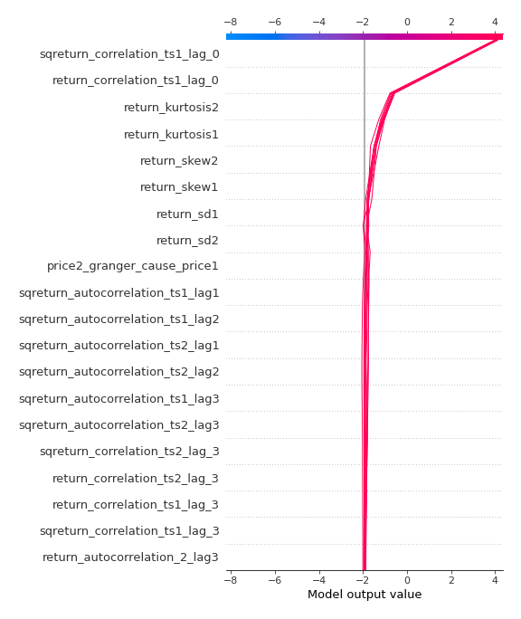

# Summary of 3_Linear

[<< Go back](../README.md)

## Logistic Regression (Linear)
- **n_jobs**: -1
- **explain_level**: 2

## Validation
 - **validation_type**: split
 - **train_ratio**: 0.75
 - **shuffle**: True
 - **stratify**: True

## Optimized metric
accuracy

## Training time

4.6 seconds

## Metric details
|           |     score |     threshold |
|:----------|----------:|--------------:|
| logloss   | 0.0209725 | nan           |
| auc       | 1         | nan           |
| f1        | 1         |   0.488484    |
| accuracy  | 1         |   0.488484    |
| precision | 1         |   0.488484    |
| recall    | 1         |   4.37814e-08 |
| mcc       | 1         |   0.488484    |

## Confusion matrix (at threshold=0.488484)
|                      |   Predicted as real |   Predicted as simulated |
|:---------------------|--------------------:|-------------------------:|
| Labeled as real      |                  44 |                        0 |
| Labeled as simulated |                   0 |                       43 |

## Learning curves

## Coefficients
| feature                           |   Learner_1 |
|:----------------------------------|------------:|
| sqreturn_correlation_ts1_lag_0    |   2.25546   |
| return_correlation_ts1_lag_0      |   2.25546   |
| return_skew1                      |   0.636497  |
| return_skew2                      |   0.550184  |
| return_sd2                        |   0.379007  |
| return_autocorrelation_1_lag2     |   0.134142  |
| sqreturn_correlation_ts1_lag_2    |   0.100477  |
| return_correlation_ts1_lag_2      |   0.100477  |
| return_correlation_ts2_lag_2      |   0.0951678 |
| sqreturn_correlation_ts2_lag_2    |   0.0951678 |
| return_autocorrelation_2_lag2     |   0.066062  |
| return_autocorrelation_1_lag1     |   0.0645471 |
| price1_granger_cause_price2       |   0.0418228 |
| return_correlation_ts1_lag_1      |   0.0238002 |
| sqreturn_correlation_ts1_lag_1    |   0.0238002 |
| return_autocorrelation_2_lag1     |  -0.0135749 |
| sqreturn_correlation_ts2_lag_1    |  -0.0207719 |
| return_correlation_ts2_lag_1      |  -0.0207719 |
| return_mean1                      |  -0.0275853 |
| return_mean2                      |  -0.0570344 |
| return_autocorrelation_1_lag3     |  -0.123368  |
| sqreturn_correlation_ts1_lag_3    |  -0.128028  |
| return_correlation_ts1_lag_3      |  -0.128028  |
| return_autocorrelation_2_lag3     |  -0.132976  |
| return_correlation_ts2_lag_3      |  -0.171817  |
| sqreturn_correlation_ts2_lag_3    |  -0.171817  |
| sqreturn_autocorrelation_ts1_lag3 |  -0.20121   |
| sqreturn_autocorrelation_ts2_lag3 |  -0.202595  |
| price2_granger_cause_price1       |  -0.207066  |
| sqreturn_autocorrelation_ts2_lag1 |  -0.252533  |
| sqreturn_autocorrelation_ts1_lag2 |  -0.29226   |
| sqreturn_autocorrelation_ts2_lag2 |  -0.30103   |
| sqreturn_autocorrelation_ts1_lag1 |  -0.316284  |
| return_sd1                        |  -0.407297  |
| return_kurtosis2                  |  -0.902274  |
| return_kurtosis1                  |  -0.938805  |
| intercept                         |  -1.29709   |

## Permutation-based Importance

## Confusion Matrix

## Normalized Confusion Matrix

## ROC Curve

## Kolmogorov-Smirnov Statistic

## Precision-Recall Curve

## Calibration Curve

## Cumulative Gains Curve

## Lift Curve

## SHAP Importance

## SHAP Dependence plots

### Dependence (Fold 1)

## SHAP Decision plots

### Top-10 Worst decisions for class 0 (Fold 1)

### Top-10 Best decisions for class 0 (Fold 1)

### Top-10 Worst decisions for class 1 (Fold 1)

### Top-10 Best decisions for class 1 (Fold 1)

[<< Go back](../README.md)
