# Exploratory Data Analysis

[<< Go back](../README.md)
## Feature : target
- **Feature type** : categorical
- **Missing** : 0.0%
- **Unique** : 2
- **Count** :347
- **Unique** :2
- **Top** :real
- **Freq** :176

## Feature : return_mean1
- **Feature type** : continous
- **Missing** : 0.0%
- **Unique** : 347
- **Count** :347.0
- **Mean** :0.018361705798862513
- **Std** :0.11312665795476164
- **Min** :-0.36387897495792765
- **25%th Percentile** : -0.05332307465225007
- **50%th Percentile** : 0.025983213333605783
- **75%th Percentile** : 0.09782443297006181
- **Max** :0.3602793017097547

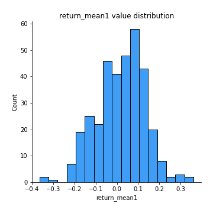
## Feature : return_mean2
- **Feature type** : continous
- **Missing** : 0.0%
- **Unique** : 347
- **Count** :347.0
- **Mean** :0.006760232568126598
- **Std** :0.11758477307295638
- **Min** :-0.3764489504758949
- **25%th Percentile** : -0.07037276149534913
- **50%th Percentile** : 0.01458979652329942
- **75%th Percentile** : 0.08470537557870231
- **Max** :0.6801605239983173

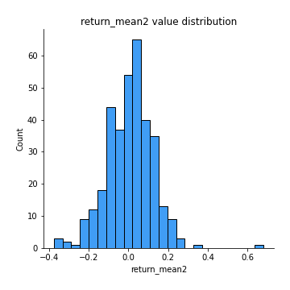
## Feature : return_sd1
- **Feature type** : continous
- **Missing** : 0.0%
- **Unique** : 347
- **Count** :347.0
- **Mean** :1.6393201451043364
- **Std** :0.3667425232265573
- **Min** :0.8733078831717243
- **25%th Percentile** : 1.4949908701509698
- **50%th Percentile** : 1.5989466366362017
- **75%th Percentile** : 1.6951566957330355
- **Max** :3.332494027875222

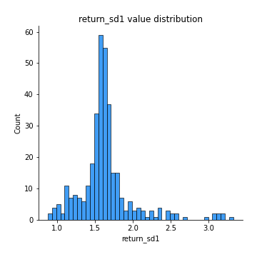
## Feature : return_sd2
- **Feature type** : continous
- **Missing** : 0.0%
- **Unique** : 347
- **Count** :347.0
- **Mean** :1.7276039830222971
- **Std** :0.4118636551280438
- **Min** :0.8198779632289204
- **25%th Percentile** : 1.5470693419675334
- **50%th Percentile** : 1.7010621281549863
- **75%th Percentile** : 1.787284463721769
- **Max** :4.59233049161685

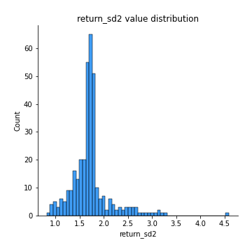
## Feature : return_skew1
- **Feature type** : continous
- **Missing** : 0.0%
- **Unique** : 347
- **Count** :347.0
- **Mean** :-0.173444905748937
- **Std** :0.699618957942593
- **Min** :-4.239645236578449
- **25%th Percentile** : -0.3496571476174042
- **50%th Percentile** : -0.07623679889961658
- **75%th Percentile** : 0.09124215855930527
- **Max** :2.1285977762978217

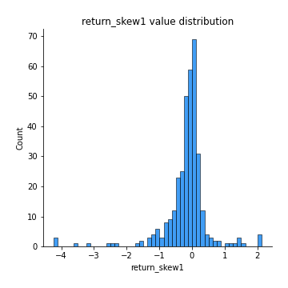
## Feature : return_skew2
- **Feature type** : continous
- **Missing** : 0.0%
- **Unique** : 347
- **Count** :347.0
- **Mean** :-0.24398596255977392
- **Std** :0.9649653799256744
- **Min** :-6.262899561987459
- **25%th Percentile** : -0.30770897837792494
- **50%th Percentile** : -0.05704089086466554
- **75%th Percentile** : 0.09534956255982188
- **Max** :4.0310261345618

## Feature : return_kurtosis1
- **Feature type** : continous
- **Missing** : 0.0%
- **Unique** : 347
- **Count** :347.0
- **Mean** :2.5013398657345434
- **Std** :5.333958066016639
- **Min** :-0.6340172983505301
- **25%th Percentile** : -0.012083803645462465
- **50%th Percentile** : 0.6828978418878218
- **75%th Percentile** : 2.6990337880253565
- **Max** :40.485294874464934

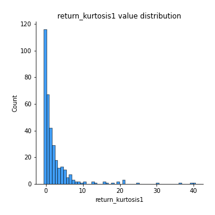
## Feature : return_kurtosis2
- **Feature type** : continous
- **Missing** : 0.0%
- **Unique** : 347
- **Count** :347.0
- **Mean** :3.9147688429010747
- **Std** :8.702627955186458
- **Min** :-0.5997213017725622
- **25%th Percentile** : 0.012296657614403461
- **50%th Percentile** : 0.6618725611954206
- **75%th Percentile** : 3.300904838680441
- **Max** :64.99818629655663

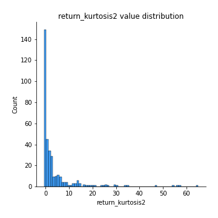
## Feature : return_autocorrelation_1_lag1
- **Feature type** : continous
- **Missing** : 0.0%
- **Unique** : 347
- **Count** :347.0
- **Mean** :-0.007245312107908908
- **Std** :0.06795563283822029
- **Min** :-0.2202283262044162
- **25%th Percentile** : -0.05274833800055709
- **50%th Percentile** : -0.005804049967940217
- **75%th Percentile** : 0.037085726810001614
- **Max** :0.17868398461342272

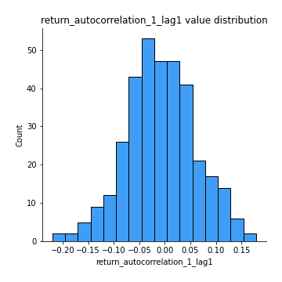
## Feature : return_autocorrelation_1_lag2
- **Feature type** : continous
- **Missing** : 0.0%
- **Unique** : 347
- **Count** :347.0
- **Mean** :-0.014695940347694138
- **Std** :0.06422450928984072
- **Min** :-0.1964393089148578
- **25%th Percentile** : -0.05639701355429015
- **50%th Percentile** : -0.017744670517733777
- **75%th Percentile** : 0.029898668274242493
- **Max** :0.21123611097039302

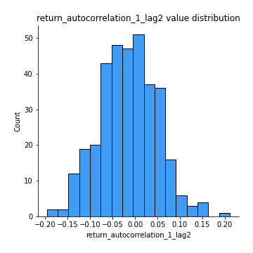
## Feature : return_autocorrelation_1_lag3
- **Feature type** : continous
- **Missing** : 0.0%
- **Unique** : 347
- **Count** :347.0
- **Mean** :0.010732281229145017
- **Std** :0.06273402865577196
- **Min** :-0.1654833157463618
- **25%th Percentile** : -0.029603168569453678
- **50%th Percentile** : 0.015935392233715748
- **75%th Percentile** : 0.052684370143452924
- **Max** :0.18389865583092216

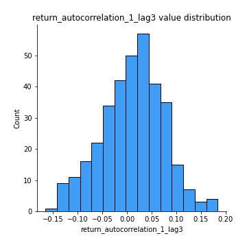
## Feature : return_autocorrelation_2_lag1
- **Feature type** : continous
- **Missing** : 0.0%
- **Unique** : 347
- **Count** :347.0
- **Mean** :-0.00030940678308467585
- **Std** :0.06583894502617872
- **Min** :-0.21294963310535148
- **25%th Percentile** : -0.041798415747193896
- **50%th Percentile** : -0.003973573772098947
- **75%th Percentile** : 0.046318519854474334
- **Max** :0.2024676054184499

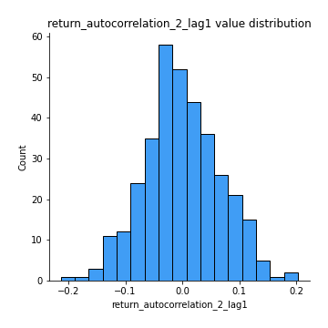
## Feature : return_autocorrelation_2_lag2
- **Feature type** : continous
- **Missing** : 0.0%
- **Unique** : 347
- **Count** :347.0
- **Mean** :-0.013468760305999793
- **Std** :0.06296081672036896
- **Min** :-0.1898385977079447
- **25%th Percentile** : -0.054559858803848116
- **50%th Percentile** : -0.014286382124546596
- **75%th Percentile** : 0.028694560888774506
- **Max** :0.17469191071837728

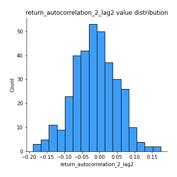
## Feature : return_autocorrelation_2_lag3
- **Feature type** : continous
- **Missing** : 0.0%
- **Unique** : 347
- **Count** :347.0
- **Mean** :0.007198926014505498
- **Std** :0.06315982882821461
- **Min** :-0.1798960840760737
- **25%th Percentile** : -0.0286698632539914
- **50%th Percentile** : 0.009196815230845973
- **75%th Percentile** : 0.050710817767581975
- **Max** :0.2062741383670528

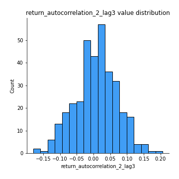
## Feature : return_correlation_ts1_lag_0
- **Feature type** : continous
- **Missing** : 0.0%
- **Unique** : 347
- **Count** :347.0
- **Mean** :0.6472944257768792
- **Std** :0.347351068403846
- **Min** :-0.10256711281206837
- **25%th Percentile** : 0.3380361619663287
- **50%th Percentile** : 0.6745340168720974
- **75%th Percentile** : 0.9752410368127715
- **Max** :0.9937227277077512

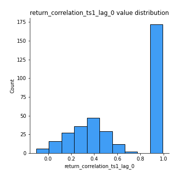
## Feature : return_correlation_ts1_lag_1
- **Feature type** : continous
- **Missing** : 0.0%
- **Unique** : 347
- **Count** :347.0
- **Mean** :-0.0026139780467281867
- **Std** :0.06236049166468441
- **Min** :-0.19684769135537328
- **25%th Percentile** : -0.04241951802841406
- **50%th Percentile** : -0.0001727222450822386
- **75%th Percentile** : 0.03793428680702438
- **Max** :0.18831948785787056

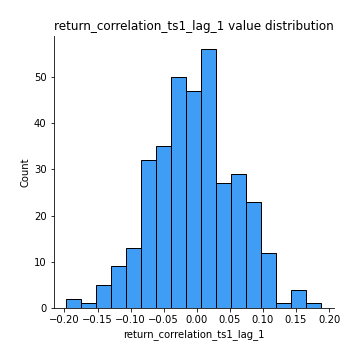
## Feature : return_correlation_ts1_lag_2
- **Feature type** : continous
- **Missing** : 0.0%
- **Unique** : 347
- **Count** :347.0
- **Mean** :-0.009429715725453331
- **Std** :0.06174976600605309
- **Min** :-0.1999447001663844
- **25%th Percentile** : -0.05081721797985872
- **50%th Percentile** : -0.010148263011860933
- **75%th Percentile** : 0.03649655809131758
- **Max** :0.17974071501626168

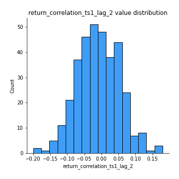
## Feature : return_correlation_ts1_lag_3
- **Feature type** : continous
- **Missing** : 0.0%
- **Unique** : 347
- **Count** :347.0
- **Mean** :0.007247611216956515
- **Std** :0.06908472674914856
- **Min** :-0.21147540839842804
- **25%th Percentile** : -0.035992800169555444
- **50%th Percentile** : 0.006046228259353783
- **75%th Percentile** : 0.055076316102819343
- **Max** :0.23808054096877584

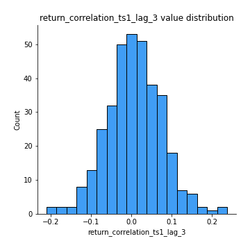
## Feature : return_correlation_ts2_lag_1
- **Feature type** : continous
- **Missing** : 0.0%
- **Unique** : 347
- **Count** :347.0
- **Mean** :0.005448337466042987
- **Std** :0.07050027237049394
- **Min** :-0.23721078153669567
- **25%th Percentile** : -0.0441260796538223
- **50%th Percentile** : 0.001703204128990032
- **75%th Percentile** : 0.052732796759591916
- **Max** :0.3425036902091001

## Feature : return_correlation_ts2_lag_2
- **Feature type** : continous
- **Missing** : 0.0%
- **Unique** : 347
- **Count** :347.0
- **Mean** :-0.012807824733176437
- **Std** :0.062195309572599534
- **Min** :-0.2757460186107768
- **25%th Percentile** : -0.04900598258788451
- **50%th Percentile** : -0.012503108160931182
- **75%th Percentile** : 0.02743038206325489
- **Max** :0.1668209648754713

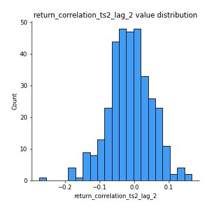
## Feature : return_correlation_ts2_lag_3
- **Feature type** : continous
- **Missing** : 0.0%
- **Unique** : 347
- **Count** :347.0
- **Mean** :0.010324171555592926
- **Std** :0.06447967103258183
- **Min** :-0.1468769429946283
- **25%th Percentile** : -0.03241127695669227
- **50%th Percentile** : 0.011854204577586715
- **75%th Percentile** : 0.05207409395182048
- **Max** :0.19132397472612925

## Feature : sqreturn_autocorrelation_ts1_lag1
- **Feature type** : continous
- **Missing** : 0.0%
- **Unique** : 347
- **Count** :347.0
- **Mean** :0.030969951136153577
- **Std** :0.08337900268130326
- **Min** :-0.12839191981929649
- **25%th Percentile** : -0.025670308140777802
- **50%th Percentile** : 0.012310903679030257
- **75%th Percentile** : 0.07060086518871961
- **Max** :0.4170324090514868

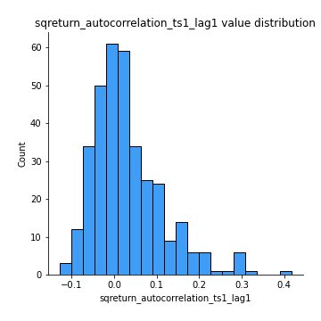
## Feature : sqreturn_autocorrelation_ts1_lag2
- **Feature type** : continous
- **Missing** : 0.0%
- **Unique** : 347
- **Count** :347.0
- **Mean** :0.02069358392623006
- **Std** :0.07378815441314734
- **Min** :-0.16601668365376718
- **25%th Percentile** : -0.030357439951832398
- **50%th Percentile** : 0.006527571743635394
- **75%th Percentile** : 0.06381964825914352
- **Max** :0.32836952056190194

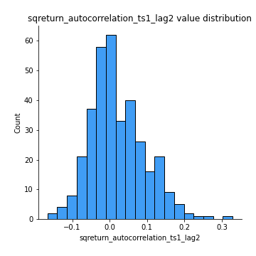
## Feature : sqreturn_autocorrelation_ts1_lag3
- **Feature type** : continous
- **Missing** : 0.0%
- **Unique** : 347
- **Count** :347.0
- **Mean** :0.01408518853956421
- **Std** :0.062434771474694825
- **Min** :-0.14663149661607588
- **25%th Percentile** : -0.026044215219349277
- **50%th Percentile** : 0.008712818891278003
- **75%th Percentile** : 0.047243312780894026
- **Max** :0.36579865351615615

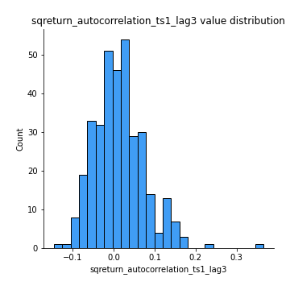
## Feature : sqreturn_autocorrelation_ts2_lag1
- **Feature type** : continous
- **Missing** : 0.0%
- **Unique** : 347
- **Count** :347.0
- **Mean** :0.026471669372494774
- **Std** :0.07489802217297105
- **Min** :-0.161067331827812
- **25%th Percentile** : -0.020232140341233565
- **50%th Percentile** : 0.016664012273894142
- **75%th Percentile** : 0.06150136235232509
- **Max** :0.36991568023038357

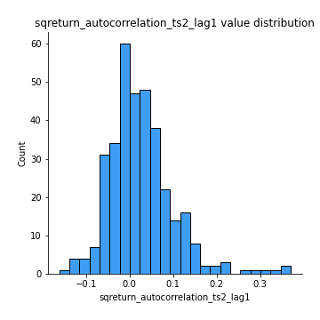
## Feature : sqreturn_autocorrelation_ts2_lag2
- **Feature type** : continous
- **Missing** : 0.0%
- **Unique** : 347
- **Count** :347.0
- **Mean** :0.013374588948110057
- **Std** :0.06596280934110346
- **Min** :-0.14652086156143102
- **25%th Percentile** : -0.030998862490787725
- **50%th Percentile** : 0.004761343614652614
- **75%th Percentile** : 0.049426301031741185
- **Max** :0.28672056150180414

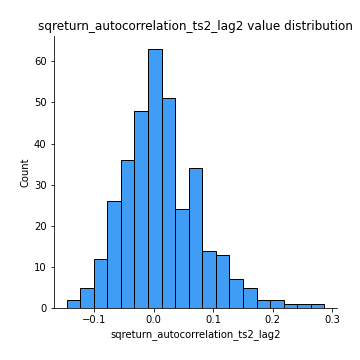
## Feature : sqreturn_autocorrelation_ts2_lag3
- **Feature type** : continous
- **Missing** : 0.0%
- **Unique** : 347
- **Count** :347.0
- **Mean** :0.00962581385998341
- **Std** :0.06113622769071412
- **Min** :-0.10615558056848237
- **25%th Percentile** : -0.03119193116012147
- **50%th Percentile** : -0.0012876717818051026
- **75%th Percentile** : 0.04256569997667471
- **Max** :0.3463122340368414

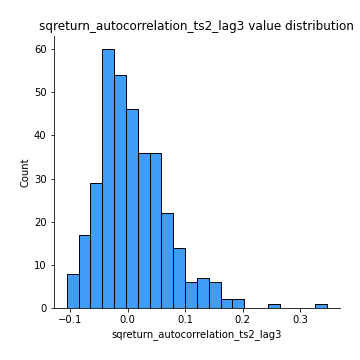
## Feature : sqreturn_correlation_ts1_lag_0
- **Feature type** : continous
- **Missing** : 0.0%
- **Unique** : 347
- **Count** :347.0
- **Mean** :0.6472944257768792
- **Std** :0.347351068403846
- **Min** :-0.10256711281206837
- **25%th Percentile** : 0.3380361619663287
- **50%th Percentile** : 0.6745340168720974
- **75%th Percentile** : 0.9752410368127715
- **Max** :0.9937227277077512

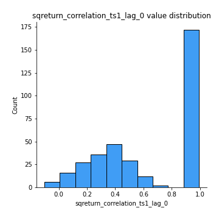
## Feature : sqreturn_correlation_ts1_lag_1
- **Feature type** : continous
- **Missing** : 0.0%
- **Unique** : 347
- **Count** :347.0
- **Mean** :-0.0026139780467281867
- **Std** :0.06236049166468441
- **Min** :-0.19684769135537328
- **25%th Percentile** : -0.04241951802841406
- **50%th Percentile** : -0.0001727222450822386
- **75%th Percentile** : 0.03793428680702438
- **Max** :0.18831948785787056

## Feature : sqreturn_correlation_ts1_lag_2
- **Feature type** : continous
- **Missing** : 0.0%
- **Unique** : 347
- **Count** :347.0
- **Mean** :-0.009429715725453331
- **Std** :0.06174976600605309
- **Min** :-0.1999447001663844
- **25%th Percentile** : -0.05081721797985872
- **50%th Percentile** : -0.010148263011860933
- **75%th Percentile** : 0.03649655809131758
- **Max** :0.17974071501626168

## Feature : sqreturn_correlation_ts1_lag_3
- **Feature type** : continous
- **Missing** : 0.0%
- **Unique** : 347
- **Count** :347.0
- **Mean** :0.007247611216956515
- **Std** :0.06908472674914856
- **Min** :-0.21147540839842804
- **25%th Percentile** : -0.035992800169555444
- **50%th Percentile** : 0.006046228259353783
- **75%th Percentile** : 0.055076316102819343
- **Max** :0.23808054096877584

## Feature : sqreturn_correlation_ts2_lag_1
- **Feature type** : continous
- **Missing** : 0.0%
- **Unique** : 347
- **Count** :347.0
- **Mean** :0.005448337466042987
- **Std** :0.07050027237049394
- **Min** :-0.23721078153669567
- **25%th Percentile** : -0.0441260796538223
- **50%th Percentile** : 0.001703204128990032
- **75%th Percentile** : 0.052732796759591916
- **Max** :0.3425036902091001

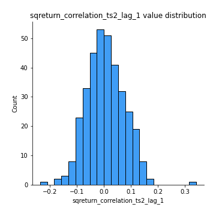
## Feature : sqreturn_correlation_ts2_lag_2
- **Feature type** : continous
- **Missing** : 0.0%
- **Unique** : 347
- **Count** :347.0
- **Mean** :-0.012807824733176437
- **Std** :0.062195309572599534
- **Min** :-0.2757460186107768
- **25%th Percentile** : -0.04900598258788451
- **50%th Percentile** : -0.012503108160931182
- **75%th Percentile** : 0.02743038206325489
- **Max** :0.1668209648754713

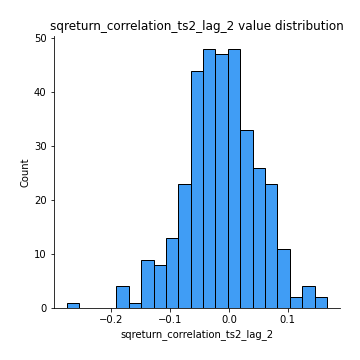
## Feature : sqreturn_correlation_ts2_lag_3
- **Feature type** : continous
- **Missing** : 0.0%
- **Unique** : 347
- **Count** :347.0
- **Mean** :0.010324171555592926
- **Std** :0.06447967103258183
- **Min** :-0.1468769429946283
- **25%th Percentile** : -0.03241127695669227
- **50%th Percentile** : 0.011854204577586715
- **75%th Percentile** : 0.05207409395182048
- **Max** :0.19132397472612925

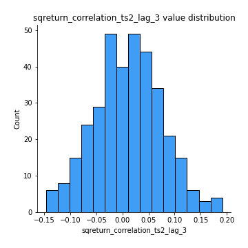
## Feature : price2_granger_cause_price1
- **Feature type** : continous
- **Missing** : 0.0%
- **Unique** : 347
- **Count** :347.0
- **Mean** :0.313001567201611
- **Std** :0.29373489760044
- **Min** :2.4312048970873696e-09
- **25%th Percentile** : 0.04093709703950851
- **50%th Percentile** : 0.2155307206798852
- **75%th Percentile** : 0.5171913561357183
- **Max** :0.9998924855859307

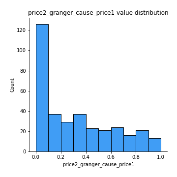
## Feature : price1_granger_cause_price2
- **Feature type** : continous
- **Missing** : 0.0%
- **Unique** : 347
- **Count** :347.0
- **Mean** :0.30632171511358647
- **Std** :0.2961529350963149
- **Min** :1.2012269232170316e-11
- **25%th Percentile** : 0.043578611207595805
- **50%th Percentile** : 0.21141852407520342
- **75%th Percentile** : 0.5114169216584477
- **Max** :0.9906158137251477

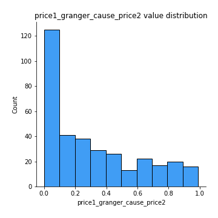

[<< Go back](../README.md)
