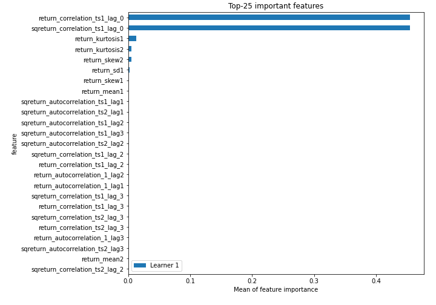
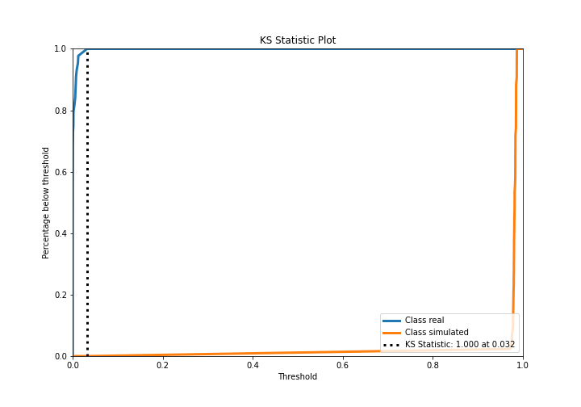
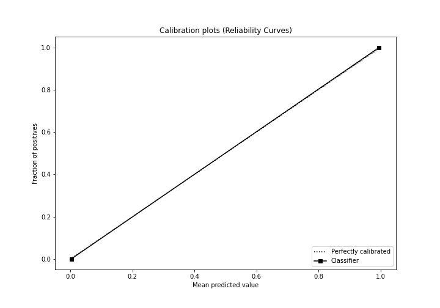
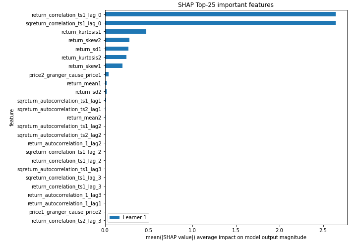
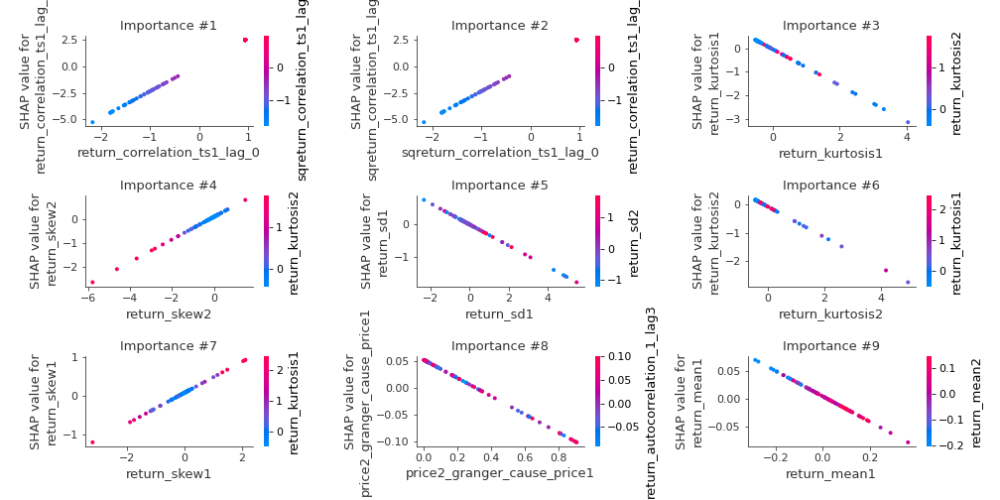
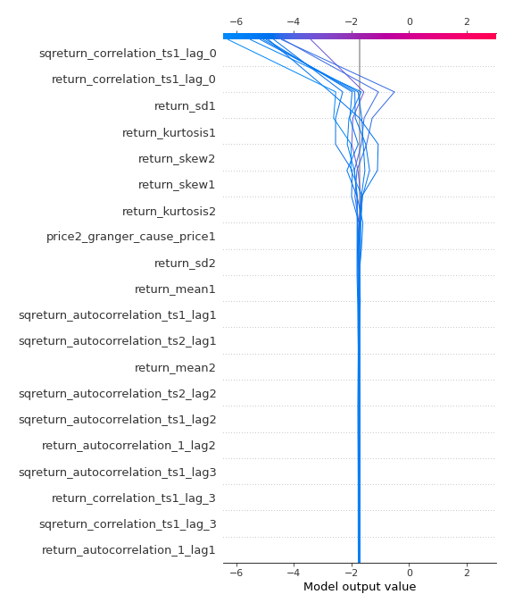
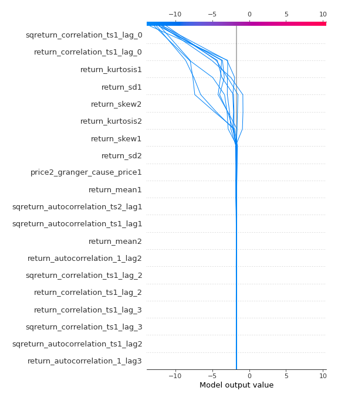
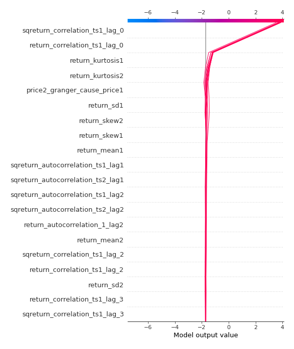
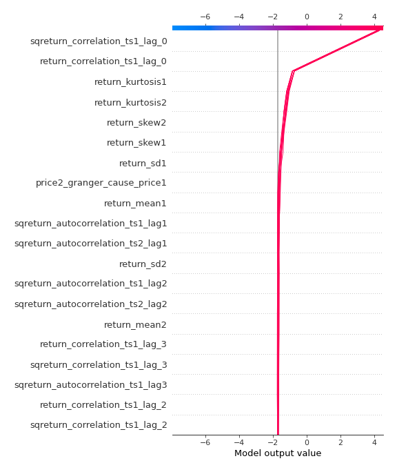

# Summary of 3_Linear

[<< Go back](../README.md)

## Logistic Regression (Linear)
- **n_jobs**: -1
- **explain_level**: 2

## Validation
 - **validation_type**: split
 - **train_ratio**: 0.75
 - **shuffle**: True
 - **stratify**: True

## Optimized metric
accuracy

## Training time

3.3 seconds

## Metric details
|           |     score |     threshold |
|:----------|----------:|--------------:|
| logloss   | 0.0103524 | nan           |
| auc       | 1         | nan           |
| f1        | 1         |   0.489669    |
| accuracy  | 1         |   0.489669    |
| precision | 1         |   0.489669    |
| recall    | 1         |   1.35024e-06 |
| mcc       | 1         |   0.489669    |

## Confusion matrix (at threshold=0.489669)
|                      |   Predicted as real |   Predicted as simulated |
|:---------------------|--------------------:|-------------------------:|
| Labeled as real      |                  44 |                        0 |
| Labeled as simulated |                   0 |                       43 |

## Learning curves

## Coefficients
| feature                           |    Learner_1 |
|:----------------------------------|-------------:|
| sqreturn_correlation_ts1_lag_0    |  2.4868      |
| return_correlation_ts1_lag_0      |  2.4868      |
| return_skew2                      |  0.471915    |
| return_skew1                      |  0.405868    |
| sqreturn_correlation_ts1_lag_2    |  0.0901892   |
| return_correlation_ts1_lag_2      |  0.0901892   |
| return_autocorrelation_1_lag2     |  0.0871467   |
| return_autocorrelation_1_lag1     |  0.0631108   |
| return_sd2                        |  0.0366133   |
| sqreturn_correlation_ts2_lag_2    |  0.0277529   |
| return_correlation_ts2_lag_2      |  0.0277529   |
| sqreturn_correlation_ts1_lag_1    |  0.0273668   |
| return_correlation_ts1_lag_1      |  0.0273668   |
| price1_granger_cause_price2       |  0.0131384   |
| return_autocorrelation_2_lag2     |  0.0107857   |
| return_autocorrelation_2_lag1     |  0.000557177 |
| return_correlation_ts2_lag_1      | -0.00846682  |
| sqreturn_correlation_ts2_lag_1    | -0.00846682  |
| return_autocorrelation_2_lag3     | -0.0546587   |
| sqreturn_autocorrelation_ts2_lag3 | -0.0620092   |
| return_correlation_ts2_lag_3      | -0.0633839   |
| sqreturn_correlation_ts2_lag_3    | -0.0633839   |
| return_autocorrelation_1_lag3     | -0.0651294   |
| return_mean2                      | -0.0858407   |
| sqreturn_correlation_ts1_lag_3    | -0.0897004   |
| return_correlation_ts1_lag_3      | -0.0897004   |
| sqreturn_autocorrelation_ts1_lag3 | -0.105731    |
| sqreturn_autocorrelation_ts1_lag2 | -0.112455    |
| sqreturn_autocorrelation_ts2_lag2 | -0.115004    |
| sqreturn_autocorrelation_ts2_lag1 | -0.165708    |
| price2_granger_cause_price1       | -0.169724    |
| sqreturn_autocorrelation_ts1_lag1 | -0.204733    |
| return_mean1                      | -0.227981    |
| return_sd1                        | -0.328298    |
| return_kurtosis2                  | -0.543232    |
| return_kurtosis1                  | -0.769481    |
| intercept                         | -1.25934     |

## Permutation-based Importance

## Confusion Matrix

## Normalized Confusion Matrix

## ROC Curve

## Kolmogorov-Smirnov Statistic

## Precision-Recall Curve

## Calibration Curve

## Cumulative Gains Curve

## Lift Curve

## SHAP Importance

## SHAP Dependence plots

### Dependence (Fold 1)

## SHAP Decision plots

### Top-10 Worst decisions for class 0 (Fold 1)

### Top-10 Best decisions for class 0 (Fold 1)

### Top-10 Worst decisions for class 1 (Fold 1)

### Top-10 Best decisions for class 1 (Fold 1)

[<< Go back](../README.md)
