# Exploratory Data Analysis

[<< Go back](../README.md)
## Feature : target
- **Feature type** : categorical
- **Missing** : 0.0%
- **Unique** : 2
- **Count** :347
- **Unique** :2
- **Top** :real
- **Freq** :175

## Feature : return_mean1
- **Feature type** : continous
- **Missing** : 0.0%
- **Unique** : 347
- **Count** :347.0
- **Mean** :-0.002433903316102487
- **Std** :0.1125657626222021
- **Min** :-0.297638839829253
- **25%th Percentile** : -0.08211147089646899
- **50%th Percentile** : 0.003864925885885163
- **75%th Percentile** : 0.08281870283899982
- **Max** :0.3602793017097547

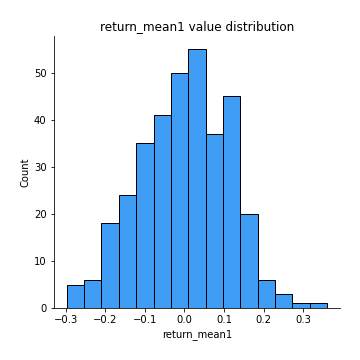
## Feature : return_mean2
- **Feature type** : continous
- **Missing** : 0.0%
- **Unique** : 347
- **Count** :347.0
- **Mean** :0.010509472357518548
- **Std** :0.11327640708744947
- **Min** :-0.3439835398279146
- **25%th Percentile** : -0.0577729917457118
- **50%th Percentile** : 0.013227367742394237
- **75%th Percentile** : 0.0849509761282071
- **Max** :0.6801605239983173

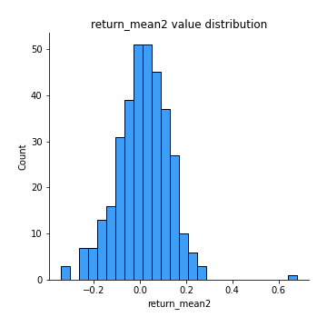
## Feature : return_sd1
- **Feature type** : continous
- **Missing** : 0.0%
- **Unique** : 347
- **Count** :347.0
- **Mean** :1.584124263945151
- **Std** :0.36361662994772637
- **Min** :0.8102430347636637
- **25%th Percentile** : 1.4281084539884445
- **50%th Percentile** : 1.5292382089939378
- **75%th Percentile** : 1.6361176886579178
- **Max** :3.332494027875222

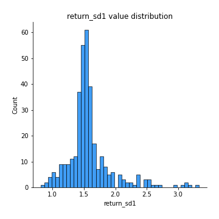
## Feature : return_sd2
- **Feature type** : continous
- **Missing** : 0.0%
- **Unique** : 347
- **Count** :347.0
- **Mean** :1.6502580088802177
- **Std** :0.4174728487435539
- **Min** :0.8198779632289204
- **25%th Percentile** : 1.4825278858135742
- **50%th Percentile** : 1.5792018905971972
- **75%th Percentile** : 1.6804634293513026
- **Max** :4.59233049161685

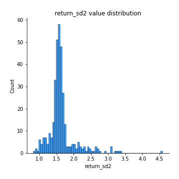
## Feature : return_skew1
- **Feature type** : continous
- **Missing** : 0.0%
- **Unique** : 347
- **Count** :347.0
- **Mean** :-0.1736621162639967
- **Std** :0.7270862105778909
- **Min** :-4.239645236578449
- **25%th Percentile** : -0.3443121766641171
- **50%th Percentile** : -0.05512545530828748
- **75%th Percentile** : 0.0928460790827272
- **Max** :2.3044235031125564

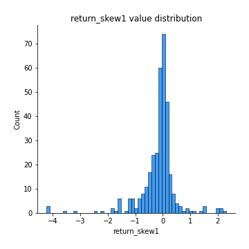
## Feature : return_skew2
- **Feature type** : continous
- **Missing** : 0.0%
- **Unique** : 347
- **Count** :347.0
- **Mean** :-0.29412736444530785
- **Std** :1.057025964463519
- **Min** :-7.3762354994385335
- **25%th Percentile** : -0.3549615944440911
- **50%th Percentile** : -0.05332319734200398
- **75%th Percentile** : 0.09647450612470701
- **Max** :4.0310261345618

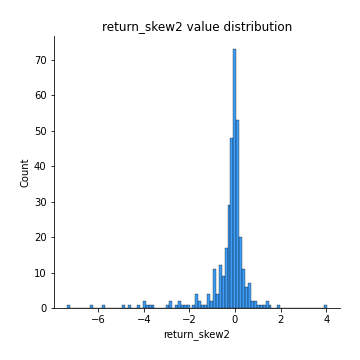
## Feature : return_kurtosis1
- **Feature type** : continous
- **Missing** : 0.0%
- **Unique** : 347
- **Count** :347.0
- **Mean** :2.682444691590823
- **Std** :5.600248083187585
- **Min** :-0.6175255197199125
- **25%th Percentile** : -0.04276718916981159
- **50%th Percentile** : 0.6681331847362246
- **75%th Percentile** : 2.627323675085121
- **Max** :40.485294874464934

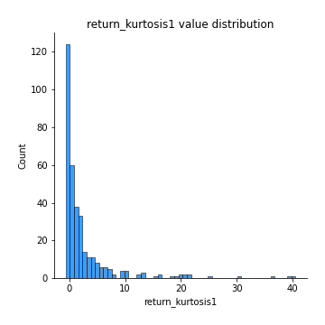
## Feature : return_kurtosis2
- **Feature type** : continous
- **Missing** : 0.0%
- **Unique** : 347
- **Count** :347.0
- **Mean** :4.032871116080023
- **Std** :9.972666002654584
- **Min** :-0.6152396184081272
- **25%th Percentile** : -0.03826467301103542
- **50%th Percentile** : 0.602729127159503
- **75%th Percentile** : 3.3434029241276617
- **Max** :94.01659180149953

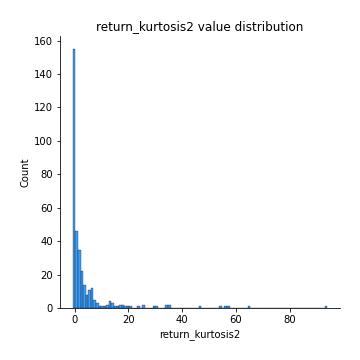
## Feature : return_autocorrelation_1_lag1
- **Feature type** : continous
- **Missing** : 0.0%
- **Unique** : 347
- **Count** :347.0
- **Mean** :-0.008068125912330281
- **Std** :0.06633816879686569
- **Min** :-0.2110198016529991
- **25%th Percentile** : -0.05059324638066956
- **50%th Percentile** : -0.005012001358120542
- **75%th Percentile** : 0.03346964285111112
- **Max** :0.18006291956111042

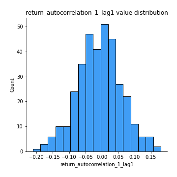
## Feature : return_autocorrelation_1_lag2
- **Feature type** : continous
- **Missing** : 0.0%
- **Unique** : 347
- **Count** :347.0
- **Mean** :-0.009046829501180631
- **Std** :0.06712331441898077
- **Min** :-0.20479723732905455
- **25%th Percentile** : -0.0515314722620009
- **50%th Percentile** : -0.005243720994169411
- **75%th Percentile** : 0.03364397198205819
- **Max** :0.21123611097039302

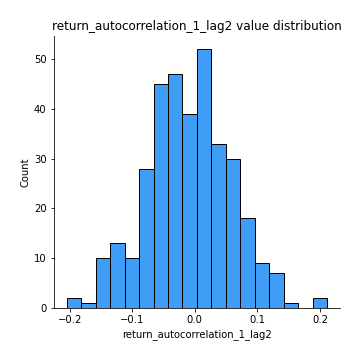
## Feature : return_autocorrelation_1_lag3
- **Feature type** : continous
- **Missing** : 0.0%
- **Unique** : 347
- **Count** :347.0
- **Mean** :0.0023079331153650455
- **Std** :0.06379049651502296
- **Min** :-0.1873367417424894
- **25%th Percentile** : -0.042375604759707725
- **50%th Percentile** : 0.004777828104388532
- **75%th Percentile** : 0.04428935874141112
- **Max** :0.17514033413395239

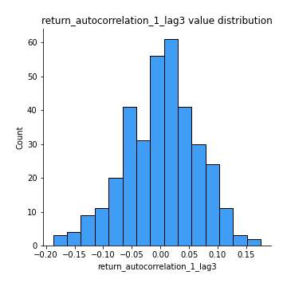
## Feature : return_autocorrelation_2_lag1
- **Feature type** : continous
- **Missing** : 0.0%
- **Unique** : 347
- **Count** :347.0
- **Mean** :-0.0025567687758599276
- **Std** :0.06887575063012763
- **Min** :-0.17778763204400128
- **25%th Percentile** : -0.049140300220959186
- **50%th Percentile** : -0.00032239629507604847
- **75%th Percentile** : 0.045337172578050505
- **Max** :0.1877728597669003

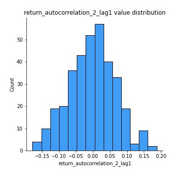
## Feature : return_autocorrelation_2_lag2
- **Feature type** : continous
- **Missing** : 0.0%
- **Unique** : 347
- **Count** :347.0
- **Mean** :-0.006906340713662463
- **Std** :0.06513919257464706
- **Min** :-0.20514419541213463
- **25%th Percentile** : -0.047372666790713426
- **50%th Percentile** : -0.0033682269508172012
- **75%th Percentile** : 0.03294925188538331
- **Max** :0.19766404533977672

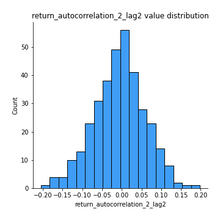
## Feature : return_autocorrelation_2_lag3
- **Feature type** : continous
- **Missing** : 0.0%
- **Unique** : 347
- **Count** :347.0
- **Mean** :-0.0010887648455899567
- **Std** :0.06454391185487103
- **Min** :-0.18772406466387223
- **25%th Percentile** : -0.04441325000977091
- **50%th Percentile** : -0.00046060846904786564
- **75%th Percentile** : 0.041361946968913654
- **Max** :0.20205753622966244

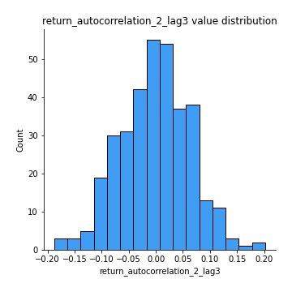
## Feature : return_correlation_ts1_lag_0
- **Feature type** : continous
- **Missing** : 0.0%
- **Unique** : 347
- **Count** :347.0
- **Mean** :0.6541148318232213
- **Std** :0.3634532316632628
- **Min** :-0.10256711281206837
- **25%th Percentile** : 0.32409496960217626
- **50%th Percentile** : 0.7082699009496575
- **75%th Percentile** : 0.9999759597493653
- **Max** :0.9999831829738215

## Feature : return_correlation_ts1_lag_1
- **Feature type** : continous
- **Missing** : 0.0%
- **Unique** : 347
- **Count** :347.0
- **Mean** :-0.0039784603902274715
- **Std** :0.062387192381875366
- **Min** :-0.17743187393147275
- **25%th Percentile** : -0.04703611951524819
- **50%th Percentile** : -0.00024243483539062766
- **75%th Percentile** : 0.03520446844960872
- **Max** :0.17975593397150688

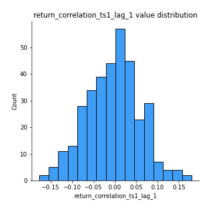
## Feature : return_correlation_ts1_lag_2
- **Feature type** : continous
- **Missing** : 0.0%
- **Unique** : 347
- **Count** :347.0
- **Mean** :-0.0052696415605282985
- **Std** :0.06376007700088303
- **Min** :-0.20511771243059113
- **25%th Percentile** : -0.044927401890220736
- **50%th Percentile** : -0.005355765941193867
- **75%th Percentile** : 0.03470016859284818
- **Max** :0.19755148338115205

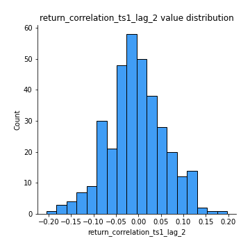
## Feature : return_correlation_ts1_lag_3
- **Feature type** : continous
- **Missing** : 0.0%
- **Unique** : 347
- **Count** :347.0
- **Mean** :-0.0023424468247068174
- **Std** :0.06667095763222232
- **Min** :-0.21147540839842804
- **25%th Percentile** : -0.04746440523331887
- **50%th Percentile** : -0.0018082199655418112
- **75%th Percentile** : 0.04296560177457343
- **Max** :0.23808054096877584

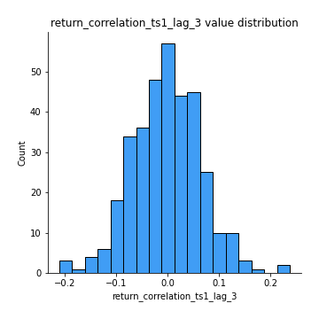
## Feature : return_correlation_ts2_lag_1
- **Feature type** : continous
- **Missing** : 0.0%
- **Unique** : 347
- **Count** :347.0
- **Mean** :0.0017582911794245609
- **Std** :0.07185229692276089
- **Min** :-0.17665751184419612
- **25%th Percentile** : -0.04929235981756618
- **50%th Percentile** : 0.0013326889407501727
- **75%th Percentile** : 0.04514270602981511
- **Max** :0.3425036902091001

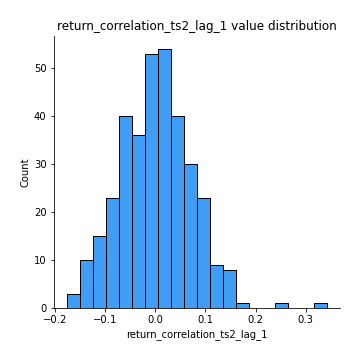
## Feature : return_correlation_ts2_lag_2
- **Feature type** : continous
- **Missing** : 0.0%
- **Unique** : 347
- **Count** :347.0
- **Mean** :-0.0031938001654350907
- **Std** :0.06681720044379973
- **Min** :-0.2757460186107768
- **25%th Percentile** : -0.042548454275758596
- **50%th Percentile** : -0.0007572819676472723
- **75%th Percentile** : 0.03746378553869635
- **Max** :0.19791834476425582

## Feature : return_correlation_ts2_lag_3
- **Feature type** : continous
- **Missing** : 0.0%
- **Unique** : 347
- **Count** :347.0
- **Mean** :0.0023032987345981202
- **Std** :0.06363611931690832
- **Min** :-0.18732889576588613
- **25%th Percentile** : -0.043818909424608934
- **50%th Percentile** : 0.003064094438270722
- **75%th Percentile** : 0.044419595838921674
- **Max** :0.18227042221329348

## Feature : sqreturn_autocorrelation_ts1_lag1
- **Feature type** : continous
- **Missing** : 0.0%
- **Unique** : 347
- **Count** :347.0
- **Mean** :0.03319114954758698
- **Std** :0.08183933943926293
- **Min** :-0.15354039790799814
- **25%th Percentile** : -0.02455526843264026
- **50%th Percentile** : 0.01712077723531777
- **75%th Percentile** : 0.07535952061673806
- **Max** :0.4170324090514868

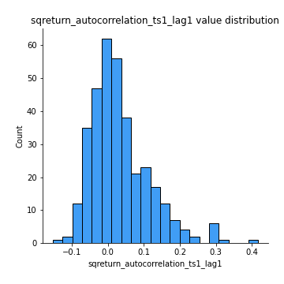
## Feature : sqreturn_autocorrelation_ts1_lag2
- **Feature type** : continous
- **Missing** : 0.0%
- **Unique** : 347
- **Count** :347.0
- **Mean** :0.01990169059536696
- **Std** :0.06986557936315904
- **Min** :-0.16994683327867027
- **25%th Percentile** : -0.025790080554363888
- **50%th Percentile** : 0.010626058842018254
- **75%th Percentile** : 0.05762514002304499
- **Max** :0.29415594530501293

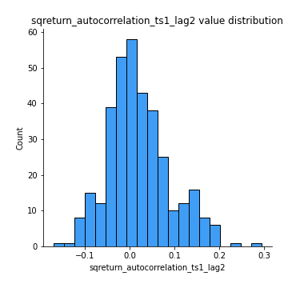
## Feature : sqreturn_autocorrelation_ts1_lag3
- **Feature type** : continous
- **Missing** : 0.0%
- **Unique** : 347
- **Count** :347.0
- **Mean** :0.011344302526236853
- **Std** :0.06596027935172054
- **Min** :-0.14974984573799258
- **25%th Percentile** : -0.028721689793101007
- **50%th Percentile** : 0.0030818298634970294
- **75%th Percentile** : 0.04533561662243899
- **Max** :0.36579865351615615

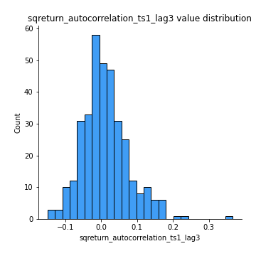
## Feature : sqreturn_autocorrelation_ts2_lag1
- **Feature type** : continous
- **Missing** : 0.0%
- **Unique** : 347
- **Count** :347.0
- **Mean** :0.027394717799871543
- **Std** :0.07489528418202752
- **Min** :-0.15779438361654874
- **25%th Percentile** : -0.022828136508076264
- **50%th Percentile** : 0.014887595946889287
- **75%th Percentile** : 0.06012865795103353
- **Max** :0.3533869018400006

## Feature : sqreturn_autocorrelation_ts2_lag2
- **Feature type** : continous
- **Missing** : 0.0%
- **Unique** : 347
- **Count** :347.0
- **Mean** :0.010613821892896391
- **Std** :0.06125374906842159
- **Min** :-0.17062542072705444
- **25%th Percentile** : -0.022908403946025932
- **50%th Percentile** : 0.0009833005074087674
- **75%th Percentile** : 0.04432851711708391
- **Max** :0.2357173664732939

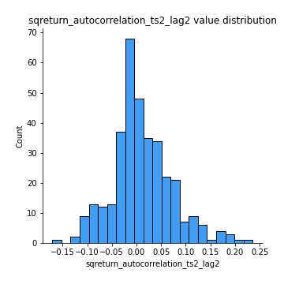
## Feature : sqreturn_autocorrelation_ts2_lag3
- **Feature type** : continous
- **Missing** : 0.0%
- **Unique** : 347
- **Count** :347.0
- **Mean** :0.00673929032120003
- **Std** :0.06519837968670823
- **Min** :-0.15411979030832343
- **25%th Percentile** : -0.03171817205924704
- **50%th Percentile** : -0.003410700351538883
- **75%th Percentile** : 0.03928426670238116
- **Max** :0.3463122340368414

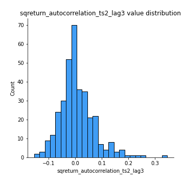
## Feature : sqreturn_correlation_ts1_lag_0
- **Feature type** : continous
- **Missing** : 0.0%
- **Unique** : 347
- **Count** :347.0
- **Mean** :0.6541148318232213
- **Std** :0.3634532316632628
- **Min** :-0.10256711281206837
- **25%th Percentile** : 0.32409496960217626
- **50%th Percentile** : 0.7082699009496575
- **75%th Percentile** : 0.9999759597493653
- **Max** :0.9999831829738215

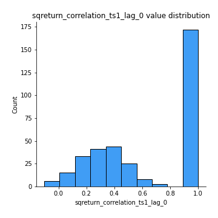
## Feature : sqreturn_correlation_ts1_lag_1
- **Feature type** : continous
- **Missing** : 0.0%
- **Unique** : 347
- **Count** :347.0
- **Mean** :-0.0039784603902274715
- **Std** :0.062387192381875366
- **Min** :-0.17743187393147275
- **25%th Percentile** : -0.04703611951524819
- **50%th Percentile** : -0.00024243483539062766
- **75%th Percentile** : 0.03520446844960872
- **Max** :0.17975593397150688

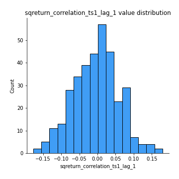
## Feature : sqreturn_correlation_ts1_lag_2
- **Feature type** : continous
- **Missing** : 0.0%
- **Unique** : 347
- **Count** :347.0
- **Mean** :-0.0052696415605282985
- **Std** :0.06376007700088303
- **Min** :-0.20511771243059113
- **25%th Percentile** : -0.044927401890220736
- **50%th Percentile** : -0.005355765941193867
- **75%th Percentile** : 0.03470016859284818
- **Max** :0.19755148338115205

## Feature : sqreturn_correlation_ts1_lag_3
- **Feature type** : continous
- **Missing** : 0.0%
- **Unique** : 347
- **Count** :347.0
- **Mean** :-0.0023424468247068174
- **Std** :0.06667095763222232
- **Min** :-0.21147540839842804
- **25%th Percentile** : -0.04746440523331887
- **50%th Percentile** : -0.0018082199655418112
- **75%th Percentile** : 0.04296560177457343
- **Max** :0.23808054096877584

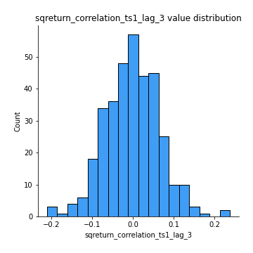
## Feature : sqreturn_correlation_ts2_lag_1
- **Feature type** : continous
- **Missing** : 0.0%
- **Unique** : 347
- **Count** :347.0
- **Mean** :0.0017582911794245609
- **Std** :0.07185229692276089
- **Min** :-0.17665751184419612
- **25%th Percentile** : -0.04929235981756618
- **50%th Percentile** : 0.0013326889407501727
- **75%th Percentile** : 0.04514270602981511
- **Max** :0.3425036902091001

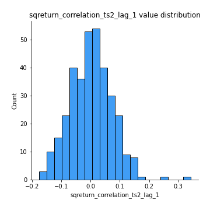
## Feature : sqreturn_correlation_ts2_lag_2
- **Feature type** : continous
- **Missing** : 0.0%
- **Unique** : 347
- **Count** :347.0
- **Mean** :-0.0031938001654350907
- **Std** :0.06681720044379973
- **Min** :-0.2757460186107768
- **25%th Percentile** : -0.042548454275758596
- **50%th Percentile** : -0.0007572819676472723
- **75%th Percentile** : 0.03746378553869635
- **Max** :0.19791834476425582

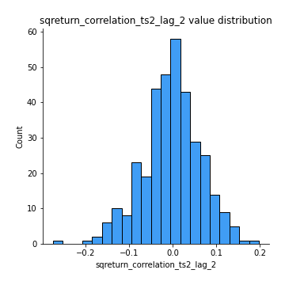
## Feature : sqreturn_correlation_ts2_lag_3
- **Feature type** : continous
- **Missing** : 0.0%
- **Unique** : 347
- **Count** :347.0
- **Mean** :0.0023032987345981202
- **Std** :0.06363611931690832
- **Min** :-0.18732889576588613
- **25%th Percentile** : -0.043818909424608934
- **50%th Percentile** : 0.003064094438270722
- **75%th Percentile** : 0.044419595838921674
- **Max** :0.18227042221329348

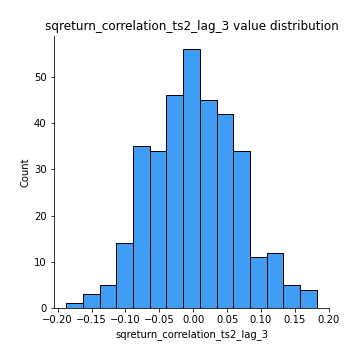
## Feature : price2_granger_cause_price1
- **Feature type** : continous
- **Missing** : 0.0%
- **Unique** : 347
- **Count** :347.0
- **Mean** :0.2903676518263942
- **Std** :0.29909749538632413
- **Min** :2.4312048970873696e-09
- **25%th Percentile** : 0.027979104233842023
- **50%th Percentile** : 0.17465155711707525
- **75%th Percentile** : 0.5038947558712086
- **Max** :0.9859184856191268

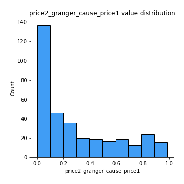
## Feature : price1_granger_cause_price2
- **Feature type** : continous
- **Missing** : 0.0%
- **Unique** : 347
- **Count** :347.0
- **Mean** :0.30081531199892025
- **Std** :0.2989585554632864
- **Min** :1.2012269232170316e-11
- **25%th Percentile** : 0.04189241061196948
- **50%th Percentile** : 0.18567774910480173
- **75%th Percentile** : 0.5287480133801625
- **Max** :0.9871292066441198

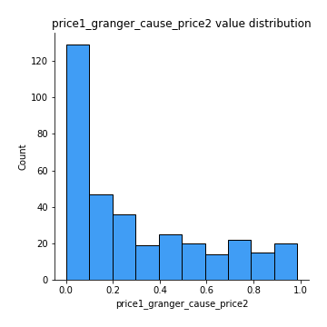

[<< Go back](../README.md)
