# Exploratory Data Analysis

[<< Go back](../README.md)
## Feature : target
- **Feature type** : categorical
- **Missing** : 0.0%
- **Unique** : 2
- **Count** :347
- **Unique** :2
- **Top** :real
- **Freq** :183

## Feature : return_mean1
- **Feature type** : continous
- **Missing** : 0.0%
- **Unique** : 347
- **Count** :347.0
- **Mean** :-0.0026719100344359146
- **Std** :0.11707126537507724
- **Min** :-0.297638839829253
- **25%th Percentile** : -0.0920090822156859
- **50%th Percentile** : -0.007200725963905086
- **75%th Percentile** : 0.08428024916728855
- **Max** :0.3602793017097547

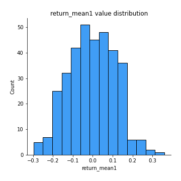
## Feature : return_mean2
- **Feature type** : continous
- **Missing** : 0.0%
- **Unique** : 347
- **Count** :347.0
- **Mean** :0.005778988499418142
- **Std** :0.112645483657182
- **Min** :-0.3393917268522109
- **25%th Percentile** : -0.0642396704236825
- **50%th Percentile** : 0.00821836488310345
- **75%th Percentile** : 0.07805527716728024
- **Max** :0.6801605239983173

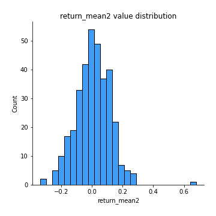
## Feature : return_sd1
- **Feature type** : continous
- **Missing** : 0.0%
- **Unique** : 347
- **Count** :347.0
- **Mean** :1.583778388178878
- **Std** :0.36586943551277534
- **Min** :0.8733078831717243
- **25%th Percentile** : 1.4235049241845394
- **50%th Percentile** : 1.5236227143416596
- **75%th Percentile** : 1.6239364552035958
- **Max** :3.332494027875222

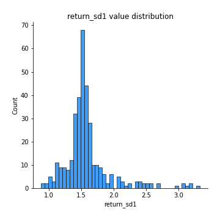
## Feature : return_sd2
- **Feature type** : continous
- **Missing** : 0.0%
- **Unique** : 347
- **Count** :347.0
- **Mean** :1.6497717138976482
- **Std** :0.43362253629990943
- **Min** :0.8198779632289204
- **25%th Percentile** : 1.4719241567072703
- **50%th Percentile** : 1.5809522092830972
- **75%th Percentile** : 1.6740911670382754
- **Max** :4.59233049161685

## Feature : return_skew1
- **Feature type** : continous
- **Missing** : 0.0%
- **Unique** : 347
- **Count** :347.0
- **Mean** :-0.1194122716632329
- **Std** :0.5743241724875147
- **Min** :-2.5068500114696386
- **25%th Percentile** : -0.33567036117486626
- **50%th Percentile** : -0.05930404675548301
- **75%th Percentile** : 0.08926807375117846
- **Max** :2.351757728252051

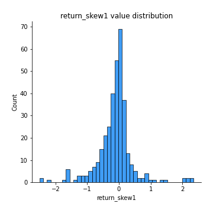
## Feature : return_skew2
- **Feature type** : continous
- **Missing** : 0.0%
- **Unique** : 347
- **Count** :347.0
- **Mean** :-0.27185784113993333
- **Std** :1.029010459699449
- **Min** :-7.3762354994385335
- **25%th Percentile** : -0.4036589517364608
- **50%th Percentile** : -0.06193058906954638
- **75%th Percentile** : 0.08389916428051705
- **Max** :4.1920266082732045

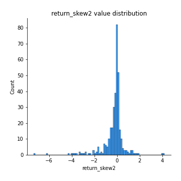
## Feature : return_kurtosis1
- **Feature type** : continous
- **Missing** : 0.0%
- **Unique** : 347
- **Count** :347.0
- **Mean** :2.2889577466587996
- **Std** :4.063171702068957
- **Min** :-0.7323414806427455
- **25%th Percentile** : -0.013318752515980137
- **50%th Percentile** : 0.763577211319721
- **75%th Percentile** : 2.624353558208778
- **Max** :23.612665658846073

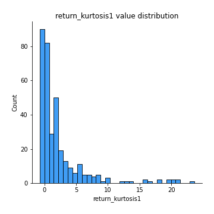
## Feature : return_kurtosis2
- **Feature type** : continous
- **Missing** : 0.0%
- **Unique** : 347
- **Count** :347.0
- **Mean** :4.225900322963489
- **Std** :9.432486438929136
- **Min** :-0.7347401676356213
- **25%th Percentile** : -0.012290319417222362
- **50%th Percentile** : 0.7849675634790474
- **75%th Percentile** : 3.6557789302663313
- **Max** :94.01659180149953

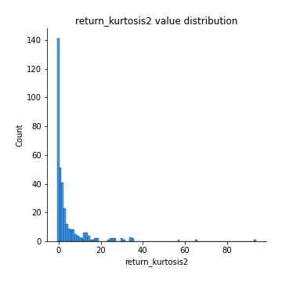
## Feature : return_autocorrelation_1_lag1
- **Feature type** : continous
- **Missing** : 0.0%
- **Unique** : 347
- **Count** :347.0
- **Mean** :-0.011565415080710106
- **Std** :0.06548620035750756
- **Min** :-0.2110198016529991
- **25%th Percentile** : -0.054454584210391496
- **50%th Percentile** : -0.013517717114003593
- **75%th Percentile** : 0.03147594199283566
- **Max** :0.20132571463207988

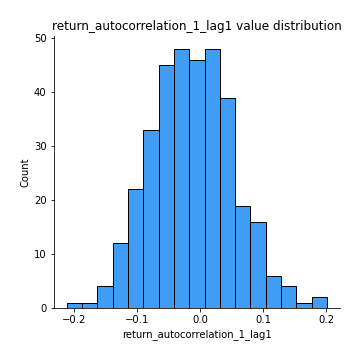
## Feature : return_autocorrelation_1_lag2
- **Feature type** : continous
- **Missing** : 0.0%
- **Unique** : 347
- **Count** :347.0
- **Mean** :-0.00901022654820771
- **Std** :0.0655678754748282
- **Min** :-0.20479723732905455
- **25%th Percentile** : -0.048893030668481316
- **50%th Percentile** : -0.005030045198343939
- **75%th Percentile** : 0.03321444725291843
- **Max** :0.21123611097039302

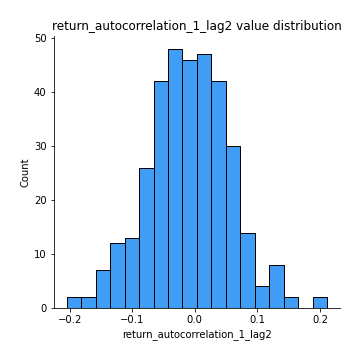
## Feature : return_autocorrelation_1_lag3
- **Feature type** : continous
- **Missing** : 0.0%
- **Unique** : 347
- **Count** :347.0
- **Mean** :0.002570802869788301
- **Std** :0.06316441198930138
- **Min** :-0.1873367417424894
- **25%th Percentile** : -0.04347640947993166
- **50%th Percentile** : 0.007014452188009024
- **75%th Percentile** : 0.04428935874141112
- **Max** :0.17514033413395239

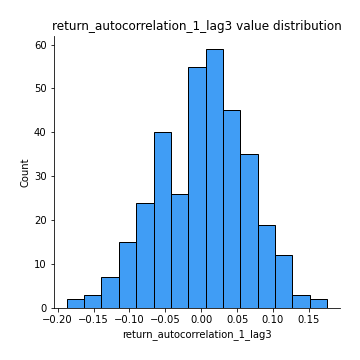
## Feature : return_autocorrelation_2_lag1
- **Feature type** : continous
- **Missing** : 0.0%
- **Unique** : 347
- **Count** :347.0
- **Mean** :-0.002525551949192028
- **Std** :0.06612242718916228
- **Min** :-0.17778763204400128
- **25%th Percentile** : -0.04783622782277279
- **50%th Percentile** : -0.0034554349547440506
- **75%th Percentile** : 0.04561245387946373
- **Max** :0.1878720776114348

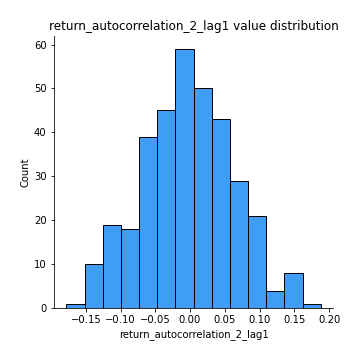
## Feature : return_autocorrelation_2_lag2
- **Feature type** : continous
- **Missing** : 0.0%
- **Unique** : 347
- **Count** :347.0
- **Mean** :-0.00809900516073084
- **Std** :0.06676511862922711
- **Min** :-0.20514419541213463
- **25%th Percentile** : -0.04910835496054104
- **50%th Percentile** : -0.004477293698304606
- **75%th Percentile** : 0.033595188517874935
- **Max** :0.19766404533977672

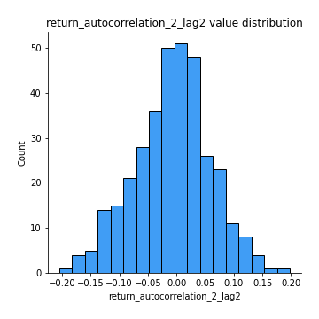
## Feature : return_autocorrelation_2_lag3
- **Feature type** : continous
- **Missing** : 0.0%
- **Unique** : 347
- **Count** :347.0
- **Mean** :0.0013671284561164554
- **Std** :0.06327951716259363
- **Min** :-0.18772406466387223
- **25%th Percentile** : -0.04139039892224436
- **50%th Percentile** : 0.0035596531022140075
- **75%th Percentile** : 0.04149035116394634
- **Max** :0.20205753622966244

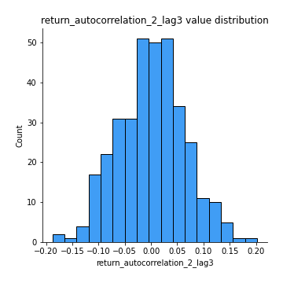
## Feature : return_correlation_ts1_lag_0
- **Feature type** : continous
- **Missing** : 0.0%
- **Unique** : 347
- **Count** :347.0
- **Mean** :0.6467711910115779
- **Std** :0.3578618848423349
- **Min** :-0.10256711281206837
- **25%th Percentile** : 0.3381206377935342
- **50%th Percentile** : 0.5977353242009235
- **75%th Percentile** : 0.9999753026620144
- **Max** :0.9999829084328484

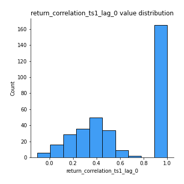
## Feature : return_correlation_ts1_lag_1
- **Feature type** : continous
- **Missing** : 0.0%
- **Unique** : 347
- **Count** :347.0
- **Mean** :-0.0049883835550998965
- **Std** :0.06090862865753487
- **Min** :-0.15425283552105754
- **25%th Percentile** : -0.04761564699146231
- **50%th Percentile** : -0.0019102945332290168
- **75%th Percentile** : 0.03567427904515939
- **Max** :0.18798954946242483

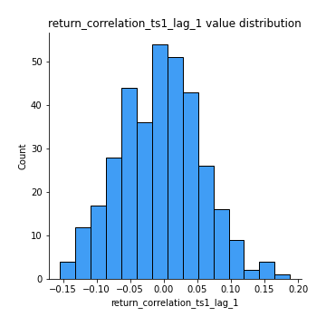
## Feature : return_correlation_ts1_lag_2
- **Feature type** : continous
- **Missing** : 0.0%
- **Unique** : 347
- **Count** :347.0
- **Mean** :-0.0052571030364710536
- **Std** :0.06607359077658574
- **Min** :-0.20511771243059113
- **25%th Percentile** : -0.046717852842787705
- **50%th Percentile** : -0.006909697032052656
- **75%th Percentile** : 0.037750814304913824
- **Max** :0.19755148338115205

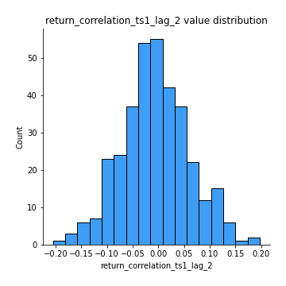
## Feature : return_correlation_ts1_lag_3
- **Feature type** : continous
- **Missing** : 0.0%
- **Unique** : 347
- **Count** :347.0
- **Mean** :-0.0003858344240035143
- **Std** :0.06805845419299208
- **Min** :-0.21147540839842804
- **25%th Percentile** : -0.04486397189381236
- **50%th Percentile** : -0.0002007087054394625
- **75%th Percentile** : 0.04540028323560877
- **Max** :0.23808054096877584

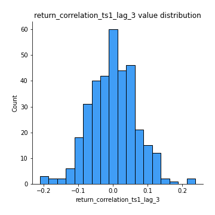
## Feature : return_correlation_ts2_lag_1
- **Feature type** : continous
- **Missing** : 0.0%
- **Unique** : 347
- **Count** :347.0
- **Mean** :0.0012669366423468718
- **Std** :0.06574727979296374
- **Min** :-0.17665751184419612
- **25%th Percentile** : -0.04508121056918727
- **50%th Percentile** : 0.0013326889407501727
- **75%th Percentile** : 0.04443443386310146
- **Max** :0.18861946003339844

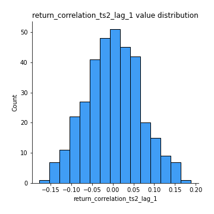
## Feature : return_correlation_ts2_lag_2
- **Feature type** : continous
- **Missing** : 0.0%
- **Unique** : 347
- **Count** :347.0
- **Mean** :-0.006984781049901575
- **Std** :0.06601779606813503
- **Min** :-0.2757460186107768
- **25%th Percentile** : -0.04528213354957002
- **50%th Percentile** : -0.004323576611403751
- **75%th Percentile** : 0.030703921850122422
- **Max** :0.19791834476425582

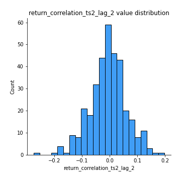
## Feature : return_correlation_ts2_lag_3
- **Feature type** : continous
- **Missing** : 0.0%
- **Unique** : 347
- **Count** :347.0
- **Mean** :0.0038217196787800945
- **Std** :0.06547082424061018
- **Min** :-0.18732889576588613
- **25%th Percentile** : -0.04275527046496651
- **50%th Percentile** : 0.00453512749628552
- **75%th Percentile** : 0.04738067791111353
- **Max** :0.18227042221329348

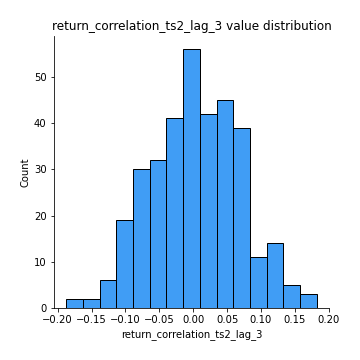
## Feature : sqreturn_autocorrelation_ts1_lag1
- **Feature type** : continous
- **Missing** : 0.0%
- **Unique** : 347
- **Count** :347.0
- **Mean** :0.03704812625246234
- **Std** :0.08619391518036862
- **Min** :-0.15354039790799814
- **25%th Percentile** : -0.021293895499087348
- **50%th Percentile** : 0.017846705355337167
- **75%th Percentile** : 0.08321696912150214
- **Max** :0.4170324090514868

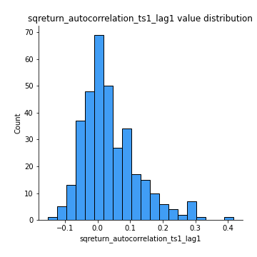
## Feature : sqreturn_autocorrelation_ts1_lag2
- **Feature type** : continous
- **Missing** : 0.0%
- **Unique** : 347
- **Count** :347.0
- **Mean** :0.019111953675619082
- **Std** :0.07381366874437259
- **Min** :-0.16994683327867027
- **25%th Percentile** : -0.028411287232882075
- **50%th Percentile** : 0.00721207236997169
- **75%th Percentile** : 0.058728678259682254
- **Max** :0.32836952056190194

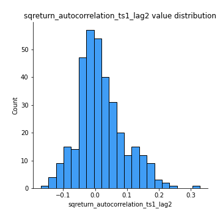
## Feature : sqreturn_autocorrelation_ts1_lag3
- **Feature type** : continous
- **Missing** : 0.0%
- **Unique** : 347
- **Count** :347.0
- **Mean** :0.009924950494439113
- **Std** :0.06417320276000908
- **Min** :-0.16457226826309557
- **25%th Percentile** : -0.028370035434746393
- **50%th Percentile** : 0.003852310644456078
- **75%th Percentile** : 0.04273440305605595
- **Max** :0.23856108238097126

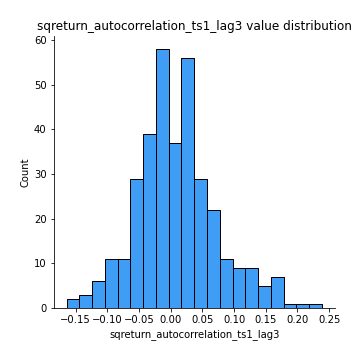
## Feature : sqreturn_autocorrelation_ts2_lag1
- **Feature type** : continous
- **Missing** : 0.0%
- **Unique** : 347
- **Count** :347.0
- **Mean** :0.025270941711955756
- **Std** :0.07170075510957338
- **Min** :-0.15779438361654874
- **25%th Percentile** : -0.021089356393123572
- **50%th Percentile** : 0.016082873810213526
- **75%th Percentile** : 0.05936113091248522
- **Max** :0.3459234668044924

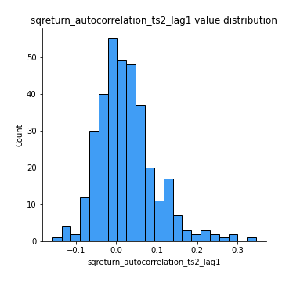
## Feature : sqreturn_autocorrelation_ts2_lag2
- **Feature type** : continous
- **Missing** : 0.0%
- **Unique** : 347
- **Count** :347.0
- **Mean** :0.010831750876462055
- **Std** :0.06524109815066992
- **Min** :-0.17062542072705444
- **25%th Percentile** : -0.024749082857471377
- **50%th Percentile** : 0.0023656530487693108
- **75%th Percentile** : 0.04397377764068178
- **Max** :0.25057436061622956

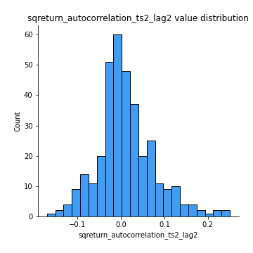
## Feature : sqreturn_autocorrelation_ts2_lag3
- **Feature type** : continous
- **Missing** : 0.0%
- **Unique** : 347
- **Count** :347.0
- **Mean** :0.004065665527129546
- **Std** :0.06389846922580339
- **Min** :-0.1664382323367616
- **25%th Percentile** : -0.03093926758386898
- **50%th Percentile** : -0.0069184563300645745
- **75%th Percentile** : 0.032752906030468015
- **Max** :0.3463122340368414

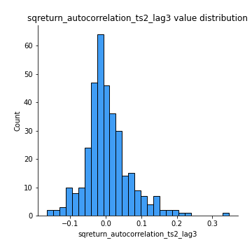
## Feature : sqreturn_correlation_ts1_lag_0
- **Feature type** : continous
- **Missing** : 0.0%
- **Unique** : 347
- **Count** :347.0
- **Mean** :0.6467711910115779
- **Std** :0.3578618848423349
- **Min** :-0.10256711281206837
- **25%th Percentile** : 0.3381206377935342
- **50%th Percentile** : 0.5977353242009235
- **75%th Percentile** : 0.9999753026620144
- **Max** :0.9999829084328484

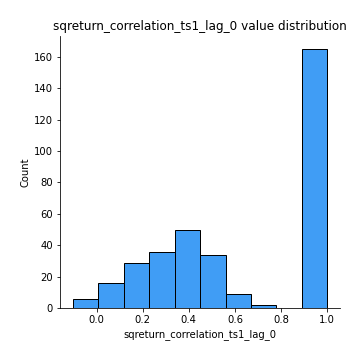
## Feature : sqreturn_correlation_ts1_lag_1
- **Feature type** : continous
- **Missing** : 0.0%
- **Unique** : 347
- **Count** :347.0
- **Mean** :-0.0049883835550998965
- **Std** :0.06090862865753487
- **Min** :-0.15425283552105754
- **25%th Percentile** : -0.04761564699146231
- **50%th Percentile** : -0.0019102945332290168
- **75%th Percentile** : 0.03567427904515939
- **Max** :0.18798954946242483

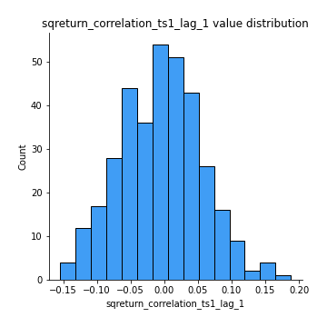
## Feature : sqreturn_correlation_ts1_lag_2
- **Feature type** : continous
- **Missing** : 0.0%
- **Unique** : 347
- **Count** :347.0
- **Mean** :-0.0052571030364710536
- **Std** :0.06607359077658574
- **Min** :-0.20511771243059113
- **25%th Percentile** : -0.046717852842787705
- **50%th Percentile** : -0.006909697032052656
- **75%th Percentile** : 0.037750814304913824
- **Max** :0.19755148338115205

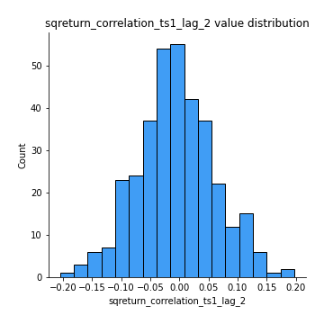
## Feature : sqreturn_correlation_ts1_lag_3
- **Feature type** : continous
- **Missing** : 0.0%
- **Unique** : 347
- **Count** :347.0
- **Mean** :-0.0003858344240035143
- **Std** :0.06805845419299208
- **Min** :-0.21147540839842804
- **25%th Percentile** : -0.04486397189381236
- **50%th Percentile** : -0.0002007087054394625
- **75%th Percentile** : 0.04540028323560877
- **Max** :0.23808054096877584

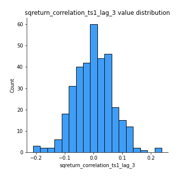
## Feature : sqreturn_correlation_ts2_lag_1
- **Feature type** : continous
- **Missing** : 0.0%
- **Unique** : 347
- **Count** :347.0
- **Mean** :0.0012669366423468718
- **Std** :0.06574727979296374
- **Min** :-0.17665751184419612
- **25%th Percentile** : -0.04508121056918727
- **50%th Percentile** : 0.0013326889407501727
- **75%th Percentile** : 0.04443443386310146
- **Max** :0.18861946003339844

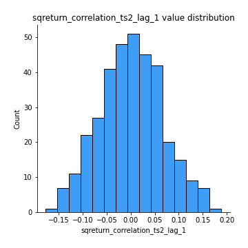
## Feature : sqreturn_correlation_ts2_lag_2
- **Feature type** : continous
- **Missing** : 0.0%
- **Unique** : 347
- **Count** :347.0
- **Mean** :-0.006984781049901575
- **Std** :0.06601779606813503
- **Min** :-0.2757460186107768
- **25%th Percentile** : -0.04528213354957002
- **50%th Percentile** : -0.004323576611403751
- **75%th Percentile** : 0.030703921850122422
- **Max** :0.19791834476425582

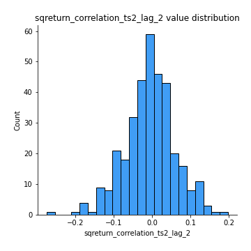
## Feature : sqreturn_correlation_ts2_lag_3
- **Feature type** : continous
- **Missing** : 0.0%
- **Unique** : 347
- **Count** :347.0
- **Mean** :0.0038217196787800945
- **Std** :0.06547082424061018
- **Min** :-0.18732889576588613
- **25%th Percentile** : -0.04275527046496651
- **50%th Percentile** : 0.00453512749628552
- **75%th Percentile** : 0.04738067791111353
- **Max** :0.18227042221329348

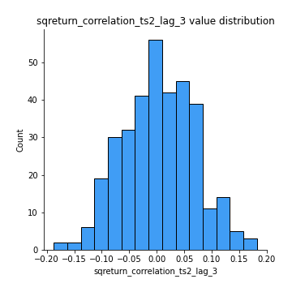
## Feature : price2_granger_cause_price1
- **Feature type** : continous
- **Missing** : 0.0%
- **Unique** : 347
- **Count** :347.0
- **Mean** :0.28679840811447244
- **Std** :0.288631398008967
- **Min** :1.2266670807684405e-05
- **25%th Percentile** : 0.040878006186002194
- **50%th Percentile** : 0.1776336247079174
- **75%th Percentile** : 0.4972947054185103
- **Max** :0.9898380228448623

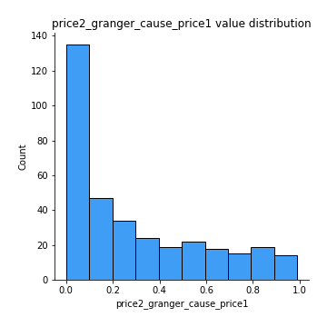
## Feature : price1_granger_cause_price2
- **Feature type** : continous
- **Missing** : 0.0%
- **Unique** : 347
- **Count** :347.0
- **Mean** :0.3044511072762653
- **Std** :0.2906452320294323
- **Min** :1.6490038554540114e-05
- **25%th Percentile** : 0.054415657277230016
- **50%th Percentile** : 0.21339232528017482
- **75%th Percentile** : 0.5426097719191489
- **Max** :0.9821657488259365

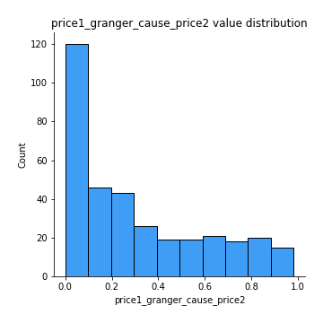

[<< Go back](../README.md)
