# Exploratory Data Analysis

[<< Go back](../README.md)
## Feature : target
- **Feature type** : categorical
- **Missing** : 0.0%
- **Unique** : 2
- **Count** :347
- **Unique** :2
- **Top** :simulated
- **Freq** :176

## Feature : return_mean1
- **Feature type** : continous
- **Missing** : 0.0%
- **Unique** : 347
- **Count** :347.0
- **Mean** :-0.010619696414974277
- **Std** :0.1116567602787973
- **Min** :-0.28753931497522306
- **25%th Percentile** : -0.09489808898886416
- **50%th Percentile** : -0.017642431798751003
- **75%th Percentile** : 0.06933739953311796
- **Max** :0.2862586627119317

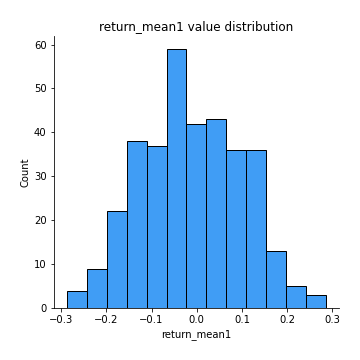
## Feature : return_mean2
- **Feature type** : continous
- **Missing** : 0.0%
- **Unique** : 347
- **Count** :347.0
- **Mean** :0.005686485847374219
- **Std** :0.11471788450564346
- **Min** :-0.3439835398279146
- **25%th Percentile** : -0.06620248600401976
- **50%th Percentile** : 0.006011698292049075
- **75%th Percentile** : 0.08193931043043055
- **Max** :0.6801605239983173

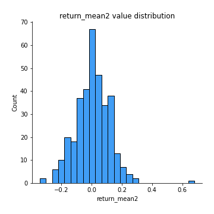
## Feature : return_sd1
- **Feature type** : continous
- **Missing** : 0.0%
- **Unique** : 347
- **Count** :347.0
- **Mean** :1.5900239667411689
- **Std** :0.35552077660044634
- **Min** :0.8102430347636637
- **25%th Percentile** : 1.4460471494420672
- **50%th Percentile** : 1.5389746686224803
- **75%th Percentile** : 1.641595184075772
- **Max** :3.181425034216533

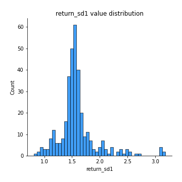
## Feature : return_sd2
- **Feature type** : continous
- **Missing** : 0.0%
- **Unique** : 347
- **Count** :347.0
- **Mean** :1.6352363749930503
- **Std** :0.38321412055281323
- **Min** :0.8198779632289204
- **25%th Percentile** : 1.4913656660339747
- **50%th Percentile** : 1.5900483988240444
- **75%th Percentile** : 1.6801365732046416
- **Max** :4.59233049161685

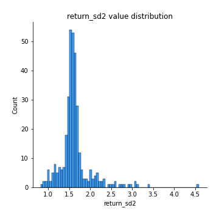
## Feature : return_skew1
- **Feature type** : continous
- **Missing** : 0.0%
- **Unique** : 347
- **Count** :347.0
- **Mean** :-0.18762983375945724
- **Std** :0.7021362948572393
- **Min** :-4.239645236578449
- **25%th Percentile** : -0.35109307106319926
- **50%th Percentile** : -0.0662906233785487
- **75%th Percentile** : 0.08793029867265427
- **Max** :2.351757728252051

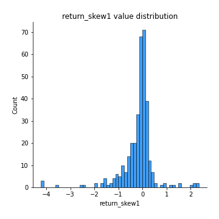
## Feature : return_skew2
- **Feature type** : continous
- **Missing** : 0.0%
- **Unique** : 347
- **Count** :347.0
- **Mean** :-0.22946641442738674
- **Std** :0.9785542490533554
- **Min** :-6.262899561987459
- **25%th Percentile** : -0.30524173870809257
- **50%th Percentile** : -0.06003385484798022
- **75%th Percentile** : 0.10424880216618729
- **Max** :4.1920266082732045

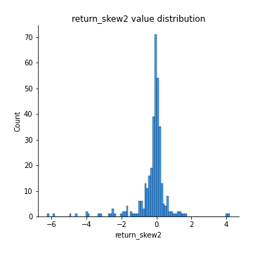
## Feature : return_kurtosis1
- **Feature type** : continous
- **Missing** : 0.0%
- **Unique** : 347
- **Count** :347.0
- **Mean** :2.5796434385312157
- **Std** :5.448907767411398
- **Min** :-0.6175255197199125
- **25%th Percentile** : -0.056727988334746904
- **50%th Percentile** : 0.51246952061115
- **75%th Percentile** : 2.6990337880253565
- **Max** :40.485294874464934

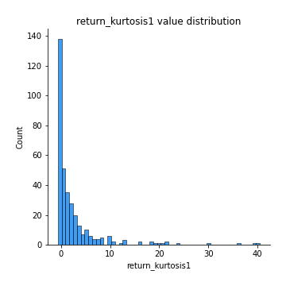
## Feature : return_kurtosis2
- **Feature type** : continous
- **Missing** : 0.0%
- **Unique** : 347
- **Count** :347.0
- **Mean** :3.730936435431161
- **Std** :8.299319949715663
- **Min** :-0.6152396184081272
- **25%th Percentile** : -0.05921080189740713
- **50%th Percentile** : 0.4886607352339216
- **75%th Percentile** : 3.3451525378866567
- **Max** :64.99818629655663

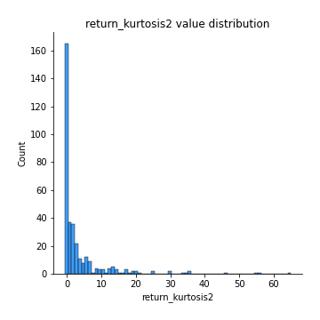
## Feature : return_autocorrelation_1_lag1
- **Feature type** : continous
- **Missing** : 0.0%
- **Unique** : 347
- **Count** :347.0
- **Mean** :-0.008200727560924874
- **Std** :0.06813881260676966
- **Min** :-0.2110198016529991
- **25%th Percentile** : -0.05355413448958281
- **50%th Percentile** : -0.011841111350130593
- **75%th Percentile** : 0.03533709001975134
- **Max** :0.20132571463207988

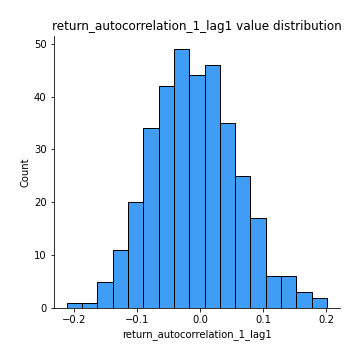
## Feature : return_autocorrelation_1_lag2
- **Feature type** : continous
- **Missing** : 0.0%
- **Unique** : 347
- **Count** :347.0
- **Mean** :-0.010754516516014577
- **Std** :0.06606466153321267
- **Min** :-0.20479723732905455
- **25%th Percentile** : -0.054012549691609346
- **50%th Percentile** : -0.008829316482854326
- **75%th Percentile** : 0.030140214310841563
- **Max** :0.21123611097039302

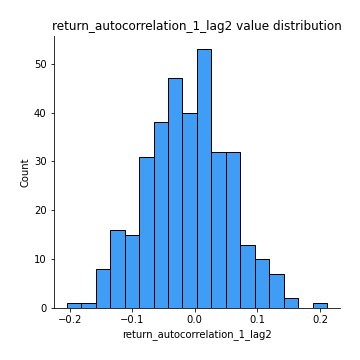
## Feature : return_autocorrelation_1_lag3
- **Feature type** : continous
- **Missing** : 0.0%
- **Unique** : 347
- **Count** :347.0
- **Mean** :0.003524317968516371
- **Std** :0.06637840216796283
- **Min** :-0.1873367417424894
- **25%th Percentile** : -0.04270099066334513
- **50%th Percentile** : 0.007537195386240881
- **75%th Percentile** : 0.046787727144143455
- **Max** :0.17514033413395239

## Feature : return_autocorrelation_2_lag1
- **Feature type** : continous
- **Missing** : 0.0%
- **Unique** : 347
- **Count** :347.0
- **Mean** :-0.005289269192740934
- **Std** :0.06999939779644054
- **Min** :-0.2364404317158175
- **25%th Percentile** : -0.05247408171081133
- **50%th Percentile** : -0.0066973084958584055
- **75%th Percentile** : 0.04156466424936381
- **Max** :0.2024676054184499

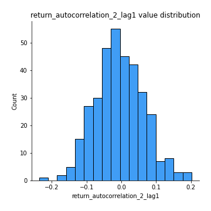
## Feature : return_autocorrelation_2_lag2
- **Feature type** : continous
- **Missing** : 0.0%
- **Unique** : 347
- **Count** :347.0
- **Mean** :-0.010656235822101396
- **Std** :0.06621837745519175
- **Min** :-0.20514419541213463
- **25%th Percentile** : -0.04918761191706863
- **50%th Percentile** : -0.008252594475215917
- **75%th Percentile** : 0.029199684154704742
- **Max** :0.1633768907277314

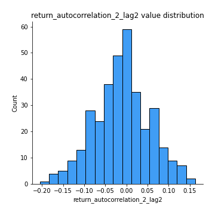
## Feature : return_autocorrelation_2_lag3
- **Feature type** : continous
- **Missing** : 0.0%
- **Unique** : 347
- **Count** :347.0
- **Mean** :0.0013360152577654267
- **Std** :0.06640166155084651
- **Min** :-0.18772406466387223
- **25%th Percentile** : -0.04132371447782862
- **50%th Percentile** : 0.005605845362568721
- **75%th Percentile** : 0.04306226760115947
- **Max** :0.20205753622966244

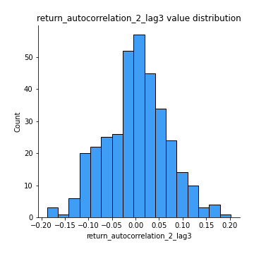
## Feature : return_correlation_ts1_lag_0
- **Feature type** : continous
- **Missing** : 0.0%
- **Unique** : 347
- **Count** :347.0
- **Mean** :0.6645656301044913
- **Std** :0.3637918538855991
- **Min** :-0.07366870340906873
- **25%th Percentile** : 0.3380361619663287
- **50%th Percentile** : 0.9999692706695009
- **75%th Percentile** : 0.9999762315083986
- **Max** :0.9999831829738215

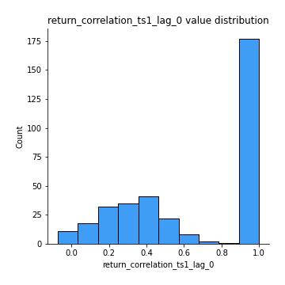
## Feature : return_correlation_ts1_lag_1
- **Feature type** : continous
- **Missing** : 0.0%
- **Unique** : 347
- **Count** :347.0
- **Mean** :-0.003808528473643579
- **Std** :0.0651591872291789
- **Min** :-0.18856827637524448
- **25%th Percentile** : -0.04917861203618129
- **50%th Percentile** : -0.0043741772213381665
- **75%th Percentile** : 0.0401234922796848
- **Max** :0.18798954946242483

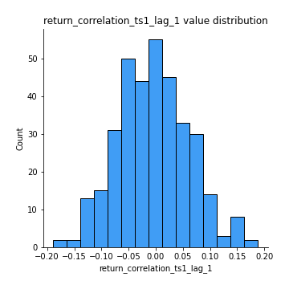
## Feature : return_correlation_ts1_lag_2
- **Feature type** : continous
- **Missing** : 0.0%
- **Unique** : 347
- **Count** :347.0
- **Mean** :-0.0062133296962007195
- **Std** :0.06441678838539709
- **Min** :-0.20511771243059113
- **25%th Percentile** : -0.0472887106495692
- **50%th Percentile** : -0.006909697032052656
- **75%th Percentile** : 0.03779193031928069
- **Max** :0.17974071501626168

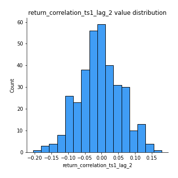
## Feature : return_correlation_ts1_lag_3
- **Feature type** : continous
- **Missing** : 0.0%
- **Unique** : 347
- **Count** :347.0
- **Mean** :-0.0006703105339688868
- **Std** :0.07195505250342119
- **Min** :-0.18772990024112698
- **25%th Percentile** : -0.04984736455730547
- **50%th Percentile** : 0.0022996223403096527
- **75%th Percentile** : 0.04682567343176164
- **Max** :0.23808054096877584

## Feature : return_correlation_ts2_lag_1
- **Feature type** : continous
- **Missing** : 0.0%
- **Unique** : 347
- **Count** :347.0
- **Mean** :0.0024067066211052573
- **Std** :0.06839771426760793
- **Min** :-0.17665751184419612
- **25%th Percentile** : -0.04334792070267991
- **50%th Percentile** : -0.00018382698856958546
- **75%th Percentile** : 0.043092050311333806
- **Max** :0.3425036902091001

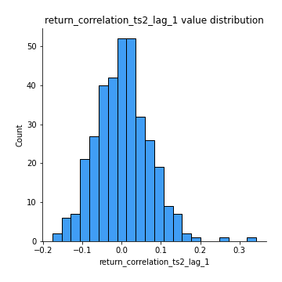
## Feature : return_correlation_ts2_lag_2
- **Feature type** : continous
- **Missing** : 0.0%
- **Unique** : 347
- **Count** :347.0
- **Mean** :-0.009392186562645287
- **Std** :0.06518305008435867
- **Min** :-0.2048246609485217
- **25%th Percentile** : -0.04904508971723094
- **50%th Percentile** : -0.007794039736179346
- **75%th Percentile** : 0.030539924116851497
- **Max** :0.1668209648754713

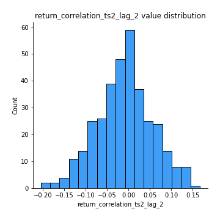
## Feature : return_correlation_ts2_lag_3
- **Feature type** : continous
- **Missing** : 0.0%
- **Unique** : 347
- **Count** :347.0
- **Mean** :0.00432383295335219
- **Std** :0.06790544152881026
- **Min** :-0.18732889576588613
- **25%th Percentile** : -0.04098900715520335
- **50%th Percentile** : 0.0055760617304495014
- **75%th Percentile** : 0.051096274162558616
- **Max** :0.18227042221329348

## Feature : sqreturn_autocorrelation_ts1_lag1
- **Feature type** : continous
- **Missing** : 0.0%
- **Unique** : 347
- **Count** :347.0
- **Mean** :0.030387782161932463
- **Std** :0.08247069308958087
- **Min** :-0.15354039790799814
- **25%th Percentile** : -0.023610097796374775
- **50%th Percentile** : 0.015295358787679177
- **75%th Percentile** : 0.06663003614769236
- **Max** :0.4170324090514868

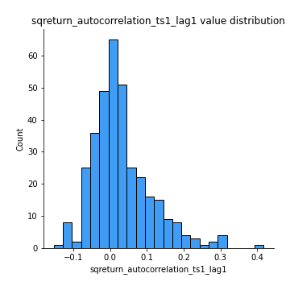
## Feature : sqreturn_autocorrelation_ts1_lag2
- **Feature type** : continous
- **Missing** : 0.0%
- **Unique** : 347
- **Count** :347.0
- **Mean** :0.015479887370765544
- **Std** :0.07189945051479173
- **Min** :-0.16994683327867027
- **25%th Percentile** : -0.030648970941655647
- **50%th Percentile** : 0.006870107053371838
- **75%th Percentile** : 0.05222808395564407
- **Max** :0.29415594530501293

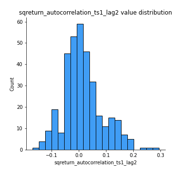
## Feature : sqreturn_autocorrelation_ts1_lag3
- **Feature type** : continous
- **Missing** : 0.0%
- **Unique** : 347
- **Count** :347.0
- **Mean** :0.00964226707208086
- **Std** :0.05902337984311417
- **Min** :-0.16457226826309557
- **25%th Percentile** : -0.02419220450858499
- **50%th Percentile** : 0.005104862050562074
- **75%th Percentile** : 0.04369982701014734
- **Max** :0.21054164854472524

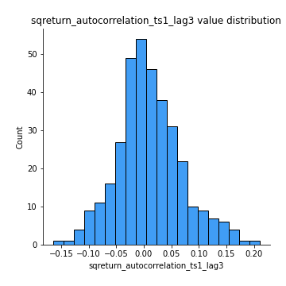
## Feature : sqreturn_autocorrelation_ts2_lag1
- **Feature type** : continous
- **Missing** : 0.0%
- **Unique** : 347
- **Count** :347.0
- **Mean** :0.025521719398531824
- **Std** :0.07822643355055352
- **Min** :-0.15779438361654874
- **25%th Percentile** : -0.02127431661024722
- **50%th Percentile** : 0.012704134392423416
- **75%th Percentile** : 0.057574945729209154
- **Max** :0.36991568023038357

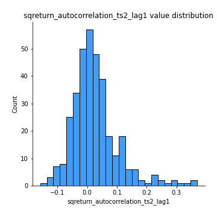
## Feature : sqreturn_autocorrelation_ts2_lag2
- **Feature type** : continous
- **Missing** : 0.0%
- **Unique** : 347
- **Count** :347.0
- **Mean** :0.008163207269534367
- **Std** :0.06379941951189955
- **Min** :-0.17062542072705444
- **25%th Percentile** : -0.029201814015770926
- **50%th Percentile** : 0.0007808161660004825
- **75%th Percentile** : 0.038212428666699105
- **Max** :0.28672056150180414

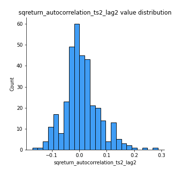
## Feature : sqreturn_autocorrelation_ts2_lag3
- **Feature type** : continous
- **Missing** : 0.0%
- **Unique** : 347
- **Count** :347.0
- **Mean** :0.006424834959630955
- **Std** :0.06352000901486189
- **Min** :-0.1664382323367616
- **25%th Percentile** : -0.03031380238103059
- **50%th Percentile** : -0.003410700351538883
- **75%th Percentile** : 0.0357547503105307
- **Max** :0.3463122340368414

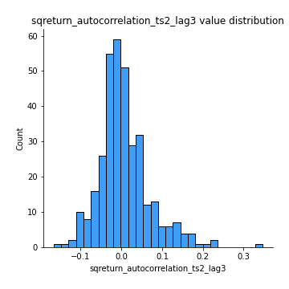
## Feature : sqreturn_correlation_ts1_lag_0
- **Feature type** : continous
- **Missing** : 0.0%
- **Unique** : 347
- **Count** :347.0
- **Mean** :0.6645656301044913
- **Std** :0.3637918538855991
- **Min** :-0.07366870340906873
- **25%th Percentile** : 0.3380361619663287
- **50%th Percentile** : 0.9999692706695009
- **75%th Percentile** : 0.9999762315083986
- **Max** :0.9999831829738215

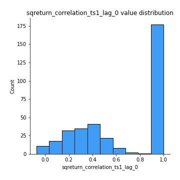
## Feature : sqreturn_correlation_ts1_lag_1
- **Feature type** : continous
- **Missing** : 0.0%
- **Unique** : 347
- **Count** :347.0
- **Mean** :-0.003808528473643579
- **Std** :0.0651591872291789
- **Min** :-0.18856827637524448
- **25%th Percentile** : -0.04917861203618129
- **50%th Percentile** : -0.0043741772213381665
- **75%th Percentile** : 0.0401234922796848
- **Max** :0.18798954946242483

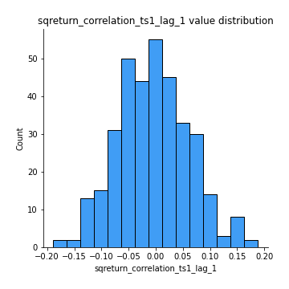
## Feature : sqreturn_correlation_ts1_lag_2
- **Feature type** : continous
- **Missing** : 0.0%
- **Unique** : 347
- **Count** :347.0
- **Mean** :-0.0062133296962007195
- **Std** :0.06441678838539709
- **Min** :-0.20511771243059113
- **25%th Percentile** : -0.0472887106495692
- **50%th Percentile** : -0.006909697032052656
- **75%th Percentile** : 0.03779193031928069
- **Max** :0.17974071501626168

## Feature : sqreturn_correlation_ts1_lag_3
- **Feature type** : continous
- **Missing** : 0.0%
- **Unique** : 347
- **Count** :347.0
- **Mean** :-0.0006703105339688868
- **Std** :0.07195505250342119
- **Min** :-0.18772990024112698
- **25%th Percentile** : -0.04984736455730547
- **50%th Percentile** : 0.0022996223403096527
- **75%th Percentile** : 0.04682567343176164
- **Max** :0.23808054096877584

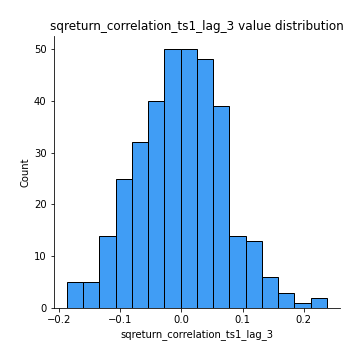
## Feature : sqreturn_correlation_ts2_lag_1
- **Feature type** : continous
- **Missing** : 0.0%
- **Unique** : 347
- **Count** :347.0
- **Mean** :0.0024067066211052573
- **Std** :0.06839771426760793
- **Min** :-0.17665751184419612
- **25%th Percentile** : -0.04334792070267991
- **50%th Percentile** : -0.00018382698856958546
- **75%th Percentile** : 0.043092050311333806
- **Max** :0.3425036902091001

## Feature : sqreturn_correlation_ts2_lag_2
- **Feature type** : continous
- **Missing** : 0.0%
- **Unique** : 347
- **Count** :347.0
- **Mean** :-0.009392186562645287
- **Std** :0.06518305008435867
- **Min** :-0.2048246609485217
- **25%th Percentile** : -0.04904508971723094
- **50%th Percentile** : -0.007794039736179346
- **75%th Percentile** : 0.030539924116851497
- **Max** :0.1668209648754713

## Feature : sqreturn_correlation_ts2_lag_3
- **Feature type** : continous
- **Missing** : 0.0%
- **Unique** : 347
- **Count** :347.0
- **Mean** :0.00432383295335219
- **Std** :0.06790544152881026
- **Min** :-0.18732889576588613
- **25%th Percentile** : -0.04098900715520335
- **50%th Percentile** : 0.0055760617304495014
- **75%th Percentile** : 0.051096274162558616
- **Max** :0.18227042221329348

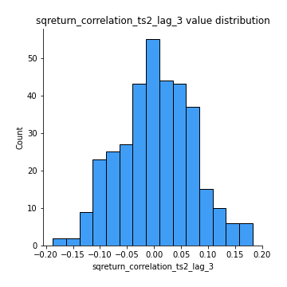
## Feature : price2_granger_cause_price1
- **Feature type** : continous
- **Missing** : 0.0%
- **Unique** : 347
- **Count** :347.0
- **Mean** :0.28578512384879984
- **Std** :0.2896829970044742
- **Min** :2.4312048970873696e-09
- **25%th Percentile** : 0.036807635641262465
- **50%th Percentile** : 0.1760247545280862
- **75%th Percentile** : 0.495736086675031
- **Max** :0.9898380228448623

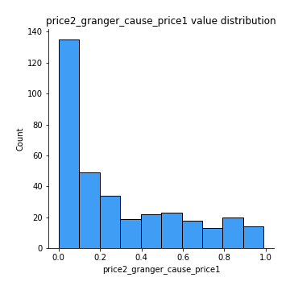
## Feature : price1_granger_cause_price2
- **Feature type** : continous
- **Missing** : 0.0%
- **Unique** : 347
- **Count** :347.0
- **Mean** :0.3001172085444571
- **Std** :0.2984024516484024
- **Min** :1.2012269232170316e-11
- **25%th Percentile** : 0.03861206252137614
- **50%th Percentile** : 0.18478421497674521
- **75%th Percentile** : 0.5486557320962134
- **Max** :0.9821657488259365

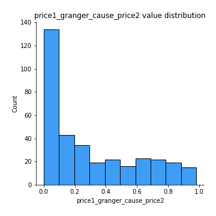

[<< Go back](../README.md)
