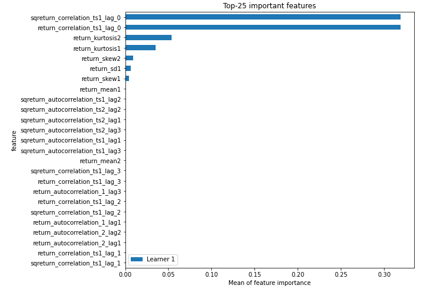
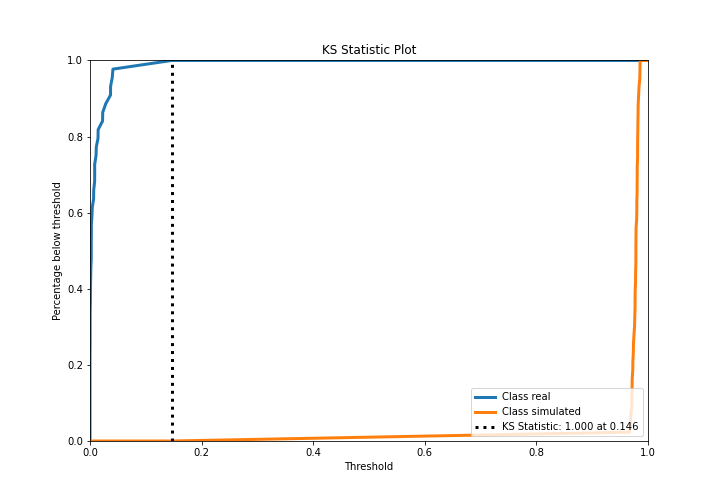
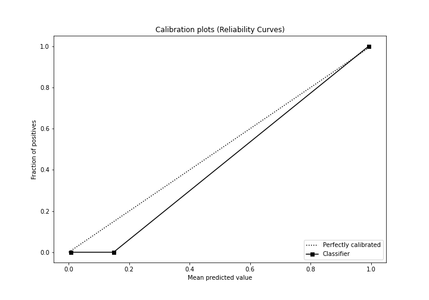
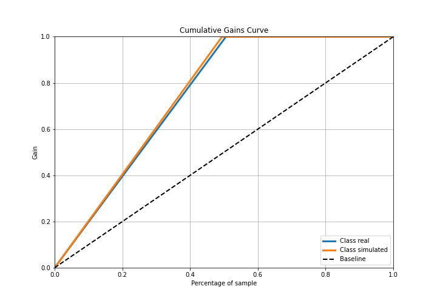
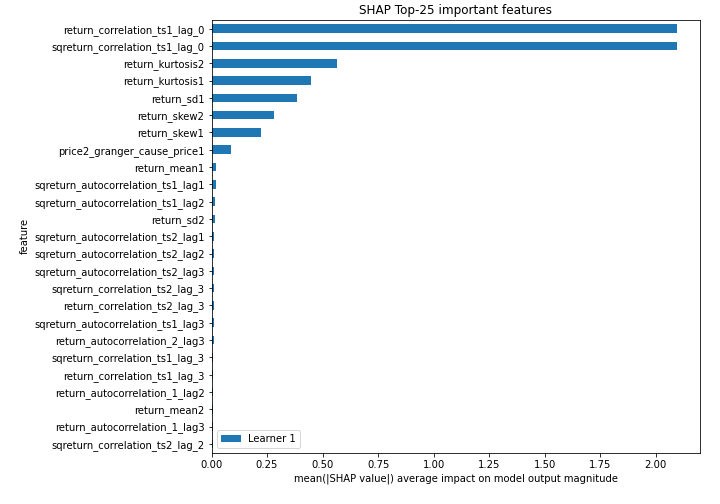
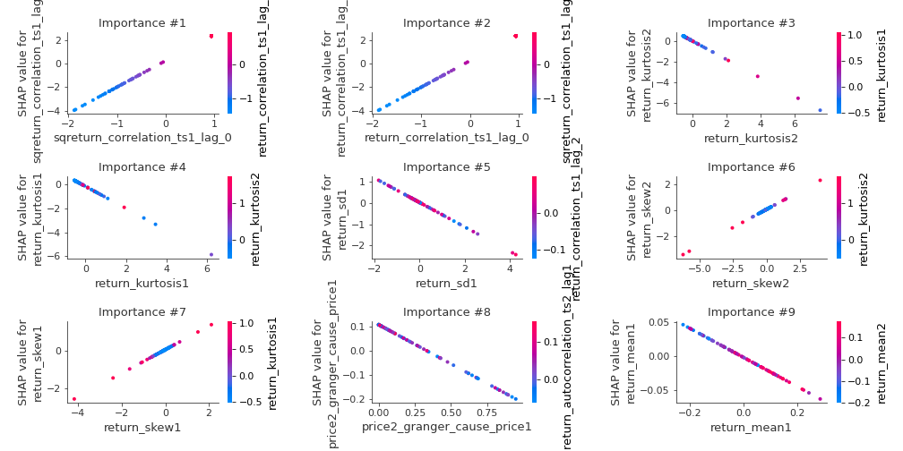
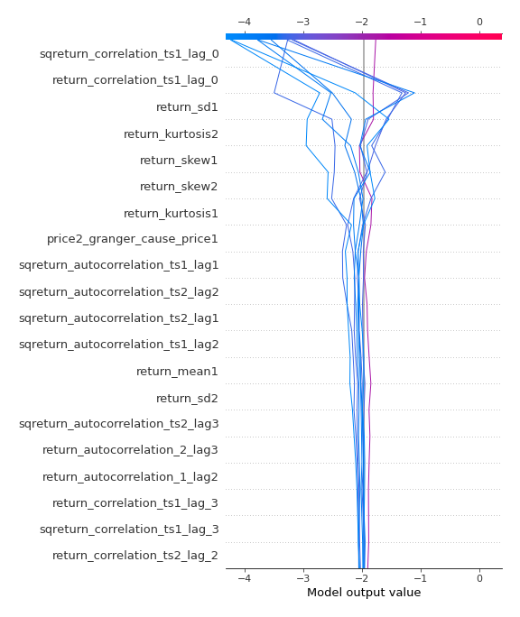
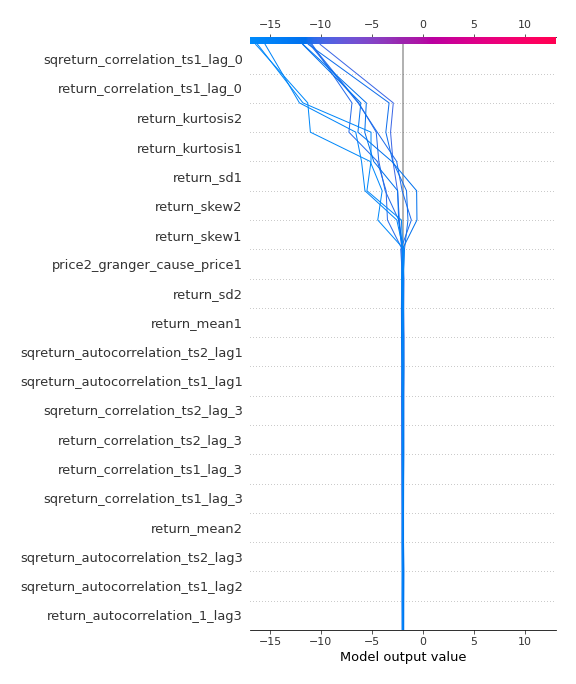
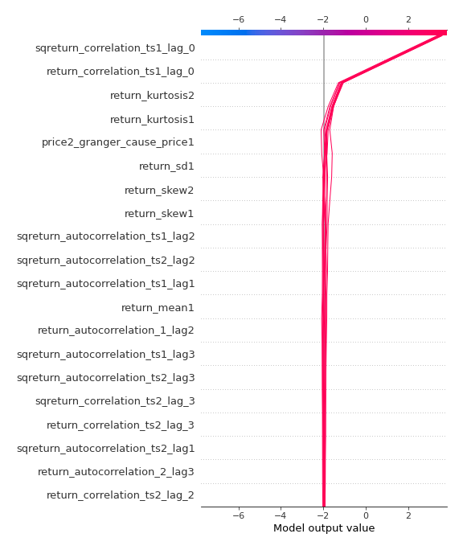
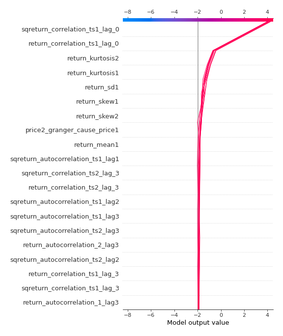

# Summary of 3_Linear

[<< Go back](../README.md)

## Logistic Regression (Linear)
- **n_jobs**: -1
- **explain_level**: 2

## Validation
 - **validation_type**: split
 - **train_ratio**: 0.75
 - **shuffle**: True
 - **stratify**: True

## Optimized metric
accuracy

## Training time

4.7 seconds

## Metric details
|           |     score |     threshold |
|:----------|----------:|--------------:|
| logloss   | 0.0168923 | nan           |
| auc       | 1         | nan           |
| f1        | 1         |   0.491712    |
| accuracy  | 1         |   0.491712    |
| precision | 1         |   0.491712    |
| recall    | 1         |   6.71766e-08 |
| mcc       | 1         |   0.491712    |

## Confusion matrix (at threshold=0.491712)
|                      |   Predicted as real |   Predicted as simulated |
|:---------------------|--------------------:|-------------------------:|
| Labeled as real      |                  44 |                        0 |
| Labeled as simulated |                   0 |                       43 |

## Learning curves

## Coefficients
| feature                           |   Learner_1 |
|:----------------------------------|------------:|
| sqreturn_correlation_ts1_lag_0    |  2.22656    |
| return_correlation_ts1_lag_0      |  2.22656    |
| return_skew1                      |  0.636297   |
| return_skew2                      |  0.554429   |
| return_autocorrelation_1_lag2     |  0.15614    |
| return_correlation_ts1_lag_2      |  0.116745   |
| sqreturn_correlation_ts1_lag_2    |  0.116745   |
| return_correlation_ts2_lag_2      |  0.115202   |
| sqreturn_correlation_ts2_lag_2    |  0.115202   |
| return_autocorrelation_2_lag2     |  0.0822086  |
| return_autocorrelation_1_lag1     |  0.0709781  |
| return_correlation_ts1_lag_1      |  0.0500784  |
| sqreturn_correlation_ts1_lag_1    |  0.0500784  |
| return_autocorrelation_2_lag1     |  0.016601   |
| sqreturn_correlation_ts2_lag_1    | -0.00494589 |
| return_correlation_ts2_lag_1      | -0.00494589 |
| price1_granger_cause_price2       | -0.0183982  |
| return_sd2                        | -0.0194378  |
| return_mean2                      | -0.076203   |
| return_autocorrelation_1_lag3     | -0.148835   |
| sqreturn_correlation_ts1_lag_3    | -0.160628   |
| return_correlation_ts1_lag_3      | -0.160628   |
| return_autocorrelation_2_lag3     | -0.177357   |
| return_correlation_ts2_lag_3      | -0.203108   |
| sqreturn_correlation_ts2_lag_3    | -0.203108   |
| return_mean1                      | -0.21334    |
| sqreturn_autocorrelation_ts1_lag3 | -0.216173   |
| sqreturn_autocorrelation_ts2_lag3 | -0.218246   |
| sqreturn_autocorrelation_ts2_lag1 | -0.236315   |
| sqreturn_autocorrelation_ts1_lag2 | -0.26657    |
| sqreturn_autocorrelation_ts2_lag2 | -0.267991   |
| sqreturn_autocorrelation_ts1_lag1 | -0.280855   |
| price2_granger_cause_price1       | -0.321444   |
| return_sd1                        | -0.578091   |
| return_kurtosis2                  | -0.895216   |
| return_kurtosis1                  | -0.919658   |
| intercept                         | -1.28136    |

## Permutation-based Importance

## Confusion Matrix

## Normalized Confusion Matrix

## ROC Curve

## Kolmogorov-Smirnov Statistic

## Precision-Recall Curve

## Calibration Curve

## Cumulative Gains Curve

## Lift Curve

## SHAP Importance

## SHAP Dependence plots

### Dependence (Fold 1)

## SHAP Decision plots

### Top-10 Worst decisions for class 0 (Fold 1)

### Top-10 Best decisions for class 0 (Fold 1)

### Top-10 Worst decisions for class 1 (Fold 1)

### Top-10 Best decisions for class 1 (Fold 1)

[<< Go back](../README.md)
