# Exploratory Data Analysis

[<< Go back](../README.md)
## Feature : target
- **Feature type** : categorical
- **Missing** : 0.0%
- **Unique** : 2
- **Count** :347
- **Unique** :2
- **Top** :real
- **Freq** :176

## Feature : return_mean1
- **Feature type** : continous
- **Missing** : 0.0%
- **Unique** : 347
- **Count** :347.0
- **Mean** :-0.007714047202964806
- **Std** :0.11627167515388268
- **Min** :-0.297638839829253
- **25%th Percentile** : -0.09489808898886416
- **50%th Percentile** : -0.013968078686425491
- **75%th Percentile** : 0.0784441396972197
- **Max** :0.3602793017097547

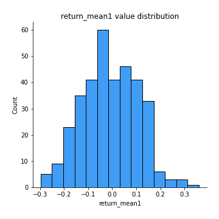
## Feature : return_mean2
- **Feature type** : continous
- **Missing** : 0.0%
- **Unique** : 347
- **Count** :347.0
- **Mean** :0.00928829932503266
- **Std** :0.11324457357906448
- **Min** :-0.3439835398279146
- **25%th Percentile** : -0.05755023407122657
- **50%th Percentile** : 0.00891411435239391
- **75%th Percentile** : 0.08692585022769592
- **Max** :0.6801605239983173

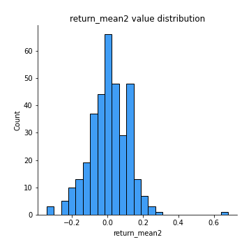
## Feature : return_sd1
- **Feature type** : continous
- **Missing** : 0.0%
- **Unique** : 347
- **Count** :347.0
- **Mean** :1.6000378110322333
- **Std** :0.37278039325949547
- **Min** :0.8733078831717243
- **25%th Percentile** : 1.4425023127761176
- **50%th Percentile** : 1.5310470955783204
- **75%th Percentile** : 1.650883055519205
- **Max** :3.332494027875222

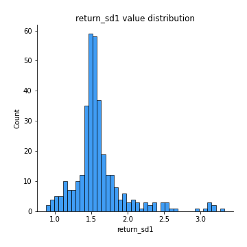
## Feature : return_sd2
- **Feature type** : continous
- **Missing** : 0.0%
- **Unique** : 347
- **Count** :347.0
- **Mean** :1.660816907047676
- **Std** :0.41786198153075627
- **Min** :0.8198779632289204
- **25%th Percentile** : 1.4836923118286198
- **50%th Percentile** : 1.5860882288018554
- **75%th Percentile** : 1.6857600499264012
- **Max** :4.59233049161685

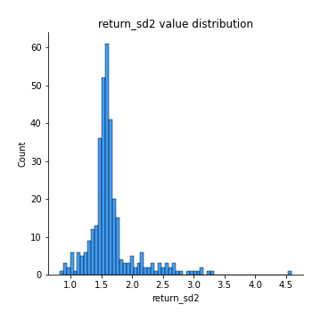
## Feature : return_skew1
- **Feature type** : continous
- **Missing** : 0.0%
- **Unique** : 347
- **Count** :347.0
- **Mean** :-0.1653055849445764
- **Std** :0.699553832300032
- **Min** :-4.239645236578449
- **25%th Percentile** : -0.3215648147306188
- **50%th Percentile** : -0.05930404675548301
- **75%th Percentile** : 0.08926807375117846
- **Max** :2.1285977762978217

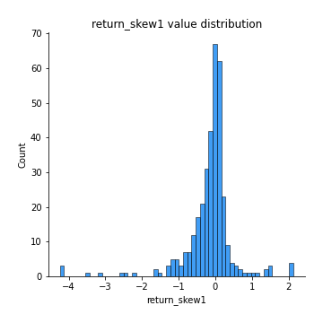
## Feature : return_skew2
- **Feature type** : continous
- **Missing** : 0.0%
- **Unique** : 347
- **Count** :347.0
- **Mean** :-0.23113381613257752
- **Std** :0.9653905472901454
- **Min** :-6.262899561987459
- **25%th Percentile** : -0.29998933191357013
- **50%th Percentile** : -0.04574536823420028
- **75%th Percentile** : 0.10236909817876522
- **Max** :4.0310261345618

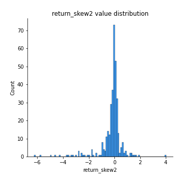
## Feature : return_kurtosis1
- **Feature type** : continous
- **Missing** : 0.0%
- **Unique** : 347
- **Count** :347.0
- **Mean** :2.44984284817538
- **Std** :5.347854549398357
- **Min** :-0.7323414806427455
- **25%th Percentile** : -0.06350937755909469
- **50%th Percentile** : 0.5282113916742617
- **75%th Percentile** : 2.678812472527533
- **Max** :40.485294874464934

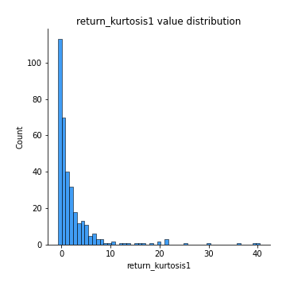
## Feature : return_kurtosis2
- **Feature type** : continous
- **Missing** : 0.0%
- **Unique** : 347
- **Count** :347.0
- **Mean** :3.849857154783867
- **Std** :8.721330849215589
- **Min** :-0.7347401676356213
- **25%th Percentile** : -0.08051280657875926
- **50%th Percentile** : 0.5044341681285913
- **75%th Percentile** : 3.188619372175843
- **Max** :64.99818629655663

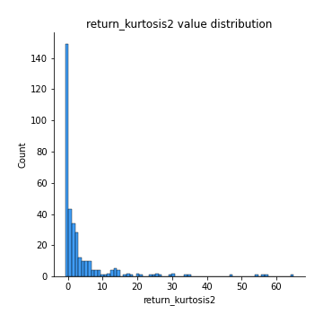
## Feature : return_autocorrelation_1_lag1
- **Feature type** : continous
- **Missing** : 0.0%
- **Unique** : 347
- **Count** :347.0
- **Mean** :-0.010695990686299357
- **Std** :0.06961769415803626
- **Min** :-0.2110198016529991
- **25%th Percentile** : -0.055095950117342
- **50%th Percentile** : -0.01229127680465286
- **75%th Percentile** : 0.033449894079238957
- **Max** :0.18006291956111042

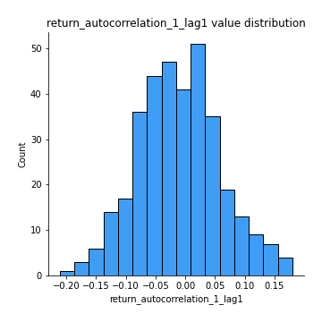
## Feature : return_autocorrelation_1_lag2
- **Feature type** : continous
- **Missing** : 0.0%
- **Unique** : 347
- **Count** :347.0
- **Mean** :-0.01079252892766934
- **Std** :0.06786252182985118
- **Min** :-0.20479723732905455
- **25%th Percentile** : -0.05436257204839317
- **50%th Percentile** : -0.008178606210563379
- **75%th Percentile** : 0.03367729871505851
- **Max** :0.21123611097039302

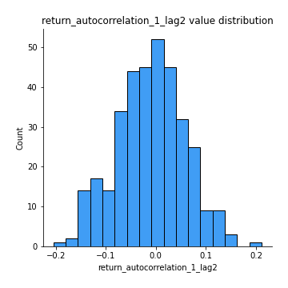
## Feature : return_autocorrelation_1_lag3
- **Feature type** : continous
- **Missing** : 0.0%
- **Unique** : 347
- **Count** :347.0
- **Mean** :0.0049371246749249234
- **Std** :0.06726396799620711
- **Min** :-0.1873367417424894
- **25%th Percentile** : -0.04270099066334513
- **50%th Percentile** : 0.010474788706038967
- **75%th Percentile** : 0.05082421701325021
- **Max** :0.17514033413395239

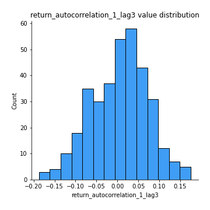
## Feature : return_autocorrelation_2_lag1
- **Feature type** : continous
- **Missing** : 0.0%
- **Unique** : 347
- **Count** :347.0
- **Mean** :-0.003000856392473123
- **Std** :0.069022629871453
- **Min** :-0.17778763204400128
- **25%th Percentile** : -0.050203009866764015
- **50%th Percentile** : -0.005441812264246266
- **75%th Percentile** : 0.044267030200298305
- **Max** :0.2024676054184499

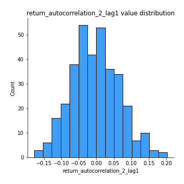
## Feature : return_autocorrelation_2_lag2
- **Feature type** : continous
- **Missing** : 0.0%
- **Unique** : 347
- **Count** :347.0
- **Mean** :-0.009504724152461112
- **Std** :0.06627383155312144
- **Min** :-0.20514419541213463
- **25%th Percentile** : -0.051962615376236844
- **50%th Percentile** : -0.007035520416743972
- **75%th Percentile** : 0.033154901594427036
- **Max** :0.1633768907277314

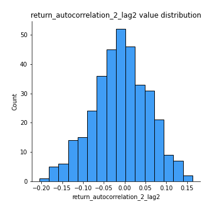
## Feature : return_autocorrelation_2_lag3
- **Feature type** : continous
- **Missing** : 0.0%
- **Unique** : 347
- **Count** :347.0
- **Mean** :0.0010277607932452492
- **Std** :0.06765618444857248
- **Min** :-0.18772406466387223
- **25%th Percentile** : -0.04600645840374196
- **50%th Percentile** : 0.005332877668148816
- **75%th Percentile** : 0.04704319922986894
- **Max** :0.17085022959000998

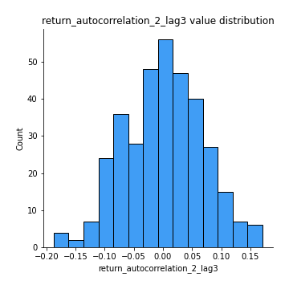
## Feature : return_correlation_ts1_lag_0
- **Feature type** : continous
- **Missing** : 0.0%
- **Unique** : 347
- **Count** :347.0
- **Mean** :0.6594379837611034
- **Std** :0.35887487381208394
- **Min** :-0.10256711281206837
- **25%th Percentile** : 0.3380361619663287
- **50%th Percentile** : 0.6745340168720974
- **75%th Percentile** : 0.9999761153905697
- **Max** :0.9999831829738215

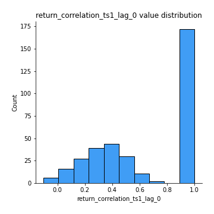
## Feature : return_correlation_ts1_lag_1
- **Feature type** : continous
- **Missing** : 0.0%
- **Unique** : 347
- **Count** :347.0
- **Mean** :-0.005378845080886084
- **Std** :0.0659899919659441
- **Min** :-0.18856827637524448
- **25%th Percentile** : -0.05013804629749736
- **50%th Percentile** : -0.004012589599074053
- **75%th Percentile** : 0.03592885807371499
- **Max** :0.17975593397150688

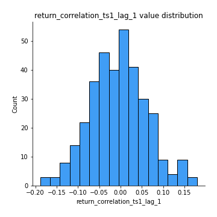
## Feature : return_correlation_ts1_lag_2
- **Feature type** : continous
- **Missing** : 0.0%
- **Unique** : 347
- **Count** :347.0
- **Mean** :-0.005527092057329406
- **Std** :0.06490358323166655
- **Min** :-0.20511771243059113
- **25%th Percentile** : -0.0474467944873804
- **50%th Percentile** : -0.0049164109339598335
- **75%th Percentile** : 0.03815970132727952
- **Max** :0.17974071501626168

## Feature : return_correlation_ts1_lag_3
- **Feature type** : continous
- **Missing** : 0.0%
- **Unique** : 347
- **Count** :347.0
- **Mean** :0.0013548418448453992
- **Std** :0.07257821258837757
- **Min** :-0.21147540839842804
- **25%th Percentile** : -0.04817757840898056
- **50%th Percentile** : 0.0008111258091437905
- **75%th Percentile** : 0.049941970949437656
- **Max** :0.23808054096877584

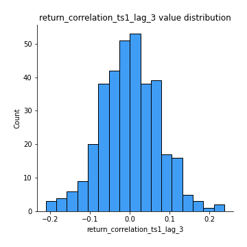
## Feature : return_correlation_ts2_lag_1
- **Feature type** : continous
- **Missing** : 0.0%
- **Unique** : 347
- **Count** :347.0
- **Mean** :0.0019400822670295123
- **Std** :0.07208306317054165
- **Min** :-0.17665751184419612
- **25%th Percentile** : -0.04991175761478954
- **50%th Percentile** : 0.001703204128990032
- **75%th Percentile** : 0.046863441009578115
- **Max** :0.3425036902091001

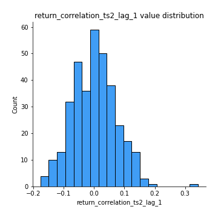
## Feature : return_correlation_ts2_lag_2
- **Feature type** : continous
- **Missing** : 0.0%
- **Unique** : 347
- **Count** :347.0
- **Mean** :-0.008957684283277693
- **Std** :0.06562935854217902
- **Min** :-0.2757460186107768
- **25%th Percentile** : -0.04727374972207214
- **50%th Percentile** : -0.0063072060080509185
- **75%th Percentile** : 0.03143114083933647
- **Max** :0.1668209648754713

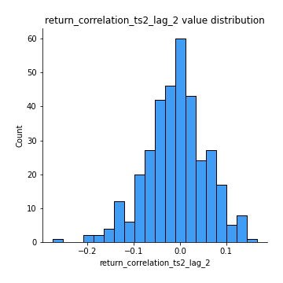
## Feature : return_correlation_ts2_lag_3
- **Feature type** : continous
- **Missing** : 0.0%
- **Unique** : 347
- **Count** :347.0
- **Mean** :0.004078188914270359
- **Std** :0.06946835214339418
- **Min** :-0.18732889576588613
- **25%th Percentile** : -0.04720716013536194
- **50%th Percentile** : 0.005652281595589168
- **75%th Percentile** : 0.051096274162558616
- **Max** :0.18227042221329348

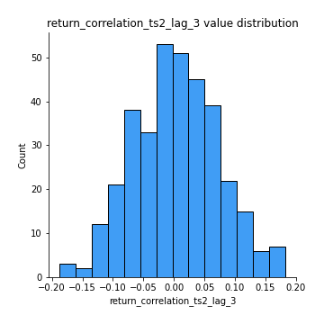
## Feature : sqreturn_autocorrelation_ts1_lag1
- **Feature type** : continous
- **Missing** : 0.0%
- **Unique** : 347
- **Count** :347.0
- **Mean** :0.030381359375431703
- **Std** :0.08410349350065494
- **Min** :-0.15354039790799814
- **25%th Percentile** : -0.025513940001685404
- **50%th Percentile** : 0.012096452866148322
- **75%th Percentile** : 0.06809016333302044
- **Max** :0.4170324090514868

## Feature : sqreturn_autocorrelation_ts1_lag2
- **Feature type** : continous
- **Missing** : 0.0%
- **Unique** : 347
- **Count** :347.0
- **Mean** :0.021284405061342434
- **Std** :0.07296858091583797
- **Min** :-0.16994683327867027
- **25%th Percentile** : -0.02669534667497392
- **50%th Percentile** : 0.012175282451121292
- **75%th Percentile** : 0.060015887237337404
- **Max** :0.32836952056190194

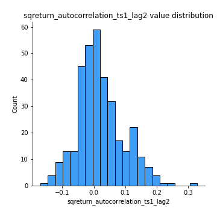
## Feature : sqreturn_autocorrelation_ts1_lag3
- **Feature type** : continous
- **Missing** : 0.0%
- **Unique** : 347
- **Count** :347.0
- **Mean** :0.00740424928186113
- **Std** :0.06301824928950264
- **Min** :-0.16457226826309557
- **25%th Percentile** : -0.03078214679754423
- **50%th Percentile** : 0.003852310644456078
- **75%th Percentile** : 0.04071717100925798
- **Max** :0.36579865351615615

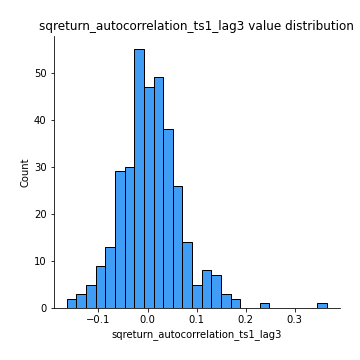
## Feature : sqreturn_autocorrelation_ts2_lag1
- **Feature type** : continous
- **Missing** : 0.0%
- **Unique** : 347
- **Count** :347.0
- **Mean** :0.025450980801186098
- **Std** :0.0752140814886598
- **Min** :-0.15779438361654874
- **25%th Percentile** : -0.023347121082248005
- **50%th Percentile** : 0.016082873810213526
- **75%th Percentile** : 0.05986940495861966
- **Max** :0.36991568023038357

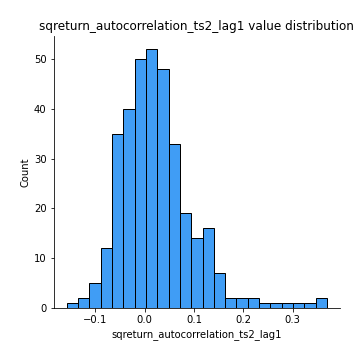
## Feature : sqreturn_autocorrelation_ts2_lag2
- **Feature type** : continous
- **Missing** : 0.0%
- **Unique** : 347
- **Count** :347.0
- **Mean** :0.01388918425160207
- **Std** :0.06607613163274008
- **Min** :-0.17062542072705444
- **25%th Percentile** : -0.02358179752327769
- **50%th Percentile** : 0.006486255582730269
- **75%th Percentile** : 0.04483948288042771
- **Max** :0.28672056150180414

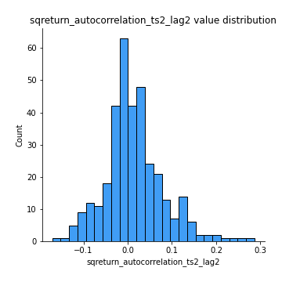
## Feature : sqreturn_autocorrelation_ts2_lag3
- **Feature type** : continous
- **Missing** : 0.0%
- **Unique** : 347
- **Count** :347.0
- **Mean** :0.0036993743593402026
- **Std** :0.06286582144513674
- **Min** :-0.1664382323367616
- **25%th Percentile** : -0.031116563213367192
- **50%th Percentile** : -0.004490227106886177
- **75%th Percentile** : 0.03587672291679224
- **Max** :0.3463122340368414

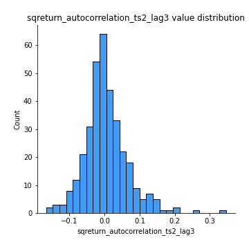
## Feature : sqreturn_correlation_ts1_lag_0
- **Feature type** : continous
- **Missing** : 0.0%
- **Unique** : 347
- **Count** :347.0
- **Mean** :0.6594379837611034
- **Std** :0.35887487381208394
- **Min** :-0.10256711281206837
- **25%th Percentile** : 0.3380361619663287
- **50%th Percentile** : 0.6745340168720974
- **75%th Percentile** : 0.9999761153905697
- **Max** :0.9999831829738215

## Feature : sqreturn_correlation_ts1_lag_1
- **Feature type** : continous
- **Missing** : 0.0%
- **Unique** : 347
- **Count** :347.0
- **Mean** :-0.005378845080886084
- **Std** :0.0659899919659441
- **Min** :-0.18856827637524448
- **25%th Percentile** : -0.05013804629749736
- **50%th Percentile** : -0.004012589599074053
- **75%th Percentile** : 0.03592885807371499
- **Max** :0.17975593397150688

## Feature : sqreturn_correlation_ts1_lag_2
- **Feature type** : continous
- **Missing** : 0.0%
- **Unique** : 347
- **Count** :347.0
- **Mean** :-0.005527092057329406
- **Std** :0.06490358323166655
- **Min** :-0.20511771243059113
- **25%th Percentile** : -0.0474467944873804
- **50%th Percentile** : -0.0049164109339598335
- **75%th Percentile** : 0.03815970132727952
- **Max** :0.17974071501626168

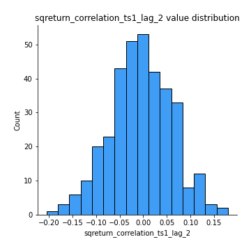
## Feature : sqreturn_correlation_ts1_lag_3
- **Feature type** : continous
- **Missing** : 0.0%
- **Unique** : 347
- **Count** :347.0
- **Mean** :0.0013548418448453992
- **Std** :0.07257821258837757
- **Min** :-0.21147540839842804
- **25%th Percentile** : -0.04817757840898056
- **50%th Percentile** : 0.0008111258091437905
- **75%th Percentile** : 0.049941970949437656
- **Max** :0.23808054096877584

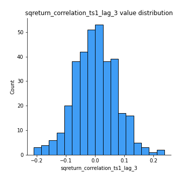
## Feature : sqreturn_correlation_ts2_lag_1
- **Feature type** : continous
- **Missing** : 0.0%
- **Unique** : 347
- **Count** :347.0
- **Mean** :0.0019400822670295123
- **Std** :0.07208306317054165
- **Min** :-0.17665751184419612
- **25%th Percentile** : -0.04991175761478954
- **50%th Percentile** : 0.001703204128990032
- **75%th Percentile** : 0.046863441009578115
- **Max** :0.3425036902091001

## Feature : sqreturn_correlation_ts2_lag_2
- **Feature type** : continous
- **Missing** : 0.0%
- **Unique** : 347
- **Count** :347.0
- **Mean** :-0.008957684283277693
- **Std** :0.06562935854217902
- **Min** :-0.2757460186107768
- **25%th Percentile** : -0.04727374972207214
- **50%th Percentile** : -0.0063072060080509185
- **75%th Percentile** : 0.03143114083933647
- **Max** :0.1668209648754713

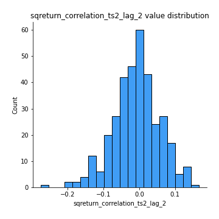
## Feature : sqreturn_correlation_ts2_lag_3
- **Feature type** : continous
- **Missing** : 0.0%
- **Unique** : 347
- **Count** :347.0
- **Mean** :0.004078188914270359
- **Std** :0.06946835214339418
- **Min** :-0.18732889576588613
- **25%th Percentile** : -0.04720716013536194
- **50%th Percentile** : 0.005652281595589168
- **75%th Percentile** : 0.051096274162558616
- **Max** :0.18227042221329348

## Feature : price2_granger_cause_price1
- **Feature type** : continous
- **Missing** : 0.0%
- **Unique** : 347
- **Count** :347.0
- **Mean** :0.2876267288145756
- **Std** :0.2839941541972751
- **Min** :2.4312048970873696e-09
- **25%th Percentile** : 0.0456634757257109
- **50%th Percentile** : 0.18713960605192698
- **75%th Percentile** : 0.4780347050122264
- **Max** :0.9898380228448623

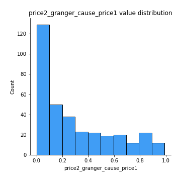
## Feature : price1_granger_cause_price2
- **Feature type** : continous
- **Missing** : 0.0%
- **Unique** : 347
- **Count** :347.0
- **Mean** :0.30150450777198623
- **Std** :0.2976407682379216
- **Min** :1.2012269232170316e-11
- **25%th Percentile** : 0.043189358606739295
- **50%th Percentile** : 0.18567774910480173
- **75%th Percentile** : 0.5355297597605609
- **Max** :0.9871292066441198

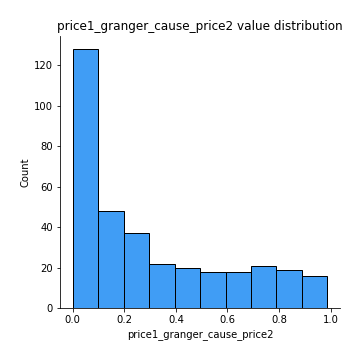

[<< Go back](../README.md)
