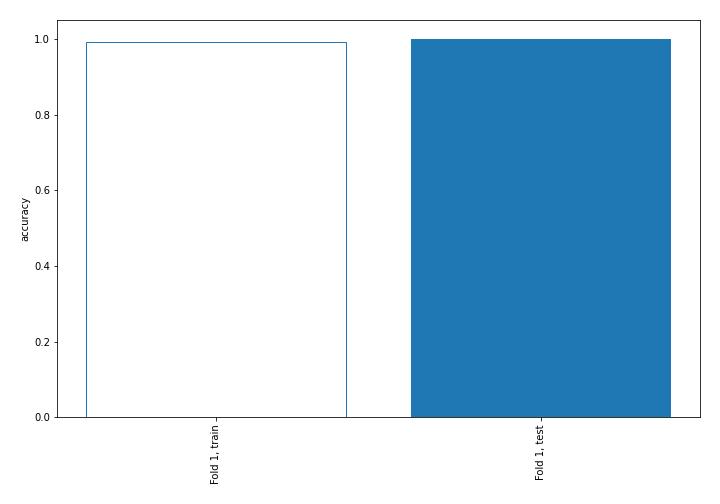
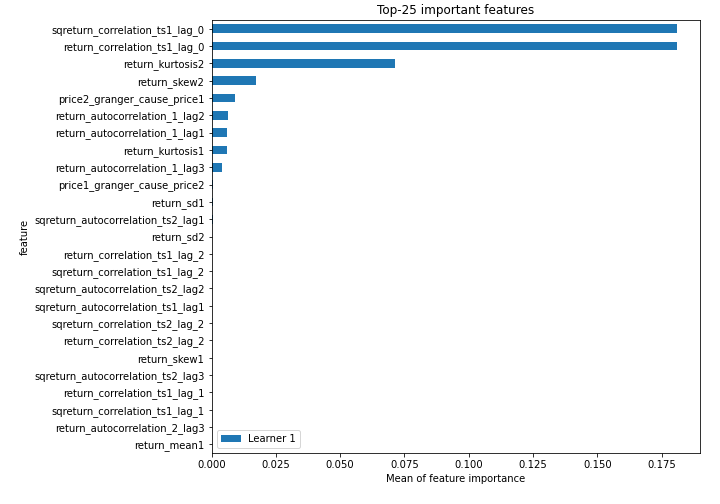
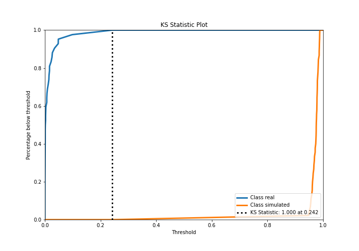
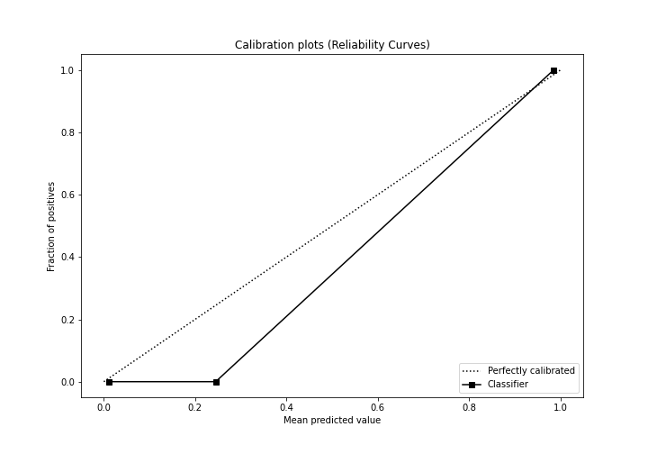
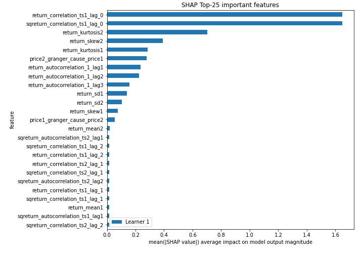
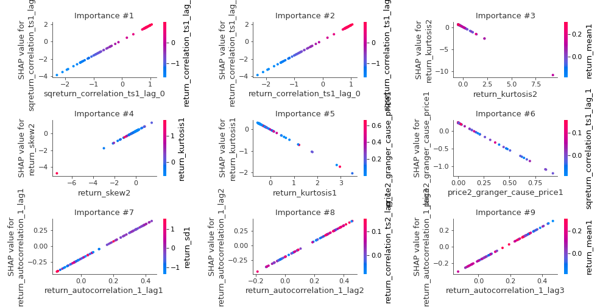
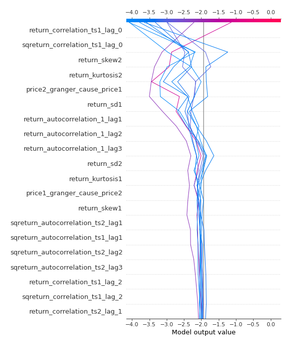
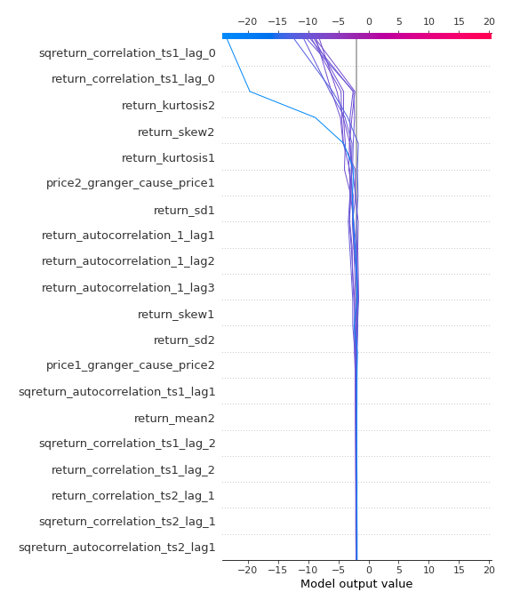
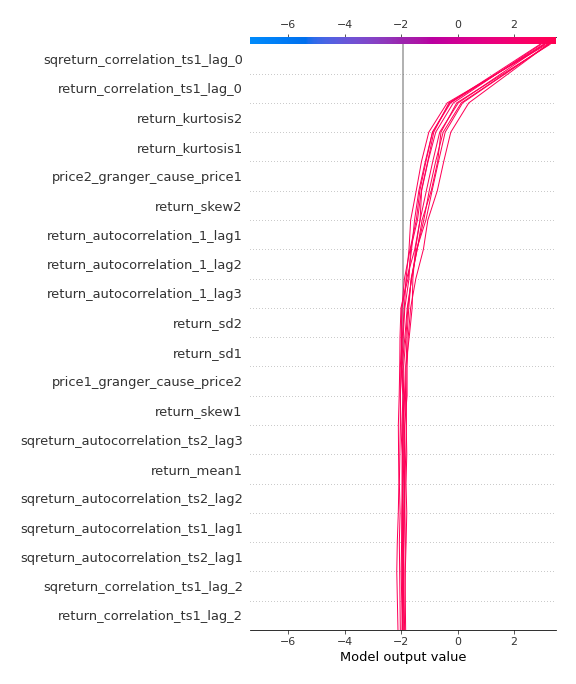
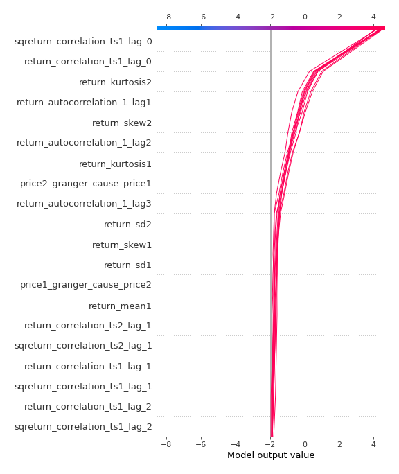

# Summary of 3_Linear

[<< Go back](../README.md)

## Logistic Regression (Linear)
- **n_jobs**: -1
- **explain_level**: 2

## Validation
 - **validation_type**: split
 - **train_ratio**: 0.75
 - **shuffle**: True
 - **stratify**: True

## Optimized metric
accuracy

## Training time

3.3 seconds

## Metric details
|           |     score |     threshold |
|:----------|----------:|--------------:|
| logloss   | 0.0223106 | nan           |
| auc       | 1         | nan           |
| f1        | 1         |   0.47798     |
| accuracy  | 1         |   0.47798     |
| precision | 1         |   0.971609    |
| recall    | 1         |   6.09664e-11 |
| mcc       | 1         |   0.47798     |

## Confusion matrix (at threshold=0.47798)
|                      |   Predicted as real |   Predicted as simulated |
|:---------------------|--------------------:|-------------------------:|
| Labeled as real      |                  42 |                        0 |
| Labeled as simulated |                   0 |                       45 |

## Learning curves

## Coefficients
| feature                           |   Learner_1 |
|:----------------------------------|------------:|
| sqreturn_correlation_ts1_lag_0    |   1.73879   |
| return_correlation_ts1_lag_0      |   1.73879   |
| return_autocorrelation_1_lag1     |   1.38217   |
| return_autocorrelation_1_lag2     |   1.32758   |
| return_autocorrelation_1_lag3     |   1.03724   |
| return_skew2                      |   0.679249  |
| return_correlation_ts1_lag_2      |   0.287683  |
| sqreturn_correlation_ts1_lag_2    |   0.287683  |
| sqreturn_correlation_ts2_lag_1    |   0.269651  |
| return_correlation_ts2_lag_1      |   0.269651  |
| sqreturn_correlation_ts1_lag_1    |   0.256809  |
| return_correlation_ts1_lag_1      |   0.256809  |
| return_correlation_ts2_lag_2      |   0.249852  |
| sqreturn_correlation_ts2_lag_2    |   0.249852  |
| return_skew1                      |   0.213717  |
| return_mean1                      |   0.134424  |
| return_autocorrelation_2_lag1     |   0.104709  |
| return_correlation_ts2_lag_3      |   0.018685  |
| sqreturn_correlation_ts2_lag_3    |   0.018685  |
| return_autocorrelation_2_lag2     |   0.0167235 |
| sqreturn_correlation_ts1_lag_3    |   0.0013178 |
| return_correlation_ts1_lag_3      |   0.0013178 |
| sqreturn_autocorrelation_ts1_lag3 |  -0.102668  |
| return_sd2                        |  -0.147421  |
| return_autocorrelation_2_lag3     |  -0.189945  |
| return_mean2                      |  -0.203679  |
| sqreturn_autocorrelation_ts1_lag2 |  -0.210006  |
| return_sd1                        |  -0.231185  |
| sqreturn_autocorrelation_ts1_lag1 |  -0.231493  |
| price1_granger_cause_price2       |  -0.261054  |
| sqreturn_autocorrelation_ts2_lag1 |  -0.302038  |
| sqreturn_autocorrelation_ts2_lag3 |  -0.314025  |
| sqreturn_autocorrelation_ts2_lag2 |  -0.332789  |
| return_kurtosis1                  |  -0.575391  |
| return_kurtosis2                  |  -1.17651   |
| intercept                         |  -1.4758    |
| price2_granger_cause_price1       |  -1.54514   |

## Permutation-based Importance

## Confusion Matrix

## Normalized Confusion Matrix

## ROC Curve

## Kolmogorov-Smirnov Statistic

## Precision-Recall Curve

## Calibration Curve

## Cumulative Gains Curve

## Lift Curve

## SHAP Importance

## SHAP Dependence plots

### Dependence (Fold 1)

## SHAP Decision plots

### Top-10 Worst decisions for class 0 (Fold 1)

### Top-10 Best decisions for class 0 (Fold 1)

### Top-10 Worst decisions for class 1 (Fold 1)

### Top-10 Best decisions for class 1 (Fold 1)

[<< Go back](../README.md)
