# Exploratory Data Analysis

[<< Go back](../README.md)
## Feature : target
- **Feature type** : categorical
- **Missing** : 0.0%
- **Unique** : 2
- **Count** :347
- **Unique** :2
- **Top** :simulated
- **Freq** :178

## Feature : return_mean1
- **Feature type** : continous
- **Missing** : 0.0%
- **Unique** : 347
- **Count** :347.0
- **Mean** :0.06558199491198026
- **Std** :0.18514219959477038
- **Min** :-0.9131866216232174
- **25%th Percentile** : -0.03432458619385659
- **50%th Percentile** : 0.07523096373166653
- **75%th Percentile** : 0.15346916562788787
- **Max** :0.6794222860832546

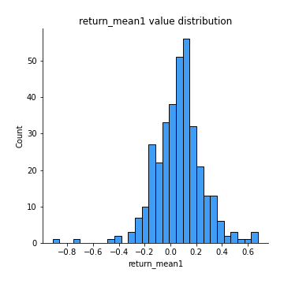
## Feature : return_mean2
- **Feature type** : continous
- **Missing** : 0.0%
- **Unique** : 347
- **Count** :347.0
- **Mean** :0.0024216425943097025
- **Std** :0.11439206173669818
- **Min** :-0.3393917268522109
- **25%th Percentile** : -0.0673471717921485
- **50%th Percentile** : 0.005075607309078123
- **75%th Percentile** : 0.07716583680597808
- **Max** :0.6801605239983173

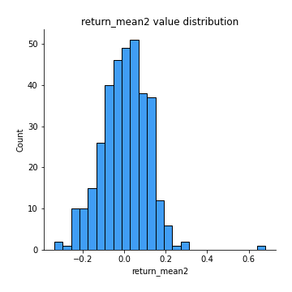
## Feature : return_sd1
- **Feature type** : continous
- **Missing** : 0.0%
- **Unique** : 347
- **Count** :347.0
- **Mean** :1.615919761309854
- **Std** :0.35137530428988867
- **Min** :0.8102430347636637
- **25%th Percentile** : 1.4687780378230784
- **50%th Percentile** : 1.581892671199719
- **75%th Percentile** : 1.684679931223894
- **Max** :3.332494027875222

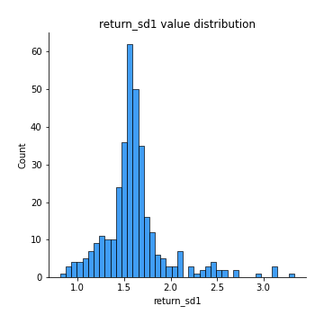
## Feature : return_sd2
- **Feature type** : continous
- **Missing** : 0.0%
- **Unique** : 347
- **Count** :347.0
- **Mean** :1.6231723932676947
- **Std** :0.40303880845118917
- **Min** :0.9060171249911689
- **25%th Percentile** : 1.464710900549571
- **50%th Percentile** : 1.5597233378893802
- **75%th Percentile** : 1.6521221693416508
- **Max** :4.59233049161685

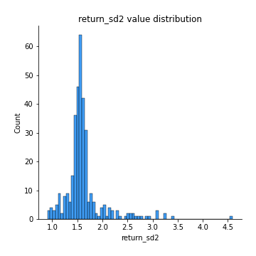
## Feature : return_skew1
- **Feature type** : continous
- **Missing** : 0.0%
- **Unique** : 347
- **Count** :347.0
- **Mean** :-0.21194210815430828
- **Std** :0.7242329373109171
- **Min** :-4.239645236578449
- **25%th Percentile** : -0.3576190322209696
- **50%th Percentile** : -0.14192534102391416
- **75%th Percentile** : 0.027318433707225226
- **Max** :2.351757728252051

## Feature : return_skew2
- **Feature type** : continous
- **Missing** : 0.0%
- **Unique** : 347
- **Count** :347.0
- **Mean** :-0.2896970855415042
- **Std** :1.0667216837481999
- **Min** :-7.3762354994385335
- **25%th Percentile** : -0.3670605176742122
- **50%th Percentile** : -0.07999861233406608
- **75%th Percentile** : 0.08870737712109486
- **Max** :4.1920266082732045

## Feature : return_kurtosis1
- **Feature type** : continous
- **Missing** : 0.0%
- **Unique** : 347
- **Count** :347.0
- **Mean** :2.679169518719428
- **Std** :5.642779147058067
- **Min** :-0.698250160351424
- **25%th Percentile** : -0.06643355326309308
- **50%th Percentile** : 0.8424242940328259
- **75%th Percentile** : 2.5079618302498012
- **Max** :40.485294874464934

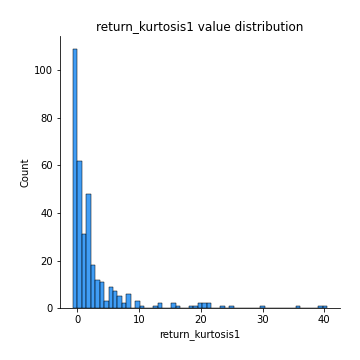
## Feature : return_kurtosis2
- **Feature type** : continous
- **Missing** : 0.0%
- **Unique** : 347
- **Count** :347.0
- **Mean** :4.35755705208285
- **Std** :10.039900598822221
- **Min** :-0.569583993502472
- **25%th Percentile** : -0.04670204956308477
- **50%th Percentile** : 0.640047606883805
- **75%th Percentile** : 3.8586921564822534
- **Max** :94.01659180149953

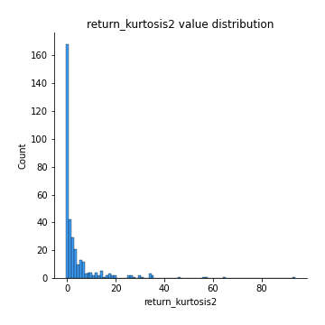
## Feature : return_autocorrelation_1_lag1
- **Feature type** : continous
- **Missing** : 0.0%
- **Unique** : 347
- **Count** :347.0
- **Mean** :0.1575651603072083
- **Std** :0.18563994114137253
- **Min** :-0.2110198016529991
- **25%th Percentile** : -0.019592986572728118
- **50%th Percentile** : 0.18224017916646473
- **75%th Percentile** : 0.33284096822272596
- **Max** :0.4756173777113505

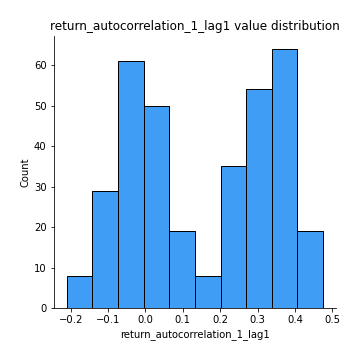
## Feature : return_autocorrelation_1_lag2
- **Feature type** : continous
- **Missing** : 0.0%
- **Unique** : 347
- **Count** :347.0
- **Mean** :0.15662103781459918
- **Std** :0.17914818125423965
- **Min** :-0.18815240041143846
- **25%th Percentile** : -0.013335043472729378
- **50%th Percentile** : 0.18641850387491993
- **75%th Percentile** : 0.32643317596823873
- **Max** :0.5206658726076262

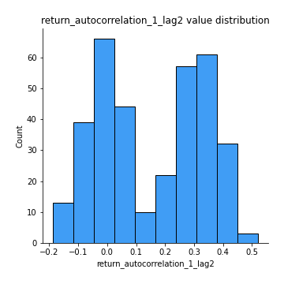
## Feature : return_autocorrelation_1_lag3
- **Feature type** : continous
- **Missing** : 0.0%
- **Unique** : 347
- **Count** :347.0
- **Mean** :0.1677069576023759
- **Std** :0.16565241057623836
- **Min** :-0.1817944619132489
- **25%th Percentile** : 0.01980019716312685
- **50%th Percentile** : 0.16981368556950924
- **75%th Percentile** : 0.3178322463071729
- **Max** :0.48933654178901975

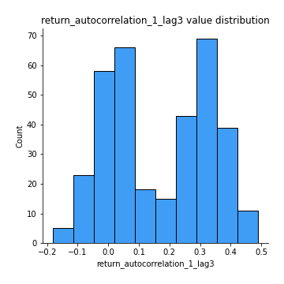
## Feature : return_autocorrelation_2_lag1
- **Feature type** : continous
- **Missing** : 0.0%
- **Unique** : 347
- **Count** :347.0
- **Mean** :0.007418735113988561
- **Std** :0.06527353388011835
- **Min** :-0.2146123564386428
- **25%th Percentile** : -0.03619840113157101
- **50%th Percentile** : 0.012013113355064258
- **75%th Percentile** : 0.05597955164512895
- **Max** :0.2024676054184499

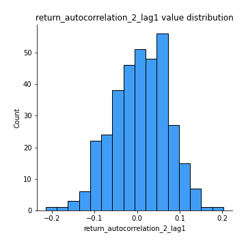
## Feature : return_autocorrelation_2_lag2
- **Feature type** : continous
- **Missing** : 0.0%
- **Unique** : 347
- **Count** :347.0
- **Mean** :-0.004988294329649547
- **Std** :0.06899560076277204
- **Min** :-0.20893148577068613
- **25%th Percentile** : -0.055986933981195586
- **50%th Percentile** : -0.003169620308504793
- **75%th Percentile** : 0.043299008948668116
- **Max** :0.25380912554085444

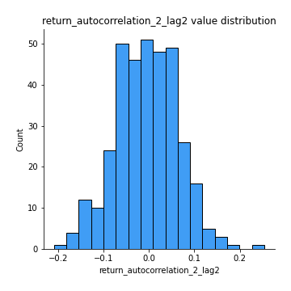
## Feature : return_autocorrelation_2_lag3
- **Feature type** : continous
- **Missing** : 0.0%
- **Unique** : 347
- **Count** :347.0
- **Mean** :0.009057800918113238
- **Std** :0.0615743812142744
- **Min** :-0.1622611236419658
- **25%th Percentile** : -0.02934476005146192
- **50%th Percentile** : 0.009490305132923683
- **75%th Percentile** : 0.05155650883754438
- **Max** :0.20205753622966244

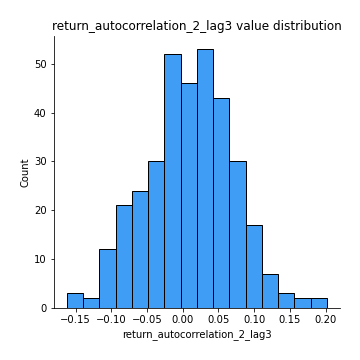
## Feature : return_correlation_ts1_lag_0
- **Feature type** : continous
- **Missing** : 0.0%
- **Unique** : 347
- **Count** :347.0
- **Mean** :0.5912968788147316
- **Std** :0.2906574629122064
- **Min** :-0.10256711281206837
- **25%th Percentile** : 0.33593985726953524
- **50%th Percentile** : 0.7931384983290005
- **75%th Percentile** : 0.8475472194618976
- **Max** :0.9937227277077512

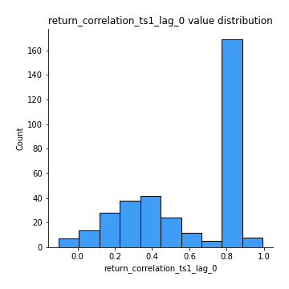
## Feature : return_correlation_ts1_lag_1
- **Feature type** : continous
- **Missing** : 0.0%
- **Unique** : 347
- **Count** :347.0
- **Mean** :0.03381534706234946
- **Std** :0.07563743452732412
- **Min** :-0.18856827637524448
- **25%th Percentile** : -0.019457261035827664
- **50%th Percentile** : 0.03226841084017901
- **75%th Percentile** : 0.09303971679967986
- **Max** :0.19845720152715127

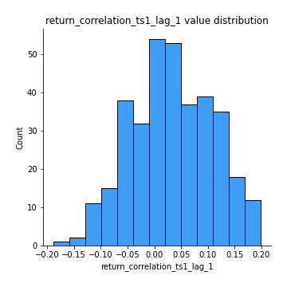
## Feature : return_correlation_ts1_lag_2
- **Feature type** : continous
- **Missing** : 0.0%
- **Unique** : 347
- **Count** :347.0
- **Mean** :0.02846070809897471
- **Std** :0.07451330395351596
- **Min** :-0.18387396969828299
- **25%th Percentile** : -0.022077712382632682
- **50%th Percentile** : 0.02438496830645578
- **75%th Percentile** : 0.07773378645170133
- **Max** :0.2586906338172283

## Feature : return_correlation_ts1_lag_3
- **Feature type** : continous
- **Missing** : 0.0%
- **Unique** : 347
- **Count** :347.0
- **Mean** :0.036528632465954586
- **Std** :0.07290719494910759
- **Min** :-0.21147540839842804
- **25%th Percentile** : -0.008835540788375475
- **50%th Percentile** : 0.043121067827153144
- **75%th Percentile** : 0.08207260076694797
- **Max** :0.23808054096877584

## Feature : return_correlation_ts2_lag_1
- **Feature type** : continous
- **Missing** : 0.0%
- **Unique** : 347
- **Count** :347.0
- **Mean** :0.03904469304900603
- **Std** :0.07617774028501666
- **Min** :-0.13695117628599504
- **25%th Percentile** : -0.01355573336205144
- **50%th Percentile** : 0.04286063735486047
- **75%th Percentile** : 0.09288521552743079
- **Max** :0.3425036902091001

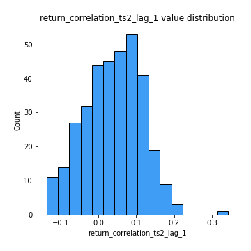
## Feature : return_correlation_ts2_lag_2
- **Feature type** : continous
- **Missing** : 0.0%
- **Unique** : 347
- **Count** :347.0
- **Mean** :0.02960372982626977
- **Std** :0.0760191889634395
- **Min** :-0.18381967289455395
- **25%th Percentile** : -0.0173768771207232
- **50%th Percentile** : 0.024653043505045873
- **75%th Percentile** : 0.08354273373055296
- **Max** :0.25459792110434837

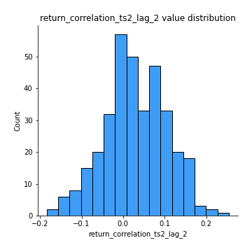
## Feature : return_correlation_ts2_lag_3
- **Feature type** : continous
- **Missing** : 0.0%
- **Unique** : 347
- **Count** :347.0
- **Mean** :0.04112593923670209
- **Std** :0.06629753929128371
- **Min** :-0.13344359675322365
- **25%th Percentile** : -0.0018648924032080784
- **50%th Percentile** : 0.0430045522626657
- **75%th Percentile** : 0.08288206070435722
- **Max** :0.23944562892837076

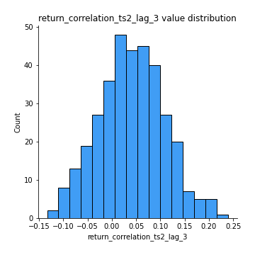
## Feature : sqreturn_autocorrelation_ts1_lag1
- **Feature type** : continous
- **Missing** : 0.0%
- **Unique** : 347
- **Count** :347.0
- **Mean** :0.060732514421746785
- **Std** :0.08142217320104557
- **Min** :-0.1114913632113273
- **25%th Percentile** : 0.0010078144833866468
- **50%th Percentile** : 0.05185280632893645
- **75%th Percentile** : 0.1066284543129549
- **Max** :0.4170324090514868

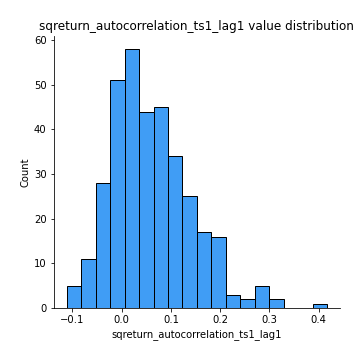
## Feature : sqreturn_autocorrelation_ts1_lag2
- **Feature type** : continous
- **Missing** : 0.0%
- **Unique** : 347
- **Count** :347.0
- **Mean** :0.04877208964831179
- **Std** :0.07333386838270703
- **Min** :-0.10232173774559379
- **25%th Percentile** : -0.006839372376574216
- **50%th Percentile** : 0.03342585319938195
- **75%th Percentile** : 0.0994954545078997
- **Max** :0.32836952056190194

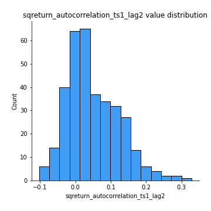
## Feature : sqreturn_autocorrelation_ts1_lag3
- **Feature type** : continous
- **Missing** : 0.0%
- **Unique** : 347
- **Count** :347.0
- **Mean** :0.03781562446637147
- **Std** :0.06201842591276818
- **Min** :-0.10150184304500932
- **25%th Percentile** : -0.005358534161873643
- **50%th Percentile** : 0.029075436440435046
- **75%th Percentile** : 0.07415599731649636
- **Max** :0.2414824294494812

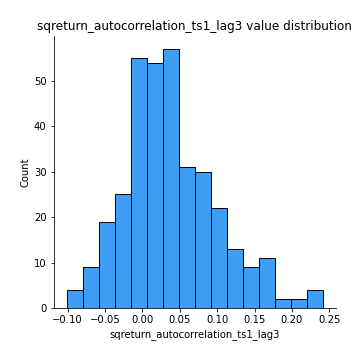
## Feature : sqreturn_autocorrelation_ts2_lag1
- **Feature type** : continous
- **Missing** : 0.0%
- **Unique** : 347
- **Count** :347.0
- **Mean** :0.02402368059778313
- **Std** :0.07773693167296966
- **Min** :-0.1409407187433683
- **25%th Percentile** : -0.024183963973618654
- **50%th Percentile** : 0.009105028593548666
- **75%th Percentile** : 0.060905347284128095
- **Max** :0.36991568023038357

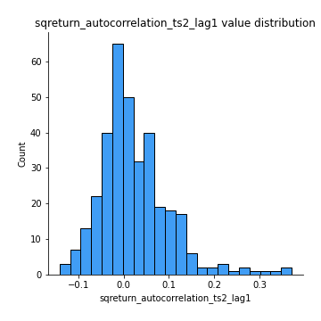
## Feature : sqreturn_autocorrelation_ts2_lag2
- **Feature type** : continous
- **Missing** : 0.0%
- **Unique** : 347
- **Count** :347.0
- **Mean** :0.009889736987587
- **Std** :0.06075690110098443
- **Min** :-0.16338417289489995
- **25%th Percentile** : -0.02561213501429923
- **50%th Percentile** : -0.001122158680179612
- **75%th Percentile** : 0.04477672938705178
- **Max** :0.28672056150180414

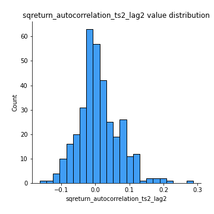
## Feature : sqreturn_autocorrelation_ts2_lag3
- **Feature type** : continous
- **Missing** : 0.0%
- **Unique** : 347
- **Count** :347.0
- **Mean** :0.008775308081275747
- **Std** :0.057922820931264205
- **Min** :-0.13271175961792447
- **25%th Percentile** : -0.028377079566431065
- **50%th Percentile** : 3.939053014826637e-05
- **75%th Percentile** : 0.03888182912256313
- **Max** :0.231605349758384

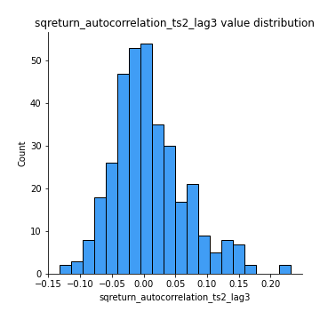
## Feature : sqreturn_correlation_ts1_lag_0
- **Feature type** : continous
- **Missing** : 0.0%
- **Unique** : 347
- **Count** :347.0
- **Mean** :0.5912968788147316
- **Std** :0.2906574629122064
- **Min** :-0.10256711281206837
- **25%th Percentile** : 0.33593985726953524
- **50%th Percentile** : 0.7931384983290005
- **75%th Percentile** : 0.8475472194618976
- **Max** :0.9937227277077512

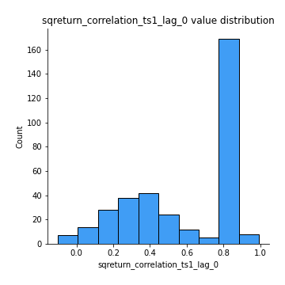
## Feature : sqreturn_correlation_ts1_lag_1
- **Feature type** : continous
- **Missing** : 0.0%
- **Unique** : 347
- **Count** :347.0
- **Mean** :0.03381534706234946
- **Std** :0.07563743452732412
- **Min** :-0.18856827637524448
- **25%th Percentile** : -0.019457261035827664
- **50%th Percentile** : 0.03226841084017901
- **75%th Percentile** : 0.09303971679967986
- **Max** :0.19845720152715127

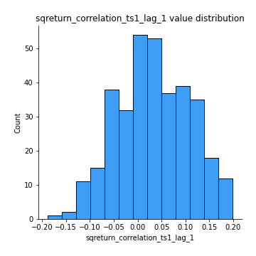
## Feature : sqreturn_correlation_ts1_lag_2
- **Feature type** : continous
- **Missing** : 0.0%
- **Unique** : 347
- **Count** :347.0
- **Mean** :0.02846070809897471
- **Std** :0.07451330395351596
- **Min** :-0.18387396969828299
- **25%th Percentile** : -0.022077712382632682
- **50%th Percentile** : 0.02438496830645578
- **75%th Percentile** : 0.07773378645170133
- **Max** :0.2586906338172283

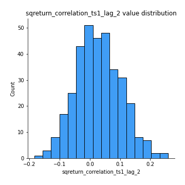
## Feature : sqreturn_correlation_ts1_lag_3
- **Feature type** : continous
- **Missing** : 0.0%
- **Unique** : 347
- **Count** :347.0
- **Mean** :0.036528632465954586
- **Std** :0.07290719494910759
- **Min** :-0.21147540839842804
- **25%th Percentile** : -0.008835540788375475
- **50%th Percentile** : 0.043121067827153144
- **75%th Percentile** : 0.08207260076694797
- **Max** :0.23808054096877584

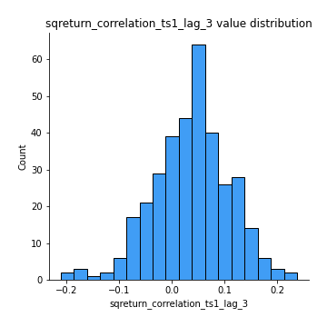
## Feature : sqreturn_correlation_ts2_lag_1
- **Feature type** : continous
- **Missing** : 0.0%
- **Unique** : 347
- **Count** :347.0
- **Mean** :0.03904469304900603
- **Std** :0.07617774028501666
- **Min** :-0.13695117628599504
- **25%th Percentile** : -0.01355573336205144
- **50%th Percentile** : 0.04286063735486047
- **75%th Percentile** : 0.09288521552743079
- **Max** :0.3425036902091001

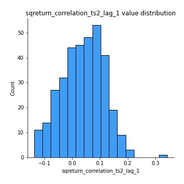
## Feature : sqreturn_correlation_ts2_lag_2
- **Feature type** : continous
- **Missing** : 0.0%
- **Unique** : 347
- **Count** :347.0
- **Mean** :0.02960372982626977
- **Std** :0.0760191889634395
- **Min** :-0.18381967289455395
- **25%th Percentile** : -0.0173768771207232
- **50%th Percentile** : 0.024653043505045873
- **75%th Percentile** : 0.08354273373055296
- **Max** :0.25459792110434837

## Feature : sqreturn_correlation_ts2_lag_3
- **Feature type** : continous
- **Missing** : 0.0%
- **Unique** : 347
- **Count** :347.0
- **Mean** :0.04112593923670209
- **Std** :0.06629753929128371
- **Min** :-0.13344359675322365
- **25%th Percentile** : -0.0018648924032080784
- **50%th Percentile** : 0.0430045522626657
- **75%th Percentile** : 0.08288206070435722
- **Max** :0.23944562892837076

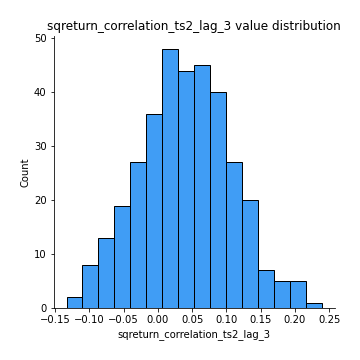
## Feature : price2_granger_cause_price1
- **Feature type** : continous
- **Missing** : 0.0%
- **Unique** : 347
- **Count** :347.0
- **Mean** :0.14092242008589237
- **Std** :0.24320664581834026
- **Min** :4.5956010802315725e-22
- **25%th Percentile** : 3.2353923191545014e-05
- **50%th Percentile** : 0.0057004815776330224
- **75%th Percentile** : 0.18693283962094231
- **Max** :0.9898380228448623

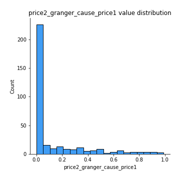
## Feature : price1_granger_cause_price2
- **Feature type** : continous
- **Missing** : 0.0%
- **Unique** : 347
- **Count** :347.0
- **Mean** :0.2303394971927161
- **Std** :0.25308122494795493
- **Min** :1.2012269232170316e-11
- **25%th Percentile** : 0.026585707365559392
- **50%th Percentile** : 0.1372213025430695
- **75%th Percentile** : 0.3371199082096603
- **Max** :0.9871292066441198

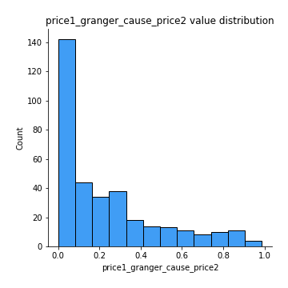

[<< Go back](../README.md)
