# Exploratory Data Analysis

[<< Go back](../README.md)
## Feature : target
- **Feature type** : categorical
- **Missing** : 0.0%
- **Unique** : 2
- **Count** :347
- **Unique** :2
- **Top** :real
- **Freq** :175

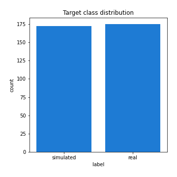
## Feature : return_mean1
- **Feature type** : continous
- **Missing** : 0.0%
- **Unique** : 347
- **Count** :347.0
- **Mean** :0.06318173418461992
- **Std** :0.16577078514979948
- **Min** :-0.48606851196209677
- **25%th Percentile** : -0.03098926179733246
- **50%th Percentile** : 0.0665635937680653
- **75%th Percentile** : 0.14997697347333486
- **Max** :0.687093116431256

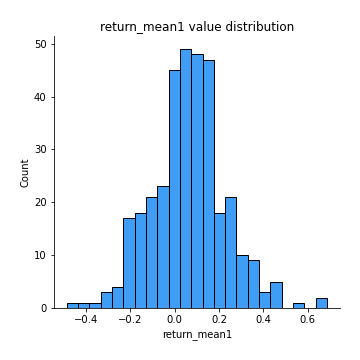
## Feature : return_mean2
- **Feature type** : continous
- **Missing** : 0.0%
- **Unique** : 347
- **Count** :347.0
- **Mean** :-0.009525141483624119
- **Std** :0.12433808081783368
- **Min** :-0.3439835398279146
- **25%th Percentile** : -0.09049682486372729
- **50%th Percentile** : -0.007326137775534774
- **75%th Percentile** : 0.07098424207053435
- **Max** :0.6801605239983173

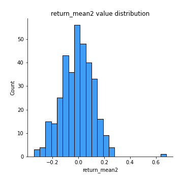
## Feature : return_sd1
- **Feature type** : continous
- **Missing** : 0.0%
- **Unique** : 347
- **Count** :347.0
- **Mean** :1.6213946036661702
- **Std** :0.3605558875215924
- **Min** :0.8102430347636637
- **25%th Percentile** : 1.491774251967461
- **50%th Percentile** : 1.5820640337737768
- **75%th Percentile** : 1.6954219654484817
- **Max** :3.332494027875222

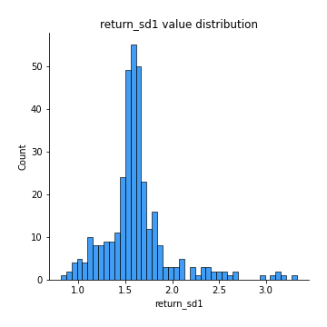
## Feature : return_sd2
- **Feature type** : continous
- **Missing** : 0.0%
- **Unique** : 347
- **Count** :347.0
- **Mean** :1.6442669541539887
- **Std** :0.41824622144065027
- **Min** :0.8198779632289204
- **25%th Percentile** : 1.480273093448615
- **50%th Percentile** : 1.5768509652323788
- **75%th Percentile** : 1.6654477044755622
- **Max** :4.59233049161685

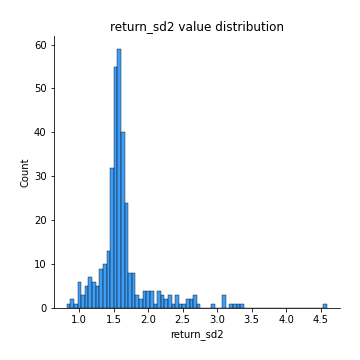
## Feature : return_skew1
- **Feature type** : continous
- **Missing** : 0.0%
- **Unique** : 347
- **Count** :347.0
- **Mean** :-0.23456198187175845
- **Std** :0.7659892737689401
- **Min** :-4.239645236578449
- **25%th Percentile** : -0.3948527566972556
- **50%th Percentile** : -0.11174740532657192
- **75%th Percentile** : 0.07499287123754517
- **Max** :2.3044235031125564

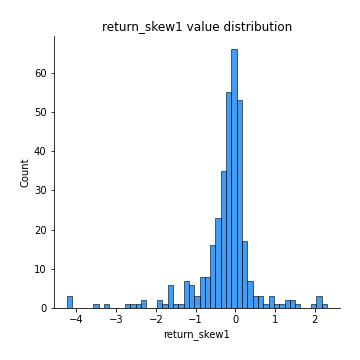
## Feature : return_skew2
- **Feature type** : continous
- **Missing** : 0.0%
- **Unique** : 347
- **Count** :347.0
- **Mean** :-0.30557458567625073
- **Std** :1.0545245549790043
- **Min** :-7.3762354994385335
- **25%th Percentile** : -0.36039818452556627
- **50%th Percentile** : -0.0818958588657874
- **75%th Percentile** : 0.10044994062491769
- **Max** :4.0310261345618

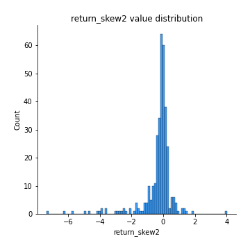
## Feature : return_kurtosis1
- **Feature type** : continous
- **Missing** : 0.0%
- **Unique** : 347
- **Count** :347.0
- **Mean** :2.9918010168254185
- **Std** :5.827388291235705
- **Min** :-0.5675944983520558
- **25%th Percentile** : -0.040954597815683336
- **50%th Percentile** : 0.9910776814597702
- **75%th Percentile** : 3.208535523274268
- **Max** :40.485294874464934

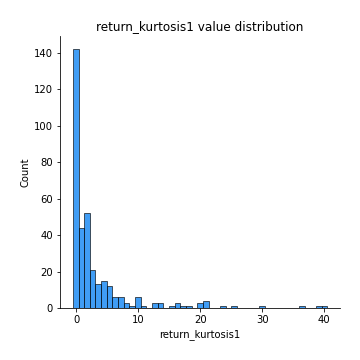
## Feature : return_kurtosis2
- **Feature type** : continous
- **Missing** : 0.0%
- **Unique** : 347
- **Count** :347.0
- **Mean** :4.050352097614741
- **Std** :9.965684809390632
- **Min** :-0.7453684079274647
- **25%th Percentile** : -0.007321543109030992
- **50%th Percentile** : 0.6926743307931291
- **75%th Percentile** : 3.3434029241276617
- **Max** :94.01659180149953

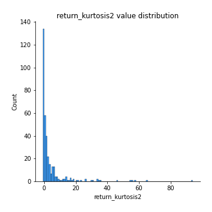
## Feature : return_autocorrelation_1_lag1
- **Feature type** : continous
- **Missing** : 0.0%
- **Unique** : 347
- **Count** :347.0
- **Mean** :0.14554696863952893
- **Std** :0.17508946032090056
- **Min** :-0.2110198016529991
- **25%th Percentile** : -0.017833684840567243
- **50%th Percentile** : 0.1276131873596462
- **75%th Percentile** : 0.3088828922571766
- **Max** :0.4902184429142254

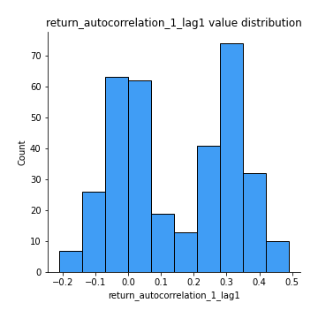
## Feature : return_autocorrelation_1_lag2
- **Feature type** : continous
- **Missing** : 0.0%
- **Unique** : 347
- **Count** :347.0
- **Mean** :0.1436783335935859
- **Std** :0.17934667094384094
- **Min** :-0.18815240041143846
- **25%th Percentile** : -0.025968702049481276
- **50%th Percentile** : 0.12474370335894062
- **75%th Percentile** : 0.3062821036446835
- **Max** :0.4782352059569622

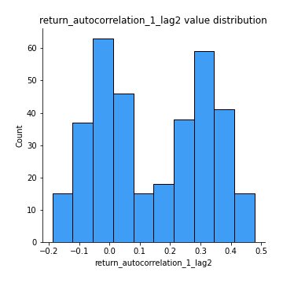
## Feature : return_autocorrelation_1_lag3
- **Feature type** : continous
- **Missing** : 0.0%
- **Unique** : 347
- **Count** :347.0
- **Mean** :0.16076189251021922
- **Std** :0.1625332976619963
- **Min** :-0.1817944619132489
- **25%th Percentile** : 0.01980019716312685
- **50%th Percentile** : 0.14443354743471404
- **75%th Percentile** : 0.3195812047768104
- **Max** :0.46141240710207915

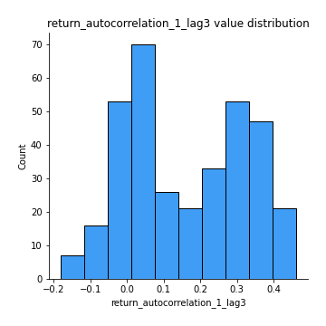
## Feature : return_autocorrelation_2_lag1
- **Feature type** : continous
- **Missing** : 0.0%
- **Unique** : 347
- **Count** :347.0
- **Mean** :0.0005635754028628348
- **Std** :0.06771740281383008
- **Min** :-0.17778763204400128
- **25%th Percentile** : -0.044242230843259955
- **50%th Percentile** : -0.003270213405979102
- **75%th Percentile** : 0.052603510368458395
- **Max** :0.20465014870669967

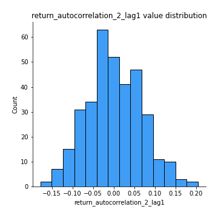
## Feature : return_autocorrelation_2_lag2
- **Feature type** : continous
- **Missing** : 0.0%
- **Unique** : 347
- **Count** :347.0
- **Mean** :-0.0014047214392027424
- **Std** :0.06626821184913659
- **Min** :-0.1758721664122366
- **25%th Percentile** : -0.04711728160390266
- **50%th Percentile** : -0.0007303373185099572
- **75%th Percentile** : 0.046726984667933825
- **Max** :0.18217347206668574

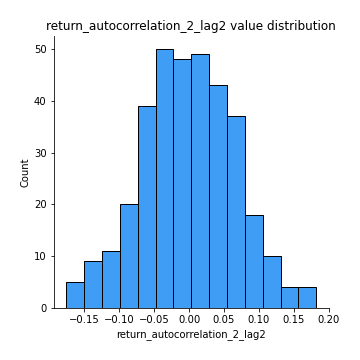
## Feature : return_autocorrelation_2_lag3
- **Feature type** : continous
- **Missing** : 0.0%
- **Unique** : 347
- **Count** :347.0
- **Mean** :0.010631281489486047
- **Std** :0.06380448300344696
- **Min** :-0.1930190665931219
- **25%th Percentile** : -0.026050444812484842
- **50%th Percentile** : 0.01413264504669296
- **75%th Percentile** : 0.05445023744125261
- **Max** :0.20205753622966244

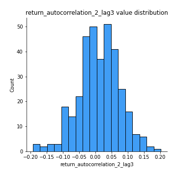
## Feature : return_correlation_ts1_lag_0
- **Feature type** : continous
- **Missing** : 0.0%
- **Unique** : 347
- **Count** :347.0
- **Mean** :0.5757580899004685
- **Std** :0.2906830857248686
- **Min** :-0.10256711281206837
- **25%th Percentile** : 0.32409496960217626
- **50%th Percentile** : 0.7082699009496575
- **75%th Percentile** : 0.8465306852597375
- **Max** :0.9088447548718206

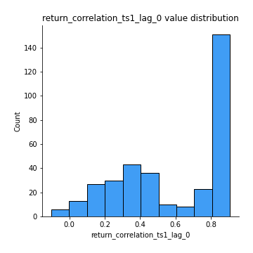
## Feature : return_correlation_ts1_lag_1
- **Feature type** : continous
- **Missing** : 0.0%
- **Unique** : 347
- **Count** :347.0
- **Mean** :0.02677318191228205
- **Std** :0.0703267329908553
- **Min** :-0.14801746278864836
- **25%th Percentile** : -0.02346841765346947
- **50%th Percentile** : 0.022985096666300112
- **75%th Percentile** : 0.07294580799946844
- **Max** :0.21568198355818433

## Feature : return_correlation_ts1_lag_2
- **Feature type** : continous
- **Missing** : 0.0%
- **Unique** : 347
- **Count** :347.0
- **Mean** :0.02665883146151706
- **Std** :0.07689566398590914
- **Min** :-0.172871336111873
- **25%th Percentile** : -0.027838299629655783
- **50%th Percentile** : 0.020800583171008545
- **75%th Percentile** : 0.07544582378193426
- **Max** :0.2210878997885351

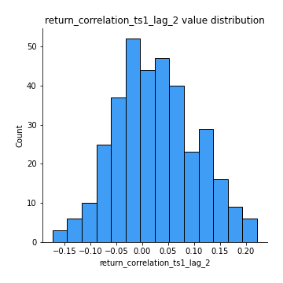
## Feature : return_correlation_ts1_lag_3
- **Feature type** : continous
- **Missing** : 0.0%
- **Unique** : 347
- **Count** :347.0
- **Mean** :0.035271406794250545
- **Std** :0.07516534458517385
- **Min** :-0.21147540839842804
- **25%th Percentile** : -0.013804608773617872
- **50%th Percentile** : 0.03644393492400982
- **75%th Percentile** : 0.08001096308525935
- **Max** :0.2423521729765461

## Feature : return_correlation_ts2_lag_1
- **Feature type** : continous
- **Missing** : 0.0%
- **Unique** : 347
- **Count** :347.0
- **Mean** :0.033476502222691204
- **Std** :0.07708689080776886
- **Min** :-0.17665751184419612
- **25%th Percentile** : -0.018199774902303272
- **50%th Percentile** : 0.029681003363848397
- **75%th Percentile** : 0.08463575906267454
- **Max** :0.3425036902091001

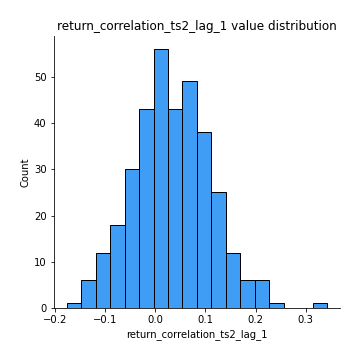
## Feature : return_correlation_ts2_lag_2
- **Feature type** : continous
- **Missing** : 0.0%
- **Unique** : 347
- **Count** :347.0
- **Mean** :0.028835465854616722
- **Std** :0.07947245386580884
- **Min** :-0.2757460186107768
- **25%th Percentile** : -0.023637207014579265
- **50%th Percentile** : 0.02764724400375495
- **75%th Percentile** : 0.07917183960962215
- **Max** :0.2569814558908543

## Feature : return_correlation_ts2_lag_3
- **Feature type** : continous
- **Missing** : 0.0%
- **Unique** : 347
- **Count** :347.0
- **Mean** :0.04121203197039639
- **Std** :0.07004350471945878
- **Min** :-0.13014008098483887
- **25%th Percentile** : -0.006993889709373559
- **50%th Percentile** : 0.04210094822084762
- **75%th Percentile** : 0.08703571132301881
- **Max** :0.23263450264404048

## Feature : sqreturn_autocorrelation_ts1_lag1
- **Feature type** : continous
- **Missing** : 0.0%
- **Unique** : 347
- **Count** :347.0
- **Mean** :0.05507019223237789
- **Std** :0.07727500324956618
- **Min** :-0.124034753395706
- **25%th Percentile** : -0.002301250549642612
- **50%th Percentile** : 0.04179928722576693
- **75%th Percentile** : 0.10155382980327687
- **Max** :0.4170324090514868

## Feature : sqreturn_autocorrelation_ts1_lag2
- **Feature type** : continous
- **Missing** : 0.0%
- **Unique** : 347
- **Count** :347.0
- **Mean** :0.043265343253808805
- **Std** :0.06939180288387901
- **Min** :-0.11359642922923531
- **25%th Percentile** : -0.009805036761168298
- **50%th Percentile** : 0.028389962884887533
- **75%th Percentile** : 0.08408215435063887
- **Max** :0.29415594530501293

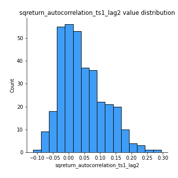
## Feature : sqreturn_autocorrelation_ts1_lag3
- **Feature type** : continous
- **Missing** : 0.0%
- **Unique** : 347
- **Count** :347.0
- **Mean** :0.040749936893639094
- **Std** :0.0740658298031696
- **Min** :-0.09384851361856075
- **25%th Percentile** : -0.011744141118224551
- **50%th Percentile** : 0.024715642761945874
- **75%th Percentile** : 0.07242014691411175
- **Max** :0.36579865351615615

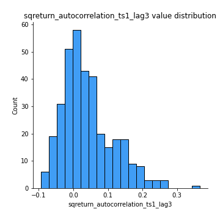
## Feature : sqreturn_autocorrelation_ts2_lag1
- **Feature type** : continous
- **Missing** : 0.0%
- **Unique** : 347
- **Count** :347.0
- **Mean** :0.030199041066547125
- **Std** :0.07497775455966327
- **Min** :-0.12806407272354328
- **25%th Percentile** : -0.019965274343735614
- **50%th Percentile** : 0.019391253096014784
- **75%th Percentile** : 0.0674713819443768
- **Max** :0.3533869018400006

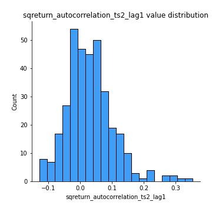
## Feature : sqreturn_autocorrelation_ts2_lag2
- **Feature type** : continous
- **Missing** : 0.0%
- **Unique** : 347
- **Count** :347.0
- **Mean** :0.008770765161191086
- **Std** :0.05899916865698818
- **Min** :-0.14584572639306898
- **25%th Percentile** : -0.02821696061643975
- **50%th Percentile** : 0.0020022423781944987
- **75%th Percentile** : 0.042107210996249714
- **Max** :0.2357173664732939

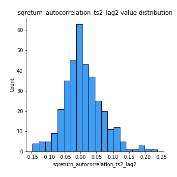
## Feature : sqreturn_autocorrelation_ts2_lag3
- **Feature type** : continous
- **Missing** : 0.0%
- **Unique** : 347
- **Count** :347.0
- **Mean** :0.005655020080821714
- **Std** :0.06389013180504574
- **Min** :-0.19734152246402162
- **25%th Percentile** : -0.032553593853163046
- **50%th Percentile** : -0.007156630338201929
- **75%th Percentile** : 0.03642233207910442
- **Max** :0.3463122340368414

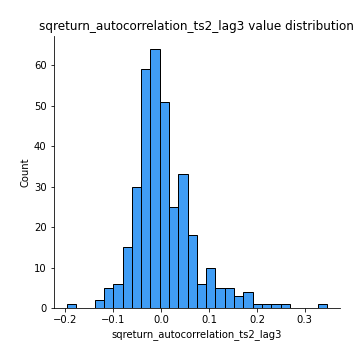
## Feature : sqreturn_correlation_ts1_lag_0
- **Feature type** : continous
- **Missing** : 0.0%
- **Unique** : 347
- **Count** :347.0
- **Mean** :0.5757580899004685
- **Std** :0.2906830857248686
- **Min** :-0.10256711281206837
- **25%th Percentile** : 0.32409496960217626
- **50%th Percentile** : 0.7082699009496575
- **75%th Percentile** : 0.8465306852597375
- **Max** :0.9088447548718206

## Feature : sqreturn_correlation_ts1_lag_1
- **Feature type** : continous
- **Missing** : 0.0%
- **Unique** : 347
- **Count** :347.0
- **Mean** :0.02677318191228205
- **Std** :0.0703267329908553
- **Min** :-0.14801746278864836
- **25%th Percentile** : -0.02346841765346947
- **50%th Percentile** : 0.022985096666300112
- **75%th Percentile** : 0.07294580799946844
- **Max** :0.21568198355818433

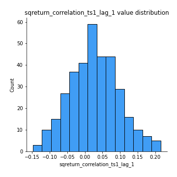
## Feature : sqreturn_correlation_ts1_lag_2
- **Feature type** : continous
- **Missing** : 0.0%
- **Unique** : 347
- **Count** :347.0
- **Mean** :0.02665883146151706
- **Std** :0.07689566398590914
- **Min** :-0.172871336111873
- **25%th Percentile** : -0.027838299629655783
- **50%th Percentile** : 0.020800583171008545
- **75%th Percentile** : 0.07544582378193426
- **Max** :0.2210878997885351

## Feature : sqreturn_correlation_ts1_lag_3
- **Feature type** : continous
- **Missing** : 0.0%
- **Unique** : 347
- **Count** :347.0
- **Mean** :0.035271406794250545
- **Std** :0.07516534458517385
- **Min** :-0.21147540839842804
- **25%th Percentile** : -0.013804608773617872
- **50%th Percentile** : 0.03644393492400982
- **75%th Percentile** : 0.08001096308525935
- **Max** :0.2423521729765461

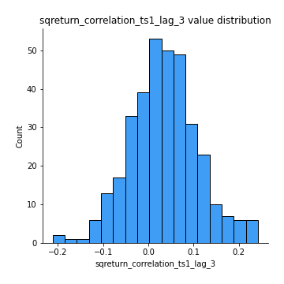
## Feature : sqreturn_correlation_ts2_lag_1
- **Feature type** : continous
- **Missing** : 0.0%
- **Unique** : 347
- **Count** :347.0
- **Mean** :0.033476502222691204
- **Std** :0.07708689080776886
- **Min** :-0.17665751184419612
- **25%th Percentile** : -0.018199774902303272
- **50%th Percentile** : 0.029681003363848397
- **75%th Percentile** : 0.08463575906267454
- **Max** :0.3425036902091001

## Feature : sqreturn_correlation_ts2_lag_2
- **Feature type** : continous
- **Missing** : 0.0%
- **Unique** : 347
- **Count** :347.0
- **Mean** :0.028835465854616722
- **Std** :0.07947245386580884
- **Min** :-0.2757460186107768
- **25%th Percentile** : -0.023637207014579265
- **50%th Percentile** : 0.02764724400375495
- **75%th Percentile** : 0.07917183960962215
- **Max** :0.2569814558908543

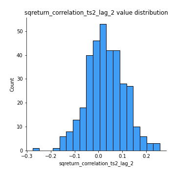
## Feature : sqreturn_correlation_ts2_lag_3
- **Feature type** : continous
- **Missing** : 0.0%
- **Unique** : 347
- **Count** :347.0
- **Mean** :0.04121203197039639
- **Std** :0.07004350471945878
- **Min** :-0.13014008098483887
- **25%th Percentile** : -0.006993889709373559
- **50%th Percentile** : 0.04210094822084762
- **75%th Percentile** : 0.08703571132301881
- **Max** :0.23263450264404048

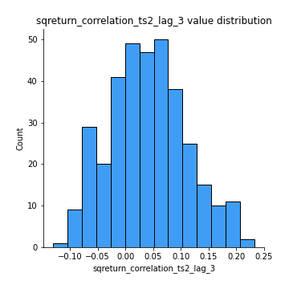
## Feature : price2_granger_cause_price1
- **Feature type** : continous
- **Missing** : 0.0%
- **Unique** : 347
- **Count** :347.0
- **Mean** :0.14192091813752647
- **Std** :0.24961806510111914
- **Min** :2.6978250531258176e-34
- **25%th Percentile** : 7.946685458473174e-05
- **50%th Percentile** : 0.004636374242679664
- **75%th Percentile** : 0.18089558158450111
- **Max** :0.9757504007795685

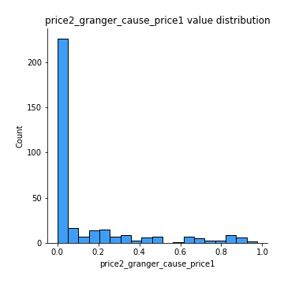
## Feature : price1_granger_cause_price2
- **Feature type** : continous
- **Missing** : 0.0%
- **Unique** : 347
- **Count** :347.0
- **Mean** :0.25156123505816597
- **Std** :0.2797050294805869
- **Min** :1.2012269232170316e-11
- **25%th Percentile** : 0.02240525773181743
- **50%th Percentile** : 0.12288468861762568
- **75%th Percentile** : 0.3913614484332224
- **Max** :0.9956710906735263

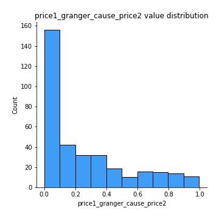

[<< Go back](../README.md)
