# Summary of 3_Linear

[<< Go back](../README.md)

## Logistic Regression (Linear)
- **n_jobs**: -1
- **explain_level**: 2

## Validation
 - **validation_type**: split
 - **train_ratio**: 0.75
 - **shuffle**: True
 - **stratify**: True

## Optimized metric
accuracy

## Training time

4.0 seconds

## Metric details
|           |     score |     threshold |
|:----------|----------:|--------------:|
| logloss   | 0.0970478 | nan           |
| auc       | 0.988865  | nan           |
| f1        | 0.97561   |   0.493473    |
| accuracy  | 0.977011  |   0.493473    |
| precision | 1         |   0.985394    |
| recall    | 1         |   2.56306e-07 |
| mcc       | 0.953871  |   0.493473    |

## Confusion matrix (at threshold=0.493473)
|                      |   Predicted as real |   Predicted as simulated |
|:---------------------|--------------------:|-------------------------:|
| Labeled as real      |                  45 |                        1 |
| Labeled as simulated |                   1 |                       40 |

## Learning curves
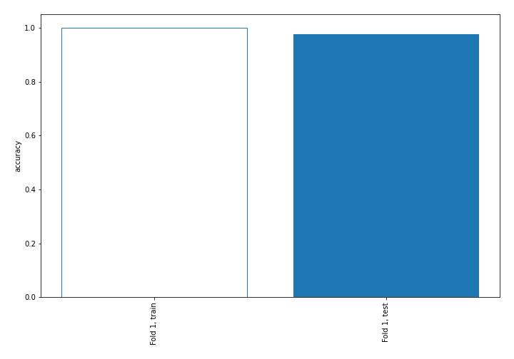

## Coefficients
| feature                           |   Learner_1 |
|:----------------------------------|------------:|
| sqreturn_correlation_ts1_lag_0    |  2.22423    |
| return_correlation_ts1_lag_0      |  2.22423    |
| return_autocorrelation_1_lag1     |  0.86717    |
| return_autocorrelation_1_lag2     |  0.827016   |
| return_autocorrelation_1_lag3     |  0.699703   |
| return_skew2                      |  0.581964   |
| return_skew1                      |  0.504118   |
| sqreturn_correlation_ts1_lag_2    |  0.207036   |
| return_correlation_ts1_lag_2      |  0.207036   |
| return_correlation_ts1_lag_1      |  0.191265   |
| sqreturn_correlation_ts1_lag_1    |  0.191265   |
| return_mean1                      |  0.180544   |
| return_correlation_ts2_lag_2      |  0.157569   |
| sqreturn_correlation_ts2_lag_2    |  0.157569   |
| sqreturn_correlation_ts2_lag_1    |  0.141184   |
| return_correlation_ts2_lag_1      |  0.141184   |
| return_correlation_ts1_lag_3      |  0.0549835  |
| sqreturn_correlation_ts1_lag_3    |  0.0549835  |
| return_sd2                        |  0.0510413  |
| sqreturn_correlation_ts2_lag_3    |  0.0461584  |
| return_correlation_ts2_lag_3      |  0.0461584  |
| return_autocorrelation_2_lag1     |  0.0339381  |
| return_autocorrelation_2_lag2     |  0.0314373  |
| sqreturn_autocorrelation_ts1_lag3 | -0.00930923 |
| sqreturn_autocorrelation_ts1_lag2 | -0.0601305  |
| return_autocorrelation_2_lag3     | -0.0690572  |
| return_sd1                        | -0.0966957  |
| return_mean2                      | -0.0983594  |
| sqreturn_autocorrelation_ts1_lag1 | -0.128775   |
| sqreturn_autocorrelation_ts2_lag3 | -0.138325   |
| sqreturn_autocorrelation_ts2_lag2 | -0.192415   |
| sqreturn_autocorrelation_ts2_lag1 | -0.206256   |
| price1_granger_cause_price2       | -0.245701   |
| return_kurtosis2                  | -0.762603   |
| price2_granger_cause_price1       | -0.820343   |
| return_kurtosis1                  | -0.839365   |
| intercept                         | -1.86371    |

## Permutation-based Importance
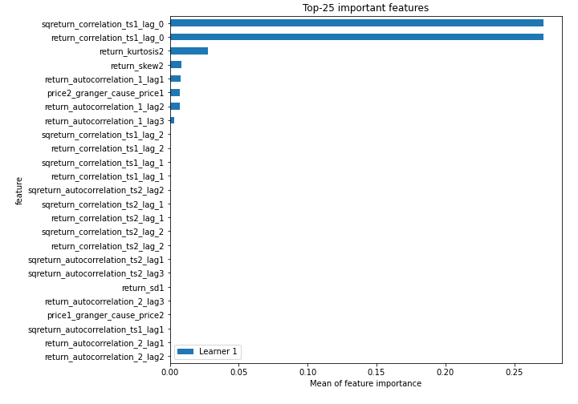
## Confusion Matrix

## Normalized Confusion Matrix

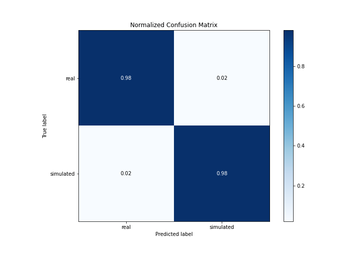

## ROC Curve

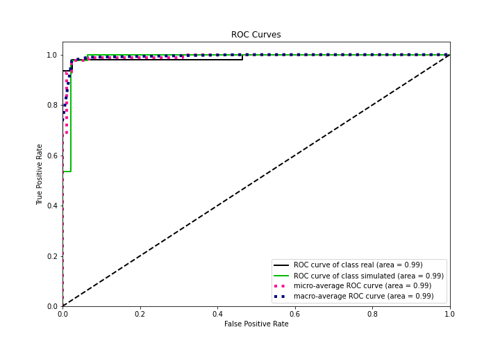

## Kolmogorov-Smirnov Statistic

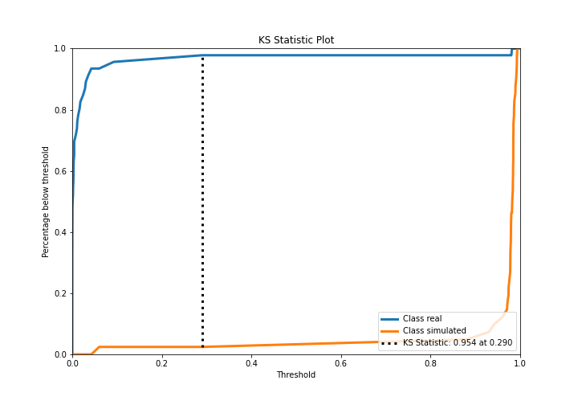

## Precision-Recall Curve

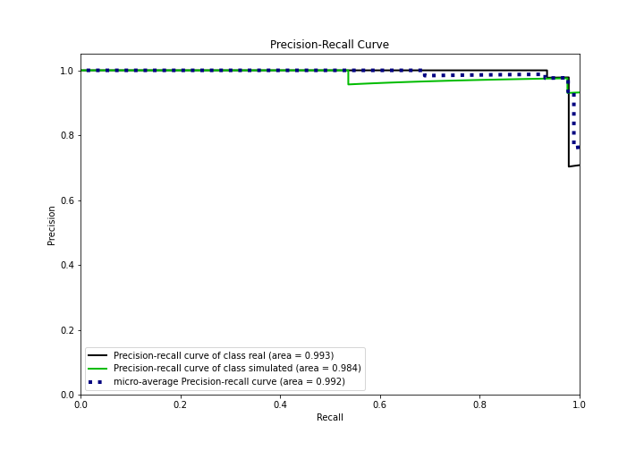

## Calibration Curve

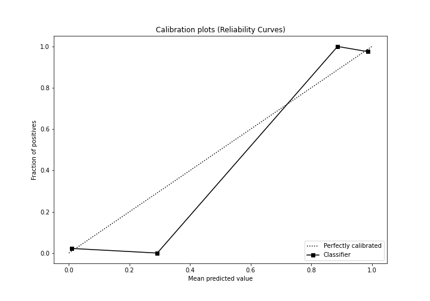

## Cumulative Gains Curve

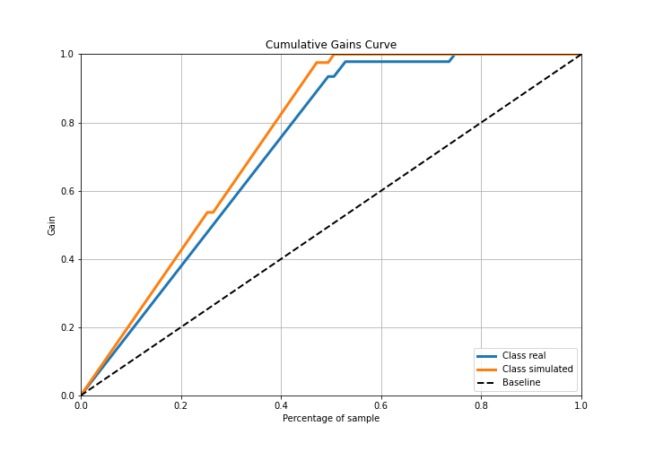

## Lift Curve

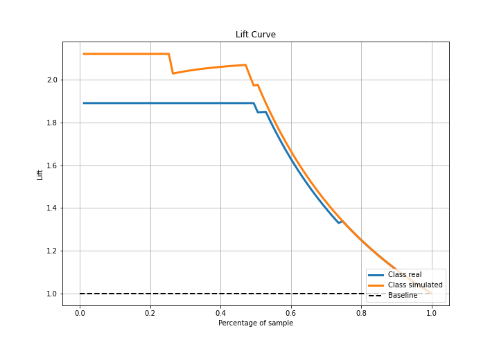

## SHAP Importance
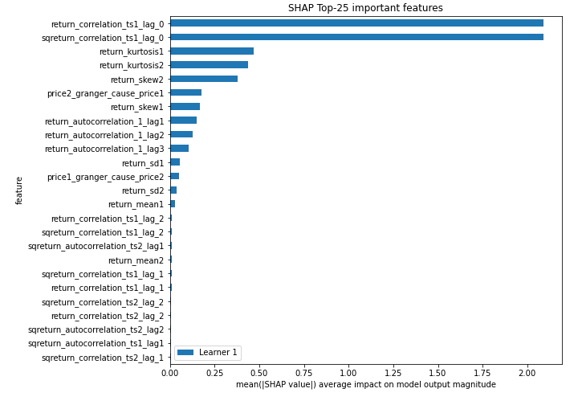

## SHAP Dependence plots

### Dependence (Fold 1)
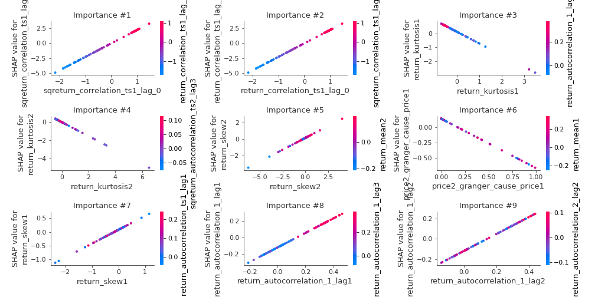

## SHAP Decision plots

### Top-10 Worst decisions for class 0 (Fold 1)
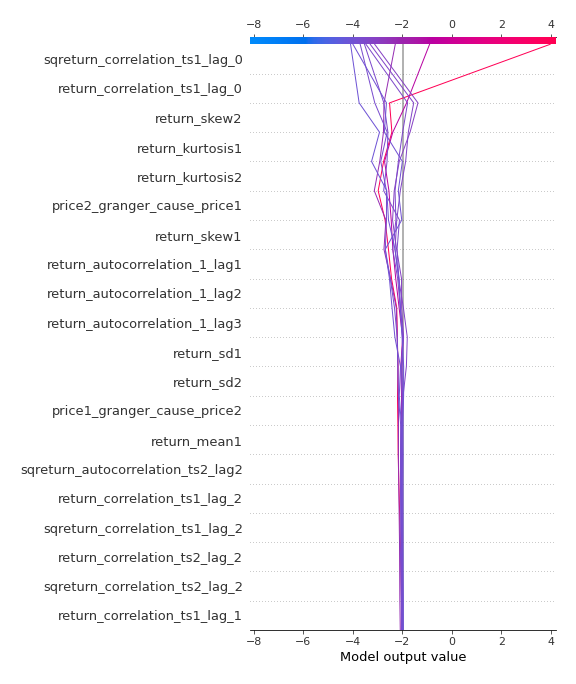
### Top-10 Best decisions for class 0 (Fold 1)
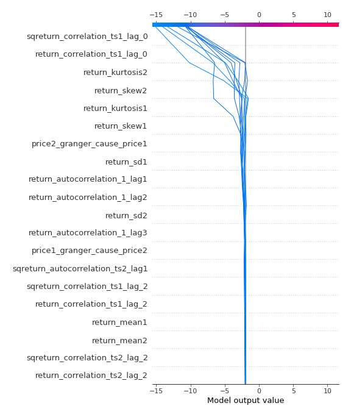
### Top-10 Worst decisions for class 1 (Fold 1)
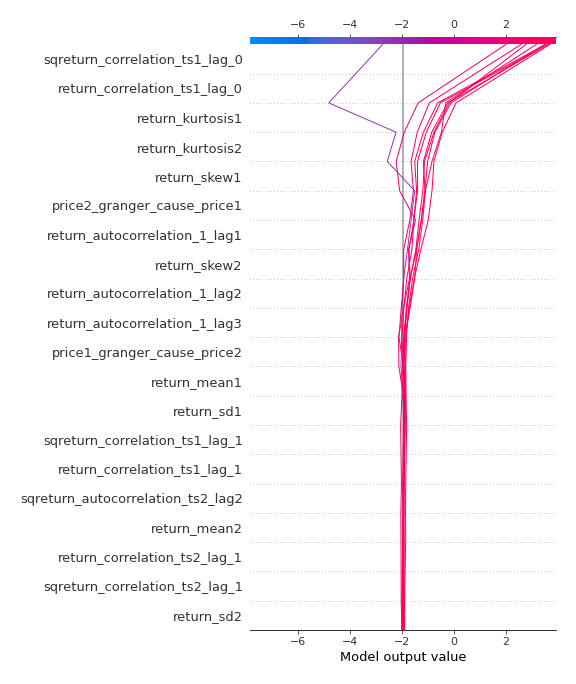
### Top-10 Best decisions for class 1 (Fold 1)
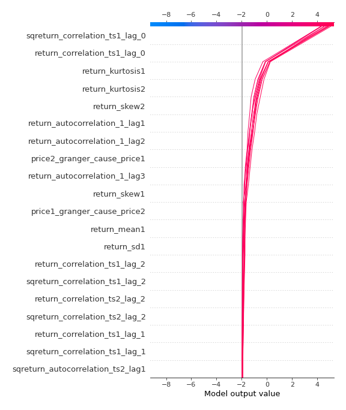

[<< Go back](../README.md)
